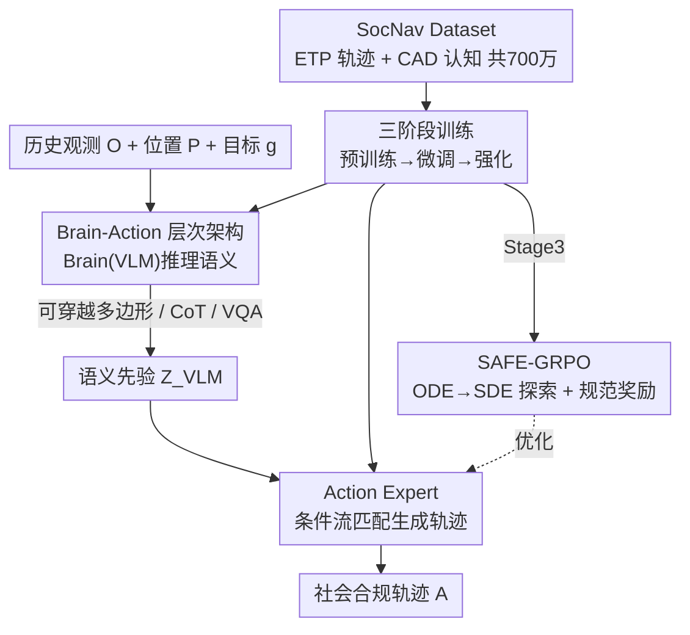

# SocialNav: Training Human-Inspired Foundation Model for Socially-Aware Embodied Navigation

**会议**: CVPR 2026  
**论文**: [CVF Open Access](https://openaccess.thecvf.com/content/CVPR2026/html/Chen_SocialNav_Training_Human-Inspired_Foundation_Model_for_Socially-Aware_Embodied_Navigation_CVPR_2026_paper.html)  
**代码**: https://amap-eai.github.io/SocialNav/ (项目页)  
**领域**: 机器人 / 具身导航  
**关键词**: 社会化导航、具身智能、流匹配、强化学习、视觉语言模型

## 一句话总结
SocialNav 用「大脑(VLM 推理)+ 行动专家(流匹配轨迹生成)」的层次化基础模型，配上 700 万样本的认知—轨迹数据集和首个面向导航的 flow-based 强化学习 SAFE-GRPO，让机器人不只是走最短路，而是走得「合乎社会规范」——相比 SOTA 成功率 +38%、社会合规率 +46%。

## 研究背景与动机
**领域现状**：视觉导航从早期 SLAM 一路发展到 GNM / ViNT / NoMaD 这类端到端学习方法；为提升泛化，近期工作（CityWalker、MBRA）开始用海量互联网视频或仿真平台来扩充训练轨迹，也有人用 VLM 增强语义理解。

**现有痛点**：绝大多数方法只盯着「最短路径规划 + 避障」，把导航当成纯几何 / 效率问题。结果是——从几何上看「最优」的轨迹，在现实里可能极不得体：横穿马路、踩过绿化草坪、闯进受限区域。对一只「机器导盲犬」这样的具身体来说，这种轨迹是不可接受的。

**核心矛盾**：社会合规不是「会不会避障」，而是「懂不懂规则」。即便把社会先验隐式埋进示范数据里，纯模仿学习(behavior cloning)也只学到表面动作的拷贝，学不到规范行为背后的因果结构——遇到新场景就垮。同时，VLM 的高层推理常常和底层动作生成「脱节」：会想不会走，会走不会想。

**本文目标**：造一个统一的基础模型，既能理解社会规范（高层语义），又能据此生成合规轨迹（低层控制），还要能像人一样把「为什么这么走」讲出来。

**切入角度**：把导航拆成「大脑—行动」两个紧耦合分支——VLM 当大脑做可解释的语义推理，流匹配专家当小脑把语义先验翻译成机器人可执行轨迹；并且认识到「光靠模仿不够」，必须用强化学习显式地奖励合规行为，才能让模型「内化规则」而非「模仿动作」。

**核心 idea**：层次化 brain-action 架构 + 大规模认知—轨迹数据 + 首个 flow-based 导航 RL(SAFE-GRPO)，用「规范感知奖励」把社会合规真正训进策略里。

## 方法详解

### 整体框架
任务被形式化为「基于视觉、以历史为条件的 point-goal 导航」：在时刻 $t$，智能体拿到最近 $n$ 帧单目观测 $O_{t-n:t}$ 及对应 2D 位置 $P_{t-n:t}$，加上目标点 $g\in\mathbb{R}^2$，要输出未来 $m$ 步动作 $A_{t+1:t+m}=\pi_\theta(O_{t-n:t},P_{t-n:t},g)$（默认 $n=m=5$）。

整套模型是一个「大脑—行动」层次结构：**Brain Module**（VLM）先做自回归文本推理，吐出可解释的语义产物（可穿越多边形 / CoT 解释 / VQA 回答），并把最后一层特征 $Z_{VLM}$ 作为语义条件交给 **Action Expert**；行动专家用条件流匹配，把这份语义先验「翻译」成机器人轨迹。两者解耦了高层推理与低层控制，又靠 $Z_{VLM}$ 保持强语义连接。模型的能力来自两套支撑：一是 700 万样本的 **SocNav Dataset**（认知 + 轨迹双模态），二是一条三阶段训练管线，最后用 **SAFE-GRPO** 强化学习把社会合规训进去。

### 关键设计

**1. Brain-Action 层次架构：把「会想」和「会走」绑在一根语义绳上**

痛点很直接——VLM 擅长语义推理但不会输出连续轨迹，端到端策略会走却不懂规则。SocialNav 把二者拆成两个紧耦合分支。**Brain Module** 是一个 VLM($\pi_{VLM}$，实现用 Qwen2.5-VL 3B)，做生成式自回归推理，产出三类可解释输出：用多边形表示的「社会可穿越区域」(人行道 / 斑马线 / 楼梯)、逐步的导航 CoT 文本解释、以及增强场景理解的 VQA 回答。**Action Expert** 专做端到端轨迹生成，受 VLM 最后一层语义特征 $Z_{VLM}$ 条件化：

$$Z_{VLM}=\pi_{VLM}(O_{t-n:t},P_{t-n:t},g),\quad A_{t+1:t+m}=\pi_{flow}(x_t,t;Z_{VLM})$$

关键在于这条 $Z_{VLM}$ 通道：高层推理与低层控制解耦（各自用最合适的范式：自回归 vs 流匹配），但语义不断流——行动专家始终「知道大脑看到了什么社会规则」。这让模型既能「看」又能「想」，再据此走出合规轨迹。

**2. SocNav Dataset：认知 + 轨迹双金字塔，700 万样本喂出社会常识**

现有具身导航语料既缺「认知知识」又缺「动作直觉」，没法同时训出推理和控制。作者自建 SocNav Dataset，由两条互补支柱组成。**Expert Trajectories Pyramid (ETP)** 是三层轨迹金字塔：底层 $D_{video}$ 200 万条来自全球城市漫步视频的伪轨迹（经 π³ 稠密三维重建 + MoGe 度量尺度对齐 + 沿路径采样 point-goal 合成）；中层 $D_{sim}$ 170 万条高保真仿真轨迹，含作者新建的 SocialGS(3,400 个 3DGS 重建真实场景,覆盖商场/街道/办公室)和 SocCity(3.37 km² Isaac Sim 动态城市，带车流人流)；顶层 $D_{real}$ 34 万条真实机器人轨迹(SCAND/Huron/Recon/CityWalker)，提供物理真实与传感一致性。**Cognitive Activation Dataset (CAD)** 灌「认知」：120 万条人工标注的社会可穿越多边形识别、用 Qwen2.5-VL-72B 生成的 82.5 万条导航 CoT、100 万条通用 VQA。两者合在一起，把「尺度 + 真实 + 认知」装进同一框架，是后续社会规范对齐的底料。

**3. 三阶段渐进式训练：先会走，再贴现实，最后懂规矩**

社会规范没法一步到位灌进去，作者用三段式逐步注入。**Stage 1 预训练**：在 ETP($D_{video}+D_{sim}$) 加 CAD($D_{cog}$) 上端到端训练，激活 VLM 的导航能力、让流模型学会预测低层 waypoint，同时靠 CoT/VQA 练推理、靠多边形预测练「可穿越区域」感知。**Stage 2 微调**：只在高质量真实机器人轨迹 $D_{real}$ 上微调，且**冻结 VLM、只优化行动专家**——既保住大脑的语义/社会推理，又让流模型适配真实世界的动力学与空间尺度，缩小 sim-to-real gap。**Stage 3 强化**：用 SAFE-GRPO 显式对齐人类社会惯例（详见设计 4）。这个「先泛化技能 → 再贴现实 → 最后对齐规范」的顺序，避免了一上来就 RL 时因缺乏先验而探索低效。

**4. SAFE-GRPO：首个 flow-based 导航强化学习，用规范奖励逼出「内化规则」**

模仿学习在社会场景里始终缺因果推理，于是作者提出 Socially-Aware Flow Exploration GRPO。难点是：流策略本身是确定性 ODE，没法探索。SAFE-GRPO 借鉴 Flow-GRPO，把确定性 ODE 转成随机 SDE 来引入探索：

$$dx_t=v_{flow}(x_t,t;Z_{VLM})\,dt+\sigma_t\,dw_t$$

其中 $\sigma_t$ 控制探索幅度，$v_{flow}$ 是流策略的速度场。与无结构随机探索不同，这里的随机性**只在流积分时注入**，而来自「大脑」的语义条件 $Z_{VLM}$ 全程固定——这份隐式先验编码了高层空间与社会线索，使探索「受控且语义对齐」，不至于在稀疏奖励里盲目乱撞。奖励显式偏向合规：

$$R=R_{social}+\lambda_{expert}R_{expert}+\lambda_{smooth}R_{smooth}+\lambda_{eff}R_{eff}$$

主奖励 $R_{social}$ 来自语义占据图 $M_{occ}$，鼓励与所有不可穿越区域保持安全余量；$R_{expert}$ 贴合专家轨迹、$R_{smooth}$ 保证运动连续、$R_{eff}$ 奖励高效抵达目标。无碰撞且社会有效的轨迹拿高奖励，模型由此把「为什么这样走」的规则内化，而不只是复刻表面动作。该阶段在 SocCity 上训练，因为它有精确路网标注、能给出可靠的奖励反馈。

### 损失函数 / 训练策略
- **Brain**：Qwen2.5-VL 3B；**Action Expert**：Diffusion Transformer，$L=12$ 层、$H=12$ 头、隐维 $D=1536$，推理时迭代去噪 $K=5$ 步。
- 预训练：全模型端到端，AdamW，3 epoch，96×H20，batch 192，lr $5\times10^{-5}$。
- 微调：只训行动专家，32×H20，batch 256，lr $1\times10^{-5}$。
- SAFE-GRPO：只优化行动专家，16×H20，rollout batch 128，lr $5\times10^{-7}$。

## 实验关键数据

在三种设置下评测：CityWalker 开环基准、自建 SocNav 闭环基准、真实机器人部署。自定义社会合规指标 **DCR(距离合规率)**：成功($s=1$)时 $\mathrm{DCR}=d_{compliant}/d_{actual}$（合规区域内行驶距离 / 总距离），失败为 0；**TCR(时间合规率)** 定义类似。SR 定义为「抵达目标 3m 内且碰撞少于 3 次」。

### 主实验

开环 CityWalker 基准（MAOE 越低越好，下为 All 列样本均值）：

| 方法 | Turn | Crossing | Proximity | All |
|------|------|----------|-----------|-----|
| GNM | 31.1 | 14.8 | 14.7 | 12.1 |
| ViNT | 31.1 | 15.4 | 14.8 | 12.6 |
| NoMaD | 35.1 | 18.5 | 18.1 | 12.1 |
| CityWalker | 26.6 | 14.1 | 14.3 | 11.5 |
| **SocialNav (Full)** | **20.1** | **8.8** | **8.9** | **7.8** |

闭环 SocNav 基准（导航性能 + 社会合规，越高越好）：

| 方法 | SR↑ | RC↑ | SPL↑ | DCR↑ | TCR↑ |
|------|-----|-----|------|------|------|
| GNM* | 43.3 | 62.4 | 37.0 | 26.5 | 28.7 |
| ViNT* | 45.6 | 66.2 | 39.5 | 31.4 | 33.8 |
| NoMaD* | 41.1 | 60.5 | 35.4 | 29.5 | 31.6 |
| CityWalker | 47.8 | 64.7 | 44.7 | 36.1 | 36.6 |
| SocialNav* | 65.0 | 78.4 | 62.3 | 58.0 | 56.7 |
| **SocialNav (Full)** | **86.1** | **91.2** | **77.4** | **82.5** | **82.9** |

相比次优的 CityWalker：SR **+38.3**、RC +26.5、SPL +32.7；DCR/TCR(82.5/82.9) 是 CityWalker(36.1/36.6) 的**两倍多**，且社会合规的提升「不以牺牲导航性能为代价」。

真实机器人部署（各环境 20 例成功数）：

| 方法 | 街道路口 | 公园 | 商场 | 平均 SR |
|------|---------|------|------|---------|
| GNM* | 9/20 | 10/20 | 8/20 | 45.0 |
| ViNT* | 7/20 | 12/20 | 8/20 | 45.0 |
| NoMaD* | 9/20 | 11/20 | 10/20 | 50.0 |
| CityWalker | 12/20 | 13/20 | 12/20 | 62.5 |
| **SocialNav (Full)** | **18/20** | **16/20** | **17/20** | **85.0** |

### 消融实验
论文用 `SocialNav*`（仅在真实数据 $D_{real}$ 上做模仿学习，对应 NoMaD*/GNM*/ViNT* 同样设置）对照 `SocialNav (Full)`（完整数据 + 三阶段 + SAFE-GRPO）作为「模型设计有效性」的拆解：

| 配置 | SR↑ | DCR↑ | TCR↑ | 说明 |
|------|-----|------|------|------|
| SocialNav (Full) | 86.1 | 82.5 | 82.9 | 完整模型 |
| SocialNav* (仅 IL on Dreal) | 65.0 | 58.0 | 56.7 | 去掉大规模 ETP/CAD 数据 + RL 阶段 |
| CityWalker | 47.8 | 36.1 | 36.6 | 最强基线 |

### 关键发现
- **架构本身就强**：即便只用 $D_{real}$ 做模仿学习，SocialNav*(SR 65.0) 已显著超过同条件下的所有基线(41~48)，说明 brain-action 层次架构和语义条件化带来的增益与数据/RL 无关。
- **社会合规靠 RL+全数据补齐**：从 SocialNav* 到 Full，SR +21.1、DCR +24.5、TCR +26.2——大规模认知—轨迹数据与 SAFE-GRPO 是把「合规率翻倍」的关键，验证了「模仿不足、必须显式奖励规则」的核心论点。
- **泛化到真实世界**：闭环全场景训练时未见，真实部署仍达 85.0 平均 SR，比 CityWalker(62.5) 高 22.5，sim-to-real 迁移有效。

## 亮点与洞察
- **「会想 + 会走」用一根语义绳绑住**：VLM 做自回归推理、流匹配做连续控制，两种最适配的范式各司其职，又靠 $Z_{VLM}$ 不断传递语义——这是解决「VLM 推理与动作脱节」的干净做法，可迁移到任何「高层语义→低层连续动作」的 VLA 任务。
- **把社会合规变成可优化奖励**：DCR/TCR 这类「合规区域行驶占比」指标 + 基于语义占据图的 $R_{social}$，把抽象的「得体」量化成可被 RL 优化的信号，是本文最「啊哈」的一步。
- **ODE→SDE 的受控探索**：随机性只注入流积分、语义条件固定，让 RL 探索「受语义约束」而非盲目——这个 trick 对任何流策略 + RL 的组合都通用。
- **数据金字塔**：互联网视频(广度)→仿真(难例)→真机(真实)三层，配合「视频伪轨迹」重建管线，给了规模化 point-goal 数据的一条可复用路径。

## 局限与展望
- **依赖标注的语义先验**：社会可穿越多边形、SocCity 路网都靠人工/规则标注，奖励 $R_{social}$ 的质量受标注覆盖度限制；遇到标注分布外的社会场景可能失效。
- **奖励是多项加权和**：$R$ 含 4 个加权项，$\lambda$ 平衡需要调参，论文把详细公式放在附录、正文未给敏感性分析（缓存全文也未含完整消融），各项贡献的拆解证据有限。⚠️ 具体权重以原文/附录为准。
- **算力门槛高**：预训练 96×H20、700 万样本，复现成本极高；3B VLM + DiT 行动专家的实时性在真实机器人上的开销也值得关注。
- **改进方向**：把社会规范从「标注监督」转为「从人类反馈自动挖掘」，或让 Brain 在线更新规范，可能进一步减少对人工标注的依赖。

## 相关工作与启发
- **vs CityWalker / ViNT / GNM / NoMaD**：这些方法围绕最短路 + 避障，要么 image-goal 要么纯几何，缺社会语义；SocialNav 用 VLM 大脑显式建模社会规范，并把合规做成可优化目标，因此在合规指标上拉开两倍差距。
- **vs 纯流匹配 VLA(如行为克隆)**：FM 在 VLA 里擅长建模多模态动作分布，但通常止于 behavior cloning，缺因果；SocialNav 在流策略上叠加 SAFE-GRPO，把「内化规则」补上。
- **vs Flow-GRPO / GRPO**：借鉴了「生成模型 + 在线 RL 做人类偏好对齐」的思路与 ODE→SDE 转换，但首次落到具身导航场景，并设计了导航专属的规范感知奖励。

## 评分
- 新颖性: ⭐⭐⭐⭐⭐ 首个 flow-based 导航 RL + 层次 brain-action 基础模型 + 合规量化指标，系统性创新
- 实验充分度: ⭐⭐⭐⭐ 开环/闭环/真机三设置 + 大规模数据，但正文缺逐项消融（在附录）
- 写作质量: ⭐⭐⭐⭐ 动机清晰、架构图与公式到位，奖励项细节略简
- 价值: ⭐⭐⭐⭐⭐ 把「社会合规」做成可训练目标，对具身导航落地（导览/配送/导盲）意义重大

<!-- RELATED:START -->

## 相关论文

- [\[CVPR 2026\] Towards Human-Like Robot Handwriting via Contour-Aware Generation](towards_human-like_robot_handwriting_via_contour-aware_generation.md)
- [\[CVPR 2026\] D3D-VLP: Dynamic 3D Vision-Language-Planning Model for Embodied Grounding and Navigation](d3d-vlp_dynamic_3d_vision-language-planning_model_for_embodied_grounding_and_nav.md)
- [\[CVPR 2026\] OctoNav: Towards Generalist Embodied Navigation](octonav_towards_generalist_embodied_navigation.md)
- [\[CVPR 2026\] RehearseVLA: Simulated Post-Training for VLAs with Physically-Consistent World Model](rehearsevla_simulated_post-training_for_vlas_with_physically-consistent_world_mo.md)
- [\[CVPR 2026\] Spatial-Aware VLA Pretraining through Visual-Physical Alignment from Human Videos](spatial-aware_vla_pretraining_through_visual-physical_alignment_from_human_video.md)

<!-- RELATED:END -->
