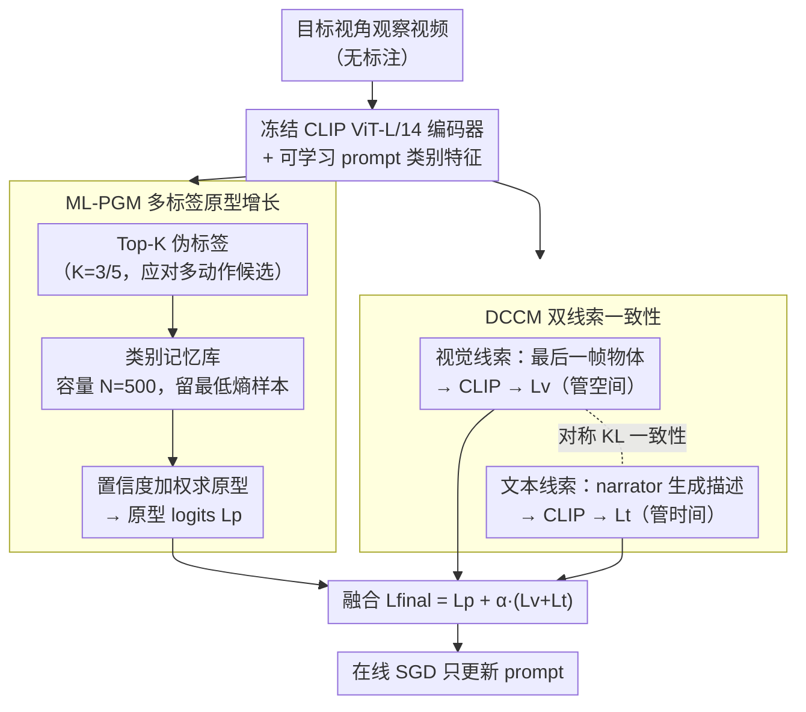

# Test-time Ego-Exo-centric Adaptation for Action Anticipation via Multi-Label Prototype Growing and Dual-Clue Consistency

**会议**: CVPR2026  
**arXiv**: [2603.09798](https://arxiv.org/abs/2603.09798)  
**代码**: [ZhaofengSHI/DCPGN](https://github.com/ZhaofengSHI/DCPGN)  
**领域**: 机器人 / Ego-Exo 视角适应  
**关键词**: test-time adaptation, Ego-Exo, Action Anticipation, Multi-Label, Prototype Learning, CLIP, 双线索一致性

## 一句话总结

首次提出 Test-time Ego-Exo Adaptation for Action Anticipation（TE2A3）任务，设计 DCPGN 网络通过多标签原型增长和双线索（视觉+文本）一致性，在测试时将源视角训练模型在线适配到目标视角进行动作预测，大幅超越现有 TTA 方法。

## 背景与动机

1. **人类跨视角能力**：人类凭借镜像神经元可以无缝切换第一人称（Ego）和第三人称（Exo）视角并预判后续动作，这一能力对人机协作和具身 AI 至关重要。
2. **现有方法依赖目标视角数据**：大多数 Ego-Exo 适应方法（预训练微调 / UDA）都需在训练阶段获取目标视角数据，带来额外的计算和数据采集成本。
3. **单视角模型跨视角失效**：在某一视角上训练好的动作识别/预测模型，直接用于另一视角时性能显著下降，因拍摄角度和风格差异巨大。
4. **测试时适应（TTA）的新机遇**：TTA 方法无需目标视角标注数据即可在线调整模型，但现有 TTA 方法面向单标签任务，难以处理多动作候选的场景。
5. **多动作候选挑战**：现实事件通常包含多个原子动作需同时预测，基于熵的 TTA 方法倾向选择最高置信度的单一类别，导致次优表现。
6. **Ego-Exo 时空差距**：两种视角在空间（不一致的布局和干扰物体）和时间（异步的动作进展）维度存在显著差异，简单域适应方法难以弥合。

## 方法详解

### 整体框架

DCPGN（Dual-Clue enhanced Prototype Growing Network）要解决的是：把在源视角（如第三人称）训练好的动作预测模型，在测试阶段、没有目标视角任何标注的情况下，在线适配到目标视角（如第一人称）。它冻结 CLIP ViT-L/14 视觉编码器，只在线更新可学习 prompt 和类别原型，靠两块组件协同——ML-PGM 渐进积累多标签知识、学无偏原型；DCCM 融合视觉与文本两路线索做一致性约束。两路各自产出 logits，最后融合成预测；训练阶段在源视角带标注数据上用 BCE 损失，测试阶段只用 SGD 在线优化可学习 prompt。

### 关键设计

**1. 多标签原型增长 ML-PGM：让测试时的伪标签别只押一个动作**

现实事件常含多个同时发生的原子动作，但基于熵的 TTA 方法天生偏向最高置信度的单一类别，于是把"切菜+拿碗"这类组合压成一个类，表现次优。ML-PGM 改成多标签：对每个测试样本取预测 logits 的 Top-K 作为伪标签（EgoMe-anti 上 $K=3$、EgoExoLearn 上 $K=5$），避免过度自信。为保证原型可靠，每个类别维护容量 $N=500$ 的记忆库，满了就只保留熵最低（最确定）的 $N$ 个样本，使库里样本质量随时间递增；再用归一化置信度对库内表征加权求和得到原型 $p_i^T = \sum_{k=1}^{N'} \eta(l_{i,k}^T)\cdot\bar{f}_{v,k}^T$，压住负类噪声。最后拿测试样本表征与各类原型算相似度得到原型 logits $L_p$。

**2. 双线索一致性 DCCM：用视觉的空间线索和文本的时间线索互相校准**

Ego 和 Exo 之间既有空间差（布局、干扰物不一致）又有时间差（动作进展异步），单靠视觉很难弥合。DCCM 同时取两路线索：视觉线索取观察视频最后一帧，带场景里的物体信息（管空间）；文本线索引入一个轻量 narrator（GRU+注意力，用开源视频-文本对预训练、测试时冻结），从帧特征生成描述文本，当作动作进展的时间指示器（管时间）。两路都用冻结 CLIP 编码，与带可学习 prompt 的类别特征算相似度得到 $L_v$ 和 $L_t$，再对二者的 softmax 分布施加对称 KL 散度 $L_C = \mathrm{KL}(P_v \| P_t) + \mathrm{KL}(P_t \| P_v)$，强制跨模态线索一致——等于把"看到什么物体"和"动作进行到哪一步"拧到一起，显式地把 Ego-Exo 的时空鸿沟补上。

### 最终预测与损失

三路 logits 融合给出最终预测：

$$L_{final} = L_p + \alpha \cdot (L_v + L_t), \quad \alpha = 0.5$$

测试阶段只用 SGD 在线优化可学习 prompt，不需要任何数据增强。

## 实验关键数据

### 主实验（class-mean Top-5 recall）

| 方法 | EgoMe-anti Exo2Ego Noun/Verb | EgoMe-anti Ego2Exo Noun/Verb | EgoExoLearn Exo2Ego Noun/Verb | EgoExoLearn Ego2Exo Noun/Verb |
|---|---|---|---|---|
| 无适应 | 71.94 / 32.46 | 64.24 / 30.07 | 31.91 / 34.36 | 35.28 / 33.03 |
| ML-TTA | 77.11 / 36.92 | 69.46 / 34.39 | 36.35 / 37.67 | 42.96 / 40.43 |
| **DCPGN（本文）** | **79.03 / 43.84** | **72.01 / 40.10** | **46.26 / 42.98** | **48.48 / 46.51** |

在 EgoExoLearn Exo2Ego 上，DCPGN 比 ML-TTA 在 Noun 上高 **9.91%**，Verb 上高 **5.31%**。

### 消融实验

| 配置 | EgoMe-anti E2E Noun | EgoExoLearn E2E Noun |
|---|---|---|
| 完整 DCPGN | 79.03 | 46.26 |
| 去除一致性损失 $L_C$ | 78.67（-0.36） | 44.80（-1.46） |
| 去除视觉线索 | 76.92（-2.11） | 41.32（-4.94） |
| 去除文本线索 | 77.56（-1.47） | 41.94（-4.32） |
| 去除整个 DCCM | 76.11（-2.92） | 38.43（-7.83） |
| 去除置信度加权 | 74.63（-4.40） | 37.76（-8.50） |
| 仅单标签分配 | 72.74（-6.29） | 34.70（-11.56） |

关键发现：视觉线索对 Noun 预测更重要，文本线索对 Verb 预测更关键；多标签分配比单标签分配提升巨大。

### 模型复杂度

| 组件 | FLOPs (G) | Params (MB) |
|---|---|---|
| Baseline | 367.55 | 251.18 |
| ML-PGM | +0.00 | +8.54 |
| Narrator | +0.03 | +2.38 |
| 文本线索编码 | +4.06 | +54.04 |

ML-PGM 几乎零额外计算量，narrator 极其轻量。

## 亮点

1. **首创 TE2A3 任务**：首次将 TTA 引入 Ego-Exo 跨视角动作预测，无需目标视角训练数据
2. **多标签原型增长机制**：通过 Top-K 伪标签分配 + 熵优先队列 + 置信度加权，有效解决多动作候选的平衡问题
3. **双线索互补设计巧妙**：视觉线索捕获空间物体信息，文本线索捕获时间动作进展，通过 KL 散度一致性约束显式弥合 Ego-Exo 时空鸿沟
4. **新基准 EgoMe-anti**：基于 EgoMe 数据集构建了适合该任务的新 benchmark
5. **性能提升显著**：在 EgoExoLearn 上 Noun 指标超越次优 9.91%，实验充分且分析深入

## 局限与展望

1. **narrator 依赖额外训练数据**：narrator 需用开源视频-文本对预训练，增加了方法的前置依赖
2. **K 值需手动调整**：不同数据集最优 K 值不同（3 vs. 5），缺乏自适应选择机制
3. **记忆库容量固定**：N=500 为人工设定，不同类别数据分布差异大时可能次优
4. **仅评估 Noun/Verb 分类**：未涉及更细粒度的时间定位或完整事件预测
5. **实时性讨论缺失**：虽声称"在线适应"但未报告推理延迟和实际部署可行性

## 与相关工作的对比

- **vs. Tent/TPT/TDA 等传统 TTA**：这些方法面向单标签任务，在多动作候选场景下过度偏向高置信度类别，DCPGN 的多标签机制解决了这一根本限制
- **vs. ML-TTA**：ML-TTA 虽面向多标签但针对图像级分类，缺乏视频级时空建模和 Ego-Exo 视角差异处理能力
- **vs. UDA 方法（Sync, GCEAN）**：UDA 方法训练时需访问目标视角无标注数据，而 DCPGN 完全在测试阶段在线适应
- **vs. 预训练-微调方法（AE2, Exo2EgoDVC）**：这些方法需目标视角标注数据进行微调，DCPGN 无此需求

## 评分

- 新颖性: ⭐⭐⭐⭐ — 首创 TE2A3 任务，多标签原型增长 + 双线索一致性的组合设计新颖
- 实验充分度: ⭐⭐⭐⭐⭐ — 两个 benchmark、四种设置、详尽消融、可视化分析均到位
- 写作质量: ⭐⭐⭐⭐ — 问题定义清晰，方法描述规范，图表完善
- 价值: ⭐⭐⭐⭐ — 为人机协作/具身 AI 中的跨视角在线适应提供了实用范式

<!-- RELATED:START -->

## 相关论文

- [\[CVPR 2026\] Learning a Unified Latent Action Space from Videos with Action-centric Cycle Consistency](learning_a_unified_latent_action_space_from_videos_with_action-centric_cycle_con.md)
- [\[CVPR 2026\] Test-Time Perturbation Tuning with Delayed Feedback for Vision-Language-Action Models](test-time_perturbation_tuning_with_delayed_feedback_for_vision-language-action_m.md)
- [\[CVPR 2026\] Global Prior Meets Local Consistency: Dual-Memory Augmented Vision-Language-Action Model for Efficient Robotic Manipulation](global_prior_meets_local_consistency_dual-memory_augmented_vision-language-actio.md)
- [\[ICML 2026\] Test-Time Training for Visual Foresight Vision-Language-Action Models](../../ICML2026/robotics/test-time_training_for_visual_foresight_vision-language-action_models.md)
- [\[ICCV 2025\] PacGDC: Label-Efficient Generalizable Depth Completion with Projection Ambiguity and Consistency](../../ICCV2025/robotics/pacgdc_label-efficient_generalizable_depth_completion_with_projection_ambiguity_.md)

<!-- RELATED:END -->
