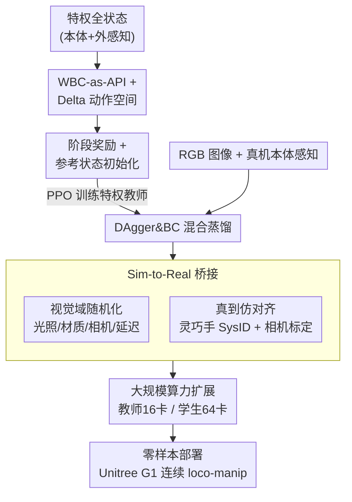

# VIRAL: Visual Sim-to-Real at Scale for Humanoid Loco-Manipulation

**会议**: CVPR 2026  
**论文**: [CVF Open Access](https://openaccess.thecvf.com/content/CVPR2026/html/He_VIRAL_Visual_Sim-to-Real_at_Scale_for_Humanoid_Loco-Manipulation_CVPR_2026_paper.html)  
**代码**: [viral-humanoid.github.io](https://viral-humanoid.github.io)（项目页，未注明开源代码）  
**领域**: 机器人 / 具身智能  
**关键词**: 人形机器人, Sim-to-Real, 视觉运动操控, 师生蒸馏, 域随机化

## 一句话总结
VIRAL 完全在仿真里训练人形机器人「边走边操作」（loco-manipulation）的视觉策略，靠「特权教师 → RGB 学生」蒸馏 + 大规模视觉域随机化 + 真到仿对齐，把只看 RGB 图像的策略零样本部署到 Unitree G1，能连续 54 个循环在两张桌子间走动、抓取、放置物体，接近专家级遥操作水平。

## 研究背景与动机
**领域现状**：人形机器人被视为通用物理智能的天然载体，但当前真正缺的是「自主 loco-manipulation」——在机载感知下，把行走和操作紧耦合起来，长时程地完成有用任务。现有系统要么只做「盲走」（blind locomotion，无环境感知）、要么只做固定底座的桌面操作、要么严重依赖人类遥操作或外部动捕传感器，极少有人能用机载传感器在真机上做自主 loco-manipulation。

**现有痛点**：最近一条热门路线是照搬大语言模型配方——收集海量真实世界遥操作数据训练「机器人基础模型」。但移动操作面对的变化远比固定桌面多，所需数据量更大；当移动平台是高自由度、安全约束严、遥操作栈复杂的人形机器人时，每个数据点的采集成本进一步飙升。把人形移动操作当成「又一个数据问题」，所需规模在实践中可能贵到不可承受。

**核心矛盾**：仿真本可低成本生成海量数据，sim-to-real 在腿足运动上已是事实标准；但操作领域仍被「真实数据模仿学习」主导，sim-to-real 成功大多局限于桌面、窄任务。更糟的是，运动和操作的 sim-to-real 通常被孤立研究——运动工作忽略操作，操作工作默认底座固定。两者怎么在一个机载 RGB 策略里统一，且真能 transfer，仍是空白。

**本文目标**：回答一个工程问题——「视觉 sim-to-real 能否让人形机器人在机载感知下做有用的 loco-manipulation？」作者明确表示**不打算提出新的 RL 或 sim-to-real 算法**，而是给出一套让「基于 RGB 的人形 loco-manipulation 在实践中跑通」的全栈技术配方：哪些设计真正关键、它们在哪里失败、彼此如何交互。

**切入角度**：把经典的 visual sim-to-real 思路重新放到人形 loco-manipulation 语境里，并把系统推到现代规模——更高的仿真保真度、更大的 GPU 算力、真实人形硬件。一个反复出现的观察是：**算力规模是决定成败的关键变量**，扩到几十张 GPU（最多 64 张）才能让教师和学生训练稳定，低算力常常直接失败。

**核心 idea**：用「特权教师 RL（全状态）→ RGB 学生蒸馏」的师生框架，配合大规模视觉域随机化和真到仿硬件对齐，把只依赖机载 RGB + 本体感知的策略零样本搬上真机。

## 方法详解

### 整体框架
VIRAL 的目标是产出一个**只看 RGB 图像 + 本体感知**、能直接零样本部署到 Unitree G1 的端到端策略。整条管线分两阶段蒸馏 + 一层 sim-to-real 桥接：

**Phase 1（教师）**：在仿真里训一个**特权 RL 教师**，它能访问全状态信息（特权本体感知 + 特权外感知，如物体/桌子相对位姿、抓放目标、当前阶段）。教师不学底层电机控制，而是**站在预训练好的全身控制器（WBC，用 HOMIE）之上**，输出高层 WBC 指令（行走速度/朝向增量 + 手臂/手指关节增量）。因为不渲染图像，教师只用 16 张 L40S（2 节点 ×8）就能跑。

**Phase 2（学生）**：把教师蒸馏成一个**只看 RGB + 真机可得本体感知**的视觉学生。蒸馏用大规模带渲染的仿真（Isaac Lab 的 tiled rendering，64 张 GPU / 8 节点），学生通过**在线 DAgger + 行为克隆（BC）的混合**模仿教师动作。

**Sim-to-Real 桥接**：在学生训练时对图像质量、光照、材质、相机内外参、传感延迟做大规模随机化；同时做**真到仿对齐**——对高减速比的三指灵巧手做系统辨识（SysID）、对相机外参做标定。最后学生策略**不做任何真机微调**直接部署。

### 关键设计

**1. WBC-as-API + Delta 动作空间：把策略动作锁进安全可靠区**

人形机器人 29 自由度、安全约束强，从零学底层电机技能既难训又难迁移。VIRAL 的做法是让教师**不直接输出绝对关节目标**，而是输出高层 WBC 指令——用 HOMIE 作为底层全身控制器（提供稳定下肢行走 + 多样上肢姿态），VIRAL 在其速度/高度/上肢关节指令接口上**扩展出手指动作**，组成完整动作空间 $a_t = (\Delta v_t, \Delta \omega^{yaw}_t, \Delta q^{arm}_t, \Delta q^{finger}_t)$。这层 API 把策略能产生的动作限制在「安全且可靠的人形运动子集」里，显著提升可部署性，作者也强调框架不过拟合某个特定 WBC，可换其他控制器。

关键的是动作用**增量（delta）而非绝对值**：策略输出的增量被累加进 WBC 指令。这与腿足运动 RL 文献常用绝对关节目标的惯例相反，但实测 delta 表示**显著加速并稳定了 RL 训练**——消融里只有 delta-action 教师能可靠解出任务，绝对动作版本无法达到高成功率（Figure 9）。

**2. 阶段奖励 + 参考状态初始化（RSI）：用人类示范喂给 RL 强先验**

长时程的「走→放→抓→转」技能对高自由度人形来说，纯 RL 探索极难，重度奖励工程往往还是得到次优或迁移差的策略。VIRAL 两手抓：一是**把任务切成阶段**，定义四类奖励——走向物体 $r_{walk}=\exp(-4(\|p_{robot}-p_{GraspObj}\|-0.45)^2)$、近托盘时放置 $r_{place}=-\|f_{PlaceObj}\|\cdot\mathbb{1}(\|p_{PlaceObj}-p_{tray}\|<0.3)$、抓取（抬高奖励 + 目标距离奖励 $r_{grasp\text{-}goal}=\exp(-10\|p_{GraspObj}-p_{goal}\|^2)$）、转身 $r_{turn}=-|y_{robot}-y_{desired}|$。

二是**参考状态初始化**：采集 200 条遥操作的仿真示范作为「状态初始化缓冲区」，每次 episode 重置时随机采一个示范快照，把机器人、物体、桌子都按它初始化。这让策略**在还没能力从零走到那些状态之前，就提前被暴露在各阶段的高回报状态附近**，等于用人类抓放姿态当强先验做「参考偏置探索」，大幅降低对脆弱奖励调参的依赖。消融显示这一招是必需的——没有 RSI，教师很快在 10% 成功率以下停滞；有 RSI 则逼近 95%（Figure 9）。

**3. DAgger & BC 混合蒸馏：兼顾快速起步与抗误差累积**

把特权教师蒸馏成只看 RGB 的学生时，纯 BC 和纯 DAgger 各有硬伤。VIRAL 用**同一个 MSE 目标**、在「教师诱导 + 学生诱导」两种观测分布的混合上训练：

$$\mathcal{L}_{distill} = \mathbb{E}_{o_t\sim d^o}\big[\|\pi_{teacher}(o^{teacher}_t)-\pi_{student}(o^{student}_t)\|_2^2\big],\quad d^o \approx \lambda\, d^o_{\pi_{teacher}} + (1-\lambda)\, d^o_{\pi_{student}}$$

DAgger 与 BC 的唯一区别在于观测来自谁的 rollout：**教师 rollout** 提供干净、近最优的示范，快速给学生打上强先验（BC 的快速初始化优势）；**学生 rollout** 把学生暴露在教师理想分布之外的状态，对「部署时纠错鲁棒性、防止误差累积」至关重要（DAgger 的状态覆盖优势）。混合比 $\lambda$ 是教师 rollout 环境占比，$\lambda=1$ 是纯 BC、$\lambda=0$ 是纯 DAgger。消融发现纯 BC（$\lambda=1$）loss 降得快但策略脆、无法纠正自身错误、在 Isaac→MuJoCo 和真机上都差；引入学生 rollout（$\lambda=0.5$）虽略慢但部署成功率大涨，故默认 $\lambda=0.5$（Figure 11）。学生视觉骨干用 SOTA 图像编码器（DINOv3），与本体感知融合后送策略头，骨干和带历史的策略头（MLP vs LSTM）都做了消融。

**4. 视觉域随机化 + 真到仿对齐：从两端一起收窄 reality gap**

sim-to-real 的核心是让仿真分布覆盖真实分布。VIRAL 在**仿真端做大规模随机化**：图像质量（亮度/对比度/色相/饱和度/高斯噪声/模糊）、相机外参（应对小位姿漂移）、相机延迟（建模传输时延）、用 dome-light 改全局光照、随机化地面/桌子/物体/机器人的材质与颜色。消融聚焦三个主导分量——材质（M）、dome 光（D）、相机外参（E）：关掉全部随机化成功率掉到 0.649（降 35.1%），去掉任一单项都掉点，说明这些随机化是**互补的、共同构成鲁棒 sim-to-real 的关键流水线**（Figure 13）。

**真机端则做对齐**收窄那些随机化也补不上的系统性偏差：① **灵巧手 SysID**——Unitree G1 的三指手用高减速比电机，仿真与真实存在显著失配，作者定义真机抓-放原语、在仿真里回放同一动作序列，对手指 armature/刚度/阻尼做 SysID，让仿真关节轨迹对齐真实测量（Figure 5）。② **相机外参对齐**——内参按厂商规格匹配，但 G1 各台机器外参因机械公差不同、还会随时间漂移，于是用「渲染图与真实图视觉匹配」做轻量真到仿外参标定，再叠加训练时的外参随机化，让学生对硬件视角差异鲁棒（Figure 6）。

**5. 算力规模本身就是关键设计：教师/学生都要扩到几十张 GPU**

这是论文反复强调、几乎当成一等公民的发现：带渲染的视觉仿真比纯物理慢至少一个数量级，作者基于 TRL + Accelerate 实现可跨多 GPU/节点近线性扩展、又保留单卡训练简洁性的分布式系统。教师训练从 1 扩到 16 卡时，不仅收敛更快（早期甚至超线性加速），更重要的是**渐近性能**——1~2 卡时教师远低于目标停滞、永远到不了高成功率，8~16 卡才能稳定推过 90%（Figure 14）。学生从 1 扩到 64 卡同样收敛更快、loss 更平滑、最终成功率略高（Figure 15）。结论是：大规模算力不是锦上添花，而是可靠学习长时程视觉 loco-manipulation 的**实践必需品**。

## 实验关键数据

部署平台为 29-DoF Unitree G1（配 7-DoF 三指灵巧手），感知用 Intel RealSense D435i，推理在 i9-14900K + RTX 4090 的工作站上完成。

### 主实验：真机鲁棒性与对比遥操作

任务是「在两张桌子间反复走动、放置一个物体、抓取新物体、转身」的连续 loco-manipulation。

| 对比对象 | 成功率 | 单循环时间 | 说明 |
|--------|------|---------|------|
| **VIRAL（RGB 策略）** | **54/59 ≈ 91.5%** | 20.2 s | 零样本，无真机微调 |
| 专家遥操作（>1000h 经验） | 100% | 21.4 s | 同一 HOMIE 底层策略 |
| 非专家遥操作（约 1h 经验） | 73% | 显著更慢 | — |

VIRAL 接近专家级成功率、且**比专家更快**（20.2 s < 21.4 s），并在可靠性和效率上大幅超过非专家，显示出在辅助遥操作中降低人力负担的潜力。泛化实验（Figure 8）系统性改变托盘起始位置、机器人初始姿态、桌高/桌型/桌布颜色、光照、物体类别，VIRAL 无需额外调参就能稳定完成，作者归因于域随机化和 RL 本身的鲁棒性。

### 消融实验

| 配置 | 关键现象 | 结论 |
|------|---------|------|
| 教师 w/o RSI | 成功率 <10% 即停滞 | RSI 是训练必需（vs 全量 ~95%） |
| 教师 absolute action | 无法达到高成功率 | delta 动作空间是必需 |
| 学生 $\lambda=1$（纯 BC） | loss 降得快但策略脆、不能纠错 | 纯 BC 不可用 |
| 学生 $\lambda=0.5$（DAgger+BC） | 部署成功率大涨 | 选作默认 |
| 视觉随机化全关 | 归一化成功率降到 0.649（−35.1%） | 随机化是鲁棒迁移关键 |
| 去掉 M / D / E 任一项 | 均掉点 | 三类随机化互补 |
| 教师 1–2 GPU | 远低于目标、停滞 | 低算力直接失败 |
| 教师 8–16 GPU | 稳定 >90% | 大规模算力必需 |
| 学生 single-object（仅圆柱） | 各类物体成功率均更低 | 多物体训练泛化更好 |

### 关键发现
- **RSI 和 delta 动作空间是教师能否训出来的两个生死开关**：缺任一，教师都困在低成功率，去掉 RSI 直接从 95% 掉到 10% 以下，是掉点最猛的单一因素。
- **纯 BC 的脆弱性是 sim-to-real 的隐形杀手**：BC loss 看着漂亮，但策略不会纠正自己的错误，在 Isaac→MuJoCo 和真机上崩；必须靠学生 rollout（DAgger）补状态覆盖。
- **算力是渐近性能的硬约束而非只影响速度**：低算力不是「慢点能到」，而是根本到不了高成功率——这是论文最反直觉、也最被强调的发现。
- **多物体训练换来真泛化**：仅用圆柱训练的策略在十类物体上每一类都更差，多物体训练每一类都更好。

## 亮点与洞察
- **把 WBC 当成 API 层**是很可复用的工程思路：策略只学高层指令、底层交给稳定控制器，既缩小动作空间到安全区、又解耦了「能换 WBC 控制器」，让 sim-to-real 的可部署性大增。
- **诚实地把「算力」写成一等公民设计**：大多数论文会把 scaling 藏进附录，VIRAL 直接把「低算力会失败」当核心结论之一，并用 1→16、1→64 的曲线证明渐近性能依赖算力——这对复现者是极有价值的预警。
- **两端夹击收窄 reality gap**：仿真端随机化（让策略别过拟合特定外观）+ 真机端 SysID/外参对齐（修系统性偏差）的分工很清晰，值得迁移到任何 visual sim-to-real 任务。
- **delta 动作空间反直觉地优于绝对动作**，且对人形 loco-manipulation 是决定性的——和腿足 RL 常规相反，提示「动作参数化」在高自由度耦合任务里需要重新审视。

## 局限与展望
- **作者承认的局限**：完全依赖仿真覆盖真实分布有上限，未来想引入离线数据集提升数据效率、自动化奖励与课程设计以应对更复杂任务，并把 sim-to-real 与真实世界模仿学习、基础模型结合，而非只靠仿真。
- **自己发现的局限**：① 论文定位为「技术配方」而非新算法，方法各组件（teacher-student、DAgger、域随机化、RSI）多为已有思路的组合，贡献在系统集成与规模化验证；② 评测任务相对单一（两桌间走-抓-放-转），泛化实验虽多但仍在该任务族内，跨任务族的可迁移性未验证；③ 算力门槛极高（64 卡 L40S），普通团队难以复现，"低算力会失败"的结论也意味着方法对资源敏感；④ 灵巧手 SysID 和相机外参对齐是逐机器人/逐硬件的工程开销，规模化部署时成本不低。
- **改进思路**：把 RSI 的示范来源从遥操作扩展到自动生成轨迹以降低人力；探索算力受限时的高效替代（如更省渲染的表示、课程式逐步引入视觉）；引入真实数据做少量 fine-tune 以突破纯仿真分布的覆盖上限。

## 相关工作与启发
- **vs 腿足 sim-to-real（盲走 / 深度 / RGB 导航）**：盲走策略鲁棒但无环境感知，深度/LiDAR 改善落脚点却缺语义，RGB+语言导航又依赖高延迟 VLA 模型；VIRAL 蒸馏出紧凑的 RGB 视觉运动策略，做到实时、目标条件化的运动，且不牺牲 sim-to-real 可扩展性。
- **vs 操作 sim-to-real（如 OpenAI Dactyl、桌面师生蒸馏）**：域随机化驱动的 RGB 操作 sim-to-real 已有大量进展，但**大多局限于固定底座的桌面设置**；VIRAL 把「特权教师→RGB 学生蒸馏 + 随机化」这套范式扩展到移动的人形 loco-manipulation。
- **vs loco-manipulation 既有工作（模块化解耦 / 端到端全身 / 模仿学习 VLA）**：现有方法要么解耦腿臂控制、要么依赖大规模真实数据集与 VLA 模型（数据贵、可能不鲁棒）；VIRAL 用一个完全在仿真训练的 RGB 端到端策略统一各层，实现零样本人形 loco-manipulation，不需要真机示范或大模型。

## 评分
- 新颖性: ⭐⭐⭐⭐ 不提新算法，但首次把视觉 sim-to-real 全栈推到真人形 loco-manipulation 规模并跑通，系统性贡献扎实。
- 实验充分度: ⭐⭐⭐⭐⭐ 真机 59 次试验 + 9 组消融（RSI/动作空间/骨干/DAgger 比例/历史/随机化/教师算力/学生算力/物体泛化），把每个设计的失败模式都拆开了。
- 写作质量: ⭐⭐⭐⭐ 「技术配方」定位清晰、动机诚实，公式与消融对应明确；部分组件描述偏工程报告式。
- 价值: ⭐⭐⭐⭐⭐ 给「RGB 人形 loco-manipulation 实践跑通」提供了可借鉴的全栈蓝图，对具身智能落地有直接参考价值。

<!-- RELATED:START -->

## 相关论文

- [\[CVPR 2026\] Opening the Sim-to-Real Door for Humanoid Pixel-to-Action Policy Transfer](opening_the_sim-to-real_door_for_humanoid_pixel-to-action_policy_transfer.md)
- [\[CVPR 2026\] GeCo-SRT: Geometry-aware Continual Adaptation for Cross-Task Sim-to-Real Transfer](geco-srt_geometry-aware_continual_adaptation_for_cross-task_sim-to-real_transfer.md)
- [\[ICLR 2026\] D-REX: Differentiable Real-to-Sim-to-Real Engine for Learning Dexterous Grasping](../../ICLR2026/robotics/d-rex_differentiable_real-to-sim-to-real_engine_for_learning_dexterous_grasping.md)
- [\[CVPR 2026\] Humanoid Generative Pre-Training for Zero-Shot Motion Tracking](humanoid_generative_pre-training_for_zero-shot_motion_tracking.md)
- [\[CVPR 2026\] Towards Motion Turing Test: Evaluating Human-Likeness in Humanoid Robots](towards_motion_turing_test_evaluating_human-likeness_in_humanoid_robots.md)

<!-- RELATED:END -->
