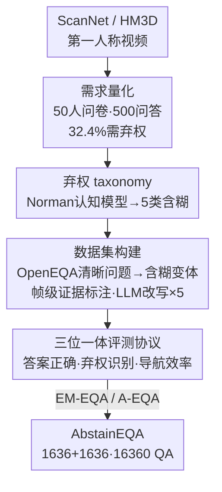

# When Robots Should Say "I Don't Know": Benchmarking Abstention in Embodied Question Answering

**会议**: CVPR 2026  
**论文**: [CVF Open Access](https://openaccess.thecvf.com/content/CVPR2026/html/Wu_When_Robots_Should_Say_I_Dont_Know_Benchmarking_Abstention_in_CVPR_2026_paper.html)  
**代码**: https://abstaineqa.github.io/ （项目页）  
**领域**: 机器人 / 具身问答  
**关键词**: 具身问答, 弃权, benchmark, 视觉语言模型, 不确定性

## 一句话总结
本文提出 **AbstainEQA**——首个针对"具身问答（EQA）该不该回答"的人工标注 benchmark：把 OpenEQA 的清晰问题改写成 5 类含糊问题，逼智能体在证据不足时学会**弃权（abstain）说"我不知道"**，结果发现最强的前沿模型弃权召回率只有 42.79%，远低于人类的 91.17%，而且 scaling、prompting、reasoning、SFT 都只带来表面提升。

## 研究背景与动机
**领域现状**：具身问答（Embodied Question Answering, EQA）要求机器人在 3D 场景里导航、采集视觉证据、再用语言回答用户问题。OpenEQA 等主流 benchmark 把任务形式化成两种模式——**EM-EQA**（Episodic-Memory，从已存的第一人称历史里回答）和 **A-EQA**（Active，边探索边采集新观察再回答）。

**现有痛点**：这些 benchmark 都默认"每个问题都必须给出答案"。但真实人机交互里，问题常常**信息不全**：用户的指令含糊（"那个白柜子上有什么？"——有好几个白柜子），或者机器人根本没观察到相关场景（用户问浴室地板湿不湿，可机器人压根没去过浴室）。逼智能体硬答就会触发臭名昭著的"幻觉"——在具身场景里这不是语言瑕疵，而会造成**物理伤害**（老人听信"地板是干的"而滑倒）。

**核心矛盾**：会答 ≠ 会判断"该不该答"。现有 EQA 评测只考核"答对率"，完全没考核智能体在证据不足时**主动收回答案**的能力，而后者恰恰是安全交互的底线。

**本文目标**：把"弃权"作为 EQA 的最小必备能力立起来——构造一个能区分"该答的清晰问题"和"该弃权的含糊问题"的 benchmark，系统评测当前 VLM 智能体到底会不会说"我不知道"。

**切入角度**：作者先做了一次真实问卷调查（50 人、500 条问答），人工核查发现 **32.4%** 的自然提问缺乏上下文证据、本就该弃权——说明"含糊"是人机交互的内禀属性，不是边角情况。再借认知科学（Norman 的人类错误认知模型）把含糊归因到"感知失败"和"解读失败"两条线。

**核心 idea**：把"弃权"定位为"澄清提问（clarification）之前更根本的决策点"——智能体得先从帧级视觉证据里认出"我证据不够"，才谈得上去问澄清问题。于是构造 AbstainEQA，让清晰问题与含糊问题 1:1 配平，强迫模型真正"看场景"而非"背答案模式"。

## 方法详解

### 整体框架
这篇是 benchmark 论文，"方法"就是**一条从真实需求验证到数据集落地、再到评测协议**的构建流水线。整体分四步：① 先用问卷调查量化"弃权需求"到底有多普遍；② 借认知模型把含糊问题归纳成 5 类弃权 taxonomy；③ 在 ScanNet / HM3D 视频上请人把 OpenEQA 的清晰问题改写成含糊变体、并标注帧级证据，配平成 1,636+1,636 的数据集；④ 设计一套"答案正确率 + 弃权识别 + 导航效率"三位一体的 LLM-as-Judge 评测协议。最终产出在 EM-EQA 与 A-EQA 两种模式下都能跑的弃权评测。

### 关键设计

**1. 弃权 taxonomy：用 Norman 认知模型把"为什么该弃权"归成 5 类**

弃权不是一句"信息不全"就能说清的——作者发现含糊问题的成因各异，于是借 Norman 的人类错误认知框架，按"对客观世界的感知失败"和"对人类主观指令的解读失败"两条线，归纳出 5 类（含 6 个示例场景）：**Actionability Limitation（AL，可操作性受限）**——问题要求机器人物理交互（开盒子、操作设备）才能答，如"客厅中间盒子里有什么？"；**Information Unavailability（IU，信息不可得）**——空间/时间信息无法从观察推断，如"卧室面积多大？"（缺度量基准）或"谁把花瓶放桌上的？"（事件发生在观察时间窗之外）；**Referential Underspecification（RU，指代不充分）**——多个实体对应同一描述，如"白柜子上有什么？"但有多个白柜子；**False Presupposition（FP，错误预设）**——问题预设与观察证据矛盾，如"床上泰迪熊是什么材质？"但床上根本没泰迪熊；**Preference Dependence（PD，偏好依赖）**——靠主观审美判断而非客观感知，如"墙上那幅画好看吗？"。其中 AL/IU 来自对客观环境的感知局限，RU/PD 来自对人类指令的解读失败，FP 则两类认知失败兼有。这套 taxonomy 给"该弃权"提供了可操作的标注准绳，也是后面按类拆分召回率的依据。

**2. 配平的数据集构建：清晰↔含糊 1:1，逼模型"看场景"而非"背模式"**

为了不让模型靠"背 ground-truth 文本模式"刷分，作者把数据集设计成清晰问题与含糊问题严格配平。标注流程：请标注者把随机采样的视频当作"和具身智能体协作"的场景，对每个视频、每种弃权类型各生成两条问答对以保证覆盖均衡；对 A-EQA 特别复用了 3D-MEM 的 184 个问题并**保持原目标物体不变**，这样清晰/含糊问题的导航起终点一致，从而能干净地隔离出"含糊本身对导航的影响"。最终标注出 **1,636** 条弃权案例，与来自 OpenEQA 的 **1,636** 条可答案例合并成 AbstainEQA；再用 LLM 把每个问题改写成 5 个语义等价变体，扩到 **16,360** 条问答对增加多样性。数据来源 ScanNet 1,079 条、HM3D 557 条，五类弃权各约 273–344 条，分布相对均衡。关键的一笔是**帧级因果标注**：对清晰问题标出"支撑正确答案的证据帧"，对含糊问题标出"暴露弃权原因的帧"（缺信息/指代含糊/需物理交互）并附一句文字解释；每条样本还经两名额外标注者复核一致性。值得一提的是，对清晰问题，本文要求模型不是直接给答案，而是**给出弃权的详细论证依据**，从而真正考核它有没有理解和感知环境。

**3. 三位一体评测协议：答案正确率 + 弃权识别 + 导航效率**

弃权评测不能只看"答对没"，作者设计了三个维度。**答案正确率**用 GPT-4o 做 LLM-Match，判定预测与 ground-truth 的语义等价（二值/分级）。**弃权识别**同样用 GPT-4o 判断输出是否构成有效弃权，并算 Recall / Precision / Accuracy / F1——其中召回率（该弃权时是否真的弃权了）是最核心指标。**导航评测**（仅 A-EQA）沿用 3D-MEM 的 Success Rate（SR，是否到达目标）、Total Frames（TF）、Total Snapshots（TS）、Path Length（PL）：理想智能体应高 SR 而低 TF/TS/PL。给定问题 $q$ 与第一人称观察序列 $\tau$，策略自回归生成响应 $p(A)=\prod_{i=1}^{S} p(a_i\mid q,\tau,Y_{<i})$，其中首 token $y_0$ 决定走"回答（answer）"还是"弃权（abstain）"分支。为验证 LLM 评判可靠性，作者在 16,360 条里随机抽 300 条做人工校验，LLM 与人工打分的 Pearson 相关系数达 **0.88**，确认了 LLM-as-Judge 的可信度。

### 一个完整示例
以"床上的泰迪熊是什么材质？"为例走一遍：标注者看 ScanNet 某视频，发现画面里床上并无泰迪熊（泰迪熊其实在床*边*），于是把它标为 **False Presupposition** 类含糊问题——理想智能体应识别"前提为假"并弃权、解释"床上没有泰迪熊"，而不是硬编一个"棉质"。评测时，若模型输出弃权且理由对得上证据帧，则计入弃权召回成功；若模型像表 6 里的 SFT 模型那样"不管场景里有一面还是两面镜子，对'镜子是什么形状'都答同一句"，就暴露了它根本没 grounding 到视觉证据——这正是 AbstainEQA 想抓的失败模式。

## 实验关键数据

### 主实验：各模型按弃权类型的召回率（EM-EQA）
即便最强模型也远不及人类，弃权是当前 VLM 的系统性短板。

| 模型 | RU | IU | AL | FP | PD | Overall |
|------|-----|-----|-----|-----|-----|---------|
| Claude-Sonnet-4.5 | 0.00 | 2.62 | 1.19 | 0.88 | 0.29 | 1.04 |
| GPT-5 | 3.66 | 51.90 | 25.07 | 13.24 | 13.37 | 22.19 |
| Qwen3-VL-4B | 5.13 | 72.01 | 31.64 | 14.41 | 9.01 | 27.32 |
| Qwen2.5-VL-7B | 10.62 | 83.38 | 20.30 | 10.00 | 14.83 | 28.61 |
| GPT-4o | 5.86 | 73.47 | 55.22 | 10.88 | 10.88 | 32.09 |
| **Gemini-2.5-Pro** | 4.40 | 86.30 | 60.90 | 39.71 | 15.12 | **42.79** |
| **Humans** | 88.55 | 99.10 | 98.74 | 94.19 | 75.23 | **91.17** |

注：单位均为 %。模型在 IU（缺视觉证据，弃权线索显式）上最好，但在 RU（需语用消歧）和 PD（需主观判断）上极差；最强的 Gemini-2.5-Pro 整体召回 42.79%，与人类 91.17% 差近一半。

### 弃权 vs 导航效率（A-EQA，3D-Mem 智能体）
含糊问题会显著拖垮导航效率。

| 条件 | Success Rate (%) | Total Frames | Total Snapshots | Path Length |
|------|------------------|--------------|-----------------|-------------|
| Response（清晰问题） | 77.17 | 35.86 | 10.76 | 7.805 |
| Abstention（含糊问题） | 61.41 | 51.41 | 12.74 | 8.319 |

SR 从 77.17% 暴跌到 61.41%，TF（35.86→51.41）和 TS（10.76→12.74）大幅上升，说明智能体在不确定下要看更多帧才肯停。PL 仅微增（7.805→8.319）但行为剧烈不稳：100 个成功 episode 里 40% 轨迹变短、44% 变长、16% 不变；Mann–Whitney 检验 $p<0.001$、Cliff's $\delta=-1.000$、JS 散度 0.5089，证明这是系统性偏移而非随机——智能体在"提前终止"和"过度探索"两极间摇摆，缺乏校准的探索策略。

### 消融一：prompting 提示策略（表 4）
显式提示能拉高召回，但代价是精度崩塌、出现"过度弃权"。

| 配置 | Recall | Precision | Accuracy | F1 | Correctness |
|------|--------|-----------|----------|-----|-------------|
| 7B（EM-EQA 基线） | 28.61 | 76.85 | 60.00 | 42.42 | 63.33 |
| 7B-coarse | 75.86 | 56.84 | 59.13 | 64.99 | 45.92 |
| 7B-Fine | 61.92 | 60.05 | 60.36 | 60.97 | 50.22 |
| HM-EQA（A-EQA 基线） | 27.17 | 56.82 | 53.26 | 36.76 | 51.80 |
| HM-EQA-coarse | 81.52 | 55.70 | 58.42 | 66.25 | 40.40 |
| HM-EQA-fine | 99.46 | 49.86 | 49.73 | 66.42 | 23.60 |

加 coarse/fine 提示让召回从 28.6% 飙到 75.9%/61.9%（EM-EQA）、27.2% 飙到 81.5%/99.5%（A-EQA），但精度跌到原来的一半左右、答案正确率（Correctness）也大幅下滑——模型变成"宁可全弃权"，并非真学会判断可答性。

### 消融二：SFT 微调（表 6，Qwen2.5-VL-7B）
SFT 的高分是"幻觉"——把视觉输入随机化甚至删掉，性能几乎不变。

| 配置 | Recall | Precision | Accuracy | F1 | Correctness |
|------|--------|-----------|----------|-----|-------------|
| 7B（无微调） | 26.94 | 77.65 | 59.59 | 40.00 | 40.66 |
| 7B-SFT | 83.27 | 89.08 | 86.53 | 86.08 | 63.92 |
| 7B-SFT-random（视觉随机化） | 83.27 | 87.93 | 85.92 | 85.53 | 65.45 |
| 7B-Text-SFT（去掉视觉） | 86.12 | 86.83 | 86.53 | 86.48 | 55.65 |
| TF-IDF+LR（纯文本分类器） | 85.07 | 86.48 | 85.88 | 85.77 | – |
| BERT（纯文本分类器） | 86.08 | 84.12 | 84.90 | 85.09 | – |

7B-SFT 把召回从 26.94% 拉到 83.27% 看似很猛，但 7B-SFT-random（视觉随机化）和 7B-Text-SFT（完全去掉视觉）分数几乎一样高；连 TF-IDF+LR 和小 BERT 这种纯文本分类器都能匹敌，证明信号几乎全来自语言模式（如 "who"、"design" 等词汇线索），而非多模态推理。表 5 的 thinking 实验同样显示：加推理链对 8B–32B 反而让召回与正确率双降，只产出冗长解释、还增加延迟。

### 关键发现
- **弃权是当前 VLM 的系统性盲区**：跨 6 个前沿模型，最高弃权召回 42.79%，与人类 91.17% 差距悬殊；模型只在"显式缺证据"的 IU 上还行，碰到需语用/主观判断的 RU、PD 几乎全军覆没。
- **三种"捷径"都治标不治本**：scaling 仅在同一模型家族内（Qwen2.5→Qwen3）有提升、跨架构不成立；prompting 拉高召回却牺牲精度造成"过度弃权"；SFT 的高分是过拟合文本线索的假象。
- **含糊会反噬导航**：A-EQA 下含糊问题让 SR 掉 16 个点、帧数暴涨，智能体在"提前停"和"过度搜"间剧烈摇摆，说明缺乏不确定性感知的探索策略。

## 亮点与洞察
- **把"弃权"立成 EQA 的最小必备能力**：以往 EQA 只问"答得对不对"，本文第一次系统问"该不该答"，并论证弃权是"澄清提问"之前更根本的决策点——这是个干净且被忽视的问题定位。
- **配平 + 帧级证据标注是抗"背模式"的关键设计**：清晰↔含糊 1:1、A-EQA 保持导航起终点一致、清晰问题也要给弃权论证——这套设计让"SFT 靠文本捷径刷分"无所遁形，可直接迁移到其他"该不该答"的多模态评测。
- **"假象提升"的诊断方法很可复用**：用"视觉随机化 / 去视觉 / 纯文本分类器"三件套去证伪 SFT 的高分，是判断模型到底有没有 grounding 的好招。
- **借认知科学（Norman 模型）做 taxonomy**：把"感知失败 vs 解读失败"映射成 5 类弃权，给后续研究提供了可解释、可分类统计的脚手架。

## 局限与展望
- **只是 benchmark，不给解法**：本文诊断了问题、证伪了几条捷径，但没提出能真正学会"基于视觉证据弃权"的方法，留给后续工作。
- **评测依赖 LLM-as-Judge**：虽有 0.88 的人机相关性背书，但 GPT-4o 评判本身的偏差/天花板仍可能影响细粒度结论（如 PD 这类主观类）。
- **A-EQA 规模偏小**：导航侧复用 3D-MEM 的 184 问题，统计结论（如路径分布）样本量有限，外推到更大场景需谨慎。⚠️ 以原文为准。
- **改进方向**：作者明确把弃权定位为"澄清"的前置——下一步自然是让智能体在弃权后主动发起澄清提问、并学会"何时该问"，以及设计专门的不确定性推理机制而非靠 scale。

## 相关工作与启发
- **vs OpenEQA**：OpenEQA 形式化了 EM-EQA / A-EQA 两种模式但默认"所有问题都要答"；本文在其上增配 1,636 条含糊问题并配平，把"弃权"补成第三个评测维度。
- **vs NoisyEQA**：同样含含糊（Ambiguous）查询，但 NoisyEQA 用 VLM 生成问题；AbstainEQA 全程人工标注，并提供帧级因果证据，质量与可解释性更高（见表 1 对比）。
- **vs LLM/VLM 弃权研究（如 VizWiz 选择性预测、视频 QA 行为对齐）**：那些工作在文本/静态图/视频域研究"何时拒答"；EQA 的根本不同在于智能体要从**多帧第一人称观察**（EM 回忆历史 / A 主动探索）里判断证据是否充分，本文把弃权问题搬进了具身场景。
- **vs 澄清提问研究（Dogan / Ramrakhya 等）**：先前工作研究"怎么问澄清问题"且常陷入"过度提问"；本文主张"先认出该弃权"是"该不该问"的前置决策点，为具身系统补上"何时该问"这一更根本的能力。

## 评分
- 新颖性: ⭐⭐⭐⭐⭐ 首个把"弃权/该不该答"系统搬进 EQA 的人工标注 benchmark，问题定位干净且被忽视。
- 实验充分度: ⭐⭐⭐⭐⭐ 横跨 6 个前沿模型 + scaling/prompting/reasoning/SFT 四条线 + 导航影响 + 人工校验，证伪扎实。
- 写作质量: ⭐⭐⭐⭐ taxonomy 与评测协议清晰，图表自洽；个别公式与小样本统计需对照原文。
- 价值: ⭐⭐⭐⭐⭐ 揭示安全人机交互的底线短板，benchmark 与诊断方法都高度可复用。

<!-- RELATED:START -->

## 相关论文

- [\[CVPR 2026\] Extending Embodied Question Answering from Perception to Decision](extending_embodied_question_answering_from_perception_to_decision.md)
- [\[CVPR 2026\] Predict Before You Explore: Predictive Planning with Specialized Memory for Embodied Question Answering](predict_before_you_explore_predictive_planning_with_specialized_memory_for_embod.md)
- [\[CVPR 2026\] AGENTSAFE: Benchmarking the Safety of Embodied Agents on Hazardous Instructions](agentsafe_benchmarking_the_safety_of_embodied_agents_on_hazardous_instructions.md)
- [\[CVPR 2026\] RoboAgent: Chaining Basic Capabilities for Embodied Task Planning](roboagent_chaining_basic_capabilities_for_embodied_task_planning.md)
- [\[CVPR 2026\] SocialNav: Training Human-Inspired Foundation Model for Socially-Aware Embodied Navigation](socialnav_training_human-inspired_foundation_model_for_socially-aware_embodied_n.md)

<!-- RELATED:END -->
