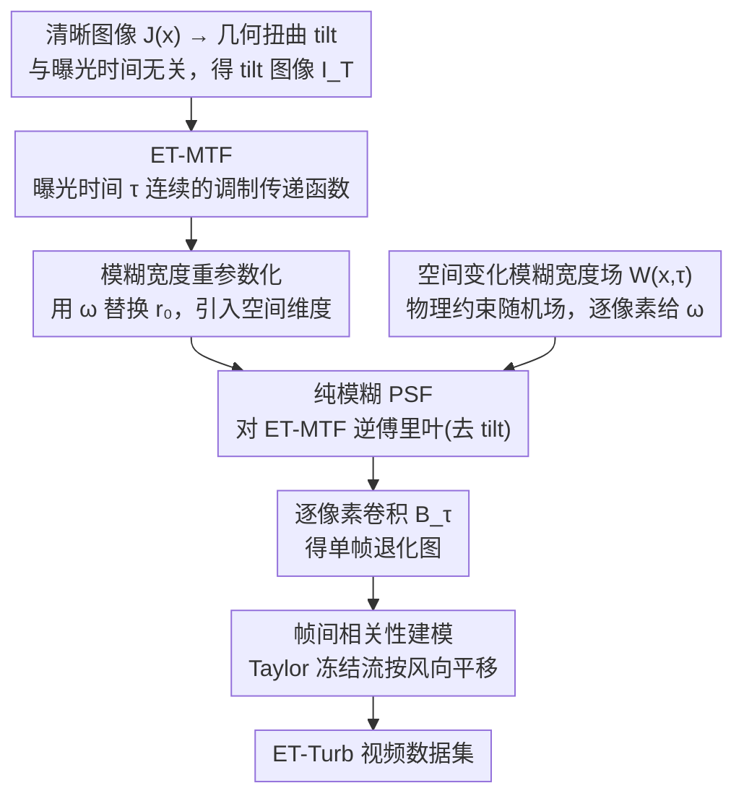

# Continuous Exposure-Time Modeling for Realistic Atmospheric Turbulence Synthesis

**会议**: CVPR 2026  
**arXiv**: [2603.01398](https://arxiv.org/abs/2603.01398)  
**代码**: [有](https://github.com/Jun-Wei-Zeng/ET-Turb)  
**领域**: 科学计算  
**关键词**: 大气湍流合成, 曝光时间建模, 调制传递函数(MTF), 点扩散函数(PSF), 湍流图像复原  

## 一句话总结

提出曝光时间依赖的调制传递函数（ET-MTF），将曝光时间建模为连续变量，构建了大规模合成湍流数据集 ET-Turb（5083视频、200万帧），显著提升湍流复原模型在真实数据上的泛化能力。

## 研究背景与动机

大气湍流通过折射率的随机波动，对远距离成像引入几何扭曲（tilt）和曝光时间相关的模糊（blur），严重影响遥感、视频监控、天文观测等应用。学习方法的性能高度依赖训练数据的真实性，而获取大规模配对真实湍流数据极其昂贵，因此合成数据集至关重要。

现有合成方法的核心缺陷在于对曝光时间的处理过于粗糙：

- **固定曝光方法**：大量方法对所有样本使用单一曝光设置，导致模糊统计特性单一，无法反映真实成像中的时间变化性
- **二值曝光方法**：部分方法仅区分"短曝光"和"长曝光"两种模式，使用对应的 $\text{MTF}_{\text{SE}}$ 和 $\text{MTF}_{\text{LE}}$，忽略了中间曝光时间产生的平滑过渡
- **物理仿真方法**：气体灶等物理装置受限于短光路，多步相位屏方法计算开销巨大

这些限制导致合成数据与真实湍流存在显著域差距，训练出的模型泛化能力受限。

## 方法详解

### 整体框架

论文把湍流退化建模为 $I(\mathbf{x}) = \mathcal{B}_\tau(\mathcal{T}(J(\mathbf{x})))$：先对清晰图像 $J$ 施加与曝光时间无关的几何扭曲算子 $\mathcal{T}$（tilt）得到 tilt 图像 $I_T$，再施加曝光时间依赖的模糊算子 $\mathcal{B}_\tau$。tilt 直接沿用已有的随机位移场建模（不是本文重点），论文的贡献集中在如何把 $\mathcal{B}_\tau$ 建得**既随曝光时间连续变化、又随空间位置变化，并扩展到视频**。

模糊合成流水线串起四个核心设计：① 从 Azoulay 有限曝光理论推出**曝光时间依赖的 MTF（ET-MTF）**，把"短曝光 / 长曝光"两个离散状态连成一根连续旋钮；② 对 ET-MTF 做**模糊宽度重参数化**，用局部模糊宽度 $\omega$ 替换 Fried 参数 $r_0$，引入逐像素可调的空间维度；中间经一步通用操作——对 ET-MTF 逆傅里叶得到去 tilt 的纯模糊 PSF；③ 用受光学湍流统计约束的**空间变化模糊宽度场** $\mathcal{W}(\mathbf{x},\tau)$ 给每个像素分配局部 $\omega$，逐像素卷积出单帧退化图；④ 借 Taylor 冻结流做**帧间相关性建模**，把单帧扩成时间连贯的视频。最后用这条流水线批量生成 ET-Turb 数据集。

### 关键设计

**1. 曝光时间依赖的 MTF（ET-MTF）：把"短曝光 vs 长曝光"的二元开关变成一根连续旋钮**

现有方法只给出 $\text{MTF}_{\text{SE}}$ 和 $\text{MTF}_{\text{LE}}$ 两个极端状态，中间曝光既无物理模型、又只能靠经验插值，物理意义模糊。本文回到 Azoulay 的有限曝光 MTF 理论，用一个直观概念把两端连起来：有效相干长度 $\rho_p(\tau)$。短曝光下湍流在物理口径 $D$ 内近似"冻结"，而长曝光时传感器在积分窗口内累积了多个湍流状态，等效于一个被风"拉大"的口径 $D + v_w \tau$。于是 MTF 写成

$$\text{MTF}_{\text{ET}}(\boldsymbol{\xi}, \tau) = e^{-\left(\frac{\lambda \|\boldsymbol{\xi}\|}{\rho_p(\tau)}\right)^{5/3}}, \qquad \rho_p(\tau) = 1 + 0.35 \left(\frac{r_0}{D + v_w \tau}\right)^{1/3}$$

其中 $r_0$ 是 Fried 参数、$v_w$ 是风速、$\boldsymbol{\xi}$ 是空间频率。曝光时间 $\tau$ 一增大，等效口径变大、$\rho_p(\tau)$ 平滑减小，MTF 的高频段衰减随之加快——从弱模糊到强模糊的过渡因此是连续、有物理出处的，而不是在两个离散模式间硬切。

**2. 模糊宽度重参数化：让同一套 MTF 既随曝光时间变、也随空间位置变**

$\rho_p(\tau)$ 只含 $\tau$，意味着整张图被同一强度的模糊覆盖；但真实湍流因局部折射率波动，模糊在画面上本就是空间非均匀的。要把空间维度引进来，作者用 PSF 的半高全宽（FWHM）定义局部模糊宽度 $\omega \approx \frac{0.49 \lambda f}{r_0}$，再把这个关系反解出 $r_0$ 代回有效相干长度，于是

$$\rho_p(\omega, \tau) = 1 + 0.28 \left(\frac{\lambda f}{\omega(D + v_w \tau)}\right)^{1/3}$$

重参数化之后，ET-MTF 同时由局部模糊宽度 $\omega$（空间）和曝光时间 $\tau$（时间）决定。换句话说，$\omega$ 成了一个可以逐像素调节的"模糊旋钮"，为下一步铺路。

**3. 空间变化模糊宽度场：把标量 $\omega$ 升级成受物理约束的随机场**

有了逐像素可调的 $\omega$，还需要决定每个位置具体取多大。作者把模糊宽度建模为一个空间相关的随机场 $\mathcal{W}(\mathbf{x}, \tau)$，它的均值和标准差不是随便给的，而是由光学湍流理论约束：

$$\mathcal{W}(\mathbf{x}, \tau) = \max\!\big(\epsilon,\; \bar{\omega}(\tau) + \sigma_\omega(\tau)\, \mathcal{R}(\mathbf{x})\big)$$

其中 $\bar{\omega}(\tau)$ 和 $\sigma_\omega(\tau)$ 都是 $\tau$ 的函数（由原文给出的物理公式确定），$\mathcal{R}(\mathbf{x})$ 是一个经低通滤波的零均值、单位方差高斯随机场——低通保证相邻像素的模糊是平滑过渡而非椒盐噪点，$\epsilon > 0$ 则托住下界防止出现负宽度。最终的空间变化模糊操作就是用每个位置自己的 PSF 去卷积去 tilt 后的图像：

$$\mathcal{B}_\tau(I_T(\mathbf{x})) = \text{PSF}_{\text{ET}}(\mathbf{x}, \mathcal{W}(\mathbf{x}, \tau), \tau) * I_T(\mathbf{x})$$

这一步让合成图像在同一帧内就具备真实湍流那种"近处清、远处糊、局部还忽强忽弱"的空间不均匀模糊。

**4. 帧间相关性建模：用 Taylor 冻结流把单帧扩成时间连贯的视频**

前三步只解决了一帧怎么糊；视频还要求相邻帧的湍流是连续演化而非各帧独立随机。作者采用 Taylor 冻结流假设，把湍流看成一块准静态的折射率场被平均风整体平移：

$$\mathcal{H}(J_t(\mathbf{x})) = \mathcal{H}\!\left(J_0\!\left(\mathbf{x} - \frac{f \mathbf{v}_w t}{L}\right)\right)$$

只要先在一个比画面更大的退化场上采样，再沿风向按帧平移采样窗口，就能得到时间上相互关联的连续帧——既复用了同一套 ET-MTF 退化，又自然带出湍流随时间漂移的视觉效果。

### 损失函数 / 训练策略

本文核心贡献在于数据集构建而非网络训练。ET-Turb 数据集设计了 12 种湍流配置，系统性覆盖不同光学和大气条件：

- **参数空间**：传播距离 30-1000m、焦距 0.1-1m、F 数 2.8-24、$C_n^2$ 范围 $0.5 \times 10^{-14}$ 到 $300 \times 10^{-14}$ m$^{-2/3}$、风速 1-10 m/s、曝光时间 0.5-40ms
- **数据规模**：5,083 个视频，2,005,835 帧，分为 3,988 训练 / 1,095 测试
- **真实数据集**：ET-Turb-Real 包含 74 个视频，来自 3 种不同成像设备

## 实验关键数据

### 主实验

在真实湍流数据上评估不同合成数据集训练的模型（无参考指标，越低越好）：

| 训练数据集 | TSR-WGAN NIQE↓ | TSR-WGAN BRISQUE↓ | TMT NIQE↓ | TMT BRISQUE↓ | DATUM NIQE↓ | DATUM BRISQUE↓ | MambaTM NIQE↓ | MambaTM BRISQUE↓ |
|---|---|---|---|---|---|---|---|---|
| TMT-dynamic | 4.231 | 52.502 | 4.361 | 58.581 | 4.219 | 54.921 | 4.217 | 55.062 |
| ATSyn-dynamic | 4.224 | 54.462 | 4.483 | 59.707 | 4.308 | 59.126 | 4.247 | 56.876 |
| **ET-Turb** | **4.190** | **50.981** | **4.221** | **56.691** | **4.204** | **54.070** | **4.212** | **55.050** |

ET-Turb 在全部 4 个模型 × 2 个指标共 8 项评测中取得 7 项最优。

### 消融实验

不同曝光建模策略的对比（MambaTM 模型）：

| 曝光策略 | NIQE↓ | BRISQUE↓ |
|---|---|---|
| 固定曝光 τ=1ms | 4.355 | 55.457 |
| 二值 MTF_SE/LE | 4.297 | 55.123 |
| **连续 ET-MTF** | **4.212** | **55.050** |

### 关键发现

1. **固定曝光训练的模型**难以恢复强模糊，因为训练数据中缺乏曝光变化
2. **二值 MTF 模型**有所改善但仍存在残余模糊，说明其对中间曝光范围覆盖不足
3. **连续 ET-MTF** 产生最自然、视觉一致的复原效果，证明连续建模的关键作用
4. ET-Turb 训练的模型在零样本迁移到真实数据时，避免了其他数据集训练模型常见的建筑文字变形、远处电线杆失真等伪影

## 亮点与洞察

1. **物理建模的简洁优雅**：通过"有效口径 = 物理口径 + 风速×曝光时间"这一直觉概念，自然地桥接了短/长曝光 MTF，物理意义清晰
2. **重参数化技巧**：将 Fried 参数 $r_0$ 替换为模糊宽度 $\omega$，巧妙引入空间变化性
3. **数据集设计思路**：12 种配置 × 7 个物理参数的系统化采样，比随机采样更能覆盖真实场景的多样性
4. **评估设计合理**：使用无参考指标在真实数据上评估，避免了合成数据测合成数据的循环论证

## 局限与展望

1. **Taylor 冻结流假设**的有效性受限于短曝光时间尺度，对极端条件可能失效
2. 仅考虑了各向同性湍流模型，真实大气（尤其近地面）可能呈各向异性
3. 合成数据仅包含模糊和几何扭曲，未建模散射、色散等其他大气效应
4. 曝光时间限制在 0.5-40ms，超长曝光场景（如天文观测）可能需要不同建模
5. 可结合可学习的曝光时间调度策略，做端到端的退化感知训练

## 评分

⭐⭐⭐⭐ 4/5

在湍流合成这个相对窄的领域做出了扎实的物理建模贡献。ET-MTF 的推导有清晰的物理根基，数据集设计周全，实验评估充分（4个SOTA模型×3个数据集的交叉验证）。扣分点在于这是一个数据集/仿真工具论文，缺少模型架构创新；此外消融实验中指标提升幅度有限（NIQE 从 4.297→4.212），虽然视觉效果差异更明显。

<!-- RELATED:START -->

## 相关论文

- [\[CVPR 2026\] EHETM: High-Quality and Efficient Turbulence Mitigation with Events](high-quality_and_efficient_turbulence_mitigation_with_events.md)
- [\[CVPR 2026\] NESTOR: A Nested MOE-based Neural Operator for Large-Scale PDE Pre-Training](nestor_a_nested_moe-based_neural_operator_for_large-scale_pde_pre-training.md)

<!-- RELATED:END -->
