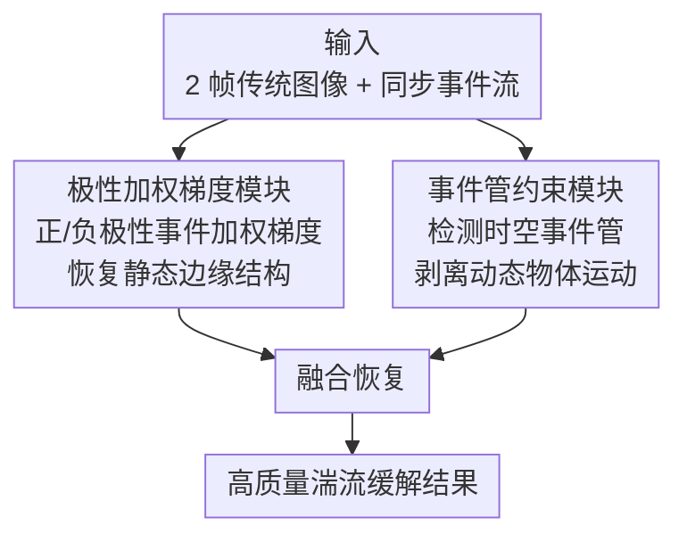

# EHETM: High-Quality and Efficient Turbulence Mitigation with Events

**会议**: CVPR 2026  
**arXiv**: [2603.20708](https://arxiv.org/abs/2603.20708)  
**代码**: [https://github.com/Xavier667/EHETM](https://github.com/Xavier667/EHETM)  
**领域**: 科学计算 / 事件相机  
**关键词**: 大气湍流缓解, 事件相机, 极性加权梯度, 事件管约束, 运动解耦

## 一句话总结
提出EHETM，首次利用事件相机的微秒时间分辨率突破传统多帧湍流缓解(TM)方法的精度-效率瓶颈，发现两个关键物理现象——湍流诱导事件的极性交替与清晰梯度相关、动态物体形成时空相干"事件管"——设计极性加权梯度和事件管约束两个互补模块，数据开销降低77.3%、系统延迟降低89.5%，尤其在动态物体场景显著超越SOTA。

## 研究背景与动机

**领域现状**：大气/热湍流是远距离成像的主要退化来源，引入随机折射率波动导致的几何倾斜和空间变化模糊。现有方法（如DATUM）依赖传统相机拍摄的多帧序列来捕捉稳定模式。

**现有痛点**：多帧方法面临**精度-效率的根本trade-off**——帧越多恢复越好但系统延迟和数据开销越大。且当场景中存在**动态物体**时，多帧方法难以区分湍流抖动和真实物体运动。

**核心矛盾**：湍流缓解需要大量时间冗余来平均随机抖动，但传统相机的帧率限制了在合理延迟内能获取的信息量。

**切入角度**：事件相机以微秒级时间分辨率异步记录亮度变化——一帧的事件数据包含的运动信息远超传统帧——可以用极少帧实现高质量恢复。

**核心idea**：发现两个物理现象作为恢复先验：(1) 湍流事件的极性交替与图像梯度相关→场景结构线索；(2) 动态物体在事件流中形成相干"管状"结构→运动先验。

## 方法详解

### 整体框架
EHETM 要解决的是同一件事：把远距离成像里那层随机抖动的湍流"抹掉"，但不想再像传统方法那样攒几十帧、等很久。它的做法是给一两张传统帧配上一段同步的事件流——事件相机微秒级的异步亮度记录里藏着远比帧更密的运动信息。整条管线是一个"分支再汇合"的结构：同一份输入分头喂给两个互补模块，极性加权梯度模块从事件里把场景的清晰结构"读"出来、负责恢复边缘纹理，事件管约束模块则盯住画面里在动的物体、把它们的真实运动从湍流抖动里剥离出去；两者一个管"静态结构怎么变清楚"、一个管"动态物体别被当成湍流"，再汇合融合出高质量的恢复结果。这一切之所以能落地，还依赖作者额外采集的真实世界事件-帧湍流数据集做训练与评估的底座。

### 关键设计

**1. 极性加权梯度模块：用事件极性当作免费的结构线索**

这一模块针对的痛点是传统方法"靠多帧平均才能恢复清晰边缘"——帧不够就糊。作者观察到一个物理现象：湍流造成的亮度变化恰好集中在清晰图像的梯度（边缘、纹理）处，并且在那里产生正、负极性交替的事件，等于事件流自己把场景的边缘结构"描"了一遍。于是模块不再盲目平均像素，而是用事件极性去加权梯度估计——正极性事件指示梯度朝正方向、负极性指示朝负方向，把这层先验直接灌进恢复过程。好处是单个事件窗口就能拿到以往需要多帧才能平均出来的结构信息，这正是 EHETM 敢只用 2 帧就超过 50 帧基线的底气所在。

**2. 事件管约束模块：把动态物体的运动从湍流里剥出来**

这一模块解决的是传统多帧 TM 的致命假设——场景必须是静态的。一旦画面里有车、有行人，它们的真实位移会被当成湍流抖动一起"平均掉"，结果就是严重伪影。作者发现的第二个现象给了破解的钥匙：动态物体因为运动连续，在时空事件流里会排成一条连续的"管状"结构（event tube），而湍流事件是随机、不规则的散点，两者形态截然不同。模块据此先检测出这些时空相干的管状结构、提取物体的运动轨迹，再从观测到的总位移里减去这部分物体运动，剩下的才是纯湍流成分交给恢复。举个直观的例子：一辆缓慢驶过的车在事件流里画出一条斜向的管，模块沿管估出车的位移，把它从该区域的总位移中扣掉，于是车身不再被湍流模型误伤，背景的湍流抖动也照常被压制。这让"湍流中的运动物体"这个原本几乎无解的场景，第一次有了自然的解耦先验。

**3. 真实世界事件-帧湍流数据集：补上评估这套方法的数据底座**

前两个模块都依赖事件数据，但现有湍流数据集清一色只有传统帧、没有同步事件，没法验证。作者因此采集了两个配对的事件-帧数据集：一个针对远距离户外的大气湍流，一个针对热源附近成像的热湍流，并且都覆盖静态与含运动物体的动态场景。这套真实数据不只是配套产物，也是让"极性交替"和"事件管"两个现象能在大气与热两种湍流下都被验证、从而说明其物理普适性的基础。

### 损失函数 / 训练策略
训练目标结合像素级重建损失、感知损失，以及一项极性一致性约束（让恢复结果的梯度方向与事件极性给出的结构线索保持一致）。

## 实验关键数据

### 主实验（对比多帧TM方法）

| 方法 | 帧数 | PSNR↑ | SSIM↑ | 延迟 | 数据量 |
|------|------|-------|-------|------|--------|
| DATUM (50帧) | 50 | 基准 | 基准 | 100% | 100% |
| DATUM (10帧) | 10 | 下降 | 下降 | ~20% | ~20% |
| **EHETM (2帧+事件)** | **2** | **SOTA** | **SOTA** | **10.5%** | **22.7%** |

### 动态场景对比

| 方法 | 静态场景 | 动态场景(含运动物体) | 说明 |
|------|---------|-------------------|------|
| DATUM | 好 | 严重伪影 | 无法区分物体运动和湍流 |
| **EHETM** | **SOTA** | **显著超越(优势最大)** | 事件管约束有效解耦 |

### 消融实验

| 配置 | PSNR | 说明 |
|------|------|------|
| 仅传统帧(基线) | 基准 | 少帧质量差 |
| +极性加权梯度 | +大幅提升 | 事件的结构线索 |
| +事件管约束 | +进一步提升 | 动态物体解耦 |
| **完整EHETM** | **最优** | 两个模块互补 |

### 效率对比

| 指标 | EHETM vs DATUM |
|------|:---:|
| 数据开销降低 | **77.3%** |
| 系统延迟降低 | **89.5%** |

### 关键发现
- EHETM在仅用2帧+事件的情况下超越了使用50帧的DATUM——事件相机的时间分辨率优势被充分利用
- 动态场景是EHETM优势最大的场景——传统方法在此场景几乎完全失效，EHETM通过事件管约束有效处理
- 极性交替现象在大气湍流和热湍流中都成立——具有物理普适性
- 数据效率和系统延迟的大幅降低使实时远距离成像成为可能

## 亮点与洞察
- **事件相机在湍流缓解中的首次系统应用**：为事件视觉开辟了科学成像的新应用方向。事件相机的微秒时间分辨率完美匹配湍流的随机高频特性
- **两个物理现象的发现**：(1) 极性交替-梯度相关性和(2) 事件管的时空相干性。这些发现不仅指导了方法设计，更为后续研究提供了重要的物理先验知识
- **动态场景的突破**：传统TM方法的"静态场景假设"被彻底打破。事件管约束为"湍流中的运动物体"问题提供了优雅的解决方案
- **效率的质变**：77%数据降低+89%延迟降低不是渐进改善，而是量级的变化——使实时湍流缓解从不可能变为可能

## 局限与展望
- 事件相机硬件成本较高，限制了实际部署
- 当前事件管检测假设物体运动是刚体运动——非刚体运动（如流体、变形物体）的处理有待探索
- 极端湍流条件（如强对流天气）下的鲁棒性未充分评估
- 事件相机在低光或极端高动态范围下的性能特性可能影响结果
- 可探索将事件相机TM技术与自适应光学结合

## 相关工作与启发
- **vs DATUM/TurbNet等多帧方法**: 依赖大量传统帧→延迟高→动态场景失效。EHETM用事件相机根本性地改变了信息获取方式
- **vs 自适应光学**: 硬件方案的成本和复杂度远高于软件方案。EHETM是更轻量的计算替代
- **vs 其他事件相机应用(光流/去模糊)**: 湍流缓解是事件视觉的新应用方向——湍流的随机性与事件的高时间分辨率形成天然互补

## 评分
- 新颖性: ⭐⭐⭐⭐⭐ 全新的事件驱动湍流缓解范式+两个物理现象的发现
- 实验充分度: ⭐⭐⭐⭐ 真实世界数据集构建+定量/定性全面对比+消融
- 写作质量: ⭐⭐⭐⭐ 物理现象的描述清晰，方法设计有物理直觉支撑
- 价值: ⭐⭐⭐⭐⭐ 对远距离成像和事件视觉两个领域都有重大贡献

<!-- RELATED:START -->

## 相关论文

- [\[CVPR 2026\] Continuous Exposure-Time Modeling for Realistic Atmospheric Turbulence Synthesis](continuous_exposure-time_modeling_for_realistic_atmospheric_turbulence_synthesis.md)
- [\[CVPR 2026\] NESTOR: A Nested MOE-based Neural Operator for Large-Scale PDE Pre-Training](nestor_a_nested_moe-based_neural_operator_for_large-scale_pde_pre-training.md)

<!-- RELATED:END -->
