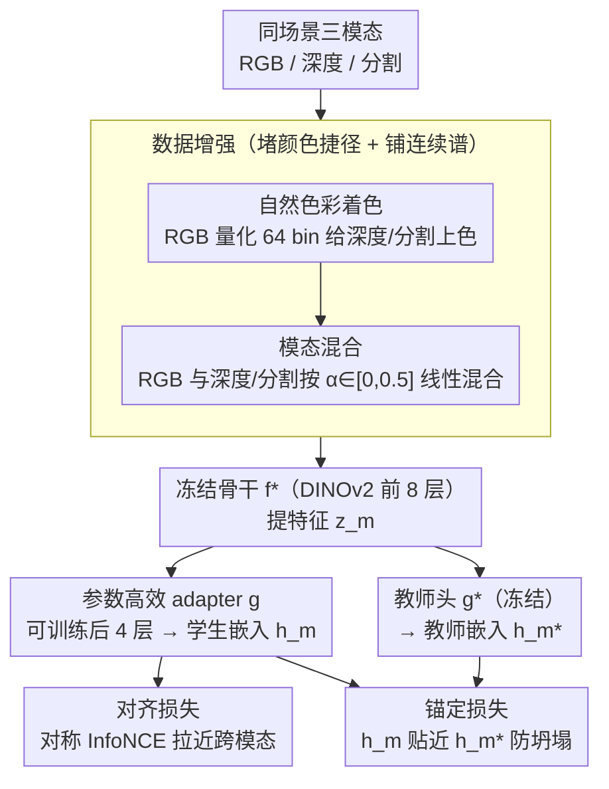

# A Mixed Diet Makes DINO An Omnivorous Vision Encoder

**会议**: CVPR2026  
**arXiv**: [2602.24181](https://arxiv.org/abs/2602.24181)  
**代码**: 待确认  
**领域**: 语义分割  
**关键词**: 跨模态对齐, DINOv2, 视觉基础模型, 模态无关编码器, 参数高效微调, 对比学习

## 一句话总结

提出 Omnivorous Vision Encoder，通过轻量级 adapter 在冻结的 DINOv2 之上进行跨模态对齐蒸馏训练（RGB/Depth/Segmentation），使单一编码器对不同视觉模态产生一致嵌入，同时保留原始判别语义。

## 研究背景与动机

**跨模态特征错位严重**：实验发现 DINOv2 对同一场景的 RGB 图像与深度图的特征余弦相似度，与两张不相关 RGB 图像之间几乎相同，说明现有视觉编码器的跨模态表示高度碎片化。

**NLP 的成功启示**：自然语言处理从语言专属模型发展到多语言共享表示（如 mBERT），大幅提升了低资源语言性能；视觉领域面临类似转折点，需要将 RGB（丰富）与深度/分割（稀缺但结构丰富）对齐到统一空间。

**朴素对齐会导致表示坍塌**：简单最大化跨模态相似度可能将特征空间压缩为平凡解，破坏编码器的判别能力；现有方法如 CMC 依赖大量负样本，但在模态不平衡时难以收集足够负例。

**全量训练成本高**：Omnivore、ImageBind 等方法需从头联合训练整个 backbone，代价昂贵；工业界更需要在已有强大单模态模型（DINOv2）上以最小代价实现跨模态能力。

**标准 colormap 引入捷径**：深度/分割图的灰度或 jet 色彩映射允许模型通过低级颜色统计捷径完成对齐，而非基于结构内容。

**离散模态训练不够鲁棒**：将 RGB/Depth/Seg 视为离散状态训练，模型难以学到跨模态连续谱上的不变性，在输入模糊或模态混合时表现脆弱。

## 方法详解

### 整体框架

Omnivorous Vision Encoder 想解决的痛点很具体：冻结的 DINOv2 对同一场景的 RGB 与深度图，特征相似度竟和两张毫不相关的 RGB 图差不多——跨模态表示是碎的。它用一套参数高效的教师-学生框架来补：教师是完全冻结的 DINOv2（$f_T = g^* \circ f^*$）当稳定锚点；学生共享冻结的早期 8 层 backbone $f^*$，只微调后 4 层作为可训练 adapter $g$，即 $f_S = g \circ f^*$。任意模态 $x_m$ 进来，先经一套数据增强（自然色彩着色 + 模态混合）消除颜色捷径、铺出模态连续谱，再由冻结部分提特征 $z_m = f^*(x_m)$，adapter 映射到统一空间 $h = g(z_m)$；训练时用对齐损失把跨模态嵌入拉近、用锚定损失把学生嵌入拴回教师，让不同模态对齐到一致嵌入又不破坏原始判别语义。

### 关键设计

**1. 参数高效 teacher-student adapter：在冻结基础模型上只调几层，就把跨模态对齐"装"进 DINOv2**

Omnivore、ImageBind 这类方法要从头联合训练整个 backbone，代价高；作者改用教师-学生框架把对齐能力蒸馏进现成模型。ViT-B 共 12 个 block，作者冻结前 8 层当共享骨干 $f^*$、只把后 4 层拿出来微调成 adapter $g$（约 1/3 参数），学生即 $f_S = g \circ f^*$；教师则是完全冻结的原始 DINOv2 $f_T = g^* \circ f^*$，当稳定锚点。低层保留通用视觉先验、只让高层去学模态对齐，既省算力又给后面的锚定损失留出"对照系"——这套"冻底层、调高层"的结构是全篇能低成本实现跨模态升级的根基。

**2. 自然色彩着色：把"靠颜色直方图对齐"这条捷径堵死**

深度/分割图常用灰度或 jet 色板，模型能靠低级颜色统计走捷径完成"对齐"，根本没看结构。作者先对 RGB 做常规光度增强（亮度/对比度/色调/饱和度扰动，提供基础外观多样性），再把这张增强后 RGB 的像素值量化成 64 个 bin，用得到的色板给同场景的深度/分割图上色，使它们视觉上像 RGB——这等于构造了"困难正样本"：颜色分布被对齐后，网络只能转而基于结构内容去匹配，逼出真正的跨模态语义对应。

**3. 模态混合：在 Depth↔RGB↔Seg 的连续谱上训练，增强对模态歧义的鲁棒**

把 RGB、深度、分割当成离散状态训练，模型学不到连续谱上的不变性，输入一模糊就脆。模态混合按随机比例把 RGB 与深度/分割线性混合 $x_s^{mixup} = (1-\alpha_s)x_s + \alpha_s x_r^{aug}$（$\alpha \in [0, 0.5]$，逐样本独立采样），让训练样本落在两模态之间的过渡带上，理论上 $M_s$ 与 $M_d$ 一起张成 Depth↔RGB↔Seg 的连续模态空间，使编码器对"半 RGB 半深度"这类模糊输入也保持稳定。

### 损失函数

**对称跨模态对齐损失**：对所有模态对 $(m_1, m_2)$ 计算 InfoNCE：

$$\mathcal{L}_{\text{align}} = \frac{1}{3}\sum_{k_1}\sum_{k_2>k_1} \mathcal{L}_{\text{InfoNCE}}(m_{k_1}, m_{k_2})$$

三对组合：(RGB_aug, Seg_mixup)、(Seg_mixup, Depth_mixup)、(Depth_mixup, RGB_aug)，温度 $\tau$ 可学习。

**锚定损失**：防止表示漂移，约束学生输出 $h_m$ 接近教师输出 $h_m^*$：

$$\mathcal{L}_{\text{anchor}} = \frac{1}{|M|}\sum_{m \in M}(1 - \text{sim}(h_m, h_m^*))$$

**总目标**：$\mathcal{L}_{\text{total}} = \mathcal{L}_{\text{align}} + \lambda_{\text{anchor}} \mathcal{L}_{\text{anchor}}$，默认 $\lambda_{\text{anchor}}=10$。对 CLS token 和 dense token（随机采样 64 个）分别计算，dense token 掩码排除同图像内的作为负例。

## 实验

### 跨模态检索（Table 1）

| 数据集 | 模型 | R@1 ↑ | R@5 ↑ | mAP ↑ | MedR ↓ |
|--------|------|-------|-------|-------|--------|
| MOVi (GAP) | DINOv2 ViT-B/14 | 15.5 | 33.1 | 25.2 | 19.3 |
| MOVi (GAP) | **Omnivorous** | **86.2** | **96.5** | **90.9** | **1.0** |
| ScanNet (GAP) | DINOv2 ViT-B/14 | 4.6 | 10.8 | 8.1 | 401.8 |
| ScanNet (GAP) | **Omnivorous** | **46.1** | **71.4** | **57.7** | **2.0** |
| TartanAir (GAP) | DINOv2 ViT-B/14 | 46.6 | 68.5 | 57.1 | 1.8 |
| TartanAir (GAP) | **Omnivorous** | **90.6** | **99.2** | **94.6** | **1.0** |

ScanNet 上 R@1 从 4.6% 提升至 46.1%，MedR 从 401.8 降至 2.0，跨模态对齐提升极其显著。

### 下游任务（Table 2 & 3）

| 任务 | 数据集 | Readout | DINOv2 | Omnivorous |
|------|--------|---------|--------|------------|
| 深度 δ₁ ↑ | NYUv2 | Linear | 0.875 | **0.896** |
| 深度 RMSE ↓ | NYUv2 | Linear | 0.405 | **0.377** |
| 分割 mIoU ↑ | ADE20k | Linear | 0.463 | **0.475** |
| 分割 mIoU ↑ | Cityscapes | Linear | 0.622 | **0.632** |
| 分类 Acc ↑ | ImageNet | Linear (TOK&GAP) | 0.804 | **0.838** |

ImageNet 线性分类从 80.4% 提升至 83.8%，说明跨模态对齐增强了特征的语义密度。

### 消融实验

- **$\lambda_{\text{anchor}}$ 的 Pareto 前沿**：$\lambda=1$ 对齐好但判别力下降；$\lambda=100$ 判别力保留但对齐受限；$\lambda=10$ 在对齐与判别之间取得最佳平衡
- **模态混合 $\alpha_{\max}$ 消融**：$\alpha_{\max}=0$ 到 1.0，分类/分割/3D 对应随 $\alpha$ 增大持续改善，深度在 $\alpha>0.5$ 后略降；默认 $\alpha_{\max}=0.5$ 全面权衡

### 关键发现

- **零样本跨模态迁移（Table 5）**：用 RGB 训练的深度预测头，直接切换输入为 Seg 图：DINOv2 RMSE=1.536（随机水平），Omnivorous RMSE=0.532；在从未见过的 NOCS 模态上也显著优于 baseline（0.822 vs 0.979 DPT）
- **k-NN 分类不退化**：ImageNet k-NN 保持 81.97%（DINOv2 81.94%），确认锚定损失有效防止了表示遗忘
- **PCA 可视化**：冻结 DINOv2 特征中 RGB/Depth/Seg 占据不相交的子空间，Omnivorous 特征对齐到一致的颜色分布

## 亮点

- **极简高效**：仅微调 ViT 后 4 层（~33% 参数），在冻结基础模型上实现跨模态对齐，训练开销小
- **自然色彩着色 + 模态混合的数据增强组合**设计精巧：构造困难正样本防止捷径学习，连续谱训练增加鲁棒性
- **零样本模态迁移能力突出**：RGB 训练的任务头可直接在 Seg 甚至从未见过的 NOCS 模态上工作
- **跨模态检索提升数量级**：ScanNet MedR 从 401.8 降至 2.0
- **下游性能不降反升**：分类/分割/深度预测全面优于 DINOv2，说明跨模态正则化本身就有泛化增益

## 局限性

- DINOv2 最后有高分辨率微调步骤，Omnivorous 是否需要同样步骤尚未验证
- 训练数据包含大量合成多物体场景，导致在 iNaturalist、GLDv2 等细粒度数据集上 k-NN 出现轻微退化
- 仅验证了 ViT-B/14 规模，大模型（ViT-L/G）上的效果和 adapter 层数选择未探索
- 模态仅覆盖 RGB/Depth/Seg，文本、热红外等更多模态未涉及

## 相关工作

- **统一多模态编码器**: Omnivore 用一个 ViT 处理图像/视频/3D 但需完整联合训练；ImageBind 绑定六种模态但同样从头训练
- **RGB-Depth 对齐**: CLIP2Point 做 image-depth 对比预训练；CoMAE 先对比再掩码自编码；Mask3D 用掩码 RGB-D 预训练注入 3D 先验
- **参数高效适配**: ViT-Adapter 注入任务先验；MA-AVT 做音视频逐块对比对齐；模态解耦 adapter 分离模态不变与特异成分
- **跨模态蒸馏**: SOCKET 做无源跨模态迁移；CMKD 用解耦和对比项做 RGB-D 分割蒸馏
- 本文独特之处：在冻结单模态基础模型上做 **后置轻量对齐**，兼顾部署便利性与跨模态能力

## 评分

- 新颖性: ⭐⭐⭐⭐ — 着色+模态混合的数据策略和仅微调后几层实现跨模态对齐的思路简洁有效
- 实验充分度: ⭐⭐⭐⭐ — 检索/分类/分割/深度/零样本迁移/消融覆盖全面，含 6 个数据集
- 写作质量: ⭐⭐⭐⭐ — NLP 多语言类比切入点佳，结构清晰，图表直观
- 价值: ⭐⭐⭐⭐ — 为已部署的视觉基础模型提供了低成本跨模态升级路径，实用性强

<!-- RELATED:START -->

## 相关论文

- [\[AAAI 2026\] Empowering DINO Representations for Underwater Instance Segmentation via Aligner and Prompter](../../AAAI2026/segmentation/empowering_dino_representations_for_underwater_instance_segmentation_via_aligner.md)
- [\[CVPR 2026\] Generalizable Co-Salient Object Detection via Mixed Content-Style Modulation](generalizable_co-salient_object_detection_via_mixed_content-style_modulation.md)
- [\[ICML 2026\] What Makes Synthetic Data Effective in Image Segmentation](../../ICML2026/segmentation/what_makes_synthetic_data_effective_in_image_segmentation.md)
- [\[CVPR 2026\] GKD: Generalizable Knowledge Distillation from Vision Foundation Models for Semantic Segmentation](gkd_generalizable_knowledge_distillation_vfm.md)
- [\[CVPR 2026\] The Missing Point in Vision Transformers for Universal Image Segmentation](the_missing_point_in_vision_transformers_for_universal_image_segmentation.md)

<!-- RELATED:END -->
