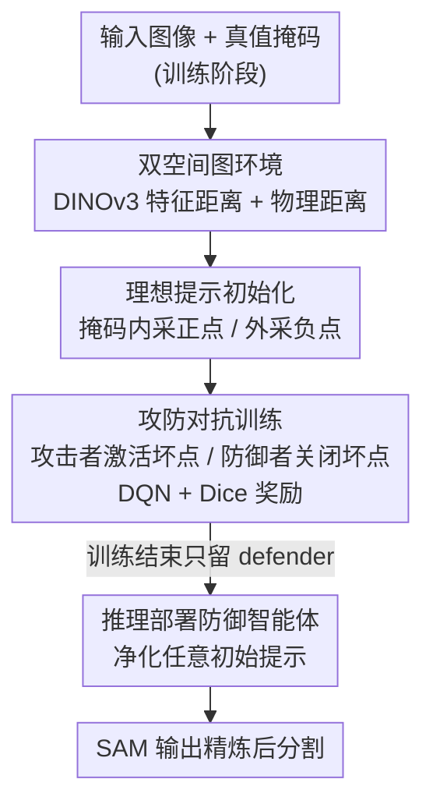

# Attack for Defense: Adversarial Agents for Point Prompt Optimization Empowering Segment Anything Model

**会议**: CVPR 2026  
**论文**: [CVF Open Access](https://openaccess.thecvf.com/content/CVPR2026/html/Liu_Attack_for_Defense_Adversarial_Agents_for_Point_Prompt_Optimization_Empowering_CVPR_2026_paper.html)  
**代码**: https://github.com/L-AILab/PPD  
**领域**: 分割 / 强化学习 / 视觉基础模型  
**关键词**: SAM, 点提示优化, 对抗强化学习, 双空间图, DQN

## 一句话总结
PPD（Point Prompt Defender）把 SAM 的点提示优化建模成一个"攻—防"对抗强化学习游戏：一个攻击智能体专门激活会拖垮分割质量的提示点、一个防御智能体学着把这些坏点关掉以恢复精度，训练完后只部署防御智能体，就能在不重训的情况下即插即用地净化任意粗糙提示集，让 SAM 在自然图像和医学图像上的分割都更准、更鲁棒。

## 研究背景与动机

**领域现状**：以 SAM 为代表的视觉基础模型把分割变成了"提示驱动"任务——给几个点/框，SAM 就能零样本分割任意目标，省去了为每个任务设计专门网络的成本。但 SAM 的分割质量高度依赖输入提示的质量，而提示要么靠人手点、要么靠启发式规则生成。

**现有痛点**：自动生成提示的几条路线各有硬伤。微调提示编码器（如 VRP-SAM）需要下游任务的标注监督，换个域就失灵（论文里 VRP-SAM 在医学数据集上几乎崩到 0）；几何启发式方法（Matcher、GBMSeg）把提示当成静态输入，不会根据分割上下文判断每个提示点到底有没有用；最接近本文的 PPO（Point Prompt Optimizer）虽然用强化学习迭代调提示位置，但它**脱离 SAM 的分割输出独立优化提示**，训练环境多样性又不够，学到的策略对初始提示的质量和分布极其敏感，跨域就掉链子。

**核心矛盾**：提示优化要想泛化，就必须直接耦合 SAM 的分割反馈来判断"这个提示点是帮忙还是添乱"；但耦合反馈又容易过拟合到训练时见过的那种"还算干净"的初始提示分布，真到了脏提示场景就抓瞎。换句话说，缺的是一个能主动制造各种"坏提示困境"、逼着优化器学会在最差情况下也能救场的训练机制。

**本文目标**：学一个任务无关、即插即用、推理时无需重训的点提示净化器，能把任意来源（特征匹配、粗分割）的噪声提示集精炼成 SAM 友好的高质量提示。

**切入角度**：作者借用对抗训练的思路——与其被动地生成或排序提示，不如主动地"攻击"。如果有一个攻击者专门去找最能破坏 SAM 的提示点来激活，那么与之对抗的防御者就被逼着学会识别并剔除这类有害点。攻击者制造的多样化"困境"恰好补上了 PPO 训练环境单一的短板。

**核心 idea**：用"攻击换防御"（attack-for-defense）的双智能体对抗强化学习来优化点提示——攻击者激活坏点拉低 Dice、防御者关闭坏点拉高 Dice，两者以 DICE 变化为奖励用 DQN 交替训练，推理只留防御者。

## 方法详解

### 整体框架
PPD 要解决的是"给 SAM 喂一堆可能含噪的点提示，自动把坏点挑掉、留下好点"。整条流程可以分成"搭环境 → 对抗训练 → 推理部署"三段。

首先，PPD 把一张图像切成若干 patch，每个 patch 当作图里的一个节点，用 DINOv3 抽特征算出 patch 之间的**特征距离**和**物理距离**，构成一张双空间异构图，作为强化学习的环境。环境的初始提示由真值掩码生成的"理想提示"给出（掩码内均匀采正提示、掩码外采负提示）。然后在这个环境里，攻击智能体从未激活提示池里挑点激活、把 SAM 的分割拉差，防御智能体再从已激活提示里挑点关闭、把分割救回来；两者都用 DQN 训练，奖励直接由 Dice 系数的变化驱动。训练完成后，**只保留防御智能体**：给任意初始提示，防御者过滤掉低质量点，增强 SAM 分割，全程任务无关、无需重训。

### 关键设计

**1. 双空间异构图环境：让提示优化既能"动手"又能"讲关系"**

PPD 没有把提示优化当成在像素坐标上盲调点，而是先把图像组织成一张图。给定输入图像 $X$，切成不重叠或滑动的 patch 集合 $x=\{x_1,\dots,x_n\}$，每个 patch 用 DINOv3 编码器抽出特征向量 $f_i$。基于此构造两个距离矩阵：特征距离矩阵 $M_f(i,j)=\lVert f_i-f_j\rVert$ 刻画语义相似度，物理距离矩阵 $M_p(i,j)=\lVert x_i-x_j\rVert$ 刻画空间邻近度。两者共同定义双空间图 $G=(V,E_f,E_p)$ 的边属性。这样设计的好处是把"显式提示操作"（激活/关闭某个点）和"隐式结构关系"（点之间在特征空间和物理空间里有多近）无缝拼在同一个状态里——智能体既能直接增删提示，又能基于拓扑结构推理"激活这个点会不会和已有点冗余/冲突"。相比 PPO 只看提示点之间的孤立关系，双空间图把语义与空间一起编码进环境，给跨域泛化提供了任务无关的结构线索（DINOv3 特征本身就是无标签自监督学来的通用表示）。

**2. 理想提示初始化：用真值掩码给对抗学习一个"高质量起点"**

强化学习如果从纯随机提示起步，攻防双方都在噪声里乱撞、信号太弱。PPD 在训练阶段利用每张训练图的真值分割掩码生成一套"理想提示"：在掩码区域内按固定间隔均匀采样作为正提示，在掩码外采样作为负提示。这套分布天然是语义信息丰富的高质量配置，把环境初始化到一个"接近正确"的状态，让攻击者和防御者都能把注意力集中在那些**对分割影响最大的关键提示**上，而不是浪费在大量无所谓的点上。注意理想提示只在训练期用（推理期看不到真值），它的作用是给对抗博弈提供一个干净的对照基线——攻击者从这里往坏里推、防御者往好里拉，Dice 的变化才有意义。

**3. 攻防对抗的双智能体训练：用"制造困境—修复困境"逼出鲁棒的防御策略**

这是 PPD 的核心。攻击智能体在每个时刻 $t$ 从未激活提示集合 $A^{atk}_t=\{p_i\in P\mid status_i=\text{inactive}\}$ 中选动作，激活若干坏点喂给 SAM 得到掩码 $\hat M_t$，其奖励设计成鼓励分割变差：$r^{atk}_t=-\big(\text{Dice}(\hat M_t,M)-\text{Dice}(\hat M_{t-1},M)\big)$，Dice 掉得越多攻击者赚得越多。防御智能体则从已激活集合 $A^{def}_t=\{p_i\in P\mid status_i=\text{active}\}$ 中选点关闭，奖励正好相反：$r^{def}_t=\text{Dice}(\hat M_t,M)-\text{Dice}(\hat M_{t-1},M)$，Dice 升得越多防御者赚得越多。两个智能体各维护一个 Q 网络，用 DQN 的时序差分损失训练：

$$L_t=\Big(r_t+\gamma\max_{a'}Q_{\theta^-}(s_{t+1},a')-Q_\theta(s_t,a_t)\Big)^2,$$

其中目标网络 $Q_{\theta^-}$ 每隔固定步数同步一次以稳定训练。训练采取"先更新攻击者、再更新防御者"的交替方式（见 Algorithm 1）：每个 epoch 先让攻击者跑 $T$ 步学会找最脆弱的点，再把攻击后的提示集当作防御者的环境让它学着修复。关键在于——攻击者持续制造各种各样的"坏提示困境"，等价于在不断扩充训练环境的多样性，这恰好补上了 PPO 训练环境单一、对初始提示敏感的缺陷；防御者在被动挨打中学到的是"哪类点是有害的"这种可迁移规律，而非记住某种特定提示布局。提示集的增删会改变图 $G$ 的结构，这些结构变化隐式引导智能体学到最有效的攻防策略，使整个优化保持任务无关。

**4. 推理只部署防御者：把对抗训练成果变成即插即用的提示净化器**

训练时攻防共存是为了制造困境，但推理时不需要再破坏——所以 PPD 在推理阶段**只保留防御智能体**。环境完全由 DINOv3 抽的任务无关特征构建（推理期不依赖任何真值或下游标注），给定任意来源的初始提示（特征匹配、粗分割等），防御者直接过滤掉低质量点来增强 SAM 分割。这一设计让 PPD 成为一个真正即插即用、无需重训的增强模块：训练一次（论文用 FSS-1000 的 1000 张图），就能直接套到 PASCAL VOC、ISIC、Kvasir 等完全没见过的数据集上。

### 损失函数 / 训练策略
两个智能体都用 DQN 优化上式的时序差分损失，奖励为 Dice 变化。训练在 10 张 V100 上跑 1000 个 episode，每个 episode 的环境步数在 50–300 之间随机采样以模拟多样的初始提示配置；Q 网络用 Adam（学习率 $10^{-4}$、batch size 128）优化，目标网络每 100 步按全局计数器更新；探索用 $\epsilon$-greedy，$\epsilon$ 从 1.0 线性退火到 0.1。

## 实验关键数据

训练只用 FSS-1000 随机采样的 1000 张图（类别无关的提示操作策略），训练完**不做任何重训/适配**，直接评测三个数据集：PASCAL VOC（自然场景）、ISIC 与 Kvasir（医学场景），全程 one-shot、training-free。评价指标为 mDSC 和 mIoU（越高越好）。

### 主实验：与 SAM-based one-shot 方法对比（Table 2）

| 方法 | VOC mDSC | VOC mIoU | ISIC mDSC | ISIC mIoU | Kvasir mDSC | Kvasir mIoU |
|------|----------|----------|-----------|-----------|-------------|-------------|
| PerSAM | 51.4 | 49.8 | 42.4 | 33.6 | 27.4 | 17.8 |
| PerSAM-F | 58.8 | 50.0 | 59.6 | 50.4 | 31.5 | 22.3 |
| Matcher | 69.2 | 61.5 | 65.4 | 57.7 | 33.2 | 24.1 |
| VRP-SAM | 58.2 | 49.4 | 5.9 | 3.7 | 0.0 | 0.0 |
| GBMSeg | 56.7 | 49.7 | 63.8 | 50.0 | 38.1 | 27.9 |
| FM-PPO | 61.7 | 52.9 | 69.4 | 60.4 | 42.9 | 31.5 |
| **FM-PPD (本文)** | **73.0** | **63.3** | **76.3** | **64.2** | **64.1** | **54.9** |

FM-PPD（用特征匹配生成初始提示 + PPD 净化）在全部三个数据集、两个指标上都拿第一。自然图像 VOC 上提升相对温和（多数方法本就还行），但在域偏移强烈的 ISIC、Kvasir 上优势巨大——尤其 Kvasir 的 mDSC 从次优 FM-PPO 的 42.9 直接拉到 64.1。依赖在自然图上训练的提示编码器的 VRP-SAM 在医学域几乎全崩（ISIC 5.9、Kvasir 0.0），印证了"需要任务监督"路线的脆弱；PPO 虽靠提示优化改善跨域，但受限于初始提示质量，仍不及 PPD 的对抗双智能体。

### 消融实验（Table 1）

| 配置 | VOC mDSC | ISIC mDSC | Kvasir mDSC | 说明 |
|------|----------|-----------|-------------|------|
| Ideal prompts | 78.5 | 87.3 | 83.0 | 真值掩码生成的理想提示（上界参照） |
| Attack ideal prompts | 34.2 (−44.3) | 56.4 (−30.9) | 59.7 (−23.3) | 攻击者破坏理想提示后 |
| Defense against attacks | 83.5 (+49.3) | 81.5 (+25.1) | 76.4 (+16.7) | 防御者修复后（相对被攻击态回升） |
| Feature matching | 41.3 | 66.4 | 31.4 | 训练无关特征匹配生成的初始提示 |
| Feature matching + PPD | 73.0 (+31.7) | 76.3 (+9.9) | 64.1 (+32.7) | 防御者净化后 |

上半部分验证攻防两个智能体各自有效：攻击者能把理想提示的 mDSC 在 VOC 上砸掉 44.3 个点（说明它确实找到了最伤害 SAM 的点），防御者随后能把被攻击的分割大幅回升（VOC 相对攻击态 +49.3，甚至略超原始理想提示）。下半部分验证实战价值：在含噪的特征匹配初始提示上，PPD 一致提升所有数据集，Kvasir 的 mDSC 从 31.4 提到 64.1（+32.7）。

### 运行时效率（Table 3）

| 方法 | 加载模型(s) | 提示工程(s) | 分割(s) |
|------|------------|------------|--------|
| Matcher | 2.135 | 8.723 | 12.77 |
| GBMSeg | 2.127 | 12.115 | 0.828 |
| FM-PPO | 6.892 | 2.768 | 0.663 |
| **FM-PPD (本文)** | 6.486 | **1.249** | 0.615 |

FM-PPD 的提示工程耗时仅 1.249 秒，远低于 Matcher（反复采点+评估所有候选掩码）和 GBMSeg（手工选点规则），也比同为 RL 的 FM-PPO 更省，分割本身也快，整体即插即用开销很小。

### 关键发现
- 防御者修复后的 VOC mDSC（83.5）甚至略高于原始理想提示（78.5），说明对抗训练学到的不仅是"撤销攻击"，还顺带剔除了理想提示里本身次优的点。
- 提升幅度与域偏移正相关：自然图（VOC）增益温和，医学图（ISIC/Kvasir）增益巨大，印证 PPD 的价值主要体现在初始提示最不可靠的困难场景。
- 攻击者的存在是关键——它制造的多样化坏提示等价于扩充训练环境多样性，这是 PPD 比 PPO 跨域更稳的根因。

## 亮点与洞察
- **"攻击换防御"的对抗范式很巧**：把"造困境的攻击者"当成防御者的数据增强器，用对抗博弈自动合成多样化的坏提示场景，从根上解决了 PPO 训练环境单一、对初始提示敏感的问题——是把对抗训练思想迁移到提示优化的漂亮一招。
- **直接耦合 SAM 分割反馈**：奖励就是 Dice 变化，提示优化第一次和 SAM 的真实输出闭环，而不是脱离 SAM 独立打分，这让"哪个点有用"的判断真正对齐下游目标。
- **训练/推理不对称设计**：训练时攻防共存制造困境、推理只留防御者做净化器，既享受对抗训练的鲁棒性又不背上额外推理成本，可直接迁移到其他"训练期对抗、推理期单边部署"的优化任务。
- **双空间图把语义+空间统一进 RL 状态**：用 DINOv3 任务无关特征 + 物理距离构图，使智能体能做关系推理而非孤立增删点，是实现跨域泛化的结构基础。

## 局限与展望
- 作者承认 PPD 仍**依赖初始提示的存在**：防御者只能净化已有提示，无法凭空生成。当前的特征匹配/粗分割初始提示策略本身有上限，会拖累最终分割质量。未来方向是接入更强的提示生成（如文本引导生成提示）来应对冷启动。
- 训练期理想提示初始化需要真值掩码，虽只在训练阶段使用，但意味着仍需一批带标注的训练图（论文用 FSS-1000）。
- 攻防奖励都基于 Dice，对于边界细碎或多目标场景，单一 Dice 信号是否足以引导出最优提示策略，论文未深入分析（⚠️ 以原文为准）。
- 实验集中在单目标 one-shot 分割，多目标/复杂语义场景下双智能体的可扩展性尚待验证。

## 相关工作与启发
- **vs PPO（Point Prompt Optimizer）**：两者都用 RL 优化提示，但 PPO 脱离 SAM 输出独立优化、训练环境多样性有限，对初始提示敏感；PPD 直接用 Dice 反馈闭环，并靠攻击者主动制造多样困境来增强鲁棒，跨域（尤其医学）显著更强。
- **vs VRP-SAM / 提示编码器路线**：这类方法靠任务监督微调提示编码器，换域即崩（医学上近乎 0）；PPD 任务无关、训练一次即插即用，无需任何下游监督。
- **vs Matcher / GBMSeg（几何启发式）**：它们把提示当静态输入、靠手工规则选点，既慢又不会根据分割上下文判断提示效用；PPD 学到的是自适应的"剔除有害点"策略，提示工程耗时也大幅更低。
- **vs PerSAM / PerSAM-F**：PerSAM 只用单提示、上限低，PerSAM-F 需对参考图做任务特定微调；PPD 完全 training-free 且全面领先。

## 评分
- 新颖性: ⭐⭐⭐⭐⭐ 把"攻击换防御"的对抗博弈引入 SAM 点提示优化，攻击者当数据增强器的思路新颖且自洽。
- 实验充分度: ⭐⭐⭐⭐ 跨自然/医学三数据集、含消融与运行时分析，数字与表对得上；但缺多目标场景与奖励设计的深入分析。
- 写作质量: ⭐⭐⭐⭐ 动机—方法—实验逻辑清晰，公式与算法伪码完整。
- 价值: ⭐⭐⭐⭐⭐ 即插即用、无需重训、跨域鲁棒，对自动化 SAM 流水线有直接实用价值。

<!-- RELATED:START -->

## 相关论文

- [\[AAAI 2026\] SAQ-SAM: Semantically-Aligned Quantization for Segment Anything Model](../../AAAI2026/segmentation/saq-sam_semantically-aligned_quantization_for_segment_anything_model.md)
- [\[AAAI 2026\] Segment and Matte Anything in a Unified Model (SAMA)](../../AAAI2026/segmentation/segment_and_matte_anything_in_a_unified_model.md)
- [\[CVPR 2026\] PR-MaGIC: Prompt Refinement Via Mask Decoder Gradient Flow For In-Context Segmentation](pr-magic_prompt_refinement_via_mask_decoder_gradient_flow_for_in-context_segment.md)
- [\[CVPR 2026\] The Missing Point in Vision Transformers for Universal Image Segmentation](the_missing_point_in_vision_transformers_for_universal_image_segmentation.md)
- [\[ICML 2026\] Segment Anything with Robust Uncertainty-Accuracy Correlation](../../ICML2026/segmentation/segment_anything_with_robust_uncertainty-accuracy_correlation.md)

<!-- RELATED:END -->
