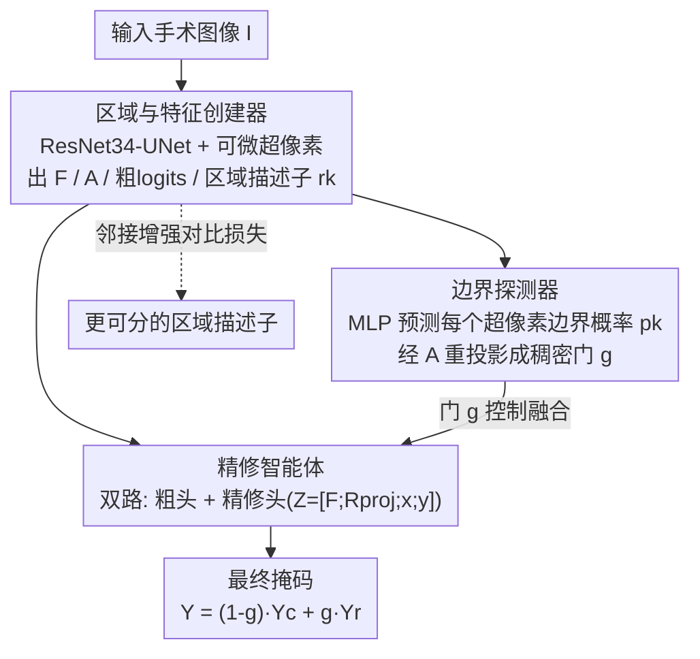

# Boundary-Responsive Differentiable Gating for Superpixel-Based Segmentation

**会议**: CVPR 2026  
**论文**: [CVF Open Access](https://openaccess.thecvf.com/content/CVPR2026/html/Ahmed_Boundary-Responsive_Differentiable_Gating_for_Superpixel-Based_Segmentation_CVPR_2026_paper.html)  
**代码**: 无  
**领域**: 语义分割 / 手术场景理解  
**关键词**: 可微超像素, 边界门控, 选择性精修, 对比学习, 实时分割

## 一句话总结
BRDG 把"可微超像素 + 边界门控 + 选择性精修"组成三智能体流水线：只在被判定为"边界"的超像素上启用高精度精修头，稳定区域内部直接走廉价粗分类，从而在手术分割上同时拿到高精度（mIoU +4.5~7.0、Boundary-F1 +10）和实时速度（150 FPS、24M 参数）。

## 研究背景与动机

**领域现状**：微创/机器人手术中的语义分割是器械追踪、导航、术中决策的基础。主流做法把分割当成高分辨率输入上的逐像素分类问题（U-Net、DeepLabv3+、SegFormer 等）。

**现有痛点**：逐像素稠密预测精度高，但在手术场景里计算开销大、参数多、空间冗余严重，而且独立像素预测常在细粒度器械边界处产生破碎、不连贯的区域，难以满足实时安全部署。超像素方法把感知相似的像素聚成紧凑区域、天然降冗余，但经典 SLIC / Felzenszwalb / Watershed 不可微，只能当固定预处理，无法适配"器械-组织边界""镜面反光"这类领域特有线索；即便是可微超像素（SSN、HERS），也大多面向通用视觉、医学鲁棒性不足。

**核心矛盾**：逐像素=高保真但昂贵，超像素=高效但牺牲语义精度（尤其边界）。更关键的是，现有可微超像素（SSN/HERS）习惯把信息**过早塌缩到区域级**——在 region 内做平均池化后直接分类，丢掉像素级细节，反而制造了它们本想避免的边界平滑误差。

**本文目标**：造一个既显式感知边界、又保留像素级信息的可微超像素框架，把精修算力只花在"该花的地方"（模糊边界），稳定内部仍享受超像素级效率。

**切入角度**：作者的观察是——一张图里真正需要高分辨率精修的像素只占很小一部分（语义边界附近）。如果能让网络自己学会"哪里是稳定内部、哪里是不确定边界"，就能用一个可微门控把精修头**稀疏地**只接到边界上。

**核心 idea**：用"边界响应的可微门控（boundary-responsive differentiable gating）"把粗预测和精修预测按像素融合——门值高的边界像素走精修路径，门值低的内部像素走廉价粗路径，三个协作智能体在单一可微框架内端到端学"refine 什么 / 怎么 refine"。

## 方法详解

### 整体框架
BRDG 是一个完全可微的架构，前向一次走完：输入图像 $I$ 经骨干编码 → 推断软超像素分配 → 估计每个超像素的边界置信度 → 把粗预测和精修预测按门控融合，输出最终 logits $\hat{Y}$。整个网络被组织成三个协作的"智能体（agent）"：Agent 1 负责造中层表示（稠密特征 $F$、软分配 $A$、粗 logits $\hat{Y}_c$、$K$ 个区域描述子 $r_k$）；Agent 2 是一个轻量门控头，从区域描述子预测每个超像素的边界概率，并把它重投影回稠密像素空间形成门 $g$；Agent 3 是双路分类器，用门 $g$ 把粗路径和精修路径融合。这种分工把"refine 什么"（Agent 2）和"怎么 refine"（Agent 3）解耦，都建立在 Agent 1 提供的多层特征之上。

### 关键设计

**1. 统一可微超像素：区域与特征创建器（Agent 1）**

这是整个网络的地基，目标是把"稠密特征"和"超像素 token"在一个可微框架里同时学出来。骨干是 ResNet-34 编码器（ImageNet 预训练、早期 BN 冻结若干 epoch 以保留预训练统计）配 U-Net 风格解码器，多尺度特征经双线性上采样和横向 skip 融合成稠密特征场 $F \in \mathbb{R}^{B\times C_f\times H\times W}$（$C_f=96$）。在 $F$ 上挂两个 $1\times1$ 卷积头：分配头产出超像素分配 logits，粗头产出粗分割 logits $\hat{Y}_c$ 作为快速 baseline。分配 logits 经温度 softmax 变成软分配图

$$A_{b,k,i,j} = \frac{\exp(A_{\text{logits},b,k,i,j}/\omega)}{\sum_{k'}\exp(A_{\text{logits},b,k',i,j}/\omega)}$$

再用软分配把 $F$ 软池化成 $K$ 个区域描述子 $r_k = \frac{\sum_{i,j} A_{k,i,j} F_{:,i,j}}{\sum_{i,j} A_{k,i,j}}$。和 SSN/HERS 不同的是，这里**没有**在算出 $r_k$ 后就把 $F$ 丢掉——$F$、$A$、$r_k$、$\hat{Y}_c$ 全部往下游传，正是为了在后面有选择地"把像素级信息重新引回来"。

**2. 边界路由精修：边界探测器学"该 refine 哪里"（Agent 2）**

痛点是：精修算力贵，不能对全图无差别地上精修头。Agent 2 的任务就是判断 $K$ 个区域里哪些是落在语义边界上的"模糊区"。它把区域描述子 $r_k$ 喂进一个小 MLP，预测每个超像素一个边界概率 $p_k\in[0,1]$，再用 Agent 1 的软分配图 $A$ 把这 $K$ 个区域级概率**重投影**回稠密像素空间，得到像素级门 $g_{i,j} = \sum_{k=1}^{K} A_{k,i,j}\,p_k$。门在边界超像素的像素上取值接近 1、在稳定内部接近 0。监督来自标签直接推导的 ground-truth 边界图：某像素的邻居有不同类即标为边界像素，含至少一个边界像素的超像素打正标签（1），其余为 0，用 BCE 监督 $p_k$，确保精修只在类与类的结构界面被触发。这和"把边界当并行分支预测"的旧路线（Gated-SCNN、SegFix）不同——这里的边界推理直接嵌进超像素分配过程，并学一个可微门来**选择性路由**精修。

**3. 双路门控融合：精修智能体决定"怎么 refine"（Agent 3）**

Agent 3 走两条路径，再由 Agent 2 的门 $g$ 融合。粗路径用一个 $1\times1$ 卷积从共享特征 $F$ 直接算粗 logits $\hat{Y}_c$，快但糙。精修路径的高保真不靠卷积本身，而靠它拼出来的富输入张量

$$Z_{i,j} = [\,F_{i,j};\ R_{\text{proj},i,j};\ x_{i,j};\ y_{i,j}\,]$$

其中 $F_{i,j}$ 是原始像素特征，$R_{\text{proj},i,j}=\sum_k A_{k,i,j} r_k$ 是该像素整个超像素区域的共享上下文，$x_{i,j},y_{i,j}$ 是归一化绝对坐标。$Z$ 经一个轻量 MLP（refine head）产出精修 logits $\hat{Y}_r$。最终输出按门做像素级线性混合：

$$\hat{Y} = (1-g)\,\hat{Y}_c + g\,\hat{Y}_r$$

门高（边界）处用精确的、带上下文的 $\hat{Y}_r$，门低（稳定内部）处用高效的 $\hat{Y}_c$。这个门控混合还顺带产生一个训练上的好处：精修路径几乎只在边界像素（$g\approx1$）上被训练、粗路径只在内部（$g\approx0$）上被训练，于是模型变成一个"稀疏精修器"，不用第二张沉重的精修网络就拿到高精度。

**4. 邻接增强边界对比损失：让相邻超像素在特征上"分得开"**

为了让区域描述子 $r_k$ 更具判别力（尤其同类内部 vs. 边界这种语义反差），作者在区域特征上加了一个对比损失，核心创新是一个"邻接增强项" $w_{ik}$：

$$L_{\text{bnd}} = -\frac{1}{|P|}\sum_{(i,j)\in P}\log\frac{\exp(s_{ij}/T)}{\sum_{k\neq i}\exp(s_{ik} w_{ik}/T)}$$

其中 $s_{ij}=r_i^\top r_j$ 是特征相似度，$T$ 是温度，$w_{ik}=1+\varepsilon\,\mathbb{1}[i,k\ \text{相邻}]$。这一项专门**加大相邻负样本对的惩罚**，逼着 Agent 1 给"挨在一起但分属语义边界两侧"的超像素学出尖锐的特征分离。相比通用的逐像素对比损失（计算重、忽略区域邻接），它直接利用超像素邻接图来挖硬负样本，把语义对比和几何邻接耦合进同一个可微目标，而且作用在 $K$ 个区域而非全部像素上、开销很小。当 $\varepsilon=1$（$\log 1=0$）退化为标准对比损失。

### 损失函数 / 训练策略
AdamW（基础学习率 $1\times10^{-4}$、权重衰减 $1\times10^{-4}$），编码器用判别式学习率（约为基础率的 $0.1\times$）以迁移 ImageNet 通用特征、解码器/头用基础率快速学任务表示。输入 resize 到 $512\times640$，共 100 epoch 多阶段调度：预热（1–5 epoch）冻结 ResNet 编码器，只开主分割损失（CE 与 Tversky 各 0.5 加权）让解码器/头先稳；解冻爬升（6–10 epoch）编码器以 $0.1\times$ 学习率解冻、辅助损失权重从 0 线性升到目标；全量训练（11–60 epoch）所有组件按最终权重一起训。

## 实验关键数据

### 主实验
四个手术分割任务上的对比（mIoU / Dice / BF1@2px，模型成本与数据集无关，$512\times640$）：

| 方法 | EndoVis'18 Parts mIoU | EndoVis'18 Tools mIoU | EndoVis'18 Tools BF1 | Params(M) | FPS |
|------|------|------|------|------|------|
| DeepLabv3+ (R101) | 0.56 | 0.78 | 0.67 | 61.0 | 15.1 |
| SegFormer-B5 | 0.57 | 0.71 | — | 84.7 | 13.84 |
| U-Net (R34) | 0.53 | 0.64 | 0.21 | 13.39 | 45.96 |
| SSN（可微超像素） | 0.37 | 0.41 | 0.30 | 0.66 | 271.62 |
| HERS（可微超像素） | 0.45 | 0.70 | 0.60 | 7.70 | 564.76 |
| **BRDG（本文）** | **0.72** | **0.75** | **0.71** | 23.9 | 150.25 |

- 精度：EndoVis'18 Parts 上 0.72 mIoU，比最强超像素法 HERS +6 点、比最强逐像素法（MedT）+7 点；Tools 上比 SegFormer-B5 +4.46 点。
- 边界：Tools 的 BF1 达 0.71，比 HERS 高 +10.88 点，显示门控精修对边界刻画的优势。
- 效率：150.25 FPS（6.63 ms/帧），比 DeepLabv3+/SegFormer-B5 快约 10×，参数比 SegFormer-B5 小约 3.5×。SSN 虽更快但 mIoU<0.42 无竞争力。

### 消融实验
EndoVis2018-Part 上（K=100，inference 单位 ms，Peak Mem 单位 GB）：

| 配置 | mIoU | Inference | FPS | Peak Mem | 说明 |
|------|------|------|------|------|------|
| No-superpixels | 0.57 | 24 | 128.88 | 1.53 | 退化成纯逐像素，掉到和 SegFormer 同水平、显存反增 >400MB |
| No-boundary | 0.57 | 8.12 | 123.20 | 1.52 | 去掉边界 BCE + 边界对比损失，掉 0.15 |
| No-refine / Gate=0 | 0.61 | 6.63 | 150.90 | 1.17 | 只用粗头，掉 11 点；去精修并不省时省显存 |
| Only-coarse | 0.52 | 9.8 | 65 | 1.23 | 仅粗路径变体 |
| **Full** | **0.72** | **6.63** | **150.25** | **1.05** | 完整模型 |

### 关键发现
- 边界监督贡献最大之一：去掉边界 BCE + 边界对比损失（No-boundary）直接掉 0.15 mIoU，说明边界感知监督是关键。
- 选择性精修是免费午餐：重新启用精修头与学习门后 mIoU 从 0.61 回到 0.72，而推理仍是 6.63 ms、显存反而从 1.17 降到 1.05 GB——学习门"只精修边界、保留粗内部"优于纯 coarse 或纯 refine。
- 超像素数 $K$ 存在最优：BSDS500 上 $K=500$ 时 Boundary Recall 最高（0.67），继续增大（到 1000）反而下降，因为分配过度碎片化、损害边界贴合。
- $\varepsilon$（邻接增强强度）在 $>1$ 区间内稳定，过大则过度强调边界、整体分割质量下降。
- 骨干无关：ResNet-34→50→101→ViT 性能平滑上升（72.0→72.7→72.9→74.78 mIoU），但 ViT 参数飙到 99M；ResNet-34（24M）是手术域效率-精度最优点。
- 失效模式：主要失败是学习门"误触发"（把内部区域错误送进精修头或抑制了真边界）；合成扰动中雾（fog）退化最大（mIoU 82.3→68.9），运动/高斯模糊容忍更好，说明低频对比退化比高频噪声更伤边界门控。

## 亮点与洞察
- 把"refine 什么"和"怎么 refine"显式拆成两个智能体：Agent 2 只学边界概率、Agent 3 只管双路融合，门控天然让精修头**稀疏训练**在边界像素上——这是"高精度不靠第二张重网络"的关键，可迁移到任何"全图精修太贵"的稠密预测任务。
- "去精修不省时省显存"是个反直觉但很有说服力的消融：它证明 BRDG 的精修开销几乎被门控吃掉了，删掉它只掉精度、不换来效率，因此精修是纯增益。
- 邻接增强对比损失只在 $K$ 个区域上算、却专挑"相邻但跨边界"的硬负样本，用超像素邻接图把几何先验注入对比目标，比逐像素对比省得多，是一个轻量好用的 trick。
- 保留稠密特征 $F$ 不过早塌缩到区域级，正面回应了 SSN/HERS 的边界平滑顽疾——"超像素做效率、像素做精度"在一张图里共存。

## 局限与展望
- 作者承认门会误触发（gate-misfire），把内部错送精修或抑制真边界，是主要失败来源。
- 对低频对比退化（雾）鲁棒性差，mIoU 掉 13 点以上，限制了恶劣成像条件下的可靠性。
- 通用域结果（Cityscapes 0.54、ADE20K 0.60）在"foveated/高效分割协议"下评测，作者明确声明不可与通用分割榜单直接比；对小物体/遮挡场景仍吃力。
- 改进思路（自己看）：门控目前是单尺度二值化倾向，或可做多尺度/软层级门控缓解误触发；雾鲁棒性可结合去雾或对比度归一化预处理；$K$ 固定且最优值依数据集，能否做自适应超像素数也是开放问题。

## 相关工作与启发
- **vs SSN / HERS（可微超像素）**: 它们把信息塌缩到区域级、在池化特征上分类，丢像素细节导致边界平滑；BRDG 保留稠密 $F$ 并用门把像素信息**选择性重新引回**边界，BF1 大幅领先（Tools +10.88）。
- **vs Gated-SCNN / SegFix / RefineNet（边界精修）**: 它们多把边界当并行分支或后处理偏移修正；BRDG 把边界推理直接嵌进超像素分配、并学可微门沿预测边界**路由**精修，是结构线索而非旁路分支。
- **vs 逐像素对比（pixel-level contrastive / ReCo / PiCIE）**: 它们逐像素采样、对高分辨率手术图开销大；BRDG 的邻接增强边界对比损失在超像素图上挖硬负样本，把语义对比和几何邻接耦进单一可微目标。

## 评分
- 新颖性: ⭐⭐⭐⭐ 边界响应可微门控 + 三智能体稀疏精修 + 邻接增强对比，组合清晰且针对超像素塌缩痛点
- 实验充分度: ⭐⭐⭐⭐ 四手术数据集 + 通用域 + 组件/超像素数/α/骨干/失效模式全套消融
- 写作质量: ⭐⭐⭐⭐ Algorithm + 公式 + 三智能体叙述清楚，个别数字（如 mIoU 百分比/小数混用、82.3 这类未在表中出现的扰动基线）需以原文为准
- 价值: ⭐⭐⭐⭐ 真正解掉手术实时分割的精度-效率权衡（150 FPS、24M），对资源受限部署有直接意义

<!-- RELATED:START -->

## 相关论文

- [\[CVPR 2026\] Differentiable Laplacian Matrix Guided Superpixel Segmentation](differentiable_laplacian_matrix_guided_superpixel_segmentation.md)
- [\[CVPR 2026\] PRUE: A Practical Recipe for Field Boundary Segmentation at Scale](prue_a_practical_recipe_for_field_boundary_segmentation_at_scale.md)
- [\[CVPR 2026\] SouPLe: Enhancing Audio-Visual Localization and Segmentation with Learnable Prompt Contexts](souple_enhancing_audio-visual_localization_and_segmentation_with_learnable_promp.md)
- [\[CVPR 2026\] Universal 3D Shape Matching via Coarse-to-Fine Language Guidance](universal_3d_shape_matching_via_coarse-to-fine_language_guidance.md)
- [\[CVPR 2026\] GeoSURGE: Geo-localization using Semantic Fusion with Hierarchy of Geographic Embeddings](geosurge_geo-localization_using_semantic_fusion_with_hierarchy_of_geographic_emb.md)

<!-- RELATED:END -->
