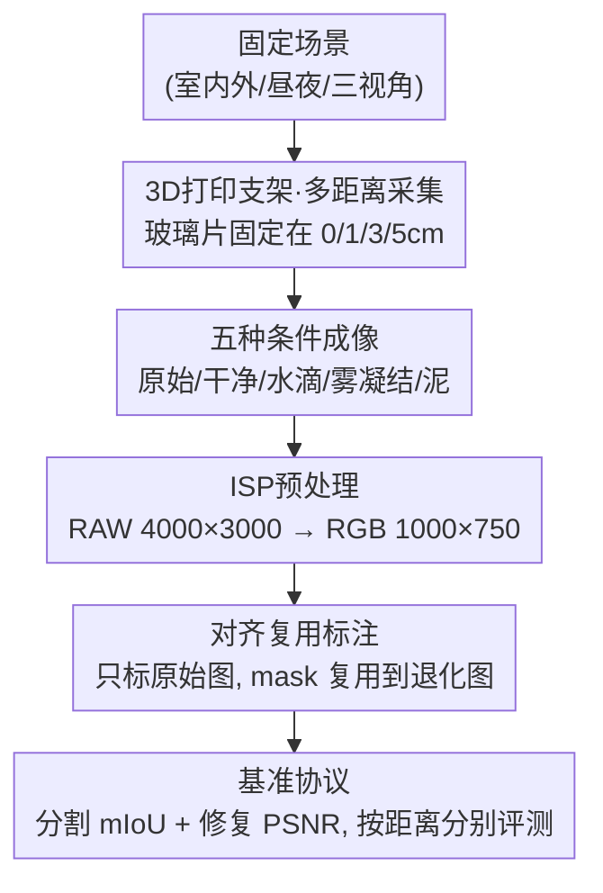

# CLP: A Real-World Dataset of Contaminated Lens Protectors for Robust Semantic Segmentation

**会议**: CVPR 2026  
**论文**: [CVF Open Access](https://openaccess.thecvf.com/content/CVPR2026/html/Park_CLP_A_Real-World_Dataset_of_Contaminated_Lens_Protectors_for_Robust_CVPR_2026_paper.html)  
**代码**: https://clp-dataset.github.io （项目页）  
**领域**: 语义分割 / 鲁棒感知 / 数据集  
**关键词**: 镜头保护罩污染、真实退化、配对干净-退化图像、多距离采集、鲁棒语义分割

## 一句话总结
作者用一个 3D 打印的"玻璃片支架"在手机镜头前固定可替换的脏污玻璃片，造出了 CLP——一个**真实物理污染**的镜头保护罩数据集（泥、水滴、雾凝结三类污染 × 0/1/3/5 cm 四种镜头-保护罩间距），提供严格对齐的「干净/退化」图像对和 125 类稠密语义标注，并系统评测了一大批分割与修复模型，给出"鲁棒性更靠适配策略而非模型规模""任务感知修复才真正帮分割"等基准结论。

## 研究背景与动机
**领域现状**：语义分割靠大规模数据集和基础模型已经做得很好，鲁棒性研究也覆盖了数字损坏（如 ImageNet-C 风格的噪声/模糊）和恶劣天气（雾、雨、夜间）。这些 benchmark 要么在干净图上**合成**退化以拿到对齐的图像对，要么实地采集真实恶劣天气但**没有像素级对齐**的干净参考。

**现有痛点**：贴在镜头上的**物理污染物**（泥、水滴、雾凝结）几乎没人研究。这类污染产生的伪影既严重又**空间不规则**（模糊、偏色、遮挡、散射混在一起），合成损坏根本模拟不出来；而要采到「同一场景的干净图 + 真实污染图」配对又非常难。少数前作（如 SIDL）用定制硬件采过真实配对数据，但只覆盖智能手机这种固定结构。

**核心矛盾**：真实相机系统里，镜头前面往往还隔着一层**保护罩/外壳**，而镜头与保护罩之间有一段**物理间隙**（为了散热、抗震、便于维护，不同设备间隙不同）。这段间隙会带来不同的**折射效应**——同样一摊泥贴在保护罩上，间隙不同会产生**截然不同的图像退化模式**。已有工作把污染直接贴在镜头上，完全忽略了这个"镜头-保护罩间距"维度。

**本文目标**：造一个真实、可控、带稠密标注的镜头保护罩污染数据集，让研究者能（1）拿到真实污染下的配对干净/退化图，（2）评测稠密识别性能，（3）系统研究间距这一几何因素对感知的影响。

**切入角度**：用智能手机当低成本代理（真用机器人/车采集太贵难扩展），再用一个 **3D 打印支架**把可替换玻璃片精确固定在镜头前 0/1/3/5 cm 处，从而既拿到真实物理折射退化，又保证几何可控、场景对齐。

**核心 idea**：用"可控制间距的脏玻璃片代理 + 严格几何对齐"，把过去无法采集的「真实镜头保护罩污染配对数据 + 稠密分割标注」做成一个可复现的 benchmark。

## 方法详解

### 整体框架
CLP 本质是一个**数据采集与基准构建管线**，没有提出新模型，贡献在数据集本身。整体流程是：先用 3D 打印支架把一块薄玻璃片固定在手机镜头前的可选距离上 → 对同一固定场景，先拍**原始图**（不放玻璃）、再拍**干净玻璃图**、再换上某一类污染玻璃在四个距离各拍一张 → 把所有图用开源 ISP 从 RAW 转 RGB 并统一缩放 → 只在原始（无保护罩）图上做稠密语义标注，再凭几何对齐把同一套 mask 复用到对应的退化图 → 划分训练/测试，配上分割 mIoU 与修复 PSNR 两套评测协议。最终得到 600 个场景、4,800 张退化图、125 个语义类、19,203 个实例。

### 关键设计

**1. 3D 打印保护罩支架 + 多距离采集：把"镜头-保护罩间距"变成可控变量**

这一设计直接针对"已有工作忽略镜头与保护罩之间物理间隙"的痛点。作者做了一个定制 3D 打印的手机支架（Figure 3a），前面有插槽可以把一块薄透明玻璃片精确固定在镜头前的 **0 cm、1 cm、3 cm、5 cm** 四个预设距离上。采集时，相机先调到某个固定视角（向上/水平/向下三种安装姿态之一），然后**保持场景和相机不动**，只移动污染玻璃片到四个距离各拍一张。这样间距就从一个被忽略的混杂因素，变成了一个能被单独 ablate 的实验变量。它的价值在 Figure 5 的分析里显现：不同污染类型对距离的响应完全不同——干净玻璃的散射失真随距离**单调增大**；雾凝结反而在更大距离**变好**（凝结层离焦平面更远而散焦）；泥和水滴这类局部遮挡随距离只是**位置平移、整体严重程度不变**。这个"间距×污染类型"的交互，是合成数据和贴镜头采集都给不出的。

**2. 五种条件 + 真实物理污染：覆盖原始/干净/水滴/雾凝结/泥的对齐图像对**

针对"合成伪影无法刻画真实污染复杂度"的痛点，CLP 对每个场景采五种条件：**Original**（不放玻璃，作为修复目标和标注用的无保护罩参考）、**Clean**（透过无污染玻璃，会引入轻微反射/光衰减——Figure 4 的像素直方图显示它与原始图分布高度接近）、**Water Droplets**（往玻璃喷水，每颗水珠产生复杂折射）、**Condensation**（用热水蒸汽让玻璃起雾，造成大面积模糊）、**Mud**（泼浓泥浆，造成大区域重度遮挡）。三类污染都是**真实物理制造**而非数字合成，因此天然带有真实的折射、散射、遮挡混合伪影。每个场景拿到 9 张对齐图：1 张原始 + 4 个距离 × (干净, 污染) 各一对，合计 600×2×4 = 4,800 张退化图。

**3. 对齐复用标注：只标原始图，靠几何一致把 mask 搬到退化图上**

这是数据集能拿到稠密标注的关键工程技巧，针对"在重度退化图上直接逐像素标注不可靠"的痛点。泥/雾把大片区域糊住、扭曲，人在退化图上根本标不准。作者利用采集时**视角在原始图和退化图之间严格一致**这一前提，只在干净的**原始（无保护罩）图**上做稠密语义标注，再把同一套 mask 直接复用到对应的退化图上。所有 mask 由 4 位专家手工标注并经过**多阶段交叉核对**。最终得到 125 个语义类、19,203 个实例，且测试集里每个类至少出现一次，保证类别均衡评测。

> 设计 1（支架/距离）保证了"几何对齐"这一前提成立，设计 3（标注复用）正是建立在这个前提上——两者是因果相扣的：没有可控对齐的采集，就没有把原始图 mask 搬到退化图的可能。

### 损失函数 / 训练策略
本文是数据集论文，不提出新训练目标，只是用各 baseline 的官方训练管线在 CLP 上跑基准。实现细节：分割输入缩放到 $512\times512$、修复缩放到 $128\times128$，沿用各 codebase 默认增广（随机翻转/裁剪），batch size 分别为 8 和 4；评测时分割预测先缩回训练裁剪尺寸再算 mIoU，修复在原分辨率算 PSNR；全部实验在单张 RTX 4090 上用固定随机种子完成。

## 实验关键数据

### 主实验
作者在 CLP 测试集上横向评测了 6 类范式共 12 个分割模型（监督 / 域泛化 DG / 域适配 DA / 基础模型 / 鲁棒方法 / 任务感知修复），指标为 mIoU（%）。下表摘录各方法的总体平均与几个代表类型（完整表含 0/1/3/5 cm 逐距离）：

| 方法 (范式) | Clean Avg | Mud Avg | Water Avg | Cond. Avg | Overall |
|------|------|------|------|------|------|
| Mask2Former (监督) | 44.0 | 29.5 | 39.8 | 32.5 | 36.4 |
| VMamba (监督) | 47.9 | 29.3 | 39.5 | 33.7 | 37.6 |
| Rein (DG) | 56.2 | 36.6 | 54.0 | 40.5 | 46.9 |
| **SoMA (DG)** | 57.4 | 40.0 | 51.4 | 43.2 | **48.0** |
| DAFormer (DA) | 44.9 | 27.5 | 35.1 | 28.5 | 34.0 |
| MIC (DA) | 39.5 | 26.1 | 33.2 | 30.0 | 32.2 |
| DINOv2 (基础模型) | 52.6 | 40.9 | 53.2 | 42.1 | 47.2 |
| SAM (基础模型) | 46.0 | 30.2 | 46.2 | 34.4 | 39.2 |
| RobustSAM (鲁棒) | 45.5 | 33.6 | 44.4 | 34.4 | 39.5 |
| FIFO (鲁棒) | 38.2 | 27.5 | 33.2 | 30.0 | 32.2 |
| UniRestore (任务感知修复) | 42.7 | 30.8 | 40.0 | 35.6 | 37.3 |
| URIE (任务感知修复) | 40.8 | 25.6 | 35.3 | 27.2 | 32.2 |

几个对得上的关键数字：**SoMA 以 48.0 overall 居首**，DINOv2 紧随 47.2；论文强调 DINOv2 在**仅看污染类型**（泥/水/雾，排除 clean）的平均上最高、且在 5 cm 重度退化下仍能保住粗略语义结构（Figure 8 中 shoe/door 仍可分辨），归因于其大规模预训练的强视觉先验。最反直觉的是 **DG 全面打败 DA**：SoMA、Rein 相对最强的 DA baseline（DAFormer，34.0）分别 **+14.0、+12.9 mIoU**——DG 只在干净图上训练却赢过了能看到无标注污染图的 DA。所有模型在**泥污染**下都随距离增大显著掉点（重度遮挡），其他污染因遮挡更弱、随距离变化小。

修复任务用 PSNR（dB）评测：DiffUIR 以 **27.92 dB** 总体最佳，UniRestore 26.85，均为扩散/生成式方法，超过 NAFNet（25.76）、Restormer（25.22）等确定性监督 baseline，说明生成式先验更适合 CLP 这种复杂退化；但重度退化区域修复后仍有可见伪影，是开放难题。

### 消融实验

**联合"修复→分割"管线（Table 3）**：把修复模型接到 Mask2Former 前面，看修复到底帮不帮分割。基线 Mask2Former 总体 33.9 mIoU。

| 配置 | Water | Mud | Cond. | Overall |
|------|------|------|------|------|
| Mask2Former (基线) | 39.8 | 29.5 | 32.5 | 33.9 |
| NAFNet + M2F | 35.2 (-4.6) | 25.3 (-4.2) | 32.2 (-0.3) | 33.7 (-2.7) |
| DiffUIR + M2F | 37.9 (-1.9) | 29.2 (-0.3) | 34.9 (+2.4) | 35.7 (-0.7) |
| URIE + M2F | 35.3 (-4.5) | 25.6 (-3.9) | 27.2 (-5.3) | 32.2 (-4.2) |
| **UniRestore + M2F** | 40.0 (+0.2) | 30.8 (+1.3) | 35.6 (+3.1) | 35.5 (+1.6) |

结论很尖锐：**修复质量高 ≠ 分割更好**。DiffUIR 修复 PSNR 最高，但接到分割上只在雾凝结上 +2.4、水滴 -1.9、泥 -0.3；通用修复（NAFNet/URIE）甚至大幅拖累分割。唯一**全面提升基线**的是任务感知修复 **UniRestore（总体 +1.6，雾 +3.1、泥 +1.3）**，说明面向下游任务训练的修复才是有希望的方向。

**数据规模（Table 4）**：用 10%–100% 训练场景看 scaling，结果在全污染类型上平均。

| 训练比例 | SoMA mIoU | DAFormer mIoU | NAFNet PSNR | Restormer PSNR |
|------|------|------|------|------|
| 10% | 22.19 | 11.56 | 24.63 | 24.54 |
| 50% | 41.64 | 28.50 | 25.39 | 25.00 |
| 100% | 48.69 | 34.73 | 25.77 | 25.22 |

数据越多分割/修复都涨，但**大规模处收益递减**，进一步 scaling 是开放方向。

### 关键发现
- **DG > DA 是最反直觉的发现**：只在干净图训练的域泛化方法，竟稳定优于能利用无标注污染图的域适配方法（SoMA +14.0 mIoU），提示镜头污染这种带光学畸变+部分遮挡的域偏移，学"域不变表征"比"对齐两域分布"更有效。
- **鲁棒性靠适配策略而非模型规模**：DINOv2/SoMA/Rein 等相对高效的模型反而拿到最好 mIoU，而 SAM（700M）、RobustSAM（790M）、UniRestore（2512 GMACs）这些大模型并没占优——朴素堆规模无优势（Figure 10）。
- **间距效应随污染类型分化**：干净玻璃失真随距离单调增大；雾凝结在大距离反而变好（散焦离焦平面）；泥/水滴遮挡随距离只平移不加重。这正是"镜头-保护罩间距"维度的价值所在。
- **泥是最难的污染**：所有模型在泥+大距离下掉点最猛（重度遮挡 + 大区域细节丢失）。

## 亮点与洞察
- **用一个几十块钱的 3D 打印支架解决了"几何对齐"这个老大难**：靠物理上保持视角不变，把"在退化图上没法可靠标注"的死结，巧妙转成"标原始图、复用 mask"，这是数据集能拿到稠密标注的根本。这个"代理采集 + 可控变量"的思路可迁移到任何需要真实退化配对数据的任务（如雨雪挡风玻璃、内窥镜污染）。
- **第一次把"镜头-保护罩间距"做成可 ablate 的维度**：发现不同污染对距离的响应方向相反（雾变好、干净变差），这是只贴镜头采集永远看不到的现象，对真实自动驾驶/机器人相机外壳设计有直接参考价值。
- **两个被广泛默认的假设被打脸**："修复质量越高下游越好"和"模型越大越鲁棒"在 CLP 上都不成立，结论实用且具警示性。
- **统一的训练/测试场景划分**让分割与修复能在同一协议下做联合实验（修复后再分割），方法学上干净。

## 局限与展望
- **代理采集 vs 真实部署的 gap**：用手机 + 玻璃片模拟，虽然真实物理污染，但和真车/真机器人镜头外壳的光学结构、动态污染（行进中溅泥、连续起雾）仍有差距；场景也是**静态固定**的，缺时序/动态污染。
- **规模偏小**：仅 600 场景、4,800 退化图，远小于通用分割数据集；Table 4 已显示大规模处收益递减，但绝对量仍可能限制大模型充分发挥。
- **只覆盖三类污染、四个离散距离**：泥/水/雾之外（如油污、灰尘、冰、刮痕）未覆盖；距离是 0/1/3/5 cm 离散采样而非连续。
- **未提出新方法**：论文定位是 benchmark，给出的是基准与洞察，针对镜头污染的专用鲁棒分割/修复算法留给未来工作。
- 改进方向：把代理采集扩到车载/机器人真实外壳、加入动态/时序污染、用 CLP 真实配对数据驱动专门的任务感知联合修复-分割模型。

## 相关工作与启发
- **vs SIDL [13]**：同样采真实物理污染配对数据，但 SIDL 只覆盖智能手机的固定结构，无法系统改变"镜头-保护罩间距"；CLP 用可调支架把间距做成可控变量，并补上了稠密语义标注。
- **vs 合成损坏/恶劣天气 benchmark（PASCAL VOC-C、Foggy Cityscapes 等）**：它们要么是数字合成伪影（无法刻画真实折射/散射），要么真实但**无像素级对齐**；CLP 提供真实物理污染 + 严格对齐的干净/退化对 + mask，三者兼得。
- **vs 监视器重录污染数据 [52]**：前作把数据集显示在显示器上、隔着喷水玻璃重拍以拿对齐对；CLP 直接采真实三维场景，退化更接近真实部署。
- **vs 任务感知修复（UniRestore [6]、EDTR [32]）**：这些方法多依赖合成/无配对伪影；CLP 用真实对齐对 + 稠密标注，让"修复+分割"的联合评测第一次能在真实污染下做，且实验证明只有任务感知修复（UniRestore）真正稳定帮到分割。

## 评分
- 新颖性: ⭐⭐⭐⭐⭐ 首个真实物理「镜头保护罩污染」数据集，且把被忽略的"镜头-保护罩间距"做成可控维度。
- 实验充分度: ⭐⭐⭐⭐⭐ 6 类范式 12 个分割模型 + 6 个修复模型 + 联合管线 + 数据 scaling，基准做得很全。
- 写作质量: ⭐⭐⭐⭐ 动机（物理间隙的折射差异）讲得清楚，图表丰富；个别"最佳模型"表述（DINOv2 47.2 vs SoMA 48.0）需结合是否含 clean 区分。
- 价值: ⭐⭐⭐⭐⭐ 给真实自动系统的镜头污染鲁棒感知提供了稀缺的对齐数据与一批可复现基准结论。

<!-- RELATED:START -->

## 相关论文

- [\[CVPR 2026\] XSeg: A Large-scale X-ray Contraband Segmentation Benchmark for Real-World Security Screening](xseg_a_large-scale_x-ray_contraband_segmentation_benchmark_for_real-world_securi.md)
- [\[CVPR 2026\] Denoise and Align: Towards Source-Free UDA for Robust Panoramic Semantic Segmentation](denoise_and_align_towards_source-free_uda_for_robust_panoramic_semantic_segmenta.md)
- [\[CVPR 2026\] RealVLG-R1: A Large-Scale Real-World Visual-Language Grounding Benchmark for Robotic Perception and Manipulation](realvlg-r1_a_large-scale_real-world_visual-language_grounding_benchmark_for_robo.md)
- [\[CVPR 2026\] Towards Robust Multi-Modal Semantic Segmentation with Teacher-Student Framework and Hybrid Prototype Distillation](towards_robust_multi-modal_semantic_segmentation_with_teacher-student_framework_.md)
- [\[CVPR 2026\] Exploring the Underwater World Segmentation without Extra Training](exploring_the_underwater_world_segmentation_without_extra_training.md)

<!-- RELATED:END -->
