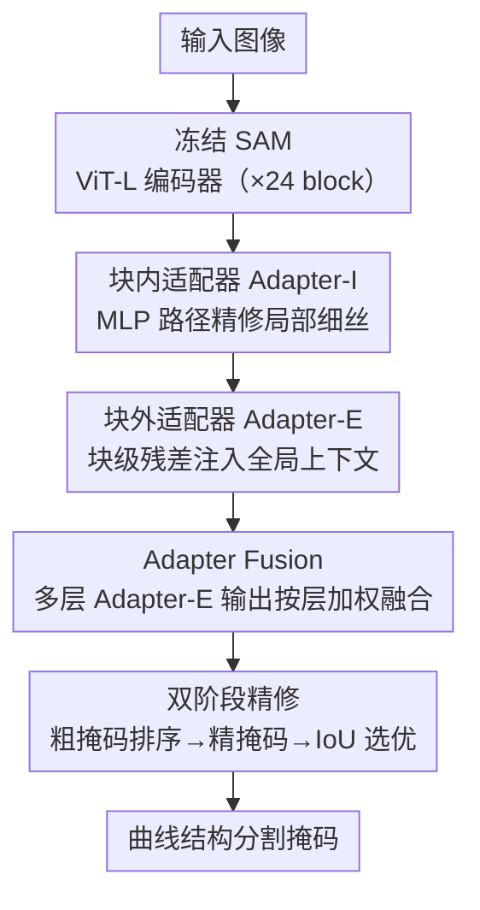

# Dual-level Adapter Boosting Prompt-free Curvilinear Structure Segmentation

**会议**: CVPR 2026  
**论文**: [CVF Open Access](https://openaccess.thecvf.com/content/CVPR2026/html/Zhu_Dual-level_Adapter_Boosting_Prompt-free_Curvilinear_Structure_Segmentation_CVPR_2026_paper.html)  
**代码**: https://github.com/kylechuuuuu/SACM  
**领域**: 语义分割 / 参数高效微调  
**关键词**: 曲线结构分割, SAM 适配器, 无提示分割, 跨域泛化, 小样本微调

## 一句话总结
在冻结的 SAM 编码器上插入「块内 + 块外」双层适配器，再配一个聚合多层特征的无提示解码器和双阶段掩码精修，仅用 18 张标注图（每数据集 3-shot）就能把视网膜血管、道路、轮胎纹、电线等 12 个差异极大的曲线结构数据集做到 SOTA，且对训练时没见过的新类/新分布有很强的零提示泛化。

## 研究背景与动机
**领域现状**：曲线结构分割（Curvilinear Structure Segmentation, CSS）面向血管、神经纤维、裂纹、道路这类又细又长又分叉的目标，是医学影像、遥感、材料科学的共同刚需。主流做法从 U-Net 到各种 CNN 改进（残差、多尺度聚合、注意力、可变形卷积），近年又有 Transformer 混合架构和状态空间模型。

**现有痛点**：CSS 有个根本性的两难——既要捕捉**局部细粒度**（淡边界、强度不均、宽度剧变的细丝），又要保持**全局拓扑连贯**（连续性、延展性、分叉结构）。传统方法往往顾此失彼：在低对比度区域产生断裂片段，或丢掉细节而破坏拓扑完整性。更要命的是它们重度依赖大规模、领域专属的标注数据，跨域泛化极差——在视网膜血管上训练的模型几乎无法分割卫星道路图。

**核心矛盾**：基础模型 SAM 带来了零样本泛化的范式转变，但它是为通用物体分割设计的，对曲线结构有两个结构性偏差：(1) **提示机制本身不适合 CSS**——血管/道路这种密集、扭曲、互联的网络，用稀疏的点/框提示根本无法高效地完整分割；(2) **现有适配策略不够**——当前的适配器方法只在 Transformer block 的 MLP 层里插入轻量模块（单层适配），只能精修块内局部特征，却忽略了**全局结构建模机制本身**，无法显式增强模型捕捉长程空间依赖的能力，因而既建不好全局拓扑，也迁不动跨域结构知识。

**本文目标**：在冻结的 SAM 上做参数高效微调，同时解决「局部细节保真」与「全局拓扑连贯」，并彻底去掉提示、把所需标注压到极少。

**切入角度**：既然单层（块内）适配只动局部，那就再加一条**块外**通路，直接作用在整个 Transformer block 的残差连接上，让全局上下文随注意力层层传播；同时把提示分割整个换成「用学到的多层特征先验」来驱动解码。

**核心 idea**：用「块内适配器精修局部 + 块外适配器注入全局」的双层适配，配合「聚合多层外部适配器特征的无提示解码 + 双阶段拓扑精修」，把通用 SAM 改造成专门的曲线结构分割器 SACM。

## 方法详解

### 整体框架
SACM（Segment Anything Curve Model）整体是「冻结 SAM 图像编码器 + 双层适配器 DLAda + 无提示适配器融合解码器 PFAF-D」三件套。输入一张图，冻结的 ViT-L 编码器逐块前向；每个 Transformer block 上挂两个适配器——**Adapter-I** 嵌在块内 MLP 残差路径上精修局部细丝特征，**Adapter-E** 挂在整块的残差连接上注入全局上下文。24 个块的 Adapter-E 输出被收集起来，送进 **Adapter Fusion** 模块按层加权融合成一个全局结构先验，注入解码器，完全替代点/框/掩码提示。解码器再做 **双阶段精修**：第一阶段出粗掩码并按置信度给各预测头排序，第二阶段在排序条件下出精掩码，由 IoU 预测器选最优，从而在保边界的同时压住拓扑断裂。全程只训练 DLAda 和 PFAF-D，编码器骨干完全冻结。

### 关键设计

**1. 块内适配器 Adapter-I：在 MLP 路径上精修细丝局部特征**

针对「细丝边界淡、易和背景混」的局部痛点，Adapter-I 沿用参数高效微调的瓶颈结构，嵌在第 $l$ 个 Transformer block 的 **MLP 子模块残差路径**上。它是一个逐 token 的瓶颈模块：$\text{Adapter-}I(\mathbf{X}) = \mathcal{G}(\mathbf{X}\mathbf{W}_{\downarrow}^{I})\mathbf{W}_{\uparrow}^{I}$，其中 $\mathbf{W}_{\downarrow}^{I}\in\mathbb{R}^{D\times r}$、$\mathbf{W}_{\uparrow}^{I}\in\mathbb{R}^{r\times D}$ 是降/升投影，$r$ 是瓶颈比，$\mathcal{G}$ 是 GELU。它通过残差并入 MLP 输出：$\mathbf{H}^{I}_{\text{out}} = \text{MLP}(\text{LN}(\mathbf{Y})) + \mathbf{Y} + \text{Adapter-}I(\text{LN}(\mathbf{Y}))$，$\mathbf{Y}$ 是注意力之后的特征。

它有效是因为「逐 token」设计让适配器在 token 间的雅可比是块对角的，更新集中在通道维的局部精修上，从而强化细边、细血管这类局部判别特征，而不去扰动预训练 Transformer 已经学好的全局结构——这正是只动局部、保住骨干知识的关键。

**2. 块外适配器 Adapter-E：在块级残差上注入并传播全局上下文**

这是和常规适配器最大的区别。痛点是单层适配只在块内动局部，建不起长程拓扑。Adapter-E 不在块内，而是**绕在整个 Transformer block 外面的残差连接**上，处理归一化后的整块输出：$\mathbf{X}^{(l+1)} = F_l(\mathbf{X}^{(l)}) + \text{Adapter-}E(\text{LN}(F_l(\mathbf{X}^{(l)})))$，其中 $F_l$ 是第 $l$ 层 Transformer block，$\text{Adapter-}E(\mathbf{Y}) = \mathcal{G}(\mathbf{Y}\mathbf{W}_{\downarrow}^{E})\mathbf{W}_{\uparrow}^{E}$，瓶颈形式与 Adapter-I 相同但参数独立。

关键在于它接收的是**经过注意力 token 混合之后**的特征，所以它注入的扰动会自然顺着后续注意力层往下传；随着层数加深、token 交互密度增大，Adapter-E 的结构线索能影响到越来越远的 token，从而层层累积出长程依赖。论文用 Grad-CAM 证实：只开 Adapter-E 时注意力会高亮**整片血管结构**（但夹带些无关区域），只开 Adapter-I 时聚焦**局部细节**，两者互补——这正是把「全局拓扑建模机制」显式补回 SAM 的那一笔。

**3. Adapter Fusion 无提示解码：用多层特征先验取代点/框提示**

提示分割对 CSS 有三重不匹配：(i) 位置偏置——稀疏提示模糊细边界、打断细丝连续性；(ii) 尺度失配——固定提示编不出细血管和复杂分叉同时需要的多尺度信息；(iii) 拓扑无关——提示不给任何全局连续性引导。所以 SACM 干脆全程无提示，改用「学到的特征级结构引导」。

Adapter Fusion 把 $L$ 个编码层的外部适配器输出 $\{\mathcal{E}_1,\dots,\mathcal{E}_L\}$ 收集起来：先平均池化得层级描述子 $\mathbf{z}_l = \mathcal{A}(\mathcal{E}_l)$；由于不同层对 CSS 贡献不等，再用 FFN+Softmax 学一组自适应层权重 $\boldsymbol{\alpha} = \text{Softmax}(\text{FFN}(\text{Concat}(\mathbf{z}_1,\dots,\mathbf{z}_L)))$；然后加权聚合并上采样 $\mathcal{F}_{\text{fusion}} = \text{UP}(\text{MLP}(\sum_{l=1}^{L}\alpha_l\cdot\mathcal{E}_l))$，最后以残差注入解码器 $\mathbf{F}^{\text{out}}_{\text{decoder}} = \mathbf{F}^{\text{in}}_{\text{decoder}} + \mathcal{F}_{\text{fusion}}$。因为 Adapter-E 本身就编码了跨层、注意力混合后的上下文，天然带细长几何和分叉信息，这个融合描述子就成了驱动自动分割的全局先验。

**4. 双阶段精修：把局部边界精度和全局拓扑连贯拆开优化**

单趟解码常出「局部看着对、全局不连贯」的掩码——血管断、长出假分支。双阶段精修用两个**结构相同**的 MLP 头分工。第一阶段 MLP1 生成粗掩码评估全局拓扑：$\mathbf{M}^{(1)} = \text{MLP}_1(\mathbf{U})$，$\mathbf{w} = \text{Softmax}(\mathcal{M}(\mathbf{M}^{(1)}))$，其中 $\mathbf{U}$ 是解码器上采样后的融合特征图、$\mathcal{M}$ 是最大池化、$\mathbf{w}$ 是各头的置信权重，并按最大空间激活强度排序 $s = \text{argsort}(\mathbf{w}, \text{descending})$。第二阶段 MLP2 在排序条件下出精掩码 $\mathbf{M}^{(2)} = \text{MLP}_2(\mathbf{U}, s)$，再由一个基于 MLP 的 IoU 预测器从有序候选里挑最优。这样设计让「拓扑更靠谱的头」主导最终预测，同时保住边界锐度，最终在「锐利局部边界」和「血管连通性」之间取得平衡。

### 损失函数 / 训练策略
损失是 BCE 与 Dice 的加权和：$\mathcal{L}_{SACM} = \mathcal{L}_{BCE} + \lambda\cdot\mathcal{L}_{Dice}$，$\lambda$ 控制两项的权衡（网格搜索得 $\lambda=0.4$ 最优）。训练时冻结 SAM ViT-L 编码器，只更新 DLAda 与 PFAF-D；50 epoch、batch size 1、学习率 $3\times10^{-4}$、AdamW（$\beta_1=0.9,\beta_2=0.999$）+ 余弦调度，单卡 RTX 4090。每数据集仅 3-shot、6 个训练数据集共 18 张图。适配器瓶颈比默认 $r=0.1$。

## 实验关键数据

评测覆盖 12 个曲线结构数据集，沿两个维度划分：类别熟悉度（Base 训练见过的类 / Novel 全新类）× 数据分布（Seen 同数据集 / Unseen 不同分布）。指标含像素级 Dice、IoU 和拓扑级 clDice（在骨架化中心线上比对拓扑正确性）、边界级 HD95（95 分位 Hausdorff 距离，越低越好）。所有 SAM 基线和 SACM 都用相同的 ViT-L、相同预训练权重、相同 3-shot 协议；SAM 类基线均用点提示，SACM 完全无提示。

### 主实验

Base-Seen（训练见过的 4 个数据集，Dice / IoU，%）：

| 方法 | DRIVE | CHASEDB1 | DCA1 | CORN |
|------|-------|----------|------|------|
| U-Net (2015) | 74.66 / 59.81 | 71.53 / 55.89 | 67.41 / 51.77 | 22.46 / 12.88 |
| BCUNet (2023) | 78.08 / 64.32 | 78.24 / 64.35 | 73.35 / 58.29 | 29.76 / 17.57 |
| CWSAM (2025) | 61.01 / 43.56 | 54.85 / 38.22 | 63.69 / 46.91 | 27.07 / 15.53 |
| SegDINO (2025) | 61.78 / 44.56 | 55.67 / 39.23 | 48.95 / 32.41 | 27.34 / 16.12 |
| **SACM（本文）** | **78.89 / 65.24** | **79.27 / 65.72** | **75.67 / 61.10** | **55.38 / 38.44** |

跨域泛化（Unseen，Dice / IoU，%）：

| 方法 | DSCA | XCAD | FIVES | WIRE(Novel) | LEAF(Novel) | ROAD(Novel) |
|------|------|------|-------|------|------|------|
| CWSAM (2025) | 44.31 / 28.86 | 68.32 / 52.24 | 64.95 / 48.65 | 42.61 / 29.55 | 27.85 / 17.01 | 24.79 / 14.53 |
| SAM-OCTA (2024) | 65.65 / 49.46 | 68.58 / 54.86 | 74.51 / 60.94 | 44.20 / 30.37 | 20.43 / 13.37 | 21.62 / 14.11 |
| **SACM（本文）** | **68.43 / 53.51** | **74.29 / 57.74** | **75.48 / 62.26** | **54.60 / 38.25** | **36.80 / 23.61** | **40.43 / 26.31** |

在 CORN（细神经纤维）和全部 Novel 类上提升尤为夸张：CORN 的 Dice 从次优 36.23 直接拉到 55.38，ROAD 从 24.79 拉到 40.43，体现无提示曲线先验的跨域迁移力。

### 消融实验（WIRE 数据集）

| Adapter-I | Adapter-E | Adapter-F | Dual-stage | Dice↑ | clDice↑ | 说明 |
|:--:|:--:|:--:|:--:|------|------|------|
| - | - | - | - | 5.61 | 2.32 | 裸 SAM，几乎不可用 |
| ✓ | - | - | - | 46.11 | 14.83 | 只加块内适配器 |
| - | ✓ | - | - | 45.02 | 15.24 | 只加块外适配器 |
| ✓ | ✓ | - | - | 50.38 | 15.52 | 双层适配器协同 |
| ✓ | ✓ | ✓ | - | 53.93 | 16.02 | + Adapter Fusion |
| ✓ | ✓ | ✓ | ✓ | **54.60** | **17.43** | 完整模型 |

### 关键发现
- **裸 SAM 在曲线结构上几乎全失败**（Dice 5.61%），证实域适配是必需的，也反衬出提示机制对 CSS 的不适配。
- **两个适配器单独都能带来巨大跃升且彼此互补**：Adapter-I 偏局部、Adapter-E 偏全局，同时开启比单开多约 4-5 个点 Dice；Grad-CAM 与 t-SNE 进一步佐证（SACM 的域内聚类更紧、域间分界更清）。
- **Adapter Fusion 和双阶段精修是稳定的边际增益**：分别再加约 3.5 和 0.7 个 Dice，且 clDice（拓扑指标）持续上升，说明改进确实落在「连贯性」而非单纯像素重叠。
- **数据效率高**：1→7 shot 中 3-shot 已很强，超过 5-shot 增益明显递减；超参上瓶颈比 $r=0.1$、损失权重 $\lambda=0.4$ 为最优（$r$ 过大会在小数据上过拟合）。

## 亮点与洞察
- **「块外适配器」补回了被现有适配器忽略的全局建模通路**：把瓶颈模块挂在整块残差上、放在注意力混合之后，让结构线索随注意力层层传播——这是一个很轻量却切中 CSS「长程拓扑」要害的位置选择，可迁移到任何需要长程依赖的密集预测任务。
- **把「无提示」当成正面设计而非妥协**：作者明确论证点/框提示对密集互联曲线网络的三重不匹配，然后用多层适配器特征的自适应加权融合替代提示，既省去交互又提供全局先验，思路干净。
- **双阶段精修用「先排序拓扑头、再条件精修」分离边界与拓扑**：对所有容易断裂的细长结构（裂纹、电线、道路）都通用。
- **18 张图打 12 个域 SOTA**：对数据稀缺的科学/工业场景极有实用价值，且 in-house 的 LEAF/TYRE/WIRE 是手机拍摄的全新类，泛化说服力强。

## 局限与展望
- 论文未给参数量/显存/推理速度的明确数字，「参数高效」更多是定性说法；24 个块各挂两个适配器再加融合，实际开销值得量化。
- 双阶段精修里「头排序 + IoU 预测器选最优」的公式（式 9-10）描述偏简略，$\text{MLP}_2(\mathbf{U}, s)$ 如何具体条件化于排序 $s$ 没展开，复现需参照代码（⚠️ 以原文/源码为准）。
- 评测虽覆盖 12 个数据集，但训练集只有 6 个域各 3 张图，对域差异极大（如医学血管 vs 道路）时单一融合权重是否够，缺更细粒度的失败分析。
- Novel 类（ROAD/LEAF/TYRE）绝对 Dice 仍在 36-40 区间，离实用尚远，说明纯零提示跨大类仍是开放问题。

## 相关工作与启发
- **vs 医学图像适配器（SAM-Med2D / CWSAM 等单层适配）**：它们只在 block 的 MLP 里插适配器，refine 局部却忽略全局结构建模；SACM 多了一条块外通路显式注入并传播全局上下文，这是其在长程拓扑指标 clDice 上拉开差距的根因。
- **vs 提示驱动 SAM 适配（SAM-OCTA 等）**：依赖点/框提示，对密集曲线网络既低效又破坏连续性；SACM 用多层适配器特征融合做无提示分割，去掉交互成本。
- **vs 传统 CSS（U-Net / CS2Net / BCUNet）**：CNN 路线在低对比度区易碎片化且重度依赖大标注；SACM 借冻结 SAM 的预训练先验 + 双层适配，仅 few-shot 就跨域泛化。
- **vs SegDINO（DINOv3 预训练路线）**：换了预训练范式但仍缺曲线专用的全局拓扑机制，SACM 在几乎所有曲线数据集上反超，说明「专门的全局适配 + 无提示融合」比单纯换更强骨干更对症。

## 评分
- 新颖性: ⭐⭐⭐⭐ 块外适配器 + 无提示多层融合的组合切中 CSS 痛点，虽基于 SAM 适配这一成熟范式，但「全局通路补回」的洞察具体有效。
- 实验充分度: ⭐⭐⭐⭐⭐ 12 数据集、Base/Novel × Seen/Unseen 四象限、组件/shot/超参/Grad-CAM/t-SNE 消融齐全。
- 写作质量: ⭐⭐⭐⭐ 动机与方法层次清晰、图示到位；部分精修公式略简，复现需看码。
- 价值: ⭐⭐⭐⭐ 18 张图打通 12 个域、完全无提示，对数据稀缺的医学/遥感/工业曲线分割很实用。

<!-- RELATED:START -->

## 相关论文

- [\[CVPR 2026\] Training-Free Open-Vocabulary Camouflaged Object Segmentation via Fine-Grained Object Binding and Adaptive Hybrid Prompt](training-free_open-vocabulary_camouflaged_object_segmentation_via_fine-grained_o.md)
- [\[CVPR 2026\] Structure-Aware Representation Distillation for Tiny-Dense Object Segmentation](structure-aware_representation_distillation_for_tiny-dense_object_segmentation.md)
- [\[CVPR 2026\] SAMIX: Reinforcing SAM2 with Semantic Adapter and Reference Selecting Policy for Mix-Supervised Segmentation](samix_reinforcing_sam2_with_semantic_adapter_and_reference_selecting_policy_for_.md)
- [\[CVPR 2026\] HySeg: Learning Generative Priors for Structure-Aware Remote Sensing Segmentation](hyseg_learning_generative_priors_for_structure-aware_remote_sensing_segmentation.md)
- [\[CVPR 2026\] DIMOS: Disentangling Instance-level Moving Object Segmentation](dimos_disentangling_instance-level_moving_object_segmentation.md)

<!-- RELATED:END -->
