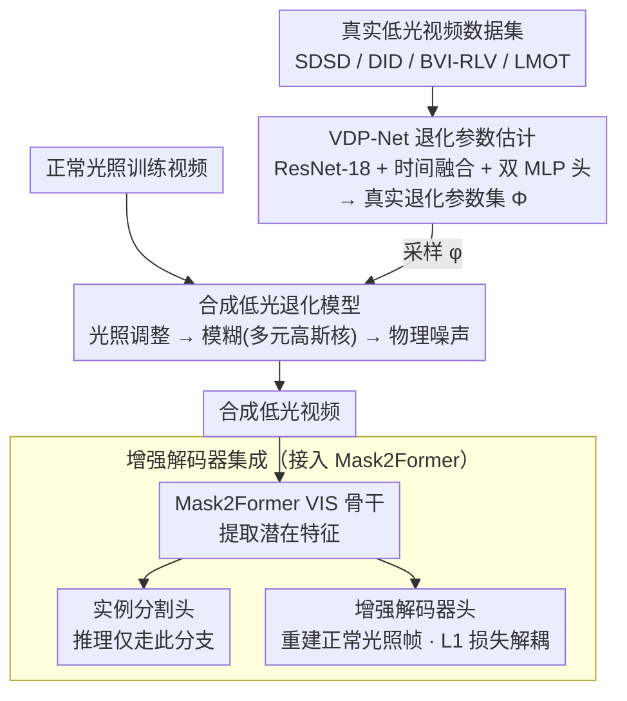

# ELVIS: Enhance Low-Light for Video Instance Segmentation in the Dark

**会议**: CVPR 2026  
**arXiv**: [2512.01495](https://arxiv.org/abs/2512.01495)  
**代码**: [joannelin168.github.io/research/ELVIS](https://joannelin168.github.io/research/ELVIS)  
**领域**: 语义分割  
**关键词**: 低光视频实例分割, 合成低光管线, 退化估计, 域适应, 增强解码器

## 一句话总结

ELVIS 提出了首个低光视频实例分割（VIS）框架，通过物理驱动的合成低光视频管线（含运动模糊建模）、无标定退化参数估计网络 VDP-Net、以及将增强解码器集成到 VIS 架构中实现退化与内容解耦，在合成和真实低光视频上分别实现 +3.7AP 和 +2.8AP 的提升。

## 研究背景与动机

低光条件下的视频实例分割是一个重要但研究不足的问题，在自动驾驶、野生动物保护、监控等领域有广泛需求。该领域面临多重挑战：

**缺乏标注数据**：低光条件下的退化使人工和自动标注都极其困难，没有专门用于低光 VIS 的公开基准

**合成管线不完善**：现有合成低光方法主要针对图像设计，忽略了低光视频中因长快门时间导致的运动模糊退化

**现有 VIS 方法不鲁棒**：SOTA VIS 方法未针对低光退化设计，即使在合成低光数据上微调后表现仍然较差

**两阶段方法的局限**：先增强后分割的流水线受限于低光视频增强本身的不成熟

**核心思路**：设计一个端到端的域适应框架，包含物理真实的合成低光视频管线和退化-内容解耦机制，使现有 VIS 模型适应低光场景。

## 方法详解

### 整体框架

ELVIS 是一个让现有 VIS（视频实例分割）模型适应低光场景的域适应框架，由两大组件前后串联。**离线阶段**，VDP-Net 从真实低光视频数据集（SDSD、DID、BVI-RLV、LMOT）中无监督估计退化参数，汇成一个真实退化参数集 $\Phi$。**训练阶段**，合成低光管线从 $\Phi$ 采样参数 $\phi$，按「光照调整 → 模糊 → 噪声」的物理退化模型把正常光照训练视频实时退化成低光视频；这些低光视频送入集成了增强解码器的 VIS 网络（以 Mask2Former 为骨干），分割头输出实例掩码、增强解码器头通过重建正常光照帧迫使骨干解耦退化与场景内容。推理时只保留分割分支，增强解码器不增加任何开销。

### 关键设计

1. **合成低光视频退化模型**：完整建模从正常光照到低光的物理过程

   最终退化公式：$X^{low} = Deg(X^{high}, \phi) = H * (2^\epsilon X^{high}) + N$

   包含三类退化：
    - **光照调整**：先转换到 XYZ 色彩空间确保线性，再按曝光值 $\epsilon$ 降低亮度：$X' = 2^\epsilon X$
    - **模糊退化**（本文首次引入低光视频合成）：用多元高斯分布建模运动模糊和散焦模糊的联合效应，仅需 3 个参数 $(\sigma_{Hx}, \sigma_{Hy}, \theta_H)$。当 $\sigma_{Hx} = \sigma_{Hy}$ 时仅有散焦模糊
    - **物理噪声**：四种类型——读取噪声（高斯）、散粒噪声（泊松）、量化噪声（均匀分布）、条带噪声（高斯，支持水平和垂直两个方向）

   退化参数向量：$\phi = \{\epsilon, \sigma_r, K, \lambda_q, \sigma_b, \theta_b, \sigma_{Hx}, \sigma_{Hy}, \theta_H\}$

2. **VDP-Net（视频退化分析网络）**：

    - 从真实低光视频中**无监督**估计退化参数 $\phi$，无需相机标定
    - 架构：轻量 ResNet-18 骨干 + 时间融合卷积块 + 两个 MLP 预测头
    - 两个预测头分开处理：一个用于曝光和噪声（全局退化），一个用于模糊（局部退化）
    - **无监督训练策略**：均匀采样退化参数合成低光输入，网络学习从退化视频反推参数
    - 损失函数：$\mathcal{L}_{total} = \lambda_1 \|\phi - \phi'\|_1 + \lambda_2 (1 - \cos(|\theta_H - \theta_H'|))$，其中余弦角度损失处理模糊角度的周期性

3. **增强解码器集成**：

    - 在 Mask2Former 的分割模块中集成增强解码器头
    - 解码器使用多尺度可变形注意力像素解码器（10 层 Transformer 解码层 + 双线性上采样），重建正常光照帧
    - 训练时增加 L1 损失（clean帧 vs 重建帧），引导网络在潜在特征空间中将场景内容与退化解耦
    - 推理时仅使用分割输出，解码器不增加推理开销

### 损失函数 / 训练策略

- VIS 训练时从预生成的真实退化参数集 $\Phi$（从 SDSD、DID、BVI-RLV、LMOT 四个数据集估计）中采样参数，对训练视频实时合成低光版本
- 增强解码器的额外 L1 损失 + 原始 VIS 分割损失联合训练
- VDP-Net 训练阶段使用均匀采样的退化参数（领域专家确定的合理上界范围内）

## 实验关键数据

### 主实验

**合成低光 YouTube-VIS 2019 验证集**

| 方法 | Backbone | ELVIS | AP | AP50 | AP75 |
|------|----------|-------|-----|------|------|
| MinVIS | ResNet-50 | ✗ | 36.4 | 57.3 | 36.4 |
| MinVIS | ResNet-50 | ✓ | 37.2 | 57.0 | 39.6 |
| GenVIS | ResNet-50 | ✗ | 39.1 | 58.4 | 42.7 |
| GenVIS | ResNet-50 | ✓ | **41.0** | **59.8** | **46.2** |
| DVIS++ | ResNet-50 | ✗ | 38.8 | 59.9 | 42.8 |
| DVIS++ | ResNet-50 | ✓ | **42.5** | **63.8** | **46.6** |
| DVIS++ | ViT-L | ✗ | 55.2 | 77.2 | 62.1 |
| DVIS++ | ViT-L | ✓ | **56.9** | **78.7** | **65.3** |

最大提升 **+3.7AP**（DVIS++ R50）。

**真实低光视频评估（LMOT-S）**

| 方法 | ELVIS | AP | AP50 | AR10 |
|------|-------|-----|------|------|
| GenVIS R50 | ✗ | 6.6 | 14.5 | 9.8 |
| GenVIS R50 | ✓ | 6.7 | 15.5 | 12.1 |
| DVIS++ ViT-L | ✗ | 10.0 | 21.4 | 13.1 |
| DVIS++ ViT-L | ✓ | **10.5** | **22.6** | **14.5** |

### 消融实验

**与两阶段基线对比（ELVIS-S 和 LMOT-S）**

| 方法 | ELVIS-S AP | LMOT-S AP |
|------|-----------|-----------|
| SDSD-Net（增强→分割） | 46.7 | 2.5 |
| StableLLVE（增强→分割） | 57.3 | 3.9 |
| DarkIR（增强→分割） | 55.9 | 3.8 |
| **ELVIS** | **58.0** | **6.7** |

在 LMOT-S 上比最好的两阶段方法提升 **+2.8AP**。

**合成管线对比**

| 合成管线 | ELVIS-S AP | LMOT-S AP |
|----------|-----------|-----------|
| Lv et al. | 53.5 | 5.1 |
| Cui et al. | 51.1 | 5.7 |
| Ours (random ϕ) | 39.9 | 4.7 |
| **Ours (VDP-Net ϕ)** | **54.5** | **6.6** |

VDP-Net 估计的参数比随机采样提升 +14.6AP / +1.9AP，证明真实退化分布匹配的重要性。

### 关键发现

- ELVIS 在所有 VIS 方法和骨干网络上都带来一致提升，证明框架的通用性
- 增强解码器通过退化-内容解耦显著提升 AP75（严格指标），说明精细分割质量改善最大
- 合成管线中加入模糊建模是关键——现有管线忽略了这一低光视频固有退化
- VDP-Net 的无监督训练策略有效，能从真实低光视频中提取真实退化分布

## 亮点与洞察

- **物理驱动的低光视频合成**：首次在合成管线中建模运动模糊（多元高斯核），弥补了现有方法只考虑噪声的不足。模糊方向约束到 $[0, \pi]$ 的设计考虑了运动模糊核的双向性
- **退化-内容解耦思想**：通过增强解码器的辅助重建任务，迫使 VIS 骨干学习退化无关的特征表示，这一思路比两阶段方法更优雅
- **无标定退化估计**：VDP-Net 不需要相机元数据（型号、ISO 等），可在任何数据集上使用。余弦角度损失处理周期性参数是一个精巧的设计
- **推理零开销**：增强解码器仅在训练时使用，推理时不增加任何计算成本

## 局限与展望

- 真实低光 VIS 评估数据有限（ELVIS-S 仅 250 帧，LMOT-S 用伪标签），需要更大规模的真实低光 VIS 基准
- 合成管线未建模 ISP 引入的空间相关伪影（压缩、去马赛克、相机内去噪等），这些在真实场景中可能显著
- VDP-Net 假设退化参数在整个视频clip内均匀，但真实低光视频中退化可能随空间和时间变化
- 目前仅在 Mask2Former-based 的 VIS 方法上验证，其他架构（如基于 tracking 的方法）的适用性未探索
- 在真实低光数据上的绝对 AP 仍然较低（<11%），低光 VIS 依然极具挑战性

## 相关工作与启发

- 合成低光管线的设计可推广到其他低光下游任务（检测、跟踪、深度估计等）
- 退化-内容解耦的思路可应用于其他退化条件（雾霾、雨天、水下等）的下游任务适应
- VDP-Net 的无监督退化估计可独立使用，为低光增强方法提供场景自适应的退化参数
- 与 RAW 域方法（需要原始传感器数据）互补，ELVIS 直接在 sRGB 域工作，更实用

## 评分

- **新颖性**: ⭐⭐⭐⭐ — 首个低光 VIS 框架，合成管线加入模糊建模新颖
- **实验充分度**: ⭐⭐⭐⭐ — 多 VIS 方法、多骨干、合成+真实评估，但真实数据规模有限
- **写作质量**: ⭐⭐⭐⭐ — 物理模型推导清晰，框架展示完整
- **价值**: ⭐⭐⭐⭐ — 填补了低光 VIS 的空白，提供了可复用的合成管线

<!-- RELATED:START -->

## 相关论文

- [\[CVPR 2025\] LiVOS: Light Video Object Segmentation with Gated Linear Matching](../../CVPR2025/segmentation/livos_light_video_object_segmentation_with_gated_linear_matching.md)
- [\[CVPR 2026\] MARIS: Marine Open-Vocabulary Instance Segmentation](maris_marine_open-vocabulary_instance_segmentation.md)
- [\[CVPR 2026\] DIMOS: Disentangling Instance-level Moving Object Segmentation](dimos_disentangling_instance-level_moving_object_segmentation.md)
- [\[CVPR 2026\] BiPA: Bilevel Prompt Adaptation for Underwater Instance Segmentation](bipa_bilevel_prompt_adaptation_for_underwater_instance_segmentation.md)
- [\[CVPR 2026\] Live Interactive Training for Video Segmentation](live_interactive_training_for_video_segmentation.md)

<!-- RELATED:END -->
