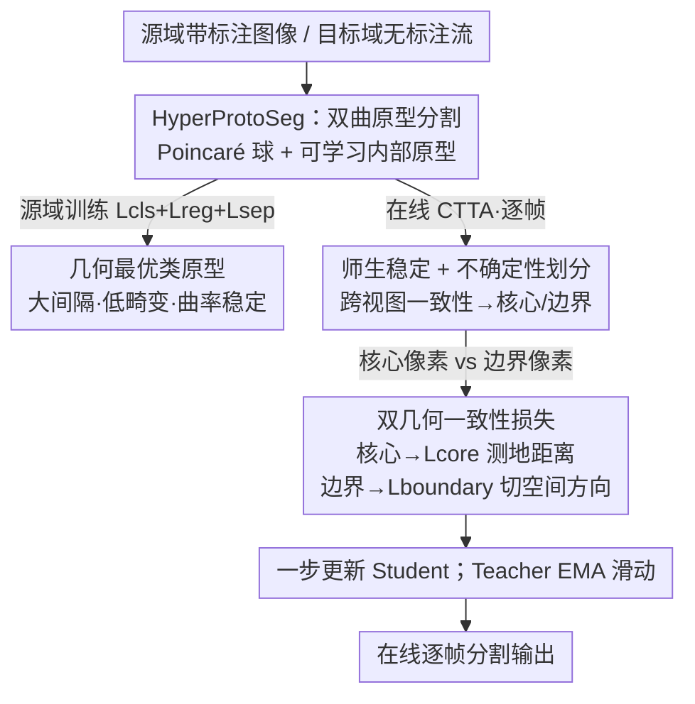

# Hyperbolic Prototype Learning with Uncertainty-Aware Consistency for Continual Test-Time Segmentation

**会议**: CVPR 2026  
**论文**: [CVF Open Access](https://openaccess.thecvf.com/content/CVPR2026/html/Gole_Hyperbolic_Prototype_Learning_with_Uncertainty-Aware_Consistency_for_Continual_Test-Time_Segmentation_CVPR_2026_paper.html)  
**代码**: 待确认  
**领域**: 语义分割 / 持续测试时自适应  
**关键词**: 双曲几何, 原型学习, 持续测试时自适应, 不确定性, 语义分割

## 一句话总结
针对持续测试时分割（CTTA）里自训练伪标签误差越滚越大的问题，本文把分割重构成 Poincaré 球（双曲空间）里的度量学习——用 HyperProtoSeg 学出大间隔、低畸变的类原型，再用 HBCA 按跨视图一致性把像素分成"可信核心"和"不确定边界"两类，分别施加测地距离损失和切空间方向一致性损失，从而在长序列域漂移下既快速适应又不崩，在三个合成到真实基准上平均超过 SOTA。

## 研究背景与动机

**领域现状**：持续测试时自适应（CTTA）让一个在带标注源域（如晴天加州）上训好的分割模型，在部署时面对不断变化的目标域（晴→雨→雪→夜）时，用模型自己的预测当伪标签在线增量更新参数，省去重训成本。主流 CTTA（TENT、CoTTA 等）都靠这种自训练。

**现有痛点**：自训练有个根本缺陷——**误差累积**。域漂移严重时，初期伪标签本身就噪声大，模型适应这些错标签会把错误往后传播，形成灾难性反馈回路，时间一长适应后的模型反而比没适应的源模型还差。论文 Table 1 直接量化了这点：欧氏 ProtoSeg 从第 1 轮到第 10 轮 mIoU 掉了 1.46%，而本文双曲版本只掉 0.62%。

**核心矛盾**：作者把这种脆弱性归因于两个深层问题。其一是**几何局限**——欧氏特征空间体积是多项式增长（$V \propto r^n$），语义相关的类被挤在一起、类间间隔又小又脆，这些窄间隔区域成了"不稳定热点"，一点点分布偏移就翻车。其二是缺一个显式机制去平衡**可塑性**（快速适应新分布）与**稳定性**（保住已学结构、防漂移），即经典的 stability–plasticity 困境；现有方法只会用随机权重恢复、EMA 回滚这类"事后补救"，治标不治本。

**本文目标**：同时填上"几何鸿沟"和"监督鸿沟"——既要一个不畸变、大间隔的表示空间，又要一套能区别对待可信区与不确定区的在线适应监督。

**切入角度**：双曲空间（常负曲率）体积是**指数增长**（$\mathrm{Vol}(r) \sim e^{(d-1)r}$），天然能在类嵌入之间撑出又大又均匀的测地间隔，同时保持紧凑低畸变的表示。把分割搬到 Poincaré 球里，就能从根上缓解几何脆弱性。

**核心 idea**：用双曲原型度量学习（HyperProtoSeg）提供曲率稳定的大间隔锚点，再用不确定性感知的双几何损失（HBCA）对可信像素做强适应、对不确定像素做保守的方向对齐，主动（而非事后）化解 stability–plasticity 困境。

## 方法详解

### 整体框架
方法分两个阶段、两个互补组件。**源域训练阶段**用 HyperProtoSeg：SegFormer-B5 骨干提特征，经双曲头把每个像素的欧氏特征用指数映射投到 128 维 Poincaré 球，每个类配一个**可学习的内部原型**，像素按"最近原型"（测地距离）分类，靠 $L_{cls}+L_{reg}+L_{sep}$ 学出大间隔、稳定的曲率一致嵌入。**在线适应阶段**用 HBCA（Hyperbolic Boundary Consistency Adaptation）：维护一个 Teacher（Student 的 EMA），对每帧目标图生成干净视图和强增广噪声视图，按 Teacher 高置信 + 跨视图一致把像素分成"核心"（可信）与"边界"（不确定）两组，分别施加**测地距离损失** $L_{core}$ 和**切空间方向一致性损失** $L_{boundary}$，每帧一步梯度更新 Student、Teacher 随之 EMA 滑动。

### 关键设计

**1. HyperProtoSeg：把分割重构成 Poincaré 球里的度量学习，用负曲率换大间隔**

针对"欧氏空间间隔小而脆"的几何痛点，本文不再用参数化的分类边界，而是把语义分割当成度量学习：在 Poincaré 球 $\mathbb{B}^d_c=\{z\in\mathbb{R}^d: c\|z\|^2<1\}$ 上给每个类学一个**内部原型** $\hat{z}_l$。骨干输出的欧氏特征 $\hat{x}$ 先经指数映射投到流形 $z=\mathrm{Exp}^c_0(\hat{x})=\tanh(\sqrt{c}\|x\|)\frac{x}{\sqrt{c}\|x\|}$（取 $c=1$），像素按最近原型的测地距离分类 $\hat{y}=\arg\min_l d_{\mathbb{B}}(z,\hat{z}_l)$，在流形上形成"测地 Voronoi 区"。选 Poincaré 球（而非 Klein/Lorentz）是因为它**保角**，角度在指数映射下不变，这恰好让后面的方向一致性损失能用余弦相似度。和此前把原型固定在理想边界上的做法（Busemann loss）不同，本文学**内部原型**，因为 CTTA 里语义会漂移，内部锚点才能跟着捕捉漂移。训练目标是三项之和

$$L_{base}=L_{cls}+L_{reg}+\lambda_{sep}L_{sep},$$

其中 $L_{cls}$ 是基于测地距离平方的 softmax 交叉熵，拉近类内、推远类间；$L_{reg}=\beta\cdot\frac{1}{HW}\sum\|\hat{x}\|^2_2$ 约束投影前的欧氏范数，防止嵌入贴到流形边界处（那里 $\tanh$ 饱和、梯度消失）导致数值不稳；$L_{sep}=\frac{1}{N^2}\sum\max(0,m-d_{\mathbb{B}}(\hat{z}_i,\hat{z}_j))$ 给每对原型强加最小测地间隔 $m$，撑开类间边界、避免语义纠缠。这套组合让指数曲率自然撑出又大又匀的间隔，理论上还给出更紧的 Rademacher 复杂度界（负曲率压缩半径 $R_\mathbb{B}=O(1)$、增大间隔 $m$，优于欧氏的 $R_E=\Theta(\sqrt{d})$）。

**2. 师生稳定 + 不确定性感知划分：用跨视图一致性把像素切成"该强学"和"该保守"两半**

针对"对所有伪标签一视同仁地学，噪声会被放大"的监督痛点，HBCA 先把像素分级。它维护一个 Teacher $f'_\theta$（Student 的 EMA，$\alpha=0.999$），把每帧目标图当干净视图 $x_c$，再用强增广（随机翻转、颜色抖动、高斯模糊）造一个噪声视图 $x_n=\mathcal{A}(x_c)$。可信度由"Teacher 高置信"且"两视图预测一致"共同判定

$$\text{Mask}_{cert}=\{\tilde{x}\mid \max(\mathrm{softmax}(f'_\theta(x_c)))>\tau \wedge f'_\theta(x_c)=f'_\theta(x_n)\},$$

不满足的归为 $\text{Mask}_{uncert}$（$\tau=0.90$）。这里和 DAT 等用 Teacher 不确定性去调权的做法不同：本文用它做**像素级、更细粒度**的可信/不确定划分，而非只调整更新幅度。直觉上（Figure 1）核心像素吃强可塑更新、边界像素吃保守稳定更新，两类用不同几何损失，从而在更新中保住模型的几何完整性。Teacher 的 EMA 还顺带把参数漂移控制在小范围，保证长序列下不崩。消融（Table 6）显示这套一致性驱动的不确定性比 MC-Dropout、Hyperbolic Norm 都更鲁棒，后两者在域漂移下要么过度自信、要么信号弥散。

**3. 双几何一致性损失：可信区做测地距离对齐，不确定区只对齐"方向"而丢掉噪声位置**

针对划分出的两组像素，本文设计两个互补几何损失来平衡可塑性与稳定性。对**核心像素**用测地距离匹配 $L_{core}=\mathrm{mean}_{\tilde{x}\in\text{Mask}_{cert}} d^2_{\mathbb{B}}(f'_\theta(\tilde{x}),f_\theta(\tilde{x}))$，相当于把 Student 的目标域特征蒸馏对齐到 Teacher 可靠嵌入上，在 Teacher 慢变原型锚定的稳定框架内实现快速适应。对**边界像素**，严格的距离匹配会把噪声传进去、毁掉原型，所以改成**切空间方向对齐**：

$$L_{boundary}=\mathrm{mean}_{\bar{x}\in\text{Mask}_{uncert}}\left(1-\frac{v'_{f_\theta(\bar{x})}\cdot v'_{f'_\theta(\bar{x})}}{\|v'_{f_\theta(\bar{x})}\|\|v'_{f'_\theta(\bar{x})}\|}\right),$$

其中 $v'=\log_{\hat{z}}(\cdot)$ 是相对"Teacher 预测的最近原型 $\hat{z}_{f'_\theta(\bar{x})}$"的对数映射向量，即从同一个稳定原型出发看 Student 和 Teacher 的方向。它**只用方向、丢掉带噪声的具体位置**，避免不确定像素去直接匹配噪声目标，从而阻止原型被腐蚀、缓解灾难性漂移。总适应损失 $L_{adapt}=\lambda_{core}L_{core}+\lambda_{boundary}L_{boundary}$（$\lambda_{core}=1.0$，$\lambda_{boundary}=0.5$），每帧 Student 走一步 $\theta\leftarrow\theta-\eta\nabla_\theta L_{adapt}$，Teacher 同步 EMA。消融（Table 7）证明对不确定像素用方向对齐（57.12）明显好过不适应（56.24）和强行用 $L_{core}$ 距离最小化（56.01，反而掉点，印证强对齐会放大 Teacher 噪声）。

### 损失函数 / 训练策略
源域：SegFormer-B5（HuggingFace 初始化）+ 双曲头，1024×1024 输入、有效 batch 32（16 步累积）、200 epoch；双优化器——欧氏参数用 AdamW（lr=1e-5），双曲原型用 RiemannianAdam（lr=1e-3），双曲算子由 geoopt 实现。超参 $\beta=0.1$、$\lambda_{sep}=1$、$m=1$。适应：Mean-Teacher（EMA $\alpha=0.999$），$\tau=0.90$，每帧单步 RiemannianAdam（lr=1e-5）+ 混合精度。

## 实验关键数据

### 主实验

源域训练（HyperProtoSeg vs 欧氏/双曲基线，mIoU%，Table 2）：原型框架和双曲几何各自都有增益，二者结合最好，且只比欧氏基线多约 3% GFLOPs，说明增益来自更有效的几何表示而非堆算力。

| 架构 | 双曲 | IDD | Cityscapes | GFLOPS |
|------|------|-----|-----------|--------|
| Euclidean SegFormer | ✗ | 73.57 | 76.74 | 799.74 |
| Euclidean ProtoSeg | ✗ | 73.87 | 78.07 | 810.71 |
| Hyperbolic MLR | ✓ | 73.91 | 78.14 | 818.52 |
| **HyperProtoSeg（本文）** | ✓ | **74.34** | **79.96** | 823.60 |

CTTA 对比（IDD→IDD-AW，10 轮序列域漂移的 10 轮平均 mIoU%，Table 3）：TENT 几乎不动、CoTTA/DePT/SVDP 受限于欧氏更新只有有限改善，TCA/Hybrid-TTA 较强但在物体边界处仍弱；HBCA 达 57.12，超源模型 +11.3%、超第二名 Hybrid-TTA 约 2.2。

| 方法 | 会议 | 平均 mIoU | 较源模型增益 |
|------|------|----------|-----|
| Source | - | 51.31 | - |
| TENT | ICLR'21 | 51.45 | +0.2% |
| CoTTA | CVPR'22 | 52.59 | +2.4% |
| DePT | ICLR'23 | 53.33 | +3.9% |
| SVDP | AAAI'24 | 53.51 | +4.2% |
| DAT | ICRA'24 | 54.32 | +5.8% |
| Continual-MAE | CVPR'24 | 54.31 | +5.8% |
| TCA | CVPR'25 | 54.76 | +6.7% |
| Hybrid-TTA | ICCV'25 | 54.91 | +7.0% |
| **HBCA（本文）** | - | **57.12** | **+11.3%** |

Cityscapes→ACDC（各域平均 mIoU%，Table 4）本文在第 1/5/10 轮分别 57.67/57.55/57.30、均值 57.47，稳居最佳，且随轮次衰减极小（对比源模型恒为 54.63）。SHIFT 基准均值 mIoU 69.36（详见补充材料）。三基准上对 SOTA 的初始（第 1 轮）提升分别约 (1.94%, 4.02%, 1.24%)。

| 方法 | 轮1 | 轮5 | 轮10 | 平均 |
|------|-----|-----|------|------|
| Source | 54.63 | 54.63 | 54.63 | 54.63 |
| TCA | 56.35 | 56.45 | 56.37 | 56.38 |
| Hybrid-TTA | 56.18 | 55.98 | 55.72 | 55.95 |
| **本文** | **57.67** | **57.55** | **57.30** | **57.47** |

### 消融实验

几何正则项（源域训练，mIoU%，Table 5）：

| 配置 | IDD | Cityscapes | 说明 |
|------|-----|-----------|------|
| 仅 $L_{cls}$ | 70.17 | 76.81 | 边界塌缩、嵌入贴边界梯度消失 |
| +$L_{reg}$ | 72.29 | 77.61 | 拉回内部稳住训练，但过紧 |
| +$L_{reg}$+$L_{sep}$ | **74.34** | **79.96** | 排斥力撑开类间间隔，最佳 |

不确定性模块对比（10 轮平均 mIoU%，Table 6）与不确定像素适应策略（Table 7）：

| 维度 | 配置 | IDD→IDD-AW | Cityscapes→ACDC |
|------|------|-----------|-----------------|
| 不确定性估计 | MC-Dropout | 52.78 | 53.62 |
| | Hyperbolic Norm | 53.27 | 54.76 |
| | HBCA（本文） | **57.12** | **57.47** |
| 不确定像素适应 | 不适应 | 56.24 | 56.34 |
| | 距离最小化 $L_{core}$ | 56.01 | 55.82 |
| | 方向对齐 $L_{boundary}$ | **57.12** | **57.47** |

### 关键发现
- **几何选择直接决定稳定性**：Table 1 里双曲版 10 轮只衰减 0.62%、欧氏版衰减 1.46%——误差累积的根在几何，而非具体的适应技巧。
- **$L_{reg}$ 和 $L_{sep}$ 必须配合**：只有 $L_{cls}$ 会"边界塌缩"（嵌入饱和到 Poincaré 边界、梯度消失），$L_{reg}$ 管稳定、$L_{sep}$ 管判别性，缺一不可（IDD 70.17→72.29→74.34）。
- **不确定像素不能强对齐**：对边界像素强行用 $L_{core}$ 距离最小化反而掉点（56.24→56.01），证明严格匹配会放大 Teacher 噪声；只对齐方向（$L_{boundary}$）才稳。
- **几乎零额外算力**：双曲改造只多约 3% GFLOPs，增益来自几何表示本身。

## 亮点与洞察
- **把"误差累积"归因到几何并给出可量化证据**：Table 1 用同一原型框架只换几何（欧氏 vs 双曲）做对照，把脆弱性的根因落到"欧氏窄间隔"上，论证干净。
- **保角性被真正用上了**：选 Poincaré 球不是随手选，是因为它保角→指数映射下角度不变→切空间方向损失可以直接用余弦相似度，几何性质和损失设计是咬合的。
- **"核心强学、边界对齐方向"是个可迁移的范式**：把"按可信度分像素 + 对可信区做强监督/对不可信区只取鲁棒方向信号"这套思路，可以迁移到任何伪标签驱动的自训练（域适应、半监督分割）里去抑制噪声放大。
- **学内部原型而非边界原型**：为 CTTA 的语义漂移留出移动空间，是相对此前 Busemann-loss 类工作的关键改动。

## 局限与展望
- 曲率 $c$ 固定为 1，作者把"自适应曲率学习"列为未来工作——不同域/不同类层级可能需要不同曲率。
- 仅在城市场景语义分割 + 合成到真实的天气漂移上验证，是否能推广到其他稠密预测任务（深度、全景分割）尚待验证（作者也把这列为展望）。
- 闭集假设：目标域类别是源域子集，遇到开集/新类时框架未涉及。
- 强增广造噪声视图 + 师生双前向 + 双曲算子，单帧适应的实际时延/显存开销论文未单独给出，部署到实时自动驾驶的可行性需进一步评估。

## 相关工作与启发
- **vs 欧氏 CTTA（TENT / CoTTA / DePT / SVDP）**：它们都在欧氏空间做自训练更新，间隔窄、易畸变，伪标签噪声沿序列放大；本文换到双曲空间从几何上拓宽间隔，10 轮衰减显著更小。
- **vs DAT（不确定性引导更新）**：DAT 用 Teacher 不确定性去调更新幅度，本文用它做**像素级核心/边界划分**并对两类施加不同几何损失，监督更细。
- **vs TCA（拓扑一致性自适应）**：TCA 保拓扑但仍在欧氏空间、边界处弱；本文显式区别对待边界像素（方向对齐），在边界细节上更鲁棒（定性结果里雾天细杆、夜间路灯）。
- **vs 静态双曲分割（Atigh 等的 gyroplane / Busemann）**：它们用双曲编码层级但原型固定、不在线适应；本文把双曲表示和不确定性感知 CTTA 桥接起来，原型可学且支持持续适应。

## 评分
- 新颖性: ⭐⭐⭐⭐⭐ 首个把双曲原型度量学习与不确定性感知 CTTA 结合的工作，几何选择与损失设计咬合紧密。
- 实验充分度: ⭐⭐⭐⭐ 三基准 + 多轮序列 + 几何/不确定性/损失多组消融，较扎实；部分主结果（Cityscapes→ACDC、SHIFT）放在补充材料、单帧时延未单列。
- 写作质量: ⭐⭐⭐⭐ 动机清晰、图表对照到位，含理论复杂度分析；少数表格引用（Table ??）有排版瑕疵。
- 价值: ⭐⭐⭐⭐ 对自动驾驶等持续域漂移场景的鲁棒分割有实用价值，"按可信度分像素+方向对齐抑噪"范式可迁移。

<!-- RELATED:START -->

## 相关论文

- [\[CVPR 2026\] The Golden Subspace: Where Efficiency Meets Generalization in Continual Test-Time Adaptation](the_golden_subspace_where_efficiency_meets_generalization_in_continual_test-time.md)
- [\[CVPR 2026\] Mixture of Prototypes for Test-time Adaptive Segmentation](mixture_of_prototypes_for_test-time_adaptive_segmentation.md)
- [\[CVPR 2026\] Bootstrap Your Own AV-Proxies: Adaptive Contrastive and Prototype Learning for Audio-Visual Segmentation](bootstrap_your_own_av-proxies_adaptive_contrastive_and_prototype_learning_for_au.md)
- [\[CVPR 2026\] Test-Time Multi-Prompt Adaptation for Open-Vocabulary Remote Sensing Image Segmentation](test-time_multi-prompt_adaptation_for_open-vocabulary_remote_sensing_image_segme.md)
- [\[CVPR 2026\] Uncertainty-Aware Modality Fusion for Unaligned RGB-T Salient Object Detection](uncertainty-aware_modality_fusion_for_unaligned_rgb-t_salient_object_detection.md)

<!-- RELATED:END -->
