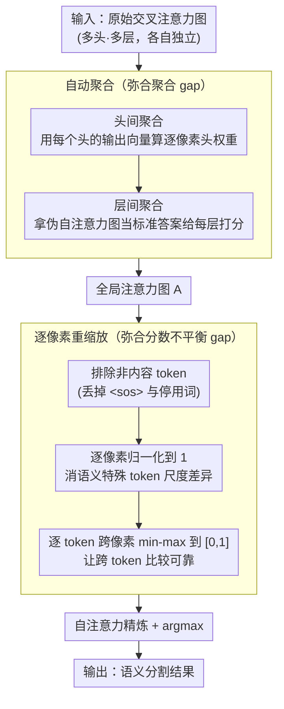

# Making Training-Free Diffusion Segmentors Scale with the Generative Power

**会议**: CVPR 2026  
**arXiv**: [2603.06178](https://arxiv.org/abs/2603.06178)  
**代码**: [有](https://github.com/MengBenyuan/GoCA)  
**领域**: 语义分割  
**关键词**: 扩散模型、无训练分割、交叉注意力、自动聚合、逐像素重缩放、生成能力扩展

## 一句话总结

揭示现有无训练扩散分割方法无法随生成模型能力增强而提升的根本原因——交叉注意力图到语义相关性之间存在两个gap（聚合gap和分数不平衡gap），提出自动聚合（auto aggregation）和逐像素重缩放（per-pixel rescaling）两项技术组成GoCA框架，首次使更强的扩散模型（SDXL、PixArt-Sigma、Flux）在无训练语义分割中显著超越旧模型。

## 研究背景与动机

**领域现状**：文本到图像扩散模型（Stable Diffusion、Flux等）凭借强大的图像生成能力，被探索用于判别任务。一支研究方向关注"无训练扩散分割"——直接利用预训练扩散模型的交叉注意力图进行语义分割，无需额外训练。

**核心前提与期望**：无训练扩散分割方法基于扩散模型的生成能力，理论上更强的生成模型应产生更好的分割结果——即分割性能应随生成能力"scaling"。

**反直觉现象**：作者发现现有方法（DiffSegmentor、FTTM等）几乎都基于Stable Diffusion v1.5/v2.1验证，当切换到更强的SDXL、PixArt-Sigma、Flux时，分割性能反而没有提升甚至下降。这与"更强生成↔更好分割"的直觉严重矛盾。

**Gap I——聚合gap**：扩散模型包含多头多层的交叉注意力，每个头/层产生独立的注意力图。先前方法通过手动设定权重来聚合，但更复杂的新架构（UNet→DiT→MMDiT）使手动调参变得不可行。

**Gap II——分数不平衡gap**：即使有了全局注意力图，分数也不直接等于语义相关性。存在两种不平衡：(a) 前景token（如"cat"）分数远高于背景token（如"grass"），直接比较不可靠；(b) 语义特殊token（如"<sos>"）分数尺度不一致，干扰逐token归一化。

**核心idea**：设计自动化的聚合权重方案（基于模型激活间的相关性）替代手动调参，并通过逐像素重缩放消除语义特殊token干扰，弥合两个gap，使无训练分割能力真正随生成能力scaling。

## 方法详解

### 整体框架

GoCA（Generative scaling of Cross-Attention）要解决的是一个反直觉的失效：无训练扩散分割本应"生成越强、分割越好"，但换上 SDXL、PixArt-Sigma、Flux 后性能不升反降。整篇方法围绕把"原始交叉注意力图"翻译成"可靠的语义相关性图"展开——先用**自动聚合**把多头多层各自独立的注意力图合成一张全局图（弥合聚合 gap），再用**逐像素重缩放**抹掉语义特殊 token 造成的分数不平衡（弥合分数不平衡 gap），最后接标准的自注意力精炼和 argmax 得到分割结果。整条链路不引入任何可学习参数，保持无训练范式的纯粹性。

### 关键设计

**1. 头间聚合（Head-wise Aggregation）：用每个头自己的输出衡量它该占多大权重**

多头注意力以前靠人手设权重把各头加起来，但新架构（UNet→DiT→MMDiT）头数层数暴涨后手动调参彻底失灵。GoCA 的做法是把多头输出重写成向量求和形式 $Output = \sum_n A_n V_n W_n^O$，于是每个头的贡献天然可以用"该头的输出向量"和"总输出"的对齐程度来量化：对层 $m$ 中的头 $n$，权重 $w_{mn} = (A_n V_n W_n^O)_m^\top \cdot Output_m$，归一化后得到逐像素的头权重 $w_{mn}'$。关键在于这个权重是**逐像素**的而非全图一个标量——同一个头在图像不同位置的贡献并不一样，逐像素加权能把每个头在它擅长的空间区域里的注意力挑出来，比单一全图权重更精细。

**2. 层间聚合（Layer-wise Aggregation）：拿稠密扩散特征当"标准答案"给每层打分**

层与层之间也要定权重，但交叉注意力层本身没有现成的可靠参照。GoCA 借了一个代理：用稠密扩散特征算出一张伪自注意力图 $A_p$ 当作全局注意力的"标准答案"，再看每层实际的自注意力图 $A_{self}^m$ 与它有多像，相似度高的层就更可信。形式上 $w_m = (A_p')^\top (A_{self}^m)'$，归一化后加权聚合各层得到全局注意力图 $A = \sum_m w_m' A_m$。这一步压着一个假设：交叉注意力层的贡献模式与自注意力层相近，所以能用后者的相似度去代理前者的贡献——⚠️ 这个代理假设的具体论证以原文为准。

**3. 逐像素重缩放（Per-Pixel Rescaling）：把语义特殊 token 的干扰从分数里减掉**

就算合成了全局图，分数也不等于语义相关性，问题出在两种不平衡：前景 token（"cat"）的分数量级远高于背景 token（"grass"），直接比较不可靠；语义特殊 token（如 `<sos>`）分数占主导、且在不同像素处尺度不一，把逐 token 归一化也带歪了。GoCA 分三步把它掰正：先**排除非内容 token**，只保留"cat""grass"这类内容词，丢掉语义特殊 token 和停用词 token；再对每个像素 $i$ 把内容词分数**归一化到 1**，$A'(i,q) = \frac{A(i,q)}{\sum_j A(i,q(j))}$，消掉语义特殊 token 的尺度差异；最后对每个 token 在全部像素上做 **min-max 归一化到 [0,1]**，让跨 token 的比较重新可靠。背景类之所以受益最大，是因为背景区域里语义特殊 token 的分数本来就更高（前景已被内容 token 主导），把这层对抗性干扰抹掉后，"grass""wall"等背景类的注意力图质量提升尤其明显。

## 实验关键数据

### 主实验

**五个标准语义分割基准的mIoU对比**：

| 方法 | 模型 | VOC | Context | COCO-Obj | Cityscapes | ADE20K |
|------|------|-----|---------|----------|------------|--------|
| DiffSegmentor | SD v1.5 | 60.1 | 27.5 | 37.9 | - | - |
| FTTM | SD v1.5 | 48.9 | 30.0 | 34.6 | 12.3 | 20.3 |
| Vanilla | SD v1.5 | 44.3 | 32.3 | 32.3 | 11.8 | 18.0 |
| Vanilla | Flux | 55.7 | 48.4 | 43.3 | 25.6 | 24.5 |
| **GoCA** | SD v1.5 | **60.7** | **40.4** | **39.2** | 16.1 | **22.0** |
| **GoCA** | SD XL | 65.6 | 42.3 | 44.3 | 21.2 | 23.2 |
| **GoCA** | PixArt-Σ | 63.6 | 43.2 | 39.8 | 22.6 | 23.8 |
| **GoCA** | **Flux** | **70.7** | **51.1** | **48.1** | **27.1** | **29.3** |

GoCA+Flux在Pascal VOC上达70.7%mIoU，比Vanilla SD v1.5高26.4个点，比最强SOTA DiffSegmentor高10.6个点。

### 消融实验

**Pascal VOC 2012上各组件贡献**（mIoU）：

| 头聚合 | 层聚合 | 重缩放 | SD v1.5 | SD XL |
|--------|--------|--------|---------|-------|
| Vanilla | Vanilla | Vanilla | 44.3 | 51.1 |
| Vanilla | Manual | Vanilla | 51.1 | - |
| Ours | Vanilla | Vanilla | 44.8 | 56.1 |
| Vanilla | Ours | Vanilla | 52.1 | 51.3 |
| Vanilla | Vanilla | Ours | 52.6 | 51.4 |
| **Ours** | **Ours** | **Ours** | **60.7** | **65.6** |

三个组件各自贡献约5-8个点，组合后产生更大提升（SD v1.5: +16.4, SD XL: +14.5）。

### 生成集成实验

**S-CFG集成（COCO-30k, CFG=5.0）**：

| 方法 | FID↓ | CLIP↑ |
|------|------|-------|
| CFG | 19.27 | 31.34 |
| S-CFG | 19.15 | 31.35 |
| **GoCA+S-CFG** | **18.82** | **31.42** |

GoCA替换S-CFG内部的分割器后一致提升生成质量，验证了无训练分割在生成技术集成中的实际价值。

### 关键发现

1. **首次实现生成能力→分割能力的正向scaling**：手动调参的Baseline用SD v1.5有时优于Vanilla用SD XL/PixArt-Sigma，GoCA消除了这一反直觉现象。
2. **背景区域改善尤其显著**：逐像素重缩放通过消除语义特殊token的对抗性影响，使"grass"、"wall"等背景类注意力图质量大幅提升。
3. **架构泛化性强**：GoCA在UNet-based（SD v1.5/XL）、DiT-based（PixArt-Sigma）、MMDiT-based（Flux）三种架构上均有效，而手动调参方法无法泛化。
4. **自动层聚合与手动调参效果相当**：Ours层聚合（52.1）与Manual层聚合（51.1）相当甚至更优，且无需人工介入。
5. **生成集成价值明确**：作为S-CFG的内部组件，GoCA带来一致的FID/CLIP改善。

## 亮点与洞察

- **问题定义新颖且重要**：首次系统性地提出并验证"无训练扩散分割无法随生成能力scaling"这一问题，为该领域指出了明确的改进方向。
- **两个gap的分析精准**：将问题分解为聚合gap和分数不平衡gap，每个gap都有清晰的形式化定义和针对性解决方案。
- **完全无训练**：方法不引入任何可学习参数，仅利用模型激活的内在结构信息，保持了无训练范式的纯粹性。
- **对语义特殊token的洞察有启发性**：发现<sos>在背景区域分数更高（因前景已由内容token主导），这一观察对理解扩散模型内部机制有理论价值。
- **实用性强**：GoCA可直接集成到S-CFG等生成技术中，改善文生图质量。

## 局限与展望

1. **仅限语义分割**：方法依赖交叉注意力图的语义相关性假设，尚未扩展到实例分割、全景分割、深度估计等其他判别任务。
2. **依赖外部目标检测器**：需要GPT-4o构造包含所有类别的prompt，这引入了对外部模块的依赖。
3. **prompt设计影响大**：不同prompt策略对结果有显著影响，跨方法的公平对比受prompt设计差异干扰。
4. **可探索方向**：将GoCA推广到实例分割和深度估计；探索无需外部检测器的自动prompt生成；研究在视频扩散模型上的时序扩展。

## 相关工作与启发

- **vs DiffSegmentor / FTTM**：这些方法在SD v1.5上手动调权聚合注意力图，无法泛化到SD XL/Flux等新架构。GoCA通过自动聚合彻底解决了架构依赖问题，且在SD v1.5上也超越了DiffSegmentor（60.7 vs 60.1）。
- **vs DiffCut**：DiffCut使用稠密扩散特征做Normalized Cut分割，GoCA同样利用稠密特征但用于计算层间聚合权重的代理自注意力图——两者对稠密特征的使用方式互补。
- **vs 有训练的扩散判别器**（ODISE、VPD等）：有训练方法通过微调适配分割任务，性能更高但需额外训练数据和计算。GoCA证明无训练方法在正确scaling后可大幅缩小差距。

## 评分

- 新颖性: ⭐⭐⭐⭐ 首次提出并系统解决"无训练扩散分割的scaling失效"问题
- 实验充分度: ⭐⭐⭐⭐ 四个扩散模型五个基准+消融+生成集成+定性分析
- 写作质量: ⭐⭐⭐⭐ 问题动机清晰，两个gap的分析递进有序，图示直观
- 价值: ⭐⭐⭐⭐ 为无训练扩散分割领域打开了scaling大门，实用性与理论价值兼具

<!-- RELATED:START -->

## 相关论文

- [\[CVPR 2026\] The Power of Prior: Training-Free Open-Vocabulary Semantic Segmentation with LLaVA](the_power_of_prior_training-free_open-vocabulary_semantic_segmentation_with_llav.md)
- [\[CVPR 2026\] INSID3: Training-Free In-Context Segmentation with DINOv3](insid3_training-free_in-context_segmentation_with_dinov3.md)
- [\[CVPR 2026\] From 2D Alignment to 3D Plausibility: Unifying Heterogeneous 2D Priors and Penetration-Free Diffusion for Occlusion-Robust Two-Hand Reconstruction](from_2d_alignment_to_3d_plausibility_unifying_heterogeneous_2d_priors_and_penetr.md)
- [\[CVPR 2026\] PEARL: Geometry Aligns Semantics for Training-Free Open-Vocabulary Semantic Segmentation](pearl_geometry_aligns_semantics_for_training-free_open-vocabulary_semantic_segme.md)
- [\[CVPR 2026\] Direct Segmentation without Logits Optimization for Training-Free Open-Vocabulary Semantic Segmentation](direct_segmentation_without_logits_optimization_for_training-free_open-vocabular.md)

<!-- RELATED:END -->
