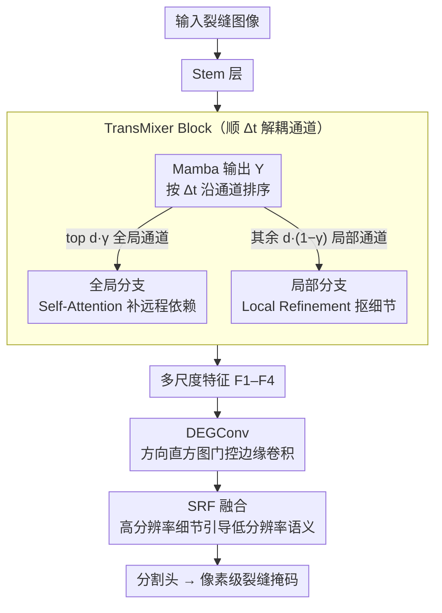

# MixerCSeg: An Efficient Mixer Architecture for Crack Segmentation via Decoupled Mamba Attention

**会议**: CVPR 2026  
**arXiv**: [2603.01361](https://arxiv.org/abs/2603.01361)  
**代码**: [GitHub](https://github.com/spiderforest/MixerCSeg)  
**领域**: 分割 / 裂缝分割  
**关键词**: 裂缝分割, 混合架构, Mamba注意力解耦, 方向引导边缘卷积, 轻量高效

## 一句话总结

提出 MixerCSeg，通过解析 Mamba 的隐式注意力机制将通道解耦为全局/局部分支，分别用 Self-Attention 和 CNN 增强，配合方向引导边缘门控卷积，以 2.05 GFLOPs / 2.54M 参数实现裂缝分割 SOTA。

## 研究背景与动机

裂缝分割是基础设施健康监测的关键技术，但面临裂缝形态多样、纹理分布不均、与背景对比度低等挑战。现有三类架构各有短板：

- **CNN**：局部特征提取强但全局建模不足，难以处理复杂形态
- **Transformer**：全局依赖建模强但计算开销大
- **Mamba**：线性复杂度的全局关注，但逐步处理机制限制了单次前向中的全局上下文利用

现有混合模型（MambaVision, RestorMixer）简单堆叠不同架构而未深入分析其内在交互逻辑。本文的核心洞察：**Mamba 的隐式注意力在通道维度上自然分化为全局通道和局部通道**（通过分析 $\Delta_t$ 发现），可据此有针对性地分配 CNN、Transformer、Mamba 各司其职。

## 方法详解

### 整体框架

MixerCSeg 要解决的是裂缝分割里"形态多样、对比度低、还得轻量部署"这组矛盾。整体是一个编码器-解码器结构：输入先过 Stem 层，再由若干 TransMixer Block 逐级提取多尺度特征 $\{F_1, F_2, F_3, F_4\}$；这些特征经 DEGConv 注入方向与边缘先验后，由 SRF 模块以高分辨率细节引导低分辨率语义完成融合，最后交给分割头输出像素级裂缝掩码。整条链路的核心思路是"让 CNN、Transformer、Mamba 各管各擅长的通道"，而不是把它们简单堆在一起。

### 关键设计

**1. TransMixer Block：顺着 Mamba 的 $\Delta_t$ 把通道解耦成全局/局部两支**

混合架构的老问题是"无脑堆叠"——MambaVision、RestorMixer 把不同模块串起来却没分析它们到底在干什么。本文先跑一遍标准 Mamba（Eq.1-2）得到输出 $Y$，再用 $\Delta_t$（控制历史 token 对当前 token 影响程度的因子）当作"全局/局部"的判据沿通道维度排序：$\Delta_t$ 大的通道衰减快、更关注当前帧，取 top $d_g = d \cdot \gamma$ 个作为**全局 token**，其余 $d_l = d \cdot (1-\gamma)$ 作为**局部 token**（默认 $\gamma = 0.5$）。

全局分支送进 Self-Attention 补远程依赖，局部分支走 Local Refinement Module（Norm → Reshape → MaxPool2d → Conv $1\times1$ → Sigmoid 门控 → 与原特征相乘）抠细粒度细节。这样三种架构是"各司其职"而非"简单堆叠"——消融里它确实比 MambaVision/RestorMixer 这类堆叠方式更有效。

**2. Direction-guided Edge Gated Convolution：把裂缝走向当先验显式建进卷积**

裂缝是细长、有明确走向的结构，普通各向同性卷积感知不到方向。DEGConv 分三步注入方向先验：(a) **Rearrange**——把特征图切成 $N$ 个不重叠的局部视图 $F_i^j \in \mathbb{R}^{C_i \times h_i \times w_i}$ 独立处理；(b) **方向嵌入生成**——每个视图沿通道平均后用 Sobel 算子算水平/垂直梯度，$\theta = \arctan(d_y/d_x)$ 得方向弧度，按 cell 和 bin 构建方向直方图，再经 Conv + ReLU + AvgPool 压成方向嵌入向量 $\epsilon \in \mathbb{R}^{C_i}$；(c) **门控边缘卷积**——$g = \sigma_2(\text{EdgeConv}(F_i^j + \epsilon))$，${F_i^j}' = g \odot \text{EdgeConv}(F_i^j)$，其中 EdgeConv 用 $1 \times k$ 和 $k \times 1$ 条形卷积分别提水平/垂直特征后拼接+深度卷积。方向直方图把"裂缝朝哪走"显式喂给门控，对不规则几何的感知比纯卷积强。

**3. Spatial Refinement Multi-Level Fusion：用高分辨率细节引导低分辨率语义融合**

多尺度特征直接拼接，高分辨率的边缘细节容易被低分辨率语义淹没。SRF 改用高分辨率特征 $F_1'$ 生成空间注意力图 $\alpha = \sigma_2(\text{Conv}_{1\times1}(F_1'))$，对上采样后的低分辨率特征逐点加权 $F_i'' = \alpha \odot F_i^{up}$，最后拼接所有尺度送入分割头 $r = \mu([F_1^{up}; F_2^{up}; F_3^{up}; F_4^{up}])$。它本质是让细节图当"门"去校准语义图，且不额外增加计算量。

### 损失函数 / 训练策略

- BCE + Dice Loss，比例 1:5
- 单卡 NVIDIA A100，50 epochs，batch size=1
- AdamW 优化器，初始 lr=5e-4
- 输入尺寸 512×512
- 关键超参数：$\gamma=0.5$, cell size=(8,8), bin 数 $n=180$（Crack500 用 36，因裂缝曲率平滑、宽度大）

## 实验关键数据

### 主实验

| 数据集 | 指标 (mIoU) | MixerCSeg | 次优方法 | 提升 |
|--------|------|------|----------|------|
| DeepCrack | mIoU | **0.9151** | 0.9022 (SCSegamba) | +1.43% |
| CamCrack789 | mIoU | **0.8409** | 0.8372 (U-Net) | +0.44% |
| CrackMap | mIoU | **0.8123** | 0.8094 (SCSegamba) | +0.36% |
| Crack500 | mIoU | **0.7824** | 0.7778 (SCSegamba) | +0.59% |
| DeepCrack | F1 | **0.9205** | 0.9110 (SCSegamba) | +1.04% |

| 模型 | FLOPs (G) | Params (M) | Memory (MiB) |
|------|-----------|------------|-------------|
| MixerCSeg | **2.05** | **2.54** | **1190** |
| SCSegamba | 18.16 | 2.80 | 2206 |
| RestorMixer | 98.71 | 3.19 | 10384 |
| MambaVision | 642.86 | 13.57 | 5222 |

### 消融实验

| 配置 | DeepCrack mIoU | CamCrack mIoU | 说明 |
|------|---------|---------|------|
| Baseline (VMamba+Segformer) | 0.8826 | 0.8283 | 无额外模块 |
| + TransMixer | 0.9016 | 0.8359 | 编码器增强显著 |
| + DEGConv | 0.9097 | 0.8381 | 方向边缘建模 |
| + SRF | **0.9151** | **0.8409** | 多尺度融合完善 |

### 关键发现

- MixerCSeg 比 SCSegamba **FLOPs 降低 88.7%**，同时 mIoU 更高——效率优势极为显著
- TransMixer 比简单堆叠方式 (MambaVision、RestorMixer) 更有效，验证了"基于注意力特性解耦"优于"无脑堆叠"
- $\gamma = 0.5$（全局/局部各半）是最优的通道分配比例
- 方向嵌入中 bin 数需要根据数据集调整：复杂裂缝用 180 bins，平滑宽裂缝用 36 bins
- 内存仅 1190 MiB，适合边缘部署

## 亮点与洞察

- **从机理分析出发的架构设计**：不是凭直觉混合架构，而是通过分析 Mamba 的 $\Delta_t$ 注意力权重发现通道级别的全局/局部分化现象，据此有理有据地分配角色
- 方向嵌入引入了裂缝分割特有的先验知识（Sobel → 方向直方图 → 嵌入），增强了对不规则几何形状的感知
- 极致轻量：2.05 GFLOPs + 2.54M 参数，比大多数方法小一到两个数量级，但性能最优
- SRF 通过高分辨率特征引导融合而非简单拼接，计算成本不增加

## 局限与展望

- 仅在裂缝分割任务上验证，是否适用于通用语义分割（如 Cityscapes）需要验证
- DEGConv 的空间块划分策略可能导致块边界处的不连续，虽然后接了一层 EdgeConv 缓解
- 方向直方图的 bin 数需要手动调整（不同数据集不同），缺乏自适应机制
- 训练 batch size=1 可能限制了 BatchNorm 层的效果

## 相关工作与启发

- **SCSegamba**：Mamba 用于裂缝分割的先驱，设计结构感知扫描策略
- **MambaVision**：首个 Mamba-Transformer 混合视觉 backbone，但简单堆叠
- **RestorMixer**：CNN+Transformer+Mamba 用于图像修复，同样缺乏对架构交互的深入分析
- 启发：从模型内部注意力机制出发设计架构（而非凭直觉拼接），是更有原则的混合策略

## 评分

- 新颖性: ⭐⭐⭐⭐ 基于 Mamba 隐式注意力分析的通道解耦是新颖且有理论依据的设计
- 实验充分度: ⭐⭐⭐⭐ 4 个数据集、7 种 SOTA 对比、完整消融和效率分析
- 写作质量: ⭐⭐⭐⭐ 图表清晰，从理论分析到架构设计的推导链完整
- 价值: ⭐⭐⭐⭐ 在裂缝分割这一实际应用中实现了效率与精度的优秀权衡，轻量设计有部署价值

<!-- RELATED:START -->

## 相关论文

- [\[CVPR 2026\] CrackSSM: Reviving SSMs for Crack Segmentation via Dynamic Scanning](crackssm_reviving_ssms_for_crack_segmentation_via_dynamic_scanning.md)
- [\[CVPR 2026\] Annotation-Efficient Coreset Selection for Context-dependent Segmentation](annotation-efficient_coreset_selection_for_context-dependent_segmentation.md)
- [\[CVPR 2026\] Efficient Video Object Segmentation and Tracking with Recurrent Dynamic Submodel](efficient_video_object_segmentation_and_tracking_with_recurrent_dynamic_submodel.md)
- [\[ICCV 2025\] Inter2Former: Dynamic Hybrid Attention for Efficient High-Precision Interactive Segmentation](../../ICCV2025/segmentation/inter2former_dynamic_hybrid_attention_for_efficient_high-precision_interactive_s.md)
- [\[CVPR 2026\] MARSS: Radar Semantic Segmentation via Modular Attention and State Space Models](marss_radar_semantic_segmentation_via_modular_attention_and_state_space_models.md)

<!-- RELATED:END -->
