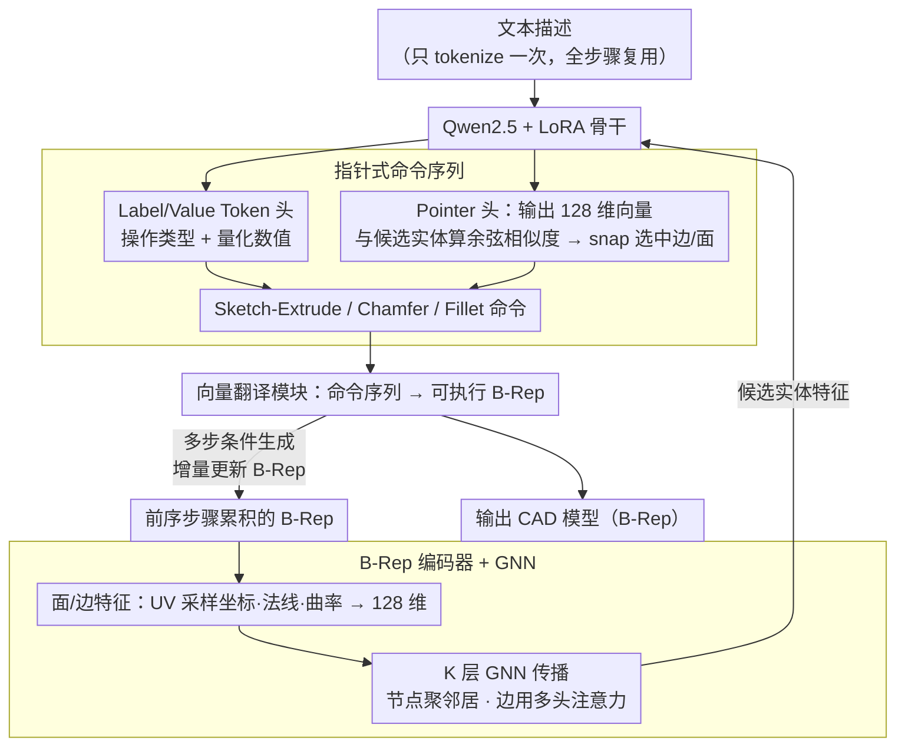

# Pointer-CAD: Unifying B-Rep and Command Sequences via Pointer-based Edges & Faces Selection

**会议**: CVPR2026  
**arXiv**: [2603.04337](https://arxiv.org/abs/2603.04337)  
**代码**: [Snitro/Pointer-CAD](https://github.com/Snitro/Pointer-CAD)  
**领域**: 3D CAD 生成  
**关键词**: CAD 生成, B-Rep, Pointer Network, 命令序列, LLM, 图神经网络, Chamfer/Fillet

## 一句话总结

提出基于指针 (Pointer) 机制的命令序列表示，将 B-Rep 几何实体（边/面）显式引入自回归 CAD 生成，首次在命令序列方法中支持 chamfer/fillet 操作，同时大幅降低量化误差导致的拓扑错误。

## 研究背景与动机

**CAD 建模耗时**：传统 CAD 设计流程（2D 草图 → 3D 建模 → B-Rep 存储）高度依赖人工操作，尤其是复杂设计极为耗时。

**命令序列方法的局限**：现有命令序列方法（DeepCAD、Text2CAD 等）将 CAD 操作编码为 token 序列，生成速度快但不支持需要实体选择的操作（如 chamfer、fillet），因为这些操作需要明确引用已有几何实体（边或面）。

**量化误差问题**：LLM 基于的序列生成中，连续参数的离散化会引入量化误差，导致新绘制的曲线无法与已有边对齐、草图平面与目标面不匹配，破坏拓扑连通性。

**代码表示的效率瓶颈**：代码生成方法（CadQuery/FreeCAD）虽灵活，但 token 序列长度约为命令序列的 4 倍（424 vs 110 tokens），推理时间显著更长。

**通用 LLM 不足**：Claude Opus 4、Gemini 2.5 Pro、GPT-5.2 等通用 LLM 直接生成 CadQuery 代码的成功率低，几何一致性差（IR 高达 24-50%）。

**实体选择的歧义**：已有尝试通过面标签和面交线来实现实体选择，但由面交线推导的边可能不唯一，存在选择歧义。

## 方法详解

### 整体框架

Pointer-CAD 要解决的是"命令序列方法生成快、但没法引用已有几何实体（边/面），所以做不了 chamfer/fillet，还容易因量化误差错位"这件事。它把 CAD 建模拆成多步，每一步都基于文本描述 + 前序步骤生成的 B-Rep 做条件生成：文本只 tokenize 一次、所有步骤复用，B-Rep 在每步操作后增量更新。骨干是 Qwen2.5（0.5B/1.5B）+ LoRA 微调，最终隐藏状态接两个独立全连接层，一个预测 Label/Value Token、一个预测 Pointer；预测出的命令序列再由向量翻译模块转成可执行的 B-Rep 几何。

### 关键设计

**1. 指针式命令序列表示：用一类 Pointer token 显式引用已有的边和面**

命令序列方法（DeepCAD、Text2CAD）把 CAD 操作编码成 token，但 chamfer/fillet 这类操作得明确指向某条边某个面，纯数值 token 做不到。Pointer-CAD 把每个 token 归到三类之一：

| 类型 | 说明 |
|------|------|
| **Label Token** | 语义标签，指示操作类型或结构边界（如 `<ss>` 草图开始、`<sc>` chamfer 开始） |
| **Value Token** | 数值参数（坐标、角度等），连续参数量化为 $2^q$ 级别的 $q$-bit 整数 |
| **Pointer** | 引用 B-Rep 中的面或边，由 LLM 输出 128 维向量并与候选实体计算余弦相似度选取 |

三种基本操作都靠 Pointer 串起来：**Sketch-Extrude** 用 Pointer 从候选面里选草图平面（替代传统 6 参数回归），再绘制 Line/Arc/Circle 并拉伸 $E:(e_p, e_n, b)$；**Chamfer** $C:(\mathbf{p}, c)$ 用 Pointer 集合 $\mathbf{p}$ 选目标边、$c$ 为统一倒角距离；**Fillet** $F:(\mathbf{p}, f)$ 同理选边、$f$ 为统一圆角半径。Pointer 的 snap-to-entity 让新画的曲线直接对齐到已有边，绕开了量化误差导致的拓扑断裂。

**2. B-Rep 编码器 + GNN：把几何实体编码成可供指针匹配的特征**

Pointer 要能选对边/面，前提是每个实体有判别性的特征。本文把 B-Rep 建成**面邻接图** $\mathcal{G}(V, E)$（节点为面、边为共享边界）：面特征取 $32 \times 32$ UV 采样网格上的 3D 坐标 + 法线 + 高斯曲率 + 可见性标记，平均池化成 128 维；边特征取 32 点等距采样的 3D 坐标 + 切线 + 导数，平均池化成 128 维。再用 $K$ 层 GNN 传播——节点更新聚合邻居消息（类 GIN 机制），边更新用多头注意力（MHA）从全局面特征取信息。消融显示 GNN 对弧线结构的建模增益最大（Arc F1 67.14 → 85.70），因为它补上了孤立实体看不到的拓扑上下文。

**3. 多步条件生成：把整模生成拆成步序列，让后续操作能引用前面已生成的几何**

上面两个设计要成立，有个绕不开的前提——指针能指、GNN 能编码，都得先有「已存在的边和面」可指可编码。但传统命令序列方法一次性吐出整条序列、不回看前序几何，序列里压根没有「已有实体」，于是 chamfer/fillet 这类对已有边/面动刀的操作无从落脚。Pointer-CAD 把整个建模过程拆成一串步骤，每步只生成一个基本操作（sketch-extrude / chamfer / fillet），并以文本描述 + 截至当前累积的 B-Rep 为条件自回归预测下一步。每步操作完成后，向量翻译模块把命令序列转成几何、增量更新 B-Rep，再喂回编码器供下一步引用（即图中 VT → B-Rep → 编码器的回环）；文本只 tokenize 一次、全步骤复用，B-Rep 则随步骤逐步长大。正因为几何随步骤累积，后面的指针才有「已有实体」可指，整个流程也贴近工程师「先建体、再选边倒角」的真实操作顺序。

### 损失函数 / 训练策略

总损失为

$$\mathcal{L} = \lambda_v \cdot \mathcal{L}_v + \lambda_p \cdot \mathcal{L}_p$$

- **Label/Value 预测** $\mathcal{L}_v$：带标签平滑的交叉熵分类损失。
- **Pointer 预测** $\mathcal{L}_p$：对比式回归损失，允许多个有效候选（共面/共线的等价实体），正例最大化余弦相似度、负例最小化，带可学习温度 $\tau$。

## 实验

### 主实验：Text-to-CAD 生成

**Recap-DeepCAD 数据集**（176K 模型，不含 chamfer/fillet）：

| 模型 | Line F1↑ | Arc F1↑ | Circle F1↑ | CD mean↓ | CD median↓ | SegE↓ | FluxEE↓ |
|------|----------|---------|------------|----------|-----------|-------|---------|
| DeepCAD | 80.14 | 31.41 | 79.04 | 37.47 | 12.56 | 0.53 | 25.85 |
| Text2CAD | 88.12 | 45.19 | 87.03 | 17.48 | 3.38 | 0.44 | 17.75 |
| CADmium-7B | 85.13 | 25.68 | 74.94 | 10.53 | 0.44 | 1.21 | 32.22 |
| **Pointer-CAD-0.5B** | **97.70** | **85.70** | **98.27** | 3.81 | 0.54 | **0.13** | **2.14** |
| **Pointer-CAD-1.5B** | 98.73 | 95.14 | 98.66 | **2.58** | **0.30** | 0.11 | 2.97 |

**Recap-OmniCAD+ 数据集**（575K 模型，含 chamfer/fillet）：

| 模型 | Chamfer F1↑ | Fillet F1↑ | CD mean↓ | SegE↓ | FluxEE↓ |
|------|------------|-----------|----------|-------|---------|
| 其他方法 | 不支持 | 不支持 | 11.60-27.48 | 0.51-1.39 | 26.36-42.59 |
| **Pointer-CAD-0.5B** | **89.74** | **82.54** | 5.49 | **0.15** | **3.51** |
| **Pointer-CAD-1.5B** | 94.32 | 89.85 | **2.86** | 0.17 | 3.44 |

### 消融实验：GNN 的有效性

| 设置 | IR↓ | Arc F1↑ | CD mean↓ |
|------|-----|---------|----------|
| Pointer-CAD w/o GNN (MLP) | 22.73 | 67.14 | 5.13 |
| **Pointer-CAD w/ GNN** | **15.02** | **85.70** | **3.81** |
| Text2CAD w/o GNN | 30.16 | 45.19 | 17.48 |
| Text2CAD w/ GNN | 27.17 | 51.85 | 14.33 |

GNN 对弧线 (Arc) 结构的建模增益尤为显著（F1 从 67.14 → 85.70）。

### 关键发现

- **0.5B 模型超越 7B**：Pointer-CAD-0.5B 在几乎所有指标上优于 CADmium-7B，说明表示设计比模型规模更重要。
- **SegE 降低一个数量级**：Pointer 机制通过 snap-to-entity 有效消除量化误差导致的拓扑断裂（SegE: 0.44-1.21 → 0.11-0.13）。
- **FluxEE 大幅改善**：实体密封性从 17-38 降至 2-3，生成模型更接近水密实体。
- **通用 LLM 对比**：GPT-5.2 的 IR 达 23.9%（即近 1/4 模型生成失败），Pointer-CAD-0.5B 仅 14.79%。

## 亮点

- **Pointer 机制**创新性地将 Pointer Network 思想引入 CAD 命令序列，实现了命令序列方法中**首次支持 chamfer/fillet** 操作。
- **多步条件生成**架构优雅：每步基于累积 B-Rep + 文本条件生成，模拟真实工程师操作流程。
- **数据工程**扎实：构建 575K 规模数据集，用 Qwen2.5-VL 自动标注多视角描述，保留真实参数而非归一化。
- Token 效率极高：平均仅 110 tokens/模型，推理 2.13 秒，远优于代码表示方案。

## 局限性

- 当前仅评估了**文本条件**设定，未扩展到图像/点云等多模态输入。
- 仅支持**单零件建模**，不涉及装配体级别的约束关系（配合约束、层级依赖）。
- 复杂模型（≥4 步非草图操作）偶尔出现局部定位偏差。
- Pointer 依赖 B-Rep 几何特征的余弦匹配，对高度对称模型中相似面/边的区分能力有待验证。

## 相关工作

- **B-Rep 生成**：ComplexGen、CMT 等直接生成 B-Rep 层级结构，但拓扑关系复杂难以建模。
- **CSG 表示**：通过布尔运算组合基本体，但难以表示曲面（如圆角），且 CSG 表示不唯一。
- **命令序列**：DeepCAD → SkexGen → Text2CAD → CAD-MLLM → CADFusion，逐步引入更多模态和操作，但均不支持实体选择。Fan et al. 曾尝试基于面标签的实体选择，但面交线推导的边存在歧义。
- **代码表示**：CADmium (JSON)、CadQuery/FreeCAD API 方案灵活但 token 长、推理慢。

## 评分

- 新颖性: ⭐⭐⭐⭐⭐ — Pointer 机制引入 CAD 序列生成是关键创新，首次实现命令序列中的实体引用
- 实验充分度: ⭐⭐⭐⭐ — 多数据集 + 通用 LLM 对比 + GNN 消融 + 定性分析，但缺少多模态输入实验
- 写作质量: ⭐⭐⭐⭐ — 结构清晰，图表丰富，动机阐述充分
- 价值: ⭐⭐⭐⭐⭐ — 解决了命令序列方法核心痛点，0.5B 模型超越 7B 模型具有很强实用意义

<!-- RELATED:START -->

## 相关论文

- [\[CVPR 2026\] FoV-Net: Rotation-Invariant CAD B-rep Learning via Field-of-View Ray Casting](fov-net_rotation-invariant_cad_b-rep_learning_via_field-of-view_ray_casting.md)
- [\[CVPR 2026\] Annotation-Efficient Coreset Selection for Context-dependent Segmentation](annotation-efficient_coreset_selection_for_context-dependent_segmentation.md)
- [\[CVPR 2026\] From 2D Alignment to 3D Plausibility: Unifying Heterogeneous 2D Priors and Penetration-Free Diffusion for Occlusion-Robust Two-Hand Reconstruction](from_2d_alignment_to_3d_plausibility_unifying_heterogeneous_2d_priors_and_penetr.md)
- [\[ICML 2025\] ActionPiece: Contextually Tokenizing Action Sequences for Generative Recommendation](../../ICML2025/segmentation/actionpiece_contextually_tokenizing_action_sequences_for_generative_recommendati.md)
- [\[ICML 2026\] Refining Context-Entangled Content Segmentation via Curriculum Selection and Anti-Curriculum Promotion](../../ICML2026/segmentation/refining_context-entangled_content_segmentation_via_curriculum_selection_and_ant.md)

<!-- RELATED:END -->
