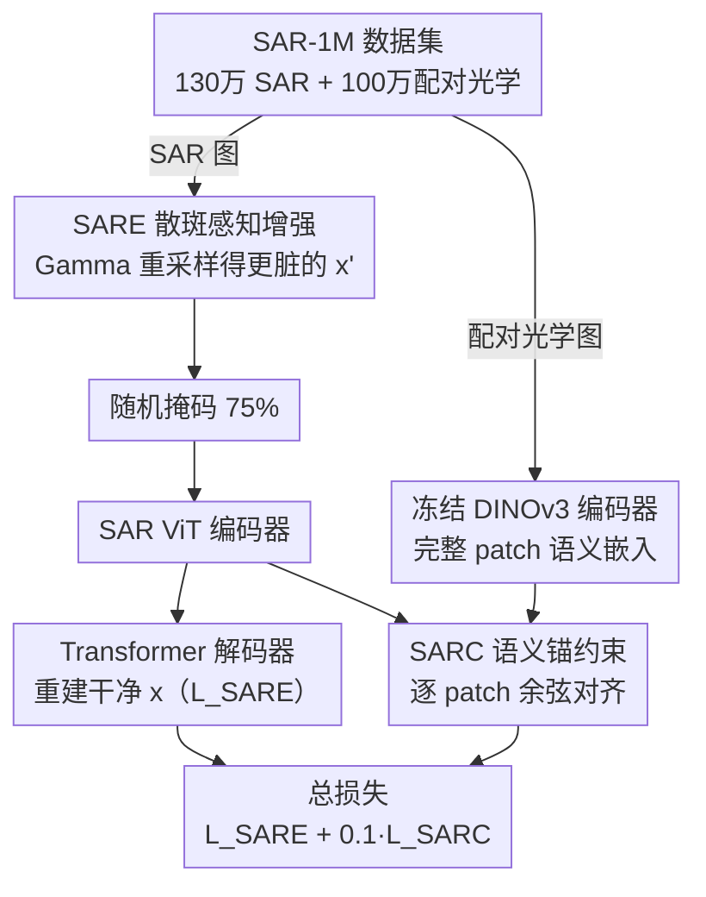

# SARMAE: Masked Autoencoder for SAR Representation Learning

**会议**: CVPR2026  
**arXiv**: [2512.16635](https://arxiv.org/abs/2512.16635)  
**代码**: [SARMAE](https://github.com/SARMAE/SARMAE)  
**领域**: 语义分割 / SAR表征学习  
**关键词**: SAR, 自监督预训练, Masked Autoencoder, 散斑噪声, 光学-SAR对齐, 遥感

## 一句话总结

提出 SARMAE 框架，通过百万级 SAR 数据集 SAR-1M、散斑感知表征增强 (SARE) 和光学语义锚约束 (SARC)，实现噪声鲁棒的 SAR 自监督预训练，在分类、检测和分割多个下游任务上取得 SOTA。

## 研究背景与动机

**SAR 成像的独特优势与挑战**：SAR 具有全天候、全天时成像能力，广泛用于海洋监测、灾害评估、城市分析等领域，但其固有的散斑噪声 (speckle noise) 导致语义内容低、结构线索弱，严重影响深度学习表征质量。

**数据规模瓶颈**：SAR 数据获取成本高昂，现有预训练数据集规模有限——SARATR-X 仅 180k 图像、SUMMIT 仅 560k 图像，远不足以支撑通用 SAR 表征学习。

**光学预训练策略不适用**：现有方法直接沿用光学图像预训练策略（如 MAE、MoCo），忽视了 SAR 散斑噪声的物理特性——散斑是乘性噪声而非加性高斯噪声，需专门建模。

**单模态预训练的语义局限**：仅依靠 SAR 数据预训练，受限于 SAR 图像本身较低的语义可辨识度，学到的表征缺乏语义丰富性和泛化性。

**现有 SAR 基础模型的不足**：SARATR-X 和 SUMMIT 虽尝试了统一预训练，但均未建模 SAR 散斑的物理先验，也未利用多模态互补信息。

**光学图像的语义引导潜力**：光学图像具有更清晰的语义结构，若能利用 SAR-光学配对数据进行跨模态对齐，可显著提升 SAR 表征的语义质量。

## 方法详解

### 整体框架

SARMAE 想解决的是 SAR 图像因散斑噪声而「语义弱、结构糊」、导致自监督预训练学不好表征的问题。它在百万级数据集 SAR-1M 上预训练，并在 MAE 基础上搭了两条分支：SAR 分支是 ViT 编码器 + Transformer 解码器，走标准 MAE 的 75% 随机掩码重建，但额外塞进 SARE 模块来对付散斑；光学分支是一个冻结的 DINOv3 编码器（与 SAR 分支共享 ViT 架构），给有配对光学图的 SAR 数据提供语义锚点。有配对光学图时两支协同（SARC 对齐），没配对的 SAR 数据就只走 SAR 分支。

### 关键设计

**1. 散斑感知表征增强（SARE）：让模型学会从更脏的输入里重建干净图**

散斑是 SAR 成像固有的乘性噪声，直接套用为加性高斯噪声设计的光学预训练并不对症。SARE 把散斑的物理模型显式注入训练：多视 SAR 强度图像服从 Gamma 分布 $Z\sim\text{Gamma}(L,\bar{I}/L)$（$L$ 为视数、$\bar{I}$ 为真实后向散射强度），于是对输入 patch $x$ 用一个更低的合成视数 $L_{\text{syn}}$ 从 Gamma 分布采出噪声更重的版本 $x'$——均值不变但方差变大。再把 $x'$ 随机掩码送进编码器，要求解码器重建的是原始干净的 $x$ 而非噪声版本，迫使模型主动把散斑过滤掉。损失为 $\mathcal{L}_{\text{SARE}} = \frac{1}{|\mathcal{M}|} \sum_{p \in \mathcal{M}} \| D(E_{\text{SAR}}(\tilde{x}'))_p - x_p \|_2^2$；除 Gamma 外还掺入 Rayleigh、Gaussian、Uniform 噪声进一步增强鲁棒性。

**2. 语义锚表征约束（SARC）：借光学图的清晰语义把 SAR 特征「拉正」**

只靠 SAR 自身预训练，受限于它本就低的语义可辨识度。SARC 利用配对光学图当语义锚点：SAR 图掩码后过 SAR 编码器得到可见 patch 嵌入 $f_{\text{SAR}}^i$，光学图不掩码、过冻结的 DINOv3 得到完整 patch 嵌入 $f_{\text{OPT}}^i$，对空间对应的 patch 对施加逐 patch 余弦距离损失 $\mathcal{L}_{\text{SARC}} = \frac{1}{|\mathcal{V}|} \sum_{i \in \mathcal{V}} \left(1 - \frac{f_{\text{SAR}}^i \cdot f_{\text{OPT}}^i}{\|f_{\text{SAR}}^i\|_2 \|f_{\text{OPT}}^i\|_2}\right)$。这样 SAR 编码器被引导着向语义更清晰的光学特征对齐，学到的表征语义更丰富。消融里直接拿冻结 DINOv3 微调 SAR 反而很差（74.25%），说明有效性来自显式的 SAR-光学对齐而非 DINOv3 本身。

**3. SAR-1M 数据集：把预训练数据从十万级推到百万级**

SARATR-X 只有 18 万、SUMMIT 56 万，远撑不起通用 SAR 表征。SAR-1M 聚合 18 个公开数据集、57 个类别，凑出 130 万 SAR 图 + 100 万配对光学图共 230 万样本，覆盖 Sentinel-1、Gaofen-3、RadarSat-2、TerraSAR-X 等多传感器，跨 C/X/Ku/Ka 多频段、HH/HV/VV/VH 多极化、0.1m–60m 多分辨率。其中配对的光学图正是 SARC 跨模态对齐的前提。

### 损失函数 / 训练策略

总预训练损失把两项合起来：$\mathcal{L}_{\text{pretrain}} = \mathcal{L}_{\text{SARE}} + \lambda \mathcal{L}_{\text{SARC}}$，其中 $\lambda = 0.1$。SARE 负责让模型理解并滤除噪声，SARC 负责提供清晰的语义引导，两者互补。

## 实验

### 主要结果

| 任务 | 数据集 | 指标 | SARMAE (ViT-B) | SARMAE (ViT-L) | 前 SOTA |
|------|--------|------|-----------------|-----------------|---------|
| 分类 | FUSAR-SHIP (40-shot) | Top1 Acc | **89.30%** | **90.86%** | 87.61% (Copernicus FM) |
| 分类 | FUSAR-SHIP (30%) | Top1 Acc | **92.92%** | 92.80% | 71.91% (SUMMIT) |
| 分类 | MSTAR (40-shot) | Top1 Acc | **96.70%** | **97.24%** | 91.60% (SAR-JEPA) |
| 检测 | SARDet-100k | mAP | 57.90% | **63.10%** | 57.30% (SARATR-X) |
| 检测 | SSDD | mAP | **68.10%** | **69.30%** | 67.50% (SARATR-X) |
| 旋转检测 | RSAR | mAP | 66.80% | **72.20%** | 64.82% (O-RCNN) |
| 分割 | AIR-PolSAR-Seg (多类) | mIoU | 66.53% | **67.51%** | 52.58% (ANN) |
| 分割 | AIR-PolSAR-Seg (水体) | IoU | 92.31% | **93.06%** | 89.29% (DANet) |

### 消融实验

| 模型 | 预训练数据 | SARE | SARC | FUSAR | SSDD | AIR-PolSAR-Seg |
|------|-----------|------|------|-------|------|----------------|
| MAE (Baseline) | ImageNet-1K | ✗ | ✗ | 75.40 | 64.00 | 60.28 |
| MAE | SAR-1M (仅SAR) | ✗ | ✗ | 82.22 | 64.20 | 64.36 |
| MAE + 噪声 | SAR-1M (仅SAR) | ✓ | ✗ | 86.80 | 64.40 | 65.15 |
| SARMAE | SAR-1M (SAR/OPT) | ✓ | ✓ | **89.30** | **68.10** | **66.53** |

### 关键发现

- **域内预训练收益显著**：SAR-1M 预训练比 ImageNet 预训练在 FUSAR 上提升 +6.82%，证明 SAR 与自然图像存在显著分布差异
- **SARE 贡献**：加入散斑噪声建模后分类提升 +4.58%，注意力图显示模型能更准确地聚焦语义目标，甚至捕获细微语义相关物体
- **SARC 贡献**：在 SSDD 检测上带来 +3.7% mAP 提升，有效缓解因散斑干扰导致的虚警问题；重建可视化显示 SARC 能恢复局部场景结构
- **扩展性良好**：ViT-B → ViT-L 在旋转检测上提升 +5.4 mAP
- **DINOv3 直接微调不行**：冻结 DINOv3 直接微调 SAR 效果差 (74.25%)，说明 SARC 的有效性源于显式 SAR-光学对齐

## 亮点

- 构建首个百万级 SAR 数据集 SAR-1M，填补大规模 SAR 预训练数据空白
- 基于物理模型（Gamma 分布）的散斑噪声注入设计，使预训练过程直接适配 SAR 成像物理特性
- SARE 和 SARC 互补配合：前者让模型理解噪声、后者提供清晰语义引导
- 在分类/检测/分割三大任务的多个数据集上全面 SOTA，泛化性强

## 局限性

- 预训练资源消耗大（300 epochs，batch 1024，A800 GPU），普通实验室难以复现
- SARC 依赖 SAR-光学配对数据，无配对区域（如极地、高纬度）的 SAR 数据无法受益于跨模态对齐
- 光学分支使用冻结 DINOv3，未探索联合训练或其他光学教师模型的潜在优势
- SAR-1M 虽然涵盖多传感器，但 18 个源数据集的标注标准和质量差异可能引入偏置
- 下游任务评估未覆盖变化检测、目标跟踪等更多 SAR 应用场景

## 相关工作

- **SAR 预训练**：SARATR-X (HiViT + 两阶段自监督)、SUMMIT (MAE + 多辅助任务)、SAR-JEPA (掩码自编码 + 局部重建)
- **遥感预训练**：SeCo (MoCo)、RVSA (MAE + 旋转窗口注意力)、SatMAE (多光谱/多时相)、ScaleMAE (尺度感知掩码)
- **通用视觉预训练**：MAE、BEiT、DINOv3、CROMA (对比学习)、Copernicus FM (DINO 蒸馏)

## 评分

- 新颖性: ⭐⭐⭐⭐ — SARE 的物理噪声建模和 SARC 的跨模态对齐设计有新意，SAR-1M 数据集是重要贡献
- 实验充分度: ⭐⭐⭐⭐⭐ — 三大任务、多个数据集、完整消融，结果一致且显著
- 写作质量: ⭐⭐⭐⭐ — 结构清晰，物理建模公式严谨，可视化丰富
- 价值: ⭐⭐⭐⭐⭐ — 数据集+框架+SOTA，对 SAR 社区有重要推动作用

<!-- RELATED:START -->

## 相关论文

- [\[CVPR 2026\] Masked Representation Modeling for Domain-Adaptive Segmentation](mrm_masked_representation_modeling_domain_adaptive.md)
- [\[CVPR 2026\] AFRO: Bootstrap Dynamic-Aware 3D Visual Representation for Scalable Robot Learning](bootstrap_dynamic-aware_3d_visual_representation_for_scalable_robot_learning.md)
- [\[ICLR 2026\] AMLRIS: Alignment-aware Masked Learning for Referring Image Segmentation](../../ICLR2026/segmentation/amlris_alignment-aware_masked_learning_for_referring_image_segmentation.md)
- [\[ICCV 2025\] Region-based Cluster Discrimination for Visual Representation Learning](../../ICCV2025/segmentation/region-based_cluster_discrimination_for_visual_representation_learning.md)
- [\[CVPR 2026\] Structure-Aware Representation Distillation for Tiny-Dense Object Segmentation](structure-aware_representation_distillation_for_tiny-dense_object_segmentation.md)

<!-- RELATED:END -->
