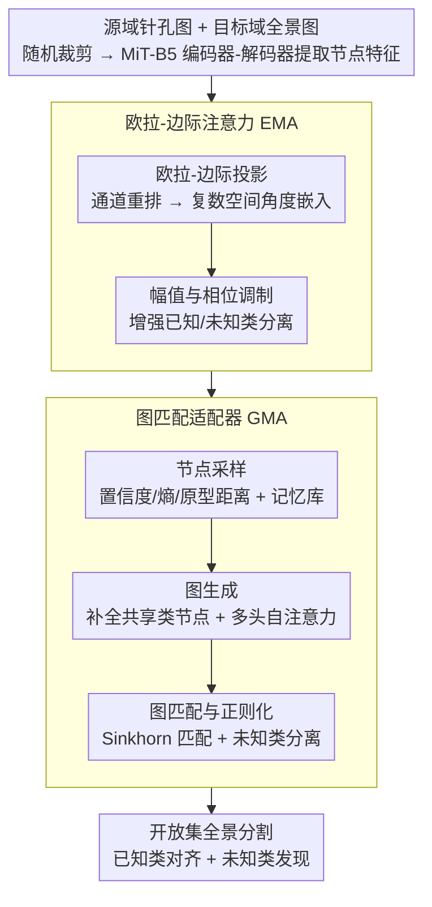

# Seeing Beyond: Extrapolative Domain Adaptive Panoramic Segmentation

**会议**: CVPR 2026  
**arXiv**: [2603.15475](https://arxiv.org/abs/2603.15475)  
**代码**: [有](https://github.com/zyfone/EDA-PSeg)  
**领域**: 语义分割  
**关键词**: 全景语义分割, 开放集域自适应, 视场角迁移, 图匹配, 欧拉注意力

## 一句话总结

提出 EDA-PSeg 框架，通过图匹配适配器（GMA）和欧拉-边际注意力（EMA）两个核心模块，首次实现从针孔视图到 360° 全景图像的开放集无监督域自适应语义分割，同时处理几何视场角畸变和未知类别发现。

## 研究背景与动机

**全景视觉的重要性**：全景图像提供 360° 视场角（FoV），能实现无遮挡的完整场景感知，在自动驾驶和机器人领域有广泛应用。

**跨域全景分割的挑战**：现有方法在有标注的针孔图像（源域）上训练，迁移到无标注的全景图像（目标域），但面临严重的几何 FoV 畸变和语义分布不一致问题。

**闭集假设的局限**：现有 CPS 方法大多假设测试时只出现训练中见过的类别（闭集设定），在开放世界场景中遇到未知物体时会失败，存在安全隐患。

**像素级原型方法的不足**：现有开放集域自适应方法（如 BUS、UniMAP）依赖像素级原型映射，但全景图像的风格不一致和几何畸变使这类方法效果受限。

**恶劣天气条件的干扰**：从单一或多种天气条件到多样恶劣天气的迁移，会进一步破坏跨域对齐效果。

**首个开放集全景分割工作**：本文首次定义了开放集跨域全景语义分割任务，要求模型在适应不同 FoV 场景和天气条件的同时，泛化到未见过的类别。

## 方法详解

### 整体框架

EDA-PSeg 基于 DAFormer 架构，使用 MiT-B5 编码器-解码器网络作为骨干。输入源域（针孔图像）和目标域（全景图像）经随机裁剪后送入网络提取特征，随后依次经过：

- **欧拉-边际注意力（EMA）**：将特征投影到复数向量空间的角度感知嵌入，通过角度边际约束缓解跨视图几何畸变，并通过幅值和相位调制增强已知/未知类别分离性。
- **图匹配适配器（GMA）**：构建高阶语义图关系，对齐跨域共享类别的图节点，同时通过正则化将未知类别分离。

### 关键设计

按数据流（编码器-解码器 → EMA → GMA）顺序展开两个核心模块。

**1. 欧拉-边际注意力（EMA）：把特征投到复数角度空间，用角度边际抹平跨视角畸变**

针孔到全景的几何畸变会让同类像素在不同视角下特征方向漂移，普通自注意力对此无能为力。EMA 把这一步拆成两小步：

- **欧拉-边际投影**：对输入特征做通道降序重排（软置换矩阵保证梯度回传），将重排后的偶数/奇数通道分别作为实部和虚部，通过欧拉公式 $\mathcal{F}(\mathbf{V}) = \Lambda \cdot e^{i\theta}$ 投影到复数空间。通道重排约束了相位角 $\theta$ 的取值范围（即“角度边际”），增强同类内聚性以缓解跨视角差异。
- **幅值与相位调制**：在自注意力点积中引入可学习参数：$\delta_1$（指数幅值缩放）调节特征重要性，$\delta_2$（相位缩放因子）和 $b$（相位偏置）调节语义方向，最终注意力分数为 $\mathcal{E}_{\text{Euler}} = (e^{2\delta_1}(\Lambda_q \odot \Lambda_k))^\top \text{Re}[\exp(i[\delta_2(\theta_q - \theta_k) + b])]$。幅值编码特征重要性、相位编码语义方向，从而增强已知/未知类别的可分性。

**2. 图匹配适配器（GMA）：用高阶语义图替代像素原型，对齐已知类、隔离未知类**

全景图风格不一致 + 几何畸变让传统像素级原型对齐失效；GMA 改用图节点的高阶关系建模，在 EMA 增强后的特征上构图匹配：

- **节点采样**：基于置信度、熵和原型距离进行局部节点采样，选取代表局部语义的节点，再聚合为类级全局原型。对已知类别以置信度 $\tau_p$ 和熵 $\tau_e$ 阈值筛选正/负样本集；对未知类别以中位熵 $\tau_m$ 分割正/负样本。保留最近 K 个节点并通过指数滑动平均更新全局记忆库 $\mathcal{M}$。
- **图生成**：识别源域和目标域共享类别，用记忆库 $\mathcal{M}$ 补全缺失类别节点（添加高斯噪声），通过多头自注意力更新节点集合，生成节点特征和边亲和度矩阵构成语义图。
- **图匹配与正则化**：使用 Sinkhorn 算法计算节点匹配矩阵，构建忽略未知类的开放集匹配标签。损失函数包含三项——图匹配损失（节点对齐）、图边亲和度损失（结构一致性）、未知类正则化损失（已知/未知节点 Frobenius 范数惩罚），从而在对齐共享类的同时把未知类推开。

### 损失函数/训练策略

总训练目标：$\mathcal{L}_{\text{total}} = \ell_{\text{seg}} + \ell_{\text{mixup}} + \gamma \cdot \ell_{\text{graph}}$

- $\ell_{\text{seg}}$：源域有监督分割损失
- $\ell_{\text{mixup}}$：源域-目标域混合训练的伪标签损失
- $\ell_{\text{graph}}$：GMA 模块的图匹配损失（含节点匹配、边亲和度和未知类正则化三项）
- 权重 $\gamma = 0.1$（平衡 common/private 类性能）
- 使用 MobileSAM 进行目标域伪标签掩码精炼
- 训练 40k 迭代，512×512 随机裁剪，测试时使用原始全景分辨率

## 实验关键数据

### 主实验

**四个基准的开放集域自适应结果（mIoU %）：**

| 基准设定 | 类型 | Common | Private | H-Score |
|---------|------|--------|---------|---------|
| C2D (Cityscapes→DensePASS) | Pin2Pan, Real2Real | **56.81** | **18.86** | **28.32** |
| S2D (SynPASS→DensePASS) | Syn2Real, Pan2Pan | **35.07** | **7.48** | **12.33** |
| G2S (GTA→SynPASS) | Pin2Pan + Weather | **44.96** | **10.20** | **16.63** |
| S2A (SynPASS→ACDC) | Syn2Real + Weather | **30.17** | **9.18** | **14.08** |

**与最佳基线对比（C2D 基准）：**

| 方法 | Common | Private | H-Score |
|------|--------|---------|---------|
| HRDA | 53.42 | 0.00 | 0.00 |
| BUS (SAM) | 49.47 | 3.10 | 5.84 |
| **EDA-PSeg (Ours)** | **56.81** | **18.86** | **28.32** |

闭集方法（DAFormer/HRDA/MIC）Private mIoU 均为 0，完全无法识别未知类别。

### 消融实验

**模块消融（C2D）：**

| GMA | EMA | Common | Private | H-Score |
|-----|-----|--------|---------|---------|
| ✗ | ✗ | 52.56 | 8.57 | 14.74 |
| ✓ | ✗ | 55.15 | 14.67 | 23.18 |
| ✗ | ✓ | 56.12 | 13.00 | 21.11 |
| ✓ | ✓ | **56.81** | **18.86** | **28.32** |

**EMA 与其他注意力对比（C2D）：**

| 方法 | Common | Private | H-Score |
|------|--------|---------|---------|
| Self-Attention | 55.45 | 10.95 | 18.28 |
| EulerFormer | 55.09 | 7.20 | 12.74 |
| Deformable MLP | 55.89 | 7.68 | 13.51 |
| **Euler-Margin (Ours)** | **56.12** | **13.00** | **21.11** |

**GMA 损失组件消融**：去掉图匹配项性能下降最大（H-Score 23.18→8.73），未知类正则化对 Private mIoU 有显著提升（7.78→14.67）。

### 关键发现

1. **闭集方法在开放集设定下完全失效**：所有闭集 UDA 方法 Private mIoU 为 0，H-Score 为 0，无法识别任何未知类别。
2. **GMA 和 EMA 互补**：GMA 主要提升 Private 类识别（+6.10），EMA 主要提升 Common 类表示（+3.56），两者结合 H-Score 从 14.74 提升至 28.32。
3. **图匹配是 GMA 的核心**：在 GMA 三个损失项中，图匹配项贡献最大，去掉后 H-Score 从 23.18 骤降至 8.73。
4. **权重敏感性**：$\gamma$ 过大（1.0）有利于 Private 但损害 Common，过小（0.01）则相反，$\gamma=0.1$ 为最佳平衡点。

## 亮点与洞察

- **首创开放集全景分割问题定义**：将 FoV 几何转换和未知类别发现统一建模，比传统闭集 CPS 更贴近真实场景。
- **欧拉公式的巧妙应用**：利用复数空间的幅值-相位分解，幅值编码特征重要性、相位编码语义方向，通道排序约束角度范围实现视角不变性。
- **图匹配替代像素原型**：高阶图关系建模比传统像素级原型对齐更鲁棒，能同时处理节点匹配和结构一致性。
- **全面的基准覆盖**：涵盖 Pin↔Pan、Syn→Real、多天气条件等多种域迁移场景，并系统比较了闭集/开放集方法。

## 局限性

- 随机裁剪引入采样敏感性，偶尔导致训练不稳定。
- 图匹配增加模型参数和计算开销，EMA 也增加架构复杂度。
- 在部分细粒度类别（如 Traffic Light、Traffic Sign）上改善有限，某些基准上接近 0 mIoU。
- S2D 和 S2A 基准上 Private mIoU 绝对值仍较低（7-9%），开放集发现能力有待进一步提升。

## 相关工作

- **跨域全景分割**：CFA（畸变感知注意力）、DPPASS（切向投影）、Trans4PASS（可变形补丁嵌入）、OmniSAM/GoodSAM（SAM辅助对齐）
- **开放集域自适应**：BUS（SAM掩码+原型匹配）、UniMAP（原型权重缩放）、OSBP/UAN/UniOT（传统 OSDA）
- **位置编码**：RoPE（旋转位置编码）、EulerFormer（欧拉空间统一语义-位置表示）
- **图匹配**：跨域命名实体识别、医学图像分析、目标检测中的图关系推理

## 评分

- 新颖性: ⭐⭐⭐⭐ — 首次定义开放集全景分割问题，EMA 和 GMA 设计有创意
- 实验充分度: ⭐⭐⭐⭐ — 四个基准、多场景覆盖、详细消融，但部分类别绝对性能仍低
- 写作质量: ⭐⭐⭐⭐ — 问题定义清晰、方法表述系统，公式较多但逻辑连贯
- 价值: ⭐⭐⭐⭐ — 填补了开放集全景分割的空白，方法具有实际意义

<!-- RELATED:START -->

## 相关论文

- [\[CVPR 2026\] Masked Representation Modeling for Domain-Adaptive Segmentation](mrm_masked_representation_modeling_domain_adaptive.md)
- [\[CVPR 2026\] Heuristic Self-Paced Learning for Domain Adaptive Semantic Segmentation under Adverse Conditions](heuristic_self-paced_learning_for_domain_adaptive_semantic_segmentation_under_ad.md)
- [\[CVPR 2026\] REL-SF4PASS: Panoramic Semantic Segmentation with REL Depth Representation and Spherical Fusion](rel-sf4pass_panoramic_semantic_segmentation_with_rel_depth_representation_and_sp.md)
- [\[CVPR 2026\] Seeing Both Sides: Towards Bidirectional Semantic Alignment for Open-Vocabulary Camouflaged Object Segmentation](seeing_both_sides_towards_bidirectional_semantic_alignment_for_open-vocabulary_c.md)
- [\[CVPR 2026\] Denoise and Align: Towards Source-Free UDA for Robust Panoramic Semantic Segmentation](denoise_and_align_towards_source-free_uda_for_robust_panoramic_semantic_segmenta.md)

<!-- RELATED:END -->
