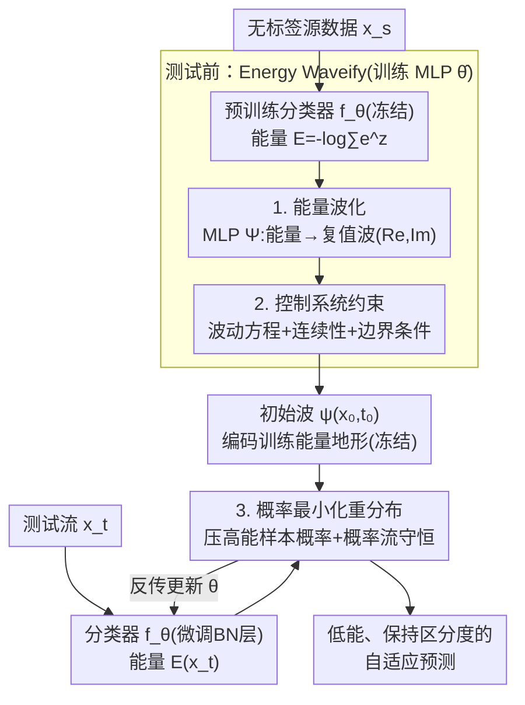

# Energy Waveify and Redistribution for Test-Time Adaptation: A Control System Perspective

**会议**: CVPR 2026  
**论文**: [CVF Open Access](https://openaccess.thecvf.com/content/CVPR2026/html/Wang_Energy_Waveify_and_Redistribution_for_Test-Time_Adaptation_A_Control_System_CVPR_2026_paper.html)  
**代码**: https://github.com/wongzbb/APT  
**领域**: 自监督 / 测试时自适应（TTA）  
**关键词**: 测试时自适应, 能量模型, 波动方程, 控制系统, 概率流守恒  

## 一句话总结
把分类器输出的"能量"重新参数化为复值波（振幅=能量不确定性、相位=演化方向），用控制系统里的波动方程 + 概率流守恒来引导测试样本能量从高能区平滑流向低能区，从而在**不做任何 MCMC/Langevin 采样、也不访问源域数据**的前提下完成测试时自适应（TTA），自适应耗时只有 Top-3 基线的 1/3 ～ 1/7，且精度全面 SOTA。

## 研究背景与动机
**领域现状**：测试时自适应（TTA）只用无标签测试流、在推理时立刻把模型适配到当前分布漂移上，比域适应（需训练时拿到测试数据）和域泛化（推理时完全不用测试数据）更贴合真实部署。主流路线分两类：基于风险最小化（伪标签、熵最小化）和基于能量函数。能量模型（EBM）给每个样本赋一个标量能量——同分布样本能量低、离群样本能量高——它衡量的是**整体分布拟合**而非逐点预测，因此能给 TTA 提供一个全局对齐目标。

**现有痛点**：能量类 TTA 要估计能量梯度，通常依赖 SGLD（随机梯度 Langevin 动力学）或近似推理，对**每个测试样本都要做多次随机扰动采样**。这带来三个问题：① 计算开销巨大、难以在高吞吐场景部署；② 采样过程容易模式崩溃、收敛不稳定；③ 近期 Han 等人提出的免采样方法虽然绕开了采样开销，却要在测试时维护一个装着**源域训练样本**的 replay buffer 来构造对比对，在隐私敏感场景下不可接受。

**核心矛盾**：如果改成"预存训练能量值、测试样本挑一个匹配能量去对齐 + 直接最小化能量损失"，又会踩到另一个坑——直接优化能量会**动态重塑训练分布的能量地形**，让本应有区分度的样本能量收敛到相同值（判别力退化），能量分布过度集中到几个峰上，预存的能量参考逐渐失效，最终模式崩溃。也就是说：免采样、免源数据、又不破坏训练能量地形，三者难以兼得。

**本文目标**：在源数据不可用的 TTA 设定下，**不靠采样**实现有效的能量对齐，同时**保住训练分布的能量地形**。关键的技术难点是——如何在域内训练能量地形与域外观测能量之间，建立一条**可微分**的连接，让梯度能端到端回传？

**切入角度**：作者把能量建模成**复值波**。波动理论天然提供一个连续、可微的数学框架，能把训练能量分布"形变"到目标能量；相位（complex plane 里的相角）刻画演化方向，振幅刻画概率密度。再借鉴 Mamba 把神经网络看作状态空间控制系统的思路，但不同于 Mamba 用实值、只含时间导数的状态方程，本文用**复值、含空间二阶导**的波动方程来描述自适应过程。

**核心 idea**：用"波动方程 + 控制系统约束（边界条件 + 连续性条件）"把 TTA 重写成一个**良定义的概率流演化**问题——强制概率流守恒，把概率从高能（易错）区导向低能（准确）区，全程保持能量地形的整体归一化，从而无需采样、无需源数据完成能量重分布。方法命名 APT（Active Probability current conservation for Test-time energy adaptation）。

## 方法详解

### 整体框架
APT 把整套流程拆成**两个阶段**：① **测试前（Energy Waveify）**——冻结预训练分类器 $f_\theta$，单独训练一个把能量映射成复值波的 MLP $\Psi_{\hat\theta}$，并用一组物理约束损失逼它满足波动方程、连续性、边界条件，得到一个"编码了训练能量地形"的初始波 $\psi(\hat x_0, t_0)$；② **测试时（Energy Redistribution）**——冻结 MLP $\hat\theta$，只微调分类器的归一化层参数 $\theta$，用冻结的波函数算出每个测试样本能量对应的概率，把高能样本的概率压下去，同时用波动方程损失保证这次"重分布"满足概率流守恒。

整条管线的核心对象是能量 $E(z) = -\log\sum_{i=1}^{K}e^{z_i}$（分类器 logits 的 free energy）。波 $\psi(x,t)\in\mathbb{C}$ 描述第 $t$ 步自适应时的能量地形，受波动方程 $-\frac{d^2\psi}{dx^2} + V(x)\psi = \psi$ 支配，其中势函数 $V(x)$ 在低能/高能区设置势垒，控制能量演化时的状态变化幅度。理论上（Theorem 1）测试能量地形是从初始训练波出发、对所有可能演化路径的加权叠加，因此一切观测到的测试能量都能由训练能量确定性演化而来；（Theorem 2）在边界条件 + 连续性条件下，$\int|\psi(\hat x,t)|^2 d\hat x = 1$ 且其对时间导数为 0，即概率质量全程守恒。

### 关键设计

**1. 能量波化（Energy Waveify）：把标量能量升维成复值波，换来可微的训练↔测试桥梁**

直接在标量能量上做对齐有个根本缺陷——它没有"方向"信息，硬推所有测试能量过阈值会让不同类的能量塌到一起。作者用一个参数为 $\hat\theta$ 的 MLP 把能量回归成二维向量，即复值波的实部和虚部：记 $E_\theta(\cdot):=-\log\sum_i \exp(f^i_\theta(\cdot))$、$\Psi_{\hat\theta}(\cdot):=\mathrm{MLP}_{\hat\theta}(\cdot)$。复表示的妙处在于**振幅 $|\Psi|$ 编码能量的概率密度/不确定性，相位（与实轴夹角）编码自适应的演化方向**——这恰好对应波动理论里"沿可微路径连续形变"的能力，于是训练能量地形与测试能量地形之间就有了一条**可微分**的演化通道，梯度可以端到端回传。这是整篇方法的地基：把"挑能量值对齐"这种离散、易放大错误的操作，替换成"沿波的相位连续演化"。

**2. 控制系统三约束：把波动方程钉成良定义系统，换来概率流守恒**

光让 MLP 输出一个波还不够，必须保证这个波是波动方程 $-\frac{d^2\psi}{dx^2}+V(x)\psi=\psi$ 的合法解，否则演化无法保证存在唯一、回传也不稳定。作者用三组物理启发损失把波"锁"成控制系统：

- **波动方程损失 $L_{def}$**：直接惩罚波偏离方程的残差，势函数取分段式——$V(E)=0$ 当 $E<a$、$V(E)=V_0$ 当 $E\ge a$，阈值 $a$ 设为训练样本平均能量 $a=\mathbb{E}_{x_s}[E_\theta(x_s)]$，把能量空间切成大致均衡的低能/高能两区，让波对低于/高于均值的能量学到不同行为、编码更丰富的训练能量统计。
- **连续性条件 $L_{value}+L_{grad}$**：强制波及其一阶导在阈值 $a$ 处连续，即 $\|\Psi_{\hat\theta}(a{+}\delta)-\Psi_{\hat\theta}(a{-}\delta)\|^2$ 与梯度差同时趋零。没有这个约束，波会在阈值处出现尖锐断裂，概率无法跨能量边界流动，优化也会失稳；有了它，概率才能从被压制的高能区平滑流入低能区。
- **边界条件 $L_{bound}$**：假设训练/测试能量都落在有限区间 $[\tilde x_l,\tilde x_r]$ 内，强制波在边界处振幅归零 $\|Re[\Psi]\|^2+\|Im[\Psi]\|^2$。这保证波平方可积、概率电流不会从边界泄漏，把演化严格限制在"测试分布偏离训练分布不超过 $\epsilon$ 测地距离"的容差球内。

这三项的梯度都与输入数据无关，因此是作用在 $\hat\theta$ 上的纯物理正则项。三者合起来正是 Theorem 2 成立的前提——它们把波动方程变成**良定义的控制系统**，从而保证 $\int|\psi|^2=1$ 全程不变，能量地形不被破坏（呼应了"避免直接能量损失导致的模式崩溃"这个动机）。测试前阶段冻结 $\theta$、只优化 $\hat\theta$，总目标为

$$L_{wave}(x_s;\hat\theta)=L_{def}+\alpha\big(L_{value}+L_{grad}+L_{bound}\big).$$

**3. 概率最小化重分布：用概率密度图代替直接阈值惩罚，把测试能量导向低能区且保持类间区分**

测试时冻结 $\hat\theta$、只微调归一化层 $\theta$，目标是把所有测试能量挪到阈值 $a$ 左侧（低能区）。一个最朴素的做法是直接最小化 $\|E-a\|_p$，但作者明确拒绝了它，理由很具体：① 不同类天然处在不同能级（易类聚在低能、难类在高能），用单一阈值 $a$ 一刀切会抹掉这种结构、把不同类挤到一起；② $\|E-a\|_p$ 对所有高于 $a$ 的能量一视同仁，而能量**概率密度**是一张学出来的"质量地图"——高密度区代表问题位置、低密度的自然极小值代表理想落点，于是强梯度把样本推离问题区、接近低密度区时梯度自然衰减，避免过调；③ 走概率密度还能和波动方程自然耦合。因此作者改为压制高能区的概率质量：

$$L_{penalize}(x_t;\theta)=\|Re[\Psi_{\hat\theta}(E_\theta(\tilde x_t))]\|^2+\|Im[\Psi_{\hat\theta}(E_\theta(\tilde x_t))]\|^2,\quad \text{s.t. } E_\theta(\tilde x_t)>a.$$

但只压概率可能产生非法的重分布——概率必须守恒（既不能凭空产生也不能消失，只能搬运），数学上即连续性方程 $\frac{\partial\rho}{\partial t}+\nabla\cdot j=0$（$\rho$ 是概率密度、$j$ 是从波动方程导出的概率电流）。所以最终目标把重分布项与波动方程项耦合：

$$L(x_t;\theta)=L_{penalize}(x_t;\theta)+\beta L_{wave}(x_t;\theta).$$

$L_{penalize}$ 指定"去哪里"（低密度、低能区），$L_{wave}$ 保证"怎么去"是一条合法的演化路径——这就把 TTA 变成了一个受约束的概率电流问题。

### 损失函数 / 训练策略
- 测试前：冻结分类器 $\theta$，只训练 MLP $\hat\theta$，损失 $L_{wave}=L_{def}+\alpha(L_{value}+L_{grad}+L_{bound})$，$\alpha$ 为权重；$L_{value}/L_{grad}/L_{bound}$ 的梯度与数据无关，纯作正则。
- 测试时：冻结 $\hat\theta$，只更新归一化层 $\theta$，损失 $L=L_{penalize}+\beta L_{wave}$，$\beta$ 平衡"能量重分布"与"波动方程一致性"。
- 阈值 $a=\mathbb{E}_{x_s}[E_\theta(x_s)]$（训练样本平均能量）；$\delta$ 为连续性评估的小正数。全程不做随机采样，也不访问源域原始样本。

## 实验关键数据

实验沿用 TEA 的设置，评测两个任务：图像损坏泛化（CIFAR-10/100/TinyImageNet-200 的 -C 损坏版，15 种损坏 × 5 级严重度）和域泛化（PACS，4 个域）。指标为 Accuracy 与 mean Corruption Error（mCE）。

### 主实验

WRN-28-10（BatchNorm）上、损坏严重度 1–5 平均的对比（节选最强基线）：

| 数据集 | 指标 | Source | TENT | SAR | CRKD | DISTA | TEA | **APT** |
|--------|------|--------|------|-----|------|-------|-----|---------|
| CIFAR-10-C | Acc(↑) | 73.45 | 86.75 | 85.83 | 88.25 | 87.36 | 87.88 | **91.12** |
| CIFAR-10-C | mCE(↓) | 100.0 | 56.17 | 58.97 | 50.77 | 55.42 | 52.00 | **43.48** |
| CIFAR-100-C | Acc(↑) | 52.12 | 69.47 | 70.01 | 70.44 | 71.01 | 71.22 | **73.57** |
| TinyImageNet-200-C | Acc(↑) | 34.13 | 32.03 | 34.60 | 37.57 | 40.15 | 39.96 | **41.55** |

APT 在三个基准上全面刷新 SOTA：WRN-28-10(BN) 上较最强基线平均 +2.21%，ResNet-50(GroupNorm) 上 +2.30%（CIFAR-10-C 85.33 vs TEA 83.05、CIFAR-100-C 61.10 vs TEA 59.67、TinyImageNet-200-C 35.45 vs DISTA 32.26）。PACS 域泛化上，四个源域的平均精度分别较最强基线提升 4.47%/3.87%/1.11%/2.07%（APT 各源域 Avg：Photo 29.13、Art 44.24、Cartoon 35.01、Sketch 27.54），在域差异最大的 Cartoon/Sketch 上尤其稳。

**效率**：APT 自适应耗时仅为 Top-1～Top-3 基线的 1/3 ～ 1/7（Fig.7，P100 GPU 上 APT ≈12.6min，而 TEA 41.8min、部分基线高达 170～315min），因为完全免去了 SGLD 类的逐样本多次采样。

### 分析实验（CIFAR-10 置信度校准）

由于主文未给组件级消融（详见原文 Appendix），这里用置信度校准对比作为分析表，衡量"保住能量地形"是否真带来更好校准：

| 方法 | MCE(↓) | ECE(↓) | 说明 |
|------|--------|--------|------|
| Source | 57.99 | 4.11 | 未自适应基线 |
| TEA（能量类） | 47.37 | 4.02 | 低置信区(0–0.4)校准不足 |
| CRKD（用训练数据） | 58.28 | 4.94 | 反而比 Source 更差，过自信 |
| **APT** | **42.74** | **3.81** | 全区间贴近对角线，低置信区也好 |

### 关键发现
- **概率守恒带来更好校准**：熵类方法（如 CRKD）会诱导过自信、校准反而退化；TEA 在低置信区(logit 小、对配分函数 $Z$ 影响微弱)校准不足；APT 因为全程保持能量地形归一化，可靠性图最贴对角线。
- **左右比 ↔ 泛化正相关**：随自适应步数增加，低能区/高能区粒子比（Ratio=Left/Right）单调上升、精度同步提升，证明 $L=L_{penalize}+\beta L_{wave}$ 确实通过局部测试流控制了全局能量分布；分布漂移越剧烈，基线精度断崖式下滑而 APT 仍保持鲁棒。
- **效率优势来自机制而非工程**：免采样、免源数据是设计层面带来的，所以时间优势在所有 backbone/归一化方式上都成立。

## 亮点与洞察
- **跨学科的概念迁移很漂亮**：把"标量能量 → 复值波 → 控制系统的概率电流"这条链打通，让"保持训练能量地形不崩"这个抽象诉求，落地成可微、可优化、有理论保证（概率守恒）的损失项。这是把物理（波动方程、连续性方程）和深度学习对接的一个可复用范式。
- **"拒绝直接阈值惩罚"的论证值得借鉴**：作者没有简单地最小化 $\|E-a\|_p$，而是想清楚了它会抹掉类间能级结构、且梯度不自适应，转而用学出来的概率密度图当"质量地图"——这种"用学到的密度引导优化方向、在好位置自动收手"的思路可迁移到很多需要软约束的优化场景。
- **隐私友好 + 高吞吐**：免源数据 replay buffer、免采样，使它在隐私敏感、低延迟部署里比现有能量类 TTA 更实用。

## 局限与展望
- **理论假设较强**：依赖"测试分布在训练流形 $\epsilon$ 测地球内"这一有界几何假设，以及把能量限制在有限边界 $[\tilde x_l,\tilde x_r]$；当漂移超出该容差球（如开放世界、强语义漂移）时，波动演化的可达性假设可能失效。
- **主文缺组件消融**：$L_{def}/L_{value}/L_{grad}/L_{bound}$ 各项、势垒 $V_0$、权重 $\alpha,\beta$ 的单独贡献都放在 Appendix，正文难以判断哪一项最关键；阈值 $a$ 取均值能量是否最优也未在正文充分讨论。
- **只验证了分类 + 归一化层自适应**：方法绑定在"调 BN/GroupNorm 参数 + free energy" 设定上，对检测/分割等结构化输出任务、或没有清晰能量定义的任务是否适用未知。
- 改进方向：把 $\epsilon$ 容差自适应化（按观测漂移动态调边界）、把波动方程推广到多源/连续漂移流、给出势函数 $V$ 的可学习版本。

## 相关工作与启发
- **vs TEA（能量类 TTA）**：TEA 用能量适配但仍隐含采样/对齐到源分布的代价；APT 把能量升维成波、用概率守恒约束重分布，免采样且不破坏能量地形，精度与效率（1/3～1/7 时间）双赢。
- **vs Han et al. 免采样能量 TTA**：后者虽免采样，却要在测试时维护**源样本 replay buffer** 构造对比对，有隐私风险；APT 通过"初始波"作为训练↔测试的桥梁，完全不访问源数据。
- **vs 伪标签 / 熵最小化（SHOT、TENT、SAR、EATA）**：伪标签靠置信度过滤会丢弃低置信但正确的样本、累积误差；熵类方法过度锐化概率导致校准失真；APT 用全局能量分布对齐 + 概率守恒，校准（ECE/MCE）显著更优。
- **vs Mamba 类状态空间控制**：Mamba 用实值、只含时间导数的状态方程；APT 用复值、含空间二阶导的波动方程，能同时刻画振幅（不确定性）与相位（演化方向），更适合描述能量地形的连续形变。

## 评分
- 新颖性: ⭐⭐⭐⭐⭐ 把波动方程/概率流守恒引入 TTA，免采样 + 免源数据，视角新颖且自洽
- 实验充分度: ⭐⭐⭐⭐ 三个损坏基准 + PACS + 校准/比值分析齐全，但组件消融留在 Appendix
- 写作质量: ⭐⭐⭐⭐ 动机层层递进、图示丰富；物理符号偏密，需要一定背景
- 价值: ⭐⭐⭐⭐⭐ 隐私友好 + 1/3～1/7 耗时 + SOTA 精度，对真实部署很实用

<!-- RELATED:START -->

## 相关论文

- [\[ICLR 2026\] Architecture-Agnostic Test-Time Adaptation via Backprop-Free Embedding Alignment](../../ICLR2026/self_supervised/architecture-agnostic_test-time_adaptation_via_backprop-free_embedding_alignment.md)
- [\[ICLR 2026\] Test-Time Efficient Pretrained Model Portfolios for Time Series Forecasting](../../ICLR2026/self_supervised/test-time_efficient_pretrained_model_portfolios_for_time_series_forecasting.md)
- [\[CVPR 2026\] The Devil Is in Gradient Entanglement: Energy-Aware Gradient Coordinator for Robust Generalized Category Discovery](the_devil_is_in_gradient_entanglement_energy-aware_gradient_coordinator_for_robu.md)
- [\[CVPR 2026\] Weight Space Representation Learning via Neural Field Adaptation](weight_space_representation_learning_via_neural_field_adaptation.md)
- [\[ICLR 2026\] Bayesian Test-Time Adaptation via Dirichlet feature projection and GMM-Driven Inference for Motor Imagery EEG Decoding](../../ICLR2026/self_supervised/bayesian_test-time_adaptation_via_dirichlet_feature_projection_and_gmm-driven_in.md)

<!-- RELATED:END -->
