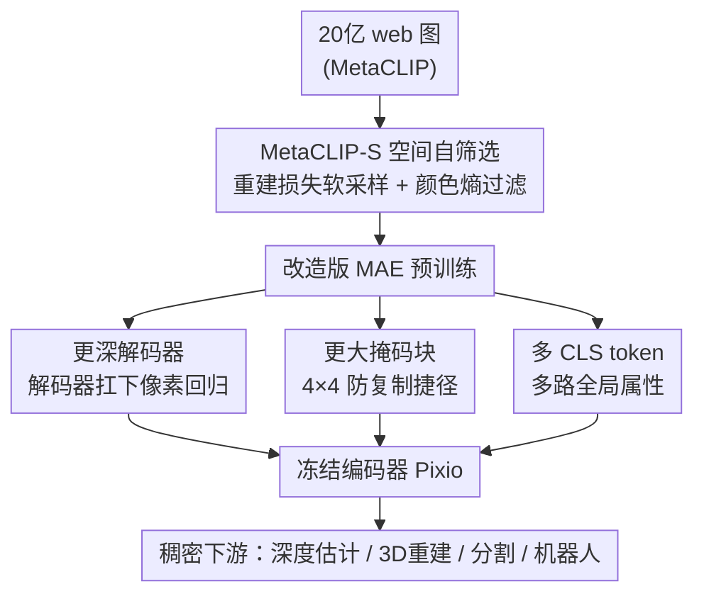

# In Pursuit of Pixel Supervision for Visual Pre-training

**会议**: CVPR 2026  
**论文**: [CVF Open Access](https://openaccess.thecvf.com/content/CVPR2026/html/Yang_In_Pursuit_of_Pixel_Supervision_for_Visual_Pre-training_CVPR_2026_paper.html)  
**代码**: https://github.com/facebookresearch/pixio  
**领域**: 自监督 / 表示学习  
**关键词**: 掩码自编码器, 数据自筛选, 稠密表示, 视觉预训练, 空间智能  

## 一句话总结
作者把 MAE 重新拉回 web 级数据规模，提出基于重建损失的"空间数据自筛选"策略 MetaCLIP-S，再配合四处极简的算法改造（更深解码器、更大掩码块、多 CLS token），训出名为 Pixio 的模型，在深度估计、前馈 3D 重建、分割等稠密预测任务上追平甚至超过经过大量 benchmark 定制筛选的 DINOv2/v3。

## 研究背景与动机
**领域现状**：视觉表示学习从有监督（ImageNet 类别标签）走到自监督，再走到 CLIP 这类图文对比学习。当前在稠密预测任务（深度、3D、分割）上最强的通用编码器是 DINO 家族（DINOv2/v3）。

**现有痛点**：作者指出两条线都有问题。一是 CLIP/标签这类"高层语义监督"本质是物理世界经人类认知和语言的投影——"一图胜千言"，光照变化、空间排布、对称、反射这些信息根本没法用语言充分描述，且依赖人工标注无法继续 scale。二是 DINOv2/v3 虽然强，但用了"benchmark 中心"的激进数据筛选：拿 benchmark 图当 query 去大池子里检索相似训练图，甚至直接把 IN-1K、Mapillary 等 benchmark 训练集以最高 100× 的重复采样注入。这种做法短期刷榜很猛，但让模型对未来未知分布很脆弱。

**核心矛盾**：要学好"空间智能"所需的稠密表示，需要的是保留空间结构、连续性、真实世界交互的多样数据；但 2D 像素本身并不自带空间结构，而 web 爬取的原始分布又被产品图、文档/文字图这类"低空间信息量"内容主导，直接拿来训练并不好。

**本文目标**：在尽量少的人工筛选、尽量不引入 benchmark 偏置的前提下，从 web 级数据里"挑出"富含空间结构的图，并让一个简单稳定的自监督框架（MAE）真正吃下这个规模。

**切入角度**：像素是视觉信息最原始的来源，天然包含从低层（颜色、纹理、材质、几何）到高层（语义、关系、事件）的所有层级信息。与其去拟合人类定义、把低层信号当"噪声"的高层抽象，不如直接做像素重建，逼模型把全层级信息压缩重组。

**核心 idea**：用"模型自身的重建损失"来度量一张图的空间结构丰富度并做软采样筛选（难重建的留、易重建的产品图降权），再给 MAE 做四处必要的算法增强，证明 web 级数据 + 自筛选能让纯像素监督在稠密任务上对标 DINOv3。

## 方法详解

### 整体框架
Pixio 的整体管线是"先治数据、再治算法"：先从 MetaCLIP 的 20 亿 web 图出发，用一个在原始数据上训过的 Pixio 模型预先算每张图的重建损失，据此做 MetaCLIP-S 软筛选（损失高=空间结构丰富=保留概率高），同时用颜色直方图熵过滤掉文字/低光照交互图；然后在筛选后的数据上训练一个改造版 MAE——保留"非对称编码器-解码器 + 高掩码率"两个核心，但把解码器加深、掩码粒度从单 patch 放大到 4×4 块、CLS token 从 1 个扩到多个。预训练完成后，编码器冻结接 DPT/线性头去做下游稠密任务评测。

### 关键设计

**1. MetaCLIP-S：用重建损失给图片打"空间丰富度"分做软筛选**

这一步直接对准"web 原始分布被产品图和文档图主导、空间信息稀薄"的痛点。作者不去人工标注、也不用 benchmark 图当 query 检索（那正是 DINOv2/v3 被批评的 benchmark 偏置来源），而是让模型自己说话：先用一个在原始数据上训好的 Pixio 算出每张图的重建损失 $l_i$，把保留（采样）概率定为

$$P(i) = \min(l_i, 1)$$

直觉很干净——一张产品图背景纯净、结构简单，模型几秒就能重建好、损失低，于是被降采样；一张包含复杂几何、光照、反射、对称的真实场景图重建难、损失高，于是被高概率保留。这等于把"哪些图含丰富空间结构"这个本来要人工判断的问题，外包给了模型的重建难度本身。再补一道颜色直方图熵的硬过滤，剔除那些重建损失也很高、但其实是文字密集 / 低光照交互、场景多样性差的图（它们会污染前一步的软采样信号）。两条策略互补，既留住多样真实内容，又把人工筛选偏置压到最低。消融里它把 ADE20K mIoU 从 44.7（纯 MetaCLIP）拉到 46.8。

**2. 更深的解码器：把"像素回归"这件脏活从编码器手里接管过来**

作者先做了个诊断性观察（图 3）：原始 MAE-H 的最优通用特征并不在最后一层，而早在第 20 个 block（共 32 个）就出现了。他们的解释是——MAE 的解码器太浅、没有足够容量做像素回归，为了把重建损失压下去，编码器的后几层被迫"兼职解码器"去建模低层细节，牺牲了本该专注的语义表示。解法顺理成章：加深解码器，让它独立扛起像素回归，把编码器解放出来。实测把解码器深度从 8 加到 32，IN-1K k-NN 从 35.3→55.8、NYUv2 深度误差 0.431→0.410、ADE20K mIoU 35.8→40.4，提升巨大。但解码器也不能无限堆——过强的解码器会引发"编码器偷懒"（依赖解码器学表示）甚至直接记忆视觉细节，所以 768×32 这类过参配置反而变差，需要保持整体轻量。

**3. 更大的掩码块：堵死"从邻居 patch 抄答案"的重建捷径**

MAE 默认随机丢单个 patch token，问题在于被掩的 patch 往往能直接从紧邻的可见 patch 复制纹理就"看似重建成功"，根本没逼出真正的视觉理解，还破坏了局部上下文和空间结构。Pixio 改成以 4×4 局部 patch 块为单位掩码：成块挖空后，模型没法靠就近抄答案，必须从更大范围的上下文去推断被掩区域，既提供了更丰富的局部上下文又缓解了 ground-truth 泄漏。但粒度也有上限——8×8 这种过大块会让被掩区域变得不可预测、任务退化。消融显示在默认 512×8 解码器、75% 掩码率下，仅把粒度从 1×1 改到 2×2，IN-1K k-NN 就涨 19.0、NYUv2 深度误差 0.431→0.362、ADE20K mIoU +6.0。

**4. 多个 CLS token：让全局表示装得下更多样的整图属性**

MAE 沿用单个 class token，它虽然不受显式 loss 监督，却隐式编码了相机位姿等全局结构信息、帮助 patch token 做局部-全局交互。但单个 token 容量有限，装不下场景类型、图像风格、物体概念、相机位姿这些彼此独立的全局属性。Pixio 直接扩到多个 CLS token，下游需要全局表示时对它们做平均或拼接。它和 ViT 的 register token 形似但角色不同：register token 在评测时被丢弃，而 Pixio 的 CLS token 是直接拿来做下游（分类、机器人学习）的全局表示。消融里 token 数从 1→4，IN-1K k-NN 从 63.3→75.1，稠密任务也有小幅提升。

### 损失函数 / 训练策略
沿用 MAE 的像素重建目标（非对称编码器-解码器 + 高掩码率）。最大模型为 ViT-5.4B/16，在 2B 筛选后 web 图上训练，共 20B seen samples、1.3M 迭代、batch size 16384、输入 256×256；解码器 512 维 × 32 block，4×4 掩码粒度，8 个 CLS token。主论文中实际对外比较的是从大模型蒸馏出的 Pixio-H 编码器（631M），对标 DINOv3-H+（841M）。

## 实验关键数据

### 主实验
冻结编码器 + 可训练 DPT / 线性头做域内 metric 深度估计（数字越小/大越好按列）：

| 任务 / 数据集 | 指标 | MAE-H (631M) | DINOv2-g (1137M) | DINOv3-H+ (841M) | Pixio-H (631M) |
|--------------|------|------|------|------|------|
| NYUv2 (DPT) | RMSE ↓ | 0.465 | 0.355 | 0.320 | **0.268** |
| NYUv2 (DPT) | δ1 ↑ | 80.8 | 90.1 | 93.2 | **95.5** |
| NYUv2 (Linear) | RMSE ↓ | 0.595 | 0.560 | 0.559 | **0.366** |
| KITTI (DPT) | RMSE ↓ | 2.740 | 2.424 | 2.386 | **2.210** |

可以看到 Pixio-H 用比 DINOv3-H+ 少 200M 的参数、且蒸馏自比对方小 1.3B 的母模型，仍在多数稠密任务上反超。语义分割（ADE20K mIoU，DPT 头）：Pixio-H 53.6 vs DINOv3-H+ 52.3；SAM 2 场景的可提示分割五个数据集上 Pixio 整体与 DINOv3-H+ 持平或略优；CortexBench 机器人学习平均分 Pixio 78.4，比 DINOv3 高 3.1、比 R3M 高 1.2。前馈 3D 重建（MapAnything 框架）上 Pixio 在 ScanNet++/ETH3D/TartanAir 的 pose/depth 多项指标领先——值得注意的是 Pixio 只用单视图训练，却比显式用 8 视图的 DINOv3 多视图能力更强。

### 消融实验
三处算法改造叠加效果（均在 2B 筛选数据上预训，表 8）：

| 配置 | IN-1K k-NN ↑ | NYUv2 RMSE ↓ | ADE20K mIoU ↑ | Pascal mIoU ↑ |
|------|------|------|------|------|
| MAE (解码器 512×8, 掩码 1×1, 1 CLS) | 37.9 | 0.392 | 37.2 | 67.4 |
| Pixio (解码器 512×32, 掩码 2×2, 4 CLS) | **59.5** | **0.321** | **46.8** | **80.2** |

数据源对比（表 7，均训 5B seen samples）：

| 数据源 | 筛选 | IN-1K k-NN ↑ | NYUv2 RMSE ↓ | ADE20K mIoU ↑ |
|--------|------|------|------|------|
| IN-1K (1.3M) | 人工 | 77.2 | 0.395 | 42.9 |
| IN-21K (13M) | 人工 | 75.2 | 0.360 | 44.8 |
| MetaCLIP (2B) | 仅语义 | 54.2 | 0.351 | 44.7 |
| MetaCLIP-S (2B) | 自筛选 | 59.5 | 0.321 | **46.8** |

### 关键发现
- 三处改造里**解码器加深贡献最显著**：单独从 8→32 就把 IN-1K k-NN 拉了 20 个点，因为它直接解决了"编码器被迫兼职解码"的根因。
- **数据筛选确实是稠密表示的瓶颈**：纯 MetaCLIP 2B（仅按 alt-text 语义筛）在稠密任务上还不如精心人工筛的 IN-21K，但加上 MetaCLIP-S 自筛选后稠密指标全面反超，说明"是否含空间结构"比"图多不多"更关键。注意 IN-1K k-NN 上 web 数据反而低于 IN-1K——这是分类任务偏好语义筛选数据的预期现象，而本文的目标恰恰是稠密任务。
- **几处改造都有"过犹不及"的甜点区**：解码器 768×32 反而变差（引发编码器偷懒/记忆细节），掩码 8×8 反而变差（被掩区不可预测），需要在难度和可学性之间卡好粒度。
- **弱点诚实可解释**：Pixio 在 KITTI 自动驾驶基准上不及 DINOv2/v3，作者明说是因为没像 DINOv2 那样注入上百万张 Mapillary 驾驶图——这正是"不做 benchmark 定制"的代价。

## 亮点与洞察
- **把"数据筛选"问题转成"模型重建损失"的自指闭环**：用模型自己的重建难度当作"空间结构丰富度"的代理信号，巧妙绕开了人工标注和 benchmark 检索两条都有偏置的老路，是可迁移到任何自监督范式的数据筛选思路。
- **用"最优特征不在最后一层"这个诊断现象反推架构缺陷**：图 3 的探针实验直接暴露了"编码器被迫当解码器"的本质，从现象→根因→解法（加深解码器）一气呵成，是很漂亮的工程推理链。
- **单视图训练却拿下多视图任务**：Pixio 在 MapAnything 前馈 3D 重建上压过显式用多视图的 DINOv3，提示纯单图像素监督已能逼出强多视图对应能力。
- **"少即是多"的反 benchmark 立场**：明确拒绝把 benchmark 图重复采样 100× 这类刷榜捷径，赌的是分布外鲁棒性和未来可扩展性，方法论上很有态度。

## 局限与展望
- 作者承认在 KITTI 等驾驶场景落后，是不注入领域定制数据的直接代价；对特定垂直 benchmark，纯多样性策略未必最优。
- MetaCLIP-S 依赖"先在原始数据上训一个 Pixio 算损失"，存在一定 bootstrap 成本和循环依赖——初始模型质量会影响筛选信号，论文未深入讨论这种自指筛选的稳定性边界。
- 评测重心放在稠密预测任务，分类任务上 web 数据反不如人工筛选数据，说明该方案是"为空间智能定制"的，并非全任务通用最优。
- 改进方向：把损失驱动的自筛选推广到其他自监督范式（DINO/对比学习）、探索动态在线再筛选、以及在筛选信号里融合多视图/视频时序线索。

## 相关工作与启发
- **vs DINOv2/v3**：他们靠大规模数据 + benchmark 中心的激进筛选（检索相似图、重复注入 benchmark 训练集）刷出强结果；本文反其道，用最小人工干预 + 损失自筛选避免 benchmark 偏置。Pixio 用更少参数、更简单的像素重建目标追平/超过 DINOv3，劣势是特定领域（驾驶）落后。
- **vs 原始 MAE**：保留"非对称编解码 + 高掩码率"两大核心，但指出其浅解码器、单 patch 掩码、单 CLS token 在 web 级大数据大模型下都是次优，并逐一修正；同时把训练数据从 IN-1K 换到筛选后的 2B web 图。
- **vs CLIP / 标签监督**：CLIP 把世界投影到人类语言，无法刻画光照、空间排布、对称反射等难以言说的视觉现象且依赖人工标注难 scale；本文直接用像素全层级信号做监督。

## 评分
- 新颖性: ⭐⭐⭐⭐ 损失驱动的空间数据自筛选是干净且可迁移的新角度，算法改造虽各自不新但组合论证扎实
- 实验充分度: ⭐⭐⭐⭐⭐ 横跨深度/3D/分割/机器人四类稠密任务 + 数据源/解码器/掩码/CLS 全套消融，对标当前最强 DINOv3
- 写作质量: ⭐⭐⭐⭐⭐ 从现象诊断到根因再到解法的推理链清晰，动机具体且对自身弱点诚实
- 价值: ⭐⭐⭐⭐⭐ 重新论证了纯像素监督 + web 级数据在稠密表示上的竞争力，对"数据筛选 > 算法花活"给出有力证据

<!-- RELATED:START -->

## 相关论文

- [\[CVPR 2026\] Chain-of-Models Pre-Training: Rethinking Training Acceleration of Vision Foundation Models](com_pt_chain_of_models_pretraining.md)
- [\[CVPR 2026\] Reading Your Actions: Learning Generalizable Action Representations via Pre-training AEMG](reading_your_actions_learning_generalizable_action_representations_via_pre-train.md)
- [\[ECCV 2024\] Efficient Image Pre-Training with Siamese Cropped Masked Autoencoders](../../ECCV2024/self_supervised/efficient_image_pre-training_with_siamese_cropped_masked_autoencoders.md)
- [\[CVPR 2026\] UPLiFT: Efficient Pixel-Dense Feature Upsampling with Local Attenders](uplift_efficient_pixel-dense_feature_upsampling_with_local_attenders.md)
- [\[ICML 2026\] NITP: Next Implicit Token Prediction for LLM Pre-training](../../ICML2026/self_supervised/nitp_next_implicit_token_prediction_for_llm_pre-training.md)

<!-- RELATED:END -->
