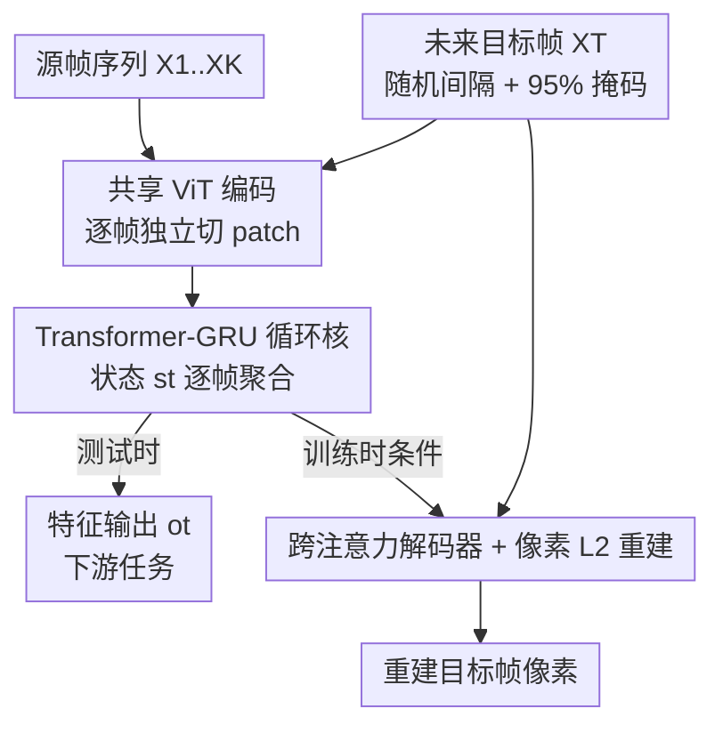

# Recurrent Video Masked Autoencoders

**会议**: CVPR 2026  
**arXiv**: 无  
**论文**: [CVF Open Access](https://openaccess.thecvf.com/content/CVPR2026/html/Zoran_Recurrent_Video_Masked_Autoencoders_CVPR_2026_paper.html)  
**代码**: 无（项目页 https://rvm-paper.github.io ）  
**领域**: 自监督学习 / 视频表征  
**关键词**: 视频掩码自编码、循环网络、GRU、非对称掩码、通用视觉编码器

## 一句话总结
RVM 用「Transformer + GRU 混合循环核」逐帧聚合视频特征，只靠一个非对称像素重建目标（用未掩码的过去帧去重建一个被 95% 掩码的未来帧）训练，得到一个同时擅长时空任务（动作识别、点/物体跟踪）和稠密空间任务（深度、分割对应）的通用编码器，且小模型不蒸馏就能打、参数效率比同类视频 MAE 高达 30×。

## 研究背景与动机
**领域现状**：视频自监督的两大主流是掩码自编码（VideoMAE）和潜空间预测（V-JEPA）。它们普遍用「早融合的时空编码器」——整段 clip 一起做时空注意力，掩码也是在整段 clip 上随机均匀地撒。

**现有痛点**：这种设计把时间当成**均匀、对称**的维度，既忽略了时间的因果性和方向性，又因为是「分块离线」架构只能吃短 clip，没法在长时间跨度上保持一致的表征，也不适合机器人这种在线/流式场景。另一边，图像模型（DINOv2）空间语义强、逐帧展开也稳，但它根本看不到运动；SiamMAE 引入了时间非对称（用未掩码的过去帧重建被重掩码的未来帧），但它训练出来的仍然是**图像编码器**，捕捉不到真正的时空依赖。

**核心矛盾**：「强空间特征」和「强时序/运动特征」目前被两类模型分别占据，没有一个模型能两头都好；而要兼顾，又卡在「时间该怎么建模」——对称时空注意力既贵（二次复杂度）又丢方向性。

**本文目标**：造一个**通用**视觉编码器，既能在时空任务上接近视频 SOTA，又能在稠密空间任务上接近图像 SOTA，还要在长视频上特征稳定、计算线性、小模型不靠蒸馏也强。

**切入角度**：既然时间是有方向的，那就**用循环（recurrent）显式建模时间**——像 RNN 那样逐帧地「吸收、丢弃、精炼」信息，把状态一路带下去。这样长程依赖天然是线性代价的。

**核心 idea**：把 SiamMAE 的时间非对称掩码思想，从「图像编码器」升级成「循环视频编码器」——用一个 Transformer-GRU 混合循环核逐帧聚合，只用最朴素的像素 L2 重建训练。

## 方法详解

### 整体框架
RVM 顺序地处理视频：每一帧 $X_t$ 先被切成 patch、用一个**权重共享的 ViT** 独立编码成 token，再喂进一个**循环核（RNN core）**；循环核携带上一时刻的状态 $s_{t-1}$，融合当前帧 token 后产出更新状态 $s_t$，这个状态既当下游任务用的特征输出 $o_t$，又传给下一帧。因为是逐帧推进，模型能随信息到来增量地整合，长序列展开是**线性**计算/内存。

训练时额外采一个**未来目标帧** $X_T$（与最后一个源帧相隔随机 $\Delta t \in [4, 48]$ 帧，约 0.15~10 秒），把它**重度掩码**（默认掩掉 95%）后用同一个 ViT 编码，再用一个跨注意力解码器、仅凭源帧特征 $o_t$ 把目标帧的像素重建出来，最小化 L2 损失。注意——**测试时不需要目标帧/解码器，循环核的状态就是特征**。

### 关键设计

**1. 时间非对称的「过去→未来」掩码重建：把方向性写进目标里**

针对「VideoMAE/V-JEPA 把时间当对称维度」这个痛点，RVM 沿用并强化了 SiamMAE 的非对称思路：源帧（过去）**几乎不掩码**，目标帧（未来）**掩掉 95%**，让模型只能靠「看过去 + 预测未来」来补全。关键的两点：一是目标帧从一个**随机的未来间隔** $\Delta t \in [4, 48]$ 帧采样（对应约 0.15~10 秒），逼模型在不同时间尺度上都能传播信息；二是训练时每个 clip 取 4 个连续源帧、重建 4 个独立采样的目标帧。这个非对称设定提供了学习「帧间对应关系（correspondence）」的强归纳偏置——比对称随机掩码更贴近视频「时间有先后」的本质，也正是 RVM 在跟踪/分割对应类稠密任务上能压过纯视频模型的原因。

**2. Transformer-GRU 混合循环核：用门控决定记住/丢弃/吸收什么**

这是本文的核心模块（原文小标题就叫 "The Rise of GRU"）。它要解决的是「如何跨时间聚合信息，又保留 Transformer 的 token 间交互能力」。做法是把 GRU 的门控机制套在一个 Transformer 块外面：当前帧编码 $\hat e_t$ 当 query，上一状态 $s_{t-1}$ 当 key/value。具体为

$$u_t = \sigma(W^u_e \hat e_t + W^u_s s_{t-1}), \quad r_t = \sigma(W^r_e \hat e_t + W^r_s s_{t-1})$$
$$\hat h_t = \mathrm{Tx}(q=\hat e_t,\; kv = r_t \odot s_{t-1}), \quad s_t = (1-u_t)\odot s_{t-1} + u_t \odot \hat h_t,\quad o_t = s_t$$

其中 $\sigma$ 是 sigmoid，$\mathrm{Tx}$ 是带跨/自注意力的多层 Transformer 块；**重置门 $r_t$** 在把旧状态送进注意力前先调制它（决定丢弃多少历史），**更新门 $u_t$** 再在「旧状态」和「新注意力输出」之间做加权融合（决定吸收多少新信息）。权重矩阵 $W$ 作用在特征维上、跨所有 token 共享，初始状态 $s_0=0$。相比直接对整段 clip 做全时空自注意力，这个循环核是**线性复杂度**，且消融显示在需要运动理解的任务（SSv2）上比纯自注意力聚合器更准（见消融表）。

**3. 跨注意力解码器 + 纯像素 L2：把训练目标压到最简**

为了让整套方法只依赖「重建像素」这一个监督信号（不需要任何对比/蒸馏/动量编码器），RVM 用一个跨注意力解码器：把目标帧未掩码 token 放回原始网格位置、掩码位填可学习的 `[MASK]` token、加 Fourier 位置编码，然后每个解码块依次做①跨注意力（目标 token 作 query，所有源帧特征 $o_t$ 拼起来作 key/value）②前馈 MLP ③自注意力，最后投影回 patch 像素。损失就是整张重建图与目标图的逐像素 **L2**，无 patch 归一化。简洁到「只有像素重建」反而是卖点——它让训练能跑非常长的 schedule（1M 步、约 2B 样本）且各下游任务持续涨点，不靠任何花哨技巧。

### 损失函数 / 训练策略
- **目标**：重建图与目标帧的逐像素 L2（无 patch 级归一化）。
- **数据**：约 8.4M 公开网络视频（HowTo100M / Kinetics700 / SSV2 / YTBB / YT8M 混合），每例取 64 帧 clip，采 4 连续源帧 + 4 个未来目标帧，256×256 分辨率。
- **优化**：AdamW + cosine 衰减 + warmup，global batch 2048，1M 步（消融用 250k 步），256 块 TPU-v6，bf16 前后向、loss/softmax 升到 fp32。从零训练，**全程无蒸馏**。

## 实验关键数据

### 主实验
在 8 个基准上同时评测「时空任务」和「空间任务」，用按列归一化后求平均得到的 **Normalized Avg.** 衡量「通用性」。大模型档（L/H）：

| 模型 | 参数(M) | SSv2 Acc↑ | PT AJ↑ | DAVIS J&F↑ | VIP mIoU↑ | Norm. Avg↑ |
|------|---------|-----------|--------|------------|-----------|------------|
| DINOv2-L（图像，蒸馏） | 303 | 52.2 | 36.6 | 61.7 | 40.6 | 82.5 |
| VideoMAE-L（视频） | 305 | 62.7 | 78.3 | 54.3 | 18.9 | 82.2 |
| V-JEPA2-L（视频） | 307 | 67.5 | 73.7 | 47.5 | 17.2 | 78.8 |
| **RVM-L** | 375 | 66.7 | 77.3 | **66.0** | **38.0** | **94.4** |
| DINOv2-g | 1135 | 54.8 | 39.9 | 62.4 | 40.5 | 85.0 |
| VideoMAEv2-g | 1013 | 65.6 | 73.7 | 41.7 | 16.9 | 77.9 |
| **RVM-H** | 743 | 68.7 | 78.3 | 65.6 | 37.3 | **94.9** |

要点：DINOv2 空间任务强但点跟踪只有 36.6（视频模型 >70）；视频模型时空强但 VIP 稠密对应 <20（DINOv2 是 40）。**只有 RVM 两头都不垮**，Normalized Avg 比直接对手高 >10 个点，连参数大 1.5~3× 的 giant 模型也被超过。

小模型档（不蒸馏）：

| 模型 | 参数(M) | SSv2↑ | Kinetics↑ | Norm. Avg↑ |
|------|---------|-------|-----------|------------|
| SiamMAE-S | 27 | 40.0 | 41.2 | 80.8 |
| 4DS-S | 24 | 39.9 | 28.1 | – |
| DINOv2-S（蒸馏） | 21 | 48.3 | 57.1 | 84.4 |
| VideoMAE-B | 87 | 52.3 | 38.9 | 80.4 |
| **RVM-S** | 34 | **59.7** | 49.6 | **96.1** |

RVM-S 不蒸馏即在 SSv2 上 +3.7%、Kinetics-400 上较 4DS-S +21.5%，并在 8 项里 6 项胜过大它 4 倍的 VideoMAE-B；其跨所有规模平均的归一化精度甚至超过大 30× 的 VideoMAEv2-g 与 DINOv2-g。

### 消融实验
（均用 S 模型、500M 样本训练）

| 配置 | SSv2↑ | Kinetics↑ | ScanNet AbsRel↓ | 说明 |
|------|-------|-----------|-----------------|------|
| 源帧数=1 | 41.0 | 39.3 | 1.60 | 等价于 SiamMAE（同数据/代码/架构对照） |
| 源帧数=2 | 47.2 | 39.0 | 1.62 | 可建模匀速运动 |
| 源帧数=4（默认） | 52.3 | 39.7 | 1.50 | 帧越多越好 |
| 聚合器=自注意力 | 49.1 | 39.6 | 1.51 | 计算更贵且更差 |
| 聚合器=RNN（默认） | **52.3** | 39.7 | 1.50 | 更省且更准，运动任务尤甚 |
| 训练量 250M | 46.4 | 33.8 | 1.75 | — |
| 训练量 2B | **57.2** | **47.7** | **1.20** | 34M 小模型仍持续受益于更多数据，无过拟合迹象 |

### 关键发现
- **循环核 vs 全自注意力**：在同层数/同参数、patch 1×16×16 的公平对照下，RNN 聚合不仅 FLOPs 更低，SSv2（需运动理解）上还更准（52.3 vs 49.1）——验证「显式时序聚合」对运动任务的价值。
- **长程特征稳定性**：在 DAVIS 上只取 >80 帧的长视频、按 16/32/48/64/80 帧评测标签传播，RVM 的性能衰减显著慢于所有视频/图像基线；尤其它**只用 4 帧 horizon 训练**却能稳定展开到长序列，且延迟随帧数线性增长（对比全时空注意力的二次增长）。
- **小模型免蒸馏**：DINOv2 等依赖大教师蒸馏才能在小算力档强，RVM-S 从零训练即取得最高平均归一化精度。

## 亮点与洞察
- **「图像派 vs 视频派」二选一被打破**：长期以来空间任务靠 DINO、时空任务靠 VideoMAE/V-JEPA，RVM 用一个架构在 Pareto 前沿上同时压住两条线，这种「通才」结果本身就很反直觉。
- **GRU 的回归很巧**：把经典 GRU 的 reset/update 门套在 Transformer 块外，既拿到注意力的 token 交互又拿到 RNN 的线性长程聚合，是个可迁移到其他「流式/在线视频编码」的结构模板。
- **极简监督换来极强泛化**：全程只有像素 L2、无对比/蒸馏/动量队列，却能跑超长 schedule 持续涨点——说明「时间非对称掩码 + 循环聚合」这个组合本身提供了足够强的归纳偏置。
- **线性代价的在线特性**：循环 + 4 帧训练却能长序列稳定展开，天然适配机器人/流式场景，是相对分块离线视频模型的结构性优势。

## 局限与展望
- 训练只用 4 个源帧，二阶运动（加速度）等高阶动态在短 horizon 下仍难以建模（作者在源帧数消融里点到）。
- 训练成本高（256 TPU-v6、1M 步约 2B 样本），复现门槛大；且未开源代码（仅项目页）。
- 评测虽广但偏「冻结特征 + readout/最近邻」协议，端到端微调下的表现、以及与最新 V-JEPA2 在更大规模上的对比仍有待补充。
- ⚠️ 部分超参/架构细节（各档层数、隐藏维、伪代码）在正文里留给了 Supplementary，正文表格的少量数字格式（如 41.020）疑似带补零，**以原文为准**。

## 相关工作与启发
- **vs SiamMAE**：两者都用「非对称掩码 + 跨注意力解码」，但 SiamMAE 训练的是图像编码器（源帧数=1 即退化为它），RVM 加了循环核把它升级为能聚合多帧的**视频编码器**——消融里 1→4 源帧的涨点正是这一升级的收益。
- **vs VideoMAE / V-JEPA2**：它们用全段对称时空注意力（二次复杂度、分块离线），RVM 用循环（线性、可流式、有方向性），换来长程稳定性和稠密空间任务上的大幅领先。
- **vs DINOv2**：DINOv2 靠蒸馏在小模型档取胜且空间语义强，但看不到运动；RVM 不蒸馏、兼顾运动，平均归一化精度更高。
- **vs VideoMamba 等 SSM**：同样追求高效长序列，但 SSM 多用非因果双向、把视频拍平成 token 序列丢了空间结构；RVM 是因果循环且保留逐帧空间特征。

## 评分
- 新颖性: ⭐⭐⭐⭐⭐ 把 GRU 门控与 Transformer 融成循环视频编码器、并打通空间/时空两类任务，思路清晰且少见
- 实验充分度: ⭐⭐⭐⭐⭐ 8 基准 × 多规模 + 长程稳定性 + 三组消融，覆盖很全
- 写作质量: ⭐⭐⭐⭐ 结构清楚、动机递进自然，部分架构细节外放到附录
- 价值: ⭐⭐⭐⭐⭐ 通用编码器 + 小模型免蒸馏 + 线性在线特性，对机器人/流式应用很有吸引力
