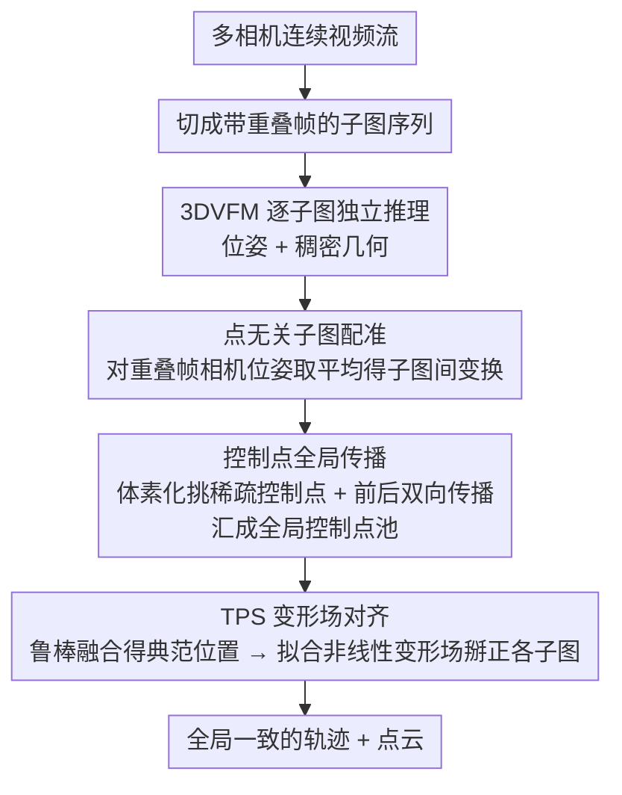

# TALO: Pushing 3D Vision Foundation Models Towards Globally Consistent Online Reconstruction

**会议**: CVPR 2026  
**arXiv**: [2512.02341](https://arxiv.org/abs/2512.02341)  
**代码**: [GitHub](https://github.com/Xian-Bei/TALO)  
**领域**: 自监督学习  
**关键词**: 3D 视觉基础模型, 在线重建, Thin Plate Spline, 子图对齐, 自动驾驶

## 一句话总结

提出 TALO，一种基于 Thin Plate Spline 的高自由度对齐框架，通过全局传播控制点和点无关的子图配准设计，纠正 3D 视觉基础模型在在线重建中的空间变化不一致性，兼容多种基础模型和相机配置，在 Waymo/nuScenes 数据集上显著降低轨迹误差。

## 研究背景与动机

**领域现状**: 3D 视觉基础模型（3DVFMs）如 VGGT、π³、MapAnything 能从未标定图像中通过单次前向推理重建关键 3D 属性（内参、位姿、稠密几何），展示了强大的泛化能力。但这些模型多针对离线场景设计，当部署在自动驾驶等在线场景时，各时间窗口（子图）独立推理，跨子图一致性难以保证。

**现有痛点**: VGGT-Long 使用 7-DOF 的 Sim(3) 对齐，VGGT-SLAM 使用 15-DOF 的 SL(4) 对齐。然而 Sim(3) 无法处理空间变化的非线性几何畸变，SL(4) 在户外多相机场景下高度不稳定，超过 60% 的场景出现发散。两种方法均只做相邻子图的成对对齐，无法保证全局一致性。

**核心矛盾**: 基础模型的预测误差在空间上非均匀分布（如不同相机有相反的深度尺度偏差），单一全局线性变换无法同时纠正所有区域。SL(4) 的欠约束性使其对几何噪声极为敏感，常产生物理不可能的位姿（如建筑严重倾斜）。

**本文目标**: 如何在在线场景中以灵活的方式纠正 3DVFMs 的空间变化几何不一致性，同时对噪声保持鲁棒？

**切入角度**: 使用 Thin Plate Spline（TPS）提供更高自由度的非线性变形场，配合全局传播的控制点获取长程信息，并用点无关的子图配准替代基于噪声点云的对齐。

**核心 idea**: 通过 TPS 变形场和全局控制点传播来替代传统 Sim(3)/SL(4) 全局变换，实现在线 3D 重建中空间变化畸变的灵活纠正。

## 方法详解

### 整体框架

3D 视觉基础模型在每个时间窗口（子图）里都能独立推理出位姿和稠密几何，但跨子图拼起来时一致性没人管——这正是 TALO 要补的洞。它把连续多相机视频流切成带重叠帧的子图序列，每个子图交给 3DVFM 独立推理，然后用三步把它们对齐到一个共享的典范空间：先靠重叠帧的相机位姿（而非噪声点云）算出子图间变换，再沿序列前后传播一批稀疏控制点、汇成全局控制点池，最后用这些控制点拟合一个 Thin Plate Spline 变形场把各子图非线性地掰正。

### 关键设计

**1. 点无关子图配准：用相机位姿而不是噪声点云对齐**

子图间对齐如果建立在 3DVFM 预测的稠密点云上，点云本身的噪声会被直接喂进对齐、放大误差。TALO 干脆绕开点云，直接用重叠帧的相机位姿来算子图间变换 $\mathbf{H}_{k \to k-1}^i = \mathbf{T}_{k-1}^i (\mathbf{T}_k^i)^{-1}$，再对所有重叠帧的变换取平均（旋转分量用 Chordal L2 平均）。

经验上相机位姿比原始点云稳定得多，这一步产出的轨迹也最准——消融里把它换回点云对齐会显著退化，说明"用什么来算变换"这件事比对齐算法本身更关键。

**2. 控制点全局传播：让长程信息在子图链上流动**

成对对齐只能保证相邻子图一致，全局漂移依旧累积。TALO 在每对重叠区域用体素化（voxel size $\delta_v$）挑出空间均匀分布的稀疏控制点，靠 3DVFM 的像素对齐特性、用像素坐标在两个子图间锁定同一物理位置的对应关系。控制点沿序列前向、后向双向传播：新子图里已被占用的体素不再生成新点，而新生成的点会反向传播去丰富互观测，所有观测最终汇入一个全局控制点池。

这样每个物理位置都积累了来自多个子图的观测，全局一致性不再依赖逐对累加，而是由这个共享的控制点池统一约束。

**3. TPS 变形场对齐：用高自由度非线性变形掰正空间变化的畸变**

Sim(3)/SL(4) 这类全局线性变换假设误差场处处均匀，可基础模型的预测误差在空间上是非均匀的（不同相机甚至有相反的深度尺度偏差），单一线性变换按下葫芦浮起瓢。TALO 先对每个控制点的多子图观测做鲁棒融合（压制动态物体和离群值）得到一个典范 3D 位置，再以"控制点当前位置 → 典范位置"的对应关系拟合 Thin Plate Spline 变形场，把各子图统一变形到共享典范空间。

TPS 的高自由度让它能逐区域地纠正空间变化畸变，同时局部刚性正则又保住了子图内部的结构连贯，不至于为了对齐而把几何揉烂——这正是线性变换给不了的灵活性。

### 损失函数 / 训练策略

- TALO 是一个**无需训练的即插即用框架**，无需微调基础模型
- 纯优化式方法：基于控制点对应关系拟合 TPS 变形场
- 完全兼容任意 3DVFM（VGGT、π³、MapAnything）和任意相机配置（单目、环视）

## 实验关键数据

### 主实验：Waymo 数据集轨迹精度（ATE RMSE [m] 平均值）

| 基础模型 | 对齐策略 | ATE↓ | RTE↓ | RRE↓ |
|----------|----------|------|------|------|
| VGGT | VGGT-Long (Sim3) | 1.42 | 0.32 | 0.71 |
| VGGT | VGGT-SLAM (SL4) | 12.21 | 5.50 | 10.90 |
| **VGGT** | **TALO** | **1.09** | **0.28** | **0.14** |
| π³ | VGGT-Long (Sim3) | 2.22 | 0.48 | 0.93 |
| π³ | VGGT-SLAM (SL4) | 22.23 | 5.64 | 9.82 |
| **π³** | **TALO** | **0.86** | **0.26** | **0.24** |
| Map. | VGGT-Long (Sim3) | 3.68 | 0.63 | 1.71 |
| Map. | VGGT-SLAM (SL4) | 30.50 | 11.17 | 23.57 |
| **Map.** | **TALO** | **1.40** | **0.42** | **0.60** |

### nuScenes 数据集轨迹精度（ATE RMSE [m] 平均值）

| 基础模型 | 对齐策略 | ATE↓ | RTE↓ | RRE↓ |
|----------|----------|------|------|------|
| VGGT | VGGT-Long | 1.63 | 0.47 | 0.58 |
| VGGT | VGGT-SLAM | 17.53 | 3.25 | 6.51 |
| **VGGT** | **TALO** | **1.31** | **0.37** | **0.19** |
| π³ | VGGT-Long | 1.63 | 0.60 | 1.49 |
| π³ | VGGT-SLAM | 9.37 | 4.49 | 7.93 |
| **π³** | **TALO** | **最优** | **最优** | **最优** |

### 关键发现

- VGGT-SLAM (SL4) 在超过 60% 的户外场景中发散（ATE >> 5% GT 轨迹长度），红色标记的灾难性失败频繁出现。
- TALO 在所有三个基础模型上均取得最佳 ATE/RTE/RRE，无一场景发散。
- 相比 VGGT-Long，TALO 在 Waymo 上平均 ATE 降低 23%（VGGT）到 62%（MapAnything），RRE 降低 80%+。
- 点无关配准是轨迹精度的关键，替换为点云对齐会显著退化。

## 亮点与洞察

- **即插即用**: 不修改基础模型，仅后处理对齐，实用性极强。
- **理论分析扎实**: 从数学角度分析了 Sim(3) 和 SL(4) 的根本缺陷（假设全局均匀误差场），揭示了它们失败的本质原因。
- **全面实验覆盖**: 跨 3 个基础模型 × 2 个数据集 × 多种相机配置，充分验证了泛化性。
- **控制点传播设计精巧**: 利用像素对齐特性和体素化实现高效的全局信息传递。

## 局限与展望

- TPS 变形场的灵活性依赖于控制点的数量和分布，在极端稀疏的场景中可能不够。
- 框架对动态物体的处理依赖鲁棒融合的阈值设置，极端动态场景可能受影响。
- 虽无需训练，但运行时 TPS 拟合和控制点传播的计算开销未详细分析。
- 未讨论与回环检测的协同工作方式。

## 相关工作与启发

- **与 VGGT-Long/SLAM 的关系**: TALO 是对现有全局对齐范式的直接改进，用 TPS 替代 Sim(3)/SL(4)。
- **与 DUSt3R/MASt3R 的关系**: 这些方法预测稠密点图但缺乏在线重建机制，TALO 可作为后端对齐模块。
- **启发**: 在基础模型时代，轻量级的后处理对齐方案可能比端到端微调更高效实用；全局控制点传播的思想可推广到 SLAM 和大规模场景重建。

## 评分

- 新颖性: ⭐⭐⭐⭐ — TPS 用于 3DVFM 在线对齐是新颖的，控制点传播设计巧妙
- 实验充分度: ⭐⭐⭐⭐⭐ — 跨模型、跨数据集、跨相机配置的全面验证，对比清晰
- 写作质量: ⭐⭐⭐⭐ — 问题分析深入，图示清晰，公式紧凑
- 价值: ⭐⭐⭐⭐⭐ — 即插即用的通用方案，对 3D 基础模型的实际部署有重要意义

<!-- RELATED:START -->

## 相关论文

- [\[CVPR 2026\] Scaling Parallel Sequence Models to Vision Foundation Models](scaling_parallel_sequence_models_to_vision_foundation_models.md)
- [\[CVPR 2026\] How Much 3D Do Video Foundation Models Encode?](how_much_3d_do_video_foundation_models_encode.md)
- [\[CVPR 2026\] Chain-of-Models Pre-Training: Rethinking Training Acceleration of Vision Foundation Models](com_pt_chain_of_models_pretraining.md)
- [\[CVPR 2026\] Harnessing the Power of Foundation Models for Accurate Material Classification](harnessing_the_power_of_foundation_models_for_accurate_material_classification.md)
- [\[CVPR 2026\] Quantized Residuals to Continuous Prompts for Few-Shot Class Incremental Learning in Vision-Language Models](quantized_residuals_to_continuous_prompts_for_few-shot_class_incremental_learning.md)

<!-- RELATED:END -->
