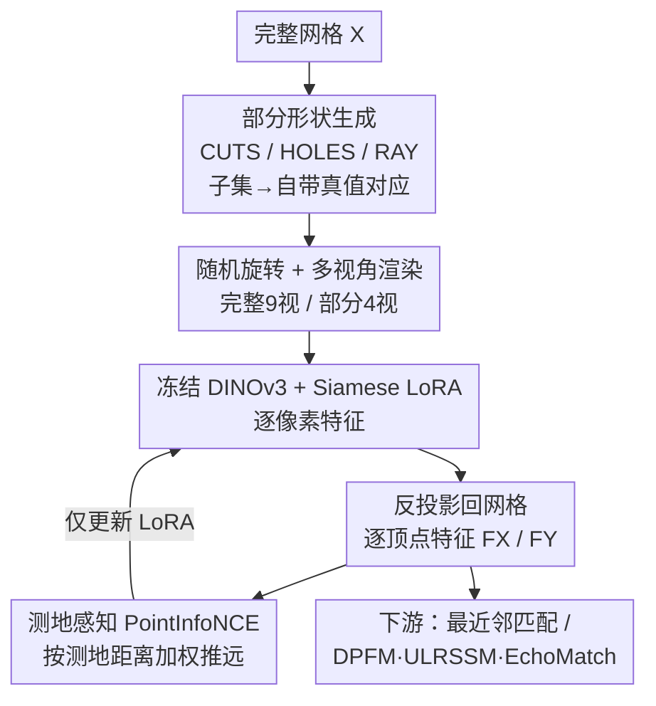

# Teaching DINOv3 About Partial 3D Geometry: A Self-Supervised Geometry-Aware Approach

**会议**: CVPR 2026  
**论文**: [CVF Open Access](https://openaccess.thecvf.com/content/CVPR2026/html/Ehm_Teaching_DINOv3_About_Partial_3D_Geometry_A_Self-Supervised_Geometry-Aware_Approach_CVPR_2026_paper.html)  
**代码**: https://github.com/vikiehm/geo-lora  
**领域**: 自监督 / 3D视觉  
**关键词**: 自监督学习, 视觉基础模型, LoRA微调, 部分形状匹配, 测地约束

## 一句话总结
本文提出 GeoLoRA：用合成的「完整形状↔部分形状」配对作自监督信号，在冻结的 DINOv3 上挂一个共享权重的 LoRA 模块，配合一个带测地距离加权的 PointInfoNCE 对比损失，把 3D 几何感注入 2D 基础特征，从而在部分形状匹配（partial-to-full / partial-to-partial）和左右手性判别上拿到 SOTA。

## 研究背景与动机
**领域现状**：在 3D 可变形物体之间找稠密对应（dense correspondence）是形状分析的基础环节。传统做法依赖手工描述子（HKS、WKS、SHOT）或函数映射（functional maps）；近两年则越来越多地把 DINO 这类视觉基础模型（VFM）的特征当作输入，因为它们在大规模图像上自监督训练，能跨形变、跨身份地刻画点的语义。

**现有痛点**：当形状只是**部分观测**（遮挡、扫描噪声、重建缺失）时，这些方法都吃力。手工描述子建立在「水密网格、相同拓扑」等理论前提上，对部分形状的边界很脆弱；坐标类特征又强烈依赖形状的空间对齐位置。而 DINO 系列虽然语义不错，却**对 3D 几何理解有限**——常出现「左右搞反」、遮挡/去遮挡混淆这类几何性错误，哪怕是最新的 DINOv3 也照犯不误。

**核心矛盾**：基础模型只在单视角 2D 图像上训练，缺乏真正的 3D grounding；想要让它「懂几何」，就得把 3D 信息直接喂进训练过程。但从零训练一个 3D 基础模型需要海量数据和算力，不现实。

**本文目标**：在不重训基础模型的前提下，给已有的 2D 基础特征「补课」3D 几何感，专门服务于部分形状的匹配。

**切入角度**：作者的关键观察是——只要从**完整形状**出发，用程序化方式切出**部分形状**，那么这一对天然就有已知的 3D 对应关系（部分是完整的子集）。这等于免费拿到了监督信号，无需任何人工标注。

**核心 idea**：用「合成部分形状 + 已知对应」自监督地训练一个轻量 LoRA 适配器，把完整与部分两侧的渲染特征对齐；并在对比损失里引入**测地距离加权**，让几何远的负样本被推得更狠，从而把表面几何这一强先验灌进特征。

## 方法详解

### 整体框架
GeoLoRA 整条流水线只训练一个挂在冻结 DINOv3 上的 LoRA 模块，目标是让「同一物体的部分观测」与「完整观测」在特征空间里对齐。给定一个完整网格 $X$，先用三选一的程序生成它的部分版本 $Y$（CUTS/HOLES/RAY），由于 $Y$ 是 $X$ 的子集，二者天然有真值对应 $\Pi_{YX}$。随后对两个形状各自做随机绕 Y 轴旋转、围绕物体采多个相机渲染多视图图像，逐图过「冻结 DINOv3 + 共享权重 LoRA」得到逐像素特征，再反投影回网格、对所有看到该顶点的像素取平均，得到逐顶点特征 $F_X$、$F_Y$。最后用一个测地感知的 PointInfoNCE 对比损失，把对应顶点拉近、按测地距离把其余顶点推远，反向更新 LoRA。推理时直接用这套特征做最近邻匹配，或喂给现成的匹配 pipeline（DPFM / ULRSSM / EchoMatch）当输入特征。

### 关键设计

**1. 合成部分形状构造自监督信号：从完整切出部分，免费拿到真值对应**

部分形状匹配最大的障碍是缺监督——真实部分扫描很难拿到稠密对应标注。作者绕开这点：从一个完整形状 $X=(V_X, T_X)$ 出发，随机挑一种方式切出部分形状 $Y=(V_Y, T_Y)$。三种切法各模拟一类真实缺失：**CUTS** 用一个过中心的随机平面把形状切掉一半；**HOLES** 随机挑若干区域、按随机半径挖洞（模拟侵蚀/局部重建错误）；**RAY** 模拟从某个随机相机视角看过去的部分可见性（模拟单视角观测的遮挡）。由于这三种切法都保证 $V_Y \subset V_X$、$T_Y \subset T_X$，部分形状永远是完整形状的子集，于是顶点间的真值对应 $\Pi_{YX} \in \mathbb{R}^{|V_Y|\times|V_X|}$ 完全已知。这一步是整套自监督的根基——所有监督都来自「子集关系」这个几何事实，不需要任何人工标注，也只用合成数据。

值得一提的是训练时完整与部分形状处于**同一姿态**，乍看与「最终要解非刚性匹配」矛盾，但作者认为这恰好就是 backbone 该学会的任务：在观测到一块残缺几何时，还原它「仿佛属于一个完整几何」的语义。

**2. Siamese LoRA + 多视渲染反投影：只动 0.x% 参数就给基础模型「补」3D 几何**

直接微调整个 DINOv3 计算开销大、还会破坏其通用语义。作者把 DINOv3（ViT-B/16）**冻结**，只在所有注意力层挂上 LoRA 模块（秩 $r=16$，缩放因子 $\alpha=32$），并以 **siamese** 方式让完整侧与部分侧**共享同一份 LoRA 权重**。这样可训练参数极少，又能让两侧特征在同一适配空间里被对齐。

特征是从图像端来、再回到网格端的：对完整形状 $X$ 随机绕 Y 轴旋转后采 $N$ 个相机，每个相机渲一张 $512\times512\times3$ 的图，过 DINOv3+LoRA 得到逐像素特征 $Q^i_X \in \mathbb{R}^{512\times512\times768}$；把所有视图里观测到某顶点的像素特征做平均，反投影成逐顶点特征 $F_X \in \mathbb{R}^{|V_X|\times768}$。部分形状 $Y$ 同理得到 $F_Y$。训练时完整用 9 视、部分用 4 视以保证效率；推理时升到 49 视换取更稳的特征。多视图聚合 + 反投影让 2D patch 特征获得了 3D 表面上的一致表达，是把「2D 模型」接到「3D 几何」上的桥。

**3. 测地感知 PointInfoNCE：按表面距离加权地推远负样本，灌入几何先验**

光有对齐目标还不够。常规 PointInfoNCE 对比损失（式 1）把所有不匹配一视同仁地惩罚：

$$\mathcal{L}_{NCE} = -\sum_{(v_i,v_j)\in GT}\log\frac{\exp(F^i_Y\cdot F^j_X/\tau)}{\sum_{v_k\in V_Y}\exp(F^k_Y\cdot F^j_X/\tau)}$$

分子把对应顶点拉近，分母把其余顶点推远防止特征塌缩。但它的问题在于——把「错配到旁边一点点」和「错配到对侧肢体」惩罚得一样重，完全不考虑错误的严重程度。作者的修正是给分母里的每个负样本乘上一个测地距离权重：用完整形状上的测地距离矩阵 $D_X$（$D^{jk}_X$ 是顶点 $v_j,v_k$ 沿表面的距离，部分顶点借已知对应索引到 $X$ 上），得到

$$\mathcal{L} = -\sum_{(v_i,v_j)\in GT}\log\frac{\exp(F^i_Y\cdot F^j_X/\tau)}{\sum_{v_k\in V_Y}\exp\big((D^{jk}_X+0.5)\cdot F^k_Y\cdot F^j_X/\tau\big)}$$

测地距离越大的负样本权重越大、被推得越狠（$+0.5$ 的偏移是为了让权重范围与原始损失「分母乘 1」时相近）。这条几何线索专治基础模型的老毛病：表面上离得很远、但在 2D 图像里看着对称的点（如左右肢体），会被显式地推开。实验也印证了它在左右手性判别和测地误差上的提升。

### 一个完整示例
以一个 BECOS 里的完整人体网格 $X$ 为例走一遍训练：① 随机抽中 RAY 方式，模拟从某随机相机看过去，得到一个缺了背面与部分手臂的部分人体 $Y$，并记录 $Y$ 每个顶点对应到 $X$ 的哪个顶点；② 把 $X$、$Y$ 各随机绕 Y 轴转个角度，围绕 $X$ 采 9 个相机、围绕 $Y$ 采 4 个相机，渲出多张 $512^2$ 图；③ 每张图过冻结 DINOv3 + 共享 LoRA，得到逐像素 768 维特征，反投影平均成顶点特征 $F_X$、$F_Y$；④ 对每个真值对应对 $(v_i^Y, v_j^X)$ 算测地加权 PointInfoNCE：把 $F^i_Y$ 与 $F^j_X$ 拉近，同时把 $Y$ 上其它顶点按它们在 $X$ 表面上离 $v_j$ 的测地距离加权推远——离得越远推得越狠；⑤ 梯度只更新 LoRA。一个 batch 里每个完整形状会生成两个部分观测，整体训 5 万次迭代。

### 损失函数 / 训练策略
核心损失即上面的测地感知 PointInfoNCE（式 2），$\tau$ 为温度超参。骨干 DINOv3 ViT-B/16 全程冻结，LoRA 插入所有注意力层（$r=16$, $\alpha=32$），训练 9 视/部分 4 视、推理 49 视，每 batch 每个完整形状生成 2 个部分观测，共训练 50,000 次迭代（A40 GPU）。

## 实验关键数据

### 主实验
原始特征匹配质量（最近邻 L2，平均测地误差 $\times100$，越低越好；GeoLoRA 与 DINOv2/v3 均用 49 视）：

| 设置 | 数据集 | DINOv3(次优) | GeoLoRA | 说明 |
|------|--------|--------------|---------|------|
| P2F | BECOS | 19.95 | **5.57** | 最难数据集，降幅最大 |
| P2F | SHREC16 CUTS | 21.25 | **10.86** | — |
| P2F | PFAUST-H | 13.82 | **3.33** | 高难度挖洞 |
| P2P | BECOS | 16.84 | **6.72** | 未针对 P2P 训练仍大幅领先 |
| P2P | PSMAL | 18.64 | **6.85** | 非等距动物形状 |

集成进下游 SOTA 匹配 pipeline（部分-完整，测地误差 $\times100$，括号为 ULRSSM 测试时自适应后）：

| 数据集 | 特征 | ULRSSM | DPFM |
|--------|------|--------|------|
| SHREC16 CUTS | DINOv3 | 5.94 (4.30) | 10.78 |
| SHREC16 CUTS | GeoLoRA | **3.01 (1.97)** | **6.57** |
| PFAUST-H | DINOv3 | 5.19 (5.22) | 6.46 |
| PFAUST-H | GeoLoRA | **2.29 (2.19)** | **5.66** |

部分-部分匹配（EchoMatch / DPFM，测地误差 + mIoU）上，BECOS 的 EchoMatch 误差从 9.74→**5.55**、mIoU 67.07→**71.27**；PSMAL 误差 5.56→**4.33**、mIoU 82.75→**85.41**。

### 消融实验

| 配置 | 关键指标 | 说明 |
|------|---------|------|
| 视图数 16→49→100 | Geo Err 25.47→20.09→20.00 | 误差早早饱和、时间线性增长，49 视为性价比甜点 |
| PointInfoNCE | Err 11.29 | 普通对比损失 |
| GeoLoRA(测地加权) | **Err 5.89** | 几何加权近乎腰斩误差 |
| 手性: DINOv3 | Acc 70.45 | 原始基础特征 |
| 手性: PointInfoNCE | Acc 84.09 | 仅 LoRA 对齐 |
| 手性: GeoLoRA | **Acc 91.42** | 加测地加权再涨 7+ 点 |

### 关键发现
- **测地加权是核心增益来源**：BECOS 验证集上把普通 PointInfoNCE 的 11.29 误差降到 5.89，几乎减半，证明「按表面距离加权推远」比单纯对齐重要得多。
- **左右手性大幅改善**：手性准确率从 DINOv3 的 70.45% 一路提到 91.42%，说明几何先验确实修好了基础模型「左右不分」的顽疾，作者据此提出 partial-to-full 匹配可作为提升基础模型几何理解的辅助任务。
- **泛化性**：未针对 partial-to-partial 训练，特征却照样在该设置上领先 DINOv3，且能无缝替换进现成匹配 pipeline。
- **少数不增益场景**：在 CP2P24 上，因下游是有监督方法、监督本身已足够强，换更好的特征收益不明显；BECOS 经 ULRSSM/DPFM 的 functional map 后误差反高于直接用 GeoLoRA，作者归因于 BECOS 形状未归一化导致斜对角比例预测偏差，以及 raycasting 产生大量边界损害 functional map 质量。

## 亮点与洞察
- **「子集即监督」的巧思**：从完整形状切出部分，对应关系自动已知——把一个缺标注的难题转成完全自监督，只用合成数据，零人工标注，这是全文最优雅的一步。
- **测地加权对比损失可复用**：把「负样本权重 ∝ 表面测地距离」这一思路推广到任何带几何/结构先验的对比学习任务（如点云配准、网格分割），都能让模型「按错误严重程度」而非「一刀切」地惩罚。
- **LoRA 给基础模型补领域知识**：不重训、不破坏通用语义，只挂极少参数就把 3D 几何感注入 2D VFM，是「基础模型 + 轻量适配补短板」范式在 3D 上的一个干净示范。
- **副产物——手性判别**：把部分-完整匹配当辅助任务，竟显著改善了基础模型的左右辨别，暗示几何监督能反哺基础特征的结构理解。

## 局限与展望
- **作者承认的局限**：方法继承了 DINOv3 在自然图像上预训练带来的「正立朝向」偏置——虽然在倒置姿态上仍优于 DINOv3，但两者相比正立形状都明显掉点。
- **依赖合成的部分化程序**：CUTS/HOLES/RAY 三种合成缺失是否覆盖真实扫描的缺失分布存疑；RAY 产生的大量边界会拖累下游 functional map（已在 BECOS 上观察到）。
- **范围限定**：当前聚焦非刚性、无纹理的 3D 形状（人/动物），尚未处理外部杂物（clutter）和人造物体；作者将其列为未来扩展方向。
- **可改进方向**：可探索把测地加权对比损失与 functional map 框架联合优化，或在训练里引入更贴近真实传感器的缺失模型以缩小合成-真实差距。

## 相关工作与启发
- **vs DINOv3/DINOv2 原始特征**：本文不止把基础特征当输入，而是首次把部分形状的 3D 信息注入基础模型；原始 DINOv3 在部分形状上有几何混淆（左右/遮挡），GeoLoRA 通过 LoRA + 测地损失针对性修复。
- **vs Diff3f [19]**：Diff3f 同样用多视渲染 + 基础特征反投影做形状匹配，但仍是纯 2D 特征、无 3D 几何监督；本文沿用其多视采样思路，额外加入合成部分对 + 测地加权自监督。
- **vs PointContrast / PointInfoNCE [61]**：PointInfoNCE 为刚性静态场景点云预训练设计、对负样本一视同仁；本文把它改造为测地加权版本，并面向非刚性、部分、无纹理形状。
- **vs DPFM / ULRSSM / EchoMatch**：这些是下游匹配 pipeline，本文不与之竞争而是作为更好的输入特征插入，普遍带来误差下降与 mIoU 提升。

## 评分
- 新颖性: ⭐⭐⭐⭐⭐ 首个把 3D 几何感经自监督 LoRA 注入基础模型、服务部分非刚性形状匹配的工作，「子集即监督 + 测地加权对比」组合巧妙
- 实验充分度: ⭐⭐⭐⭐⭐ 覆盖 P2F/P2P 多数据集、集成多 SOTA pipeline、手性/真实扫描应用、视图数与损失消融齐全
- 写作质量: ⭐⭐⭐⭐ 动机与方法叙述清晰，pipeline 图直观；部分符号细节需查补充材料
- 价值: ⭐⭐⭐⭐⭐ 在多项部分形状匹配 benchmark 刷新 SOTA，且特征即插即用，对 3D 形状分析社区实用性强

<!-- RELATED:START -->

## 相关论文

- [\[ICCV 2025\] WIR3D: Visually-Informed and Geometry-Aware 3D Shape Abstraction](../../ICCV2025/self_supervised/wir3d_visually-informed_and_geometry-aware_3d_shape_abstraction.md)
- [\[CVPR 2026\] Geometry-driven OOD Detectors Are Class-Incremental Learners](geometry-driven_ood_detectors_are_class-incremental_learners.md)
- [\[CVPR 2026\] Reframing Long-Tailed Learning via Loss Landscape Geometry](reframing_long-tailed_learning_via_loss_landscape_geometry.md)
- [\[CVPR 2026\] Stabilizing Feature Geometry in Noisy Pretrained Models for Robust Downstream Tasks](stabilizing_feature_geometry_in_noisy_pretrained_models_for_robust_downstream_ta.md)
- [\[CVPR 2026\] UniRefiner: Teaching Pre-trained ViTs to Self-Dispose Dross via Contrastive Register](unirefiner_teaching_pre-trained_vits_to_self-dispose_dross_via_contrastive_regis.md)

<!-- RELATED:END -->
