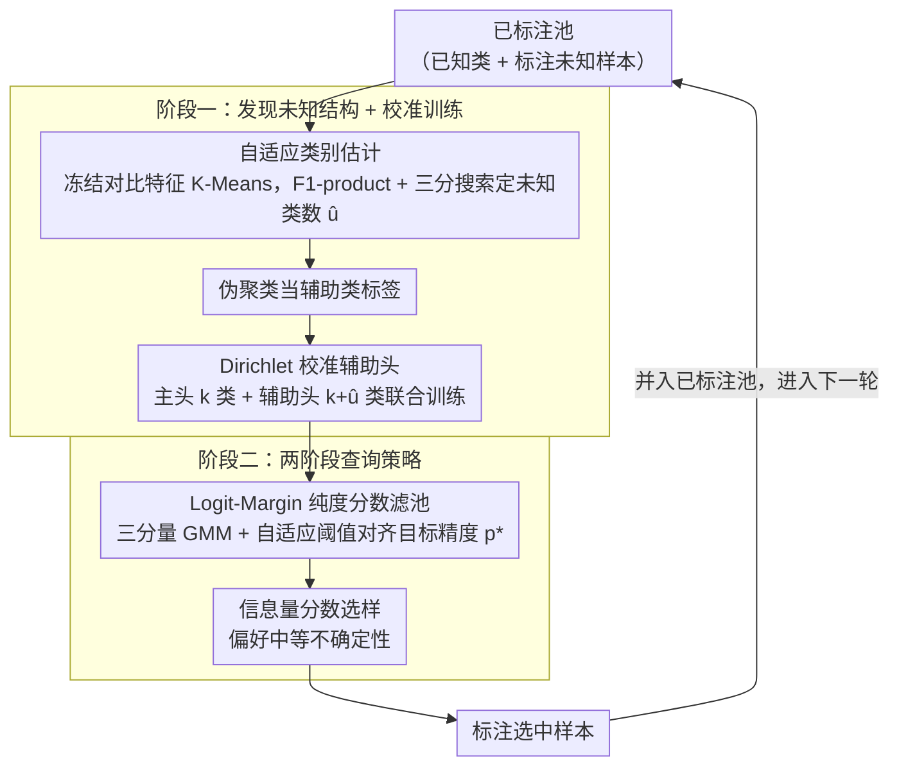

# Revisiting Unknowns: Towards Effective and Efficient Open-Set Active Learning

**会议**: CVPR2026  
**arXiv**: [2603.07898](https://arxiv.org/abs/2603.07898)  
**代码**: [github.com/chenchenzong/E2OAL](https://github.com/chenchenzong/E2OAL)  
**领域**: 社会计算  
**关键词**: open-set active learning, Dirichlet calibration, unknown class exploitation, adaptive querying, detector-free

## 一句话总结

提出 E2OAL，一个无需额外检测器的开放集主动学习框架，通过标签引导聚类发现未知类潜在结构、Dirichlet 校准辅助头联合建模已知/未知类别，并设计两阶段自适应查询策略，在多个基准上同时实现高准确率、高查询纯度和高训练效率。

## 背景与动机

1. **主动学习的闭集假设不成立**：传统主动学习假设未标注池中所有样本属于已知类别，但在自动驾驶、医学诊断等安全关键场景中，未标注数据常包含未见过的类别
2. **未知样本"污染"查询**：常规 AL 策略（基于不确定性/多样性）容易将未知类样本误判为高信息量样本而过度采样，严重降低学习效率
3. **现有 OSAL 依赖独立训练的检测器**：LfOSA、MQNet、EOAL、BUAL、EAOA 等方法需额外训练 OOD 检测网络，引入显著的计算开销
4. **标注的未知样本被浪费**：已有方法忽视了被标注为"unknown"的样本所蕴含的监督价值，未能将其反馈至已知类学习中
5. **未知类内部存在潜在结构**：pilot study 表明，利用未知类的真实标签（保持其内部类别结构）训练比简单合并为单一"unknown"类效果更好
6. **Softmax 过度自信问题**：标准 softmax 具有平移不变性，对语义模糊或异常输入产生误导性高置信度，不利于开放集条件下的置信度估计

## 方法详解

### 整体框架

E2OAL 想做一个"不挂额外检测器"的开放集主动学习框架，同时还要把以往被当成废料的"标注未知样本"利用起来。它走两个阶段：第一阶段在冻结的对比学习特征空间里把未知类的潜在结构挖出来，并用 Dirichlet 校准的辅助监督把模型训得置信度更可靠；第二阶段做查询选择——先用纯度分数滤出一池"大概率是已知类"的高纯度候选，再在池内用信息量指标挑出最值得标注的样本。每一轮主动学习都重复这两阶段，标注后的样本回流到已标注池里。

### 关键设计

**1. 自适应类别估计：不靠检测器，从聚类里"数出"未知类有几种**

把所有未知样本合并成单一 "unknown" 类会丢掉它们内部的结构，而 pilot study 显示保留这种结构来训练效果更好——可问题是未知类到底有几种，事先并不知道。E2OAL 用冻结的 CLIP 特征（也兼容 MoCo/SimCLR）对全部已标注样本做 K-Means，候选未知类数量 $\hat{u} \in \{k+1, \ldots, \hat{u}_{\max}\}$ 通过三分搜索来定，目标是最大化一个结构感知的 F1-product。

F1-product 是各类 F1 分数的乘积，先用 Hungarian 算法把聚类与 $k$ 个已知类加 1 个统一 unknown 类做一对一匹配再算。它的妙处在于天然惩罚两种极端：$\hat{u}$ 估低了会把不同已知类挤进一簇、估高了会把一类碎成几簇，两种情况都会拉低某些类的 F1、进而压低乘积，于是搜索自然收敛到合理的类别数。

**2. Dirichlet 校准辅助头：治标准 softmax 的"平移不变 → 过度自信"**

标准 softmax 有平移不变性，对语义模糊或异常输入也能给出误导性的高置信度，这在开放集下尤其致命。E2OAL 先把 softmax 改成平移感知版 $P(y|x) = \frac{e^{o_y} + \gamma}{\sum_c (e^{o_c} + \gamma)}$，用常数 $\gamma$ 打破平移不变；再上证据深度学习（EDL），把预测概率建模成 Dirichlet 分布 $\text{Dir}(\boldsymbol{\alpha})$，其中 $\boldsymbol{\alpha} = g(\boldsymbol{o})/\gamma + 1$。

关键是主辅两个头分工：辅助头覆盖 $k + \hat{u}$ 个类别（已知类加上一阶段估出的未知类），负责把未知样本的监督价值吸收进来；主头只覆盖 $k$ 个已知类、做最终分类。这样"标注的未知"不再被浪费，又不会污染主分类器的类别空间。

**3. 两阶段查询策略：先按纯度滤池、再按信息量挑样，且阈值自适应**

常规不确定性/多样性查询会把未知样本误当成高信息量样本疯狂采样，污染查询、拖垮效率。E2OAL 把"该不该选"拆成两步。第一步用 Logit-Margin 纯度分数衡量已知与未知证据的分离程度，滤出高纯度候选池：

$$S_{\text{purity}}(x) = \max_{c \in \mathcal{C}_k} o_c - \max_{c \in \mathcal{C}_{\hat{u}}} o_c$$

第二步在池内用一个 OSAL 专用的信息量分数挑样，它同时压制过于模糊（接近均匀分布）和过于确定（接近 one-hot）的样本、偏好中等不确定性：

$$S_{\text{info}}(x) = \text{JS}(\mathbf{p} \| \mathbf{u}) \cdot \text{JS}(\mathbf{p} \| \mathbf{p}^{\max})$$

纯度阈值还会自适应：用三分量 GMM 拟合纯度分数分布来动态调候选池大小、对齐目标查询精度 $p^*$，并按观测精度反馈校准 $\hat{p}^*_{t+1} = \text{clip}(\hat{p}^*_t + (p^* - \bar{p}^*_t), 0, 1)$。先纯度、后信息量、再自适应阈值，三道一起把"误采未知"压下去，且全程不引入额外可调超参。

### 损失函数 / 训练策略

总损失把主头分类和辅助头的证据学习加在一起：

$$\mathcal{L} = \mathcal{L}_{\text{CE}} + \mathcal{L}_{\text{EDL}} = \mathcal{L}_{\text{CE}} + (\mathcal{L}_{\text{NLL}} + \mathcal{L}_{\text{KL}})$$

- $\mathcal{L}_{\text{CE}}$：主头的交叉熵损失，仅在已知类上优化
- $\mathcal{L}_{\text{NLL}}$：辅助头的负对数似然，鼓励对正确标签的高置信
- $\mathcal{L}_{\text{KL}}$：将错误类别的 Dirichlet 分布正则化至均匀先验，抑制错误证据

## 实验关键数据

### 主实验

在 CIFAR-10、CIFAR-100、Tiny-ImageNet 上评估，使用 ResNet-50 骨干，10 轮主动学习，每轮查询 1500 样本。

| 方法 | CIFAR-10 (30%) | CIFAR-100 (30%) | Tiny-ImageNet (15%) |
|------|:-:|:-:|:-:|
| **E2OAL (Ours)** | **最优** | **最优** | **最优** |
| Ours* (无未知类利用) | 95.94 | 67.54 | 60.44 |
| EAOA | 95.88 | 67.14 | 57.31 |
| BUAL | 95.04 | 63.73 | 56.09 |
| EOAL | 93.64 | 63.69 | 56.13 |

即使不利用标注的未知样本（Ours*），仅靠查询策略仍优于所有基线，尤其在 Tiny-ImageNet 上提升 3+ 百分点。

### 消融实验

| 变体 | CIFAR-10 | CIFAR-100 | Tiny-ImageNet |
|------|:-:|:-:|:-:|
| **完整 E2OAL** | **97.52** | **72.10** | **64.02** |
| w/o ClassExp（未知类合并为单一类） | 97.17 | 70.73 | 62.67 |
| 仅 $S_{\text{purity}}$ | 96.73 | 72.00 | 61.93 |
| 仅 $S_{\text{info}}$ | 96.00 | 68.20 | 57.60 |

- Dirichlet 校准（EDL）比 CE 在纯度上显著提升：CIFAR-10 9495 vs 9394（总查询已知类样本数）
- 信息量指标优于 EAOA：CIFAR-100 65.73 vs 61.95
- 对目标精度 $p^*$ 不敏感：$p^* \in \{0.4, 0.5, 0.6, 0.7\}$ 下性能波动小

### 训练效率

E2OAL 的等效训练时间与 Random、MSP、Coreset、Uncertainty 等轻量基线相当，去除独立检测器后仅有边际额外成本。

## 亮点

- **无检测器设计**：不需要额外训练 OOD 检测网络，统一框架内同时完成未知类发现、校准训练和查询选择
- **变废为宝**：首次系统性地将标注的未知样本转化为有效监督信号，pilot study 清晰展示了保留未知类内部结构的收益
- **原则性校准**：Dirichlet-based EDL 提供理论上更合理的置信度估计，解决 softmax 平移不变性导致的过度自信问题
- **自适应无超参**：两阶段查询策略通过观测反馈动态调整纯度阈值，无需额外超参数调优
- **全面实验**：覆盖三个数据集、多个 mismatch ratio、多种消融，代码开源

## 局限与展望

- 仅在图像分类上验证，未扩展到检测/分割等更复杂的视觉任务
- 聚类依赖冻结的预训练特征（CLIP/MoCo），在预训练分布与目标域差异大时可能失效
- F1-product 目标在类别数极不均衡时可能对少数类过于敏感
- 三分量 GMM 假设纯度分数的分布结构，在极端 mismatch ratio 下可能不够鲁棒
- 未探讨在线/增量场景下的持续学习适配

## 与相关工作的对比

| 方法 | 是否需要检测器 | 是否利用标注未知 | 自适应精度控制 | 校准机制 |
|------|:-:|:-:|:-:|:-:|
| LfOSA | ✓ | ✗ | ✗ | — |
| MQNet | ✓ (meta-net) | ✗ | ✗ | — |
| EOAL | ✓ | ✗ | ✗ | — |
| BUAL | ✓ | ✗ | ✗ | — |
| EAOA | ✓ | ✗ | ✓ (固定步长) | — |
| **E2OAL** | **✗** | **✓** | **✓ (自适应)** | **Dirichlet EDL** |

## 评分

- 新颖性: ⭐⭐⭐⭐ — 将标注未知样本从"废料"转化为监督信号的思路新颖，Dirichlet 校准与两阶段查询的结合设计精巧
- 实验充分度: ⭐⭐⭐⭐ — 三数据集 × 多 mismatch ratio × 完整消融 + 效率分析 + 敏感性分析，覆盖全面
- 写作质量: ⭐⭐⭐⭐ — 结构清晰，pilot study 动机自然，公式推导连贯
- 价值: ⭐⭐⭐⭐ — 为开放集主动学习提供了统一高效的解决方案，代码开源，实用性强

<!-- RELATED:START -->

## 相关论文

- [\[CVPR 2026\] Instance-level Visual Active Tracking with Occlusion-Aware Planning](instance-level_visual_active_tracking_with_occlusion-aware_planning.md)
- [\[AAAI 2026\] Bias Association Discovery Framework for Open-Ended LLM Generations](../../AAAI2026/social_computing/bias_association_discovery_framework_for_open-ended_llm_generations.md)
- [\[NeurIPS 2025\] Active Slice Discovery in Large Language Models](../../NeurIPS2025/social_computing/active_slice_discovery_in_large_language_models.md)
- [\[ACL 2026\] Building Arabic NLP from the Ground Up: Twenty Years of Lessons, Failures, and Open Problems](../../ACL2026/social_computing/building_arabic_nlp_from_the_ground_up_twenty_years_of_lessons_failures_and_open.md)
- [\[ICCV 2025\] Learning Visual Proxy for Compositional Zero-Shot Learning](../../ICCV2025/social_computing/learning_visual_proxy_for_compositional_zero-shot_learning.md)

<!-- RELATED:END -->
