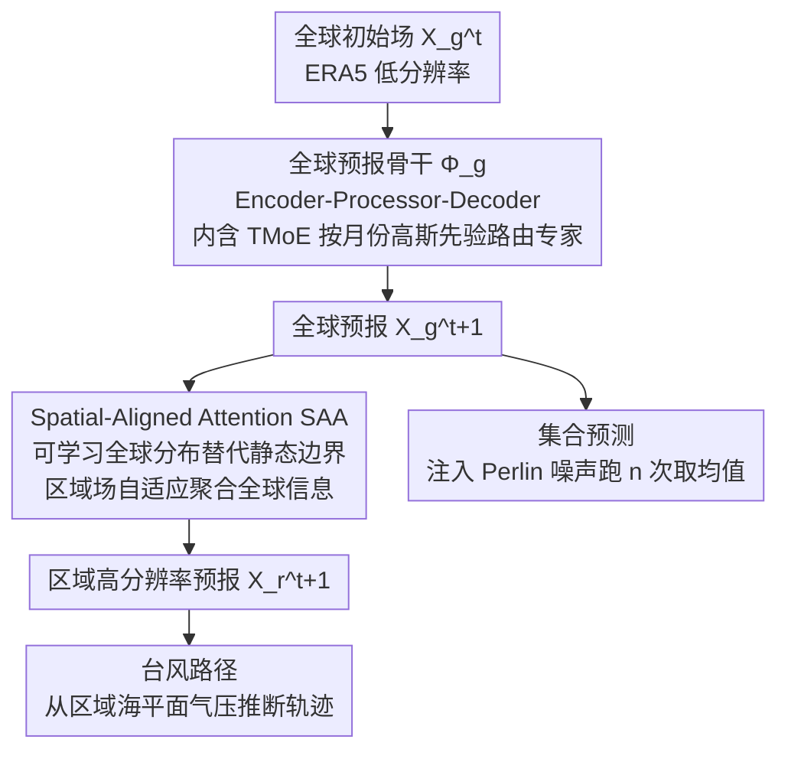

# STCast: Adaptive Boundary Alignment for Global and Regional Weather Forecasting

**会议**: CVPR 2026  
**arXiv**: [2509.25210](https://arxiv.org/abs/2509.25210)  
**代码**: 无  
**领域**: 时空预测 / 气象预报  
**关键词**: weather forecasting, spatial-aligned attention, temporal MoE, global-regional coupling, adaptive boundary  

## 一句话总结

提出STCast框架，通过Spatial-Aligned Attention（SAA）用可学习的全球-区域分布替代静态边界来自适应融合全球大气信息到区域预报，并用Temporal Mixture-of-Experts（TMoE）按月动态路由专家增强时序建模，在全球预报、高分辨率区域预报、台风路径预测和集合预测四个任务上全面超越现有方法。

## 研究背景与动机

**精确的区域天气预报**需要全球大气动力学的支持——西伯利亚冷涌能触发东亚寒潮，青藏高原地表加热能同时改变东亚季风和北美急流。因此区域预报的真正"边界"不是邻近区域，而是整个地球。

**现有方法的痛点**：传统NWP方法通过求解PDE在精细网格上预报，计算成本极高。数据驱动方法（如Pangu-Weather、GraphCast）大幅降低了成本，但面临两个核心问题：（1）直接训练高分辨率（~1km, 0.01°）全球模型在计算上不可行（需要19980×39960的网格）；（2）现有的全球-区域耦合方法仅使用**静态的邻近区域**作为边界——如OneForecast直接拼接邻域裁剪，违背了大气-海洋-陆地-生物圈耦合理论。

**STCast的核心创新**：（1）用可学习的全球-区域分布替代静态邻域边界，基于大圆距离初始化、在训练中自适应优化；（2）用月份特异的高斯先验引导MoE专家路由，显式建模不同月份的大气变化特征。

## 方法详解

### 整体框架

STCast要解决的核心矛盾是：高分辨率区域预报离不开全球大气动力学的支撑，但直接训练一个高分辨率全球模型（~1km、0.01°，对应近 20000×40000 的网格）在算力上根本跑不通。它的应对是把任务拆成一条耦合链路——先用一个骨干网络在低分辨率上做全球预报，再让区域模型通过 SAA 把全球场的信息自适应地"借"进来做高分辨率区域预报，进而从区域预报的海平面气压推断台风路径，最后向全球初始场注入 Perlin 噪声、多次模拟取均值得到集合预测。骨干采用 Encoder-Processor-Decoder 结构，Processor 交替使用窗口注意力和自注意力来兼顾局部细节和全局关联。四个任务形式上不同，但都建立在同一套全球—区域—时序耦合表征之上：全球预报记作 $X_g^{t+1} = \Phi_g(X_g^t)$，区域预报记作 $X_r^{t+1} = \Phi_r(X_r^t, X_g^t)$，后两个任务则是在这两步输出上的衍生应用。

### 关键设计

**1. Spatial-Aligned Attention（SAA）：用可学习的全球分布替代静态邻域边界**

区域预报真正的"边界"不是邻近区域，而是整个地球——西伯利亚冷涌能触发东亚寒潮，青藏高原加热能同时改变东亚季风和北美急流。可像 OneForecast 那样直接拼接邻域裁剪的做法把边界写死成静态的几块邻区，既丢掉了远程遥相关，又违背了大气—海洋—陆地—生物圈的耦合事实。SAA 把这层耦合做成一次交叉注意力：以全球特征作 Query 和 Key、区域特征作 Value，让区域场主动从全球场里聚合相关信息。

关键在于注意力权重不是从零学起，而是被一个物理先验初始化并调制。对每个全球网格点先算它到目标区域的大圆距离 $d(\phi,\lambda)$，再用指数衰减 $f(\phi,\lambda)=\exp(-\alpha\cdot d^2)$ 构造一张全球—区域分布图，通过 Hadamard 积乘到注意力权重上：

$$f(\phi,\lambda)=\exp\!\big(-\alpha\cdot d(\phi,\lambda)^2\big)$$

这条先验编码了"大气影响随距离衰减但不归零"的直觉，让模型一开始就偏向近处、又不至于切断远程联系；训练中这张分布持续被优化，于是模型能学到超出纯距离衰减的长程遥相关。为了让"整个地球当边界"在算力上可行，SAA 用 $O(n)$ 线性注意力而非标准 $O(n^2)$ 注意力来算这次聚合。

**2. Temporal Mixture-of-Experts（TMoE）：用月份高斯先验显式划分专家分工**

大气变量在不同月份差异巨大（夏季对流 vs 冬季辐射），但标准 MoE 让路由器隐式去学时间模式时，专家容易同质化、学不出这种时序特异性。TMoE 的做法是给每个月显式配一个离散高斯分布，分布峰值按输入变量所属月份旋转对齐，从而保证"离当前月份越远的月份、激活概率单调越低"。具体路由时，把月份 embedding $M\in\mathbb{R}^{12\times1}$ 直接加到由输入特征算出的路由 logits 上，再经 softmax 选 Top-K 专家：

$$I=\text{Softmax}\big(\text{Conv}(X^t)+M\big)$$

相比隐式 MoE，这个 $M$ 等于把"现在是几月"作为一个清晰的分工信号直接喂给路由器，是低成本、高回报地逼出按月专精的专家组合。

**3. 统一四任务框架：四个任务共享同一套耦合表征**

前面两个设计落在全球预报和区域预报两步主干上，而台风路径和集合预测则是在这条链路输出上的直接衍生：台风路径不另起炉灶，而是从区域预报得到的海平面气压场里推断移动轨迹；集合预测则向全球初始态 $X_g^t$ 注入 Perlin 噪声、跑 n 次模拟再取均值来刻画不确定性。把四件事压在同一框架里，本质是因为它们都依赖同一套全球—区域—时序耦合表征，复用主干既省算力、又让长程耦合的收益能传导到下游任务。

### 损失函数 / 训练策略

全球和区域模型分别训练，均用 AdamW 优化器，学习率 0.0002，batch size 16，训练 100 epochs。数据来自 ERA5（1979–2019，0.25° 分辨率，721×1440 网格，70 个变量），算力为 16× NVIDIA A100 GPU。

## 实验关键数据

### 主实验

**全球预报（ERA5, 归一化RMSE↓ / ACC↑）**：

| 方法 | 1天RMSE↓ | 4天RMSE↓ | 7天RMSE↓ | 10天RMSE↓ |
|------|---------|---------|---------|----------|
| Pangu-Weather | 0.1571 | 0.3380 | 0.5092 | 0.6215 |
| GraphCast | 0.1304 | 0.2861 | 0.4597 | 0.6009 |
| OneForecast | 0.1231 | 0.2732 | 0.4468 | 0.5918 |
| **STCast** | **0.1197** | **0.2578** | **0.4348** | **0.5763** |

### 消融实验

| 配置 | 关键影响 | 说明 |
|------|---------|------|
| 无SAA（直接拼接邻域） | 区域预报显著下降 | 静态边界不足 |
| 无TMoE（标准MoE） | 时序泛化减弱 | 月份特异性丢失 |
| 距离衰减先验固定不更新 | 性能中等 | 可学习先验更好 |
| 欧氏距离替代Great Circle | 略差 | 球面距离更准确 |

### 关键发现

- SAA的自适应边界在所有区域预报变量上均优于OneForecast的邻域拼接和直接训练策略
- TMoE的月份embedding有效防止了MoE同质化，不同月份的专家学到了不同的大气模式
- STCast在10天长期预报上优势更大（RMSE 0.5763 vs 0.5918），全球-区域耦合对长程预报帮助更大
- 台风路径预测和集合预测也展示了统一框架的泛化能力

## 亮点与洞察

- Great Circle距离+指数衰减初始化的先验设计非常物理直觉——它编码了"大气影响随距离衰减"的基本规律，同时留给模型学习不符合纯距离衰减的遥相关模式的空间。这种"物理先验初始化+数据驱动优化"的范式在其他地球科学应用中也很有复用价值。
- TMoE用离散高斯分布做月份routing——相比让模型隐式学习时间模式，显式提供月份信息是一个低成本高回报的设计。

## 局限与展望

- 区域预报目前仅在东亚验证，其他地理区域（如赤道、极地）的效果待验证
- 不确定性量化仅通过Perlin噪声集合预测实现，缺乏概率校准分析
- 计算成本：16× A100训练100 epochs，对资源受限的研究组仍然较高

## 相关工作与启发

- **vs OneForecast**: 最直接的对比者，OneForecast用邻域拼接做全球-区域耦合，STCast用SAA做自适应分布学习，在所有四个任务上全面优于OneForecast
- **vs GraphCast/FuXi**: 这些方法专注全球预报，STCast通过SAA扩展到高分辨率区域预报，填补了AI气象预报中全球→区域的关键gap

## 评分

- 新颖性: ⭐⭐⭐⭐ SAA的距离衰减先验和TMoE的月份embedding都有很好的物理动机
- 实验充分度: ⭐⭐⭐⭐ 四个任务×多个baseline，消融充分
- 写作质量: ⭐⭐⭐ 框架描述清晰但部分细节隐藏在附录
- 价值: ⭐⭐⭐⭐ 统一四任务且全面SOTA，对AI气象预报社区很有价值

<!-- RELATED:START -->

## 相关论文

- [\[ICCV 2025\] VA-MoE: Variables-Adaptive Mixture of Experts for Incremental Weather Forecasting](../../ICCV2025/time_series/va-moe_variables-adaptive_mixture_of_experts_for_incremental_weather_forecasting.md)
- [\[NeurIPS 2025\] Graph-based Neural Space Weather Forecasting](../../NeurIPS2025/time_series/graph-based_neural_space_weather_forecasting.md)
- [\[ICML 2026\] U-Cast: A Surprisingly Simple and Efficient Frontier Probabilistic AI Weather Forecasting](../../ICML2026/time_series/u-cast_a_surprisingly_simple_and_efficient_frontier_probabilistic_ai_weather_for.md)
- [\[AAAI 2026\] Revitalizing Canonical Pre-Alignment for Irregular Multivariate Time Series Forecasting](../../AAAI2026/time_series/revitalizing_canonical_pre-alignment_for_irregular_multivariate_time_series_fore.md)
- [\[NeurIPS 2025\] DemandCast: Global hourly electricity demand forecasting](../../NeurIPS2025/time_series/demandcast_global_hourly_electricity_demand_forecasting.md)

<!-- RELATED:END -->
