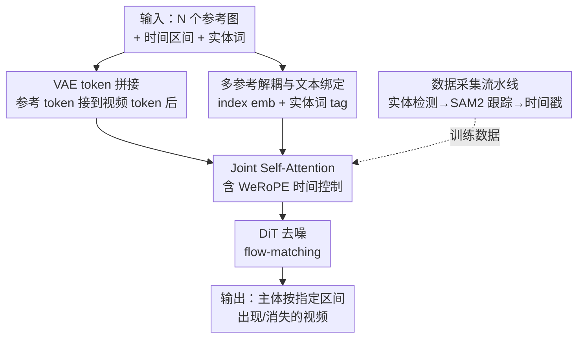

# AlcheMinT: Fine-grained Temporal Control for Multi-Reference Consistent Video Generation

**会议**: CVPR 2026  
**论文**: [CVF Open Access](https://openaccess.thecvf.com/content/CVPR2026/html/Girish_AlcheMinT_Fine-grained_Temporal_Control_for_Multi-Reference_Consistent_Video_Generation_CVPR_2026_paper.html)  
**代码**: 无（项目页 https://snap-research.github.io/Video-AlcheMinT）  
**领域**: 视频生成 / 主体驱动个性化  
**关键词**: 主体到视频生成, 时间戳控制, RoPE, 多参考一致性, DiT

## 一句话总结
AlcheMinT 给主体驱动的视频生成补上了「时间维度」的控制：用同一个 VAE 把参考图直接编码成 token 拼进视频 token 流（不加任何 cross-attention），再用一种加权混合 RoPE 频率的位置编码（WeRoPE）让每个参考主体只在用户指定的时间区间里被视频 token 强烈关注，从而精确控制多个主体在视频中何时出现、何时消失，且视频质量与现有 SOTA 个性化方法持平。

## 研究背景与动机
**领域现状**：大规模扩散视频模型已经能从文本/图像生成高保真视频，并支持姿态、深度、相机、乃至「主体参考」（subject reference）等多种条件——把用户提供的人/脸/物体/背景注入到生成视频里，做个性化内容。主体到视频（Subject-to-Video, S2V）已有 Video Alchemist、SkyReels-A2、Concept Master、MAGREF 等一批工作。

**现有痛点**：这些方法都把参考主体作用于**整段视频**——主体从头到尾连续出现。但真实视频是由不同事件、镜头拼接而成，不同主体在不同时间点登场（广告里 logo 在某秒出现、分镜里角色按脚本进出）。现有 S2V 模型没有直接的「时间步条件」入口，只能靠文本 prompt（如「狗在第 3 秒出现」）去暗示，而当前视频模型根本无法严格遵循这类时间描述，参考机制反而会把生成强行偏向「主体全程在场」。

**核心矛盾**：要做时间控制，既有的时间感知方案又卡在条件机制上。代表作 MiNT 用 ReRoPE 让 attention 具备时间感知，但它要按事件区间长度**重缩放视频 token 的 RoPE**，因此只能处理**不重叠**的事件序列，且与 MM-DiT 式（纯 self-attention）的条件注入不兼容。而多主体场景里参考区间天然会重叠（两个物体需要同时在场），又希望用「token 拼接」这种 MM-DiT 式注入来最大化复用预训练视频先验——两者无法兼得。

**本文目标**：(1) 在不破坏预训练视频模型特征空间的前提下，给每个参考主体加上独立、可重叠的时间区间控制；(2) 用最轻量的方式注入身份，避免额外的 cross-attention 参数；(3) 解决多个同类主体（man/woman）之间的身份混淆；(4) 造数据、立 benchmark。

**切入角度**：RoPE 是相对位置编码，token 间距离越大 attention 分数越衰减——这本身就是一个**天然的、可控的 attention 衰减机制**。如果能让参考 token 的时间频率「居中于区间、向两侧自然衰减」，就能让区间内的视频 token 强烈关注它、区间外平滑淡出。

**核心 idea**：用同一个 VAE 直接编码参考图并 token 拼接做身份注入（零额外参数），再用「区间中点频率 + 两端边缘频率的加权和」构造参考 token 的时间 RoPE（WeRoPE），把时间区间编码进位置频率里，实现可重叠的多主体时间控制。

## 方法详解

### 整体框架
AlcheMinT 建在一个预训练「3D VAE + DiT」的文本到视频骨干上（rectified-flow / flow-matching 训练）。模型输入是 $N$ 组三元组 $[(I_n, [t_0^n, t_1^n], w_n)]_{n=1}^N$：参考图 $I_n$、它该出现的时间区间 $[t_0^n,t_1^n]$、以及描述该主体的实体词 $w_n$（如 dog、man）。整条流水线是：用 **Video-VAE** 把每张参考图编码成与「单个视频 latent 帧」等量的 token，把这些参考 token **序列拼接**到视频 token 之后，进入 DiT 的 Joint Self-Attention 一起处理；在这层 self-attention 里，参考 token 的时间位置不用普通 RoPE，而用 **WeRoPE** 按各自时间区间设定频率，从而把「何时出现」编码进 attention 衰减曲线；同时给每个参考配一个可学习 index embedding 区分身份、并把实体词经文本编码器 + MLP 接进来与视频 caption 做绑定。训练数据则由一条 **实体检测→分割→跟踪** 的 pipeline 自动产出带时间戳的多主体视频对。

### 关键设计

**1. VAE token 拼接做身份注入：丢掉 cross-attention，让参考与视频共享特征空间**

针对「现有方法用 DINO/CLIP/ArcFace 等语义编码器 + IP-Adapter/Q-former/额外 attention 块注入身份，结构复杂、参数翻倍、且不同编码器会漏掉图像的某些属性」这一痛点，作者反其道而行：直接用骨干自带的 **3D VAE** 把参考图编码成 latent token——每张参考图的 token 数与视频里**单个 latent 帧**相同——然后把它们**序列拼接**到视频 token 流末尾，一起送进原有的 spatiotemporal self-attention。这样身份注入**零额外参数**：没有新的 cross-attention 模块，参考 token 和视频 token 落在**同一个 VAE 特征空间**里，天然对齐，因此身份保持比 cross-attention 路线更强（后者受限于编码器类型，常漏掉细粒度属性）。而且 DiT 本就支持可变 token 数，模型可以优雅地接纳任意数量的参考视图。这个「token 拼接」的选择也是后面能做时间控制的前提——既然参考是普通 token，就能通过改它们的 RoPE 频率来调 attention。

**2. WeRoPE：把时间区间编码进 RoPE 频率，实现可重叠、平滑进出的时间控制**

这是全文核心。先看一个朴素方案 MidRoPE：把参考 token 的时间频率设成区间中点 $t_m=(t_0+t_1)/2$，即 $\hat r_{xy}=\mathrm{RoPE}(r,x,y,t_{mid})$。它能让参考居中、向两侧衰减，但**无法控制衰减速率**——区间 $[8,10]$ 和 $[1,17]$ 中点相同，MidRoPE 给出几乎一样的 attention 曲线，于是模型分不清是「短暂出现」还是「几乎全程」。WeRoPE 的解法是把**中点频率**和**两端边缘频率**加权叠加。定义左右边界时间戳 $t_l=t_0/2,\ t_r=(T-t_1)/2$（$T$ 为 latent 帧数），利用 RoPE 的线性性：

$$\hat r_{xy}=R\big(r_{xy},\, w_p\theta_{xy t_{mid}}+w_n(\theta_{xy t_l}+\theta_{xy t_r})\big)=w_p R(r_{xy},\theta_{xy t_{mid}})+w_n\sum_{t_i\in\{t_l,t_r\}}R(r_{xy},\theta_{xy t_i})$$

中点权重 $w_p$ 取正、边缘权重 $w_n$ 取负（论文实测 $w_p=1.67,\ w_n=-0.33$），把多条 RoPE 衰减曲线叠成一条「区间内 attention 高、区间外平滑跌落」的曲线。由于这只改**参考 token** 的频率、不动视频 token 的 RoPE，所以彻底保留了预训练模型的特征空间，且**允许多个参考区间重叠**（各自独立设频率即可），同时兼容 MM-DiT 式纯 self-attention 注入——正好补上 MiNT/ReRoPE「要重缩放视频 RoPE、只能处理不重叠序列」的两个硬限制。效果上区间内主体被强关注、区间外随帧自然淡出淡入，产生主体进出场景的平滑过渡。

**3. 多参考解耦 + 文本绑定：用 index embedding 和实体词 tag 拆开同类主体**

多参考会带来歧义：当 caption 里有两个同类实体（man 与 woman），网络既分不清不同参考的身份、也分不清它们在同一空间位置上的 token 来自哪个参考。作者加了两件东西。其一，给每个参考配一个**可学习 index embedding**，让「同一空间位置、来自不同参考」的两个 token 被解耦开。其二，把每个参考的**实体词 tag**（man/woman）用与主 caption 相同的文本编码器编码，经一个小 MLP 投影（因为文本特征空间与视频/参考 latent 不同）后作为额外 token 输入；给该词 tag 施加**与对应参考相同的 index embedding**，从而把「词」和「图」绑定。词 tag 走对角 Spatial RoPE（仿 Qwen-Image 等 MM-DiT）并保持与参考一致的时间 WeRoPE，再与视频 caption 做 cross-attention，让网络把 caption 里的「doctor」对上参考词「man」和对应参考图。消融显示这个词 tag 绑定对**解耦相似身份**至关重要——去掉它，man/woman 会互相串味、脸上出现 artifact。

**4. 自动数据采集流水线：从视频对里抽出带时间戳的多主体标注**

时间戳条件训练缺乏现成数据，作者造了一条 pipeline。从「文本-视频对」语料出发（含描述全场景的 global caption 与带时间的 dense caption），先用 **LLM** 从 caption 里抽出指向不同实体的词 tag（过滤掉身体部位、实体群组、无法分割的大场景，并强制 tag 唯一以消歧）；对每个实体用 **Grounding DINO** 在多个时间戳检测 bbox（多帧检测保证高召回），保留与实体词 CLIP 相似度最高的框；再用 **SAM2** 前向+反向跟踪得到每个实体的 mask track。训练时，对某参考，用「mask 像素超过阈值的首末帧」算出时间区间；并且**专门采样落在视频采样帧之外**的 mask 作为该参考图——这等于强制参考与目标帧在姿态/光照/位置上差异很大，配合 blur/zoom/color jitter/裁剪居中等增强，**防止模型直接 copy-paste 参考**（即便参考和视频用同一个 VAE 编码、RoPE 又带空间位置偏置，居中裁剪能消掉这种位置捷径）。

### 损失函数 / 训练策略
采用 latent 空间的 rectified-flow / flow-matching。对 latent $z$、噪声 $\epsilon\sim\mathcal N(0,I)$、扩散时间 $t\sim U(0,1)$，构造线性插值 $z_t=(1-t)z+t\epsilon$，DiT 预测速度场 $v^\star=\epsilon-z$，目标为 $L_{flow}=\mathbb E\,\|v_\theta(z_t,t,c_{text})-(\epsilon-z)\|_2^2$。在基座 T2V DiT 上**全量微调**，额外引入 subject index embedding、文本 MLP、以及一条接 dense caption 的并行 cross-attention 分支（用 ReRoPE）。学习率分别 $1.0\times10^{-4}$ / $3.0\times10^{-5}$，warmup 1K 步；16×80GB H100、batch 32、训 30K 步（实验里再加训 10K 步提升时间戳跟随）。训练随机同时丢弃图像+文本参考条件以支持 CFG，但**不**把对应时间区间清零（改 WeRoPE 做无条件 pass 会引入 artifact）。推理用 40 步 rectified-flow 采样、time-shift 5.66，图像/文本/两者分别用不同 CFG 值。

## 实验关键数据

### 主实验
作者自建 benchmark **S2VTime**（带时间戳的 S2V 评测）：LLM 从 prompt 里抽最多 2 个实体并给合理时间戳，T2I 模型生成参考图；评测时用 Grounding DINO + SAM2 跟踪实体得到预测区间，与 GT 区间比 **t-IOU**（区间 IoU，↑）和 **t-L2**（起止帧归一化 L2 误差，↓）；身份保持用 CLIP 文本相似度 **CLIPtext** 和 CLIP 图像相似度 **CLIPref**。

| 设置 | 方法 | t-L2 ↓ | t-IOU ↑ | CLIPtext ↑ | CLIPref ↑ |
|------|------|--------|---------|------------|-----------|
| 单参考 | MinT | 0.283 | 0.469 | 0.246 | 0.748 |
| 单参考 | MAGREF | 0.285 | 0.520 | 0.231 | 0.728 |
| 单参考 | VACE | 0.262 | 0.537 | 0.229 | 0.744 |
| 单参考 | Alchemist | 0.298 | 0.479 | 0.250 | 0.774 |
| 单参考 | **AlcheMinT** | **0.220** | **0.574** | **0.259** | **0.787** |
| 双参考 | MAGREF | 0.283 | 0.525 | 0.230 | 0.730 |
| 双参考 | Alchemist | 0.298 | 0.477 | 0.250 | 0.764 |
| 双参考 | **AlcheMinT** | **0.235** | **0.552** | **0.260** | **0.776** |

单参考、双参考下时间戳指标（t-L2/t-IOU）与身份指标（CLIPref/CLIPtext）全面领先。用户研究（1–5 打分）：

| 方法 | Overall ↑ | ID ↑ | Motion ↑ | Timestamp ↑ |
|------|-----------|------|----------|-------------|
| SkyReels | 3.506 | 4.255 | 3.816 | 3.427 |
| MAGREF | 3.864 | 4.293 | **4.204** | 3.454 |
| Alchemist | 3.662 | 4.069 | 3.677 | 3.509 |
| **Ours** | **3.996** | **4.300** | 4.188 | **3.673** |

整体质量、ID 保持、时间戳跟随最优，运动质量与 MAGREF 持平。

### 消融实验
> ⚠️ 消融表是在「global+dense caption 拼接、去掉 dense cross-attention 分支」的变体上跑的，且用 2 参考子集，故绝对数值与主表不可直接横比。

| 配置 | t-L2 ↓ | t-IOU ↑ | CLIPtext ↑ | CLIPref ↑ |
|------|--------|---------|------------|-----------|
| w/o 参考文本 embedding | 0.139 | 0.751 | 0.216 | 0.718 |
| w/ 参考文本 embedding | 0.135 | 0.755 | **0.214** | **0.724** |
| MidRoPE | 0.300 | 0.453 | 0.227 | 0.715 |
| WeRoPE | **0.288** | **0.469** | 0.216 | 0.691 |

### 关键发现
- **WeRoPE vs MidRoPE**：WeRoPE 在 t-L2（0.300→0.288）和 t-IOU（0.453→0.469）上都更好，证明「中点+边缘加权」补回了 MidRoPE 缺失的区间长度信息；代价是 CLIP 分数略降。定性上 MidRoPE 会把鸟生成在视频开头、指定区间里反而消失，WeRoPE 则让鸟在区间起点（4.58s）附近自然飞入。
- **参考文本 embedding**：加它会提高 CLIPref（0.718→0.724）但略降 CLIPtext——因为生成的 mask 仍与参考文本大致对齐，却在细粒度上更贴参考图。它最大的价值是**解耦相似身份**：去掉后 man/woman 互相串味、脸上出 artifact。
- **失败的对手**：MAGREF、SkyReels 等无法遵循输入时间戳，倾向于让主体全程在场、视频偏静态；AlcheMinT 能配合主体运动、相机运动或两者共存做出平滑进出。

## 亮点与洞察
- **把「时间控制」化归为「位置编码设计」**：不加任何新模块、不动视频 token，只改参考 token 的 RoPE 频率就实现了时间区间控制，是非常优雅的「借力打力」——RoPE 的距离衰减本就是现成的 attention gating，作者只是给它换了个频率参数化。
- **WeRoPE 的线性叠加技巧可迁移**：利用 RoPE 对频率的线性性，把「中点 + 两端」三条频率线性组合成一条可调形状的衰减曲线，这套「多锚点频率加权」思路对任何想用 RoPE 编码「区间/范围」而非「单点」的任务都适用（如时间窗、空间 ROI）。
- **「VAE 直接编码 + token 拼接」的极简主义**：在一堆堆叠语义编码器的工作里反而证明「同一 VAE 编码 + 序列拼接」就够，特征空间对齐带来更强身份保持且零参数开销——是个值得记住的反直觉结论。
- **用「采样区间外的 mask 当参考」防 copy-paste**：把跟踪得到的 mask 当作天然的 hard augmentation 源，巧妙地用数据侧手段堵住了「同 VAE 编码易抄参考」的捷径。

## 局限与展望
- **未公开代码/权重**，依赖内部 T2V 基座与 16×H100 全量微调，复现门槛高。
- **WeRoPE 提升时间戳的同时 CLIP 分数下降**（消融里 CLIPref 0.715→0.691），说明「时间精度」与「身份/文本对齐」之间仍有 trade-off，$w_p/w_n$ 需要手调到平衡点（论文取 1.67/−0.33）。
- **benchmark 自产自评**：S2VTime 的参考图由 T2I 生成、GT 区间由 LLM 给定、评测又用 Grounding DINO+SAM2 跟踪，整条链路同源，可能高估真实场景表现；最多 2 个参考实体，多于 2 个主体的密集场景未充分验证。
- **可改进方向**：把手调的 $w_p/w_n$ 改成按区间长度自适应或可学习；将时间控制扩展到长视频/多镜头分镜的连续编排（作者也把长视频生成列为前景）。

## 相关工作与启发
- **vs MiNT / ReRoPE**: 都做时间控制。MiNT 用 ReRoPE 让 cross-attention 时间感知，但需按事件长度重缩放视频 token 的 RoPE，只能处理**不重叠**事件、且不兼容 MM-DiT 式自注意力注入。AlcheMinT 只改参考 token 频率、不动视频 RoPE，因此支持**可重叠**区间并兼容 token 拼接式注入。
- **vs Video Alchemist (Alchemist)**: Alchemist 用专门模块把每张参考图与其主体文本融合做多主体个性化，但作用于全段、无时间控制。AlcheMinT 主表里时间戳指标全面超过它，并补上了时间维度。
- **vs MAGREF**: MAGREF 用区域感知 mask 把多个参考合成一张复合图再 VAE 编码；AlcheMinT 用独立 token + index embedding 解耦多主体，且能控时间——用户研究里运动质量与之持平、时间戳与整体质量更优。
- **vs Concept Master / SkyReels-A2 / Tora2**: 这些都在「身份注入 + 文本绑定」机制上做文章（DAM、联合图文 embedding、门控自注意力等），AlcheMinT 则论证身份注入用最简单的序列拼接 + 可学习绑定 embedding 已足够，把创新重心移到**时间控制**上。

## 评分
- 新颖性: ⭐⭐⭐⭐⭐ WeRoPE 用频率加权把区间编码进 RoPE、首次在多主体 S2V 上做可重叠时间控制，思路干净有效
- 实验充分度: ⭐⭐⭐⭐ 自建 benchmark + 用户研究 + 两组消融较完整，但 benchmark 同源自评、参考数仅到 2
- 写作质量: ⭐⭐⭐⭐ 动机链清晰、WeRoPE 公式与对比讲得透；部分实现细节推到 supplementary
- 价值: ⭐⭐⭐⭐ 为广告/分镜/可控动画等工业场景提供了实用的时间可控生成，且方法轻量易嫁接到现有 DiT

<!-- RELATED:START -->

## 相关论文

- [\[CVPR 2026\] Rethinking Position Embedding as a Context Controller for Multi-Reference and Multi-Shot Video Generation](rethinking_position_embedding_as_a_context_controller_for_multi-reference_and_mu.md)
- [\[CVPR 2026\] MultiShotMaster: A Controllable Multi-Shot Video Generation Framework](multishotmaster_a_controllable_multi-shot_video_generation_framework.md)
- [\[NeurIPS 2025\] DenseDPO: Fine-Grained Temporal Preference Optimization for Video Diffusion Models](../../NeurIPS2025/video_generation/densedpo_finegrained_temporal_preference_optimization_for_vi.md)
- [\[AAAI 2026\] MotionCharacter: Fine-Grained Motion Controllable Human Video Generation](../../AAAI2026/video_generation/motioncharacter_fine-grained_motion_controllable_human_video_generation.md)
- [\[CVPR 2026\] Scaling Zero-Shot Reference-to-Video Generation](scaling_zero-shot_reference-to-video_generation.md)

<!-- RELATED:END -->
