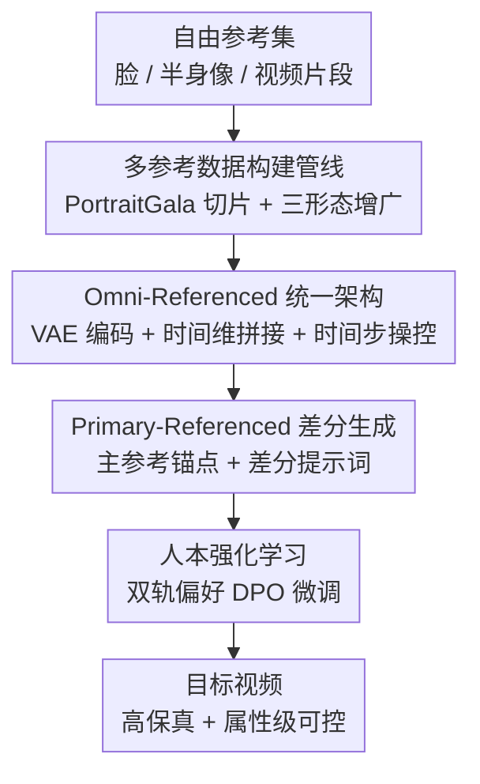

# AnyID: Ultra-Fidelity Universal Identity-Preserving Video Generation from Any Visual References

**会议**: CVPR 2026  
**论文**: [CVF Open Access](https://openaccess.thecvf.com/content/CVPR2026/html/Wang_AnyID_Ultra-Fidelity_Universal_Identity-Preserving_Video_Generation_from_Any_Visual_References_CVPR_2026_paper.html)  
**代码**: 项目页 https://johnneywang.github.io/AnyID-webpage（代码待确认）  
**领域**: 视频生成 / 扩散模型  
**关键词**: 身份保持视频生成、多参考、差分提示词、扩散 Transformer、DPO

## 一句话总结
AnyID 把"身份保持视频生成"从"只能用一张脸"扩展成"可以喂任意多张人脸/半身像/视频片段"，用一个预训练 VAE 把这些异构参考统一编码进 DiT，再指定一张主参考当锚点、配上只描述"变化"的差分提示词来做精确属性控制，最后用人类偏好 DPO 微调，在身份保真和提示可控性两个维度大幅领先现有单参考方法。

## 研究背景与动机

**领域现状**：身份保持视频生成（identity-preserving video generation）让用户能把自己喜欢的角色放进各种新场景里。技术上从早期的"每来一个新身份就微调一次模型"的 tuning-based 流程，演进到现在主流的 encoder-based 流程——用一个人脸专家编码器（如 ArcFace/CLIP）把一张参考图的身份特征注入 DiT，在精心构造的数据集上训练出泛化的身份建模能力，免去逐身份微调。

**现有痛点**：这些方法几乎都假设**输入只有一张人脸参考图**。这个假设带来两个问题。其一是创作灵活性差：真实用户手里有的是一堆照片、半身像、甚至视频片段，模型却只吃单张脸图，喂不进去。其二更本质——单张 2D 快照是一个**病态（ill-posed）问题**：一个人的身份由 3D 面部结构 + 表情动态共同定义，一张静态正脸图根本捕捉不到这些多面信息，于是当生成的脸转到别的角度、做出别的表情时，就会出现明显的"身份漂移"（identity drift）。

**核心矛盾**：单参考范式天然信息不足，模型只能在"忠实复刻参考"和"适应新上下文"之间二选一，要么死板地把参考图"复制粘贴"过来（牺牲可控性），要么自由发挥导致身份跑偏（牺牲保真度）。

**本文目标**：(1) 让模型能吃任意数量、任意形态（脸/半身像/视频）的自由参考；(2) 在多参考下还能做精确的、属性级（发型/衣服/背景…）的可控编辑；(3) 把像素级 MSE 训练对不齐人类感知的问题补上。

**切入角度**：作者认为破解病态性的钥匙是**拥抱多张自由参考**——多张图/视频片段能让模型从不同角度、不同动态里推断出 3D 形状和动态规律；而且这恰好贴合用户真实行为（大家本来就有现成的照片视频集合）。

**核心 idea**：用"omni-referenced 统一编码 + 主参考锚定 + 差分提示词"替代"单脸专家编码器"，把多张异构参考用一个通用 VAE 编进同一序列，再指定一张主参考当静态属性的"标准答案"，提示词只说"相对主参考要改什么"。

## 方法详解

### 整体框架
AnyID 的输入是一个**参考集 $R=\{r_i\}_{i=1}^N$**（$N$ 张混合模态的视觉参考，静态图当作单帧视频处理）外加一条**目标提示词 $d$**，输出是一段既保持身份、又服从提示词的视频。整条管线分两阶段训练，再由一条数据管线供给：先做**有监督训练**（在这一阶段同时落地 omni-referenced 统一编码和 primary-referenced 差分控制两件事），再做**人本强化学习**（用 DPO 按人类偏好精修），而所有训练样本由一条**多参考数据构建管线**从 PortraitGala 数据集合成。

具体到一次前向：所有参考 $r_i$ 各自被同一个预训练 VAE 编码成 latent，沿时间维拼接成统一条件 $y$；目标视频编码为 $z_0$ 后加噪得 $z_t$，干净的参考 latent 和带噪的目标 latent 再次沿时间维拼成一个长序列喂进 DiT。关键技巧是**时间步操控**：给所有参考 latent 钉死 $t=0$（表示无噪声），目标 latent 用采样到的 $t>0$，这样网络天然能区分"哪些是参考、哪些是要去噪的目标"，最后只取目标对应的输出算损失。控制层面则用一张主参考 $r_1$ 当锚点，配上只描述"变化"的差分提示词来做属性级编辑。

### 关键设计

**1. Omni-Referenced 统一架构：用一个通用 VAE 吞下所有异构参考，绕开人脸专家编码器**

针对"只能吃单张脸、且专家编码器是架构瓶颈"这个痛点，作者放弃了 ArcFace/CLIP 这类外部视觉专家，直接复用生成模型自带的预训练 VAE 来注入身份。流程上先做输入标准化：所有参考（静态图视作单帧视频）按原始长宽比 padding 到统一分辨率 $H\times W$，再各自经 VAE 编码、沿时间维拼接成统一条件 $y=\mathrm{Concat}(\{E(I(r_i))\}_{i=1}^N)$，其中 $I(\cdot)$ 是 resize+padding。训练时把干净参考 latent 与带噪目标 latent $z_t$ 也沿时间维拼接，靠**时间步操控**（参考钉 $t=0$、目标用 $t>0$）让模型区分两者，丢弃零时间步参考对应的输出，只用目标输出算 Rectified Flow 损失 $L_{RF}(\theta)=\|v_\theta(z_t,y,t,c)-(z_0-\epsilon)\|_2^2$。这样做的好处是简单、可扩展、对参考数量和形态都不挑——参考多了就是序列拼得更长，不需要为每种模态设计专门编码器。此外为避免"多条件要逐条做 unconditional 推理"的巨大开销，作者用**统一空条件**做引导：视觉上输入纯黑像素 latent $y_\varnothing$、语义上输入空提示 $c_\varnothing$，一次性把所有模态都置空，推理速度 $\hat v_t=(1-g)\cdot v_\theta(z_t,y_\varnothing,t,c_\varnothing)+g\cdot v_\theta(z_t,y,t,c)$，省掉了多余的推理 pass。

**2. Primary-Referenced 生成 + 差分提示词：指定一张主参考当锚点，提示词只说"要改什么"**

多张参考会带来上下文冲突——不同图里的光照、妆容、背景可能对同一属性给出互相矛盾的表示（这张图盘发、那张图披发到底信谁？）。作者用**主参考范式**解决：把单张主参考 $r_1$ 钦定为所有静态属性的"标准答案/锚点"。而既然有了固定锚点，传统那种"用绝对、整体描述去写目标场景"的提示方式就不合适了——既费劲又容易在没提到的地方乱改。于是引入**差分提示词**：提示词只描述"从主参考到目标内容发生了哪些变化"，没提到的一切默认保持与主参考一致。这把模型注意力精确聚焦在"指定的改动"上，同时用主参考为所有不变属性提供稳定底座。落地时把人像视频拆成 7 个预定义元素（镜头类型、发型、衣服、配饰、表情、动作、背景），用两阶段流程生成差分提示：先用 VLM 给主参考和目标视频各自的每个元素生成详细文本描述（得到 $d_{ref}$ 和 $d_{tar}$），再用 LLM 逐元素比对语义相似度，相似度超过阈值 $\gamma$ 的元素判为"未变"并从 $d_{tar}$ 里剪掉，剩下的就是最终差分提示 $d$。作者特别强调：核心贡献是"差分提示"这个概念，而非具体抽取方法（两阶段是因为单 VLM 直接做会幻觉/漏项，未来更强 VLM 或可一步到位）。

**3. 人本强化学习：用解耦的双轨人类偏好做 DPO，补 MSE 对不齐感知的短板**

有监督阶段的像素级 MSE 虽然能立住强 baseline，但它和高层人类感知根本不对齐——MSE 倾向于产生过度平滑的输出，恰恰磨掉了身份保真和提示可控所依赖的细粒度特征。作者用**人本 RL** 来弥合这道鸿沟：从训练集抽取大量输入集合，每个集合用已训模型采样两段视频构成一对，然后沿**两条解耦的轨道**评判——omni-referenced 身份保真（标注者拿到源 ID-group 的全部片段当完整参考，选哪段更好地保持了"动态身份"）和 primary-referenced 提示可控（标注者看主参考+差分提示，选哪段更贴合"指定的变换"且在未指定方面保持一致）。一对样本只有当其中一段在**两条轴上都明确更优**（即达到 Pareto dominance）才算有效训练样本，最终收集 1,000 对有效 win-lose 对，用 Diffusion-DPO 目标 $L_{Flow\text{-}DPO}(\theta)=\log\sigma(-\beta(s(z_t^+,t,c,\theta)-s(z_t^-,t,c,\theta)))$ 做偏好微调。消融显示 RL 主要精修"发丝光泽、纹理、面部阴影"这类微妙影响保真度的细节。

**4. 多参考数据构建管线：从 PortraitGala 合成"主参考+多形态辅助参考+目标"的训练实例**

模型要学会"跨多样复杂场景的身份不变性"，前提是有一份能体现这种不变性的数据集。作者基于 PortraitGala 构建大规模人物元数据池：该数据集本身已按身份分组（ID-group），作者再做严格过滤——先人脸检测只留单主体片段，再剔除模糊脸/极端头部姿态等低质样本，并给每段视频补上人脸/人体检测框等标注，最终得到 10 万个 ID-group、30 万段视频片段的元数据池。但这些干净片段太"同质"，不反映真实输入的多样性，于是再做**数据增广合成多形态参考**：从一个 ID-group 里采 $N$ 段参考视频和一段目标视频 $x$，把每段参考随机变成三种形态之一——人脸图（从随机帧裁面部区域）、半身像图（从随机帧裁更宽或更紧的人物区域）、视频参考（采一段随机片段并裁出统一人物区域）。每跑一轮就产出一个完整训练实例：一张主参考 + 一组多形态辅助参考 + 一段目标视频，正是这种"异构混搭"的数据结构赋予模型处理任意参考输入的本领。

### 损失函数 / 训练策略
有监督阶段用 Rectified Flow 损失（公式见上，对参考 latent 钉 $t=0$、只对目标输出回传）；RL 阶段用 Diffusion-DPO 目标在 1,000 对 Pareto-dominant 偏好对上微调。实现基于 Wan-5B，分辨率 $1280\times704$、121 帧（≈5 秒 720p），训练/推理时参考数 $N$ 在 1~5 间变化，空条件概率 $p_\varnothing=0.1$、引导尺度 $g=5.0$；有监督与 RL 两阶段都用 LoRA 训练，总计约 4,500 张 A100 GPU 小时。

## 实验关键数据

### 主实验
评测基于自建 benchmark：定义 IPT2V（只保身份）与 IEPT2V（保身份+若干元素）两类任务，收集 50 位名人各 5 张自由参考，用 LLM 生成 50 条 IPT2V + 50 条 IEPT2V 提示。指标分四维：身份保真（Holi-Arc / Holi-Cur，对所有参考脸取平均归一化余弦相似度）、元素一致性（Ele-CLIP / Ele-DINO，用 Grounded-SAM 分割元素后比对）、提示可控性（App. 外观 / Mot. 运动 / Bg. 背景，由 VLM 打分）、视觉质量（Sta. 静态 / Dyn. 动态，仿 VBench）。注意 baseline 不支持多参考，只喂主参考。

| 方法 | Holi-Arc | Holi-Cur | Ele-CLIP | Ele-DINO | App. | Mot. | Bg. | Sta. | Dyn. |
|------|----------|----------|----------|----------|------|------|-----|------|------|
| ConsisID-5B | 68.92 | 65.07 | - | - | 66.56 | 51.88 | 78.54 | 74.75 | 75.37 |
| FantasyID-5B | 69.60 | 65.03 | - | - | 73.12 | 58.74 | 82.50 | 73.81 | 82.81 |
| Phantom-14B | 70.01 | 64.01 | 66.01 | 75.90 | 61.88 | 54.37 | 83.12 | 77.62 | 83.54 |
| SkyReels-A2-14B | 69.12 | 64.89 | **78.14** | **79.87** | 50.19 | 58.75 | 54.37 | 78.62 | 78.25 |
| **AnyID-5B (ours)** | **73.22** | **67.52** | 68.78 | 69.50 | **86.56** | **60.31** | **84.79** | **82.03** | **91.12** |

AnyID 仅用 5B 就在身份保真（Holi-Arc 73.22、Holi-Cur 67.52）、提示可控（App. 86.56 / Mot. 60.31 / Bg. 84.79）、视觉质量（Sta. 82.03 / Dyn. 91.12）上全面登顶，且大幅超过 14B 的 Phantom/SkyReels-A2。元素一致性上 SkyReels-A2 的 Ele-CLIP/DINO 更高，但作者指出那是"复制粘贴"现象（连背景都照搬）的副产物，对应它极低的 App. 50.19。Phantom 的 Ele-CLIP 与 Ele-DINO 出现背离，推测是其风格化倾向改了元素高频信息（CLIP 捕到、DINO 没捕到）。

### 消融实验
三个消融模型：去掉主参考+差分提示设计（w/o P&D，改用普通提示）、去掉 RL（w/o RL）、推理时去掉辅助参考（w/o AR，退化为单参考）。

| 配置 | Holi-Arc | Ele-DINO | App. | Dyn. | 说明 |
|------|----------|----------|------|------|------|
| AnyID w/o P&D | 72.58 | 64.03 | 80.82 | 89.39 | 去主参考+差分提示，元素一致性 Ele-DINO 掉到 64.03、可控性掉 |
| AnyID w/o RL | 72.61 | 65.96 | 80.77 | 90.44 | 去 RL，发丝光泽/纹理等细节变差，Dyn. 降到 90.44 |
| AnyID w/o AR | 72.38 | 69.55 | 86.19 | 91.11 | 推理去辅助参考，身份保真 Holi-Arc 降至 72.38 |
| **AnyID (full)** | **73.22** | 69.50 | **86.56** | **91.12** | 完整模型 |

### 关键发现
- **P&D（主参考+差分提示）贡献最显著的是"属性级可控/元素一致"**：去掉后 Ele-DINO 从 69.50 暴跌到 64.03、App. 从 86.56 降到 80.82，定性上无法解决多参考间的发型冲突。
- **AR（辅助参考）直接关系到身份保真**：推理时只给主参考，Holi-Arc 从 73.22 降到 72.38——辅助参考提供了额外的面部动态信息，帮助模型在多样面部运动下精确建模身份不变性。
- **RL 精修的是"微妙细节"**：去掉后各项小幅下降（Dyn. 91.12→90.44），它修的是发丝光泽、纹理、面部阴影这类 MSE 磨平、却强烈影响主观保真的高频细节。
- 用户研究（20 人、40 组一对一）中 AnyID 在身份保真和提示可控上赢得 >70% 对决，元素一致性和视觉质量上 >60%；元素一致性的胜出有点意外，访谈发现是因为很多人把"自然度"也算进了主观判断。

## 亮点与洞察
- **"复用 VAE 而非专家编码器"是最省力又最通用的一招**：身份注入历来要挂 ArcFace/CLIP 专家，AnyID 直接让 VAE+时间维拼接+时间步操控承担一切，参考多了无非序列长一点，天然支持任意数量、任意模态（脸/半身像/视频）——这个"少即是多"的架构选择值得迁移到其他多条件可控生成任务。
- **差分提示词是一个很可复用的交互范式**：把"绝对描述整个场景"换成"只描述相对主参考的改动"，既减轻用户负担又降低描述噪声，本质是给生成模型提供了一个稳定的"参照系"。这个思路在图像编辑、虚拟试衣、风格迁移等任何"以某个锚点为基准做局部修改"的任务里都能用。
- **把人类偏好解耦成两条正交轨道（保真 vs 可控）再要求 Pareto dominance**，比单一打分更干净——只有两轴都更优才算正样本，避免了"保真好但乱改"或"听话但不像"的样本污染偏好数据。

## 局限与展望
- **差分提示抽取依赖两阶段 VLM+LLM 管线**，作者自己承认单 VLM 直接做会幻觉/漏项，目前不稳定；阈值 $\gamma$、7 元素的划分都是人为设定，泛化到非人像内容时未必适用。
- **数据强依赖 PortraitGala**：身份不变性的学习建立在这一个数据源上，10 万 ID-group 虽大但都是特定分布的人像视频，跨域（动漫角色、强遮挡、群体场景）能力存疑（⚠️ 以原文为准，论文未做此类评测）。
- **对比不完全同台**：baseline 不支持多参考、只喂了主参考，AnyID 享受了多参考信息优势，因此"5B 打赢 14B"的结论需放在"任务设定本就利好多参考方法"的语境下看。
- 评测仅 50 名人 ×（50+50）提示、用户研究 20 人，规模偏小；RL 仅 1,000 对偏好数据，偏好覆盖面是否足够支撑泛化值得进一步验证。

## 相关工作与启发
- **vs ConsisID / FantasyID（基于 CogVideoX-5B 的单参考方法）**：它们靠人脸专家编码器从单张脸注入身份，头一转/表情一变就身份漂移；AnyID 用多自由参考 + VAE 统一编码缓解病态性，身份保真显著更高。
- **vs Phantom / SkyReels-A2（基于 Wan-14B 的单参考方法）**：Phantom 有风格化倾向导致元素高频信息被改、身份失真；SkyReels-A2 严重偏向参考图、出现"复制粘贴"连背景都照搬（Ele 指标虚高但 App. 极低）。AnyID 用差分提示把"该变的"和"该留的"解耦，在可控性和一致性间取得更优平衡。
- **vs Diffusion-DPO**：本文沿用 DPO 的隐式奖励建模，但把偏好显式拆成"身份保真"和"提示可控"两条解耦轨道，并要求 Pareto dominance 才纳入训练，是针对身份保持视频任务的定制化 DPO。

## 评分
- 新颖性: ⭐⭐⭐⭐⭐ 把单参考身份保持升级为"任意自由参考"，omni-referenced 统一编码 + 差分提示词两个设计都很扎实且可迁移。
- 实验充分度: ⭐⭐⭐⭐ 自建 benchmark+四维指标+消融+用户研究较完整，但 baseline 不同台、评测规模偏小。
- 写作质量: ⭐⭐⭐⭐⭐ 动机推导（病态性→多参考）清晰，方法分节明确，图文对照到位。
- 价值: ⭐⭐⭐⭐⭐ 贴合真实用户"手里有一堆照片视频"的场景，5B 打赢 14B，实用价值高。

<!-- RELATED:START -->

## 相关论文

- [\[CVPR 2026\] EvoID: Reinforced Evolution for Identity-Preserving Video Generation](evoid_reinforced_evolution_for_identity-preserving_video_generation.md)
- [\[CVPR 2026\] ConsID-Gen: View-Consistent and Identity-Preserving Image-to-Video Generation](consid-gen_view-consistent_and_identity-preserving_image-to-video_generation.md)
- [\[CVPR 2026\] PLACID: Identity-Preserving Multi-Object Compositing via Video Diffusion with Synthetic Trajectories](placid_identity-preserving_multi-object_compositing_via_video_diffusion_with_syn.md)
- [\[CVPR 2025\] Identity-Preserving Text-to-Video Generation by Frequency Decomposition](../../CVPR2025/video_generation/identity-preserving_text-to-video_generation_by_frequency_decomposition.md)
- [\[CVPR 2026\] EffectMaker: Unifying Reasoning and Generation for Customized Visual Effect Creation](effectmaker_unifying_reasoning_and_generation_for_customized_visual_effect_creat.md)

<!-- RELATED:END -->
