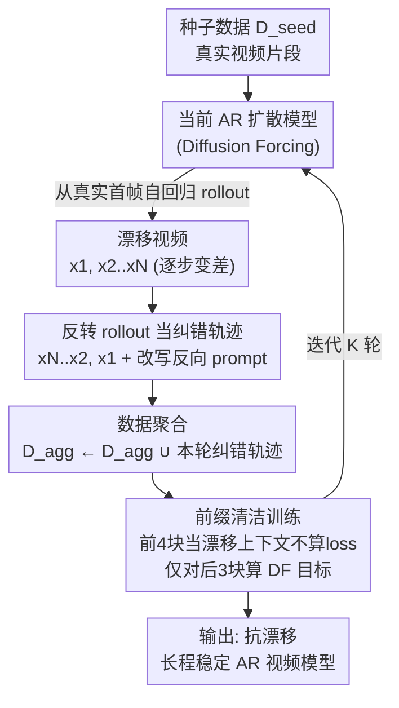

# BAgger: Backwards Aggregation for Mitigating Drift in Autoregressive Video Diffusion Models

**会议**: CVPR 2026  
**论文**: [CVF Open Access](https://openaccess.thecvf.com/content/CVPR2026/html/Po_BAgger_Backwards_Aggregation_for_Mitigating_Drift_in_Autoregressive_Video_Diffusion_CVPR_2026_paper.html)  
**代码**: 无  
**领域**: 视频生成  
**关键词**: 自回归视频扩散, 曝光偏差, 漂移, DAgger, 世界模型  

## 一句话总结
针对自回归视频扩散在长视频上误差累积导致画质漂移的问题，BAgger 把模型自己跑出来的、会逐渐变差的 rollout **时间反转**，得到一条"从坏帧恢复到好帧"的纠错轨迹，再用标准扩散目标做 DAgger 式数据聚合微调——不需要双向 teacher、不需要分布匹配损失，就能让模型学会从自己的错误状态里自我修复，长程生成更稳定。

## 研究背景与动机
**领域现状**：把视频当作"逐帧/逐块预测下一段"的自回归（AR）扩散模型，是做世界模型（world model）的主流路线——因为时间本身是因果的，必须用因果注意力一段一段往后生成，而不能像早期双向扩散那样一次性生成固定长度的片段。

**现有痛点**：所有 AR 生成模型都有**曝光偏差（exposure bias）**，在视频里表现为**漂移（drift）**：训练时模型 condition 在干净的 ground-truth 上下文帧上，推理时却 condition 在自己生成的、可能已经有误差的帧上。一旦某帧出错，误差会被当成下一步的上下文继续放大，级联下去导致画质随时间快速退化——典型表现是过饱和、过平滑、对比度丢失、运动多样性塌缩，几十秒后画面就"烂"了。

**核心矛盾**：要消除漂移，本质上要让模型学会建模**推理时的条件分布** $p(x^i \mid \hat{x}^{<i})$（上下文是自己生成的漂移帧），但训练时根本没有"漂移上下文 → 正确下一帧"这种纠错样本。主流补救法是把 AR 模型的 rollout 分布对齐到一个预训练**双向 teacher**（如 Self Forcing），但这带来三个硬伤：(1) 依赖一个庞大的双向 teacher 扩散模型；(2) 需要对整条自回归生成过程做 BPTT（穿越时间的反传），开销巨大；(3) 分布匹配损失（score distillation / 对抗）本身是**mode-seeking**的，会抑制多样性、让画面变"静"。另一类做法往上下文帧注噪声（Diffusion Forcing 等），但噪声上下文和推理时的真实漂移上下文仍然 mismatch，没从根上解决曝光偏差。

**切入角度**：作者借鉴模仿学习里的 **DAgger（Dataset Aggregation）**——让策略 rollout 收集 on-policy 状态，再请专家在这些状态上给出正确动作，聚合进数据集反复重训，从而让模型学会"从自己的错误里恢复"。难点是视频里没有人类专家能手工修正一段高维、连续退化的漂移帧。

**核心 idea**：**反转模型自己的 rollout 就是一条免专家（oracle-free）的纠错轨迹**。AR rollout 从高质量真实帧出发、随时间自回归地变差；把它时间反转，就天然变成"从差帧逐步走向好帧"的恢复示范。只要把文本 prompt 改成描述反向运动，反转视频对 text-to-video 模型来说仍然 in-distribution，于是模型自己的错误就被转化成了训练数据。

## 方法详解

### 整体框架
BAgger 是一个**迭代式的数据聚合训练循环**，建立在 Diffusion Forcing（DF）训练的因果扩散 transformer 之上。输入是一批真实视频片段构成的种子数据集 $D_{\text{seed}}$；输出是一个对自身漂移状态鲁棒、能长程稳定生成的 AR 视频模型。

每一轮（round $k$）做四件事：(1) 用当前模型从一个真实首帧出发，自回归地 rollout 出一段会逐渐漂移的视频 $(x^1, \hat{x}^{2:N})$；(2) 把这段视频**时间反转**成 $(\hat{x}^{N:2}, x^1)$，得到一条纠错轨迹，并把 prompt 改写成反向版本；(3) 把本轮所有纠错轨迹**聚合**进总数据集 $D_{\text{agg}}$；(4) 在聚合后的数据上、用**原始 DF 扩散目标**重新训练一个模型。如此循环若干轮，数据集逐步逼近模型自身的轨迹分布，从而在极限处弥合训练-推理的 gap。整个过程不引入任何分布匹配损失或 BPTT。

### 关键设计

**1. 反转 rollout 作为免专家的纠错轨迹**

这是全文的命门：曝光偏差要求训练数据里有"漂移上下文 → 正确恢复帧"的样本，但人类专家无法手工修一段高维连续退化的视频。作者的观察是——模型自己的 rollout $(x^1, \hat{x}^{2:N})$ 本来就是"从好到坏"的轨迹，把它**时间反转**成 $(\hat{x}^{N:2}, x^1)$，就变成了"从坏到好"的恢复示范：给定一串可能漂移的帧，下一帧应该是更接近真实分布的帧。这等于用模型自己的错误当老师，无需外部 teacher 或 oracle。

可行性建立在两条假设上。其一，**文本条件视频流形对时间反转封闭**：若 $x^{1:N} \in M_{\text{data}}$ 则 $x^{N:1} \in M_{\text{data}}$（一个人倒着走和正着走都是合法视频）。其二，为让反转样本真正合法，只需把原 prompt $c$ 改写成反向版本 $c'$（"a person walking" → "a reversed video of a person walking"），让文本条件与反向运动一致。两条满足后，反转 rollout 就是 in-distribution 的有效监督信号。

**2. DAgger 式数据聚合训练循环**

单纯造一批纠错样本不够，因为一轮采样无法覆盖漂移状态的全部分布，甚至单轮可能比只用种子数据更差。BAgger 照搬 DAgger 的迭代聚合思想（见 Algorithm 1）：第 $k$ 轮用当前模型 $p_{\theta_k}$ 采 $M$ 段漂移 rollout、反转成纠错轨迹 $D_k$、并入总集 $D_{\text{agg}} \leftarrow D_{\text{agg}} \cup D_k$，再从基座重训得到 $p_{\theta_{k+1}}$。随着轮数增加，聚合数据逐步逼近模型**自身的轨迹分布**，从根上对齐了训练时见到的上下文和推理时实际产生的上下文，这正是曝光偏差的病根所在。论文实测画质随轮次单调改善：第 1 轮甚至会"过纠"到欠饱和，第 2 轮饱和/对比度稳定下来，第 3 轮在细节和时序一致性上进一步提升。

**3. 前缀清洁的纠错训练目标**

纠错轨迹和干净种子数据不能一视同仁地训。种子数据 $D_{\text{seed}}$ 按标准 DF 目标在**每一帧**上算 loss——每帧独立采噪声水平 $t_i$，把 $x^i_0$ 噪化为 $x^i_{t_i} = \alpha_{t_i} x^i_0 + \sigma_{t_i}\epsilon_i$，去噪器学习预测噪声：

$$L_{\text{DF}}(\theta) = \mathbb{E}_{t_i, x_0, \epsilon_i}\left[\,\|\hat{\epsilon}_\theta(x^i_{t_i}, t_i, x^{j<i}_{t_j}) - \epsilon_i\|_2^2\,\right]$$

但对纠错轨迹，模型**不应该去学漂移帧的分布**，只该学"在漂移上下文条件下如何输出正确帧"。所以作者选一段**前缀帧当作"漂移状态"**：这些前缀帧保持清洁地喂进模型当上下文，但**不在它们上计算 loss**；loss 只算在前缀之后的帧上。实现里每条纠错轨迹的前 4 个 latent chunk 当漂移前缀（清洁、不算 loss），只对剩下 3 个 chunk 算 DF 目标。这样模型把前缀当"已经漂了的既成事实"，专心学习如何从这种状态恢复，而不是把漂移帧本身也当成要生成的目标。

### 损失函数 / 训练策略
全程只用标准 Diffusion Forcing 目标（式 2 的逐帧去噪 MSE），不引入任何分布匹配/对抗损失。架构上基于扩散 transformer + **块因果注意力（block-causal）**，每个 chunk 含 3 个 latent 帧、共 7 个 chunk。具体实现：基于双向 Wan2.1 1.3B 改造为块因果，在 832×480、16FPS、5 秒视频（经 3D VAE 把 81 帧压成 21 latent 帧）上训练；种子集为 Pexels 5.5 万高质量片段（MiraData 扩展字幕），初始 DF 模型训 16K 步、batch 96。每轮 BAgger 生成 2.7 万条纠错轨迹（种子集的 50%），做法是用上一轮模型对首个 chunk 注入 ground-truth、做视频扩展生成后 6 个 chunk，再解码到像素空间反转、重新编码回 latent；每轮模型都从 Wan2.1 1.3B 基座重新微调 16K 步（重训而非续训是为了隔离"聚合"本身的效果、排除累积算力的混淆）。长视频推理用滑动窗口，并对每个窗口**重算 KV-cache**（而非滚动 cache），避免 OOD cache 值成为评测混淆因素。

## 实验关键数据

### 主实验
在 VBench 上评测 50 秒长 text-to-video（与 Diffusion Forcing、History Guidance 同种子数据、同算力预算对比）。除常规"全局指标"外，作者特别提出**漂移指标（Drifting Metrics）**：取每段视频"前 20% 帧的均值 − 全片均值"作为画质衰减量（$\Delta$Aesthetic / $\Delta$Imaging），**越低代表漂移越小**——因为逐帧均值会掩盖时间上的退化。

| 方法 | Subject Cons. ↑ | Bg. Cons. ↑ | Aesthetic ↑ | Imaging ↑ | ΔAesthetic ↓ | ΔImaging ↓ |
|------|------|------|------|------|------|------|
| Diffusion Forcing ($\sigma_{test}=0$) | 80.70 | 87.74 | 53.05 | 59.97 | 5.12 | 7.34 |
| Diffusion Forcing ($\sigma_{test}=0.2$) | 82.13 | 88.76 | 53.98 | 57.49 | 7.83 | 12.27 |
| History Guidance | 79.15 | 86.20 | 49.24 | 54.33 | 8.83 | 14.56 |
| BAgger Round 1 | 82.69 | 89.02 | 53.84 | 53.67 | 4.84 | 11.83 |
| BAgger Round 2 | 82.29 | 88.70 | 54.68 | 59.98 | 3.79 | 5.92 |
| **BAgger Round 3** | **84.05** | **89.58** | **55.35** | **63.41** | **3.29** | **3.57** |

第 3 轮在逐帧质量、主体/背景一致性上全面最优，且漂移指标降到最低（$\Delta$Imaging 从 DF 的 7.34 降到 3.57），同时保持可比的运动指标。

与开源 AR 模型对比（Tab. 2，分运动质量 / 帧质量两组）：

| 模型 | 参数 | 用 Teacher? | NFE | Motion Quality ↑ | Frame Quality ↑ |
|------|------|------|------|------|------|
| MAGI-1 | 4.5B | 否 | 20 | 73.11 | 57.06 |
| SkyReels-V2 | 1.3B | 否 | 20 | 71.87 | 56.72 |
| Self Forcing | 1.3B | 是 (14B) | 4 | 73.93 | **64.81** |
| **Ours (BAgger)** | 1.3B | **否** | 20 | **87.59** | 59.38 |

BAgger 不用任何 teacher，运动质量大幅领先所有对手（87.59 vs 次高 73.93）；帧质量仅次于 Self Forcing——但后者靠从 14B teacher 蒸馏换来的高帧质量是以"生成近乎静止的视频"为代价（其运动质量因此偏低）。

### 消融实验

| 配置 | 现象 | 说明 |
|------|------|------|
| Seed-only（0 轮） | 严重过饱和 | 只用种子数据，漂移最重 |
| BAgger Round 1 | 过纠到欠饱和 | 单轮不足以覆盖漂移状态全分布，甚至可能比种子更差 |
| BAgger Round 2 | 饱和/对比度稳定 | 色彩平衡趋于自然 |
| BAgger Round 3 | 细节+时序一致性再升 | 视觉保真度与稳定性最佳 |

### 关键发现
- **多轮聚合是关键且非单调起步**：1 轮不够、还会过纠（欠饱和），2~3 轮才稳定提升——印证"单次采样无法覆盖漂移状态全分布，需迭代逼近模型自身轨迹分布"。
- **漂移指标比逐帧均值更能反映长程退化**：逐帧均值会被掩盖，$\Delta$ 指标才暴露 DF/History Guidance 后期画质崩坏。
- **不用 teacher 也能赢运动质量**：分布匹配/蒸馏类方法（Self Forcing）虽帧质量高，却因 mode-seeking 牺牲了运动多样性，画面趋静；BAgger 用纯扩散目标保住了动态。

## 亮点与洞察
- **"时间反转 = 免费的纠错示范"是极漂亮的洞察**：把曝光偏差里最难搞的"如何从漂移恢复"的监督信号，用一个零成本的视频反转操作就构造出来，且论证了反转样本仍 in-distribution（流形对反转封闭 + prompt 改写）。
- **回避 teacher / BPTT / 分布匹配三座大山**：只靠标准 score/flow matching 目标做 DAgger 聚合，既省掉 14B teacher 和穿越时间的反传，又避免了 mode-seeking 对多样性的伤害——这是它运动质量碾压对手的根因。
- **前缀清洁训练**这一招可迁移：凡是想让模型"接受一个不完美上下文并修复"而不是"学习该上下文分布"的场景（如带噪条件生成、错误恢复），都可借鉴"上下文帧不算 loss、只在恢复段算 loss"的设计。

## 局限与展望
- 作者承认：极长程下漂移伪影仍可能出现，几轮 BAgger 未必覆盖漂移状态的全部空间；种子数据与纠错数据的配比仍是开放的设计选择，会影响稳定性与泛化。
- 为公平对比，每轮都从双向 teacher 重训以隔离"聚合"效果，但这浪费了累积算力——续训（warm-start）有望进一步提速提质。
- 非实时：当前 20 步推理，未来可在 BAgger 之上叠加 few-step 蒸馏；由于 BAgger 不依赖分布匹配损失，蒸馏不会被迫困在 mode-seeking 目标里——这是相对前作的一个结构性优势。
- 自评局限：所有结论建立在 Wan2.1 1.3B 这一基座 + Pexels/MiraData 数据上，未验证更大模型/更长 horizon（分钟级以上）的可扩展性；"流形对时间反转封闭"对强不可逆运动（如倒水、爆炸）是否仍成立，论文未深入讨论。

## 相关工作与启发
- **vs Self Forcing**：Self Forcing 用 AR self-rollout + 对齐双向 teacher 分布（score distillation/对抗）来闭合训练-测试 gap，需要 14B teacher 且分布匹配损失 mode-seeking。BAgger 用反转 rollout 自监督 + 标准扩散目标，无 teacher、无 BPTT、不牺牲运动多样性；代价是帧质量略逊于蒸馏。
- **vs Diffusion Forcing**：DF 靠给上下文帧注独立噪声提升鲁棒性，但噪声上下文仍与推理时真实漂移上下文 mismatch，长程仍累积误差。BAgger 直接拿真实漂移状态（反转 rollout）当训练上下文，从根上对齐。
- **vs History Guidance**：HG 在推理时引导生成与历史保持一致，短程有效，但会"过度锚定"已漂移的帧、反而加剧饱和与运动塌缩。BAgger 教模型从漂移中恢复而非死守历史。
- **vs DAgger（模仿学习）**：经典 DAgger 靠专家 oracle 给纠错动作；BAgger 的核心贡献是用"反转 rollout"当 oracle-free 的纠错信号，把 DAgger 迁移到无法人工干预的高维视频生成场景。

## 评分
- 新颖性: ⭐⭐⭐⭐⭐ "反转 rollout 当纠错轨迹"是简洁而深刻的洞察，把 DAgger 干净地搬进视频扩散
- 实验充分度: ⭐⭐⭐⭐ VBench 主对比 + 开源模型对比 + 多轮消融齐全，但缺更大模型/分钟级超长程验证
- 写作质量: ⭐⭐⭐⭐⭐ 动机推导清晰，Algorithm 1 与图示把循环讲得很透
- 价值: ⭐⭐⭐⭐⭐ 无 teacher、无分布匹配就缓解曝光偏差，对世界模型/长视频生成有直接落地价值

<!-- RELATED:START -->

## 相关论文

- [\[CVPR 2026\] SoliReward: Mitigating Susceptibility to Reward Hacking and Annotation Noise in Video Generation Reward Models](solireward_mitigating_susceptibility_to_reward_hacking_and_annotation_noise_in_v.md)
- [\[CVPR 2026\] Accelerating Autoregressive Video Diffusion via History-Guided Cache and Residual Correction](accelerating_autoregressive_video_diffusion_via_history-guided_cache_and_residua.md)
- [\[CVPR 2025\] From Slow Bidirectional to Fast Autoregressive Video Diffusion Models](../../CVPR2025/video_generation/from_slow_bidirectional_to_fast_autoregressive_video_diffusion_models.md)
- [\[CVPR 2026\] RFDM: Residual Flow Diffusion Models for Video Editing](rfdm_residual_flow_diffusion_models_for_video_editing.md)
- [\[CVPR 2026\] Diff4Splat: Repurposing Video Diffusion Models for Dynamic Scene Generation](diff4splat_controllable_4d_scene_generation_with_latent_dynamic_reconstruction_m.md)

<!-- RELATED:END -->
