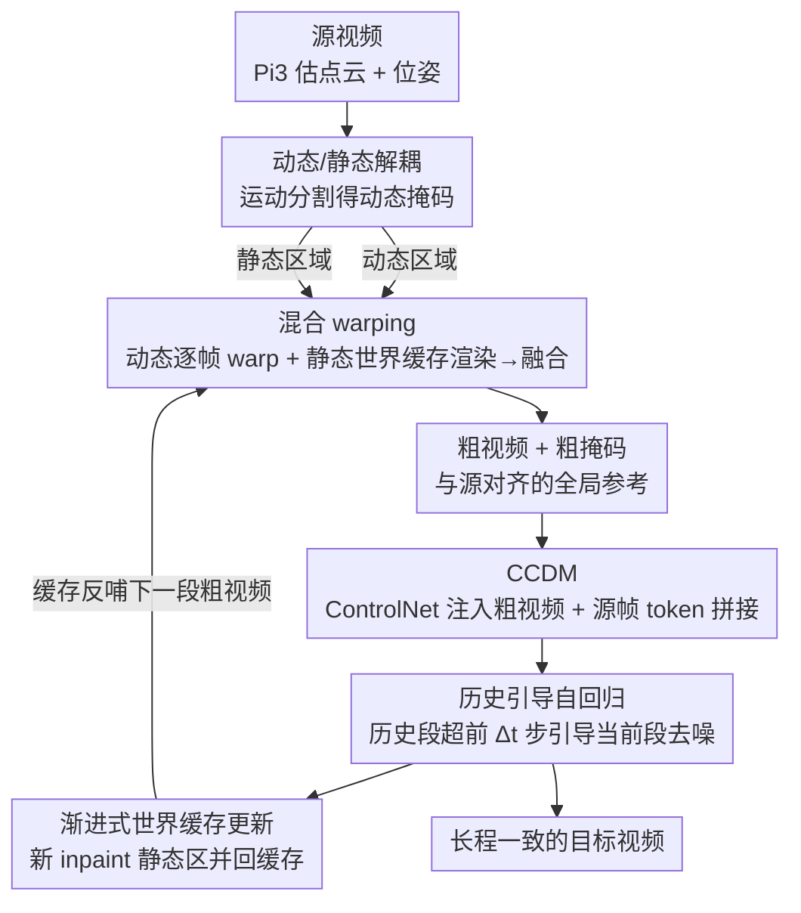

# CamDirector: Towards Long-Term Coherent Video Trajectory Editing

**会议**: CVPR 2026  
**论文**: [CVF Open Access](https://openaccess.thecvf.com/content/CVPR2026/html/Yin_CamDirector_Towards_Long-Term_Coherent_Video_Trajectory_Editing_CVPR_2026_paper.html)  
**代码**: 无  
**领域**: 视频生成 / 相机轨迹编辑  
**关键词**: 视频轨迹编辑, 混合 warping, 世界缓存, 自回归扩散, 长视频一致性

## 一句话总结
CamDirector 用「混合 warping + 世界缓存」把整段源视频的信息显式聚合成与源对齐的粗视频，再用「历史引导的自回归扩散模型 + 渐进式世界缓存更新」逐段生成长视频，在仅 2.0B 参数下于 iPhone / iPhone-PTZ 两个基准上做到 SOTA 的相机轨迹编辑。

## 研究背景与动机

**领域现状**：视频（相机）轨迹编辑（Video Trajectory Editing, VTE）的目标是把一段随手拍的业余视频，沿用户重新设计的相机轨迹合成出新视频——既要保留原场景内容，又要把新视角下原来看不见的区域合理地 inpaint 出来，从而把"路人拍的素材"升级成具有电影感运镜的专业级视频。基于预训练视频扩散模型，目前主流有两条路线：一条（GCD、RecamMaster）直接把目标相机位姿通过 embedding 层注入生成过程；另一条（TrajectoryCrafter、Gen3C）走 warp-and-repaint，先用 3D 点云把源帧显式 warp 到目标视角，再让扩散模型精修并补洞。

**现有痛点**：embedding 注入路线因 embedding 层表达能力有限，相机控制不精确，生成视频根本跟不准目标轨迹；warp-and-repaint 路线虽然控制更准，但**每个 warped 帧只来自单一源帧**，靠扩散模型里的双向注意力去"隐式"地从其他帧汇聚互补信息。一旦视频变长，显存约束迫使分块处理，注意力无法覆盖整段序列（尤其覆盖不到未来帧）。

**核心矛盾**：于是冒出两个根本问题——① **源对齐（source alignment）**：当前帧生成的内容，可能和源视频别处明明存在的场景证据对不上（比如地板、自行车后半部分在源视频其它帧里其实拍到了，但单帧 warp 用不上）；② **自一致性（self-consistency）**：新 inpaint 或原本不可见的区域会在段与段之间漂移，导致时间闪烁、外观随时间不连贯。

**本文目标**：在长视频场景下同时保证"与源视频严格空间对齐"和"生成视频自身时间连贯"，这两件事是 VTE 比普通长视频生成更难的地方。

**切入角度**：作者观察到——**静态背景在整段视频里本该一致，动态物体才随时间演化**。那就不该对所有像素一视同仁地单帧 warp，而应把静态区域聚合成一个全局的 3D 表示反复复用、动态区域单独处理；同时把长视频生成做成"带历史记忆"的自回归过程，让后段不断对齐前段。

**核心 idea**：用「混合 warping + 世界缓存（world cache）」显式聚合整段源视频构造对齐的粗视频，替代单帧 warp 的隐式聚合；再用「历史引导自回归 + 渐进式世界缓存更新」把短段生成扩展到长视频并锁住长程一致性。

## 方法详解

### 整体框架
CamDirector 由两大组件串成。**第一步（混合 warping）**：给定源视频，先用 4D 基础模型 Pi3 估计每帧点云和相机位姿，把场景解耦成动态/静态——动态区域逐帧一对一 warp 到目标视角保运动保真，静态区域增量融合成一个轻量"世界缓存"（统一点云），再渲染到目标位姿；两者按深度遮挡融合成**粗视频**，作为与源高度对齐的全局参考。**第二步（历史引导自回归生成）**：用一个受粗视频控制的扩散模型 CCDM 先生成短段，再通过"历史段引导当前段去噪 + 段后渐进更新世界缓存"扩展到长视频，保证段间无缝过渡和长程时间一致。整条流水线是"先把对齐的粗视频造好 → 再交给扩散模型精修并自回归拼长"。

### 关键设计

**1. 混合 warping 方案：动态逐帧 warp + 静态世界缓存，显式聚合整段源视频**

针对"单帧 warp 用不上源视频别处证据、长视频又装不下全序列注意力"的痛点，本文不再让扩散模型隐式汇聚信息，而是在 warp 阶段就把全局信息显式攒好。给定源视频 $I^s=\{I^s_i\}_{i=1}^N$，先用 Pi3 估计每帧点云 $P_i$ 和位姿 $\Pi^s_i$，再用运动分割得到动态掩码 $M^d_i$。**动态区域**逐帧一对一投影到目标视角以保运动保真：

$$I^{d,t}_i,\ Z^{d,t}_i,\ M^{d,t}_i = \Phi\big(\Pi^t_i\cdot(\Pi^s_i)^{-1}\cdot([P_i, I^s_i]\odot M^d_i)\big),$$

其中 $\Phi$ 为透视投影，输出 warped RGB、投影深度和有效区域掩码。**静态区域**则不逐帧重复，而是融合成一个统一的 3D「世界缓存」。朴素地把所有静态点云全堆起来在 $N$ 大时显存和算力都爆，作者改成增量构造：均匀采样 $L$ 帧，逐帧渲染当前世界缓存得到可见性掩码，只把"落在掩码之外（即缓存里还没有的）"静态点云追加进缓存，遍历完 $L$ 帧就得到一个**紧凑但完整、去冗余且保留几何布局**的世界缓存。最后把世界缓存渲染到每个目标视角得到 $I^{w,t}_i$、深度 $Z^{w,t}_i$，与动态部分按深度遮挡融合成粗帧：

$$\hat I_i(x)=I^{d,t}_i(x)\cdot\mathbb{1}\big(Z^{d,t}_i(x)<Z^{w,t}_i(x)\big)+I^{w,t}_i(x)\cdot\mathbb{1}\big(Z^{d,t}_i(x)\ge Z^{w,t}_i(x)\big).$$

之所以有效：世界缓存把"远到注意力够不着的帧"里的静态证据也存进了一个全局参考，粗帧因此更完整、更与源对齐，需要 inpaint 的区域大幅减少，可控性和一致性都上来了。

**2. CCDM 基模型：ControlNet 注入粗视频 + 源帧 token 拼接，精修而非简单补洞**

粗视频虽对齐，但因位姿/点云估计误差和视角相关效应，会带结构畸变和外观失配，单纯补未见区是不够的。CCDM（coarse-video–controlled diffusion model）以预训练 Wan-T2V-1.3B 为底座，通过 **ControlNet** 把粗视频及其掩码作为条件注入，让模型分清"哪些该 inpaint"；并把目标相机位姿编码成 Plücker embedding 注入。由于相机信息主要在视频扩散模型的浅层决定，控制特征只注入 Wan-T2V 的**前 15 个 block**。更关键的是为了"精修"，把**源帧 token 与带噪目标 token 拼接**送进全注意力层，让模型直接借用可靠的运动与外观先验；为适配源 latent，在原注意力模块里加 **LoRA** 做高效适配。这样模型不是盲补，而是带着源证据去校正粗视频的畸变。

**3. 历史引导自回归生成：历史段超前 Δt 步去噪 + CFG，把短段拼成连贯长视频**

要把短段扩到长视频又不让外观漂移，作者把长视频切成不重叠的若干段 $\{x_k\}_{k=1}^K$，每段 $T$ 帧。每轮迭代用上一段最后 $T^\star$ 帧作为**历史**来引导当前 $T$ 帧的合成：历史 token 和当前段 token 共同组成 CCDM 的目标噪声 token，让历史上下文通过注意力跨段传播。经验上让历史 token 在整个去噪过程中**比当前 token 超前 $\Delta t$ 个噪声步**效果最一致；去噪完当前干净段被重新加噪到下一段对应噪声水平，渐进地充当下一轮历史。为强化引导和平滑过渡，引入 classifier-free guidance：

$$v_t = w\times v_\theta(x^k_{t-1}\mid x^{k-1}_{t+\Delta t})+(1-w)\times v_\theta(x^k_{t-1}\mid x^{k-1}_{t-1}),$$

$w$ 为引导尺度。这一设计让段间过渡无缝、外观不漂。

**4. 渐进式世界缓存更新：把新 inpaint 的静态内容回写缓存，反哺后段粗视频**

光有历史引导还不够锁长程一致——后段如果看不到前段已经补好的内容，会各补各的导致不一致。于是每生成一新段，就用 SAM2 追踪源段与新合成段里的静态区域，用 Pi3 估其点云并对齐到世界坐标，再把**新 inpaint 的静态区域合并进现有世界缓存**（均匀采 $C$ 帧作锚点）。如此一来后续段的粗视频就编码了已经补好的稳定场景结构，后段能更好地对齐前段；配合历史引导，共同保证段间无缝过渡与长程时间一致。这是把"已生成的成果"固化成全局记忆、避免重复 inpaint 漂移的关键闭环。

### 损失函数 / 训练策略
训练数据用动态多视角数据集（约 13.6K 动态场景，每场景 10 段同步的 81 帧视频带相机位姿）。因缺点云/深度，需额外处理：每个同步时刻 10 帧构成静态多视角，用 VGGT 估深度与位姿并对齐到 GT 相机坐标；但 VGGT 深度时有偏差导致粗视频出错，作者用**对极约束修正深度** + 一系列过滤规则剔除低质样本（如相邻帧突变），最终保留 9.5K 场景。训练分两阶段：① 训基模型 CCDM——每轮随机取两段视频作源/目标，由源经混合 warping 生成粗视频，目标视频加 0–1000 均匀采样噪声，用标准 flow-matching 目标训练；② 微调 CCDM 支持自回归——目标视频切成 $T^\star$ 历史帧 + $T$ 当前帧，对历史/当前分别施加两个非递减噪声水平 $t_1\le t_2$，对两者都用 flow-matching 损失。两个模型各训 20,000 步、分辨率 480×832、学习率 $2\times10^{-5}$、batch size 6，各约 20 小时。

## 实验关键数据

### 主实验
在 iPhone 和新提出的 iPhone-PTZ 基准上对比，左为短片段（前 41 帧）/ 右为全视频结果（PSNR↑、LPIPS↓、FID↓）：

| 方法 | 参数量 | iPhone PSNR↑ | iPhone LPIPS↓ | iPhone FID↓ | iPhone-PTZ PSNR↑ | iPhone-PTZ LPIPS↓ | iPhone-PTZ FID↓ |
|------|--------|------|------|------|------|------|------|
| RecamMaster | 1.3B | 10.73 / - | 0.7830 / - | 195.24 / - | 11.64 / - | 0.6981 / - | 117.77 / - |
| TrajectoryCrafter | 5.3B | 13.00 / - | 0.6197 / - | 145.58 / - | 12.56 / - | 0.5303 / - | 105.30 / - |
| Gen3C | 6.7B | 13.29 / 13.44 | 0.6107 / 0.6066 | 148.76 / 116.91 | 13.13 / 13.27 | 0.5305 / 0.5497 | 91.41 / 86.21 |
| **Ours** | **2.0B** | **14.31 / 14.12** | **0.4952 / 0.5103** | **114.99 / 107.44** | **13.78 / 13.99** | **0.4468 / 0.4752** | **79.65 / 72.33** |

在所有指标上全面超越前作，且参数量只有 2.0B（Gen3C 是 6.7B、TrajectoryCrafter 5.3B）。VBench 全视频质量评估（Tab. 2）中本文在主体一致性、背景一致性、时间闪烁、运动平滑、美学/成像质量上同样领先，尤其在视频一致性类指标上优势明显，印证长视频建模设计的有效性（如 iPhone 上 Subject Consistency 0.9400 vs Gen3C 0.8510）。

### 消融实验
全视频设定、iPhone-PTZ 基准。混合 warping 与 CCDM 条件消融（Tab. 3）：

| 配置 | PSNR↑ | LPIPS↓ | FID↓ | 说明 |
|------|------|------|------|------|
| Full model | 13.99 | 0.4752 | 72.33 | 完整模型 |
| w/o Plücker | 13.18 | 0.4897 | 78.23 | 去相机位姿编码 |
| w/o Source | 13.04 | 0.5134 | 92.90 | 去源帧 token 拼接 |
| w/o Hybrid Warping | 12.18 | 0.5347 | 84.75 | 换回逐帧 warp，掉点最多 |

历史引导自回归消融（Tab. 4，含 VBench 一致性）：

| 配置 | PSNR↑ | Subject Consis.↑ | Background Consis.↑ |
|------|------|------|------|
| Ours | 13.99 | 0.8574 | 0.8816 |
| w/o History Guidance | 13.39 | 0.8543 | 0.8780 |
| w/o Progressive Update | 12.86 | 0.8487 | 0.8777 |

### 关键发现
- **混合 warping 贡献最大**：换回逐帧 warp 后 PSNR 从 13.99 跌到 12.18（掉 1.81），是所有消融里掉点最猛的，证明"显式全局聚合源信息"才是源对齐与高质量的根本。
- **渐进式世界缓存更新 > 历史引导**：去掉渐进更新（12.86）比去掉历史引导（13.39）掉得更多——前者让后段拿不到前段已补内容、各自独立 repaint 导致不一致；后者会让场景外观跨段漂移。两者互补，缺一不可。
- **源帧 token 拼接很重要**：w/o Source 时 FID 从 72.33 恶化到 92.90，说明把源运动/外观先验直接喂给全注意力对精修畸变粗视频至关重要。
- iPhone-PTZ 因含 dolly/pan/orbiting 等大幅运镜和更宽 FOV，比仅 5 个可用场景的 iPhone 更有挑战性，更能区分各方法长视频与大轨迹下的真实能力。

## 亮点与洞察
- **动静解耦 + 世界缓存**：把"静态背景全局一致、动态物体随时演化"这一物理先验落到 warp 策略上——静态聚合成可复用的世界缓存、动态逐帧 warp，既省显存又显式拿到了远帧证据，是绕开"长视频装不下全序列注意力"的巧解。
- **世界缓存当成长程记忆并渐进更新**：把已生成段新补的静态内容回写缓存反哺后段粗视频，等于给自回归生成加了一块"会越攒越满的全局记忆"，这种把生成成果固化成几何缓存的思路可迁移到任何需要长程一致的 3D 感知视频生成/世界模型任务。
- **历史 token 超前 Δt 步去噪**：用噪声水平差来表达"历史比当前更干净、更可信"，让历史经注意力稳定引导当前段，是个轻巧的自回归一致性 trick。
- **少参数高性能**：2.0B 打过 6.7B 的 Gen3C，说明把信息聚合显式放到几何 warp 阶段、而非全靠大扩散模型隐式学，能显著降低对模型容量的依赖。

## 局限与展望
- 作者承认：生成帧偶尔过度平滑，尤其在复杂纹理区域——根因是训练用的是合成动态数据集，渲染纹理本身偏粗。展望是引入真实世界静态多视角数据集作补充，或构造纹理更丰富的新合成数据集。
- 自己观察的局限：整条流水线重度依赖 Pi3/VGGT/SAM2 等多个外部基础模型，深度/位姿/分割误差会逐级传导（论文已为 VGGT 深度做对极修正，但仍是脆弱点）；动态区域纯靠逐帧 warp，对快速大幅运动或动态物体相互遮挡的鲁棒性未充分验证。
- 改进思路：可探索把深度修正与生成端到端联合优化，减少对离线几何估计精度的依赖；或让世界缓存也建模时变的动态部分而非只存静态。

## 相关工作与启发
- **vs RecamMaster / GCD（embedding 注入路线）**：它们把目标位姿经 MLP/latent 注入网络，本文走显式 warp 路线；区别在于 embedding 路线表达力有限、轨迹控制不准（尤其训练分布外、真实尺度未知时），本文用几何 warp + 世界缓存把控制做精、参数还更少。
- **vs TrajectoryCrafter / Gen3C（warp-and-repaint 路线）**：它们也用 3D 点云 warp，但**每个粗帧只来自单一源帧**、靠双向注意力隐式聚合，长视频分块后注意力覆盖不全；本文用世界缓存把整段源信息显式聚合进每个粗帧，源对齐显著更好（定性图里地板、自行车后部等源中可见区域，前作补错而本文对齐），且全视频长程一致性更强。
- **vs 通用长视频生成（keyframes-to-video / 高压缩 / 离散分块 / forcing 自回归）**：这些只解决时间自一致，但 VTE 还额外要求与源严格空间对齐；本文用"混合 warping 保源对齐 + 自回归保时间连贯"两条互补策略把这个 VTE 特有的双重约束同时满足。

## 评分
- 新颖性: ⭐⭐⭐⭐ 世界缓存 + 渐进更新把"显式全局聚合"引入 VTE，动静解耦设计扎实
- 实验充分度: ⭐⭐⭐⭐ 两基准 + VBench + 三组消融完整，且新建 iPhone-PTZ 更具挑战性
- 写作质量: ⭐⭐⭐⭐ 痛点—方法—验证逻辑清晰，公式与图示到位
- 价值: ⭐⭐⭐⭐ 少参数做到 SOTA，世界缓存当长程记忆的思路对长视频生成有迁移价值

<!-- RELATED:START -->

## 相关论文

- [\[CVPR 2026\] Soul: Breathe Life into Digital Human for High-fidelity Long-term Multimodal Animation](soul_breathe_life_into_digital_human_for_high-fidelity_long-term_multimodal_anim.md)
- [\[CVPR 2026\] CI-VID: A Coherent Interleaved Text-Video Dataset](ci-vid_a_coherent_interleaved_text-video_dataset.md)
- [\[CVPR 2026\] Endless World: Real-Time 3D-Aware Long Video Generation](endless_world_real-time_3d-aware_long_video_generation.md)
- [\[CVPR 2026\] OneStory: Coherent Multi-Shot Video Generation with Adaptive Memory](onestory_coherent_multi-shot_video_generation_with_adaptive_memory.md)
- [\[CVPR 2026\] RFDM: Residual Flow Diffusion Models for Video Editing](rfdm_residual_flow_diffusion_models_for_video_editing.md)

<!-- RELATED:END -->
