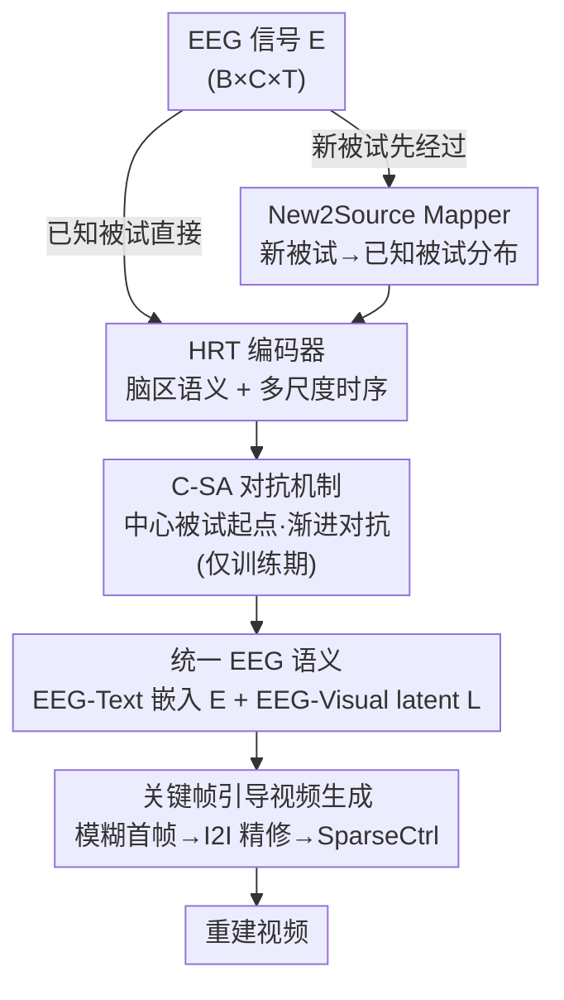

# Cross-Subject EEG-to-Video Reconstruction and Beyond

**会议**: CVPR 2026  
**论文**: [CVF Open Access](https://openaccess.thecvf.com/content/CVPR2026/html/Han_Cross-Subject_EEG-to-Video_Reconstruction_and_Beyond_CVPR_2026_paper.html)  
**代码**: 无  
**领域**: 视频生成 / 脑信号解码（EEG-to-Video）  
**关键词**: EEG-to-Video、跨被试、对抗域对齐、脑区时序编码、新被试泛化

## 一句话总结
针对"不同被试的 EEG 语义分布天然不一致"导致跨被试视频重建崩溃的问题，本文提出 SAM-Net：用脑区+多尺度时序的 HRT 编码器提语义、用"以中心被试为起点、由近及远逐个加入的渐进式对抗（C-SA）"把所有被试拉到统一表征、再用 New2Source Mapper 把新被试 EEG 映射到已知被试分布，最后以关键帧引导的 SparseCtrl 生成连贯视频，在 SEED-DV 上的跨被试与新被试场景都优于 EEG2Video / DynaMind。

## 研究背景与动机
**领域现状**：从脑信号重建视觉内容主要走 fMRI 和 EEG 两条路。EEG 设备便携、廉价、时间分辨率高，更适合重建"动态"视觉内容。前作 EEG2Video 构建了 SEED-DV 数据集并首次打通 EEG→视频，DynaMind 进一步通过显式建模脑区交互和时序动态提升时间一致性。

**现有痛点**：这些方法几乎都在**单被试（Single-Subject）**设定下训练和评测——给每个被试单独训一套，换个人就崩。根本障碍是 EEG 信号存在严重的**被试间差异**：同样的视觉刺激，不同人因生理差异、采集时电极摆放/设备配置不同、以及各种杂散噪声，诱发出的 EEG 语义分布差别很大（论文 Fig.1-a 的 T-SNE 里不同被试各自聚成一团）。此外现有方法常常缺少对脑先验的显式建模（脑区功能分化、神经动态的多尺度性），抓不住分布在特定脑区、特定时间尺度上的细粒度神经模式。

**核心矛盾**：要做跨被试，就得有一套**对所有被试统一、且能泛化到全新被试**的 EEG 语义表征；但被试间分布漂移巨大，而新被试又面临"分布更陌生 + 数据极度稀缺（EEG 采集昂贵耗时）"的双重困境。已有跨被试思路要么给每个被试配一个专属编码分支（被试一多就爆）、要么靠多专家/记忆库存异质信息（存储和算力开销大、且多为 fMRI 设计、忽视 EEG 时序），要么像情绪识别里那样把所有被试逼近一个"目标被试"——但目标被试随机或人工指定，一旦选到一个有歧义的被试，整体对齐就跑偏。

**本文目标**：拆成三个子问题——(1) 怎么从 EEG 提到鲁棒、带脑先验的时空语义；(2) 怎么把多个已知被试统一到一个稳定表征、且不依赖一个拍脑袋指定的目标被试；(3) 怎么在数据稀缺下让模型快速适配新被试、又不破坏已知被试的已学表征。

**切入角度 + 核心 idea**：与其随机指定对齐目标，不如**先算出最能代表整个群体的"中心被试"，再让其他被试由近及远逐个加入对抗训练**（C-SA）；新被试不去 fine-tune 整个模型（会扰动已知被试），而是**只在编码阶段做新↔已知被试的语义互映射**（New2Source）；生成端把 EEG 语义嫁接到关键帧可控的 SparseCtrl 上，桥接 EEG 与文本/视觉的模态鸿沟。

## 方法详解

### 整体框架
SAM-Net 的输入是 EEG 信号 $E \in \mathbb{R}^{B \times C \times T}$（批量、电极通道数、时间步），输出是两路对齐目标：对齐文本的 EEG-Text 嵌入 $\mathcal{E} \in \mathbb{R}^{B \times 77 \times 768}$ 和对齐视频的 EEG-Visual latent $L$。监督信号来自把视频帧用 VAE 编码成 latent、把 BLIP 生成的视频描述用 CLIP 文本编码器编码成嵌入，让 HRT 编码器去对齐这两者。整条管线是：EEG（若来自新被试先过 New2Source Mapper）→ HRT 编码器提取脑区+多尺度时序语义（训练时叠加 C-SA 对抗）→ 得到 EEG-Text 嵌入与 EEG-Visual latent → 由 latent 解码出模糊首帧、经 I2I 精修成关键帧 → 关键帧+latent+嵌入一起喂给 SparseCtrl 这类 T2V 模型生成最终视频。

### 关键设计

**1. HRT 编码器：用脑区分区 + 多尺度时序，把脑先验显式塞进 EEG 表征**

针对"现有方法不建模脑区功能分化和神经动态多尺度性、抓不住细粒度模式"这个痛点，HRT（Hybrid Region-Temporal）编码器分三步走。先做 **EEG 增强**抑制被试特异干扰：往信号注高斯噪声模拟被试间变异、逼模型忽略个体特异特征去抓跨人不变的刺激响应，再对电极通道做随机 dropout，整体为 $E_{Augment} = \text{RD}(E + N(\mu, \sigma^2))$。然后是 **Region-guided 语义感知**——神经科学表明不同脑区对不同视觉刺激（自然风景 vs 建筑 vs 快速运动物体）响应不同，且基于"区"比基于单个电极更鲁棒；先用电极注意力 $W_{Electrode} = \sigma(\mathbb{L}(\text{ReLU}(\mathbb{L}(\mathcal{AP}(\mathcal{E}_{Augment})))))$ 给各电极加权，再按解剖位置把电极分到 **额叶/顶叶/中央/颞叶/枕叶五个脑区**，每区一个专属 extractor（Conv1D+GELU+BN+Dropout）提特征后拼接过线性层得 $\mathcal{E}_{Spatial}$。最后是 **多尺度时序依赖感知**：EEG 里"缓慢行走的人"和"快速行驶的车"占据的时间跨度差别很大，于是用可学习 Query（类似 BoQ）、对 Key 在时间维做多尺度 1D CNN $K_{tem} = \|_{i \in \{5,11,21\}}[\text{Conv}_i(K)]$，再过注意力 $\mathcal{E}_{temporal} = \bigcirc_{l=1}^{L}\text{Transformer}[\text{Softmax}(\frac{Q^T \cdot K_{tem}}{\sqrt{d}}) \cdot V]$ 捕捉跨时间步的语义依赖。消融里枕叶（控视觉）影响最大、颞叶（控语言）次之，正好印证了脑区先验的合理性。

**2. C-SA 中心化渐进式被试对抗：先找"中心被试"，再由近及远逐个拉齐**

这是本文最核心的跨被试统一机制，针对"逼向随机/人工指定目标被试会跑偏"的痛点。第一步**找中心被试**：对每个被试算其 EEG 样本的平均特征 $f_i = \frac{1}{n}\sum_{j=1}^n x_{ij}$，用余弦距离 $d(i,j) = 1 - \frac{f_i \cdot f_j}{\|f_i\|\|f_j\|}$ 度量被试间距离，把"与其他所有被试平均相似度最高"的那个选为中心被试 $c^* = \arg\max_{i \in S}\{\frac{1}{|S|-1}\sum_{j \neq i}\text{sim}(i,j)\}$——它的分布最能代表整个群体共性，从它出发比从随机被试出发稳得多。第二步**渐进加入**：初始集合 $C_0 = \{c^*\}$，每轮从剩余集合里选离当前已选集合最近的被试 $r_t^* = \arg\min_{r \in R_t} d_{\min}(r, C_t)$ 加进来（由易到难），每加一个就把 $C_t$ 喂进 HRT 训练，直到所有被试都加入。第三步**对抗对齐**：光靠渐进加入还消不掉个体差异，于是接一个**梯度反转层 GRL + 被试分类器**做域对抗——分类器用交叉熵 $\mathcal{L}_{subject} = -\sum_{k=1}^K y_{ik}\log(\hat{y}_{ik})$ 努力预测样本来自哪个被试，而 GRL 在反传时把梯度乘 $-\lambda$（$\frac{\partial \text{GRL}(f)}{\partial f} = -\lambda I$），使 HRT 的实际优化目标变成**最大化**被试分类损失，即学到让分类器分不清来自谁的**被试不变表征**，从而压平 latent 空间里的被试间分布差异。消融里去掉 C-SA 掉点最狠（40 类 video 2-way 从 0.841 掉到 0.799），用固定被试代替中心被试、或直接一次性塞全部被试（去掉渐进）也都明显掉点。

**3. New2Source Mapper：只在编码阶段做新↔已知被试互映射，数据稀缺也能泛化新被试**

针对"新被试分布漂移大 + 数据稀缺，直接 fine-tune 会扰动已知被试"的痛点，本文不动主模型、只学一个轻量映射。思路是用多个已知被试**模拟**出新被试、再与真实新被试少量数据结合。具体三步：先用已知被试数据训一个 Source2New（把已知被试 $\mathcal{S}^p$ 映射成模拟新被试），监督是 $\mathcal{L}_{S2N} = \text{MSE}(\mathcal{S}^p_{new}, \mathcal{S}^{p*}_{new})$，其中 $p$ 是用到的新被试真实数据占比（实验取 15%）；再把训好的 Source2New 作用到剩余 $(1-p)\%$ 的已知被试数据上，生成更多模拟新被试 EEG $\mathcal{S}^{(1-p)*}_{new}$；最后用"模拟 + 真实"的新被试数据一起训 **New2Source Mapper**（把新被试映回已知被试分布），监督 $\mathcal{L}_{N2S} = \text{MSE}(\mathcal{S}, \mathcal{S}^*)$。推理时新被试 EEG 先过 New2Source 对齐到已知被试分布再进 HRT，等于用极少真实数据"借"已知被试群体补出映射关系，避免大规模重训。消融里去掉 New2Source，新被试各项指标全面暴跌（如 40 类 video 40-way 从 0.162 掉到 0.118、SSIM 从 0.257 掉到 0.199）。

**4. 关键帧引导的连续语义视频生成：把 EEG 语义嫁接到 SparseCtrl，桥接 E2V 与 T2V 的鸿沟**

针对"EEG 与文本/视觉存在模态鸿沟、不能直接套 T2V"的痛点，本文复用 SparseCtrl（靠关键帧+稀疏条件控制 T2V）但做了两处适配。其一**自造关键帧**：先用 HRT 编出首帧 latent $L_0$、VAE 解码出一张**模糊首帧** $BF = \text{VAE}(L_0)$ 当结构锚点（保留从 EEG 直接推断的全局构图和空间布局），再把 EEG-Text 嵌入 $\mathcal{E}$ 和 $BF$ 喂进 I2I 模型精修成清晰、语义一致的关键帧 $KF = \text{I2I}(\mathcal{E}, \text{VAE}(L_0))$——相当于先定布局再补细节纹理。其二**替换噪声输入**：T2V 通常从随机噪声起步，但 E2V 和 T2V 任务有 gap，本文改用 EEG-Visual latent $L$ 顶替随机噪声（提供布局和颜色信息），并用 $\mathcal{E}$ 作语义引导，最终 $Video = \text{T2V}(\mathcal{E}, L, KF)$。消融显示去掉嵌入（w/o Embedding）最致命（40 类分类骤降，因为完全没了语义引导），去掉 latent 主要砸 SSIM（丢了色彩/结构），去掉关键帧则分类和视觉相似度双降。

### 损失函数 / 训练策略
两阶段训练。**阶段一**训 HRT 编码器学跨被试不变语义并对齐文本/视觉模态：$\mathcal{L}_1 = \mathcal{L}_{task} + \lambda \mathcal{L}_{subject}$，其中 $\mathcal{L}_{task} = \text{MSE}(\mathcal{E}, \text{HRT}(E)) + \text{MSE}(L, \text{HRT}(E))$ 把 EEG 语义对齐到 BLIP 文本嵌入与 VAE 视频 latent，$\mathcal{L}_{subject}$ 是 C-SA 的被试对抗项。**阶段二**训 New2Source Mapper：先用 $\mathcal{L}_{S2N}$ 训 Source2New，再用 $\mathcal{L}_{N2S}$ 训 New2Source，使新被试与已知被试做交互式语义对齐、获得新被试泛化能力。

## 实验关键数据

数据集为 SEED-DV（20 名被试观看 40 个视觉概念类别的视频片段）。跨被试设定：前 15 名为已知源被试，后 5 名为新被试。除全集 40 类外，还评测 10/20/30 类子集。指标分 video-based / frame-based 的语义级（2-way、40-way 分类准确率）和像素级 SSIM。

### 主实验（跨被试 vs 单被试 SOTA，40 类）

| 设定 | 方法 | Video 2-way↑ | Video 40-way↑ | Frame 2-way↑ | Frame 40-way↑ | SSIM↑ |
|------|------|------|------|------|------|------|
| SS | DynaMind | 0.828 | 0.284 | 0.807 | 0.241 | 0.280 |
| SS | EEG2Video | 0.798 | 0.159 | 0.774 | 0.138 | 0.256 |
| SS | **Ours** | **0.870** | **0.300** | **0.833** | **0.303** | **0.290** |
| CS | Ours (Best) | 0.860 | 0.291 | 0.834 | 0.301 | 0.279 |
| CS | Ours (Average) | 0.841 | 0.228 | 0.810 | 0.262 | 0.280 |

单被试设定下 SAM-Net 全面超越 EEG2Video 与 DynaMind；更关键的是它在更难的**跨被试（CS）**设定下，Best 仍能逼近甚至追平别人的单被试成绩（如 CS Best 的 frame 40-way 0.301 高于两个 baseline 的 SS 0.241/0.138）。

### 新被试重建（New2Source，仅后 5 名新被试）

| 类别数 | Video 2-way↑ | Video 40-way↑ | Frame 2-way↑ | Frame 40-way↑ | SSIM↑ |
|------|------|------|------|------|------|
| 10 (Best) | 0.833 | 0.143 | 0.820 | 0.225 | 0.300 |
| 40 (Best) | 0.826 | 0.162 | 0.745 | 0.136 | 0.257 |
| 40 (Average) | 0.812 | 0.142 | 0.735 | 0.137 | 0.254 |

在完全没见过的新被试上仍能给出可用的重建（40 类 SSIM 0.254），作者归因于 New2Source 把新被试 EEG 分布对齐到了已知被试分布。

### 消融实验

| 配置 | Video 2-way↑ | Video 40-way↑ | Frame 40-way↑ | SSIM↑ | 说明 |
|------|------|------|------|------|------|
| Ours (40 类 CS) | 0.860 | 0.291 | 0.301 | 0.279 | 完整模型 |
| w/o HRT | 0.796 | 0.179 | 0.140 | 0.222 | 去掉脑区+时序编码，全面崩 |
| w/o Occipital | 0.820 | 0.261 | 0.261 | 0.245 | 去枕叶（控视觉）掉得最多 |
| w/o Temporal | 0.824 | 0.269 | 0.255 | 0.243 | 去颞叶（控语言）次之 |
| w/o Embedding | 0.774 | 0.090 | 0.092 | 0.239 | 丢语义引导，40-way 暴跌 |
| w/o Latent | 0.845 | 0.273 | 0.282 | 0.189 | 丢色彩/结构，SSIM 暴跌 |
| w/o KeyFrame | 0.839 | 0.262 | 0.276 | 0.231 | 分类+视觉双降 |

C-SA 与 New2Source 的单独消融（Table 4，Average 设定）：去 C-SA 从 0.841/0.228 掉到 0.799/0.186；用固定被试代替中心被试、或去掉渐进过程也都掉点；新被试上去 New2Source 从 0.162/0.257 掉到 0.118/0.199。

### 关键发现
- **C-SA 贡献最大**：去掉它所有指标都大幅下滑，且"中心被试起点"和"由近及远渐进"各自都有正贡献，验证了不随机指定对齐目标这一设计的价值。
- **脑区先验与生物常识吻合**：枕叶（视觉）> 颞叶（语言）的重要性排序，说明 HRT 学到的脑区语义是有解剖意义的，而非随机拟合。
- **生成端三种条件各司其职**：嵌入管语义（去掉则分类崩）、latent 管色彩结构（去掉则 SSIM 崩）、关键帧管细节锚定（去掉则双降），三者互补缺一不可。

## 亮点与洞察
- **"中心被试 + 渐进对抗"把课程学习思想搬进域对抗**：先找群体几何中心当锚、再由近及远逐个并入，避免了一上来就把差异最大的被试硬塞进对抗导致训练震荡，比"逼向随机目标被试"稳健得多——这个 curriculum-style 的域对齐思路可迁移到任何"多源域分布漂移大"的场景（多设备医疗信号、多传感器时序）。
- **新被试适配不动主干、只学映射**：用已知被试群体"模拟"出新被试再回映，把"数据稀缺 + 怕扰动已学表征"两个矛盾一并化解，是一种很实用的"冻结主模型、外挂适配器"范式。
- **用 EEG latent 顶替 T2V 的随机噪声**：一个很取巧的桥接——既复用了 SparseCtrl 的关键帧可控能力，又把 EEG 推断的布局/色彩直接注入生成起点，绕开了 EEG 与文本的模态鸿沟。

## 局限与展望
- **依赖单一数据集**：全部实验都在 SEED-DV 上，跨数据集/跨采集设备的真实泛化（不同电极数、不同采样率）未验证，而这恰是"跨被试"承诺最该兑现的地方。
- **绝对指标仍偏低**：40 类 40-way 语义准确率只有 0.3 量级、新被试更降到 0.14 量级，离"可靠重建任意视频内容"还很远，EEG→视频本身的信息瓶颈依旧明显。
- **中心被试选取依赖平均特征**：用 EEG 平均特征的余弦相似度找中心被试，对噪声和被试内方差较敏感；若群体本身分多个簇，单一中心被试可能不具代表性，未来可考虑多中心/聚类化的渐进对齐。
- **生成质量受限于 SparseCtrl 上限**：视频连贯性和细节继承自 T2V 基座，EEG 端的贡献更多在语义/布局引导，长时序、复杂运动场景的表现待考。

## 相关工作与启发
- **vs EEG2Video**：EEG2Video 构建 SEED-DV 并首次打通 EEG→视频，但停在单被试；本文继承其数据与生成思路，核心增量是跨被试统一表征（C-SA）与新被试泛化（New2Source）。
- **vs DynaMind**：DynaMind 也建模脑区交互和时序动态来提时间一致性，但同样未解决跨被试问题；本文 HRT 在脑区+多尺度时序基础上，额外用域对抗逼出被试不变表征。
- **vs 逼向目标被试的情绪识别方法（[27] 类）**：它们渐进缩小其他被试到一个"指定目标被试"的距离，但目标随机/人工指定易跑偏、且 fine-tune 新被试会扰动已知被试；本文用"群体中心被试"替代指定目标、用"仅编码阶段映射"替代 fine-tune，两点都更稳。
- **vs 多专属编码器 / 多专家记忆库（fMRI 跨被试方法）**：那类方法给每被试配分支或存异质信息，存储和算力开销大、且多为 fMRI 设计忽视 EEG 时序；本文用统一编码器+轻量映射，被试规模可扩展性更好。

## 评分
- 新颖性: ⭐⭐⭐⭐ 把"中心化渐进域对抗 + 新被试免微调映射"系统性引入 EEG-to-Video 跨被试场景，组合创新扎实。
- 实验充分度: ⭐⭐⭐⭐ 跨被试/新被试/逐脑区/各生成条件消融都齐，但局限在单一数据集 SEED-DV。
- 写作质量: ⭐⭐⭐⭐ 动机层层递进、三大模块对应三个痛点，逻辑清晰；部分公式在 OCR 文本里较碎。
- 价值: ⭐⭐⭐⭐ 跨被试是脑信号视觉解码落地的关键瓶颈，本文给出可扩展且免重训的解法，方向价值高。

<!-- RELATED:START -->

## 相关论文

- [\[ICLR 2026\] BindWeave: Subject-Consistent Video Generation via Cross-Modal Integration](../../ICLR2026/video_generation/bindweave_subject-consistent_video_generation_via_cross-modal_integration.md)
- [\[CVPR 2026\] UniAVGen: Unified Audio and Video Generation with Asymmetric Cross-Modal Interactions](uniavgen_unified_audio_and_video_generation_with_asymmetric_cross-modal_interact.md)
- [\[CVPR 2026\] Accelerating Diffusion-based Video Editing via Heterogeneous Caching: Beyond Full Computing at Sampled Denoising Timestep](accelerating_diffusion-based_video_editing_via_heterogeneous_caching_beyond_full.md)
- [\[CVPR 2026\] SMRABooth: Subject and Motion Representation Alignment for Customized Video Generation](smrabooth_subject_and_motion_representation_alignment_for_customized_video_gener.md)
- [\[CVPR 2026\] RecEdit-Drive: 3D Reconstruction-Guided Spatiotemporal Video Editing for Autonomous Driving Scenes](recedit-drive_3d_reconstruction-guided_spatiotemporal_video_editing_for_autonomo.md)

<!-- RELATED:END -->
