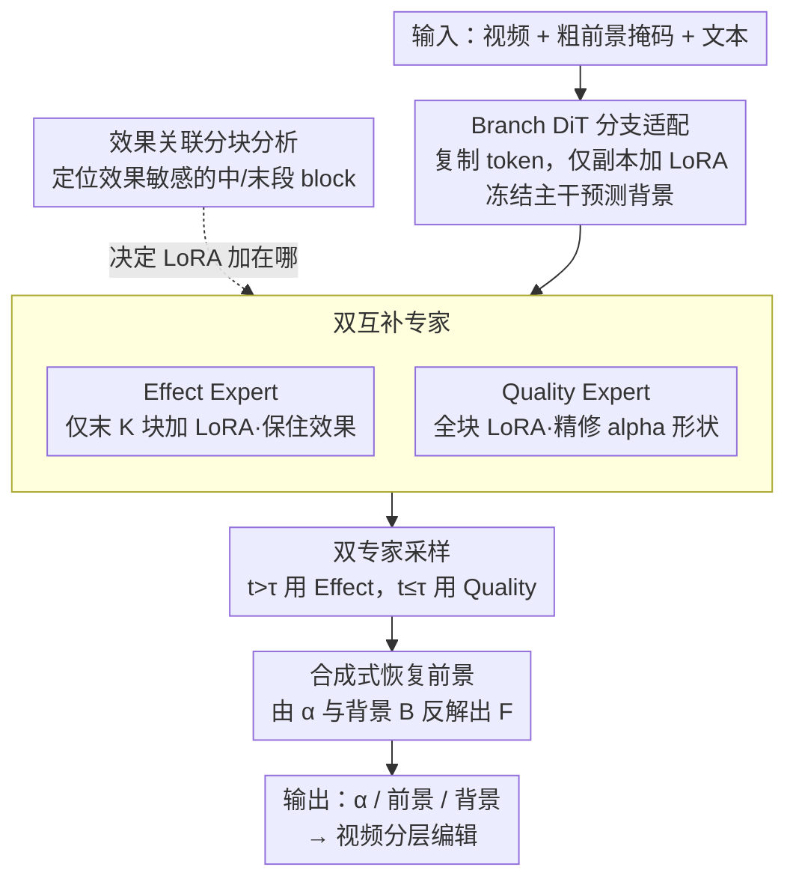

# EasyOmnimatte: Taming Pretrained Inpainting Diffusion Models for End-to-End Video Layered Decomposition

**会议**: CVPR 2026  
**论文**: [CVF Open Access](https://openaccess.thecvf.com/content/CVPR2026/html/Hu_EasyOmnimatte_Taming_Pretrained_Inpainting_Diffusion_Models_for_End-to-End_Video_Layered_CVPR_2026_paper.html)  
**代码**: https://github.com/GVCLab/EasyOmnimatte  
**领域**: 视频生成 / 视频分层 / 扩散模型  
**关键词**: 视频 Omnimatte, 视频分层分解, 扩散先验复用, LoRA 专家, alpha matte

## 一句话总结
把一个预训练的视频 inpainting 扩散模型「反过来用」——不再去抹掉前景及其阴影/反光，而是微调它去**提取**前景层及其关联效果，并通过「效果专家 + 质量专家」双 LoRA 在扩散高/低噪声阶段分工采样，第一次实现了**端到端、前馈、十秒级**的视频 omnimatte（旧的 Gen-Omnimatte 需要数百秒逐层优化）。

## 研究背景与动机
**领域现状**：视频 omnimatte 的目标是把一段视频拆成「前景层 + 它附带的所有视觉效果（影子、倒影、溅起的水花/烟雾）」和「干净背景层」，满足标准 alpha 合成方程 $V = \alpha \odot F + (1-\alpha)\odot B$。主流做法（Omnimatte 系列、Gen-Omnimatte）要么靠光流/运动假设做自监督优化，要么是多阶段、推理时优化的 pipeline——先生成背景、再对每个前景层做几千步 test-time optimization。

**现有痛点**：这些方法慢（Gen-Omnimatte 每层要几分钟、整体 360 秒级），且**没有充分吃到生成大模型的先验**，分解质量受限：背景变化快时会出现「背景渗漏到前景层」、颜色失真；纯学习式 matting（BGMv2、MatAnyone）虽然快，却抓不住关联效果（影子区域 alpha 给得过高，把背景颜色污染进前景），而且对非人类目标泛化差。

**核心矛盾**：能干净抹掉一个物体「连同它的影子」的视频 inpainting 模型，**必然先「感知」到了这些效果**才能抹掉它——这份「感知效果」的能力被白白浪费在了「抹除」任务上。

**本文目标**：(1) 把这份感知能力**复用**到互补任务——前景层（含效果）的提取；(2) 做成单模型、单阶段、前馈，而不是多阶段优化。

**切入角度**：既然 inpainting 模型遵循「先感知效果、再消除效果」的内在流程，那就微调它，让它把「感知到的效果」输出成前景层而不是抹掉。作者用 LoRA 在合成 matting 数据上微调 inpainting 模型直接预测 alpha——但踩到一个反直觉的坑：**把 LoRA 加到所有 DiT block 上，模型能抠出前景主体，却系统性地丢失影子/倒影**，即使训练目标里明确包含了这些效果。

**核心 idea**：通过分块分析发现「效果感知集中在中段 block、却在末段 block 被主动抑制」，于是不在全部 block 加 LoRA，而是训练两个互补专家——**Effect Expert**（只在末段 block 加 LoRA，保住效果）与 **Quality Expert**（全块 LoRA，精修 alpha 形状）——并在扩散采样中按噪声高低交替使用，用「一次扩散的算力」拿到两者的优点。

## 方法详解

### 整体框架
输入是视频 $V$、逐帧的「粗前景掩码」$M$（只框物体、不含效果）和一句描述背景的文本 $c$；输出是前景层 $F$、alpha matte $\alpha$ 和恢复的背景层 $B$。整条 pipeline 建立在一个冻结的预训练视频 inpainting DiT 之上：先把输入 token **复制一份**、只在副本上挂 LoRA，造出「Branch DiT Block」让冻结主干继续预测背景、分支预测 alpha（Sec.3.1）；再通过对各 block 的「效果关联分块分析」找出哪些 block 负责感知/抑制效果（Sec.3.2）；据此训练 Effect/Quality 两个专家，并在扩散采样时以阈值 $\tau$ 在高噪声阶段用 Effect Expert、低噪声阶段用 Quality Expert（Sec.3.3）；最后由 $\alpha$ 与背景 $B$ 反解出前景 $F$，供视频编辑（重定时、图层复制、缩放、加特效）使用。

### 关键设计

**1. Branch DiT 分支适配：让冻结的 inpainting 模型一次前向同时吐背景和 alpha**

痛点是：直接拿 inpainting 模型微调成 matting 会破坏它「抹除效果」的原生先验，且数据稀缺。作者的做法是保留 inpainting 模型的完整输入方案（视频帧 + 逐帧前景掩码 $M$ + 文本 $c$，经通道拼接投影成视觉 token），然后把视觉 token 连同其旋转位置编码 RoPE **复制一份**，token 维度拼接成两组并行 token：原始组继续走 inpainting 预测背景，复制组专门预测 alpha。LoRA **只挂在复制组 token 上**——于是冻结主干在「未被污染的原始 token」上照常预测背景 $\hat B$，LoRA 分支在复制 token 上把输出从「背景预测」重定向到「alpha 估计」。作者选择预测 alpha $\hat\alpha$ 而非直接预测前景 $\hat F$，因为 alpha 在整帧都有良定义（纯背景区为 0），是更稳定良定的回归目标。前景层最后由合成方程反解得到：

$$\hat F_f = \frac{\mathrm{clip}\big(I_f - (1-\hat\alpha_f)\cdot \hat B_f\big)}{\hat\alpha_f + \epsilon}$$

其中 $I_f$ 是原帧，$\hat B_f$ 是 inpaint 出的背景，$\epsilon$ 防止除零。这样背景由冻结主干给出、alpha 由分支 token 给出，互不破坏。

**2. 效果关联的分块分析：定位「先感知后抑制」效果的 block，为放 LoRA 提供依据**

即便用上所有 Branch DiT block，模型仍抓不住效果——作者怀疑 inpainting 内部遵循「先感知效果、再消除效果」的顺序过程，于是做 block 级探针。对每个前景像素 $p$，基于该 block 的自注意力图 $W$ 定义「效果关联分数」，度量该像素把多少注意力投向效果区域 $M^e$：

$$s(p) = \frac{\sum_{y\in M^e} W_{p,y}}{\sum_{x\in I} W_{p,x}}$$

由此得到第 $b$ 个 block、第 $f$ 帧的效果注意力图 $S_{f,b}$。再算一个归一化的 block 贡献分数 $C_b$（把效果掩码 $M^e_f$ 内的激活在所有 $N$ 帧上求和、对全部 block 归一）：

$$C_b = \frac{\sum_{f=1}^{N}\sum_p (S_{f,b}\odot M^e_f)}{\sum_{b=1}^{B}\sum_{f=1}^{N}\sum_p (S_{f,b}\odot M^e_f)}$$

其中效果掩码 $M^e_f$ 由「二值化 alpha」与「膨胀后前景掩码的补集」取交得到，把效果区从物体本身里隔离出来。沿曲线的波谷把模型划成三段：**初始段**视野大、编码场景上下文；**中段**最强地捕捉效果的空间结构（影子）；**末段**反而**主动抑制**效果相关特征。这条「中段感知、末段抑制」的曲线，正是后面决定「LoRA 加在哪」的依据——把 LoRA 加到负责抑制效果的后段，才能阻止它继续抑制效果。

**3. 双互补专家：用注意力掩码把「保效果」和「精形状」拆给两个 LoRA 专家**

基于上面的发现，作者训两个专家而非一个。**Effect Expert** $G_E$ 只在 inpainting DiT 的**最后 $K$ 个 block**挂 LoRA：

$$\Theta_E := \{\,\mathcal{B}(L_b)\mid b\in(B-K,\,B]\,\}$$

$\mathcal{B}$ 是「分支出 LoRA」操作。动机直接来自分块分析——只动那些会抑制效果的后段 block，避免为 alpha 预测训练的 LoRA 干扰模型原生的效果感知。训练时还改了自注意力掩码，让 inpainting 的 query token **不去注意** matting token，从而 inpainting 分支不受影响、其中间表征反过来给「抓效果分支」提供稳定引导。**Quality Expert** $G_Q$ 则在**全部 block**加 LoRA（$\Theta_O := \{\mathcal{B}(L_b)\mid b\in[1,B]\}$），并掩掉 inpainting token 与 matting token 之间的注意力——此时训练 Quality Expert 等价于直接微调 inpainting 模型本身，不受冻结分支影响，能快速拟合 matting 数据、做出形状精确的高质量 alpha，但代价是它**完全抓不住效果**。两个专家恰好互补：Effect Expert 保效果但边界糙，Quality Expert 边界精但丢效果。

**4. 双专家采样：按扩散噪声高低交替两专家，用半次扩散拿全部优点**

如果把两个专家各跑一遍完整扩散再融合，算力翻倍。作者利用扩散/流匹配「从高噪声到低噪声渐进生成」的本性——**主体内容和效果在早期高噪声阶段成形，细节在后期低噪声阶段精修**——于是用阈值 $\tau$ 切换专家：

$$G = \begin{cases} G_E & \text{if } t > \tau \\ G_Q & \text{if } t \le \tau \end{cases}$$

即高噪声步用 Effect Expert 生成「带效果的粗 omnimatte」，低噪声步交给 Quality Expert 精修 alpha 形状。实验中 $\tau=0.5$（由 Fig.9 选出）。这是经典 coarse-to-fine，但巧在两段共用一条扩散轨迹，**不需要两次完整扩散**，因此「无额外计算开销」就同时拿到高保真效果 + 精确 matte。用户还能调 $\tau$：调小偏 matting 精度、调大偏效果显著。

### 损失函数 / 训练策略
以 Lee 等人提供的视频 inpainting 模型（基于开源视频生成框架 Wan）初始化，端到端微调 8000 步，AdamW，学习率 $1\times10^{-3}$，2×H100。Effect/Quality 专家的 LoRA 秩分别为 128 / 64，采样阈值默认 $\tau=0.5$。训练数据为合成：把带高质量 alpha 标注的前景视频合成到大规模高分辨率背景视频上，前景掩码 $M$ 直接由 GT alpha 得到，并对前景做随机缩放/旋转/平移增强；用一系列变换（错切、模糊、调色）从前景 matte 生成「伪影子」来模拟前景效果。

## 实验关键数据
评测在 DAVIS 与互联网真实视频上进行。因缺少带标注的测试数据，作者用「重合成视频 vs 原视频的感知损失」和「批量合成到多个背景上、看对背景视频分布的扰动」两类无参考指标，外加 28 名用户对 20 个视频共 1680 条意见的人评。

### 主实验

| 数据集/方式 | PSNR↑ | SSIM↑ | WE↓ | FVD↓ |
|------|------|------|------|------|
| BGMv2 | 26.61 | 78.78 | 101.04 | 168.31 |
| MatAnyone† | 26.12 | 78.68 | 100.46 | 146.44 |
| Gen-Omnimatte（优化式） | 24.35 | 69.36 | 101.33 | 116.32 |
| **EasyOmnimatte（本文）** | 26.23 | 78.83 | **100.94** | **105.48** |

本文在 FVD（合成到新背景后的分布保真）上明显最好（105.48 vs Gen-Omnimatte 116.32），SSIM 最高；PSNR 与纯 matting 基线相当但显著优于优化式的 Gen-Omnimatte。更关键的是速度：从数分钟/层降到 **<10 秒**（整体由 360s 级降到 10s 级），快了一个数量级以上。†表示 MatAnyone 需配合阴影检测 SSIS-v2 才能勉强带上效果。

人评（0–5 分）差距更大：

| 方法 | 综合↑ | 前景完整↑ | 效果和谐↑ | 时序一致↑ |
|------|------|------|------|------|
| BGMv2 | 2.26 | 1.78 | 2.96 | 2.04 |
| MatAnyone† | 2.82 | 2.83 | 2.60 | 3.02 |
| Gen-Omnimatte | 2.85 | 2.45 | 3.36 | 2.74 |
| **EasyOmnimatte** | **4.08** | **4.07** | **3.97** | **4.21** |

### 消融实验

| 配置 | 现象/说明 |
|------|---------|
| 注意力掩码 Type A（分支 token 自由互通） | 背景预测被污染，连带前景分解变差 |
| 注意力掩码 Type B | 仅保留 alpha→背景注意力路径，增强效果感知，但 alpha 质量仍差 |
| 注意力掩码 Type C（完全隔离训练 + 推理用 C） | 最终方案：Quality 训练≈直接微调 inpainting，能快速形成高质量 alpha |
| Branch DiT 放初始/中段/末段（Fig.8 a-c） | 把 LoRA 加到「负责抑制效果的后段」时，效果保留提升最显著 |
| 仅 Effect Expert（Fig.8 d） | 效果强、但 matte 边界精度下降 |
| 仅 Quality Expert（Fig.8 e） | 主体精度高、但完全丢失效果 |
| **Full（双专家采样）** | 兼得效果保真 + 形状精确 |
| 阈值 $\tau$（Fig.9，合成验证集用 MSE 分别评前景/效果） | $\tau$ 小偏 matting 精度、大偏效果，0.5 为平衡点 |

### 关键发现
- **「LoRA 加在哪」比「加多少」更关键**：分块分析显示效果感知集中在中段、被末段抑制；只把 LoRA 加到末段（Effect Expert）才能保住效果，全块加反而抑制效果——这正是「naive 全块微调丢影子」的根因。
- **两个专家天生互补**：单独任一专家都有明显短板（Effect 糙边界、Quality 丢效果），双专家采样以同一条扩散轨迹合并优点，且不增算力。
- **效果显现于 FVD 与人评**：FVD 与人评（尤其「前景完整 4.07、时序一致 4.21」）的大幅领先，说明分层结果合成到新背景时更和谐、信息损失更小，而 PSNR/SSIM 这类逐像素指标对「效果是否保留」不敏感。

## 亮点与洞察
- **「抹除 ↔ 提取」的对偶视角**：把「能干净抹掉影子的模型 = 已经感知到影子的模型」这一观察，转成「微调它去输出影子而非删除影子」，是非常漂亮的先验复用，避免了从零训练 matting 大模型的数据困境。
- **用注意力探针定位功能 block**：效果关联分数 + block 贡献分数把「先感知后抑制」的内部机制量化出来，并直接指导 LoRA 放置位置——这套「分析→设计」闭环可迁移到其他「想复用某种生成先验」的任务。
- **沿扩散噪声时间轴做专家路由**：把 coarse-to-fine 落到「高噪声步用保效果专家、低噪声步用精修专家」，共享一条采样轨迹做到「零额外开销融合两个模型」，这个调度思路对任何「粗结构 vs 细节」需求不同的扩散任务都有借鉴价值。
- **冻结主干 + 复制 token + 分支 LoRA** 的结构让「背景预测」与「alpha 预测」在同一前向里互不破坏，是把单任务大模型扩成多输出的轻量做法。

## 局限与展望
- **强依赖底座 inpainting 模型**：作者承认方法能力上限被基座的感知/生成能力锁死，换更弱的底座可能整体退化。
- **训练数据是合成的伪影子**：前景效果靠错切/模糊/调色合成的「伪 shadow」近似，真实复杂效果（强反光、水花、烟雾）与合成分布的差距可能限制泛化；论文也缺真实标注测试集，只能用无参考指标 + 人评间接评估。
- **PSNR 与纯 matting 基线持平**：逐像素指标上并未超越 BGMv2，优势主要体现在「带效果的分层质量」上，对「不在意效果、只要锐利人像 matte」的场景增益有限。
- **可改进**：把这套「分块分析 + 专家适配」框架推广到更多生成模型（作者列为 future work）；自动选 $\tau$ 或按内容自适应切换专家；引入更真实的效果数据合成或自监督真实效果信号。

## 相关工作与启发
- **vs Gen-Omnimatte（优化式）**：Gen-Omnimatte 两阶段——先生成背景、再对每层做几千步 test-time optimization，慢且有误差传播、颜色失真、快速背景变化时背景渗漏。本文把背景与前景分层做成**单模型端到端前馈**，<10 秒、FVD 105.48 vs 116.32，且用的就是同一族 removal/inpainting 先验，只是「反向」用。
- **vs BGMv2 / MatAnyone（学习式 matting）**：它们快但抓不住关联效果（影子区 alpha 过高→污染前景颜色），对非人类目标泛化差；需借助阴影检测后处理仍次优。本文靠生成先验天然带上效果，人评「效果和谐」3.97 远高于二者。
- **vs Omnimatte 系列（运动/光流自监督）**：旧 Omnimatte 依赖平面单应/非刚性 warp/3D 表示等运动假设，假设失效时严重退化。本文不依赖运动假设，靠扩散生成先验直接前馈分层。

## 评分
- 新颖性: ⭐⭐⭐⭐⭐ 「抹除模型反向用作提取」+ 分块分析定位效果 block + 沿噪声轴的双专家路由，思路新且自洽
- 实验充分度: ⭐⭐⭐⭐ 主结果/人评/多组消融齐全，但缺真实标注测试集、靠无参考指标与伪影子合成，PSNR 未超 matting 基线
- 写作质量: ⭐⭐⭐⭐⭐ 动机—分析—设计闭环讲得清楚，图示与公式到位
- 价值: ⭐⭐⭐⭐⭐ 第一个端到端、秒级视频 omnimatte，直接落地视频编辑/特效，范式意义强

<!-- RELATED:START -->

## 相关论文

- [\[CVPR 2026\] STARFlow-V: End-to-End Video Generative Modeling with Autoregressive Normalizing Flows](starflow-v_end-to-end_video_generative_modeling_with_autoregressive_normalizing_.md)
- [\[CVPR 2026\] MoCha: End-to-End Video Character Replacement without Structural Guidance](mocha_end-to-end_video_character_replacement_without_structural_guidance.md)
- [\[CVPR 2026\] Pantheon360: Taming Digital Twin Generation via 3D-Aware 360° Video Diffusion](pantheon360_taming_digital_twin_generation_via_3d-aware_360_video_diffusion.md)
- [\[CVPR 2026\] RFDM: Residual Flow Diffusion Models for Video Editing](rfdm_residual_flow_diffusion_models_for_video_editing.md)
- [\[CVPR 2026\] Diff4Splat: Repurposing Video Diffusion Models for Dynamic Scene Generation](diff4splat_controllable_4d_scene_generation_with_latent_dynamic_reconstruction_m.md)

<!-- RELATED:END -->
