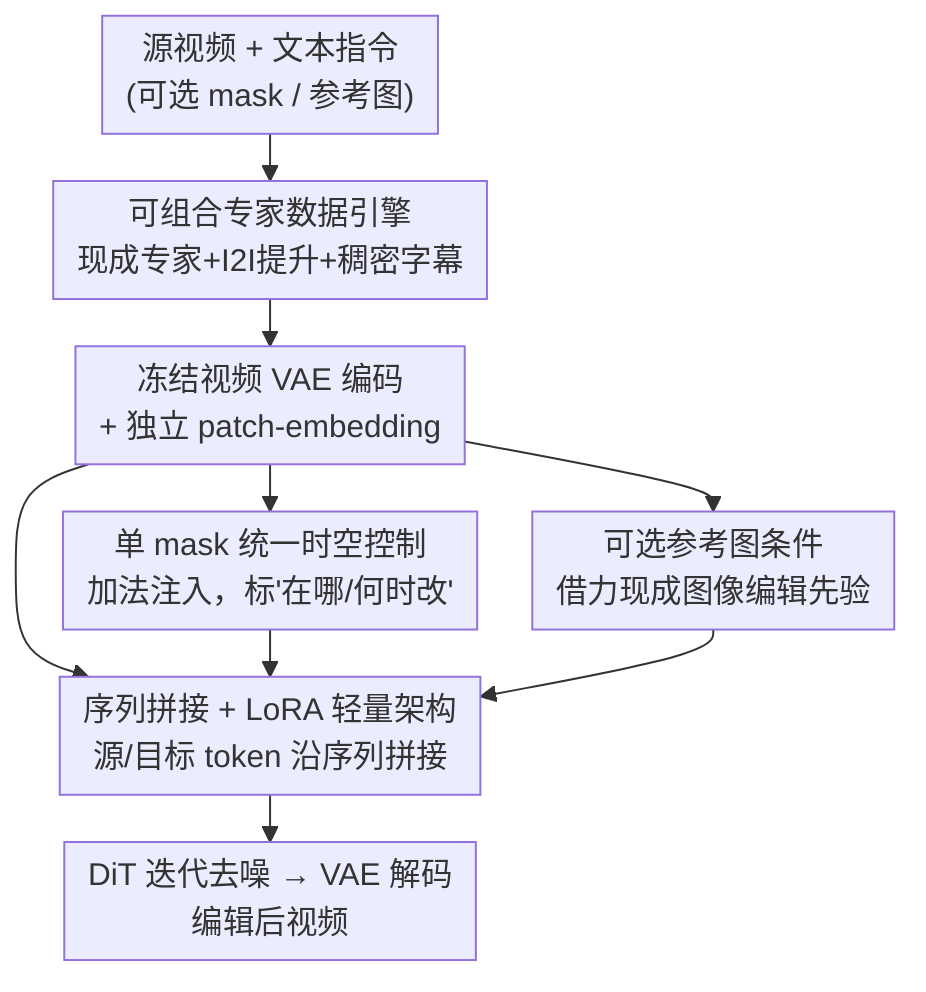

# EasyV2V: A High-quality Instruction-based Video Editing Framework

**会议**: CVPR 2026  
**论文**: [CVF Open Access](https://openaccess.thecvf.com/content/CVPR2026/html/Mai_EasyV2V_A_High-quality_Instruction-based_Video_Editing_Framework_CVPR_2026_paper.html)  
**代码**: [项目主页](https://snap-research.github.io/easy-v2v/)  
**领域**: 视频生成 / 指令视频编辑 / 扩散模型  
**关键词**: 指令视频编辑、V2V 数据引擎、序列拼接条件、LoRA 微调、时空 mask 控制

## 一句话总结
EasyV2V 把"指令视频编辑"拆成数据、架构、控制三件事各取最省力的方案——用现成专家模型 + 图像编辑提升 + 稠密字幕视频拼出一套约 800 万规模的 V2V 配对数据，在预训练 T2V 骨干上只加几个零初始化 patch-embedding + LoRA、用序列拼接注入源视频，再用一段 mask 视频统一表达"在哪改、何时改"，最终在 EditVerse 基准上以 VLM 评分 7.73/9 超过已发表方法、并行工作乃至商业系统。

## 研究背景与动机

**领域现状**：图像编辑这几年靠成熟的 I2I 配对数据 + 在预训练图像生成器上微调，已经做到很高的视觉保真度和指令跟随；而视频编辑（V2V）明显落后，要么是训练自由（training-free）地改造预训练生成器、脆弱又慢，要么是针对窄任务（ControlNet 式条件、视频补全、人物重演）单独训练。通用的指令视频编辑器虽然能覆盖更多编辑类型，但在保真度和可控性上仍逊于图像端。

**现有痛点**：作者把问题归到三个一直没被系统研究的设计轴上。第一是**数据**——造高质量 V2V 配对数据本就比 I2I 难（要多帧一致 + 忠实改动），现有路线要么靠"一个全能教师模型自训练"（前提是已经有人解决了这个问题）、要么"为每类编辑训一堆专家"（贵、难维护、换骨干就得重来）。第二是**架构**——怎么把源视频注入生成器没有共识，channel 拼接省 token 但把源/目标信号纠缠在一起，全量微调又容易灾难性遗忘。第三是**控制**——以前只控"在哪改"（骨架、分割、深度、mask），却没人把"**何时改、怎么演变**"当成一等公民（比如"1.5 秒后房子着火、火焰逐渐变大"）。

**核心矛盾**：视频编辑的高质量同时受制于这三条，单独优化任意一条都不够；而过去要么堆教师模型、要么堆专家、要么改架构，成本高且彼此割裂。

**切入角度**：作者的关键观察（论文 Figure 2）是——**现代预训练 T2V 模型本身已经"会"做常见编辑**，不微调也能模仿风格化、属性渐变等效果。这说明视频编辑的"怎么改"其实大部分已经长在骨干里了，需要的只是最小化的适配去把这种能力解锁出来，而不是从头堆庞大系统。

**核心 idea**：在数据、架构、控制三轴上都选"借力现成、最小改动"的方案——用**可组合的现成专家**造数据、用**序列拼接 + LoRA**轻量适配骨干、用**一段 mask 视频**统一时空控制，组合成一个简单但 SOTA 的指令视频编辑器。

## 方法详解

### 整体框架
EasyV2V 的输入是"源视频 + 文本指令"，可选再加"编辑 mask"和"参考图"，输出是按指令编辑后的视频。它支持 `视频+文本`、`视频+mask+文本`、`视频+mask+参考图+文本` 等灵活组合。整套系统由两大块支撑：一个离线的**数据引擎**（把现成专家、图像编辑、稠密字幕视频拼成约 800 万 V2V/I2I 配对，外加过渡监督），和一个在线的**轻量编辑架构**（在冻结的 T2V 骨干上，把源视频/mask/参考图编码后用序列拼接或加法注入，只训练 LoRA + 新 patch-embedding）。

具体到模型前向：源视频 $Z_{src}$、目标视频 $Z_{tgt}$、mask $Z_{msk}$、可选参考图 $Z_{ref}$ 都用**冻结的视频 VAE** 编码到 latent，各自过一个**独立的 patch-embedding 层**；mask 以**加法**融进源视频 token，源视频 token 与噪声目标 token、可选参考 token 沿**序列维拼接**送入 DiT，DiT 主干冻结、只在注意力层加 LoRA，迭代去噪后再解码出编辑视频。下面把这条管线拆成几个贡献节点。

### 关键设计

**1. 可组合专家数据引擎：不训教师、不养专家，而是拼现成模块造约 800 万配对**

这一条直接打数据痛点：造 V2V 配对要么靠一个全能教师（不现实）、要么养一堆专家（贵且难迭代）。作者提出第三条路——**选取带"快速逆"的现成专家并组合它们**（如 edge↔video、depth↔video 互为正逆，监督信号天然好拿），再用过滤和"偏好有可靠逆的专家"来压住不同专家间的异质 artifact。引擎里有若干并列管线：**人物动画**（用 Wan Animate 在姿态/表情一致的前提下换演员、换衣换风格）、**物体移除/插入**（开集检测→LLM 清洗标签→视频分割→视频补全→人工筛→VLM 写指令）、**演员变形**（在生成式视频模型上搭零样本 V2V 管线，做四足→四足、鸟→鸟等同类替换）、**视频风格化**（抽 edge 图保结构、图像编辑改首帧风格、再生成风格化视频）、**可控视频生成**（depth/HED/Canny/光流/姿态等控制信号配对）。

更关键的是两类"放大"手段。其一，**把 I2I 提升成 V2V**：高质量图像编辑数据多、视频编辑数据少，于是把图像编辑对当监督——既可当"单帧视频"直接训，也可给源图和编辑图**施加同一条平滑 2D 仿射轨迹**（小幅旋转、缩放、平移插值），造出"只在语义编辑处不同、其余只是相机运动"的伪 V2V 对，把图像监督信号引进来又补上时序结构。其二，**稠密字幕 T2V 续接**：从带时间窗字幕的视频里，取字幕区间**之前**的片段当源、区间**之内**的片段当目标，用 LLM 把字幕（"他坐下"）转成祈使指令（"让他坐下"），专门补上常规 V2V 语料里稀缺的**动作类编辑**。最终汇成约 800 万配对（约 430 万开源/授权 + 约 340 万自建），作者称是已发表工作里最全面的，并逐源做了消融。

**2. 序列拼接 + LoRA 的轻量架构：在冻结骨干上"最小改动"解锁编辑能力**

针对"怎么注入源视频"和"会不会灾难性遗忘"两个痛点，作者做了两个明确取舍。注入方式上对比了 **channel 拼接**（把源 latent 和噪声 latent 沿通道拼，只改首个 patch-embedding、token 少更快）与**序列拼接**（把源视频 token 追加到噪声 token 序列后面），实验（论文 Table 3）显示序列拼接质量稳定更高——代价是 token 更多、效率低，但好处是源/目标各自保持"干净角色"不纠缠，指令跟随和局部细节都更好。具体做法是给源视频、mask、参考图各配**独立 patch-embedding**，把 $Z_{src}$ 放前、$Z_{tgt}$ 放后，使模型学到类似"视频续接"的 in-context 编辑行为（恰好和稠密字幕数据呼应）。

微调策略上选 **LoRA（rank=256）+ 只训新 patch-embedding**、骨干和 VAE 全冻结、新参数零初始化。理由很具体：在他们这个训练规模下，全量微调容易训练不稳、源视频不一致、还会过拟合并灾难性遗忘预训练知识；LoRA 反而**迁移更快、过拟合更少、保住先验、还方便日后换骨干**。论文 Table 3 直接量化了这点：`LoRA w/ SeqCat`（他们的最终方案）@40K 步 VLM 评分 7.47，而 `Full w/ SeqCat` 只有 3.94——全量训练在这个规模下明显劣化。

**3. 单 mask 视频统一时空控制：用一段 mask 同时表达"在哪改"和"何时改"**

以往控制信号都缺一个维度——**编辑何时发生、怎么演变**。EasyV2V 用**一段二值 mask 视频** $M$ 统一这件事：像素标"在哪改"（区域补全/移除），帧标"何时改、改多久"（时间区间）。mask 经独立 patch-embedding 编码后**以加法注入源视频 token**而非拼进序列——因为 mask 是低频信号，加法即可有效融合，省下 token 预算（不为 mask 引入新 token），也让模型更易移植到未来骨干。为支持"渐变式编辑"，数据侧专门合成**过渡监督**：给定编辑起始时刻 $t_i$，构造目标 $V' = [V^{src}_{t_0:t_i},\, V^{tgt}_{t_i:t_N}]$，并派生一个"$t_i$ 之后才激活编辑"的逐帧 mask，再用线性混合等过渡算子让效果在 $t_i$ 处自然展开。推理时若不给 mask，就默认空白 mask、退化成纯指令编辑。相比关键帧提示或 token 调度，单 mask 视频"直接、可微、易与文本/参考图组合"，代价只是要给一段轻量可编辑的 mask 序列。

**4. 可选参考图条件：借现成图像编辑先验，又不被它的瑕疵拖累**

为在有强图像编辑器时蹭它的红利，模型支持**可选参考图**：训练时可从目标视频里采一帧当参考，推理时可由外部图像编辑模型改源视频某帧得到、或用户直接给。但参考图常不完美（如 Qwen-Image-Edit 可能带 spurious 的缩放），所以训练时对参考图做**随机裁剪/旋转**并以一定概率（50%）**随机丢弃**，让模型在参考缺失或有噪时依然鲁棒。参考 token 被拼到**序列末尾**——这样既固定了 $Z_{src}$ 与 $Z_{tgt}$ 之间的 token 距离，又让 $Z_{ref}$ 靠近 $Z_{tgt}$ 以提供更强引导。带参考时风格贴合和细节特异性更好，不带时也不崩。

### 损失函数 / 训练策略
基座为预训练 **Wan-2.2-TI2V-5B** + Wan-2.2-VAE（时空压缩比 $4\times16\times16$），训练分辨率 $81\times832\times480$（补充材料另给 $81\times1280\times704$ 的高清结果）。LoRA rank=256、恒定学习率 $1\times10^{-4}$、AdamW 优化器，在 32 张 H100 上训练，所有新参数零初始化。参考图随机丢弃和视频过渡增强各以 50% 概率施加。

## 实验关键数据

### 主实验
在 **EditVerse 基准**（原 20 种编辑类型，剔除训练未覆盖的如相机位姿变化后，取 16 类、160 段视频）上评测，主指标为 **VLM 评分**（GPT-4o 在 prompt 跟随 / 编辑质量 / 背景一致性三项各 0-3、合计 0-9，作者称其与人工判断最一致），辅以帧/视频级文本对齐和 PickScore。

| 方法 | VLM 编辑质量↑ | Pick Score↑ | 文本对齐(帧)↑ | 文本对齐(视频)↑ |
|------|--------------|-------------|--------------|----------------|
| TokenFlow（训练自由） | 5.02 | 19.59 | 25.10 | 22.49 |
| Se\~norita-2M（带参考, Qwen-Edit） | 6.45 | 20.26 | 26.51 | 23.24 |
| InsViE-1M（带参考） | 4.36 | 19.25 | 25.06 | 21.28 |
| InsV2V | 4.95 | 19.33 | 24.98 | 22.74 |
| Runway Aleph（商业闭源） | 7.48 | 20.56 | 27.96 | 24.68 |
| EditVerse（并行未发表, 无代码） | 7.64 | 20.33 | 27.70 | 25.37 |
| **EasyV2V（无参考）** | **7.73** | 20.36 | 27.59 | 24.46 |
| EasyV2V（带参考, Flux-Kontext） | 7.53 | 20.61 | **28.10** | 25.13 |

无参考版即以 **7.73/9** 的 VLM 评分领先所有已发表方法、并行工作（EditVerse 7.64）和商业系统（Runway Aleph 7.48）；带参考时文本对齐进一步提升（帧 28.10、视频 25.13）。

此外在 ImgEdit 图像编辑基准上（把图当单帧视频），EasyV2V 虽非为图像编辑设计，整体分 3.96 仍超过 EditVerse（3.71）等专门图像编辑模型，作者把这归功于联合用图像编辑数据 + 含人类动作的视频字幕数据的统一数据管线。

### 消融实验

**架构消融（论文 Table 3）**——验证"序列拼接 + LoRA"的两个取舍：

| 配置 | VLM@20K↑ | VLM@40K↑ | 说明 |
|------|----------|----------|------|
| Full w/ EmbedAdd. | 4.67 | 4.57 | 全量微调 + patch-embedding 加法（≈channel 拼接），训练易过拟合 |
| Full w/ SeqCat. | 3.66 | 3.94 | 全量微调 + 序列拼接，全量训练在此规模明显劣化 |
| LoRA w/ EmbedAdd. (Ours) | 6.11 | 6.29 | LoRA + 加法注入，比全量好但仍逊于序列拼接 |
| **LoRA w/ SeqCat. (Ours)** | **7.05** | **7.47** | 最终方案：LoRA 快速把 T2V 转成 V2V，质量最高 |

**I2I 数据消融（论文 Table 4）**——验证"把 I2I 提升成 V2V"：

| Single Image | Affine Image | Video Edit | 编辑质量↑ | Pick Score↑ |
|:---:|:---:|:---:|:---:|:---:|
| ✓ | ✗ | ✗ | 5.52 | 19.49 |
| ✓ | ✓ | ✗ | 6.24 | 19.67 |
| ✗ | ✗ | ✓ | 6.69 | 19.90 |
| ✓ | ✓ | ✓ | **6.86** | **19.94** |

把 I2I 当单帧视频(5.52)→加仿射变换造伪 V2V(6.24)逐步涨点；而**仿射 I2I + V2V 联合训练(6.86)优于只用 V2V(6.69)**，说明 I2I 数据值得纳入、且仿射提升能缩小图像/视频域差。

### 关键发现
- **架构上序列拼接 + LoRA 是双赢**：在同等步数下，LoRA 序列拼接 @40K 达 7.47，而全量训练只有 3.94——全量微调在这个数据规模反而过拟合、不稳，印证了"现代 T2V 骨干已会编辑、只需最小适配"的核心假设。
- **数据引擎按编辑类型各有专长（论文 Table 5）**：每类自建 V2V 数据都能显著拉高对应编辑类型的表现，如 Dense Caption 数据在"改人类动作"上达 6.87、Inpainting 数据在"带 mask 编辑"上达 4.63。唯一例外是 Human Animate 在 VLM 评分上被 Actor Transmutation 反超（后者主体更多样），但前者在保人物身份/表情一致上仍不可替代。
- **I2I 提升 + 仿射变换确实有效**：仅用单帧 I2I 缺运动监督，施加共享仿射轨迹引入时序结构后明显涨点，且与 V2V 联合训练最优。

## 亮点与洞察
- **"组合现成专家 + 快速逆"是省力造数据的好范式**：不训教师、不养专家，而是挑互为正逆的现成模块（edge↔video、depth↔video）拼监督，成本低、多样性高，artifact 用过滤和"偏好可靠逆"压住——这个思路可迁移到任何缺配对数据的生成编辑任务。
- **把 I2I "提升"成 V2V 的仿射技巧很巧**：给源图和编辑图施加同一条平滑相机轨迹，就能把海量成熟的图像编辑数据无损搬进视频训练，只补时序不改语义，直接缓解 V2V 数据稀缺。
- **"何时改"作为一等控制信号**：用一段 mask 视频同时编码空间(像素)和时间(帧)，配过渡监督支持渐变编辑，比关键帧/token 调度更直接可微、易与文本组合——这是以往视频编辑普遍缺失的维度。
- **低频信号用加法、其余用序列拼接**：mask 是低频信号故加法注入省 token，源/参考是高频内容故序列拼接保干净角色——按信号性质选注入方式，是个可复用的工程直觉。

## 局限与展望
- **作者承认**：和其他扩散视频模型一样，推理约需一分钟，无法实时应用。
- **控制维度可继续扩**：作者指出框架可自然加入几何/电影级相机位姿控制等更高级能力。
- **自己发现的局限**：数据引擎重度依赖一批现成专家模型（Wan Animate、开集检测、视频分割/补全、图像编辑器等），不同专家的异质 artifact 虽经过滤/人工筛仍是潜在质量上限；评测主指标依赖 GPT-4o 的 VLM 打分，虽称与人工最一致，但本质是模型评模型，绝对数值的可比性需谨慎看待 ⚠️ 以原文为准。带参考版在 VLM 编辑质量上略低于无参考版（7.53/7.36 vs 7.73），说明参考图带来的文本对齐增益与编辑质量之间存在轻微取舍。

## 相关工作与启发
- **vs 训练自由方法（TokenFlow、STDF）**: 它们直接操纵注意力/latent 或噪声反演，无需训练但脆弱、慢、成功率低；EasyV2V 用配对数据 + 轻量训练，质量(7.73 vs ≤5.02)和稳定性都碾压。
- **vs 自训练/全能教师路线（InsV2V、Se\~norita-2M）**: 它们靠一个或一组现成视频编辑模型生成合成数据，受限于教师质量、首帧依赖、动作编辑弱；EasyV2V 用可组合专家 + I2I 提升 + 稠密字幕续接，覆盖更广、动作编辑更强。
- **vs 并行工作 Lucy Edit / EditVerse**: Lucy Edit 用 patch-wise 拼接、支持编辑类型有限且常运动错位；EditVerse 用 LLM 式架构、质量接近但未开源代码。EasyV2V 在系统研究数据来源、可控性（参考图 + 时空 mask）上更完整，VLM 评分(7.73)略胜 EditVerse(7.64)。
- **vs channel 拼接条件注入**: 论文证明 channel 拼接虽省 token 但纠缠源/目标信号、学编辑效率低；序列拼接虽费 token 但保干净角色、质量更高，是更值得的取舍。

## 评分
- 新颖性: ⭐⭐⭐⭐ 单点技术（序列拼接、LoRA、mask）都不算全新，但"数据/架构/控制三轴各取最省力方案 + 时空统一 mask + I2I 仿射提升"的系统性配方有清晰贡献。
- 实验充分度: ⭐⭐⭐⭐⭐ 主对比涵盖训练自由/已发表/并行/商业四类，并对架构、I2I 提升、逐数据源做了细致消融，结论自洽。
- 写作质量: ⭐⭐⭐⭐ 设计空间梳理清晰、每个取舍都给了 trade-off 说明，但部分细节（VLM 评测协议、专家管线）较密。
- 价值: ⭐⭐⭐⭐⭐ 给出可复现的"轻量 + SOTA"指令视频编辑配方，数据引擎和单 mask 控制思路实用且可迁移。

<!-- RELATED:START -->

## 相关论文

- [\[CVPR 2026\] Scaling Instruction-Based Video Editing with a High-Quality Synthetic Dataset](scaling_instruction-based_video_editing_with_a_high-quality_synthetic_dataset.md)
- [\[CVPR 2026\] VIVA: VLM-Guided Instruction-Based Video Editing with Reward Optimization](viva_vlm-guided_instruction-based_video_editing_with_reward_optimization.md)
- [\[CVPR 2026\] CoT-Edit: Let CoT Guide Instruction Video Editing](cot-edit_let_cot_guide_instruction_video_editing.md)
- [\[CVPR 2026\] VGA-Bench: A Unified Benchmark and Multi-Model Framework for Video Aesthetics and Generation Quality Evaluation](vga-bench_a_unified_benchmark_and_multi-model_framework_for_video_aesthetics_and.md)
- [\[CVPR 2026\] DreamStyle: A Unified Framework for Video Stylization](dreamstyle_a_unified_framework_for_video_stylization.md)

<!-- RELATED:END -->
