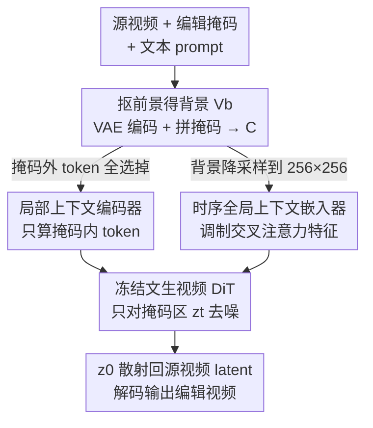

# EditCtrl: Disentangled Local and Global Control for Real-Time Generative Video Editing

**会议**: CVPR 2026  
**论文**: [CVF Open Access](https://openaccess.thecvf.com/content/CVPR2026/html/Litman_EditCtrl_Disentangled_Local_and_Global_Control_for_Real-Time_Generative_Video_CVPR_2026_paper.html)  
**代码**: 待确认  
**领域**: 视频生成 / 视频编辑 / 扩散模型  
**关键词**: 生成式视频编辑、视频修复、局部计算、ControlNet、实时推理

## 一句话总结
EditCtrl 在冻结的文生视频扩散模型上挂两个轻量 adapter——只处理掩码内 token 的「局部上下文编码器」+ 只看降采样背景的「时序全局上下文嵌入器」，让计算量随编辑区域大小（而非视频分辨率）线性缩放，从而在 4K 视频上实现实时、多区域、可向未来帧传播的生成式编辑，比同类方法省约 10× 算力还略微提升质量。

## 研究背景与动机

**领域现状**：高保真生成式视频编辑（video inpainting：把视频中任意区域替换成与上下文一致的高保真新内容）这两年靠大规模文生视频扩散模型取得了质的飞跃，主流做法是拿一个预训练 DiT（如 VACE、VideoPainter）当底座，把整段视频 + 逐像素掩码喂进去，用 full-attention 在全时空上下文里去噪生成。

**现有痛点**：这种 full-attention 范式的算力开销与**整段视频的分辨率/帧数**绑定，跟实际要编辑的区域大小**完全无关**——哪怕只想把一辆车涂成白色（稀疏、局部的编辑），模型也要把整帧、整段视频的 token 全过一遍。结果是延迟极高（论文里 VACE-14B 只有 0.10 FPS），4K、实时 AR、同屏多处编辑这些真实场景根本跑不动。

**核心矛盾**：质量与效率的 trade-off 被「掩码信息和视频上下文耦合在一起」这件事锁死了。因为掩码是和视频上下文一起进 full-attention 的，所以（i）算力没法只花在该编辑的地方；（ii）也没法在不同区域用不同 prompt 做多处独立编辑；（iii）当未来帧还没拿到时（如 AR 流式场景）没法把编辑传播过去。

**切入角度**：作者受图像编辑里 LazyDiffusion 的启发——在图像编辑中，可以微调预训练扩散模型，让它**只对掩码内的局部 token 去噪**，同时用一个压缩后的全局表征当侧信道提供上下文，从而让扩散加速正比于掩码面积。但视频比图像多了两个硬骨头：要保证**时序连贯**，还要支持**内容传播**这类视频独有的下游操作。

**核心 idea**：把视频编辑的控制信号**解耦**成局部（高频、掩码内细节）和全局（低频、视频级外观/光照/运动线索）两路，各用一个**轻量 adapter** 在**冻结**的底座上注入——局部 adapter 只算掩码内 token（算力正比于编辑区域），全局 adapter 只看降采样背景（开销恒定）。底座不动，质量不掉，还天然兼容蒸馏模型、自回归模型等变体。

## 方法详解

### 整体框架

EditCtrl 接收一段源视频 $V_{src}$、对应的编辑掩码 $V_m$、以及文本 prompt，输出编辑后的视频，且算力正比于编辑区域大小。整体是一条「抠背景 → 编两路上下文 → 冻结 DiT 只在掩码区去噪 → 散射回原视频」的流水线，关键在于全程**底座 DiT 冻结**，所有可训练参数都集中在两个 adapter 里。

具体地：掩码先把前景抠掉得到背景视频 $V_b$，$V_b$ 经 VAE 编码器 $\mathcal{E}$ 编码、再与降采样到 latent 分辨率的掩码 $V_m^{\downarrow}$ 沿通道拼接，得到条件上下文 $C=(\mathcal{E}(V_b), V_m^{\downarrow})$。这个 $C$ 兵分两路：一路用 $V_m^{\downarrow}$ 当 attention mask 把**掩码外的背景 token 全部选掉**，只留下编辑区附近的局部 token $C_{local}$，送进**局部上下文编码器** $c_\phi$；另一路把背景空间降采样到固定 $256\times256$ 得到 $V_b^{\downarrow}$，编码后送进**时序全局上下文嵌入器** $G_\psi$。两个 adapter 的输出分别加到冻结 DiT 的选定 transformer 层上，引导它只对掩码区内的噪声 token $z_t$ 去噪。去噪完成后，把 $z_0$ **散射（scatter）**回 $\mathcal{E}(V_{src})$ 的对应掩码位置，再解码出最终视频。

### 关键设计

**1. 局部上下文编码器：让算力正比于编辑区而不是视频分辨率**

这是省算力的主力，直接打在「full-attention 把整段视频都算一遍」这个痛点上。EditCtrl 采用类 ControlNet 架构，先有一个为全帧 inpainting 训练、跑双向 full-attention 的上下文控制模块（用 VACE 权重初始化）。要把它改造成局部计算，作者用降采样掩码 $V_m^{\downarrow}$ 作为 attention mask，把前景对应的 token 选出来：背景 token $C$ 经 $V_m^{\downarrow}$ 筛选得到 $C_{local}$，同样的选择也作用在噪声 latent $z_t$ 上，控制模块的输出在选定的若干 video transformer 层之后**逐元素加到** FFN 输出上。这样只有掩码内 token 真正走完整条 DiT + 控制模块，扩散过程就被正比地加速了。

但直接把掩码外 token 全砍掉会带来两个问题：一是**边缘融合差**——所以 $V_m^{\downarrow}$ 在选择前先做**膨胀（dilation）**，把相邻像素也纳进来，保证生成内容和周围背景接得上；二是预训练控制模块当初是按 full-attention 模式训的，突然换成稀疏 attention 会质量暴跌，所以必须**微调**成真正的局部编码器，用掩码感知的扩散损失

$$L_\phi = \big\| \epsilon_\theta(z_t, t; p, c_\phi(C_{local})) - \epsilon_t \odot V_m^{\downarrow} \big\|_2^2$$

其中损失只在掩码区 $V_m^{\downarrow}$ 上计算。微调用的是 rank=128 的 LoRA，所以底座权重不动，加速来自「只处理局部 token」而非破坏预训练质量。

**2. 时序全局上下文嵌入器：用极小开销补回视频级的连贯线索**

只看局部 token 会丢掉视频整体的外观、光照、结构、相机运动等全局线索，导致编辑区与整段视频不协调——这个设计专门补这个洞，且要求开销极小。作者把背景 $V_b$ 无论原分辨率多少都**空间降采样到固定 $256\times256$** 得到 $V_b^{\downarrow}$（这样对长宽比和帧数都更鲁棒，也让全局表征对原视频分辨率不变），经 VAE 编码得到 $C_{global}$，再过一个可训练的 patch 层得到全局上下文 token embedding，紧凑地刻画视频级的时序演化与高层场景线索。

注入方式类似「用 CLIP 做图像引导生成」，但这里用的是时序全局表征：嵌入器 $G_\psi$ 拿 query token $Q$ 与全局特征的 key/value $K_g, V_g$ 算注意力，结果加到**交叉注意力（cross-attention）之后**的特征上：

$$x = x + W_0 \cdot \text{Attention}(Q, K_g, V_g)$$

其中 $W_0$ 是**零初始化**的线性层。零初始化保证训练初期全局支路不破坏已有的文本 embedding 信息，是一种「最小但够用」的控制，在不损害 prompt 对齐的前提下把全局视频上下文喂进去。由于全局支路只看降采样背景，开销几乎可忽略，却能把局部生成稳稳锚定在全局时序语境里。加上全局支路后的损失为

$$L_\psi = \big\| \epsilon_\theta(z_t, t; p, G_\psi(C_{global}), c_\phi(C_{local})) - \epsilon_t \odot V_m^{\downarrow} \big\|_2^2$$

**3. 分段渐进训练：先学会局部生成，再叠加全局引导**

如果从一开始就同时用 $L_\phi$ 和 $L_\psi$ 训练会**不稳定**：$c_\phi$ 还没学会按 prompt 在掩码区生成内容，$G_\psi$ 去改交叉注意力特征只会添乱；反过来 $c_\phi$ 初期预测很差，$G_\psi$ 也无从「引导」起。作者用一个分段损失把训练拆成两阶段：

$$L = \begin{cases} L_\phi, & \text{if } k < n \\ L_\psi, & \text{if } k \geq n \end{cases}$$

其中 $k$ 是训练迭代数、$n$ 是预设的切换点。先用 $L_\phi$ 把局部编码器训到能可靠地按 prompt 局部生成，再切到 $L_\psi$ 叠加全局嵌入器做精修。这个顺序对应着「先把基本功练好，再加全局协调」的依赖关系，避免两个目标在早期互相干扰。

### 一个完整示例：解耦带来的三种交互能力

EditCtrl 解耦设计最直接的回报是几种 full-attention 框架天然做不到的交互应用，正好说明「算力随掩码而非整段视频缩放」意味着什么：

- **任意分辨率编辑**：因为算力与整段视频大小无关，4K 视频也能编辑——推理时按编辑掩码大小动态分配计算（掩码越小越快）。
- **多区域多 prompt 编辑**：生成在各掩码区**独立**进行，于是多个不连通的掩码可以**批处理**同时编辑，每个区域甚至能配**不同的文本 prompt**，一次前向完成复杂的多处编辑，最后把各区域结果合并回输出 latent 的对应位置。这在「掩码和视频上下文耦合」的 full-attention 框架里做不到。
- **内容向未来传播**：由于底座 DiT 没被改动，可以直接换成自回归视频扩散模型来做内容传播。视频帧率高、近未来的全局上下文变化不大，于是把 $V_b^{\downarrow}$ 用它**自己最近的帧 padding** 当作因果全局 embedding 即可提供足够的未来全局线索，掩码则用光流/相机位姿等运动线索传播。这样在头显真正拿到帧之前就能先把内容生成好、消除延迟，服务实时 AR 编辑。

### 损失函数 / 训练策略
训练用上面的分段损失 $L$（公式 7，先 $L_\phi$ 后 $L_\psi$）。局部编码器用 VACE 权重初始化、LoRA rank=128 微调，分 1.3B（small）与 14B（large）两个版本；全局嵌入器随机初始化，零卷积层权重/偏置初始化为 0，全局 token patch 层从 DiT 的 token patch 层拷贝初始化。在 8 张 A100 上训约 1 天，batch=8 视频、梯度累积 8、lr=1e-5、AdamW + warmup；每条视频采样 49 帧，帧与掩码降采样到 $480\times720$。训练/推理时用编辑掩码把 $V_{src}$ 对应区域置 0.5 得到 $V_b$。

## 实验关键数据

评测在 VPBench-Edit（编辑，45 段 6 秒视频）、VPBench-Inp 与 DAVIS（修复，150 段）上进行。指标分三类：掩码外区域保真（PSNR/SSIM/LPIPS/MSE/MAE，衡量不该编辑处是否被保住）、文本对齐（CLIP / CLIP-M）、时序连贯（相邻帧 CLIP 相似度），以及吞吐 FPS（A6000Ada 上、不含 VAE 编解码、25 步 DDPM）。

### 主实验：VPBench-Edit 视频编辑对比

| 方法 | 参数 | PFLOPS↓ | PSNR↑ | SSIM↑ | LPIPS↓ | CLIP-M↑ | FPS↑ |
|------|------|---------|-------|-------|--------|---------|------|
| ReVideo | 1.5B | 193.39 | 15.52 | 0.49 | 27.68 | 20.01 | 0.11 |
| VideoPainter | 5B | 817.81 | 22.63 | 0.91 | 7.65 | 20.20 | 0.12 |
| VACE | 1.3B | 76.31 | 23.84 | 0.91 | 5.44 | 21.51 | 0.66 |
| VACE | 14B | 589.19 | 24.02 | 0.92 | 5.13 | 21.54 | 0.10 |
| **EditCtrl** | 1.5B | **17.42** | 24.16 | 0.92 | 5.54 | 21.70 | **4.67** |
| **EditCtrl** | 16B | 124.53 | **24.37** | **0.93** | **5.10** | **21.73** | 1.19 |

EditCtrl-1.5B 的 PFLOPS 仅 17.42，是同规模 VACE-1.3B（76.31）的约 1/4.4、是 VideoPainter（817.81）的约 1/47；FPS 4.67 是 VACE-1.3B（0.66）的约 7×、是 VACE-14B（0.10）的约 47×。更关键的是它在背景保真（PSNR 24.16 vs 23.84）和文本对齐（CLIP-M 21.70 vs 21.51）上**还略胜**全注意力底座 VACE，验证了「省算力不等于掉质量」。大模型 EditCtrl-16B 在多数质量指标上拿到全表最佳。

### 修复对比（VPBench-Inp / DAVIS，节选）

| 测试集 | 方法 | 参数 | PSNR↑ | LPIPS↓ | CLIP-M↑ | FPS↑ |
|--------|------|------|-------|--------|---------|------|
| VPBench-Inp | ProPainter | 50M | 20.97 | 9.89 | 17.18 | 5.34 |
| VPBench-Inp | VACE | 14B | 23.03 | 7.65 | 22.18 | 0.10 |
| VPBench-Inp | **EditCtrl** | 14B | **23.60** | 8.23 | 21.96 | 1.30 |
| DAVIS | VACE | 14B | 26.12 | 4.88 | 18.75 | 0.10 |
| DAVIS | **EditCtrl** | 16B | 25.89 | 5.25 | 18.50 | **1.41** |

修复任务上 EditCtrl 与 full-attention 基线**打平或略优**，同时把吞吐拉高一个量级（DAVIS 上 1.41 vs VACE 0.10）。

### 消融实验（VPBench-Edit，Tab. 3）

| 配置 | PSNR↑ | SSIM↑ | LPIPS↓ | CLIP-M↑ | FPS↑ | 说明 |
|------|-------|-------|--------|---------|------|------|
| VACE（full-attention 底座） | 23.84 | 0.91 | 5.44 | 21.51 | 0.10 | 参考上限，但极慢 |
| Ours (Naive) | 23.24 | 0.86 | 6.96 | 20.49 | 4.90 | 不用 $G_\psi$ 且砍掉掩码外 token 喂未微调编码器，质量暴跌 |
| Ours (No $G_\psi$) | 23.80 | 0.90 | 5.74 | 21.28 | 4.90 | 微调局部编码器但缺全局，过拟合 prompt |
| **Ours（完整）** | **24.16** | **0.92** | **5.54** | **21.70** | 4.67 | 两个 adapter 齐全，质量反超 VACE |

### 关键发现
- **局部编码器是质量地基**：Naive → No $G_\psi$（即把未微调编码器换成 LoRA 微调的局部编码器）后，CLIP-M 从 20.49 涨到 21.28、LPIPS 从 6.96 降到 5.74，说明「稀疏 attention 必须重新微调」这一步至关重要。
- **全局嵌入器治过拟合**：No $G_\psi$ 时局部编码器看不到全局上下文，会**过度迎合 prompt**、在目标区乱生成；加回 $G_\psi$ 后 PSNR/SSIM/CLIP-M 全面回升（24.16 / 0.92 / 21.70），且 FPS 只从 4.90 微降到 4.67——全局支路几乎零成本。
- **效率与质量同时拿下**：完整模型在背景保真和文本对齐上**超过**了它所基于的 full-attention VACE，同时 FPS 高出约 47×，是少见的「又快又好」。

## 亮点与洞察
- **把掩码从视频上下文里解耦出来**是全文最巧的一刀：一旦局部生成相互独立，多区域多 prompt 编辑、未来帧传播这些能力几乎是「免费」附赠的，而不是额外设计的功能——这是架构选择带来的能力，不是堆模块堆出来的。
- **冻结底座 + 双 adapter** 的非破坏式设计让它天然兼容蒸馏模型、自回归模型等变体：换底座做内容传播时不用重训编辑能力，工程上很有迁移价值，这套「在冻结大模型上挂正交 adapter」的思路可复用到其他可控生成任务。
- **零初始化交叉注意力调制 + 分段训练**两个小 trick 解决了「两路控制互相干扰」的训练稳定性问题，值得在多控制信号融合场景借鉴。
- **全局背景固定降采样到 256×256** 这个看似随手的选择，实际让全局表征对分辨率/长宽比不变，是 4K 也能跑实时的隐形功臣。

## 局限与展望
- **VAE 是质量瓶颈**：作者承认 video VAE 会对背景上下文造成明显退化——这也解释了为何某些指标（如 DAVIS 上 PSNR）EditCtrl 略逊于 full-attention VACE。
- **快速运动场景吃瘪**：局部编码器在剧烈运动视频里表现差，根因是 VAE 加上局部时空上下文的快速漂移，掩码区拿到的局部线索不够稳。
- **4K 的 VAE 编解码反成瓶颈**：480×720 时 VAE 编解码不算瓶颈，但 4K 因 VRAM 限制需要 tile 式编解码，端到端吞吐又被 VAE 拖累——也就是说「编辑算力」省下来了，但「编解码」没省。
- 改进方向：作者建议把运动等更基础的时序信息显式编码进生成式编辑；个人看，更轻量/更高保真的 VAE 或 latent 缓存复用可能是解锁真·4K 实时的关键。

## 相关工作与启发
- **vs LazyDiffusion（图像编辑）**: LazyDiffusion 在图像域提出「只算掩码内 token + 压缩全局侧信道」并对底座做全量微调；EditCtrl 把它扩到视频域，且**只学局部 adapter 而非全量微调**，从而保留底座、兼容控制变体，并额外解决时序连贯与内容传播这两个视频独有难题。
- **vs VACE / VideoPainter（full-attention 生成式编辑）**: 它们把整段视频 + 逐像素掩码喂进 full-attention，算力与分辨率绑定、且掩码与上下文耦合导致无法多区域/传播；EditCtrl 用 VACE 权重初始化局部编码器，但通过稀疏 attention + 双 adapter 把算力降到正比于编辑区，质量还略反超。
- **vs token merging / 剪枝加速法**: 这类方法靠剪掉局部外 token 加速，但 token 重要性计算本身有开销、且常带来明显质量退化；EditCtrl 用掩码直接确定性地选 token、再靠全局嵌入器补回上下文，避开了重要性估计的成本与不稳定。
- **vs 蒸馏 / 稀疏 attention / 线性 transformer 加速**: 这些只减少扩散步数或注意力复杂度，**不减少**为编辑而处理的局部+全局上下文数据量；EditCtrl 直接砍掉「该编辑区之外」的数据处理，与它们正交、可叠加。

## 评分
- 新颖性: ⭐⭐⭐⭐⭐ 把图像域的局部计算思路系统地搬到视频并解耦出全局支路，顺带解锁多区域/传播，架构层面的洞察很漂亮
- 实验充分度: ⭐⭐⭐⭐ 编辑+修复双任务、多基线、含 PFLOPS/FPS 算力对比与清晰消融；但训练用内部数据集、部分交互应用结果放在附录
- 写作质量: ⭐⭐⭐⭐ 动机—设计—应用逻辑清晰，图 2/3 框架到位；公式中部分符号（如 $\odot V_m^{\downarrow}$ 的掩码乘法）以原文为准
- 价值: ⭐⭐⭐⭐⭐ 直击生成式视频编辑落地的算力瓶颈，约 10× 效率提升且兼容多种底座，实时 AR/4K 场景实用价值高

<!-- RELATED:START -->

## 相关论文

- [\[CVPR 2026\] PhysVid: Physics Aware Local Conditioning for Generative Video](physvid_physics_aware_local_conditioning_for_generative_video_models.md)
- [\[CVPR 2026\] EgoEdit: Dataset, Real-Time Streaming Model, and Benchmark for Egocentric Video Editing](egoedit_dataset_real-time_streaming_model_and_benchmark_for_egocentric_video_edi.md)
- [\[CVPR 2026\] Endless World: Real-Time 3D-Aware Long Video Generation](endless_world_real-time_3d-aware_long_video_generation.md)
- [\[CVPR 2026\] U-Mind: A Unified Framework for Real-Time Multimodal Interaction with Audiovisual Generation](u-mind_a_unified_framework_for_real-time_multimodal_interaction_with_audiovisual.md)
- [\[CVPR 2026\] BulletTime: Decoupled Control of Time and Camera Pose for Video Generation](bullettime_decoupled_control_of_time_and_camera_pose_for_video_generation.md)

<!-- RELATED:END -->
