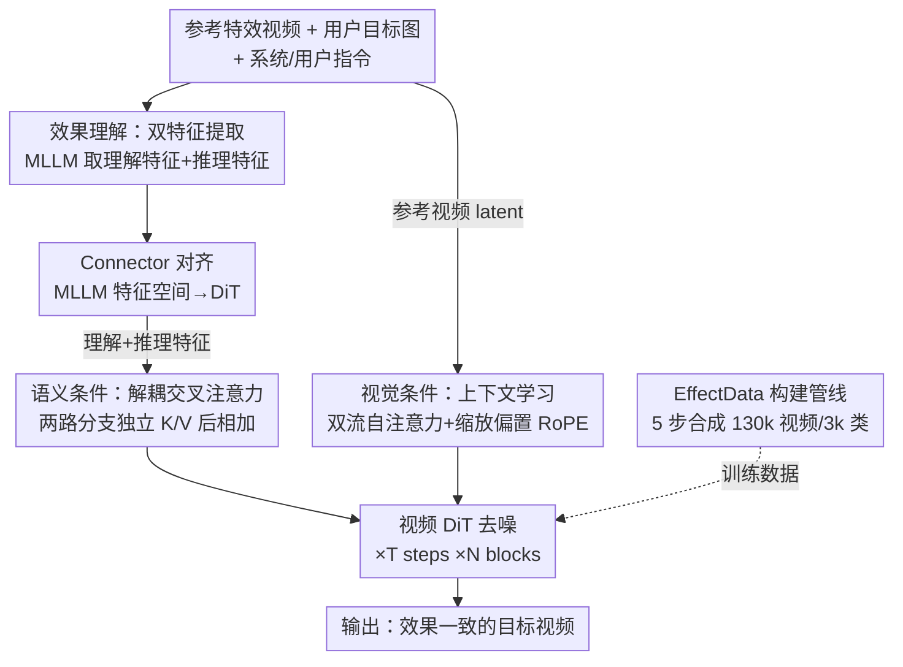

# EffectMaker: Unifying Reasoning and Generation for Customized Visual Effect Creation

**会议**: CVPR 2026  
**论文**: [CVF Open Access](https://openaccess.thecvf.com/content/CVPR2026/html/Yang_EffectMaker_Unifying_Reasoning_and_Generation_for_Customized_Visual_Effect_Creation_CVPR_2026_paper.html)  
**代码**: [项目页](https://effectmaker.github.io)  
**领域**: 视频生成  
**关键词**: 视觉特效生成, 参考驱动, MLLM推理, 扩散Transformer, 上下文学习

## 一句话总结
EffectMaker 把"视觉特效（VFX）生成"重新定义成一个**参考驱动**的任务：给一段带特效的参考视频和一张用户目标图，先用 MLLM 理解并推理这个特效该怎么适配到新主体，再用视频 DiT 通过上下文学习抠出参考视频的细粒度视觉线索，二者组成"语义-视觉双路引导"，**无需为每个特效单独微调 LoRA** 就能把特效迁移到目标图上，生成效果一致的视频。

## 研究背景与动机
**领域现状**：高质量视觉特效（火焰、冰冻、爆炸、变身等）在影视/广告/游戏里很重要，但传统制作依赖专业知识和昂贵的流水线。随着视频生成模型（DiT 类的 Wan、HunyuanVideo、Sora 等）成熟，用 AIGC 做特效成了一个有吸引力的方向。

**现有痛点**：现有特效生成方法基本卡在三处。一是**逐特效微调**——VFXCreator 给每种特效训一个独立 LoRA，Omni-Effect 在 55 类特效上训一堆 LoRA 的混合，既不高效也无法泛化到没见过的开放集特效；二是**纯文本条件不够用**——特效往往抽象、多层次、风格复杂，文字很难精确描述其纹理、动态和氛围，连专业设计师都更习惯拿一段参考"找感觉"而非写 prompt；三是**数据稀缺**——现有 VFX 数据集只覆盖几十到几百类特效，规模太小，限制了系统性研究。

**核心矛盾**：开放集特效生成需要的是"既能理解特效高层语义、又能复刻其细粒度视觉细节"的能力，但纯文本条件丢掉了视觉细节，纯视觉复制（如 MagicVFX 的 copy-paste）又无法在参考与目标场景差异大时灵活适配。理解与生成被割裂了。

**本文目标**：做一个**前馈式、免逐特效微调、能泛化到未见特效**的参考驱动特效生成框架，同时解决配套的数据稀缺问题。

**切入角度**：把特效创作建模成"参考迁移"——从参考视频里提取特效的"看上去和感觉起来"，迁移到新的视觉语境。作者观察到，MLLM 擅长高层语义理解与推理，DiT 擅长上下文级的视觉复刻，二者恰好互补。

**核心 idea**：用 MLLM 做"语义推理路"（这是什么特效、该怎么适配到新主体）+ 用视频 DiT 做"视觉细节路"（in-context 抠参考视频的细粒度线索），二者构成**语义-视觉双路引导**，在单一框架里统一理解与生成。

## 方法详解

### 整体框架
EffectMaker 的输入是**一段参考特效视频 + 一张用户目标图**，输出是把该特效迁移到目标主体上的视频。它由两大组件串成一条"理解→生成"的管线：理解侧用一个 MLLM（基于 Qwen3-VL-8B）读参考视频和目标图，输出两类互补的条件特征（语义理解特征 + 语义推理特征），经一个轻量 connector 对齐到 DiT 的特征空间；生成侧用一个图生视频 DiT（基于 Wan2.2-TI2V-5B），同时接受两路条件——语义条件走解耦交叉注意力、视觉条件走 in-context 学习，最终去噪生成目标视频。

### 关键设计

**1. 效果理解的"双特征"：理解 + 推理两路互补**

纯把参考视频喂给 MLLM 取一次前向的隐状态，只能拿到"当前输入的语义快照"，并不包含"这个特效该怎么搬到用户图上"的推断。作者因此从 MLLM 里抽**两类互补特征**：**语义理解特征**取自 MLLM 最后一层的隐状态，编码参考输入的丰富多模态表示；**语义推理特征**取自 MLLM 自回归生成的文本 token 序列，它总结了模型对参考的理解、并把"用户想要的最终结果应该长什么样"的推理过程显式编码进来。用户指令引导 MLLM 按"先分析参考视频里的特效→再看目标图内容→推理特效如何适配到形状差异大的新主体→最后想象并描述迁移后的目标外观"这条链来推理。两路特征一起作为 DiT 的条件，让生成既有"是什么"也有"该怎么改"。由于 MLLM 与 DiT 的特征空间不对齐，中间加一个轻量 connector 桥接模态间隙。

**2. 语义条件：解耦交叉注意力，别把两路特征硬拼**

把理解特征和推理特征直接 concat 后塞进 DiT 的交叉注意力，作者发现会**削弱模型的表征能力**——两种模态信息互相干扰。于是采用**解耦交叉注意力**：推理特征本质偏文本，用 DiT 原有的 T5 文本编码器编码、走标准交叉注意力分支；理解特征偏视觉，新开一条独立交叉注意力分支单独处理。两条分支**共享同一套 query**，但用**各自独立的 key/value 投影**分别对文本和视觉特征做注意力，输出再直接相加融合。此外，为防止语义条件干扰参考视频流，交叉注意力**只在目标视频 token 与语义条件之间发生**，参考视频 token 被排除在外。这样既保留了两路模态各自的信息，又把语义引导精准注入到要生成的目标流上。

**3. 视觉条件：上下文学习 + 双流自注意力，抠细粒度细节**

语义条件给的是"该生成什么特效"的全局指导，但缺少视觉忠实复刻所需的细粒度时空细节。作者用 DiT 的 **in-context learning** 能力做视觉级条件：参考视频和目标视频用**共享 VAE 编码器**编成 latent，patchify 展平后**沿序列维拼接**，一起喂进 DiT block。关键改造是把自注意力变成**双流方案**——参考流和目标流用各自独立的 Q/K/V 投影，把两者的表示空间解耦，但仍允许在拼接序列上做双向注意力：

$$O_r = \mathrm{SA}(Q_r,\,[K_r;K_t],\,[V_r;V_t]),\quad O_t = \mathrm{SA}(Q_t,\,[K_r;K_t],\,[V_r;V_t])$$

其中下标 $r/t$ 表示参考/目标流，$[\cdot;\cdot]$ 是沿序列维拼接。消融显示双流比"参考与目标共享投影"的单流更好——因为参考是干净 latent、目标是带噪 latent，处在异质（clean vs. noisy）分布里，独立投影更能吸收这个分布差。配套还有 **RoPE 设计**：对参考视频用一个**缩放并加偏置的 3D RoPE**，先把参考的空间 RoPE 索引线性 rescale 到目标坐标系，再在时间维加一个常数偏移，把两段视频的位置编码空间分开，留出安全间隔避免互相干扰。

**4. EffectData：合成管线撑起 3k 类、130k 视频的最大 VFX 数据集**

特效数据稀缺是整个方向的瓶颈，作者用一条 5 步合成管线自建配对数据集。**Step 1 主体收集**：以人像/动物为主，来自内部数据和 PPR10K，过滤掉含文字、多主体或不清晰的图。**Step 2 VFX 分类法**：用一组正交属性集（效果元素如冰/火/魔法、几何模式如粒子/波/环、附着区域如脸/手臂/全身）组合式地定义出多样的特效类别。**Step 3 指令生成**：对每个特效类，让 LLM 生成多条"如何把源图改成带特效版本"的编辑指令。**Step 4 主体编辑**：用图像编辑模型按指令把源图合成带特效的目标图。**Step 5 视频生成**：让 MLLM 描述源图→目标图的动态过渡，再把这个 prompt 连同首尾帧喂进首尾帧到视频模型，合成时序连贯的特效视频。最终得到 130k 视频、3k 类特效，类别数比现有数据集高一个数量级，且每条视频带 label/caption/instruction 标注。

### 一个完整示例
以"火球"特效为例走一遍：输入一段火球参考视频 + 一张举着手掌的女孩目标图。理解侧 MLLM 先分析参考里的特效（一团搏动的球形火焰在掌心凝聚），再看目标图（女孩抬手），推理出"火焰能量该在女孩张开的手掌处汇聚成搏动火球"，并把这段想象写成推理 token；同时取最后一层隐状态作为理解特征。两路特征经 connector 对齐后，推理特征走 T5+标准交叉注意力、理解特征走独立交叉注意力分支注入 DiT。生成侧把火球参考视频与目标图的 latent 拼接，双流自注意力让目标流在去噪时"参照"参考流的火焰纹理与运动，缩放偏置 RoPE 保证两段视频位置编码不打架。经 T 步去噪、VAE 解码，输出女孩掌心凝聚出火球的连贯视频——既语义对（火球出现在该出现的地方），又视觉像（火焰纹理/动态贴近参考）。

### 损失函数 / 训练策略
训练时参考视频与目标视频从同一 VFX 类里随机采样。为降算力，参考视频时序下采样到 17 帧、短边 resize 到 448 像素；目标视频固定 81 帧、短边 704 像素、长边按用户首帧宽高比成比例调整。模型训约 50k 步、32 张 NVIDIA H20、Adam 优化器、学习率 $2\times10^{-5}$。数据来自 EffectData 合成集，并补充 OpenVFX 数据集与 Higgsfield 网站的样本。

## 实验关键数据

### 主实验
在 OpenVFX 数据集 14 类特效上做量化对比，每类测 10 张主体图，报告平均分。指标全为模型化打分（越高越好）：VQ=视觉质量、MQ=运动质量、TA=文本对齐、CAS=类别对齐分（Gemini 2.5 打 0-5 分）。

| 数据集 | 指标 | 本文 | 次优 baseline | 提升 |
|--------|------|------|----------|------|
| OpenVFX(14类) | VQ↑ | **2.84** | Omni-Effect 2.27 | +0.57 |
| OpenVFX(14类) | MQ↑ | **0.25** | Wan2.2-FT 0.20 | +0.05 |
| OpenVFX(14类) | TA↑ | **-0.24** | VFX-Creator -0.92 | +0.68 |
| OpenVFX(14类) | CAS↑ | **4.63** | Omni-Effect 4.40 | +0.23 |

EffectMaker 在视觉/运动质量及特效对齐一致性上均超过现有 SOTA。和"纯文本驱动"的 Wan2.2-FT 对比尤其说明问题：参考驱动范式在建模动态复杂的视觉模式上明显更有效。开放集（未见特效如 portal、塑料模型、绿树发光）对比中，Omni-Effect 对未见类几乎失败，Wan2.2-FT 能出大致对的模式但与参考相似度低，本文凭参考视频引导能更一致地复刻未见特效。

### 消融实验

| 配置 | VQ↑ | MQ↑ | TA↑ | CAS↑ | RAS↑ | 说明 |
|------|------|------|------|------|------|------|
| 仅语义条件 | 2.78 | 0.16 | 1.06 | 4.20 | 3.84 | 语义对但缺细粒度细节 |
| 仅视觉条件 | 2.48 | 0.12 | -0.38 | 2.24 | 1.48 | 只复刻低层颜色纹理，抓不住复杂效果结构 |
| 语义+视觉（Full） | **2.92** | **0.21** | **1.24** | **4.40** | **4.16** | 双路最忠实 |

注意力设计消融：把双流自注意力换成"参考/目标共享投影"的单流后，TA 从 1.24 → 0.81、CAS 从 4.40 → 3.30、RAS 从 4.16 → 2.84，明显退化——印证参考(干净)与目标(带噪)处于异质分布、独立投影更能处理分布间隙。数据规模消融：训练特效类从 100 增到 1000，VQ 2.76→2.89、TA 0.94→1.21、CAS 3.76→4.22、RAS 3.22→4.04 全面提升，说明更大类别覆盖带来更好的内插/外推泛化。

### 关键发现
- **双路缺一不可**：仅视觉条件只能复刻颜色纹理、复现不出 DNA 螺旋这类复杂几何结构；仅语义条件方向对但丢细节；合起来才最忠实。RAS（参考对齐分）从单视觉的 1.48 到双路 4.16，差距最大。
- **双流注意力是关键工程点**：clean/noisy 异质分布下独立投影显著优于共享投影，单换这一项 RAS 就掉 1.32。
- **数据规模直接换泛化**：特效类别 10× 扩展是开放集泛化的底气，数据 scaling 在所有指标上单调提升。
- 30 人、28 题的用户研究里，本文在效果质量、类别对齐、参考对齐三项偏好率均最高。

## 亮点与洞察
- **把"理解"显式拆成理解特征+推理特征两路**很巧：一路是输入快照，一路是"该怎么改"的推断，等于让 MLLM 既当感知器又当规划器，比单取隐状态信息更全。
- **解耦交叉注意力 + 双流自注意力**是一对漂亮的工程决策：前者拒绝把异质语义特征硬拼，后者拒绝把 clean/noisy 异质 latent 共享投影——核心思想一致，都是"异质的东西别共用一套参数"，这套思路可迁移到任何多条件/多分布注入的生成任务。
- **缩放偏置 RoPE** 用极轻量的方式解决了"两段视频拼一起后位置编码打架"的问题，值得在其他 in-context 视频迁移里复用。
- **用合成管线把数据集做大一个量级**：正交属性集组合 + LLM 生指令 + 编辑模型 + 首尾帧到视频，是一条可复制的"无中生有造配对数据"范式。

## 局限与展望
- 作者承认：面对**快速或大幅运动**的复杂特效可能力不从心，主要受基座模型容量限制。
- 依赖**合成训练数据**可能引入偏置，未必能完全覆盖真实世界 VFX 的多样性与真实感（如噪声大、模糊、多重叠特效场景）。
- 自己发现的：所有评测指标都是模型化打分（VideoAlign reward + Gemini 打分 + 用户研究），缺乏与真实专业特效成片的客观保真度度量；CAS/RAS 由 Gemini API 评分，可能受评分模型偏好影响。开放集泛化只在少数 case 定性展示，缺大规模未见类的系统量化。
- 改进思路：换更强基座以支撑大运动特效；引入真实世界 VFX 数据缓解合成偏置；探索多重叠特效的组合生成。

## 相关工作与启发
- **vs VFXCreator**: 它给每个特效微调独立 LoRA，单特效效果不错但扩展性差、无法泛化到未见特效；本文是前馈式参考驱动、免逐特效微调，灵活性和可扩展性都更好。
- **vs Omni-Effect**: 它用 55 类特效上的 mixture-of-LoRA 提升扩展性，但特效多样性有限制约域泛化；本文靠 3k 类 EffectData + 参考驱动，在开放集上明显更强（未见类它几乎失败）。
- **vs MagicVFX**: 它直接像素级 copy-paste 参考内容再加噪精修，参考与目标场景差异大时不灵活、需大量手动调整；本文经 MLLM 推理适配，能处理形状差异大的新主体。
- **vs Video-as-Prompt / VFXMaster（并行工作）**: 同为参考驱动且泛化不错，但它们缺推理能力、依赖人工精心设计的特效 prompt，交互不友好；本文用 MLLM 自动理解+推理，免去用户写复杂特效描述。

## 评分
- 新颖性: ⭐⭐⭐⭐ 把特效生成重构为参考驱动的"理解-生成"统一框架，双特征+双路条件+双流注意力三处设计自洽且互补
- 实验充分度: ⭐⭐⭐⭐ 闭集/开集定性+定量、条件/注意力/数据规模三组消融、用户研究齐全；但指标全为模型化打分、缺客观保真度度量
- 写作质量: ⭐⭐⭐⭐ 动机链条清晰、方法分层明确、图示到位
- 价值: ⭐⭐⭐⭐ 免逐特效微调 + 3k 类最大 VFX 数据集，对特效生成方向有实际推动，数据集本身是可复用资源

<!-- RELATED:START -->

## 相关论文

- [\[CVPR 2026\] SynMotion: Semantic-Visual Adaptation for Motion Customized Video Generation](synmotion_semantic-visual_adaptation_for_motion_customized_video_generation.md)
- [\[ICML 2026\] MotiMotion: Motion-Controlled Video Generation with Visual Reasoning](../../ICML2026/video_generation/motimotion_motion-controlled_video_generation_with_visual_reasoning.md)
- [\[CVPR 2026\] DriveLaW: Unifying Planning and Video Generation in a Latent Driving World](drivelaw_unifying_planning_and_video_generation_in_a_latent_driving_world.md)
- [\[CVPR 2026\] Reasoning Diffusion for Unpaired Test Time Out-of-distribution Text-Image to Video Generation](reasoning_diffusion_for_unpaired_test_time_out-of-distribution_text-image_to_vid.md)
- [\[CVPR 2026\] SMRABooth: Subject and Motion Representation Alignment for Customized Video Generation](smrabooth_subject_and_motion_representation_alignment_for_customized_video_gener.md)

<!-- RELATED:END -->
