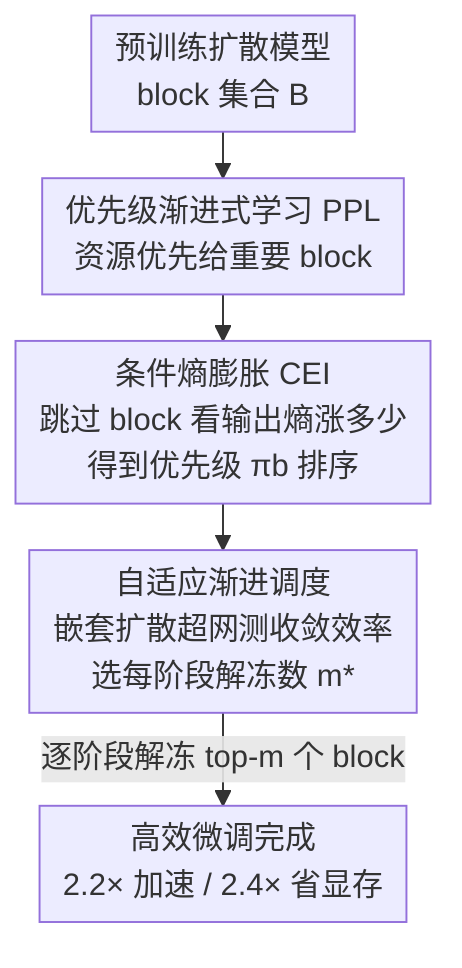

# Efficient Training for Human Video Generation with Entropy-Guided Prioritized Progressive Learning

**会议**: CVPR 2026  
**论文**: [CVF Open Access](https://openaccess.thecvf.com/content/CVPR2026/html/Li_Efficient_Training_for_Human_Video_Generation_with_Entropy-Guided_Prioritized_Progressive_CVPR_2026_paper.html)  
**代码**: https://github.com/changlin31/Ent-Prog  
**领域**: 视频生成  
**关键词**: 高效训练, 人体视频生成, 渐进式学习, 条件熵, 扩散模型

## 一句话总结
针对人体视频扩散模型训练显存高、耗时长的问题，本文提出 Ent-Prog：用「条件熵膨胀（CEI）」给每个网络 block 打一个任务相关的重要度分数，优先解冻对条件遵循贡献最大的 block，再用一个「嵌套扩散超网」在每个阶段在线估计该解冻多少个 block 才收敛最快，从而在三个人体视频数据集上做到最高 2.2× 训练加速、2.4× 显存下降而不掉质量。

## 研究背景与动机

**领域现状**：人体视频生成（给一张参考图 + 一段姿态序列，合成动作连贯、外观一致的人物视频）随着扩散模型的发展进步很快。主流做法是拿一个预训练大扩散模型（如 DiT、UNet + ReferenceNet）在目标任务上做全量微调，配合 CLIP 视觉编码器、ControlNet、ReferenceNet 等条件编码器来增强对参考图和姿态的遵循。

**现有痛点**：视频数据维度极高——多帧、高分辨率、复杂时序依赖，训练资源消耗巨大。论文给出一个直观数字：在 512×512、20 帧的视频上训练一个 DiT 可吃掉高达 100 GB 显存，超出主流 GPU 上限，因此很难扩到更高分辨率、更长视频、更大模型或更复杂的控制信号。

**核心矛盾**：传统训练方案在每次迭代里更新**全部**参数，完全不区分各参数对目标任务的贡献。而作者通过一组探针实验发现（Fig.1）：① 冻结的 block 越多，最终收敛性能下降越明显；② 随机跳过 8~23 个 block 时，越容易误伤「高交互」block，导致 loss 和条件熵急剧上升、网络坍塌；③ 单独训练最重要的 10 个 block 比训练最不重要的 10 个 block 收敛快得多。也就是说，**不同 block 对条件生成的贡献严重不均**，全量更新既浪费算力又没把资源花在刀刃上。另一条路——参数高效微调（LoRA 之类把可训练参数压到最小）——在源任务与目标任务差距大时容量不够，跨不过任务 gap。

**本文目标**：在不引入额外参数、也不一味砍参数的前提下，把训练资源**优先分配给对目标条件生成最关键的网络组件**，同时动态决定每个训练阶段该投入多少算力，实现性能与效率的动态平衡。

**核心 idea**：用「跳过某个 block 会让输出条件熵膨胀多少」来度量该 block 对条件遵循的重要性（CEI），按重要度排序后**渐进式解冻**——重要 block 先训、次要 block 后训；再用一个超网在每个阶段在线测「单位时间 loss 下降」来自适应决定解冻数量。

## 方法详解

### 整体框架

Ent-Prog 把「微调一个预训练扩散模型」重新组织成一条**带优先级的渐进式解冻流水线**。给定预训练扩散模型 $\phi(\omega)$ 及其残差 block 集合 $B=\{b_1,\dots,b_L\}$，以及目标任务的训练数据与条件 $D=\{(x_0,c)\}$，整个流程分两步走：

1. **离线打分排序**：先对每个 block $b$ 算一个训练优先级分数 $\pi_b$（用 CEI），把所有 block 按 $\pi_b$ 从高到低排成一个有序列表 $B^\star=(b_{(1)},\dots,b_{(L)})$。
2. **在线渐进解冻**：训练被切成若干 stage，第 $k$ 个 stage 只解冻优先级最高的前 $m_k$ 个 block 来更新，其余 block 冻结但仍参与前向。每进入一个新 stage，先用「嵌套扩散超网」一次性试遍若干候选解冻数量 $m$，挑出收敛效率最高的 $m_k^\star$，再用这个数量把这个 stage 训完。

这样，「训哪些 block」由 CEI 的优先级 $\{\pi_b\}$ 决定，「每阶段训多少个 block」由超网估出的收敛效率决定，二者合起来就是一条**优先级驱动 + 自适应增长**的渐进式学习（Prioritized Progressive Learning, PPL）。注意前向始终走完整网络（保留全容量表达），只是梯度更新被限制在被解冻的高优先级 block 上，因此既省显存又省时间。

### 关键设计

**1. 优先级渐进式学习（PPL）：让重要 block 先学、把渐进式学习从"长多少"升级到"先长谁"**

以往的渐进式学习（progressive learning）通常从零训练、从「非特定」的子网络开始逐步长大，只关心**每个 stage 把网络扩多大**，并不在意先训哪些组件。但本文场景是微调一个**预训练**生成模型，不同 block 对目标任务的条件生成贡献严重不均（Fig.1 已证实），盲目均匀扩张是浪费。PPL 的做法是把渐进调度因式分解成「在每个 stage 解冻哪一组 block」的选择问题：

$$\psi_k=\arg\max_{\psi\subseteq B}\sum_{b\in\psi}\pi_b \quad \text{s.t.}\ |\psi|=m_k,$$

其中 $\psi_k$ 是第 $k$ 阶段被解冻训练的子网络，$m_k$ 是该阶段计划解冻的 block 数。直觉上就是：高优先级 block 早训、低优先级 block 推迟训。相比旧渐进式学习，PPL 多学了一件事——**强调哪些组件**（通过 $\{\pi_b\}$），而不只是**每阶段长多少**（通过 $(m_k)$）。这把「渐进式学习」和「预训练模型里的非均匀重要性」第一次绑在了一起。剩下两个问题——怎么算 $\pi_b$、怎么定 $m_k$——分别由下面两个设计回答。

**2. 条件熵膨胀 CEI：用"删掉这个 block 会让预测多不确定"来度量它对条件遵循的贡献**

要排优先级，得先有一个**任务相关**且**和条件生成相关**的重要度信号。本文从条件互信息出发：条件扩散模型在给定噪声隐变量 $x_\tau$、时间步 $\tau$、条件 $c$ 时预测噪声 $\hat\epsilon$，一个真正「听话」的模型应当在看到 $c$ 后不确定性更低。形式上有

$$I(\hat\epsilon;c\mid x_\tau,\tau)=H(\hat\epsilon\mid x_\tau,\tau)-H(\hat\epsilon\mid x_\tau,\tau,c),$$

降低条件熵 $H(\hat\epsilon\mid x_\tau,\tau,c)$ 就等于提升互信息 $I(\hat\epsilon;c\mid x_\tau,\tau)$，即预测携带更多条件信息——在人体视频里就是生成结果更贴合参考图和姿态。

基于此，CEI 度量「跳过某个 block 会让输出熵膨胀多少」：对 block $b$，比较把它 skip 掉 vs. 完整模型时的条件熵之差

$$\Delta H_{\text{cond}}(b,c)=H\big(\hat\epsilon\mid x_\tau,\tau;\text{skip}(b),c\big)-H(\hat\epsilon\mid x_\tau,\tau;c).$$

$\Delta H_{\text{cond}}$ 越大，说明删掉这个 block 越会把预测搅得更不确定，该 block 对条件遵循越关键。为了可计算，作者假设 $\hat\epsilon$ 服从高斯分布，把训练优先级分数定义为 CEI 的高斯近似（对不同 $c$ 取平均）：

$$\pi(b)=\log\frac{\sigma_{\text{skip}(b)}(\hat\epsilon)}{\sigma(\hat\epsilon)},$$

其中 $\sigma(\hat\epsilon)$ 是完整模型下预测噪声的标准差，$\sigma_{\text{skip}(b)}(\hat\epsilon)$ 是禁用 block $b$ 后的标准差。实践中随机采样约 1000 组 $\tau$ 与 $(x_\tau,c)$ 来估这个比值，再按 $\pi(b)$ 把所有 block 排序——高分 block 早解冻。这一步的巧妙之处在于：它不是看 block 的梯度范数或参数量，而是直接看「这个 block 在不在，会不会影响模型对条件的确定性」，因此天然是**任务感知 + 条件感知**的，正好对齐人体视频里「贴不贴参考图/姿态」的目标。⚠️ 公式与高斯近似细节以原文为准。

**3. 自适应渐进调度 + 嵌套扩散超网：用"单位 wall-time 的 loss 下降"在线决定每阶段解冻几个 block**

有了优先级排序，还要回答「每个 stage 到底解冻前几名」。固定线性增长（每阶段均匀多解冻几个）未必最优，因为不同阶段、不同解冻数量的收敛效率不一样。本文用一个**嵌套扩散超网** $\Phi(\hat\omega)$ 来一次性估遍所有候选：它在共享权重空间 $\hat\omega$ 里嵌套了候选集合 $M_k$ 中所有解冻选择，对候选数量 $m$ 定义解冻集合 $B_{\text{train}}(m)=\{b_{(1)},\dots,b_{(m)}\}$（即按优先级取前 $m$ 个）。在每个 stage 开头，超网训练一个 epoch：每一步随机采一个 $m\in M_k$、只解冻并更新 $B_{\text{train}}(m)$ 里的参数；前向永远走完整网络，梯度只回流到被解冻 block，从而把算力倾斜到高优先级 block。

为了把「真实世界效率」算进来，作者记录每个候选 $m$ 每一步的 wall-time $T_m^{(s)}$，并在一个固定的小留出集 $D_{\text{eval}}$（用固定 $\tau$ 与固定噪声）上评 loss，得到 loss 轨迹 $\ell_m^{(s)}$，定义收敛效率为「单位 wall-time 的平均 loss 下降」：

$$\text{CE}(m)=-\frac{\sum_{s=2}^{S}\big(\ell_m^{(s)}-\ell_m^{(s-1)}\big)}{\sum_{s=2}^{S}\big(T_m^{(s)}\big)}.$$

$\text{CE}(m)$ 越大表示收敛越高效，它可看作 loss 对时间导数的一阶 Taylor 估计（所有候选在 stage 起点共享同一初始化，所以短期 loss 下降可被一阶项很好近似）。超网那一个 epoch 跑完后，选出 $\text{CE}(m)$ 最高的 $m_k^\star$，继承超网参数 $\hat\omega$、用对应的 top-$m_k^\star$ 高优先级 block 把这个 stage 剩下的训练跑完。如此逐阶段进行，就得到一条**自适应的渐进调度**：每一步都用「当下最划算」的解冻数量去长大。它的关键好处是把「解冻多少」从超参变成了**在线、考虑真实耗时**的决策，避免人工调度的次优。

### 损失函数 / 训练策略
训练目标仍是扩散模型标准的噪声预测 MSE（预测噪声 $\hat\epsilon_\omega(x_\tau,\tau)$ 与真实噪声 $\epsilon$ 的均方误差）。为增强迁移，作者设计三阶段训练：① **主体驱动生成**——从参考图学单主体图像生成，5 万步、batch 32；② **姿态引导生成**——从参考图 + 控制姿态生成视频帧，20 万步、batch 8；③ **视频生成**——只训所有时序层，在 10 帧、512×512 序列上 20 万步、batch 4。所有阶段学习率固定 1e-5。图像生成结果用第二阶段模型报告，视频生成用第三阶段模型。

## 实验关键数据

实验在三个差异很大的人体数据集上做：Bilibili（约 1000 段高分辨率单人舞蹈视频，4086 段训练、10 段测试）、TikTok、UBC-Fashion，覆盖「人体视频生成」与「人体图像生成」两个任务。全部用 4×A800，姿态用 Multi-HMR 估计，帧按 Yolov7 检测框裁剪并 resize 到 768×768，推理用 IDDPM 采样器、100 步、CFG=4.0。

### 主实验

Bilibili 人体舞蹈**视频**生成（Ent-Prog vs. 全量训练 Original）：

| 训练方案 | 步数 | SSIM↑ | PSNR↑ | LPIPS↓ | FID-VID↓ | FVD↓ | 显存(GB) | 加速 |
|---|---|---|---|---|---|---|---|---|
| Original | 100k | 0.885 | 33.00 | 0.129 | 16.50 | 168.17 | 72 | - |
| Ent-Prog | 100k | 0.884 | 33.26 | 0.132 | 15.52 | 120.35 | 44 | 1.52× |
| Original | 200k | 0.886 | 33.93 | 0.128 | 15.01 | 132.06 | 72 | - |
| Ent-Prog | 200k | 0.892 | 34.41 | 0.121 | 14.90 | 119.77 | 53 | 2.17× |

200k 步下 Ent-Prog 在几乎所有单帧与视频指标上**反超**全量训练（SSIM 0.892>0.886、PSNR 34.41>33.93、FVD 119.77<132.06），同时把训练时间从 13 天压到 6 天（2.17× 加速）、显存从 72 GB 降到 53 GB。

跨数据集的人体**视频**生成（Table 3，TikTok / UBC-Fashion）：

| 数据集 | 训练方案 | SSIM↑ | PSNR↑ | LPIPS↓ | FVD↓ | 显存(GB) | 加速 |
|---|---|---|---|---|---|---|---|
| TikTok | Original | 0.747 | 29.53 | 0.316 | 385.64 | 72 | - |
| TikTok | Ent-Prog | 0.790 | 30.77 | 0.268 | 264.03 | 44 | 1.52× |
| UBC | Original | 0.906 | 36.44 | 0.069 | 79.94 | 46 | - |
| UBC | Ent-Prog | 0.906 | 36.45 | 0.068 | 79.76 | 29 | 1.69× |

TikTok 上 FVD 从 385.64 大幅降到 264.03，SSIM/PSNR/LPIPS 全面变好，显存降到 61.1%、加速 1.52×；UBC 上质量与全量持平但显存近乎砍半、加速 1.69×。图像生成任务（Table 2/4）也呈现同样趋势：Bilibili 第一阶段 2.07× 加速 / 显存降 46.6%，第二阶段 1.45× 加速 / 显存降 36.4%。

### 消融实验

TikTok 视频生成上拆掉两个核心组件（Table 5）：

| 配置 | SSIM↑ | PSNR↑ | LPIPS↓ | FID-VID↓ | FVD↓ | 加速 | 说明 |
|---|---|---|---|---|---|---|---|
| Original（全量） | 0.747 | 29.53 | 0.316 | 32.85 | 385.64 | - | 基线 |
| w/o Ada.（线性调度） | 0.788 | 30.04 | 0.272 | 44.31 | 382.41 | 2.11× | 去掉自适应调度 |
| w/o CEI | 0.789 | 30.51 | 0.270 | 37.43 | 285.94 | 1.95× | 去掉熵优先级 |
| Ent-Prog（完整） | 0.790 | 30.77 | 0.268 | 32.15 | 264.03 | 1.52× | 完整模型 |

去掉 CEI 后 FID-VID 从 32.15 急剧恶化到 37.43，说明没有任务感知的优先级，渐进式解冻找不到加速收敛的最优配置；去掉自适应调度（换成线性增长）虽然能更快（2.11×），但单帧和视频指标都掉（FID-VID 44.31、FVD 382.41 几乎回到基线水平），说明固定调度会落到次优配置。两者都验证了「先训谁」和「每阶段训多少」缺一不可。

### 关键发现
- **CEI 是质量的主要保险**：去掉它 FID-VID 最差（37.43），说明优先级排序的价值不在于省时间，而在于把训练资源花在真正影响条件遵循的 block 上，从而保住乃至提升质量。
- **自适应调度是效率与质量的平衡器**：线性调度能更快但会牺牲质量，自适应调度用「单位耗时 loss 下降」在线择优，避免了这种次优。
- **效率收益跨数据集稳健**：三套内容差异极大的数据集上都拿到 1.45×~2.17× 加速、约 30%~58% 显存下降，且多数指标不掉反升。
- **前向走全网、梯度走子网**是省显存而不掉表达力的关键——保留全容量前向，只在被解冻 block 上回传梯度。

## 亮点与洞察
- **把"哪个 block 重要"翻译成信息论量**：用条件熵膨胀（删 block 看输出熵涨多少）来定义重要度，比常见的梯度范数 / 参数量更贴合「条件遵循」这个生成任务的真实目标——这是最让人「啊哈」的地方，可迁移到任何条件生成模型的组件重要度分析。
- **超网当"调度搜索器"而非"架构搜索器"**：NAS 里的 one-shot 超网通常用来搜结构，这里被巧妙复用成「搜每阶段解冻几个 block」的收敛效率估计器，且度量里直接含 wall-time，工程上很务实。
- **"前向全网 + 梯度子网"的省显存范式**：不动前向表达力、只缩梯度更新范围，是个可复用的高效微调 trick，适用面比 LoRA 更广（不引入低秩约束、不损容量）。

## 局限与展望
- 作者承认的局限较简略，仅提到高效训练可能助长带有害偏见或不当用途的模型扩散（伦理层面）。
- 自己发现的局限：① 方法绑定在 DiT 类残差 block 结构上，对非 block 化或强耦合架构（如纯 UNet 的 skip 连接）的迁移性未充分验证；② CEI 依赖「$\hat\epsilon$ 高斯」的近似假设，以及约 1000 个采样点来估方差比，估计噪声/成本与精度的权衡未做敏感性分析；③ 每个 stage 开头要额外训一个 epoch 的超网，这部分开销是否已计入报告的加速比，原文未完全点明（⚠️ 以原文为准）。
- 改进思路：把 CEI 优先级做成训练中**动态更新**（block 重要度可能随训练阶段漂移），而非一次性离线排序；或把解冻粒度从 block 细化到 head/通道。

## 相关工作与启发
- **vs 参数高效微调（LoRA 等）**：它们把可训练参数压到最小，但任务 gap 大时容量不足；Ent-Prog 不引入低秩约束、不砍容量，而是「全容量前向 + 子集 block 更新」，靠优先级和调度省成本，适配大任务差距的场景。
- **vs 传统渐进式学习（Auto-Prog / 渐进解冻）**：它们只决定「每阶段网络长多大」，从非特定子网开始；Ent-Prog 在「长多大」之上加了「先长谁」（CEI 优先级），专为微调预训练模型的非均匀重要性而设计。
- **vs 手工多阶段 / patch 级高效训练框架**：那些靠人工设计阶段；Ent-Prog 用超网在线测收敛效率来**自动化**调度，并号称能跨架构泛化。
- **vs 人体视频生成主干（Animate Anyone / Champ / Human4DiT）**：这些工作关心「怎么生成得更好」，Ent-Prog 正交——它关心「怎么把这类模型训得更省」，可叠加在其上。

## 评分
- 新颖性: ⭐⭐⭐⭐ 用条件熵膨胀度量 block 重要度、用超网搜解冻调度，两个角度都新颖且互补。
- 实验充分度: ⭐⭐⭐⭐ 三数据集 × 图像/视频两任务 + 双组件消融，覆盖面足；但缺超网开销分解与 CEI 采样敏感性分析。
- 写作质量: ⭐⭐⭐⭐ 动机用探针实验铺垫清晰，公式完整；个别加速比表述与表格略有出入。
- 价值: ⭐⭐⭐⭐ 直击人体视频扩散训练的显存/时间痛点，2.2× 加速 + 2.4× 省显存且不掉质量，实用价值高。

<!-- RELATED:START -->

## 相关论文

- [\[CVPR 2026\] LinVideo: A Post-Training Framework towards O(n) Attention in Efficient Video Generation](linvideo_a_post-training_framework_towards_on_attention_in_efficient_video_gener.md)
- [\[CVPR 2026\] NS-Diff: Fluid Navier-Stokes Guided Video Diffusion via Reinforcement Learning](ns-diff_fluid_navier-stokes_guided_video_diffusion_via_reinforcement_learning.md)
- [\[CVPR 2026\] ProPhy: Progressive Physical Alignment for Dynamic World Simulation](prophy_progressive_physical_alignment_for_dynamic_world_simulation.md)
- [\[CVPR 2026\] M4V: Multimodal Mamba for Efficient Text-to-Video Generation](m4v_multimodal_mamba_for_efficient_text-to-video_generation.md)
- [\[CVPR 2026\] SwitchCraft: Training-Free Multi-Event Video Generation with Attention Controls](switchcraft_training-free_multi-event_video_generation_with_attention_controls.md)

<!-- RELATED:END -->
