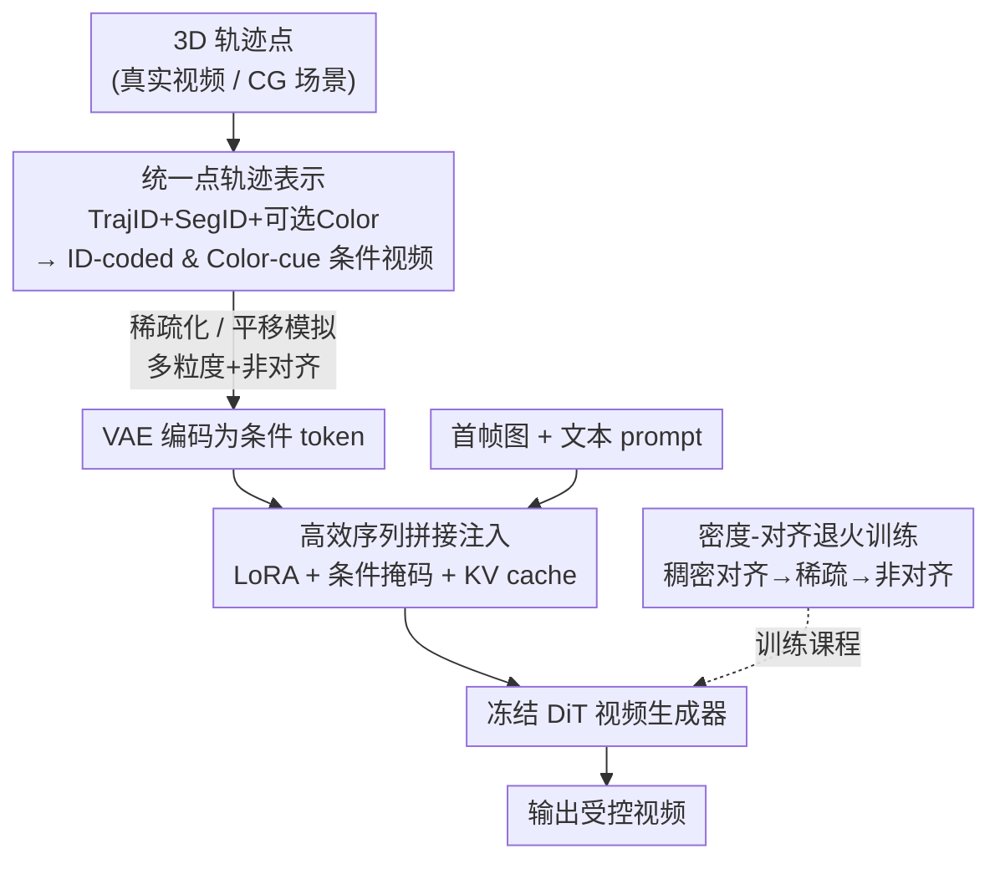

# FlexTraj: Image-to-Video Generation with Flexible Point Trajectory Control

**会议**: CVPR 2026  
**论文**: [CVF Open Access](https://openaccess.thecvf.com/content/CVPR2026/html/Zhang_FlexTraj_Image-to-Video_Generation_with_Flexible_Point_Trajectory_Control_CVPR_2026_paper.html)  
**代码**: [项目页](https://bestzzhang.github.io/FlexTraj)  
**领域**: 视频生成  
**关键词**: 图像到视频生成, 轨迹控制, 点轨迹表示, 序列拼接条件注入, 退火训练

## 一句话总结
FlexTraj 用一套带轨迹ID/分割ID/可选颜色的统一点轨迹表示，配合"高效序列拼接"的条件注入和"密度-对齐退火"训练课程，让单个图像到视频模型同时支持稠密、空间稀疏、时间稀疏乃至非对齐的多粒度轨迹控制，在 DAVIS / FlexBench 上轨迹误差与视频质量都显著优于现有专用方法。

## 研究背景与动机
**领域现状**：扩散视频生成（Sora、CogVideoX、Wan）画质已经很强，但"可控性"仍是公开难题。为了让用户能指定运动，前人引入了各种条件信号——深度图、边缘、框、mask、人体姿态等，但这些都只对应**单一控制粒度**。点轨迹（point trajectory）天生不同：通过调节采样密度，它能在"稠密稠到每个像素"和"稀疏到几个拖拽点"之间连续滑动，理论上是统一各种控制粒度的理想载体。

**现有痛点**：可惜这个潜力一直没被吃透。大多数点轨迹方法（DragNuwa、ToRA）只做 2D 拖拽；少数扩到 3D 的也只能二选一——要么只支持稀疏（LeviTor）、要么只支持稠密（DAS）。最近的 Motion Prompting 想统一稀疏/稠密，做法是**推理时用手工模板把稀疏信号"densify"成稠密**，但模板是人工设计的、模型本身没在多样条件下训练过，精度和灵活性都受限。更要命的是：几乎所有方法都**假设输入运动和首帧严格结构对齐**，一旦用户给的运动来自另一个角色、或者只是几个粗糙立方体（CG 场景），它们就崩。

**核心矛盾**：一个模型要同时学会"稠密且对齐"（高确定性，应该收敛快）和"稀疏且非对齐"（高灵活性，参数搜索空间大），这两种需求是相互拉扯的——直接把各种任务随机混在一起训练，模型在两种矛盾的监督信号间摇摆，收敛很差。

**本文目标**：造一个真正"多粒度 + 不依赖对齐"的统一轨迹控制框架，覆盖前人各自只能做一块的全部任务（稠密 / 空间稀疏 / 时间稀疏 / 非对齐）。

**切入角度**：作者拆成三个子问题——(1) 找一个足够表达力、能保持时序对应、还能容纳新出现的点的**点表示**；(2) 找一个在 DiT 主干上既可控又能容忍非对齐、还省算力的**条件注入方式**；(3) 找一个能让单模型稳定学会所有粒度的**训练课程**。

**核心 idea**：用"TrajID + SegID + 可选 Color"三属性的统一点表示渲染成两张条件视频，用 LoRA 加持的高效序列拼接把条件 token 注入 DiT，再用从稠密对齐逐步退火到稀疏非对齐的课程把它训出来。

## 方法详解

### 整体框架
FlexTraj 的输入是一张首帧图 + 文本 prompt + 一组带标注的 3D 轨迹点（来自真实视频跟踪或 CG 场景），输出是受这些轨迹控制的视频。整条管线分三步：先把 3D 轨迹点编码成**两张条件视频**（ID-coded 视频和 Color-cue 视频），这一步通过对点做稀疏化/平移就能模拟空间稀疏、时间稀疏、非对齐等各种控制；再用预训练 VAE 把两张条件视频压成 token，经"高效序列拼接 + LoRA"注入冻结的 DiT 视频生成器；最后靠"密度-对齐退火"课程把这个统一模型训练出来。三步分别对应论文的 §3.1 / §3.2 / §3.3，也正是下面三个关键设计。

### 关键设计

**1. 统一点轨迹表示：用三属性点把"谁、何时、长啥样"一次编码完**

痛点很具体：基于光流或高斯图的表示缺乏显式时序对应（同一个点跨帧对不上号），而 DAS 那种"首帧颜色传播"的表示因为点身份在初始化时就固定了，无法表示后面**新出现**的点（比如人转头露出来的脸）。FlexTraj 给每个点 $p^t_i = (x^t_i, y^t_i, z^t_i, s_i, u_i, a_i)$ 挂三个属性：分割ID $s_i$ 区分不同物体实例、轨迹ID $u_i$ 在实例内索引具体哪个点、可选颜色向量 $a_i$ 编码外观。然后把这些标注点投影回像素空间渲染成两张条件视频——ID-coded 视频 $V_{ID}$ 把 SegID 放红通道、TrajID 放绿蓝通道，Color-cue 视频 $V_{Color}$ 记录可选颜色。妙处在于：TrajID 保证了跨帧对应（解决时序），SegID 让新出现区域知道自己属于哪个实例（解决新点），而**控制粒度只是采样密度的函数**——采得稠就是稠密控制、采几个点就是稀疏控制，全部投影成同一种条件视频格式，天然统一了不同粒度。颜色属性是"可选"的：相机重定向等需要外观线索时才给，平时省略，模型两种情况都能处理。

**2. 高效序列拼接条件注入：用注意力交互代替 ControlNet 的结构对齐绑定**

把条件 token 塞进生成模型不是小事。最直觉的 ControlNet 式注入在 DiT 主干上可控性差，而且它**隐式强制结构对齐**——条件和首帧必须对齐，这正好和"支持非对齐"的目标冲突。另一头，朴素的序列拼接虽然灵活，但训练时计算量爆炸。FlexTraj 的折中是"高效序列拼接"：先用 CogVideoX 的预训练 VAE 把两张条件视频编码成 $Z_{ID}, Z_{Color}$，再用零初始化线性投影 $W$ 融合成 $Z_c = Z_{ID} + W Z_{Color}$（零初始化保证外观线索"加进来"而不冲掉结构信息），然后把条件 token 和噪声 token $Z_n$、文本 token $Z_t$ 拼成统一序列 $Z = [Z_n; Z_t; Z_c]$，并让 $Z_c$ 复用 $Z_n$ 的位置编码以保留空间对齐线索。微调上只用 LoRA：在 DiT 的 QKV 投影上加低秩更新 $Q_c = Q + \Delta Q_c$（K、V 同理），且**只在处理条件 token 时启用**，冻结底座保住生成能力，按标准扩散目标 $L_{diff} = \mathbb{E}\big[\|\epsilon - \epsilon_\theta(x_t, t, Z)\|_2^2\big]$ 优化。关键在于：条件通过**注意力交互**而非直接相加进入生成，所以不强求严格对齐，天然容忍非对齐输入。再借鉴 EasyControl 加一个条件掩码——让条件 token 不去 attend 噪声/文本 token（$M_{ij} = -\infty$ 当 $i \in Z_c, j \in Z_n \cup Z_t$，否则为 0），而反向查询允许。由于条件 token 跨时间步固定，它们的 $K_c, V_c$ 可以在 $t=0$ 算一次后缓存复用，推理省下约 50% 算力。

**3. 密度-对齐退火训练课程：从最确定的稠密对齐一步步退火到稀疏非对齐**

为什么需要这个？作者一开始想偷懒——把不同类型条件随机混着采样训练，结果很差。原因是参数搜索空间被撑大了：稠密对齐输入确定性强、好学，而非对齐输入需要很大灵活性，两者对模型提出相反的要求，混在一起难以稳定收敛。FlexTraj 改成四阶段课程：(1) 先在**最确定的稠密+对齐**设置下训，ID-coded 和 Color-cue 两张视频都齐全，信息最丰富、收敛最快；(2) 仍然稠密，但以概率 $p_c$ 随机丢掉 Color-cue 视频，稠密的确定性保证收敛稳定；(3) 模型在稠密上稳住后，逐步引入空间和时间稀疏——空间稀疏靠随机丢轨迹或按段丢、只保留比例 $p_s$，时间稀疏靠只保留 $p_t$ 的帧（均匀或随机选）；(4) 最后才训**非对齐**，把轨迹相对输入帧做平移，并**降低学习率**以缓解对前面已学能力的灾难性遗忘，还从 CG 场景合成非对齐轨迹对来增加变化。这条"从易到难、从确定到灵活"的退火路线，让单个模型平滑地泛化到各种稀疏度和对齐程度。

### 损失函数 / 训练策略
训练目标就是标准扩散去噪损失（式 6），底座 DiT 全程冻结、只学 LoRA 低秩更新和零初始化融合投影 $W$。训练数据约 4 万真实视频（VideoPainter）+ 2.5K 舞蹈视频（HumanVid）+ 5K CG 合成视频（Mixamo，含同姿态不同角色用于造非对齐对），轨迹标注用 SAM 做视频分割 + SpatialTracker 做稠密点跟踪自动生成。

## 实验关键数据

### 主实验
在 DAVIS 和自建 FlexBench 上跨四个任务对比，FVD 越低越好、Consistency / TrajSIM 越高越好、TrajErr 越低越好（每格为 DAVIS(FlexBench)）：

| 任务 | 方法 | FVD↓ | Consistency↑ | TrajErr / TrajSIM |
|------|------|------|--------------|-------------------|
| 稠密 | DAS | 714.3 (1338.8) | 0.981 | 0.029 |
| 稠密 | MagicMotion | 705.3 (1621.0) | 0.980 | 0.116 |
| 稠密 | **Ours** | **532.4** (1397.8) | 0.979 | **0.017** |
| 空间稀疏 | ToRA | 1233.3 (1210.2) | 0.974 | 0.058 |
| 空间稀疏 | LeviTor | 1337.3 (1944.2) | 0.951 | 0.050 |
| 空间稀疏 | **Ours** | **710.4** (851.6) | 0.980 | **0.025** |
| 时间稀疏 | SparseCtrl | 2533.4 (2949.8) | 0.967 | 0.087 |
| 时间稀疏 | MagicMotion | 1054.4 (1719.4) | 0.978 | 0.100 |
| 时间稀疏 | **Ours** | **837.0** (1144.8) | **0.983** | **0.031** |
| 非对齐 | DAS | 773.9 (2716.3) | 0.979 | TrajSIM 0.861 |
| 非对齐 | **Ours** | **622.3** (2654.2) | 0.976 | TrajSIM **0.908** |

跨四个任务，FlexTraj 几乎都拿到最低 TrajErr / 最高 TrajSIM 和最优/次优 FVD；Consistency 偶尔略低，作者解释是它生成的视频运动幅度更大，这个指标天然会被大运动拉低。

### 消融实验
DAVIS 上结果记为 Aligned | Unaligned：

| 配置 | FVD↓ | Consistency↑ | TrajErr↓ \| TrajSIM↑ | 说明 |
|------|------|--------------|----------------------|------|
| w/o TrajID(CorrID) | 668.2 \| 606.0 | 0.982 \| 0.976 | 0.029 \| 0.904 | 去轨迹ID，时序对应模糊 |
| w/o SegID | 707.9 \| 636.6 | 0.982 \| 0.976 | 0.040 \| 0.895 | 去分割ID，实例混淆 |
| ControlNet | 1083.2 \| 1098.4 | 0.988 \| 0.988 | 0.131 \| 0.556 | 换回 ControlNet 注入 |
| RandomMix | 1034.6 \| 1003.8 | 0.993 \| 0.993 | 0.126 \| 0.588 | 随机混合训练 |
| Sparse2Dense | 1030.0 \| 987.6 | 0.987 \| 0.987 | 0.126 \| 0.592 | 稀疏转稠密的反向课程 |
| **Ours (Full)** | **693.3 \| 622.25** | 0.981 \| 0.976 | **0.024 \| 0.908** | 完整模型 |

### 关键发现
- **条件注入方式贡献最大**：换回 ControlNet 后 TrajErr 从 0.024 暴涨到 0.131、非对齐 TrajSIM 从 0.908 跌到 0.556，证明 ControlNet 的对齐偏置正是非对齐场景崩坏的根源。
- **训练课程不可省**：RandomMix 和 Sparse2Dense（反向课程）的 TrajErr 都飙到 0.126 左右，说明"从稠密对齐退火到稀疏非对齐"的顺序本身是关键，反着来或随机来都学不好。
- **TrajID/SegID 各司其职**：去掉 TrajID 时形状还在但点对应错乱、旋转方向错；去掉 SegID 时两个相向的人会被错误合并；去掉 Color 时实例分对了但外观跑偏。
- **泛化性**：换到 Wan2.2 主干同样有效，且在更长序列上潜力更大；5B 的 Wan2.2 版本在 MoveBench 上 FID 甚至超过 14B 的 Wan-Move。

## 亮点与洞察
- **"控制粒度 = 采样密度"的统一视角很漂亮**：把稠密/稀疏/时间稀疏全部塞进同一种"投影成条件视频"的格式，模型无需为每种粒度单独设计输入，这个抽象是它能"一个模型通吃"的根本原因。
- **三属性点表示同时解决两个老问题**：TrajID 管时序对应、SegID 管新出现的点，正好补上了光流表示和颜色传播表示各自的硬伤，而且只是给点多挂两个整数。
- **非对齐能力来自"注意力交互而非直接相加"**：把"为什么 ControlNet 不行"想透了——它的加法注入隐式绑定结构对齐，改成序列拼接让条件通过 attention 被"查询"，对齐就从硬约束变成软线索，这个洞察可迁移到其他需要容忍输入失配的条件生成任务。
- **条件 token 跨时间步固定 → KV cache 省 50%**：一个很实用的工程 trick，条件不随去噪步变化的场景都能套用。

## 局限与展望
- 评测主要在 DAVIS / FlexBench / MoveBench 上，且 Consistency 指标在大运动下天然偏低，作者用"运动更大"来解释偏低，缺少更解耦的运动质量度量。
- 轨迹标注依赖 SAM + SpatialTracker 自动生成，跟踪/分割误差会传导进训练监督，论文未量化这部分噪声的影响。
- 非对齐能力很大程度依赖 CG 合成的非对齐轨迹对，真实世界中"语义对应但结构差异大"的非对齐分布是否被充分覆盖存疑。
- 四阶段退火课程的各阶段切换点、丢弃概率 $p_c/p_s/p_t$ 等超参看起来需要手工调，自动化或自适应课程是可改进方向。

## 相关工作与启发
- **vs DAS**：同为 3D 稠密点轨迹控制，DAS 用首帧颜色传播保时序一致，但点身份在初始化时固定、无法表示新出现的点；FlexTraj 用 TrajID+SegID 显式编码身份，既保时序又容纳新点，且额外支持稀疏和非对齐。
- **vs LeviTor**：LeviTor 把分割 mask 聚成稀疏点 + 深度，但点之间缺乏对应、且 U-Net 主干限制了性能；FlexTraj 在 DiT 上做、点带显式对应，稀疏控制下 FVD（710 vs 1337）和保真度都更好。
- **vs Motion Prompting**：它推理时用手工模板把稀疏信号 densify 来"统一"稀疏/稠密，模板人工设计、模型未在多样条件下训练；FlexTraj 直接用退火课程把多粒度训进单模型，精度和灵活性都更高。
- **vs MagicMotion**：MagicMotion 用 mask/box 做稠密和稀疏，但两者离散不连续、只支持物体级 2D 运动；FlexTraj 用连续点轨迹，支持部件级和 3D 控制（遮挡、旋转）。

## 评分
- 新颖性: ⭐⭐⭐⭐⭐ 首个同时支持多粒度+非对齐的轨迹控制框架，统一点表示和退火课程都有原创性
- 实验充分度: ⭐⭐⭐⭐ 四任务对比 + 完整消融 + 跨主干泛化，但部分指标解释偏定性
- 写作质量: ⭐⭐⭐⭐⭐ 三个子问题→三个设计的结构清晰，动机和取舍讲得透
- 价值: ⭐⭐⭐⭐⭐ 给可控视频生成提供了一套可统一多种控制粒度的实用范式，对 CG/创作流程意义明确

<!-- RELATED:START -->

## 相关论文

- [\[ICLR 2026\] Learning Video Generation for Robotic Manipulation with Collaborative Trajectory Control](../../ICLR2026/video_generation/learning_video_generation_for_robotic_manipulation_with_collaborative_trajectory.md)
- [\[CVPR 2026\] Diverse Video Generation with Determinantal Point Process-Guided Policy Optimization](diverse_video_generation_with_determinantal_point_process-guided_policy_optimiza.md)
- [\[CVPR 2026\] Generative Video Motion Editing with 3D Point Tracks](generative_video_motion_editing_with_3d_point_tracks.md)
- [\[CVPR 2026\] ConsID-Gen: View-Consistent and Identity-Preserving Image-to-Video Generation](consid-gen_view-consistent_and_identity-preserving_image-to-video_generation.md)
- [\[CVPR 2026\] CamDirector: Towards Long-Term Coherent Video Trajectory Editing](camdirector_towards_long-term_coherent_video_trajectory_editing.md)

<!-- RELATED:END -->
