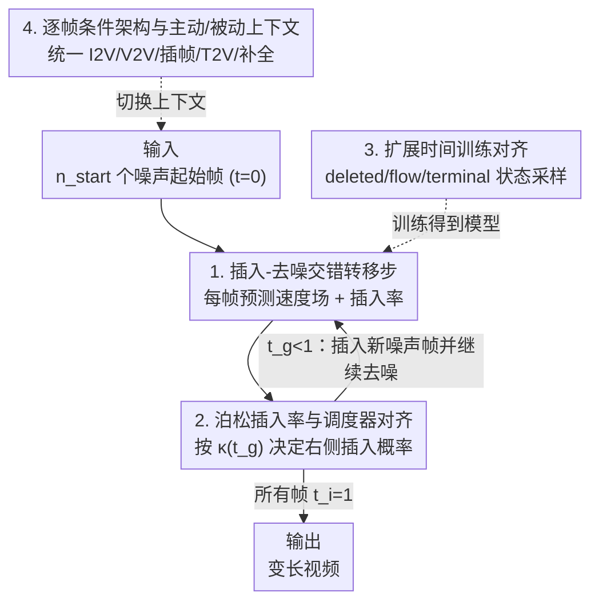

# Flowception: Temporally Expansive Flow Matching for Video Generation

**会议**: CVPR 2026  
**论文**: [CVF Open Access](https://openaccess.thecvf.com/content/CVPR2026/html/Ifriqi_Flowception_Temporally_Expansive_Flow_Matching_for_Video_Generation_CVPR_2026_paper.html)  
**代码**: 待确认  
**领域**: 视频生成 / 流匹配  
**关键词**: 流匹配, 视频生成, 非自回归, 变长生成, 帧插入

## 一句话总结
Flowception 把"连续流匹配去噪"和"离散帧插入"两件事编织进同一条概率路径，让一个非自回归模型在采样过程中既能任意顺序地往序列里插帧、又能同时把已有帧逐步去噪，从而做到变长视频生成，并在 FVD / VBench 上同时超过全序列与自回归两条基线，训练 FLOPs 还省了约 3 倍。

## 研究背景与动机

**领域现状**：扩散与流匹配把高保真图像生成迁到视频上，主流分两派。一派是**全序列生成**（full-sequence），把整段视频当一个大张量、所有帧共享一个全局时间步、用双向注意力一起去噪；另一派是**时序自回归**（AR），从左到右一帧（或一块帧）接一帧地生成。

**现有痛点**：全序列模型靠双向注意力能在去噪过程中互相纠错，质量高，但它一次性并行去噪整段序列，帧没去噪完就吐不出来、无法流式输出；而且生成长度固定、注意力开销随帧数平方增长，长视频做不动。AR 模型能流式（生成完一帧就立刻显示、后续帧 attend 前面已生成的帧），但有两个硬伤：一是**曝光偏差**——训练时用真值帧当上下文、推理时却只能 condition 在模型自己生成的不完美帧上，这种 train-test 不匹配让模型学不会从错误里恢复，小瑕疵会沿帧链逐级放大、视频质量迅速崩坏；二是为了能做 KV cache（不做的话 AR 采样贵到不可接受），AR 往往用因果注意力掩码，又限制了模型表达力。

**核心矛盾**：全序列「质量高但开销大、定长、不能流式」，AR「能流式但有误差累积、因果注意力受限」——两条路各让你在质量、效率、灵活性之间二选一。

**本文目标**：要一个框架同时摆平：① 去掉 AR 的误差累积和因果注意力束缚；② 去掉全序列的定长限制；③ 把全序列的计算开销压下来。

**切入角度**：作者注意到，如果生成时**帧不是一次插满、而是逐步插入**，那么采样早期序列很短、只有少量帧需要去噪，注意力开销天然就小；而插入位置如果由模型自己决定、不强制左到右，远处帧就能在序列还很短的早期互相协调，既避免误差累积又不必依赖因果掩码。

**核心 idea**：把连续流匹配（Flow Matching）和离散编辑流（Edit Flow）拼成一个统一模型——学一条**交错"插帧"与"去噪"**的概率路径，让模型在每个采样步既预测一个去噪用的速度场、又预测一个决定是否插帧的插入率，得到一个变长序列上的**耦合 ODE–跳跃过程**，支持任意顺序、任意长度的生成。

## 方法详解

### 整体框架

Flowception 在"变长帧序列"空间 $\mathcal{X}=\bigcup_{n=0}^{\infty}\mathbb{R}^{n\times H\times W\times C}$ 上工作：每个序列 $X$ 配一个**逐帧时间向量** $t\in\bigcup_n[0,1]^n$，也就是每帧带自己的噪声水平（而不是全序列共享一个时间步）。模型在每个位置 $i$ 输出两样东西：一个**插入率** $\lambda^\theta_i(X,t)\in\mathbb{R}_{\ge 0}$（预测该位置右侧缺多少帧），一个**速度场** $v^\theta_i(X,t)\in\mathbb{R}^{H\times W\times C}$（用来去噪已有帧）。

生成时，先采 $n_{\text{start}}$ 个噪声起始帧（都置 $t_i=0$），然后反复做**转移步**：每步同时（i）按速度场把所有现存帧往前流一点 $X_i\leftarrow X_i + h\,v^\theta_i$，（ii）按插入率以一定概率在某些帧右侧插入一个全新噪声帧（从单位高斯采样、初始 $t=0$）。一个全局时间 $t_g$ 从 0 走到 1 控制"还能不能插帧"，当所有帧都到 $t_i=1$ 就停。这样一段视频就由"先撒下几个远处关键帧、再不断往缝里插帧并去噪"逐渐长出来——而且因为帧只由相对顺序决定、靠开关"主动/被动上下文帧"就能统一支持 I2V、V2V、插帧、T2V、场景补全等多种任务。

### 关键设计

**1. 插入-去噪交错的耦合 ODE–跳跃转移步：让"长出新帧"和"去噪老帧"在同一步里同时发生**

这是 Flowception 区别于一切定长流模型的根：传统流匹配在固定形状的张量上跑连续 ODE，序列长度从头到尾不变；而这里序列长度本身是会变的。作者用一个**插入操作** $\mathrm{ins}(X,i,\varepsilon)=(X_1,\dots,X_i,\varepsilon,X_{i+1},\dots,X_n)$ 在位置 $i$ 后塞进一个 0-SNR 的噪声帧。每个转移步在所有位置同时做两件事：先做流步 $X_i = X_i + h\,v^\theta_i(X,t)$ 把现存帧去噪一点；再以概率 $h\,\frac{\dot\kappa(t_g)}{1-\kappa(t_g)}\lambda^\theta_i$ 执行一次插入 $X=\mathrm{ins}(X,i,\varepsilon),\ t=\mathrm{ins}(t,i,0)$。这就构成一个连续流（ODE）与离散插入（jump）耦合的过程：新帧一被插进来，就在"其它已部分去噪的帧"的上下文里被一起继续去噪，于是后插入的帧时间值天然滞后（$t_i\le t_g$）。它的好处是后插的帧从一开始就能看到周围帧的内容、互相协调，从根上避开了 AR"先把前帧定死、再去噪后帧"导致的误差累积。

**2. 泊松插入率与调度器对齐：用一个可学计数头决定"在哪、插几帧"，并保证插入节奏和可见帧分布一致**

模型怎么知道某个位置该不该插帧、插多少？作者让插入率头 $\lambda_i$ 直接预测**该位置右侧缺失的帧数**，并按泊松分布的负对数似然来训练（沿用 OneFlow 的思路）：记 $k_i$ 为位置 $i$ 与 $i+1$ 之间真实缺失的帧数，则 $\mathcal{L}_{\text{ins}}=\sum_{i}\lambda^\theta_i(X,t)-k_i\log\lambda^\theta_i(X,t)$。采样时再用一个单调**调度器** $\kappa(t_g)$（$\kappa(0)=0,\kappa(1)=1$，主用线性 $\kappa(t)=t$）规定"全局时间 $t_g$ 时刻每个非起始帧已经出现的概率为 $\kappa(t_g)$"。转移步里那个插入概率系数 $\frac{\dot\kappa(t_g)}{1-\kappa(t_g)}$ 正是为了把插入速率校准到这个调度分布上——既由数据驱动决定"插在哪"，又由调度器统一控制"整体插入快慢"。与 OneFlow 一致，插入率不显式 condition 在时间上，$t_g$ 只在采样时跟踪、不喂进模型；定步长推理下最多迭代次数约为 $t_g$ 走到 1 所需步数的两倍。

**3. 扩展时间训练对齐：用 deleted/flow/terminal 三态采样消除训练-生成的分布失配**

生成过程会诱导出一个很特殊的分布：同一时刻不同帧处在不同时间值、有的帧甚至还没被插入。训练若不复现这个分布，就会出现 train-test mismatch。作者的解法是引入**扩展时间** $\tau$（可超出 $[0,1]$），并定义裁剪 $t=\mathrm{clip}(\tau)=\max\{0,\min\{1,\tau\}\}$。一方面把全局时间扩成 $\tau_g\in[0,2]$（因为 $t_g$ 到 1 后不再插帧、但已有帧还要继续去噪到 1，需要多出来的预算），$t_g=\mathrm{clip}(\tau_g)$；另一方面，线性调度下新帧在 $t_g\in[0,1]$ 上均匀插入，于是每帧的时间滞后 $u_i=\tau_g-\tau_i\sim\mathrm{Unif}(0,1)$，得 $\tau_i=\tau_g-u_i\in[-1,2]$。由此每帧落入三种状态之一：$\tau_i<0$ 为 **deleted**（还没被插入）、$0\le\tau_i<1$ 为 **flow**（在去噪）、$\tau_i\ge 1$ 为 **terminal**（冻结完成）。训练时只需采 $\tau_g\sim p(\tau_g)$、令 $\tau_i=\tau_g-u_i$，取出可见帧 $X^{\text{visible}}_1=(X_i\mid\tau_i>0)$，按 $X=tX^{\text{visible}}_1+(1-t)X_0$（$X_0\sim\mathcal{N}(0,I)$）构造带噪序列，速度头用标准流匹配损失 $\mathcal{L}_{\text{vel}}=\lVert v^\theta(X,t)-(X^{\text{visible}}_1-X_0)\rVert^2$ 训练。这套扩展时间机制让训练采到的"谁可见、谁在什么噪声水平"分布与生成时严格对齐，是整个框架能 work 的关键保证。

**4. 逐帧条件 DiT 架构与主动/被动上下文：一个模型靠相对顺序统一多任务**

要让同一帧序列里各帧带不同时间步，作者把 DiT 的 AdaLN 调制改成**逐帧**操作；为区分噪声帧和条件帧，把输入通道翻倍——前 $C$ 通道放噪声帧、后一组放输入/条件帧（或零填充）。插入率头则给每帧 token 拼一个可学 token，过简单 MLP 加指数激活得到非负率。基线模型是 38 个注意力块、隐维 1536、24 个头、约 2.1B 参数，位置编码用 VideoROPE，帧间（及可选拼接的文本 token，MMDiT 风格）走全双向注意力。因为某时刻的帧只由**相对顺序**指定，作者把上下文帧分成**主动**（可在其右侧诱导插入）和**被动**（不触发插入）两类：单张主动帧 → I2V；给一串有序条件帧、让模型自由在中间插帧 → 帧插值（且无需指定每两帧间要插几帧）；不同主动/被动组合 → V2V、T2V、场景补全。一套权重、靠切换上下文就覆盖全部任务，不必为每个任务单独训练。

### 损失函数 / 训练策略
总损失为插入损失与速度损失之和：$\mathcal{L}_{\text{ins}}$（泊松计数 NLL，监督 $\lambda_i$）+ $\mathcal{L}_{\text{vel}}$（标准流匹配 L2，监督速度场 $v_i$）。训练时按扩展时间 $\tau_g$ 采样构造带噪变长序列（见关键设计 3）。效率上：线性调度下 $\mathbb{E}_{p(\tau_g)}[\kappa(\tau_g)^2]=\int_0^1\tau_g^2\,d\tau_g=1/3$，故训练期注意力 FLOPs 约为全序列流匹配的 $1/3$；采样时最晚的流更新发生在 $\tau_g=2$，最多用两倍流迭代，即约 $2/3$ 的全序列 FLOP（实测墙钟约快 30%，1.5×）。T2V 实验中作者在开源 LTX-2b（0.9.5）上做完架构改动后再微调。

## 实验关键数据

数据集用了 Tai-Chi-HD、RealEstate10K（窄域）与 Kinetics-600（类结构），默认 256 分辨率、最多生成 145 帧 @16FPS；用 LTX autoencoder（空间下采样 32、时间下采样 8，并改 decoder 传播帧有效性 mask 以支持变长解码）。指标为 FVD（对 5k 训练子集算）与 VBench 若干项。对比两条基线：全序列、逐帧自回归（含因果/非因果两种注意力）。

### 主实验：Image-to-Video（256 分辨率，145 帧）

| 数据集 | 方法 | Imaging↑ | Background↑ | Aesthetic↑ | Subject↑ | Dynamic↑ | FVD↓ |
|--------|------|----------|-------------|------------|----------|----------|------|
| Kinetics-600 | Full Seq. | 37.09 | 94.75 | 39.42 | 92.46 | 44.35 | 204.65 |
| Kinetics-600 | Autoreg. | 38.77 | 92.69 | 38.17 | 85.82 | 54.66 | 201.34 |
| Kinetics-600 | **Flowception** | **41.92** | **96.96** | **42.05** | **94.74** | 47.07 | **164.73** |
| Tai-Chi-HD | Full Seq. | 47.48 | 94.42 | 54.93 | 92.18 | 18.61 | 27.30 |
| Tai-Chi-HD | Autoreg. | 47.15 | 95.93 | 54.98 | 93.41 | 21.23 | 25.30 |
| Tai-Chi-HD | **Flowception** | **48.42** | 95.93 | 54.96 | **94.43** | 20.02 | **25.21** |
| RealEstate10K | Full Seq. | 50.11 | 93.48 | 44.53 | 85.85 | 81.64 | 26.17 |
| RealEstate10K | Autoreg. | 48.55 | 93.84 | 44.48 | 87.29 | 72.60 | 47.48 |
| RealEstate10K | **Flowception** | **51.18** | **96.93** | **48.09** | 87.02 | 78.59 | **21.80** |

Flowception 在三个数据集上 FVD 全面领先（Kinetics-600 从 ~201–205 降到 164.73；RealEstate10K 从 26–47 降到 21.80），VBench 多数项最优或次优。T2V 上（微调 LTX-2b，CFG=7.0、50 NFEs）Flowception 把 Imaging 51.37 / Aesthetic 49.56 都拉到高于原版 LTX（49.22 / 48.25）与全序列微调版（47.96 / 47.28），仅 Dynamic 略降；墙钟比全序列稳定快约 30%。

### 消融一：插入顺序方案（RealEstate10K）

| 插入方式 | FVD↓ | Motion↑ | Dynamic↑ |
|----------|------|---------|----------|
| Random（随机） | 25.03 | 99.09 | 70.68 |
| Hierarchical（层次二分） | 23.94 | 99.10 | 71.20 |
| Left-to-right（左到右） | 23.61 | 99.03 | 73.04 |
| **Flowception 学习插入率** | **21.80** | **99.30** | **78.59** |

FVD 随插入策略从随机 → 层次 → 左到右 → 数据驱动逐级变好，证明"让模型学在哪插帧"确实带来增益。一个值得注意的对照：这里左到右版 FVD 23.61 远好于表 4 里 AR 基线的 47.48/45.13——作者推测原因是 AR 基线"前帧完全去噪并定死后才去噪下一帧"，而 Flowception 即便左到右插帧，新帧也是在前帧尚未完全去噪时就开始去噪（更接近全序列基线 26.17 的行为）。

### 消融二：AR 注意力模式对比（RealEstate10K）

| 指标 | AR 因果 | AR 非因果 | Flowception |
|------|---------|-----------|-------------|
| FVD↓ | 47.48 | 45.13 | **21.80** |
| Imaging↑ | 48.55 | 48.70 | **51.18** |
| Background↑ | 93.84 | 93.88 | **96.93** |
| Aesthetic↑ | 44.48 | 45.28 | **48.09** |
| Subject↑ | 87.29 | 87.46 | 87.02 |
| Dynamic↑ | 72.60 | 73.52 | **78.59** |

非因果 AR 全面略优于因果 AR（佐证因果掩码限制表达力），但二者 FVD 仍在 45+ 量级；Flowception 把 FVD 砍到 21.80，除 Subject consistency 外各项都更优。

### 关键发现
- **学习插入位置最关键**：消融一显示数据驱动插入比任何固定顺序都好；且 Flowception 倾向"先插远处帧定运动、后插近帧做平滑插值"，呈现 emergent 的 coarse-to-fine 生成顺序。
- **早期短序列利于局部注意力**：因为远处帧在序列还短时就已互相 attend，Flowception 比全序列更扛得住把注意力限制到 ±K 帧的局部窗口（图 8：窗口变小时 Flowception 的 FVD 退化远小于全序列）。
- **误差累积来自"定死前帧"而非"左到右"本身**：左到右插入只要允许前帧未完全去噪就一起协同，FVD 仍能很低，说明 AR 退化的根因是"committed 前帧"。

## 亮点与洞察
- **把离散插入和连续去噪统一成一条概率路径**：用耦合 ODE–跳跃过程描述变长生成，理论上自洽（流匹配 + 编辑流），工程上只需在 DiT 上加一个插入率头，改动极小却换来变长 + 任意顺序生成能力。
- **扩展时间 $\tau\in[-1,2]$ 的 deleted/flow/terminal 三态设计很巧**：它用一个简单的"全局时间减均匀滞后"采样，就精确复现了生成时"各帧处于不同噪声水平、部分帧尚未出现"的复杂分布，把训练-生成对齐这个难点化简成一行采样公式，可迁移到其它需要变长/逐 token 生成的扩散框架。
- **效率增益是结构带来的、不是 trick**：早期序列短 → 注意力 FLOPs 期望降到 $1/3$（$\int_0^1\tau^2 d\tau$），这是"逐步插帧"调度的数学副产物，干净漂亮。
- **一套权重多任务**：靠主动/被动上下文帧的相对顺序就能覆盖 I2V/V2V/插帧/T2V/补全，且插帧无需指定缝里要插几帧——比需要显式 mask 指定长度的方法更灵活。

## 局限与展望
- **训练迭代翻倍**：作者承认，在部分序列上训练虽换来这些 emergent 行为，但为保证所有帧完全去噪，扩展时间要走到 $\tau_g=2$，迭代次数大约翻倍；探索更高效的交错调度是明确的未来方向。
- **完整推导藏在补充材料**：正文对插入概率系数 $\frac{\dot\kappa}{1-\kappa}$、一般调度器下的滞后分布、FLOPs 细算都说"详见 supplementary"，正文读者只能拿到直觉版，部分公式细节 ⚠️ 以原文（含补充材料）为准。
- **多为窄域/中等分辨率验证**：主实验在 Tai-Chi-HD / RealEstate10K / Kinetics-600、256 分辨率上做；通用域 2M 视频的大模型结果放在补充材料，正文未给定量对比，真实大规模长视频上的表现还需更多公开数据支撑。
- **指标偏自动**：评测以 FVD + VBench 为主，缺人评/长程一致性的系统量化，对"长期 drift 改善"的论证更多靠定性图。

## 相关工作与启发
- **vs 全序列流/扩散（如把视频当大张量一起去噪）**: 全序列靠双向注意力质量高但定长、注意力平方开销大、不能流式；Flowception 同样保留全双向注意力与协同纠错能力，但靠逐步插帧把训练 FLOPs 降到约 $1/3$、采样约 $2/3$，且天然变长。
- **vs 自回归（因果/非因果逐帧）**: AR 能流式但有曝光偏差导致的误差累积，且为 KV cache 常用因果掩码限制表达力；Flowception 不锁定前帧、允许远处帧早期协同，FVD 从 45+ 降到 21.80，从根上规避误差累积。
- **vs "多帧同时去噪但严格左到右"的 AR 变体（later 帧更噪）**: 这类方法虽同时去噪多帧，但维持严格左到右插入顺序，无法在去噪早期让远处帧协调；Flowception 允许任意顺序插入，恰好补上这点。
- **vs 关键帧 + 插值的分解方法（MovieDreamer / ART-V）**: 它们先（自回归）生关键帧再用 I2V 补帧、并靠 CLIP/掩码扩散缓解 drift；Flowception 把关键帧与插值统一进同一条插入-去噪路径，无需显式两段式、也无需指定缝隙长度。

## 评分
- 新颖性: ⭐⭐⭐⭐⭐ 把连续流匹配与离散编辑流统一成耦合 ODE–跳跃过程做变长视频生成，思路新且理论自洽
- 实验充分度: ⭐⭐⭐⭐ 三数据集 + I2V/T2V/插帧 + 插入顺序/注意力/局部窗口多组消融充分，但缺人评、通用域定量与更高分辨率
- 写作质量: ⭐⭐⭐⭐ 动机-方法-效率链条清晰，配图直观；但关键推导大量外推到补充材料，正文稍欠自足
- 价值: ⭐⭐⭐⭐⭐ 为长视频/灵活编辑提供了兼顾质量、效率、变长与多任务的统一替代范式，潜在影响大

<!-- RELATED:START -->

## 相关论文

- [\[CVPR 2026\] Transition Matching Distillation for Fast Video Generation](transition_matching_distillation_for_fast_video_generation.md)
- [\[CVPR 2026\] Reward Forcing: Efficient Streaming Video Generation with Rewarded Distribution Matching Distillation](reward_forcing_efficient_streaming_video_generation_with_rewarded_distribution_m.md)
- [\[CVPR 2026\] RFDM: Residual Flow Diffusion Models for Video Editing](rfdm_residual_flow_diffusion_models_for_video_editing.md)
- [\[CVPR 2026\] FlowDirector: Training-Free Flow Steering for Precise Text-to-Video Editing](flowdirector_training-free_flow_steering_for_precise_text-to-video_editing.md)
- [\[CVPR 2026\] FlowPortal: Residual-Corrected Flow for Training-Free Video Relighting and Background Replacement](flowportal_residual-corrected_flow_for_training-free_video_relighting_and_backgr.md)

<!-- RELATED:END -->
