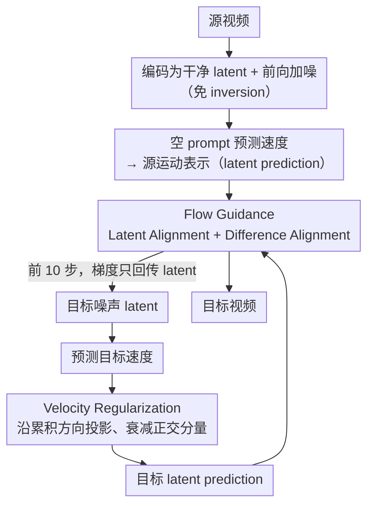

# FlowMotion: Training-Free Flow Guidance for Video Motion Transfer

**会议**: CVPR2026  
**arXiv**: [2603.06289](https://arxiv.org/abs/2603.06289)  
**代码**: [HKUST-LongGroup/FlowMotion](https://github.com/HKUST-LongGroup/FlowMotion)  
**领域**: 视频生成  
**关键词**: video motion transfer, flow matching, training-free, latent prediction, velocity regularization

## 一句话总结

提出 FlowMotion，一种无需训练的视频运动迁移框架，通过直接利用 flow-based T2V 模型的预测输出（latent prediction）构建运动引导信号，避免对模型内部层做梯度回传，在保持运动保真度的同时大幅降低推理时间和显存开销。

## 背景与动机

1. **视频运动迁移需求**：给定源视频和文本提示，生成保留源视频运动模式（物体移动、相机轨迹等）但渲染新场景的目标视频，在虚拟现实、影视制作等领域有广泛应用。
2. **训练方法代价高**：MotionDirector、MotionInversion 等方法需要对每个参考视频微调 temporal attention 或 LoRA 参数，训练耗时 20 分钟～2+ 小时，不适用于实时或大规模场景。
3. **现有 training-free 方法效率低**：MotionClone、SMM、DiTFlow 等方法依赖模型内部中间层输出（attention map / diffusion feature），需要通过内部深层做梯度回传，GPU 显存高达 51–89 GB，推理时间 350–1800+ 秒。
4. **中间层依赖限制灵活性**：现有 training-free 方法绑定特定架构（U-Net / DiT），难以泛化到新模型；部分方法还需要额外的 inversion 过程，进一步增加时间开销。
5. **Flow-based T2V 模型崛起**：Wan、HunyuanVideo 等基于 flow matching + DiT 的模型已成为 SOTA，但现有运动迁移方法尚未充分利用 flow-based 模型的特性。
6. **关键观察——早期 latent prediction 编码丰富时序信息**：作者分析发现，flow-based T2V 模型在去噪过程的前几步，其 latent prediction（单步估计的干净 latent）就已经包含粗糙的运动轨迹和时序动态，而外观细节随后逐步累积——这为直接在预测输出上构建运动引导提供了理论基础。

## 方法详解

### 整体框架

FlowMotion 想解决的痛点很具体：现有 training-free 运动迁移要么靠模型内部中间层（attention map / diffusion feature）做梯度回传，显存动辄 51–89 GB、推理几百上千秒，要么绑死特定架构、还得额外 inversion。作者的关键观察是——flow-based T2V 模型在去噪前几步的 **latent prediction**（单步估出的干净 latent）就已经编码了粗糙的运动轨迹和时序动态，外观细节是之后才逐步累积的。于是 FlowMotion 干脆直接在这个预测输出上做文章：先把源视频编码成干净 latent $z_0^{src}$、前向加噪到 $z_t^{src}$、过模型预测速度 $v_t^{src}$，算出运动表示 $\hat{z}_0^{src}(t) = z_t^{src} - t \cdot v_t^{src}$（无需 inversion）；目标视频生成时，在去噪前 10 步对目标 latent 算出它的 latent prediction，先经 **Velocity Regularization** 稳定速度更新，再用 **Flow Guidance** 与源运动表示对齐，**梯度只回传到 latent 本身、不穿过模型内部层**，所以显存极低、架构无关。

### 关键设计

**1. Flow Guidance：在 latent prediction 上做双重对齐，只抓运动不抓外观**

把引导建在 latent prediction 上还不够，得让它对齐「运动」而不是「外观」。作者设计两个对齐目标：**Latent Alignment（LA）** 直接对齐源和目标的 latent prediction、保持全局运动一致，$\mathcal{L}_{LA} = \|\hat{z}_0^{src}(t) - \hat{z}_0(t)\|_2^2$；**Difference Alignment（DA）** 改对齐帧间差分 $\triangle(\hat{z}_0^{src}(t))$ 和 $\triangle(\hat{z}_0(t))$，因为帧间差异强调的是时序变化、能把静态外观信息抑制掉，$\mathcal{L}_{DA} = \|\triangle(\hat{z}_0^{src}(t)) - \triangle(\hat{z}_0(t))\|_2^2$。两者按 $\alpha:\beta = 4:1$ 加权成 $\mathcal{L}_{FG} = \alpha \cdot \mathcal{L}_{LA} + \beta \cdot \mathcal{L}_{DA}$——LA 管整体一致、DA 管时序变化。

**2. Velocity Regularization：抑制正交分量，防止过对齐和方向突变**

直接优化 latent prediction 容易过拟合外观细节、时间步之间更新还不稳。作者把速度沿「累积平均速度」方向拆开来管：先算累积平均速度 $v_t^{avg} = (z_t - z_1) / (t-1)$，把当前速度分解为沿 $v_t^{avg}$ 的投影分量 $v_t^{proj}$ 和正交分量 $v_t^{orth}$，再用衰减因子 $\gamma=0.1$ 压住正交分量：$v_t^{reg} = v_t^{proj} + \gamma \cdot v_t^{orth}$，最后用正则化后的速度重算 latent prediction $\hat{z}_0(t) = z_t - t \cdot v_t^{reg}$。投影分量代表运动演化的主方向、保留，正交分量代表偏离主方向的抖动、衰减，从而既不过对齐又保持平滑稳定。消融里去掉它所有指标大幅下降（Text Sim. 从 0.347 掉到 0.313），证明它对稳定优化至关重要。

### 损失函数与优化

- 仅在前 10 / 50 去噪步施加引导，每步使用 Adam 优化器做 3 步迭代优化目标 latent
- 学习率 0.003，CFG scale = 6
- 梯度仅回传到 latent 而非模型内部→显存开销极低

## 实验关键数据

### 主实验量化对比（Table 1）

| 方法 | 类型 | 骨干 | Text Sim.↑ | Motion Fid.↑ | Temp. Cons.↑ | 训练时间(s) | 推理时间(s) | 显存(GB) |
|------|------|------|-----------|-------------|-------------|-----------|-----------|---------|
| LoRA Tuning | train | Wan2.1-1.3B | 0.327 | 0.782 | 0.977 | 8100 | 135 | 25.0 |
| MotionDirector | train | ZeroScope-0.7B | 0.335 | 0.801 | 0.969 | 1662 | 140 | 28.0 |
| MotionInversion | train | ZeroScope-0.7B | 0.328 | 0.839 | 0.970 | 1170 | 115 | 24.0 |
| DeT | train | CogVideoX-2B | 0.340 | 0.812 | 0.980 | 2760 | 133 | 20.0 |
| MotionClone | free | AnimateDiff-1.3B | 0.332 | 0.786 | 0.940 | - | 804 | 51.5 |
| MOFT | free | AnimateDiff-1.3B | 0.338 | 0.582 | 0.973 | - | 576 | 75.0 |
| SMM | free | ZeroScope-0.7B | 0.322 | 0.762 | 0.958 | - | 1839 | 89.4 |
| DiTFlow | free | CogVideoX-2B | 0.350 | 0.691 | 0.983 | - | 349 | 63.5 |
| **FlowMotion** | **free** | **Wan2.1-1.3B** | **0.347** | **0.850** | **0.986** | **-** | **213** | **19.3** |

FlowMotion 在 **Motion Fidelity（0.850）和 Temporal Consistency（0.986）上均为最优**，Text Similarity 第二仅次于 DiTFlow；推理时间仅 213s（training-free 最快），显存仅 19.3 GB（所有方法最低）。

### 消融实验（Table 3）

| 变体 | Text Sim.↑ | Motion Fid.↑ | Temp. Cons.↑ |
|------|-----------|-------------|-------------|
| w/o DA（去掉差异对齐） | 0.341 | 0.842 | 0.981 |
| w/o VR（去掉速度正则化） | 0.313 | 0.809 | 0.968 |
| **完整 FlowMotion** | **0.347** | **0.850** | **0.986** |

去掉 VR 后所有指标大幅下降（尤其 Text Sim. 从 0.347→0.313），说明速度正则化对稳定优化至关重要。

### 显存效率分析（Table 4，同骨干 Wan2.1-1.3B）

| 引导来源 | 显存 (GB) |
|---------|----------|
| 纯推理（无引导） | 17.7 |
| **Latent Prediction（本方法）** | **19.3** |
| Velocity 输出 | 93.1 |
| Attention Map & Feature | OOM |

Latent prediction 引导仅比纯推理多 1.6 GB，而直接用 velocity 做引导需 93 GB，attention 类引导直接 OOM。

### 用户研究（Table 2，20 名志愿者，1-5 分）

| 方法 | Motion↑ | Temp.↑ | Text↑ | Overall↑ |
|------|---------|--------|-------|----------|
| MotionInversion | 3.41 | 3.34 | 2.69 | 2.83 |
| DiTFlow | 2.48 | 3.18 | 3.16 | 2.63 |
| DeT | 3.87 | 3.83 | 3.38 | 3.47 |
| **FlowMotion** | **4.51** | **4.52** | **4.51** | **4.45** |

## 亮点

- **极简高效**：引导信号直接基于模型预测输出，梯度不穿过模型内部层，显存仅 19.3 GB，推理 213s，是 training-free 方法中效率最优的
- **无需 inversion**：通过前向加噪 + 空 prompt 提取源视频运动表示，跳过耗时的 inversion 过程
- **架构无关**：不依赖特定的 attention 结构或 U-Net/DiT 内部模块，已验证可泛化至 Wan2.1-1.3B 和 Wan2.2-5B
- **Velocity regularization 设计精巧**：通过将速度分解为沿累积方向的投影和正交分量，衰减正交分量来抑制过对齐，思路简洁有效

## 局限与展望

- 运动表示仍是全局的 latent-level 对齐，缺乏对局部/区域运动的精细控制（如只迁移前景运动而保持背景自由）
- 使用 latent prediction 作为运动表示会在一定程度上耦合外观信息，作者提到用干净 latent $z_0^{src}$ 替代可提升精度但会降低文本对齐和背景多样性——如何自适应平衡仍待探索
- 评估只在 480×720、49 帧上进行，更高分辨率和更长视频下的扩展性未验证
- 基线方法使用不同骨干（因架构不兼容），公平性有一定局限

## 与相关工作的对比

| 对比维度 | Training-based（MotionDirector/DeT） | Training-free（DiTFlow/SMM） | FlowMotion |
|---------|--------------------------------------|------------------------------|------------|
| 是否需训练 | 需要，每视频微调 | 否 | 否 |
| 运动引导来源 | 学习到的参数 | 模型内部中间层输出 | 模型预测输出（latent prediction） |
| 显存需求 | 20-28 GB | 51-89 GB | **19.3 GB** |
| 推理时间 | 115-140s（+训练时间） | 349-1839s | **213s** |
| 架构依赖 | 绑定特定骨干 | 依赖内部结构（attention/feature） | **架构无关** |
| 运动保真度 | 高（但易过拟合外观） | 中等 | **最高** |

## 评分

- 新颖性: ⭐⭐⭐⭐ — 从 flow matching 的 latent prediction 角度切入运动迁移，观察新颖且设计简洁
- 实验充分度: ⭐⭐⭐⭐ — 覆盖定量/定性/消融/用户研究/显存分析，基线对比完整
- 写作质量: ⭐⭐⭐⭐ — 图表清晰，motivation 分析有说服力，结构规范
- 价值: ⭐⭐⭐⭐ — 在 training-free 运动迁移上实现效率和性能的显著提升，有实用价值

<!-- RELATED:START -->

## 相关论文

- [\[CVPR 2026\] FlowDirector: Training-Free Flow Steering for Precise Text-to-Video Editing](flowdirector_training-free_flow_steering_for_precise_text-to-video_editing.md)
- [\[CVPR 2026\] FlowPortal: Residual-Corrected Flow for Training-Free Video Relighting and Background Replacement](flowportal_residual-corrected_flow_for_training-free_video_relighting_and_backgr.md)
- [\[ICLR 2026\] Frame Guidance: Training-Free Guidance for Frame-Level Control in Video Diffusion Models](../../ICLR2026/video_generation/frame_guidance_training-free_guidance_for_frame-level_control_in_video_diffusion.md)
- [\[CVPR 2026\] Improving Motion in Image-to-Video Models via Adaptive Low-Pass Guidance](improving_motion_in_image-to-video_models_via_adaptive_low-pass_guidance.md)
- [\[CVPR 2026\] SwitchCraft: Training-Free Multi-Event Video Generation with Attention Controls](switchcraft_training-free_multi-event_video_generation_with_attention_controls.md)

<!-- RELATED:END -->
