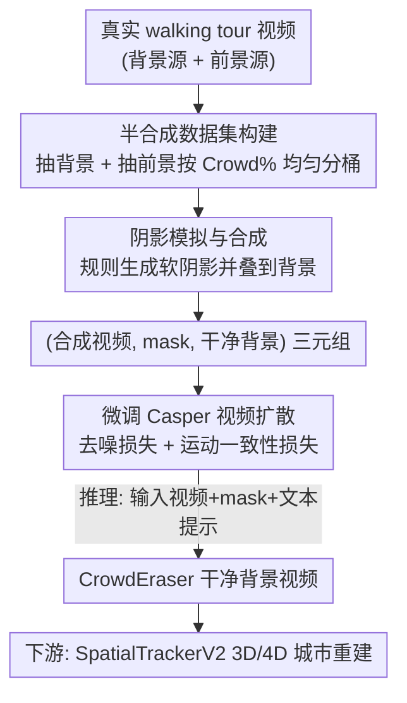

# Generating Humanless Environment Walkthroughs from Egocentric Walking Tour Videos

**会议**: CVPR 2026  
**论文**: [CVF Open Access](https://openaccess.thecvf.com/content/CVPR2026/html/Ham_Generating_Humanless_Environment_Walkthroughs_from_Egocentric_Walking_Tour_Videos_CVPR_2026_paper.html)  
**代码**: https://crowd-eraser.github.io/  
**领域**: 视频生成 / 视频修复  
**关键词**: 视频去人、视频扩散修复、半合成数据集、阴影模拟、第一视角行走视频

## 一句话总结
作者把网上海量的第一视角"city walking tour"视频当成城市环境建模的素材源，但画面里挤满了行人和他们的阴影；他们构建了一个由真实素材拼接而成的半合成数据集 EgoCrowds（1000 对"有人/无人"视频片段），在此之上微调 Casper 视频扩散模型得到 CrowdEraser，能在人群密集、背景复杂的场景下把人连同阴影一起干净抹除，去人后的视频甚至能直接拿去做 3D/4D 城市重建。

## 研究背景与动机
**领域现状**：高保真的日常城市环境模型（街道、楼宇大堂等）是 3D 神经渲染、机器人、自动驾驶等方向的基础素材。而 YouTube 上数以千计小时的"walking tour"视频——拍摄者以第一视角穿行于全球各地城市——是目前最丰富、最多样、最易获取的城市影像来源之一。

**现有痛点**：这些视频有一个致命缺陷，使它们无法直接用于静态环境提取——画面里到处是行人。城市街景常有大群行人遮挡大量像素（Fig. 1a），而且由于相机处在地面高度的第一视角，哪怕只有一个人贴近拍摄者走过，也能占据画面相当大的面积（Fig. 1b），把场景结构挡得严严实实。

**核心矛盾**：作者实验发现，专为物体-效果移除设计的强力扩散模型 Casper（来自 GenOmnimatte）在"人少、离相机够远"时表现尚可，但一旦遇到大量人群 + 复杂室外背景就会产生不合理的伪影。关键判断是：这个性能落差**主要源自 Casper 训练数据与 walking tour 数据之间的域偏移（domain shift），而不是扩散模型设计本身的缺陷**。

**本文目标**：因此问题就转化为——如何为"行走视频中的人物（及其阴影）修复"任务，构造一份足够丰富、带有监督信号的训练数据集。难点在于：真实世界里根本不可能在完全相同的光照和相机运动下，把同一个场景拍成"有人"和"无人"两个版本。

**切入角度**：借鉴光流估计、图像分割等任务用"半合成数据集"成功训练的经验，作者设计了一条半合成视频生成流水线：从真实行走视频中分别抽取"空场景背景"和"行人前景"，再把行人（外加规则模拟出的阴影）合成到背景上，从而天然得到"合成有人视频 ↔ 干净背景视频"的成对监督。

**核心 idea**：用半合成数据弥补域偏移——构造 EgoCrowds 数据集并以此微调 Casper，把一个通用物体移除模型专门化成擅长抹除人群与阴影的 CrowdEraser。

## 方法详解

### 整体框架
整篇工作的"重头戏"不在模型结构，而在**数据**。整体可以拆成两块：**(1) EgoCrowds 半合成数据集构建**——从真实 walking tour 视频里分别抽背景片段和前景行人片段，给行人配上规则模拟的阴影，再合成出 (合成视频, 人物 mask, 干净背景) 三元组；**(2) CrowdEraser 模型微调**——拿这些三元组去微调 Casper 视频扩散模型，让它学会"看到被 mask 的人 → 生成干净背景"。输入是一段第一视角视频片段 + 对应的逐帧人物 mask，输出是一段把人和阴影都抹除、时空一致的干净背景视频。

每个视频片段统一为 7 秒（197 帧 @ 16 fps）。数据构建链路自上而下是：真实背景视频 →（按"人少"标准）抽空场景背景片段；真实前景视频 →（按 Crowd% 均匀分桶）抽行人前景片段及其 mask；再做阴影模拟 + 合成 + 质量过滤，得到训练三元组；最后送进 Casper 用复合损失微调。

### 关键设计

**1. EgoCrowds 半合成数据集：用真实素材拼出"有人/无人"成对监督**

这一步直接针对核心痛点——现实中拿不到"同场景有人/无人"的真实配对。作者不去硬拍，而是把真实视频拆成可重组的零件。**背景片段**来自 YouTube 上用"early morning""deserted downtown""lockdown street""empty street"等关键词搜到的空旷视频，统一到 720×1280、≤30 fps，覆盖全球 50 个城市的 64 个视频（57 训练 / 7 测试）。判定"空场景"时用 Grounded-SAM-2 以"person"为文本提示数人头，设阈值 $P=5$（单帧最多 5 人）、容忍度 $\tau=10\%$（超阈帧占比 <10% 才保留），软容忍是为了抵消检测器噪声、并允许远处的小人。**前景片段**来自 10 个城市的 10 个视频，用"person, bag, backpack"提示抽出至少 70% 帧（$M=138$ 帧）有人的片段，再按每帧 mask 平均面积（即 Crowd%）分到 0–10%、10–20%、20–30%、30–40%、40–50% 五个桶，每桶随机采 200 段，凑成 **1000 段在人群密度上均匀分布**的前景。这种"前景均匀覆盖各 Crowd%"的设计后面被消融证明很关键。

**2. 基于规则的软阴影模拟：让"去人"连带"去影"**

直接把抠出的人物 mask 贴到背景上会缺少阴影这类伴随效果，导致模型学不会"人和影是一体的"。作者对每个人物用一套规则生成阴影几何：先估计人物与地面接触的**枢轴点（pivot）**，再对 mask 做水平翻转（角度 <90° 不翻、≥90° 左右翻）+ 绕枢轴旋转，叠加随机水平剪切 $s_x\sim U(0.15,0.35)$ 和垂直缩放 $s_y\sim U(0.8,0.95)$ 来模拟光照方向变化；每个片段只采样**一个**统一的阴影方向以保证全片光照一致；最后用高斯核卷积得到现实中常见的软阴影。合成时先用阴影图按随机强度 $\alpha\in[0.2,0.8]$ 把背景压暗，再以全不透明（$\alpha=1$）叠上人物前景。关键细节：配对得到的三元组 (input, mask, ground truth) 里，**mask 只框人、不框阴影**——这样模型在训练中被迫去"隐式学习人与其投影阴影之间的关联"，推理时才能把没被 mask 的阴影也一并抹掉。

**3. CrowdEraser：在 Casper 上叠加运动一致性损失的针对性微调**

模型侧不重新设计架构，而是微调 Casper（基于 CogVideoX 扩散骨干）：冻结其 VAE 和文本编码器，只微调 3D Transformer 层。Casper 本身经过大规模预训练，已具备捕捉物体-效果关联的能力，给定视频和逐实例 mask 能生成干净背景及分层单物体视频——本任务只取它输出的背景。损失上，除标准去噪损失 $L_{base}=\lVert\hat{\epsilon}_t-\epsilon_t\rVert_2^2$ 外，作者加了一项**运动子损失**约束相邻帧噪声残差的时间差分：

$$L_{sub}=\lVert(\hat{\epsilon}_{t+1}-\hat{\epsilon}_t)-(\epsilon_{t+1}-\epsilon_t)\rVert_2^2$$

它惩罚预测噪声沿帧轴的时间导数偏差，以鼓励时间上更平滑的动态。总损失为 $L=(1-\alpha)L_{base}+\alpha L_{sub}$，运动子损失比例 $\alpha=0.25$（⚠️ 此处 $\alpha$ 与阴影强度的 $\alpha$ 同名但含义不同，以原文为准）。推理时输入为：原视频片段 + 人物被 mask 的视频 + 文本提示"A video of a beautiful empty, human-free scene."。

### 损失函数 / 训练策略
基于 Casper（CogVideoX 骨干）公开实现，冻结 VAE 与文本编码器，仅微调其 3D Transformer，在 EgoCrowds 上训练 100 个 epoch；用 4 张 H200 GPU 约 15 小时完成。损失为去噪损失 + 运动一致性损失的加权组合（权重 $\alpha=0.25$）。

## 实验关键数据

### 主实验
测试集为 EgoCrowds 测试集（7 城市 × 5 个 Crowd% 区间 = 35 段视频），推理分辨率 720×1080，与 ProPainter、DiffuEraser、Casper 三个基线比较。指标 PSNR 越高越好，LPIPS、DreamSim 越低越好。下表为各方法在不同 Crowd% 下及平均（Average）的表现：

| 方法 | PSNR↑ (avg) | LPIPS↓ (avg) | DreamSim↓ (avg) |
|------|------|------|------|
| ProPainter | 25.82 | 0.141 | 0.067 |
| DiffuEraser | 25.95 | 0.120 | 0.037 |
| Casper | 24.64 | 0.130 | 0.029 |
| **Ours (CrowdEraser)** | **26.74** | **0.118** | **0.022** |

分桶看趋势更明显（PSNR）：在高遮挡的 30–40% 区间，Casper 仅 19.88、ProPainter 21.98、DiffuEraser 22.18，而本文 22.34；40–50% 区间本文 23.31，明显高于 Casper 的 19.24。即 **Crowd% 越高、人群越密，CrowdEraser 相对基线的优势越大**；基线方法只有在低 Crowd% 时才勉强可比。定性上（Fig. 5）：ProPainter/DiffuEraser 在阴影锐利时容易把背景抹糊或丢细节；Casper 善于关联效果但 mask 一大就会在 mask 区域里"幻觉"出物体或人；本文在大 mask 下更稳，能保住背景结构、伪影更少。

### 消融实验
消融研究两项数据构建决策的贡献（Table 2，第一行为未微调的原始 Casper）：

| Shadow | Full Crowd% | PSNR↑ | SSIM↑ | LPIPS↓ | DreamSim↓ | 说明 |
|--------|-------------|-------|-------|--------|-----------|------|
| ✗ | ✗ | 24.64 | 0.868 | 0.130 | 0.029 | 原始 Casper，未微调 |
| ✗ | ✓ | 25.09 | 0.870 | 0.128 | 0.028 | 去掉阴影注入 |
| ✓ | ✗ | 26.60 | 0.882 | 0.120 | 0.024 | 仅用低遮挡 mask (Crowd% 0–10) |
| ✓ | ✓ | **26.74** | 0.881 | **0.118** | **0.022** | 完整模型 |

### 关键发现
- **阴影注入是阴影关联能力的来源**：去掉阴影注入（Shadow=✗）后，模型虽能填补大 mask，但失去了正确关联并抹除阴影的能力，PSNR 从 26.74 跌到 25.09。
- **Crowd% 均匀覆盖支撑高遮挡修复**：只用低遮挡 mask（Full Crowd%=✗）训练时，遇到"人群始终走在拍摄者前方、长时间遮挡画面中心"的片段就失败（Fig. 6 中黄衣人造成颜色渗染）；均匀分布的前景数据增强了模型对结构性物体的修复，避免高 Crowd% 下常见的模糊/变暗。
- **去人是 3D 重建的前置关键**：用 SpatialTrackerV2 做 4D 重建，原始（含人）视频因长时间遮挡导致重建稀疏、点轨迹漂移大；用 CrowdEraser 清理后的视频重建更连贯、时间一致性更好、背景细节更丰富（如墙面纹理、更密的点云）。

## 亮点与洞察
- **把"模型不行"重新诊断为"数据不行"**：作者没有去改 Casper 的结构，而是判断性能差距来自域偏移，转而精心构造领域内监督数据——一个干净利落、可复用的研究思路：当强模型在你的场景翻车时，先排查是不是数据分布问题。
- **mask 只框人不框影**这个细节很妙：让模型在没有显式阴影标注的情况下，被迫学到人-影关联，推理时自动连阴影一起抹除，把"昂贵的阴影标注"问题绕开了。
- **半合成配对**用真实素材拼接，既保留了真实的外观/遮挡/相机运动真实感，又拿到了合成才有的精确 ground-truth 监督，兼顾了真实性和可监督性。
- **按 Crowd% 均匀分桶**采样前景，是一个能直接迁移到其他"难度不均衡"修复/移除任务的数据平衡技巧——保证模型见过足够多的高难度样本。

## 局限与展望
- **数据仍是半合成**：前景人物是"贴"上去的，虽然来自真实视频，但人与背景之间的真实物理交互（接触阴影的精确几何、反射、地面材质响应）靠规则近似，可能与真实拍摄存在差距。
- **阴影靠规则模拟**：枢轴点估计、仿射变换 + 高斯软化是简化模型，对复杂多光源、强方向光或人物自遮挡阴影的拟真度有限（⚠️ 论文未量化阴影真实度，以原文为准）。
- **只处理"人"这一类前景**：方法围绕行人及其附属物（包、阴影）设计，对车辆、动物、骑行者等其他动态遮挡物的泛化未做评估。
- **下游 3D 验证偏定性**：3D/4D 重建部分主要给定性可视化（点轨迹漂移、点云密度），缺少定量的重建质量指标，"去人有助于建模"的结论说服力可再加强。
- **改进方向**：引入更物理化的阴影/光照渲染、把前景扩展到多类动态物体、补上 3D 重建的定量评测。

## 相关工作与启发
- **vs Generative Omnimatte / Casper [17]**：Casper 是本文的微调起点，强在物体-效果关联，但在大量人物遮挡区域恢复干净背景时会幻觉。本文不改模型、改数据，用领域内成对数据把它"专科化"，在高 Crowd% 下显著超过原始 Casper。
- **vs ProPainter [48]**：纯为视频修复优化的 Transformer（流传播 + 时空 Transformer），在锐利阴影和大 mask 时容易抹糊背景；本文借助生成先验与阴影监督表现更稳。
- **vs DiffuEraser [18]**：基于 Stable Diffusion 并以 ProPainter 为先验的视频修复方法，在低遮挡时与本文相当，但 Crowd% 升高后差距拉开。
- **vs Omnimatte 系列（Omnimatte3D / OmnimatteRF）[22, 25, 37]**：这些方法用光流优化 / 多视图一致性 / 辐射场建静态背景做视频分层；本文聚焦于生成式修复而非分层，且专攻第一视角行走视频这一未被充分开发的数据源。

## 评分
- 新颖性: ⭐⭐⭐⭐ 模型沿用 Casper，但"诊断为域偏移 + 半合成成对数据集"的问题设定与解法组合新颖且实用。
- 实验充分度: ⭐⭐⭐⭐ 主实验按 Crowd% 细分、消融清晰证明两项数据决策的作用；3D 重建部分偏定性。
- 写作质量: ⭐⭐⭐⭐ 动机推导清楚，数据流水线讲得细致，图表对应明确。
- 价值: ⭐⭐⭐⭐ 把海量 walking tour 视频转化为可用的城市建模素材，下游 3D/机器人/自动驾驶都受益，数据集与代码均开放。

<!-- RELATED:START -->

## 相关论文

- [\[CVPR 2026\] Ego-InBetween: Generating Object State Transitions in Ego-Centric Videos](ego-inbetween_generating_object_state_transitions_in_ego-centric_videos.md)
- [\[CVPR 2026\] OmniLottie: Generating Vector Animations via Parameterized Lottie Tokens](omnilottie_generating_vector_animations_via_parameterized_lottie_tokens.md)
- [\[CVPR 2026\] VSRELL: A Simple Baseline for Video Super-Resolution and Enhancement in Low-Light Environment](vsrell_a_simple_baseline_for_video_super-resolution_and_enhancement_in_low-light.md)
- [\[CVPR 2026\] EgoX: Egocentric Video Generation from a Single Exocentric Video](egox_egocentric_video_generation_from_a_single_exocentric_video.md)
- [\[CVPR 2026\] EgoControl: Controllable Egocentric Video Generation via 3D Full-Body Poses](egocontrol_controllable_egocentric_video_generation_via_3d_full-body_poses.md)

<!-- RELATED:END -->
