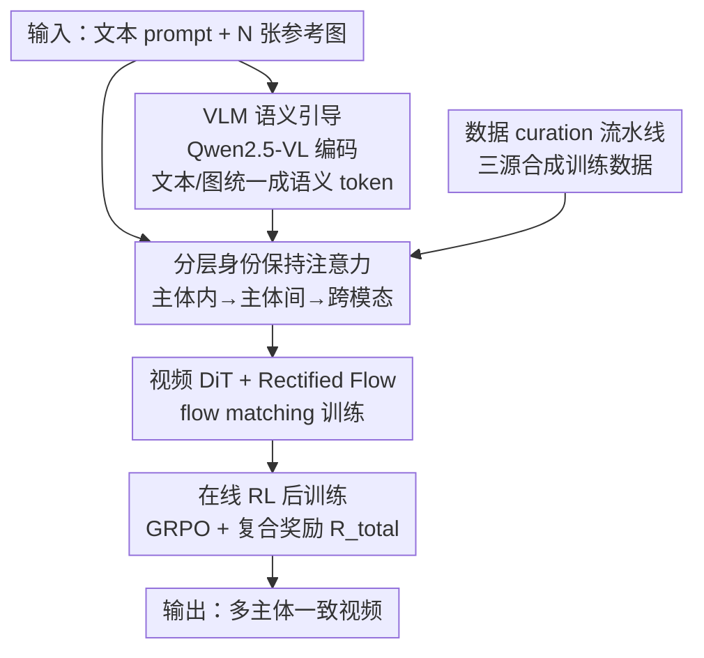

# ID-Crafter: VLM-Grounded Online RL for Compositional Multi-Subject Video Generation

**会议**: CVPR 2026  
**论文**: [CVF Open Access](https://openaccess.thecvf.com/content/CVPR2026/html/Pan_ID-Crafter_VLM-Grounded_Online_RL_for_Compositional_Multi-Subject_Video_Generation_CVPR_2026_paper.html)  
**代码**: [项目页](https://angericky.github.io/ID-Crafter)  
**领域**: 视频生成 / 多主体定制 / 在线强化学习  
**关键词**: 多主体视频生成、身份保持、VLM 语义引导、Flow-GRPO、奖励设计

## 一句话总结
ID-Crafter 把"分层身份保持注意力 + VLM 语义引导 + 在线 RL 后训练"拼成一个统一框架，专门解决多主体视频生成里"既要每个主体不串脸、又要画面动起来还自然"这对天生矛盾，在开源多主体 S2V benchmark 上把 FaceSim 等指标刷到新 SOTA。

## 研究背景与动机

**领域现状**：视频生成模型（Wan-Video、Kling 这类）已经能生成高保真视频，但绝大多数只吃一个文本 prompt 或首帧这种稀疏输入，对复杂场景几乎没有可控性。图像领域已经玩得很溜的"多主体组合生成"（给若干张参考图，让指定的人/物同时出现在画面里），到了视频域还是个硬骨头。

**现有痛点**：把单主体视频生成方法直接扩到多主体，最大的问题是"身份串味"——Phantom、ConcatID、SkyReels-A2、CINEMA 这类做法把多主体特征注入预训练扩散模型后，主体之间会出现语义冲突，A 的脸特征泄漏到 B 身上（identity leakage），导致每个主体的身份都被稀释。论文 Fig.1 里 Phantom 的 Face Score 只有 0.32，而 ID-Crafter 是 0.84，直观体现了这个差距。

**核心矛盾**：问题根子在于一对内在张力——**保持每个主体独立身份** vs **生成连贯、有动态的整体场景**。把多个主体特征简单拼接喂进注意力，模型分不清"哪个特征属于哪个主体""主体之间该怎么交互"，于是要么主体糊在一起，要么为了保身份把画面冻住不敢动。现有方法在这对张力上没找到好的平衡点。

**本文目标**：在一个统一框架里同时把三件事做好——(1) 把多主体特征解耦、防止身份泄漏；(2) 让模型真正"读懂"复杂的多主体 prompt（谁在干什么、谁和谁交互）；(3) 直接优化"身份保持—画面质量—运动流畅"这个三方 trade-off。

**切入角度**：作者观察到两个可利用的杠杆。其一，注意力如果按"主体内 → 主体间 → 跨模态"分层级地做，就能先锁住每个主体的细节再处理交互，天然契合身份解耦；其二，VLM（Qwen2.5-VL）相比传统文本编码器（T5/CLIP）对场景组合有更细粒度的理解，能当"语义向导"而不只是静态编码器。再加上扩散模型的奖励本身不可微/credit assignment 困难，正好用在线 RL（无需价值网络的 group 比较）来直接拉齐感知奖励。

**核心 idea**：用"分层注意力锁身份 + VLM 当语义大脑 + 在线 GRPO 后训练调 trade-off"三件套，把多主体视频生成里的身份-动态矛盾系统性地拆解掉。

## 方法详解

### 整体框架

ID-Crafter 建立在基于 DiT 的隐空间视频扩散模型 Wan-Video 之上，用标准 Rectified Flow（RF）做基础训练。给定文本 prompt $C_{txt}$ 和 $N$ 张参考图 $I=\{I_k\}_{k=1}^N$（每张对应一个主体），目标是生成既符合 prompt、又能高保真保留全部 $N$ 个主体身份且时序连贯的视频 $V$。

整条 pipeline 分三步走：**先**用 VLM（Qwen2.5-VL）把文本和参考图一起编码成语义增强 token，同时用图像编码器把每个主体抽成 token；**再**把这些条件 token 送进一个分层身份保持注意力机制（主体内 → 主体间 → 跨模态三级），融进视频 DiT 完成 flow matching 训练；**最后**在 flow matching 收敛的模型上接一个在线 RL（GRPO）阶段，用一套兼顾身份保真与画面质量的复合奖励把模型往"既像又自然"的方向再拧一拧。训练数据则由一条专门设计的三源 curation pipeline 合成，专治多主体场景里的"copy-paste"贴图感。

RF 的训练目标是回归速度场：在 $z_t=(1-t)z_0+t\epsilon$ 的直线轨迹上预测常速度 $v=\epsilon-z_0$，损失为 $L_{RF}=\mathbb{E}_{t,z_0,\epsilon}[w(t)\|v_\theta(z_t,t,C_{ctx})-(\epsilon-z_0)\|_2^2]$。

### 关键设计

**1. 分层身份保持注意力：按"主体内→主体间→跨模态"三级解耦，防止身份泄漏**

简单地把所有主体 token 和文本 token 拼在一起做 cross-attention，模型分不清特征归属，A 的脸会泄漏到 B（identity leakage），这是身份串味的直接来源。ID-Crafter 不这么干，而是把注意力拆成级联的三个阶段：先用**主体内注意力（intra-subject）**在每个主体内部聚合细粒度特征，把这个主体"是谁"先锁死；再用**主体间注意力（inter-subject）**显式建模不同主体之间的交互，正是这一步抑制了 identity leakage；最后用**跨模态/多模态注意力（multi-modal）**把主体特征和文本、视频 token 融合，保证和 prompt 语义对齐。具体地，参考图先经图像编码器得到特征图 $\{F_k\}_{k=1}^N$（$F_k\in\mathbb{R}^{c\times h\times w}$），展平成 token 序列 $\{f_k\}_{k=1}^N$（$f_k\in\mathbb{R}^{hw\times c}$）。这种"先各管各、再谈交互、最后对齐文本"的层级顺序，比一锅烩的拼接更能在保住个体身份的同时刻画主体间动态——消融里去掉它 FaceSim 直接掉 11.7%，是掉点最狠的一项。

**2. VLM 语义引导：把 Qwen2.5-VL 从静态编码器升级成动态语义向导**

传统文本编码器（如 T5）对"两个人加一个手机加一台笔记本，谁在用谁"这种复杂多主体描述解析能力有限，模型读不懂场景组合就容易生成错乱。ID-Crafter 用预训练的 Qwen2.5-VL 同时处理文本 prompt 和参考图，产出语义增强 token $f_{txt}=\text{VLM}_{enc}(C_{txt},I)\in\mathbb{R}^{l'\times c}$，再把它和各主体 token 拼成完整条件 $C_{ctx}=[f_{txt};f_1;\dots;f_N]\in\mathbb{R}^{(l'+N\cdot hw)\times c}$。关键在于作者主张这不是把 VLM 当一个更强的静态 encoder 用，而是让 VLM 的细粒度跨模态推理去**主动引导**上面那套分层注意力，相当于给生成过程接了个"懂场景结构"的大脑——这是论文声称的首个把 VLM 作为核心推理引擎接进开源 Wan-Video 架构的工作。实际部署用的是 T5 + Qwen2.5-VL-7B-Instruct 的双编码器。消融里换回纯 T5（"w/o VLM Encoder"），衡量感知质量的 Q-Align 暴跌 18.2%，说明 VLM 对复杂 prompt 的语义把控确实是画面质量的关键。

**3. 在线 RL 后训练：用无价值网络的 GRPO + 复合奖励直接调三方 trade-off**

身份保持这种感知奖励是视频级、整体性的，要回传去调分层 ID 注意力层里那些精细计算，存在严重的 credit assignment 问题；DPO 这类离线方法又因为吃静态数据集、无法在线更新而受限；标准 policy-gradient 则要额外训一个价值网络，不稳又对超参敏感。ID-Crafter 借鉴 Flow-GRPO，对每个条件 $q$ 从旧策略采一组输出 $\{o_1,\dots,o_G\}$，用 **groupwise 比较**估计优势 $\hat{A}_{i,t}=\frac{r_i-\text{Mean}(\{r\})}{\text{Std}(\{r\})}$，省掉脆弱的价值网络；同时把 RF 的确定性生成改成随机过程（每步注噪，$\sigma_t=a\sqrt{t/(1-t)}$）以便采样探索。奖励是一套精心设计的复合奖励 $R_{total}(V)=w_{fid}R_{fid}(V,I)+w_{qual}R_{qual}(V)$，权重 $w_{fid}=0.6,\,w_{qual}=0.4$。其中保真项 $R_{fid}=(1-\alpha)R_{face}+\alpha R_{subject}$（$\alpha=0.5$），人脸项

$$R_{face}=(1-\gamma)\Big(\tfrac{1}{N}\sum_{k=1}^N R^k_{id}\Big)+\gamma\min_{k}R^k_{id},\quad \gamma=0.5$$

用 ArcFace 分数的"均值 + 最差主体"组合，专门防止某个主体被牺牲；质量项 $R_{qual}=(1-\beta)R_{aes}+\beta R_{nat}$（$\beta=0.4$），$R_{aes}$ 是标准美学分，$R_{nat}$ 是 VLM 打的 NaturalScore，用来惩罚"好看但违反物理常识"的 reward hacking。论文还提到一个对比学习机制为分层注意力提供稳定训练信号、直接最大化身份保真同时抑制 reward hacking（⚠️ 细节未充分展开，以原文为准）。

**4. 三源数据 curation 流水线：合成跨主体组合，治"copy-paste"贴图感**

多主体 S2V 受限于配对训练数据稀缺、难覆盖真实世界里主体运动/视角/布局的复杂变化，模型容易学成把参考图原样贴进画面的"copy-plate"伪影。ID-Crafter 用一条由现代 VLM（QwenVL-72B）和强力图像编辑模型（Nano Banana）驱动的流水线，把数据拆成三类异构来源：其一是从 OpenS2V-Nexus 抽取的真实主体-视频配对，提供多样的真实场景与动作；其二是合成数据——用图像编辑模型把主体放进全新语境，**显式设计跨主体组合与融合样例**，正是这部分在补"主体间交互"的训练信号、压制 copy-paste 伪影；其三是带精细标注的专业拍摄视频，保高保真。消融里"w/o Curated Data"在 Video Quality 上掉 7.7%、copy-plate 伪影更严重，验证了合成跨主体样例对多实体交互连贯性的价值。

### 损失函数 / 训练策略

两段式训练：先以 $L_{RF}$ 做 flow matching 基础训练，从 Wan-Video-1.3B 权重初始化，在自建数据集上 480p 分辨率训 30,000 步，用 16 张 H20 GPU；再接在线 GRPO 后训练，目标为带 clip 与 KL 正则的 $J_{GRPO}(\theta)$（$-\beta D_{KL}(\pi_\theta\|\pi_{ref})$）。推理用 Euler 采样 50 步、CFG scale 2.5，1.3B 模型生成一段 480p 视频约 1 分钟。

## 实验关键数据

### 主实验

评测基于 OpenS2V-Nexus 协议，在 180 对 held-out 的 subject-text 配对上做开放域 S2V 测试，Total Score 是其余分项的归一化加权和（越高越好）。

| 方法 | Total↑ | Aesthetics↑ | Motion↑ | FaceSim↑ | NexusScore↑ |
|------|--------|-------------|---------|----------|-------------|
| Kling 1.6（闭源） | 54.46% | 44.60% | 41.60% | 40.10% | 45.92% |
| VACE-14B | 52.87% | 47.21% | 15.02% | 55.09% | 44.20% |
| Phantom-14B | 52.32% | 46.39% | 33.42% | 51.48% | 37.43% |
| SkyReels-A2-P14B | 49.61% | 39.40% | 25.60% | 45.95% | 43.77% |
| Ours-1.3B（Base） | 54.33% | 42.50% | 38.00% | 58.12% | 43.22% |
| Ours-1.3B（Base+online RL） | 55.16% | 48.85% | 36.50% | **66.10%** | 43.45% |
| Ours-14B | **57.05%** | 45.28% | 40.34% | 60.71% | 45.11% |

最抢眼的是 FaceSim：1.3B 模型加在线 RL 后冲到 66.10%，比 14B 的 VACE（55.09%）、Phantom（51.48%）高出一大截，且 1.3B 的 Total Score（55.16%）就已超过所有开源 14B 基线乃至闭源 Kling 1.6。

### 消融实验

去掉三个核心组件，FaceSim / Q-Align / Video Quality / Total 全线下滑（百分比为相对下降）：

| 配置 | FaceSim↑ | Q-Align↑ | Video Quality↑ | Total↑ |
|------|----------|----------|----------------|--------|
| Ours-1.3B（Base，完整） | 58.12% | 0.351 | 48.91% | 54.33% |
| w/o 分层注意力 | 51.34%（↓11.7%） | 0.348（↓0.9%） | 47.52%（↓2.8%） | 50.11%（↓7.8%） |
| w/o VLM 编码器 | 56.98%（↓2.0%） | 0.287（↓18.2%） | 46.88%（↓4.2%） | 49.89%（↓8.2%） |
| w/o Curated 数据 | 54.55%（↓6.1%） | 0.321（↓8.5%） | 45.13%（↓7.7%） | 48.78%（↓10.2%） |

分工很清晰：分层注意力主管 **FaceSim**（去掉掉 11.7%，最狠），VLM 编码器主管 **感知质量 Q-Align**（去掉掉 18.2%），Curated 数据主管 **Video Quality**（去掉掉 7.7%）。

在线 RL 单独分析（对比 SFT / 离线 DPO，并拆解复合奖励）：

| 方法 | FaceSim↑ | Aesthetics↑ | Q-Align↑ | Total↑ |
|------|----------|-------------|----------|--------|
| SFT Baseline | 58.12% | 42.50% | 0.351 | 54.33% |
| DPO（离线） | 62.35% | 45.15% | 0.382 | 54.80% |
| Ours（在线 GRPO） | 66.10% | 48.85% | **0.410** | **55.16%** |
| Ours w/o Fidelity $R_{fid}$ | 45.32% | 47.10% | 0.391 | 53.50% |
| Ours w/o Quality $R_{qual}$ | 63.50% | 43.81% | 0.379 | 54.82% |
| Ours w/o Natural $R_{nat}$ | 69.30% | 50.83% | 0.361 | 53.01% |

### 关键发现
- **在线 > 离线 > SFT**：相比 SFT，在线 GRPO 在 FaceSim/Aesthetics/Q-Align 上分别相对提升 13.7% / 14.9% / 16.8%；离线 DPO 受静态数据集所限，提升远不如在线主动探索生成空间。
- **去掉 $R_{nat}$ 暴露 reward hacking**：删掉自然度奖励后 FaceSim 反升到 69.30%、Aesthetics 升到 50.83%，但 Q-Align 掉到 0.361、Total 跌到 53.01%——典型的"为刷分牺牲真实感"，说明 NaturalScore 是平衡复合奖励、防止 reward hacking 的关键阀门。
- **人类偏好印证自动指标**：30 名参与者、200 份问卷的偏好研究里，本方法在身份一致性（60%）、运动自然度（65%）、美学（54%）、画面质量（43%）四项上均明显领先四个主流竞品。

## 亮点与洞察
- **把"分层"用在身份解耦上很对症**：intra→inter→cross-modal 的级联顺序不是随便排的——先锁个体、再谈交互、最后对齐文本，恰好对应"防泄漏"的因果链，消融里它是掉 FaceSim 最多的组件，证明这个层级假设站得住。
- **VLM 当"动态语义向导"而非"更强 encoder"**：作者刻意区分这两种用法，让 VLM 主动引导注意力而不只是产 token，Q-Align 对 VLM 的敏感（去掉掉 18.2%）说明语义理解直接决定感知质量，这个视角可迁移到任何需要细粒度 prompt 解析的可控生成任务。
- **$R_{face}$ 的"均值+最差主体"组合是防偏科的小巧设计**：$\gamma\min_k R^k_{id}$ 这一项强制模型不能为了整体均值牺牲某个倒霉主体，对多主体场景特别实用，可直接借用到任意"多目标都要保住"的奖励设计里。
- **用 $R_{nat}$ 显式对抗 reward hacking**：消融把 reward hacking 现象量化展示（FaceSim/Aesthetics 升但 Q-Align/Total 降），是很有说服力的"为什么需要这一项"的证据。

## 局限与展望
- **作者承认的局限**：在建模复杂交互和细粒度动态上仍有不足；未来计划引入物理感知先验、缓解预训练组件的偏见、推进属性/动作/交互的细粒度可控生成。
- **自己发现的局限**：对比学习机制在正文只一句带过，缺少公式与消融，难判断它独立贡献多少（⚠️ 细节以原文为准）；横向比较里本方法主打 1.3B/14B，与闭源 Kling/Pika/VIDU 只在部分指标可比，且闭源模型规模/数据未知，"超过闭源"需带 caveat 看待。
- **改进思路**：复合奖励的多个权重（$w_{fid},w_{qual},\alpha,\beta,\gamma$）都是经验设的，可探索自适应或按 prompt 难度调权；评测仅 180 对、480p，主体数 $N$ 增大时的可扩展性与失败模式值得补充分析。

## 相关工作与启发
- **vs Phantom / ConcatID / SkyReels-A2 / CINEMA**：它们都靠"基于注意力的特征注入"把多主体信息塞进预训练扩散模型，但难解决主体-prompt 语义冲突、易掉身份；ID-Crafter 用分层注意力强制多级一致性 + VLM 语义引导 + RL 后训练，从结构和优化两头同时压这对矛盾，FaceSim 优势明显。
- **vs DPO / DenseDPO（离线 RL）**：离线偏好优化吃静态配对数据、无法在线更新参数；本文走在线 GRPO 主动探索生成空间，实验里在线全面优于离线 DPO。
- **vs Flow-GRPO / DanceGRPO / Identity-GRPO**：本文承接 Flow-GRPO 的 groupwise 优势估计思路，但首次把在线 RL 用到**多主体视频**生成，并设计了针对身份一致性的任务专属复合奖励（含防 reward hacking 的 NaturalScore），把"无价值网络的 group RL"从图像/单目标场景推到了多主体视频这个更难的设定。

## 评分
- 新颖性: ⭐⭐⭐⭐ 首次把在线 RL（GRPO）+ VLM 语义引导 + 分层身份注意力组合用于多主体视频生成，组件虽多为已有思路的迁移，但拼装方式和任务专属奖励设计有新意。
- 实验充分度: ⭐⭐⭐⭐ 主实验 + 三组消融 + 在线 RL 拆解 + 人类偏好研究覆盖较全，但评测集偏小（180 对）、对比学习机制缺独立验证。
- 写作质量: ⭐⭐⭐⭐ 结构清晰、动机层层递进、公式完整；个别处（contrastive learning）展开不足。
- 价值: ⭐⭐⭐⭐ 多主体可控视频生成是高需求方向，1.3B 模型即超 14B 基线，工程与应用价值（主体替换、背景编辑）实在。

<!-- RELATED:START -->

## 相关论文

- [\[CVPR 2026\] StoryTailor: A Zero-Shot Pipeline for Action-Rich Multi-Subject Visual Narratives](storytailora_zero-shot_pipeline_for_action-rich_multi-subject_visual_narratives.md)
- [\[AAAI 2026\] MoFu: Scale-Aware Modulation and Fourier Fusion for Multi-Subject Video Generation](../../AAAI2026/video_generation/mofu_scale-aware_modulation_and_fourier_fusion_for_multi-subject_video_generatio.md)
- [\[CVPR 2026\] TGT: Text-Grounded Trajectories for Locally Controlled Video Generation](tgt_text-grounded_trajectories_for_locally_controlled_video_generation.md)
- [\[CVPR 2026\] VIVA: VLM-Guided Instruction-Based Video Editing with Reward Optimization](viva_vlm-guided_instruction-based_video_editing_with_reward_optimization.md)
- [\[CVPR 2026\] Compressed-Domain-Aware Online Video Super-Resolution](compressed-domain-aware_online_video_super-resolution.md)

<!-- RELATED:END -->
