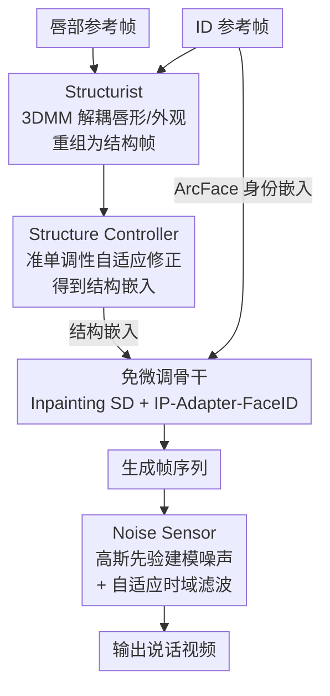

# IP-Adapter Is All You Need: Towards Fine-Tuning-Free Diffusion-Based Talking Face Generation

**会议**: CVPR 2026  
**论文**: [CVF Open Access](https://openaccess.thecvf.com/content/CVPR2026/html/Wu_IP-Adapter_Is_All_You_Need_Towards_Fine-Tuning-Free_Diffusion-Based_Talking_Face_CVPR_2026_paper.html)  
**代码**: https://github.com/tlemangen/FreeTalkDiff  
**领域**: 视频生成 / 扩散模型 / 说话人脸  
**关键词**: 说话人脸生成, 免微调, IP-Adapter, 3DMM, 时序一致性

## 一句话总结
本文提出 FreeTalkDiff——一个**完全免微调、零可训练参数**的说话人脸生成框架：直接拿预训练的 Stable Diffusion + IP-Adapter 当骨干挖掘唇部语义，再外挂 Structurist（3DMM 解耦唇形与外观）、Structure Controller（按准单调性自适应修正嵌入）、Noise Sensor（高斯先验建模并滤除抖动闪烁）三个无参模块，在 CREMA / HDTF 上以 0 训练步数超过需要数万步微调的 SOTA（PCLD 至少 +0.16、FID 至少 +0.7）。

## 研究背景与动机

**领域现状**：扩散模型已成为说话人脸生成的主流，画质和多模态可控性都明显超过早期的 GAN 与自回归方法。但当前所有基于扩散的方案（AniPortrait、Loopy、MuseTalk、LatentSync、EchoMimic、Hallo2、Sonic 等）都遵循同一套路——在大规模视听数据集上对数十亿参数的扩散模型做**任务专属微调**。

**现有痛点**：这种微调代价极高。论文 Tab.1 给出对比：EchoMimic / Hallo2 在 8 张 A100 上分别训练 60k / 113k 步，Loopy 更是动用了 24 张 A100。可训练参数普遍在 0.85B~2.59B。这种对算力和训练时长的重度依赖，严重限制了扩散方法在研究社区中的可扩展性与可及性。

**核心矛盾**：扩散模型的庞大参数量与复杂优化，和"想低成本用上它做说话人脸"之间存在根本冲突。问题不在于扩散模型不够强，而在于**人们默认必须微调才能把唇同步能力对齐进去**。

**本文目标**：能不能完全不微调，直接用预训练扩散模型做可控、高同步、高保真的说话人脸生成？这又引出三个必须自己解决的子问题——如何从预训练模型中"挖出"唇相关知识？如何在不训练的前提下抑制身份漂移、同步误差、时序抖动？

**切入角度**：作者对预训练模型行为做了细致观察，发现一个关键现象——**IP-Adapter 搭配 SD 时，其 CLIP Image Encoder 提取的结构嵌入天然对嘴部区域有强注意力**（因为人脸语境下嘴部往往承载主要语义线索）。这意味着唇控能力其实已经"潜伏"在预训练权重里，不需要重新学。

**核心 idea**：用"SD + IP-Adapter"这套免微调组合做骨干，把唇部参考的语义注入进去；再用三个**无可训练参数**的后处理/调控模块，分别修补身份漂移、同步精度、时序抖动这三类副作用，从而把"零训练"做成可用的完整方案。

## 方法详解

### 整体框架
FreeTalkDiff 走的是 few-shot（多帧 ID 参考）路线，骨干是"图像 inpainting 版 SD 1.5 + IP-Adapter-FaceID"。生成时，把编码后的遮挡帧、随机噪声潜变量、缩放后的 mask 三者拼接送入去噪 U-Net；每一层 IP-Adapter 接收上一层潜变量、空文本 prompt，以及两路图像 prompt——身份与唇部。唇部参考先经 **Structurist** 转成"结构帧"，再由 CLIP Image Encoder 编码、并被 **Structure Controller** 自适应修正，得到携带唇形线索的结构嵌入；身份参考经 ArcFace 提取身份嵌入。两路嵌入融合驱动 SD 生成，最后由 **Noise Sensor** 把帧序列滤成连续稳定的说话视频。整条链路里 SD 与 IP-Adapter 都是冻结的预训练大模型，三个新模块也都不含任何可训练参数。

### 关键设计

**1. SD + IP-Adapter 免微调骨干：把潜伏在预训练权重里的唇控能力直接拿来用**

这是全文的根基，针对的就是"必须微调才能做说话人脸"这一默认前提。作者观察到 IP-Adapter 的结构嵌入对嘴部区域有天然强注意力（Fig.2a），其 CLIP Image Encoder 倾向于对齐图像区域与文本概念，而人脸语境下嘴部恰是关键语义点。于是直接采用冻结的"image inpainting SD 1.5 + IP-Adapter-FaceID"作骨干：用 inpainting 形式保留 ID 参考的非嘴部区域（few-shot 优势来源），把唇部参考作为图像 prompt 注入嘴部语义，文本 prompt 留空以避免语义干扰。可训练参数为 0、训练步数为 0——这正是它相对 0.85B~2.59B 参数、动辄数万步微调的扩散基线的根本区别：不是训得更好，而是**根本不训**。

**2. 3DMM-based Structurist：在 3D 参数空间里把唇形从外观里"拆出来再装回去"**

直接把唇部参考喂进 IP-Adapter 会连带引入冗余的纹理和颜色，导致身份漂移与外观失真（Fig.2b）。Structurist 的思路是在 3DMM 的形状/纹理参数空间显式解耦：3DMM 把任意人脸的形状 $P\in\mathbb{R}^{3n}$ 与纹理 $Q\in\mathbb{R}^{3n}$ 表示为均值分量与主成分基的线性组合

$$P = \bar{P} + \sum_{i=1}^{M}\alpha_i\sigma_i^{P}v_i^{P}, \quad Q = \bar{Q} + \sum_{i=1}^{M}\beta_i\sigma_i^{Q}v_i^{Q}$$

其中形状系数 $\alpha_i$ 捕捉唇动几何、纹理系数 $\beta_i$ 保留颜色与外观细节。关键一步是**交叉重组**：取目标身份参考的纹理参数 + 唇部参考的形状参数，拼出一个"外观是目标人、唇形是参考唇"的参数表示，再用 renderer 渲染回图像域得到"结构帧"，最后送 CLIP Image Encoder 得到结构嵌入。这样既保住了想要的唇动，又剥掉了无关纹理，从源头缓解身份漂移和外观失真。

**3. 准单调性自适应 Structure Controller：顺着参考唇动趋势在嵌入空间里"补偿"细微唇动**

仅靠骨干，IP-Adapter 抓不住细微唇动（Fig.2c）。作者先分析结构嵌入空间 $E$ 到唇形的映射，发现两条性质：**连续性**（同一身份的嵌入构成稠密平滑簇）和**准单调性**（沿特定方向唇距近似单调变化）。形式化为：对任意 $e_1,e_2\in E$，唇距映射 $f:E\to\mathbb{R}^+$ 在不同插值/外推区间满足分段的单调约束（$\lambda\le0$ 时取下界、$\lambda\in(0,1)$ 时夹在两端之间、$\lambda\ge1$ 时取上界）。利用这一性质，Controller 按参考唇动趋势动态修正嵌入：设 $S_{\text{anchor}}$ 为唇张最小的结构帧、$\gamma(\cdot)$ 为唇距度量，当前帧的调整嵌入为

$$e_{\text{current}} = (1-\lambda)\,\mathrm{CLIP}(S_{\text{anchor}}) + \lambda\,\mathrm{CLIP}(S_{\text{current}}),\quad \lambda = \frac{\gamma(L_{\text{current}})}{\gamma(L_{\text{previous}})}$$

当参考唇在张开（$\gamma(L_{\text{current}})>\gamma(L_{\text{previous}})$，$\lambda>1$）时，按准单调性向"更张开"方向外推、生成更大的唇；闭合时 $\lambda<1$，把嵌入拉回 anchor 生成更小的唇。这等于用嵌入空间的几何性质，把生成唇形沿参考唇动趋势做一次方向校正，补上骨干漏掉的细微动态。

**4. 高斯先验 Noise Sensor：先用统计假设把抖动闪烁"建模"出来，再做空间自适应时域滤波**

生成嘴部常出现闪烁/抖动，破坏时序平滑（Fig.2d）。Noise Sensor 不靠经验调参，而是先建统计模型：**Hypothesis 1** 假设相邻帧像素 $(i,j)$ 的光流向量 $V_{ij}\sim\mathcal{N}(\mu_{ij},\Sigma_{ij})$ 服从二维高斯；用 Shapiro-Wilk 检验验证后，在置信度 0.99 下唇区 92.4%~96.3% 的像素满足高斯分布，证明该先验合理。在此假设下，**Theorem 1** 给出生成视频抖动/闪烁噪声方差的闭式刻画：

$$\sigma_{\hat{\mathbf{R}}_{ij}}^2 = \sigma_{\mathbf{V}_{ij}^{fake}}^2 - \frac{\mathrm{Cov}^2(\mathbf{V}_{ij}^{fake}, \mathbf{V}_{ij}^{real})}{\sigma_{\mathbf{V}_{ij}^{real}}^2} \ge 0$$

据此定义噪声模式 $D_{ij}=\sigma_{\hat{\mathbf{R}}_{ij}}=\sqrt{\sigma_{\hat{R}_{ij,x}}^2+\sigma_{\hat{R}_{ij,y}}^2}$，$D_{ij}$ 越大表示该像素抖动闪烁越强。最后做**空间自适应时域滤波**：把每个像素的 $D_{ij}$ 当作 1D 高斯核的标准差，核为 $G_{ij}(k)=\mathrm{softmax}(-k^2/2D_{ij}^2)$（$k$ 为相对当前帧的时间偏移），从而在噪声更强的区域施加更强平滑，在抑制闪烁的同时尽量保住真实唇动。（⚠️ Theorem 1 的完整证明在补充材料，正文仅给结论，公式以原文为准。）

### 损失函数 / 训练策略
**没有训练损失，也没有训练阶段**——这正是本文的卖点。三个模块均为无可训练参数的解析/统计后处理，骨干 SD 1.5 与 IP-Adapter-FaceID 全程冻结。推理采用 DPM-Solver++ 调度器、20 步采样；Noise Sensor 用核大小为 5 的自适应高斯时域滤波；所有视频统一到 512×512、25 fps、16 kHz。

## 实验关键数据

### 主实验
CREMA / HDTF 两数据集，对比 10 个代表方法（GAN、自回归、扩散）。指标：PD（Procrustes Disparity，对齐 3D 唇标后的几何差异）↓、CSLD（唇距余弦相似度）↑、PCLD（唇距 Pearson 相关）↑、FID↓、LPIPS↓、CPBD（清晰度）↑。

| 数据集 | 方法 | 类型 | PD↓ | CSLD↑ | PCLD↑ | FID↓ | CPBD↑ |
|--------|------|------|------|-------|-------|------|-------|
| CREMA | LatentSync | few-shot 扩散 | 0.01767 | 0.762 | 0.429 | 2.2 | 0.189 |
| CREMA | Sonic(CVPR'25) | one-shot 扩散 | 0.01774 | 0.707 | 0.408 | 32.9 | 0.104 |
| CREMA | **Ours** | few-shot 扩散 | **0.00860** | **0.887** | **0.711** | **1.5** | **0.218** |
| HDTF | LatentSync | few-shot 扩散 | 0.01483 | 0.827 | 0.540 | 1.5 | 0.255 |
| HDTF | Hallo2(ICLR'25) | one-shot 扩散 | 0.01524 | 0.844 | 0.547 | 3.9 | 0.211 |
| HDTF | **Ours** | few-shot 扩散 | **0.01026** | **0.883** | **0.718** | **0.5** | **0.289** |

本文在两数据集上 6 项指标全部最优，且可训练参数为 0.00、训练步数为 0（对比基线动辄 0.85B~2.59B 参数、6 万~11 万步微调）。唇同步提升主要来自 Structure Controller，跨数据集泛化来自骨干的大规模预训练。

### 消融实验
消融以图（Fig.9/11）形式给出关键数值：

| 配置 | 数据集 | 关键指标 | 说明 |
|------|--------|---------|------|
| w/o Structure Controller | CREMA | PD 0.0103 / CSLD 0.858 / PCLD 0.650 | 唇形偏差大 |
| w/ Structure Controller | CREMA | PD 0.0086 / CSLD 0.887 / PCLD 0.711 | 幅度与动态都更对齐 |
| w/o Structure Controller | HDTF | PD 0.0114 / CSLD 0.859 / PCLD 0.686 | 同上 |
| w/ Structure Controller | HDTF | PD 0.0103 / CSLD 0.883 / PCLD 0.718 | 同上 |
| w/o Noise Sensor | CREMA | FVD 349.7 / MNP 0.775 | 时序更抖 |
| w/ Noise Sensor | CREMA | FVD 141.3 / MNP 0.120 | FVD、MNP 大幅下降 |
| w/o Noise Sensor | HDTF | FVD 537.9 / MNP 1.316 | 同上 |
| w/ Noise Sensor | HDTF | FVD 115.3 / MNP 0.118 | 同上 |

其中 MNP（Mean of Noise Pattern）即上文 $D_{ij}$ 在全图的均值，越低表示抖动闪烁越弱。Structurist 与 ArcFace 以可视化消融为主：去掉 Structurist 时结构帧的纹理/颜色会泄漏进输出造成身份漂移；去掉 ArcFace（IP-Adapter 退化为 base 版）嘴部颜色与下颌线和真实身份明显不符。

### 关键发现
- **Noise Sensor 对时序指标贡献最猛**：在 HDTF 上 FVD 从 537.9 降到 115.3、MNP 从 1.316 降到 0.118，证明把抖动闪烁先建成高斯噪声再自适应滤波是有效的。
- **Structure Controller 是唇同步主要功臣**：去掉后 PCLD 在 CREMA 上从 0.711 掉到 0.650，正是它按准单调性补偿了细微唇动。
- **核大小存在清晰 trade-off**：核越大越能压低 MNP（抑制闪烁），但 CPBD 下降（嘴部模糊、拖影），核大小 5 是平滑与清晰度的最佳折中。
- few-shot 因保留非遮挡区域，整体视觉质量普遍高于 one-shot，本文进一步增强了嘴部真实感。

## 亮点与洞察
- **"零训练"不是降级而是重新定位问题**：作者发现唇控能力已潜伏在 IP-Adapter 的注意力里，问题从"怎么训出唇控"变成"怎么把已有能力调出来并修补副作用"，这个视角转换是全文最 aha 的地方。
- **用 3DMM 做解耦-重组而非端到端学习**：纹理来自目标人、形状来自参考唇，几何上干净利落地把身份和唇动分开，无需任何可训练 disentangle 网络。
- **把"抖动"当统计量来建模**：Shapiro-Wilk 验证高斯先验 + Theorem 1 给出噪声方差闭式，再把 $D_{ij}$ 直接当滤波核标准差——这套"先建模噪声再按强度自适应滤波"的思路可迁移到任何扩散视频生成的时序去抖。
- **准单调性嵌入插值**这一观察（唇距沿嵌入方向近似单调）很可能对其他基于 IP-Adapter 的细粒度属性控制（表情、视线）同样适用。

## 局限与展望
- **作者承认**：当前只处理唇同步驱动，未来计划引入语义/情感/表情多模态融合提升自然度，并把 LLM 与扩散结合做端到端参数冻结的视听生成。
- **自己发现的局限**：方法强依赖 IP-Adapter-FaceID 与 3DMM 的现成能力，3DMM 拟合质量在极端姿态/遮挡下可能成为瓶颈；准单调性与高斯先验都是**在唇区光流上**验证的统计假设（92.4%~96.3% 像素满足），对大幅头动或非正脸是否成立未充分讨论。
- 评测局限在 CREMA（绿幕）与 HDTF 两数据集、512×512 分辨率；驱动信号是唇部参考帧而非直接音频，端到端"音频→视频"链路的同步误差未纳入评估。
- 改进思路：把 Noise Sensor 的高斯先验放宽为混合分布以覆盖更剧烈运动；或将 Structure Controller 的 anchor 选择从"唇张最小帧"改为可学习/自适应锚点。

## 相关工作与启发
- **vs 微调式扩散方法（EchoMimic / Hallo2 / Loopy / Sonic）**：它们在大规模视听数据上微调 0.85B~2.59B 参数、数万步训练；本文 0 参数 0 步数，靠挖掘预训练能力 + 无参模块达到甚至超过其指标，本质区别是"训 vs 不训"。
- **vs 早期 GAN/自回归（Wav2Lip / MakeItTalk / SadTalker）**：它们唇同步尚可但画质模糊、细节粗糙（受模型容量限制）；本文借 SD 的生成质量在 FID/CPBD 上大幅领先。
- **vs 普通 IP-Adapter 图像控制**：原版 IP-Adapter 直接注入图像 prompt 会带入冗余外观；本文用 Structurist 先在 3DMM 空间剥离外观、再用 Structure Controller 按准单调性精修，把 IP-Adapter 从"粗粒度风格注入"推进到"细粒度唇形控制"。

## 评分
- 新颖性: ⭐⭐⭐⭐⭐ "免微调 + 零可训练参数"做说话人脸是全新范式，三个无参模块各自有清晰的统计/几何依据
- 实验充分度: ⭐⭐⭐⭐ 10 个基线、2 数据集、6 指标 + 逐模块消融到位；但只到 512×512、缺音频端到端评测
- 写作质量: ⭐⭐⭐⭐ 动机-观察-方案三段对应清晰，公式与可视化配合好；部分定理证明放补充材料
- 价值: ⭐⭐⭐⭐⭐ 把扩散说话人脸的部署门槛从"数万步微调"打到"零训练直接用"，对落地与研究社区可及性意义大

<!-- RELATED:START -->

## 相关论文

- [\[CVPR 2026\] Tea-Adapter: Teacher Adapter for Efficient Conditional Generation](tea-adapter_teacher_adapter_for_efficient_conditional_generation.md)
- [\[CVPR 2026\] One-to-All Animation: Alignment-Free Character Animation and Image Pose Transfer](one-to-all_animation_alignment-free_character_animation_and_image_pose_transfer.md)
- [\[CVPR 2026\] What Are You Doing? A Closer Look at Controllable Human Video Generation](what_are_you_doing_a_closer_look_at_controllable_human_video_generation.md)
- [\[CVPR 2026\] Real-Time Generation of Streamable Talking Portrait Video with Reference-Guided Deep Compression VAEs](real-time_generation_of_streamable_talking_portrait_video_with_reference-guided_.md)
- [\[AAAI 2026\] SphereDiff: Tuning-free Omnidirectional Panoramic Image and Video Generation via Spherical Latent Representation](../../AAAI2026/video_generation/spherediff_tuning-free_360_static_and_dynamic_panorama_generation_via_spherical_.md)

<!-- RELATED:END -->
