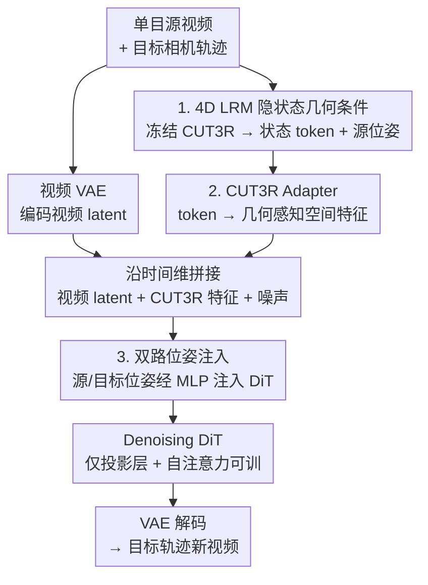

# LaVR: Scene Latent Conditioned Generative Video Trajectory Re-Rendering using Large 4D Reconstruction Models

**会议**: CVPR 2026  
**论文**: [CVF Open Access](https://openaccess.thecvf.com/content/CVPR2026/html/Xie_LaVR_Scene_Latent_Conditioned_Generative_Video_Trajectory_Re-Rendering_using_Large_CVPR_2026_paper.html)  
**代码**: 无（仅项目页 lavr-4d-scene-rerender.github.io）  
**领域**: 视频生成  
**关键词**: 视频重渲染, 动态新视角合成, 4D重建模型, 视频扩散, 相机轨迹控制

## 一句话总结
给定一段单目视频，LaVR 把预训练 4D 重建模型（CUT3R）的隐状态当作"软"几何条件喂给视频扩散模型，从而在沿任意新相机轨迹重渲染场景时，既保住扩散先验的视觉质量、又保住几何一致性——在一致性和位姿还原精度上同时超过显式点云条件和无条件两类基线。

## 研究背景与动机
**领域现状**：视频重渲染（dynamic novel view synthesis）要的是把一段单目视频沿一条全新的、没观测过的相机轨迹重新"拍"出来。和普通视频生成不同，它必须同时建模场景动态和底层几何，才能在任意相机运动下保持时间和空间上的连贯。现有方法分两条路：一类是**几何条件法**（Gen3C、TrajectoryCrafter、EX-4D），先估深度、重建点云/网格，再把点云从目标视角渲染出来当条件；另一类是**无几何条件法**（ReCamMaster），直接拿输入视频 + 目标轨迹喂给视频扩散模型生成。

**现有痛点**：两条路各有硬伤。几何条件法物理上站得住，但深度估计一旦出错，误差会直接传进重渲染的点云——物体沿深度方向被拉伸/压缩、视差不一致、出现空洞，而且点云被"烘焙"成一张 2D 条件图后是个**刚性约束**，生成模型几乎没有空间去纠正这些错误。无条件法继承了扩散先验、视觉真实感很强，但缺乏空间感知，大幅度视角变化下会漂移、变形、在没观测过的区域**幻想**出不存在的内容（多出一条胳膊、猫尾巴乱长）。

**核心矛盾**：几何一致性和视觉质量之间存在 trade-off——显式几何给了一致性却牺牲质量且对深度误差脆弱，纯生成给了质量却丢了一致性。根因在于**条件信号的"硬/软"形态**：点云渲染是像素对齐的刚性约束，留给扩散先验纠错的余地太小。

**本文目标**：找到一种既能提供几何引导、又不依赖精确深度、还允许扩散先验纠错的条件方式。

**切入角度**：作者观察到，最近的大型 4D 重建模型（LRM，如 CUT3R/MegaSAM）证明了一件事——前馈网络能从单目帧里**隐式**抽出富含几何与运动的潜在表示，不需要显式优化或体素重建。这个隐状态把整个 4D 场景结构编码在连续的高维特征空间里，天然是"非像素对齐、连续、可被先验回归纠错"的软形态。

**核心 idea**：不用点云渲染图、而用 4D LRM 的**隐状态**来给视频扩散模型做几何条件——保留完整 4D 结构的同时，把硬约束换成软约束，让预训练扩散先验有空间去 regularize 几何不一致。

## 方法详解

### 整体框架
LaVR 是一个"视频到视频"的扩散重渲染器：输入一段单目源视频和一条用户指定的目标相机轨迹，输出沿该轨迹重渲染、且与源视频场景/动态一致的新视频。整条管线的关键是**不做显式重建**——它把源视频送进冻结的 CUT3R（一个 4D LRM）拿到逐帧的场景隐状态 token 和源相机位姿，把这套 token 通过一个轻量 adapter 转成与视频 VAE latent 对齐的、几何感知的空间特征，然后沿时间维和源视频 latent、噪声 latent 拼接起来喂进 Denoising DiT；源/目标相机位姿分别经两个小 MLP adapter 注入 DiT 各层。DiT 里只有投影层和自注意力层可训，其余（含视频 VAE）全冻结以保住预训练先验。

### 关键设计

**1. 4D LRM 隐状态做"软"几何条件：用连续隐空间替代刚性点云渲染**

这是全文的命门，直接针对"点云渲染图是刚性约束、深度误差无法纠正"的痛点。作者用 CUT3R 作为代表性 4D LRM：它对单目视频做前馈重建，维护一个随时间更新的**持久隐状态**，把多视角信息聚合进去，反映对场景不断演化的 3D 理解。这个状态是一组 $s$ 个 token $\{\ell_i \in \mathbb{R}^d\}_{i=1}^{s}$，每来一帧就被 ViT 编码后更新一次；LaVR 取全部 $T$ 帧的状态张量 $S=\{\{\ell_i^t\}_{i=1}^{s}, t=1,\dots,T\}$，从而保留场景内容和相机位姿的时序变化。关键在于：CUT3R 的多头能从这个状态解出位姿、世界坐标点图、深度，说明 token 里确实编码了强几何/运动线索；但 LaVR **不去解码成显式几何**，而是直接把隐状态当条件——它保留了完整 4D 结构，又因为是高维连续特征（非像素对齐），给预训练扩散先验留下了 regularize 局部不一致的余地。这就是"软"的含义：信息量足够、又对深度噪声鲁棒。

**2. CUT3R Adapter：把 token 形态的隐状态翻译成 DiT 能吃的空间特征**

痛点很具体——CUT3R 的状态是 token-based 的隐式场景表示，和扩散 backbone 要求的空间视频 latent 接口**不兼容**，没法直接喂。作者设计了一个轻量 adapter 来做"翻译"：从形状 $(T, s, d)$ 的状态张量出发，先每隔 $k$ 帧下采样得到 $T/k$ 组 token（省算力）；每组 token 先过一个 MLP adapter 嵌入，再送进一个**基于 query 的 transformer**——用一组对应目标 $h\times w$ 网格的空间 query，对 CUT3R token 做 cross-attention，于是每个输出位置都聚合了整组 token 的信息，把无空间结构的 token 集合变成一张空间特征图。之后再投影到视频 VAE latent 的通道维 $c$，得到几何感知 latent 特征，形状 $(T/k, h, w, c)$。最后把这套适配后的 CUT3R 特征与源视频 latent、噪声输出 latent 沿**时间维拼接**后喂进 DiT。这样做的好处是：注入几何条件**完全不改 backbone 架构**，还和扩散模型预训练时的时空组织兼容，因此能最大限度保住预训练先验。

**3. 双路相机位姿注入：源位姿给上下文、目标位姿给控制信号**

隐状态解决了"场景是什么样"，但还需要明确"从哪个视角看"。LaVR 用两套独立的轻量 MLP adapter 分别处理源相机位姿和目标相机位姿：源位姿（同样来自 CUT3R）经 MLP 后**加到 DiT 各 block 的中间激活上**，给输入帧补充几何上下文；用户指定的目标位姿经另一个 MLP 处理，作为**控制信号**把去噪过程导向期望的相机路径。再加上一段文本 prompt 作为次要条件描述场景。两路位姿分开注入、各司其职，既能跟随轨迹又不互相干扰；消融显示（见下）位姿条件是隐状态条件的有益补充，但贡献量级明显小于隐状态本身。

### 损失函数 / 训练策略
训练时从零训 CUT3R adapter 和两个位姿 MLP adapter，并只微调 DiT 的一个子集——投影层（projector）和全部自注意力 block，其余 DiT 层和视频 VAE 全部冻结以保留预训练先验。训练目标用标准的**条件 flow-matching loss**：给定干净目标 latent $z_0$、噪声 $\epsilon \sim \mathcal{N}(0, I)$、时间步 $t \sim U(0,1)$，构造插值 latent $z_t = (1-t)z_0 + t\epsilon$，DiT 在适配后的 CUT3R 隐状态 $Z_c$ 和源视频 latent $Z_s$ 条件下预测速度场：

$$\mathcal{L}_{\text{FM}} = \mathbb{E}_{t, z_0, \epsilon}\left[\left\| v_\theta(z_t, t, Z_c, Z_s) - (\epsilon - z_0) \right\|_2^2\right]$$

为让几何条件通路快速收敛、又不破坏预训练先验，给 CUT3R adapter 用了比其他组件**高 3 倍的学习率**（CUT3R adapter $6\times10^{-5}$，其余 $2\times10^{-5}$）。模型约 1.3B 参数，在合成数据集 MultiCamVideo（来自 ReCamMaster，每个场景随机取两条轨迹作源/目标）上用 8 张 H200 训 15K 步、batch size 8。

## 实验关键数据

### 主实验
评测集：从 Pexels 取 100 段动态场景视频 + 从 DL3DV 取 50 段静态场景视频，统一重采样到 33 帧、480×832；每段视频在 4 条不同新轨迹下评测，所有方法配同样文本 caption。基线：Gen3C、TrajectoryCrafter（点云条件）、ReCamMaster（无条件）。

| 方法 | Cycle PSNR↑ | Cycle LPIPS↓ | Cycle CLIP↑ | Subject↑ | Multi-view↑ | Background↑ | 参数量 |
|------|-------------|--------------|-------------|----------|-------------|-------------|--------|
| Gen3C | 20.62 | 23.23 | 97.47 | 92.07 | 7.695 | 90.91 | ~7B |
| TrajectoryCrafter | 14.84 | 41.59 | 95.05 | 93.38 | 15.57 | 92.21 | ~5B |
| ReCamMaster | 17.75 | 32.63 | 97.03 | 94.95 | 5.975 | 92.76 | ~1.3B |
| **Ours (LaVR)** | **20.74** | **22.47** | **98.07** | **95.22** | **17.11** | **92.83** | ~1.3B |

（LPIPS/CLIP/VBench 各指标均 ×$10^{-2}$。）LaVR 在所有一致性指标上都拿到最好或并列最好，且只用 ~1.3B 参数就压过 5B/7B 的点云条件基线。位姿还原精度（用 BA-Track 重建轨迹后与 GT 对齐算误差）：

| 方法 | Abs(t)↓ (mm) | Rel(t)↓ | Rel(R)↓ (deg) |
|------|--------------|---------|---------------|
| Gen3C | 24.45 | 12.00 | 0.641 |
| TrajectoryCrafter | 16.53 | 10.52 | 0.442 |
| ReCamMaster | 21.83 | 12.43 | 0.518 |
| **Ours** | **14.39** | **7.798** | **0.411** |

LaVR 最贴合目标轨迹；无条件的 ReCamMaster 在 Abs(t) 上误差最大，印证它"不跟轨迹走"。

### 消融实验
源位姿条件的消融（静态场景，Tab. 3）：

| 配置 | Cycle PSNR↑ | Multi-View↑ | Abs(t)↓ | Rel(t)↓ | Rel(R)↓ | 说明 |
|------|-------------|-------------|---------|---------|---------|------|
| No latents, No pose | 17.75 | 5.975 | 21.83 | 12.43 | 0.518 | 等价无条件基线 |
| No CUT3R latents | 17.90 | 6.832 | 19.70 | 11.84 | 0.489 | 只去隐状态，几乎没涨 |
| No CUT3R pose | 20.70 | 16.08 | 16.93 | 9.460 | 0.467 | 只去源位姿，仍接近完整 |
| **Ours (full)** | **20.74** | **17.11** | **14.39** | **7.798** | **0.411** | 完整模型 |

### 关键发现
- **隐状态条件是涨点主力**：去掉 CUT3R 隐状态后（No CUT3R latents），Multi-view 一致性从 17.11 掉到 6.832、Cycle PSNR 从 20.74 掉到 17.90，几乎退回无条件基线水平；而只去掉源位姿（No CUT3R pose）各指标只小幅回落（Multi-view 17.11→16.08）。说明几何条件主要来自隐状态，位姿是补充。
- **软条件优于硬条件**：点云条件基线（Gen3C/TrajectoryCrafter）因深度尺度歧义、内参经验估计、点云空洞/错位，产出扭曲的条件图，导致非自然输出（拉伸、缺细节）；无条件 ReCamMaster 在遮挡前后无法保持物体一致（灯腿消失、纸箱重现后被打开、多出第三条手臂）。LaVR 的隐状态软条件两类伪影都规避了。
- **以小搏大**：用 1.3B 参数在所有一致性指标上压过 5B/7B 的点云条件模型，效率优势明显。

## 亮点与洞察
- **"软/硬几何条件"这个二分很有解释力**：把点云渲染图视为像素对齐的刚性约束、把 LRM 隐状态视为连续可纠错的软约束，一句话点透了为什么显式几何会被深度误差拖垮——这个视角可迁移到任何"几何引导生成"的任务（如可控图像合成、3D 编辑）。
- **复用预训练 4D LRM 的隐状态当条件，而不是它的解码输出**：大多数工作用 CUT3R 这类模型是为了拿它解出来的深度/点云，LaVR 反其道而行，直接吃中间隐状态——保留了被解码过程丢掉的信息和连续性，是个很巧的"少做一步反而更好"的设计。
- **adapter 把 token 翻译成空间特征 + 时间维拼接注入**：用 query-based transformer 把无空间结构的状态 token 投影成与 VAE latent 对齐的空间图、再沿时间维拼接，几乎零改动 backbone 就完成跨模态条件注入，这套"翻译 + 拼接"范式可复用到其它"异构条件喂扩散模型"的场景。

## 局限与展望
- 作者承认：对**运动中的透明物体**（如被人举起的玻璃杯）表现不佳，根因是 CUT3R 本身难以为这类场景估出可靠几何——LaVR 的几何质量被它依赖的 LRM 上限卡住。
- CUT3R 条件机制带来**额外计算开销**（多跑一个 4D LRM + adapter + 拼接更长的时间序列）。
- 自己发现的局限：训练只在合成数据集 MultiCamVideo 上做，真实场景泛化未充分验证；评测指标里 cycle consistency / VBench 是间接代理，生成任务无单一 GT 难做严格几何对比（作者也承认这点）；隐状态条件的有效性高度绑定所选 LRM，换更强的 4D LRM 应能直接受益但未实验。
- 改进思路：把 CUT3R 换成对透明/反光物体更鲁棒的 4D LRM；或对隐状态做不确定性加权，让扩散先验在 LRM 没把握的区域获得更大纠错权重。

## 相关工作与启发
- **vs TrajectoryCrafter / Gen3C（点云条件）**：他们重建点云再从目标视角渲染当条件，几何刚性强但被深度误差/空洞/内参歧义拖累，产出扭曲；LaVR 用连续隐状态软条件，几何信息不丢且可被先验纠错，质量和一致性双赢，且参数量小数倍。
- **vs ReCamMaster（无条件）**：他们只喂输入视频 + 目标轨迹、纯靠扩散先验，灵活但缺空间感知、大视角下幻想内容；LaVR 在同等 1.3B 规模上补了隐状态几何条件，遮挡前后一致性和轨迹跟随精度都显著更好。
- **vs DUST3R / CUT3R 等 4D LRM**：这些是 LaVR 的"上游"——LaVR 不与它们竞争，而是把它们的隐状态当作几何先验复用，是"重建模型 → 生成模型条件"的桥接范式。

## 评分
- 新颖性: ⭐⭐⭐⭐⭐ "用 4D LRM 隐状态而非解码输出做软几何条件"是干净且有洞见的新视角
- 实验充分度: ⭐⭐⭐⭐ 三类基线 + 一致性/位姿/VBench 多维度评测，但消融只测了位姿、缺 adapter 设计的消融
- 写作质量: ⭐⭐⭐⭐⭐ 软/硬条件的二分讲得清楚，动机推导顺畅
- 价值: ⭐⭐⭐⭐ 以小搏大、范式可迁移，但依赖合成训练数据与上游 LRM 上限

<!-- RELATED:START -->

## 相关论文

- [\[CVPR 2026\] Inference-time Physics Alignment of Video Generative Models with Latent World Models](inference-time_physics_alignment_of_video_generative_models_with_latent_world_mo.md)
- [\[CVPR 2026\] SpaceTimePilot: Generative Rendering of Dynamic Scenes Across Space and Time](spacetimepilot_generative_rendering_of_dynamic_scenes_across_space_and_time.md)
- [\[CVPR 2026\] CineBrain: A Large-Scale Multi-Modal Audiovisual Brain Dataset for Brain-Conditioned Video Generation](cinebrain_a_large-scale_multi-modal_audiovisual_brain_dataset_for_brain-conditio.md)
- [\[CVPR 2026\] Diff4Splat: Repurposing Video Diffusion Models for Dynamic Scene Generation](diff4splat_controllable_4d_scene_generation_with_latent_dynamic_reconstruction_m.md)
- [\[CVPR 2026\] FlashLips: 100-FPS Mask-Free Latent Lip-Sync using Reconstruction Instead of Diffusion or GANs](flashlips_100-fps_mask-free_latent_lip-sync_using_reconstruction_instead_of_diff.md)

<!-- RELATED:END -->
