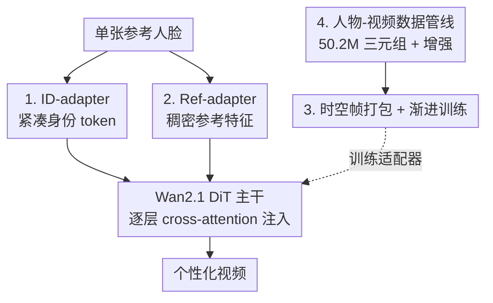

# Lynx: Towards High-Fidelity Personalized Video Generation

**会议**: CVPR 2026  
**论文**: [CVF Open Access](https://openaccess.thecvf.com/content/CVPR2026/html/Sang_Lynx_Towards_High-Fidelity_Personalized_Video_Generation_CVPR_2026_paper.html)  
**代码**: 项目页 https://byteaigc.github.io/Lynx/  
**领域**: 视频生成 / 个性化生成 / 扩散模型  
**关键词**: 个性化视频生成, 身份保持, DiT, 适配器(Adapter), ArcFace

## 一句话总结
Lynx 在开源视频基座 Wan2.1-14B（DiT）上挂两个轻量适配器——把 ArcFace 人脸向量压成 16 个身份 token 注入的 ID-adapter，和走冻结参考分支抽稠密 VAE 特征逐层注入的 Ref-adapter——只需单张人脸图就能生成身份高度相似、动作自然的个性化视频，在 40 主体 × 20 prompt 的 800 例基准上人脸相似度全面领先。

## 研究背景与动机
**领域现状**：扩散模型把文生图推进到文生视频（CogVideoX、HunyuanVideo、Wan2.1 等），DiT 架构让时空建模更具表达力。个性化生成（personalization）——根据用户给的参考图合成保持其身份的内容——在图像域已被充分研究，主流是用轻量条件模块（IP-Adapter、InstantID）把身份特征注入扩散过程，避免重训整个模型。

**现有痛点**：把个性化从图像扩展到视频后出现新难题：身份特征要跨帧保持时间一致、要在不同视角/光照下泛化、还要兼顾运动自然度。现有视频个性化方法走两条路且各有短板——一类（ConsistID、HunyuanCustom）做模态特化模块但身份相似度有限；另一类（SkyReels-A2、VACE、Phantom）把参考条件直接和噪声 latent 拼接一起去噪，结果常出现"复制粘贴"式的背景/光照搬运、prompt 跟随差。

**核心矛盾**：身份相似度（resemblance）与可编辑性/prompt 跟随（editability）长期是一对 trade-off——把参考贴得越死，身份越像但越难按文本改场景动作；放得越松，越好编辑但身份漂移。

**本文目标**：从单张人脸图出发，做到身份高保真 + prompt 跟随好 + 视频质量高，三者同时拿住。

**切入角度**：不微调整个基座，而是用两路互补的适配器分工——一路给"是谁"的紧凑身份语义，一路给"长什么样"的稠密外观细节，把身份信息从粗到细都喂进去。

**核心 idea**：用 ID-adapter（紧凑身份 token）+ Ref-adapter（稠密 VAE 参考特征）双适配器，通过逐层 cross-attention 注入冻结的 DiT 基座，实现高保真个性化视频生成。

## 方法详解

### 整体框架
Lynx 以 Wan2.1-14B 为冻结基座（DiT + Flow Matching，每个 DiT block 先做时空自注意力、再做文本 cross-attention）。它不重构也不微调主干，而是在每个 transformer block 里额外插入两套 cross-attention，分别接收来自两个适配器的身份条件：**ID-adapter** 把人脸识别网络抽到的身份向量经 Perceiver Resampler 变成一小撮身份 token，提供"这是谁"的紧凑语义；**Ref-adapter** 把参考人脸图经一个冻结的基座副本（ReferenceNet 式）跑出每一层的稠密激活，提供"长什么样"的细粒度外观。两路 token 在每层各自 cross-attention 后加回主分支。训练侧用"时空帧打包 + 渐进式课程"高效吞吐混合的图像/视频数据，数据侧用一条人物-视频三元组管线产出 5000 万级训练对。

### 关键设计

**1. ID-adapter：把人脸压成 16 个身份 token 注入，给"是谁"的紧凑语义**

针对"如何用极少参数稳定地表达身份"这个痛点，Lynx 沿用图像域 IP-Adapter / InstantID 的范式但搬到视频 DiT 上。先用人脸识别网络（ArcFace）从参考图抽一个 $512$ 维特征向量，这个向量本身不适合直接做 cross-attention 的 key/value（它是单个向量、不是序列），于是用一个 Perceiver Resampler（即 Q-Former）把它映射成定长 token 序列：产出 $16$ 个维度为 $5120$ 的 token embedding，再拼上 $16$ 个 register token（共 32 个），与视觉 token 做 cross-attention 后加回主分支。ArcFace 特征本就是为"判别同一个人"训练的，所以这条路给的是高度判别性的身份语义；用 Resampler 把它转成少量 token 既保留身份信息又几乎不增加计算。一个关键经验：Resampler 从头训练几乎学不到人脸相似度，必须用图像域预训练 checkpoint（InstantID）初始化才能快速收敛（详见训练策略）。

**2. Ref-adapter：走冻结参考分支抽逐层稠密 VAE 特征，补"长什么样"的细节**

ID token 虽然身份语义强，但太"压缩"，丢了纹理、发型、皱纹这类细粒度外观细节。Ref-adapter 专门补这一块。它不像 SkyReels-A2/Phantom 那样把参考特征图直接拼到噪声 latent 前面（image-to-image 式，容易导致复制粘贴），而是借鉴 ReferenceNet：把参考人脸图送进一个**冻结的基座副本**，噪声级别设为 0、文本 prompt 固定为 "image of a face"，让这个副本前向时在**所有 DiT 层**都留下中间激活（即稠密参考 token）。然后在主生成分支的每一层用单独的 cross-attention 把对应层的参考 token 融进去。这样空间细节能在各个层级被捕获并注入，而不是只在输入端贴一次；用冻结副本而非直接拼 latent，也避免了把参考图的背景/光照原样搬进结果的"复制粘贴"伪影。ID-adapter 管"像不像这个人"，Ref-adapter 管"细节够不够真"，两者互补。

**3. 时空帧打包 + 渐进式训练：高效吞吐异构图像/视频，先学外观再学运动**

视频训练数据在空间分辨率和时间长度上都参差不齐，传统图像域的"分桶(bucketing)"做法（把样本裁到预设若干宽高比/分辨率、同一 batch 取同桶）在视频上水土不服——多了时间维后按"分辨率×时长"分桶会大幅牺牲灵活性。Lynx 借鉴 Patch n' Pack(NaViT)，把每段视频 patch 化后的 token 拼成一条长序列当作一个统一 batch，用 attention mask 保证 token 只在自己视频内部注意、互不串扰，位置编码则对每段视频独立施加 3D-RoPE。配套用**渐进式课程**：先做图像预训练（把每张图当单帧视频，复用同一套帧打包），利用海量图像数据先把外观/身份学扎实（Resampler 用 InstantID 初始化后 10k 步就能看到人脸相似，第一阶段共 40k 步）；图像预训练出来的视频偏静态，于是第二阶段接大规模视频数据 60k 步，恢复运动模式、场景转换和时间一致性。这一"先外观后运动"的顺序，把"身份保真"和"动起来"解耦到两个阶段学，避免互相干扰。

**4. 人物-视频数据管线：用表情/重打光增强造出 5000 万级三元组**

个性化训练需要可靠的"人物条件图–目标视频"配对，但直接从同一张图/视频里裁人脸做配对会让模型过拟合到固定的表情和光照，而真正需要的多场景(multi-scene)同人数据天然稀缺。Lynx 把原始数据分成单图/单视频/多场景图集/多场景视频集四类，并用两种增强扩充：**表情增强**用 X-Nemo 把源人脸编辑成目标表情、丰富表情多样性；**人像重打光**用 LBM 在不同光照下重打光并替换背景、增强对光照变化的鲁棒性。增强后用人脸识别模型做身份核验，丢弃相似度过低的配对（原始多场景数据也过同样的相似度过滤）。对直接从目标裁出条件图的单场景对，还做背景增强（分割主体后替换背景）。管线最终产出 $50.2$M 配对：$21.5$M 单场景 + $7.7$M 多场景 + $21.0$M 增强单场景，训练时按类型加权采样平衡多样性。

### 损失函数 / 训练策略
基座 Wan2.1 用 Flow Matching 框架训练，Lynx 在其上只训两个适配器（基座冻结）。优化器 AdamW，学习率 $1\text{e-}5$，weight decay $0.01$，128 张 80G GPU；因 token 被打包，用"每次迭代的 token 数"而非 batch size 计量，每 GPU 每步 $33{,}600$ token。阶段一图像预训练 40k 步（Resampler 由 InstantID 初始化），阶段二视频训练 60k 步。

## 实验关键数据

### 主实验
评测基准：40 主体（10 名人照 + 10 AI 合成肖像 + 20 自有授权、覆盖多种族群）× 20 条无偏文本 prompt = 800 测试视频。身份相似度用三个独立人脸识别器算余弦相似度（facexlib、insightface、自有模型）；prompt 跟随与视频质量用 Gemini-2.5-Pro 自动评测管线打分。

人脸相似度对比（Table 1，越高越像）：

| 模型 | facexlib | insightface | in-house |
|------|----------|-------------|----------|
| SkyReels-A2 | 0.715 | 0.678 | 0.725 |
| VACE | 0.594 | 0.548 | 0.615 |
| Phantom | 0.664 | 0.659 | 0.689 |
| MAGREF | 0.575 | 0.510 | 0.591 |
| Stand-In | 0.611 | 0.576 | 0.634 |
| **Lynx (ours)** | **0.779** | **0.699** | **0.781** |

Lynx 在三个评测器上身份相似度全部第一。SkyReels-A2 身份排第二，但其依赖"复制粘贴"式生成，prompt 跟随很弱（见 Table 2）。

Gemini-2.5-Pro 感知质量对比（Table 2，越高越好）：

| 模型 | Prompt 跟随 | 美学质量 | 运动自然度 | 视频质量 |
|------|------------|---------|-----------|---------|
| SkyReels-A2 | 0.471 | 0.704 | 0.824 | 0.870 |
| VACE | 0.691 | 0.846 | **0.851** | 0.935 |
| Phantom | 0.690 | 0.825 | 0.828 | 0.888 |
| MAGREF | 0.612 | 0.787 | 0.812 | 0.886 |
| Stand-In | 0.582 | 0.807 | 0.823 | 0.926 |
| **Lynx (ours)** | **0.722** | **0.871** | 0.837 | **0.956** |

Lynx 在 prompt 跟随、美学、视频质量三项夺冠；运动自然度上 VACE 凭强时序建模略高（0.851 vs 0.837）。Phantom 走 prompt 强但身份弱的路线，印证了身份-编辑性的 trade-off，而 Lynx 取得最佳平衡。（⚠️ 原文摘要曾称"five 项里 four 项最佳"，按 Table 2 的四项感知指标实为 3/4，以原文表格为准。）

### 消融实验
从完整 Lynx 里分别去掉 Ref-adapter 或 ID-adapter（Table 3）：

| 配置 | ID-insightface | Prompt 跟随 | 视频质量 | 说明 |
|------|---------------|------------|---------|------|
| Lynx-id-only | 0.655 | 0.624 | 0.925 | 去掉 Ref-adapter，身份小降、prompt 明显掉 |
| Lynx-ref-only | 0.523 | 0.738 | 0.921 | 去掉 ID-adapter，prompt 略升但身份大跌 |
| **Lynx (full)** | **0.699** | 0.722 | **0.956** | 完整模型综合最优 |

### 关键发现
- **两个适配器互补、缺一不可**：只留 ID-adapter（Lynx-id-only）prompt 跟随从 0.722 掉到 0.624，外观细节不足；只留 Ref-adapter（Lynx-ref-only）prompt 略升到 0.738，但身份相似度从 0.699 暴跌到 0.523——说明 Ref-adapter 增强语义可控性，单独却撑不住身份。完整模型在身份/prompt/质量上取得最佳折衷。
- **Resampler 初始化决定成败**：ID-adapter 的 Perceiver Resampler 从头训几乎学不到人脸相似度（即便长时间训练），必须用图像域预训练（InstantID）初始化，10k 步就能见到相似、40k 步完成第一阶段。
- **质化对比**：基线常出现身份漂移、不真实动作、背景/光照复制粘贴；Lynx 在多样 prompt 下身份一致、运动自然、场景融合自然。

## 亮点与洞察
- **"紧凑语义 + 稠密细节"双路分工**：把身份信息显式拆成"是谁"（ArcFace token，判别性强）和"长什么样"（逐层 VAE 稠密特征），分别用两个 cross-attention 注入——这种解耦让模型同时拿住身份相似度和细节真实度，是值得迁移到任何 identity-preserving 任务的设计范式。
- **用冻结参考分支替代 latent 拼接**：Ref-adapter 走 ReferenceNet 式冻结副本逐层抽特征，而非把参考图直接拼噪声 latent，巧妙规避了"复制粘贴"背景/光照的通病——这正是它 prompt 跟随强于 SkyReels-A2 的关键。
- **帧打包 + 先图后视频的渐进训练**：用 NaViT 式 token 打包统一吞吐异构图像/视频，再用"图像学外观→视频学运动"的课程解耦两个目标，是大规模视频个性化训练的实用工程方案。

## 局限与展望
- **作者承认的局限**：身份注入可能放大不合理的动力学/交互——如火车先倒退再前进、拉小提琴时弓不碰弦（Figure 7）。这部分源于基座 Wan2.1 自身，身份条件会放大此类问题，作者认为可加训练正则缓解。
- **依赖闭源/自有组件评测**：prompt 跟随与视频质量靠 Gemini-2.5-Pro 打分、身份相似度含自有人脸识别器，复现门槛较高；指标"3/4 最优"与摘要表述略有出入。
- **单主体、视觉模态为主**：当前只做单人身份，作者展望扩到多主体、跨模态（视觉+音频）个性化与可控运动编辑。
- **训练成本高**：128×80G GPU、5000 万级配对，普通团队难以复现。

## 相关工作与启发
- **vs SkyReels-A2 / VACE / Phantom（拼接式）**：它们把参考条件直接和噪声 latent 拼接一起去噪，身份能贴近但易复制粘贴背景/光照、prompt 跟随差（SkyReels-A2 身份第二但 prompt 仅 0.471）；Lynx 用冻结参考分支逐层注入，身份更高且 prompt 跟随显著更好。
- **vs HunyuanCustom / ConsistID（模态特化）**：它们靠频率分解或多模态定制模块；Lynx 走更轻量的双适配器、不微调基座，工程上更易扩展。
- **vs IP-Adapter / InstantID（图像域）**：Lynx 直接复用其 ArcFace+Resampler 范式并以 InstantID 权重初始化，把图像域的身份注入成功迁移到视频 DiT，并补上 Ref-adapter 解决视频细节与时间一致性。

## 评分
- 新颖性: ⭐⭐⭐⭐ 双适配器组合非全新，但"紧凑身份+冻结参考稠密特征"在视频 DiT 上的配方与工程整合扎实
- 实验充分度: ⭐⭐⭐⭐ 800 例基准、三评测器、清晰消融，但依赖闭源 Gemini 与自有模型评测
- 写作质量: ⭐⭐⭐⭐ 结构清晰、动机到位；个别指标表述与表格略有出入
- 价值: ⭐⭐⭐⭐ 个性化视频生成 SOTA 级身份保真，适配器范式实用、可迁移

<!-- RELATED:START -->

## 相关论文

- [\[CVPR 2026\] Soul: Breathe Life into Digital Human for High-fidelity Long-term Multimodal Animation](soul_breathe_life_into_digital_human_for_high-fidelity_long-term_multimodal_anim.md)
- [\[ICLR 2026\] PreciseCache: Precise Feature Caching for Efficient and High-fidelity Video Generation](../../ICLR2026/video_generation/precisecache_precise_feature_caching_for_efficient_and_high-fidelity_video_gener.md)
- [\[CVPR 2026\] DreamShot: Personalized Storyboard Synthesis with Video Diffusion Prior](dreamshot_storyboard_synthesis.md)
- [\[ECCV 2024\] MagDiff: Multi-Alignment Diffusion for High-Fidelity Video Generation and Editing](../../ECCV2024/video_generation/magdiff_multi-alignment_diffusion_for_high-fidelity_video_generation_and_editing.md)
- [\[CVPR 2026\] AnyID: Ultra-Fidelity Universal Identity-Preserving Video Generation from Any Visual References](anyid_ultra-fidelity_universal_identity-preserving_video_generation_from_any_vis.md)

<!-- RELATED:END -->
