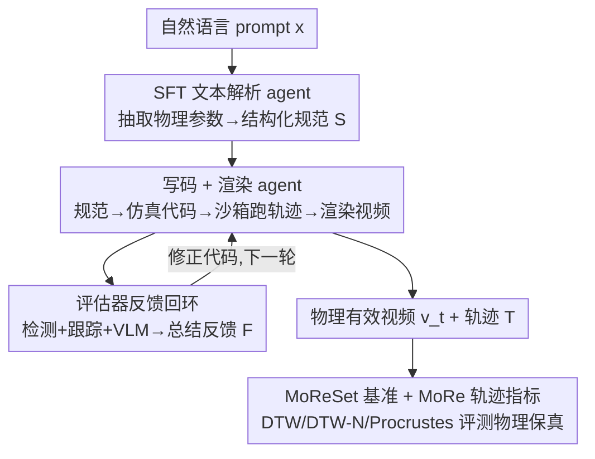

# MoReGen: Multi-Agent Motion-Reasoning Engine for Code-based Text-to-Video Synthesis

**会议**: CVPR 2026  
**论文**: [CVF Open Access](https://openaccess.thecvf.com/content/CVPR2026/html/Bai_MoReGen_Multi-Agent_Motion-Reasoning_Engine_for_Code-based_Text-to-Video_Synthesis_CVPR_2026_paper.html)  
**代码**: 无（论文称在 GitHub 主页提供 code/dataset，未给具体地址 ⚠️ 以原文为准）  
**领域**: 视频生成  
**关键词**: 文生视频, 物理一致性, 多智能体, 代码生成, 轨迹评测

## 一句话总结
MoReGen 不走扩散去噪，而是让多个 LLM 智能体把自然语言变成可执行的物理仿真代码——文本解析 agent 抽取物理参数、写码 agent 生成仿真脚本、渲染 agent 把轨迹画成视频、评估器再回环修正，从而生成严格遵守牛顿力学的视频；配套提出 1275 段标注轨迹的 MoReSet 基准和基于轨迹对齐的 MoRe 指标，证明现有 SOTA 文生视频模型在物理精度上集体失守。

## 研究背景与动机
**领域现状**：文生视频（T2V）这几年在画质上突飞猛进，主流是把图像扩散 backbone 的 2D transformer「充气」成 3D（DiT 架构），靠堆数据、堆算力把视觉保真度做到以假乱真，Sora 2、Veo3、Grok Imagine 都是这条路。

**现有痛点**：这些模型「好看但不讲理」。论文开篇 Figure 1 就摆出 Sora 2、Veo3、Grok 的翻车案例——数球数错、动量不守恒、牛顿力算错、速度和压强算反。它们能复刻训练集里见过的视觉模式，却推不出支配运动的物理定律，遇到分布外（OOD）的物理 prompt 就大幅偏离现实。

**核心矛盾**：纯数据驱动的 transformer 天生偏好「记忆统计相关性」而非「因果推理」，优化目标奖励的是「重现见过的样子」而不是「推断应该发生什么」。更糟的是评测端也跟着失灵：FID/FVD/PSNR 这些指标只衡量像素分布相似度，完全不反映视频是否服从物理定律；转向人工打分又太主观、给不出精确的物理量化。

**本文目标**：拆成两个子问题——(1) 怎么生成真正物理精确的牛顿运动视频；(2) 怎么定量评测一个视频的「物理有效性」而不是只看好不好看。

**切入角度**：作者的关键观察是——物理定律本身是确定性的、可被仿真器精确求解的。与其让神经网络去「猜」物理，不如让 LLM 把语言翻译成**可执行的仿真代码**，把物理交给物理引擎（Pymunk/Blender/Manim）算。这样视频不再是概率采样的产物，而是可复现、可追溯轨迹的仿真回放。

**核心 idea**：用「多智能体 LLM + 物理仿真器 + 渲染器」的代码域流水线，替代「扩散去噪」的像素域生成；并用轨迹对齐（而非像素相似度）作为物理有效性的直接度量。

## 方法详解

### 整体框架
MoReGen 把「文生视频」重定义成「文生可执行仿真代码再渲染」。给定一句自然语言 prompt $x$（如「一个球以 10 m/s、45° 抛出」），系统由三个协作的 LLM 智能体加一个评估器组成：**文本解析 agent $A_\text{text}$** 把自由文本解析成结构化的牛顿规范 $S$（含物体、参数、初始条件）；**写码 agent $A_\text{coder}$** 把 $S$ 翻译成可执行物理仿真代码 $C_t$，在沙箱里跑出场景配置 $C$ 和逐帧轨迹 $T$；**渲染 agent $A_\text{render}$** 消费轨迹生成渲染脚本、产出视频 $v_t$ 和遥测数据；**评估器 $E$** 用目标检测+点跟踪+VLM 分析视频，把轨迹对齐度、物理合理性、意图一致性总结成反馈 $F$ 回灌给 $A_\text{coder}$，进入下一轮迭代修正。三个 agent 都是 LLM（本文用 Qwen），只有 $A_\text{text}$ 需要少量监督微调。

### 关键设计

**1. 监督微调的文本解析 agent：把残缺的口语描述补成完整的物理规范**

痛点很具体：自然语言描述往往**漏参数**（说「球抛出去」却不给角度、初速、质量），而且不同物理现象依赖完全不同的支配变量（斜坡靠倾角、抛体靠初速度），没微调的通用 LLM 只会瞎猜，给出不完整或自相矛盾的规范。作者的做法是先为九类牛顿现象各设计一套**结构化 schema**，规定合法参数范围与单位、必需的物理实体（物体/锚点/约束）、几何与力学一致性要求、物理上自洽的初始条件；用任务专属 prompt 生成结构化规范并人工校验正确性，得到 1200 对 (text, specification) 作为 SFT 数据。在 Qwen2.5-Coder-14B 上用 next-token 监督损失微调：

$$\mathcal{L}_\text{SFT} = -\mathbb{E}_{(x,S)\sim D}\Big[\sum_{t=1}^{|S|} \log p_\theta(S_t \mid x, S_{<t})\Big]$$

微调后的关键收益是 agent **内化**了「语言→物理参数」的映射：不再依赖现象专属 prompt 模板，一条通用指令就能跨所有现象输出完整规范；还学会把「前两个球」「从右边推」这类语言线索翻译成物体索引和受力方向，并在缺参时**推断合理默认值而非幻觉编造**。这一步是整条流水线物理正确性的源头——下游代码和渲染都以这份规范为权威输入。

**2. 写码 + 渲染双 agent：用统一 prompt 把规范变成仿真代码与视频，且解耦轨迹与渲染**

拿到结构化规范后，$A_\text{coder}$ 基于一个**统一 prompt** 工作——该 prompt 提供一个通用 Python 类框架（含空间初始化、物体创建、约束设置、仿真循环四块骨架）。agent 逐字段读规范、填入数值参数、选择合适的开源物理引擎 API（Pymunk/Blender/Manim）实例化刚体、形状、约束，并在每个仿真步长 $\Delta t$ 记录位置、速度、朝向，形成每个物体的完整时序轨迹。这里的本质区别是：运动由真实物理引擎按机械定律算出，而非神经网络的统计近似。

渲染端 $A_\text{render}$ 同样只用一个通用 prompt，在沙箱里执行代码 $C_t$ 产出两路同步输出——逐时刻的遥测数据（位置/速度/朝向）和渲染视频 $v_t$（用 pygame 与 Pymunk 无缝衔接，重建几何并实时回放状态）。作者强调这个**轨迹生成与视频渲染解耦**的设计很重要：因为可视化本质只是「重建几何 + 回放状态轨迹」，同一套渲染逻辑天然泛化到所有物理现象；而且解耦后可以轻松换成 Unreal/Blender/Unity 等更真实的 3D 渲染引擎，不影响前面的物理仿真。

**3. 多轮评估器反馈回环：用轨迹跟踪 + VLM 把「物理对不对」变成可回灌的修正信号**

光生成一次不够稳，14B 模型一开始甚至生成不出能跑的代码。评估器的作用是把「视频物理对不对」量化成 $A_\text{coder}$ 能消化的反馈。具体三路并行打分：用 **GroundedDINO**（由 $A_\text{text}$ 抽出的物体描述符引导）检测视频里的物体位置，再用 **CoTracker3** 估计归一化轨迹 $T_\text{est}$，让 LLM 比较它与仿真真值轨迹 $T$ 的相似度/偏离；同时用 **Qwen2.5-VL** 从两个角度评视频——基于物理规则的合理性、与原 prompt 意图的对齐度。最后由 LLM 把三路总结成反馈 $F$：

$$F = \text{LLM}\big(\text{“Summarize”},\ \langle \text{LLM}(\text{“Traj”}, T_\text{est}, T),\ \text{VLM}(\text{“Phys”}, v_t),\ \text{VLM}(\text{“Intent”}, v_t, x)\rangle\big)$$

$F$ 回灌给写码 agent 指导下一轮代码与视频改进（含语法报错时让模型修 bug）。消融显示这一回环把不可用的 14B 救活成可跑，对 GPT-5 也带来跨指标的稳定提升。

**4. MoReSet 基准 + MoRe 轨迹指标：用轨迹对齐而非像素相似度直接量化物理有效性**

作者认为 FID/FVD/PSNR/LPIPS 这类像素或潜空间相似度根本测不到「物理对不对」，于是把评测重建在**物体运动轨迹**上。MoReSet 含 1275 段视频，覆盖重力、加速度、碰撞、振荡、动量、浮力、惯性、单摆、滑轮九类牛顿现象；训练集 1200 段 Blender 仿真各配自由文本描述与完整结构化 JSON 规范，测试集 75 段真实实验室视频，人工标注场景描述、物体身份与完整像素级轨迹（CoTracker3 自动抽取 + 人工校正）。配套的 **MoRe 指标**受点跟踪模型启发，是一套轨迹保真套件：(1) **DTW**（动态时间规整）把不同时长的估计轨迹与真值在非线性空间对齐；(2) **DTW-N** 先把轨迹中心化再缩放到单位弧长，归一化掉不同尺度/时长的影响；(3) **Procrustes 分析得分**衡量预测与真值轨迹的几何结构对齐。三者都「越低越好」，直接度量关键运动物体的轨迹保真度，回避了像素指标对 OOD 的脆弱性。

## 实验关键数据

### 主实验
在 MoReSet 测试集上用 MoRe 指标横评三类 T2V 模型：中等开源（Wan2.2、LTX、CogVideoX）、大规模商用（Veo3、Sora2、Grok）、物理增强（NewtonGen、WISA）。所有模型用相同 prompt，视频统一降到 480p / 10fps。

| 模型 | DTW ↓ | DTW-N ↓ | Procrustes ↓ |
|------|-------|---------|--------------|
| Wan2.2-TI2V-5B | 17.18 | 0.10 | 0.65 |
| LTXV-2B-Distilled | 16.99 | 0.11 | 0.71 |
| CogVideoX-5B | 12.94 | 0.09 | 0.62 |
| Veo3 | 13.35 | 0.07 | 0.57 |
| Grok | 13.00 | 0.08 | 0.55 |
| Sora2 | 11.21 | 0.08 | 0.55 |
| NewtonGen | 17.88 | 0.11 | 0.62 |
| WISA | 12.67 | 0.09 | 0.68 |
| **MoReGen (Ours)** | **8.93** | **0.06** | **0.48** |

MoReGen 在三项轨迹指标上全面领先，DTW 从最强商用模型 Sora2 的 11.21 降到 8.93。一个有意思的发现：商用模型在视觉美学上碾压小模型，但这个优势**不延伸到运动轨迹精度**——CogVideoX-5B 和 WISA 这类中等开源模型在 MoRe 指标下能跟 Sora2 打平。各基线还普遍标准差巨大（如 Wan2.2 DTW ±15.88），说明它们训练数据物理分布不均、不同模型擅长不同物理域；MoReGen 因规则驱动而表现稳定。

作者还用社区现成的数据驱动物理指标（Trajan 的 AJ/OA、VideoPhy2 的 SA/PC）评测，结论是**这些指标在 OOD 下不可靠**：Trajan 给低保真的 LTX 打超高分（AJ 0.79，甚至超过 Veo3/Grok）；VideoPhy2 的 SA 强相关视觉质量而非物理，把视觉好看但物理错的 Sora2/Grok 排前面。只有 PC（物理常识）较能反映动态——MoReGen 拿到最高的 PC 4.53，但它仍误把 CogVideoX 排在更准的系统之上。这反向印证了 MoRe 轨迹指标的必要性。

### 消融实验
在专门的评估集上拆解 Coder agent 选型、SFT、评估器反馈三个因素：

| Coder | SFT | Feedback | DTW ↓ | Procrustes ↓ | PC ↑ |
|-------|-----|----------|-------|--------------|------|
| Qwen2.5-Coder-14B | × | × | 几乎全失败（语法错误，代码跑不通） | — | — |
| Qwen2.5-Coder-14B | × | ✓ | 18.01 | 0.70 | 4.49 |
| **Qwen2.5-Coder-14B** | **✓** | **×** | **8.93** | **0.48** | **4.53** |
| GPT-5 | × | × | 15.47 | 0.58 | 4.53 |
| GPT-5 | × | ✓ | 14.13 | 0.51 | 4.57 |

### 关键发现
- **SFT 是物理精度的最大贡献者**：仅靠 SFT（无反馈）的 14B 就拿到 DTW 8.93（即主表结果），不仅吊打无 SFT 的自己，还**反超未微调的 GPT-5**（15.47），说明把语言精确翻译成物理规范这一步比单纯堆大模型更关键。
- **评估器反馈先「救活」再「提质」**：裸 14B 因语法错误几乎生成不出可跑代码，加一轮反馈后从「不可用」变成 DTW 18.01 可用；对本就能跑的 GPT-5，反馈带来跨指标稳定小幅提升（DTW 15.47→14.13）。
- **数据驱动指标与轨迹指标系统性打架**：Trajan/VideoPhy2 持续给仿真渲染的视频偏低分（因偏离其训练分布），而 PC 在所有代码驱动条目上都强于数据驱动 T2V——暴露出这些指标自身的偏置。
- **定性上**（Newton's cradle 案例）：多数数据驱动模型连球数都数错（要五个球，LTX/Sora2/Veo3/NewtonGen/WISA 都先画成四个，Wan2.2 中途冒出第六个，CogVideoX 几乎静止），还把动量传递误解成物体增删；MoReGen 能给出正确球数和物理有效运动，甚至捕捉到真实世界才有的中间球微小振荡。

## 亮点与洞察
- **「让 LLM 写仿真代码、把物理交给引擎」是这篇最聪明的范式切换**：物理定律是确定性可解的，硬让神经网络去拟合反而南辕北辙；改成代码域生成后，视频天然可复现、可追溯到精确轨迹，这是扩散管线给不了的。
- **轨迹对齐作为评测一等公民**：用 DTW/Procrustes 直接比物体运动轨迹，绕开了像素指标「好看即高分」的根本缺陷，还暴露了商用大模型「画质赢、物理输」的反差，这个评测视角本身就是贡献。
- **解耦轨迹与渲染**的工程设计很实用：物理仿真一次算好，渲染层可热插拔换成 Unreal/Blender 走向照片级——这套「先算物理再画」的思路可迁移到任何需要物理可控的生成任务（机器人仿真、教学动画、数据合成）。
- **SFT 小模型反超 GPT-5** 提醒：在「语言→结构化规范」这种有明确 schema 的窄任务上，针对性微调的性价比远高于通用大模型。

## 局限与展望
- **覆盖范围受限于物理引擎能表达的现象**：九类牛顿现象都是刚体/经典力学，能被 Pymunk 这类 2D 引擎建模；流体、软体、复杂接触、形变等很难用现成引擎代码化，方法天花板由引擎而非 LLM 决定。
- **视觉真实感是短板**：当前渲染走 pygame/Pymunk 2D 回放，几何和材质都很「仿真感」，离商用模型的照片级画质差很远——作者也承认要靠未来接 3D 引擎补救，但那部分尚未实现。
- **依赖外部检测/跟踪/VLM 的评估器**：GroundedDINO + CoTracker3 + Qwen-VL 任一环节出错都会污染反馈信号，论文里 SA 等指标在所有模型上都偏低也部分源于此；反馈回环只验证了「一轮」的收益，多轮是否持续提升或震荡未充分展开。
- **代码与数据可得性**：论文称在 GitHub 提供，但正文未给确切链接，复现门槛取决于其是否真正开源仿真/渲染 prompt 与 schema。

## 相关工作与启发
- **vs 扩散/DiT 类 T2V（Sora2、Veo3、Wan2.2、CogVideoX）**：它们在像素域概率去噪、靠规模堆画质，物理是「记忆」出来的；MoReGen 在代码域确定性仿真、物理是「算」出来的。代价是视觉真实感和开放场景多样性不如扩散模型，但物理精度和可复现性碾压。
- **vs 物理增强的微调式 T2V（NewtonGen、WISA）**：它们仍基于扩散 backbone（分别派生自 Wan、CogVideo），靠微调注入物理先验；实验显示这种「在数据驱动模型上打补丁」收效有限——NewtonGen 与 Wan2.2、WISA 与 Sora2 精度相当，说明 backbone 的归纳偏置才是瓶颈。MoReGen 直接跳出扩散范式。
- **vs 物理评测基准（VideoPhy、T2VPhysBench、PhyWorld）**：前者多依赖 LLM/VLM 描述与打分，有幻觉和偏置风险，且常缺真值轨迹标注；MoReSet 是唯一同时提供真实实验视频、物理化 prompt 和密集轨迹标注的，MoRe 指标也把评测从「常识打分」拉回到「轨迹几何对齐」的定量层面。

## 评分
- 新颖性: ⭐⭐⭐⭐⭐ 把 T2V 从像素去噪重构成「LLM 写仿真代码 + 物理引擎」的代码域生成，配套轨迹评测，范式层面的创新
- 实验充分度: ⭐⭐⭐⭐ 横评三类八个 SOTA + 数据/轨迹双指标对照 + 三因素消融，扎实；但物理现象局限于刚体、视觉质量缺定量评测
- 写作质量: ⭐⭐⭐⭐ 动机与方法链条清晰、Algorithm 与图配合到位；个别表述与排版（如 GitHub 链接缺失）略糙
- 价值: ⭐⭐⭐⭐⭐ 既给出物理可控生成的可行路径，又提供能戳穿现有指标的基准与度量，对「物理一致视频生成」方向有奠基意义

<!-- RELATED:START -->

## 相关论文

- [\[CVPR 2026\] VISTA: A Test-Time Self-Improving Video Generation Agent](vista_a_test-time_self-improving_video_generation_agent.md)
- [\[CVPR 2026\] Let Your Image Move with Your Motion! – Implicit Multi-Object Multi-Motion Transfer](let_your_image_move_with_your_motion_--_implicit_multi-object_multi-motion_trans.md)
- [\[ACL 2026\] TeachMaster: Generative Teaching via Code](../../ACL2026/video_generation/teachmaster_generative_teaching_via_code.md)
- [\[CVPR 2026\] Reasoning Diffusion for Unpaired Test Time Out-of-distribution Text-Image to Video Generation](reasoning_diffusion_for_unpaired_test_time_out-of-distribution_text-image_to_vid.md)
- [\[CVPR 2026\] Captain Safari: A World Engine with Pose-Aligned 3D Memory](captain_safari_a_world_engine_with_pose-aligned_3d_memory.md)

<!-- RELATED:END -->
