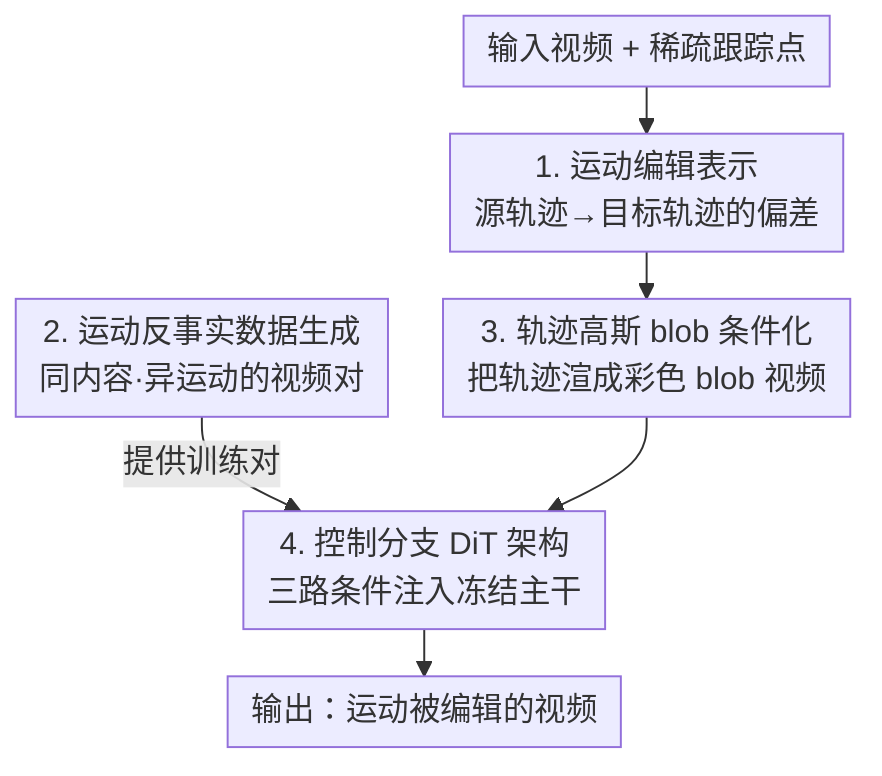

# MotionV2V: Editing Motion in a Video

**会议**: CVPR 2026  
**论文**: [CVF Open Access](https://openaccess.thecvf.com/content/CVPR2026/html/Burgert_MotionV2V_Editing_Motion_in_a_Video_CVPR_2026_paper.html)  
**代码**: 项目页 ryanndagreat.github.io/MotionV2V（论文中给出，未确认开源仓库）  
**领域**: 视频生成 / 视频编辑  
**关键词**: 视频运动编辑、稀疏轨迹、反事实数据、视频扩散、ControlNet 控制分支

## 一句话总结
MotionV2V 把"视频运动编辑"重新定义为"直接编辑从输入视频抽出的稀疏轨迹"——源轨迹与目标轨迹之间的偏差称为"运动编辑"（motion edit），再用一套自造的"运动反事实"视频对去微调一个带控制分支的视频扩散模型，使得在严格保留原视频未编辑内容的前提下，可以改物体运动、改相机、改时序，且能从任意帧开始编辑；4-way 用户研究中偏好率超 65%。

## 研究背景与动机
**领域现状**：生成式视频模型在保真度和时序一致性上已经很强，于是大量工作把"运动可控性"（motion controllability）当作增强 文本生成视频 / 图像动画 的手段。轨迹类方法用点轨迹精确控制物体路径，光流类方法用稠密对应做细粒度运动迁移。

**现有痛点**：这些方法本质上是"生成器"而非"编辑器"——它们从某张图或某段文本出发合成一段**全新**视频，而不是修改一段**已有**视频。具体表现为三类失败：(1) 图像到视频（I2V）方法如 ReVideo、Go-with-the-Flow 只能基于单帧生成，第一帧里看不到的区域全靠幻觉补全，而真正的视频编辑里这些区域是已知的、应当保持不变；ReVideo 想用 inpainting 把原视频信息补回来，但一旦有相机运动就彻底崩。(2) 人体专用方法（MotionFollower、MotionEditor）只能编辑全身人体动作，处理不了一般物体和场景。(3) ReCapture、ReCamMaster 这类只能编相机轨迹，改不了主体运动。

**核心矛盾**：外观编辑（换风格、保持运动结构）和运动编辑是两个根本不同的难度量级。改外观时输入输出帧之间的结构对应关系还在，DDIM inversion 之类的标准技术能用；但一旦改"物体怎么动"（比如让人换个方向走），输入输出之间的结构对应就被打破了，inversion 方法赖以成立的时序对齐假设直接失效。

**本文目标**：在一段用户提供的真实视频上做"通用运动编辑"——能改物体运动、能改相机、能改某个元素出现的时机、能在任意帧上动手，且未被编辑的内容要逐像素保住。

**切入角度**：与其条件化在单帧上去"重新生成"，不如**条件化在完整视频上**，并把编辑信号显式地表示成"运动的改变量"。用户给一段视频和一些稀疏跟踪点，系统自动把这些点在全视频里追踪，用户选择锚定（保持原运动）或修改（编辑轨迹）；模型学的是"从源轨迹到目标轨迹这个偏差怎么落到画面上"。

**核心 idea**：把"运动编辑"定义为源轨迹与目标轨迹之间的偏差（motion edit = 目标轨迹 − 源轨迹），配上一个强力视频扩散主干，就能统一支持物体/相机/时序/任意帧四类编辑。

## 方法详解

### 整体框架
MotionV2V 是一个 video-to-video（V2V）的运动编辑框架：输入是「一段真实视频 + 用户在物体上指定的稀疏跟踪点」，输出是「一段内容保持、运动按用户意图改变的新视频」。它把整个问题拆成三块：(1) 用"运动编辑"这一表示把用户意图编码成源/目标两套轨迹；(2) 因为现实中拿不到"同内容、异运动"的成对训练数据，作者造了一套**运动反事实（motion counterfactual）数据生成管线**来合成这种视频对；(3) 在预训练 T2V DiT 上加一个 **控制分支**，把反事实视频、源轨迹、目标轨迹三路条件注入冻结的主干，生成最终编辑结果。

下面这张图给出从"用户输入 + 训练数据"到"输出视频"的整体流向，四个贡献节点的顺序与后面「关键设计」一一对应：

### 关键设计

**1. 运动编辑表示：把"改运动"编码成稀疏轨迹的偏差**

针对的痛点是——直接在像素或外观上做编辑，一旦运动变了结构对应就断，标准 inversion 失效。作者改成在**稀疏轨迹**这个层面表达编辑：用户在想控制的物体上点几个跟踪点，系统用点追踪器在全视频追出源轨迹 $T_\text{src}$；用户把其中部分点的轨迹改成目标 $T_\text{tgt}$（锚定的点保持不变），二者之差就是"运动编辑"。这一表示天然统一了四种能力：**物体运动**（改某物体轨迹、背景轨迹锚定不动，比如把狗挪走但场景不变）；**相机控制**（估计一张动态 pointmap，用用户指定的相机内外参重投影到每一帧，再反解出每个点轨迹的偏差，从而改相机位置/焦距而保住场景内容，例如天鹅游动时水波纹在镜头平移下仍被保留）；**时序控制**（让某元素的轨迹脱离全局时间线，比如把鸭子的出现从第 2 秒推迟到第 5 秒，而背景按原时序走）；**任意帧编辑**（因为条件化在完整视频上，可以控制只在中段才出现的物体，如中途出现的 stop sign，这是只看首帧的 I2V 方法做不到的）。

**2. 运动反事实数据生成：自造"同内容、异运动"的视频对**

最大障碍是训练数据——现实里不存在"画面一样、运动不同"的成对视频。作者用一条系统化管线从原始视频 $V_\text{full}$（长 $F_\text{full}$ 帧）造出目标视频 $V_\text{target}$ 和反事实视频 $V_\text{cf}$。目标视频直接从原视频里截一段连续 $F$ 帧（起始帧 $f_\text{start}\sim\text{Uniform}(0, F_\text{full}-F)$），**保留真实视频**以保证模型朝着真实运动与外观去学。反事实视频则随机取起止帧 $f^\text{cf}_\text{start}, f^\text{cf}_\text{end}$，二选一地生成：**帧插值（Frame Interpolation）**——用首尾两帧条件化一个视频扩散模型生成 $F$ 帧新内容，配 LLM 生成的 prompt（如让走路的人"twirl 转个圈"），从而注入新运动；**时序重采样（Temporal Resampling）**——在 $f^\text{cf}_\text{start}$ 到 $f^\text{cf}_\text{end}$ 之间等距抽 $F$ 帧，制造速度变化、时间平移、甚至当 $f^\text{cf}_\text{start} > f^\text{cf}_\text{end}$ 时的倒放。接着建立点对应：随机撒 $N\sim\text{Uniform}(1,64)$ 个跟踪点，用双向点追踪器 TAPNext 在 $V_\text{full}$ 上追出目标轨迹 $T_\text{target}$，反事实轨迹 $T_\text{cf}$ 在重采样情形复用同一追踪结果、在插值情形先把对应帧替换成插值帧再追踪。最后做随机滑动裁剪、旋转、缩放等几何增强（轨迹点同步变换以保持对应），这些"人工移动裁剪"近似多视角视频并保证完美时序同步，给模型一个"在未指定时倾向于同步外观"的偏置。关键巧思是：**用直接匹配原视频的首尾帧来锚定反事实轨迹**，从而保证两套轨迹有可靠的点对应。

**3. 轨迹的高斯 blob 条件化：把稀疏点画成可被扩散模型吃下的视频**

模型不直接吃坐标，而是把轨迹**栅格化成彩色高斯 blob 视频**作为运动条件通道。模型条件化在三段视频上：反事实视频 $V_\text{cf}$、渲染后的反事实轨迹 $B_\text{cf}$、渲染后的目标轨迹 $B_\text{target}$，每段都是 $\mathbb{R}^{F\times 3\times H_\text{rgb}\times W_\text{rgb}}$。每个样本随机选 $N$ 种不同颜色，每个跟踪点在黑底上画成标准差 10 像素的高斯 blob，且**只在该点可见（未被遮挡）时才画**——可见性由点追踪器给出，这样 blob 的有无就编码了物体的出现/消失。作者试过类似 DiffusionAsShader 的表示，但发现点数太多又缺乏区分色会让控制信号变弱，所以用"少量、彩色、按可见性绘制"。训练时轨迹有 dropout，且**目标轨迹 $T_\text{target}$ 的 dropout 率高于条件轨迹 $T_\text{cf}$**，以提升鲁棒性、防止过拟合到特定运动模式；推理时把点对应数限制在约 20 个，因为给太多点模型反而跟不全。

**4. 控制分支 DiT 架构：ControlNet 式地把三路条件注入冻结主干**

基座是预训练的 文本到视频 DiT（CogVideoX-5B）。为了在不破坏主干生成能力的前提下注入运动与视频条件，作者**复制 DiT 的前 18 个 transformer block 作为控制分支**，通过零初始化 MLP 把控制分支的 token 加到主干对应 block 的 token 上——概念上等于把 ControlNet 搬到 DiT 上。受 DiffusionAsShader 启发但有关键区别：控制分支的 patchifier 要处理 $48 = 3\times 16$ 个输入通道（三段条件视频在 latent 空间各 16 通道）。所有视频输入用 3D Causal VAE 压成 latent（$C_\text{latent}=16$，$F_\text{latent}=\lfloor (F-1)/4\rfloor+1$，$H_\text{latent}=H_\text{rgb}/8$，$W_\text{latent}=W_\text{rgb}/8$）。**主干冻结、只训练控制分支**，用标准 L2 latent 扩散损失。作者特别指出这个任务比典型 ControlNet 更难：edge-to-image 这类 ControlNet 的输入（边缘图）和输出在空间上是对齐的，而这里输入（反事实视频 + 运动 blob）与输出在时空上并不同步，模型却仍能工作——作者推测是 transformer block 做了相当非平凡的工作来完成这种跨时空对齐。⚠️ 这一推测性解释以原文为准。

### 损失函数 / 训练策略
标准 latent 扩散训练，L2 损失。基座 CogVideoX-5B；在 8 张 H100 上训一周；$F=49$，输入分辨率 $480\times 720$（对应 latent $60\times 90$）；$N$ 在 1~64 间变化；学习率 $10^{-4}$；数据集 10 万视频，1.5 万次迭代，有效 batch size 32；内部视频数据集 50 万样本。反事实生成模型与 V2V 编辑模型都基于同一 CogVideoX-5B。

## 实验关键数据

### 主实验
在 4-way 用户研究里对比三个基线：ATI（基于 WAN 2.1 的轨迹引导 I2V，最强基线）、ReVideo、Go-with-the-Flow（GWTF）。手工制作 20 段测试视频，覆盖物体运动、相机变化、多元素复杂场景；41 名参与者就三个问题各选"最佳视频"。

| 问题 | Ours | ATI | ReVideo | GWTF |
|------|------|------|---------|------|
| Q1 内容保持 (↑) | 70% | 24% | 1% | 5% |
| Q2 运动符合 (↑) | 71% | 24% | 2% | 3% |
| Q3 整体编辑质量 (↑) | 69% | 25% | 1% | 5% |

三个问题上本文偏好率都在 ~70%，远超 ATI 的 ~25% 和 ReVideo/GWTF 的 <5%，说明在内容保持和运动控制上都明显占优。

定量评测用"光度重建误差"：构造 100 段测试视频，从中点切成 $V_0$、$V_1$，把 $V_1$ 时序反转得 $V_1'$ 保证 $V_0$ 末帧与 $V_1'$ 首帧衔接；选那些"中段才出现、首帧看不到内容"的网络视频（用 25 个点双向追踪、保留大量点在追到首/末帧时被遮挡的视频）。用 $V_0$ 作输入、$V_1$ 作目标，给本文和 ATI 相同的从 $V_1$ 抽出的轨迹，按逐帧 L2 衡量重建质量：$L_2 = \frac{1}{F}\sum_{i=1}^{F}\lVert I^\text{pred}_i - I^\text{target}_i\rVert_2^2$。

| 方法 | L2 (↓) | SSIM (↑) | LPIPS (↓) |
|------|--------|----------|-----------|
| Ours | 0.024 | 0.098 | 0.031 |
| ATI | 0.038 | 0.094 | 0.072 |
| Go-with-the-Flow | 0.067 | 0.089 | 0.088 |
| ReVideo | 0.096 | 0.080 | 0.106 |

本文在 L2 和 LPIPS 上显著更低、SSIM 最高，尤其在"内容不在首帧"的场景下重建更准，印证了"条件化在完整视频"比"首帧生成"更能保住内容。⚠️ 表中 SSIM 数值（0.098 等）偏低且量级异常，以原文为准。

### 消融实验
论文未给出标准的逐模块消融表，但在方法与讨论中给出了若干设计取舍的"对照"结论：

| 设计选择 | 现象 / 结论 | 说明 |
|----------|-------------|------|
| 轨迹表示：少量+彩色 blob vs. 类 DiffusionAsShader 表示 | 点太多且缺区分色 → 控制信号变弱 | 故采用少量、彩色、按可见性绘制 |
| 目标轨迹 dropout 率 高于 条件轨迹 | 提升鲁棒性、防过拟合特定运动 | 训练期非对称 dropout |
| 推理点数 限制约 20 | 点过多模型跟不全所有对应 | 推理期上限 |
| 条件化完整视频 vs. 仅首帧（I2V） | 完整视频能保住中段/离屏内容 | 见 Table 2 与 8 个定性案例 |

### 关键发现
- **"条件化完整视频"是制胜点**：8 个定性场景（移船+改相机露出山、抬啦啦队员手臂保住首帧没有的红绒球、控制只在末帧出现的骑车人、狗赛中差异化减速让 Corgi 逆转、给中途出现的白气球补正确颜色、天鹅 zoom-out、出租车 retiming、把离屏摩托车移到红车后）反复展示：I2V 只看首帧 → 离屏/中段内容只能幻觉，而 V2V 双向取内容能从任意帧拉取，从而正确处理离屏内容、相机变化、重排序。
- **可迭代编辑**：一次编辑的输出可作为下次编辑的输入，把复杂编辑（物体运动+相机变化）拆成多步逐个施加，反馈更即时、过程更可控；作者承认会有一定主体漂移，部分归因于基座视频模型质量。
- **跨时空不同步仍可控**：输入条件（视频+运动 blob）与输出在时空上不对齐，控制分支却仍能让模型完成对齐，作者推测 transformer block 做了非平凡工作。⚠️ 推测以原文为准。

## 亮点与洞察
- **把"编辑运动"还原成"编辑稀疏轨迹的偏差"**：这个表示一举把物体/相机/时序/任意帧四类编辑统一在同一接口下，且天然支持"锚定 vs 修改"的细粒度选择，无需手工 mask、可处理任意物体——是全文最干净的抽象。
- **反事实数据的造法很巧**：用首尾真实帧锚定来保证两套轨迹的点对应，再叠加几何增强近似多视角，解决了"现实拿不到同内容异运动视频对"这个根本数据难题；"帧插值 + 时序重采样"两条腿覆盖了新运动和速度/倒放变化。
- **用可见性驱动 blob 的有无**：把"物体何时出现/消失"编码进条件信号，使模型能控制元素出现时机和离屏内容，这是首帧方法结构上做不到的。
- **可迁移思路**：用"反事实成对数据 + ControlNet 式控制分支注入冻结大模型"的范式，可迁移到其他"想改某属性但保住其余内容"的编辑任务（如改光照、改物体姿态而保背景）。

## 局限与展望
- **迭代编辑会累积漂移**：作者承认多步链式编辑会出现主体漂移，部分受限于基座视频模型；称未来版本希望能"无限次"迭代。
- **推理点数受限**：超过约 20 个点对应模型就跟不全，复杂多物体场景的可控点数有上限。
- **依赖点追踪与 pointmap 质量**：源轨迹来自 TAPNext、相机控制依赖动态 pointmap 估计，追踪/重投影误差会传导到编辑结果。
- **基座与算力门槛**：基于 CogVideoX-5B、8×H100 训一周，复现成本不低；SSIM 等定量指标量级异常（⚠️ 以原文为准），定量协议主要围绕"重建已知目标"，对"开放式创意编辑"的质量量化仍较弱。

## 相关工作与启发
- **vs ATI / Go-with-the-Flow / MotionPrompting（轨迹引导 I2V）**：它们条件化在单帧上做"生成"，首帧外区域全靠幻觉；本文条件化完整视频做"编辑"，能保住离屏与中段内容——这是 Table 1/2 全面领先的根因。ATI 虽用了比 CogVideoX 更强的 WAN 2.1 基座，仍输给本文。
- **vs ReVideo（首帧保留 + inpainting）**：ReVideo 想把原视频信息 inpaint 回编辑结果，但相机一动、露出首帧没有的内容就崩；本文双向从任意帧取内容，天然处理相机运动。
- **vs MotionFollower / MotionEditor（人体专用运动编辑）**：它们只能编全身人体动作；本文通用于任意物体与场景。
- **vs ReCapture / ReCamMaster（相机轨迹编辑）**：它们只改相机、改不了主体运动；本文用统一的轨迹偏差表示同时支持主体与相机编辑。
- **vs DDIM inversion 类外观编辑**：外观编辑保结构、可用 inversion；运动编辑打破结构对应，inversion 失效——本文正是绕开 inversion、用反事实数据 + 控制分支直接学"运动改变量"。

## 评分
- 新颖性: ⭐⭐⭐⭐⭐ 首个面向已有视频的通用 V2V 运动编辑，"运动编辑=轨迹偏差"+反事实数据的组合很原创
- 实验充分度: ⭐⭐⭐⭐ 用户研究 + 重建定量 + 8 个定性案例较扎实，但缺标准逐模块消融、SSIM 量级存疑
- 写作质量: ⭐⭐⭐⭐ 动机与方法讲得清楚、案例丰富；个别定量表注记（"ATR"、SSIM 值）有瑕疵
- 价值: ⭐⭐⭐⭐⭐ 把 VFX 里需大量人力的运动改写降为"拖几个点"，应用面广、范式可迁移

<!-- RELATED:START -->

## 相关论文

- [\[CVPR 2026\] Generative Video Motion Editing with 3D Point Tracks](generative_video_motion_editing_with_3d_point_tracks.md)
- [\[CVPR 2026\] V-RGBX: Video Editing with Accurate Controls over Intrinsic Properties](v-rgbx_video_editing_with_accurate_controls_over_intrinsic_properties.md)
- [\[CVPR 2026\] WorldReel: 4D Video Generation with Consistent Geometry and Motion Modeling](worldreel_4d_video_generation_with_consistent_geometry_and_motion_modeling.md)
- [\[CVPR 2026\] 3D-Aware Implicit Motion Control for View-Adaptive Human Video Generation](3d-aware_implicit_motion_control_for_view-adaptive_human_video_generation.md)
- [\[CVPR 2026\] CamDirector: Towards Long-Term Coherent Video Trajectory Editing](camdirector_towards_long-term_coherent_video_trajectory_editing.md)

<!-- RELATED:END -->
