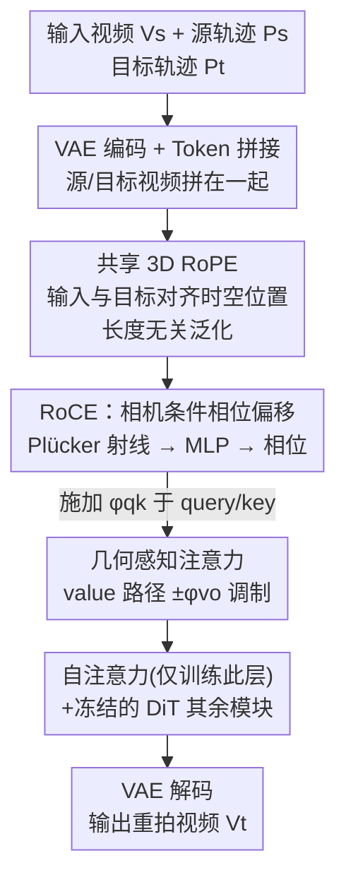

# ReDirector: Creating Any-Length Video Retakes with Rotary Camera Encoding

**会议**: CVPR 2026  
**论文**: [CVF Open Access](https://openaccess.thecvf.com/content/CVPR2026/html/Park_ReDirector_Creating_Any-Length_Video_Retakes_with_Rotary_Camera_Encoding_CVPR_2026_paper.html)  
**代码**: [项目页](https://byeongjun-park.github.io/ReDirector/)（未见开源代码）  
**领域**: 视频生成 / 相机可控视频  
**关键词**: 视频重拍, 相机控制, 旋转位置编码, RoPE, 几何感知注意力

## 一句话总结
ReDirector 把"相机参数"作为相位偏移注入视频扩散模型的 RoPE，对输入视频和目标重拍共享同一套 3D RoPE 来对齐时空位置，从而能对**任意长度、带剧烈相机运动**的视频做相机可控重拍（retake），在几何一致性、相机可控性和长序列泛化上显著超过此前的 warping 和隐式条件方法。

## 研究背景与动机
**领域现状**：视频重拍（video retake）指给定一段已有视频，沿一条新的目标相机轨迹重新"拍"出这段场景——可以拍出物理上拍不到的视角、稳定抖动的镜头，用于影视和虚拟制作。主流做法分两派：① **warping 派**（TrajectoryCrafter、CogNVS 等）先用视频深度估计 + 点追踪把每帧反投影成点云、再重投影到目标轨迹得到一个几何对齐的"代理帧"，最后让视频生成模型去精修和补洞；② **隐式条件派**（GCD、ReCamMaster）不显式 warp，而是把相机外参和输入视频 latent 直接拼接/相加进视频生成模型，靠大规模合成数据让模型自己内化多视角几何。

**现有痛点**：warping 派严重依赖外部几何估计器，一旦输入视频有动态相机运动或复杂结构，深度/追踪就退化，warping 伪影会直接灌进生成模型且无法被纠正；而且逐帧 warping 破坏了动态物体与静态背景的解耦。隐式派则对训练数据分布极度敏感，且通常只编码**目标**相机外参、对输入视频只用绝对位置编码或 3D RoPE 的部分轴——这逼着它们**假设输入是固定长度、相机运动很小**，一旦超出这个范围（更长的视频、更剧烈的运动）质量迅速崩。

**核心矛盾**：两派都没能把"输入视频"和"目标轨迹"这两路控制信号在**长度无关**的前提下无缝整合起来。真正的开放难题是：如何在变长输入 + 动态相机下，编码出输入视频与目标视频之间、以及沿各自相机轨迹的多视角关系。

**核心 idea**：作者发现 RoPE 这种相对位置编码天生能跨序列长度泛化，于是**对输入和目标视频用同一套 3D RoPE** 来对齐它们的时空位置（修正了前人"误用 RoPE"的问题），再把相机条件当作**物理接地的位置信号**以相位偏移的形式注入 RoPE——即提出的 Rotary Camera Encoding (RoCE)：用相机参数生成一个可学习的相位偏移，强化同一物理位置在不同视角间的注意力，从而在变长、动态相机下实现多视角一致的重拍。

## 方法详解

### 整体框架
ReDirector 在预训练的相机可控图生视频模型 Wan-I2V-CamCtrl 上微调，把它改造成视频生视频模型。输入是源视频 $V_s$、源相机轨迹 $P_s$（训练时来自数据集，推理时用 ViPE 估计）和目标相机轨迹 $P_t$，输出是沿 $P_t$ 重拍的视频 $V_t$。源视频和目标视频被 VAE 编码后在 token 轴上拼接，共享同一套 3D RoPE 编码时空位置；相机条件以 Plücker 射线的形式经 MLP 转成相位偏移注入自注意力。遵循 ReCamMaster，训练时**只更新自注意力层**，其余模块（交叉注意力、FFN、VAE）全部冻结。RoCE 模块插在自注意力里，产出两组相位偏移：一组施加在 query/key 上提供相机接地的位置编码，另一组调制 value 路径实现几何感知注意力。

### 关键设计

**1. 共享 3D RoPE：修正前人对位置编码的误用，换来长度无关泛化**

前人方法对输入视频的位置编码用得很"残废"——要么用绝对位置编码，要么只用 3D RoPE 的部分轴，这直接把模型钉死在固定长度输入上。作者的修正很简单也很关键：让输入视频和目标视频**共用同一套 3D RoPE 旋转矩阵** $\mathbf{R}=[\mathbf{R}_t,\mathbf{R}_s]$，且 $\mathbf{R}_t=\mathbf{R}_s$。3D RoPE 由帧、高、宽三个轴的复旋转矩阵经 Kronecker 积和通道拼接构成，$\mathbf{R}=\tilde{\mathbf{R}}_f\oplus\tilde{\mathbf{R}}_h\oplus\tilde{\mathbf{R}}_w$，每个元素 $R(n,c)=e^{i\theta_c n}$，频率 $\theta_c=10000^{-\frac{c-1}{d_{head}/2}}$ 指数衰减。因为 RoPE 编码的是**相对**位置（注意力矩阵里出现的是 $e^{i\theta_c(n-m)}$，只依赖 $n-m$），所以它天然跨序列长度泛化。把相同的 RoPE 索引同时贴到输入和目标 token 上，等于告诉模型"这两个 token 处在紧密对齐的同一时空位置"，从而即使训练时没见过更长的序列，推理时也能稳定泛化到上百帧。这一步配合用 Plücker 射线做 token 级相机编码，是后面 RoCE 的地基。

**2. Rotary Camera Encoding (RoCE)：把相机参数变成 RoPE 的相位偏移**

光对齐时空位置还不够——共享 RoPE 让输入和目标在相同索引处"看起来一样"，但模型需要在相同位置上**区分**输入视角和目标视角的几何差异。RoCE 的做法是再叠一层由相机决定的相位偏移：在每个 DiT Block 用 MLP 把 Plücker 射线 token $\mathbf{c}=[c_t,c_s]$ 映射成相位 $\boldsymbol{\phi}_{qk}=[\mathbf{0},\text{MLP}_{qk}(\mathbf{c})]$，其中前 $d_{head}/6$ 维强制置零、不干扰时间轴位置。然后构造可学习的相机旋转矩阵 $\tilde{\mathbf{R}}_{qk}=e^{i\boldsymbol{\phi}_{qk}}$，叠加到 query/key 上：$\bar{q}'=\bar{q}\circ\mathbf{R}\circ\tilde{\mathbf{R}}_{qk}$。于是注意力矩阵变为

$$\mathbf{A}'_{(n,m)}=\text{Re}\big[\bar{q}_n(\bar{k}_m^*\circ e^{i(\theta_c(n-m)+\phi_{qk}(n,c)-\phi_{qk}(m,c))})\big].$$

关键在于 RoCE **初始化为零相位**，训练开始时完全不施加相机条件，再在微调中逐渐学到非零相位，保证相机信号稳定地"渗"进来而不破坏预训练。作者观察到（图 3）纯由相位偏移构成的注意力在单帧内行为类似 RoPE，但对**相对位姿差异更敏感**，会大幅抑制远视角之间的注意力——这正好让模型把时间上相隔很远、但物理上对应同一背景区域的 token 对齐起来，从而在长时间跨度上保持背景一致。相比把相机外参简单 concat/add 进 latent 的隐式派，用复数域的相位偏移注入是更"原生"的相机编码方式。

**3. 几何感知注意力：在 value 路径上做 SO(2) 相位往返，免去从头训练**

近期的几何感知注意力（GTA、PRoPE 等）把显式几何变换塞进注意力层，但它们都是在静态场景上从头训练的，不适合拿来微调一个已经预训练好的视频生成模型。ReDirector 用相机条件的相位偏移替代了这些显式几何变换：再生成一组相位 $\boldsymbol{\phi}_{vo}$、对应旋转矩阵 $\tilde{\mathbf{R}}_{vo}=e^{i\boldsymbol{\phi}_{vo}}$，作用在 value 上做一次"先逆旋转、聚合后再正旋转"的往返：

$$\bar{o}'=\Big(\mathbf{A}'\big(\underbrace{\bar{v}\circ\tilde{\mathbf{R}}_{vo}^{-1}}_{\bar{v}'}\big)\Big)\circ\tilde{\mathbf{R}}_{vo}.$$

即在注意力加权**之前**对 value 施加 $-\phi_{vo}$、在 value 聚合**之后**施加 $+\phi_{vo}$。利用相位偏移的 SO(2) 性质，这等价于一个可学习的几何感知注意力（类似 GTA），但能直接用于微调视频生成模型，而不必从头训练。它带来的额外好处是**动态物体与静态背景的解耦**更好：静态区域的 token 在视角变换下保持多视角一致，而运动物体的 token 会打破这种一致性，模型据此自然地把两者分开，得到几何上更可信的重拍。

### 损失函数 / 训练策略
采用 rectified flow + 条件流匹配损失训练。定义噪声分布 $p_1\sim\mathcal{N}(0,I)$、数据分布（目标视频）$p_0$，用 ODE $\mathrm{d}z_t=u_\theta(z_t,t)\mathrm{d}t$ 和插值 $z_t=tz_1+(1-t)z_0$ 建立映射，损失为

$$\mathcal{L}_{\text{CFM}}=\mathbb{E}_{t,p_0,p_1}\big[\|(z_1-z_0)-u_\theta(z_t,t)\|^2\big].$$

推理时从 $t=1$ 积分到 $t=0$ 解 ODE 生成重拍。两个增强训练策略：① 加入**恒等重拍对**（输入与目标共享同一轨迹 $\{V_s,P_s\}=\{V_t,P_t\}$），鼓励模型学到"对应同一 RoPE/RoCE 的 token 之间"更紧的对齐；② **时间反转增强**，把视频倒放以暴露更多样的相机轨迹，使模型即便在首帧也能从其他视角生成重拍。

## 实验关键数据

### 主实验
在 DAVIS 数据集 50 段视频 × ReCamMaster 的 10 条目标轨迹（共 500 个测试用例）上评测，视频长度从几十帧到约 100 帧。指标含 VBench 视觉质量、Dyn-MEt3R（重拍几何一致性）、逐帧 MEt3R（与输入视频一致性）、TransErr/RotErr（相对平移/旋转误差）。

| 方法 | Dyn-MEt3R↑ | MEt3R↓ | TransErr↓ | RotErr↓ | Imaging Quality↑ |
|------|-----------|--------|-----------|---------|------------------|
| GCD | 0.6898 | 0.4438 | 0.1062 | 22.853 | 0.9639 |
| ReCamMaster | 0.7857 | 0.3472 | 0.0292 | 2.347 | 0.9881 |
| TrajectoryCrafter | 0.7338 | 0.3272 | 0.0697 | 9.115 | 0.9727 |
| CogNVS | 0.6845 | 0.4036 | 0.0768 | 10.878 | 0.9721 |
| **Ours (ReDirector)** | **0.8477** | **0.3073** | **0.0165** | **1.666** | 0.9867 |

几何一致性（Dyn-MEt3R 0.6898→0.8477）和相机精度（RotErr 2.347→1.666、TransErr 0.0292→0.0165）提升最大。部分视觉质量指标（如美学/背景一致性）略低，作者解释是 ReDirector 在相同相机运动下探索了更大的场景尺度，而相机运动更温和的方法天然在"背景一致/运动平滑"这类指标上占便宜。

iPhone 数据集上的长序列泛化（novel view synthesis，OOD 轨迹/长度/分辨率）：

| 方法 | 81f PSNR↑ | 81f LPIPS↓ | 161f PSNR↑ | 161f LPIPS↓ | 241f PSNR↑ | 241f LPIPS↓ |
|------|-----------|-----------|------------|-------------|------------|-------------|
| ReCamMaster | 10.69 | 0.678 | 10.03 | 0.762 | 10.37 | 0.772 |
| CogNVS† | 10.56 | 0.720 | 10.63 | 0.741 | 10.81 | 0.720 |
| **Ours** | **10.82** | **0.655** | **11.56** | **0.631** | **11.85** | **0.611** |

ReDirector 不依赖 LiDAR 深度或外部几何模型，且随输入视频变长**性能反而稳步提升**（241 帧 PSNR 11.85），而所有前人方法在长视频上严重退化。

### 消融实验
逐步加入各组件（DAVIS）：

| 配置 | Shared RoPE | Dyn-MEt3R↑ | MEt3R↓ | TransErr↓ | RotErr↓ |
|------|:--:|-----------|--------|-----------|---------|
| ReCamMaster (Wan2.1-T2V, Addition) | ✗ | 0.7857 | 0.3472 | 0.0292 | 2.347 |
| + I2V-CamCtrl backbone (Addition) | ✗ | 0.8339 | 0.3308 | 0.0243 | 2.291 |
| + 共享 RoPE (Addition) | ✓ | 0.8378 | 0.3159 | 0.0202 | 1.975 |
| + RoCE (w/o GTA) | ✓ | 0.8341 | 0.3164 | 0.0193 | 1.897 |
| **+ 几何感知注意力 (Full)** | ✓ | **0.8477** | **0.3073** | **0.0165** | **1.666** |

训练迭代消融：20K→50K 步，Dyn-MEt3R 0.8477→0.8491、RotErr 1.666→1.521，几何一致性和相机精度持续提升，说明模型纯靠数据逐渐内化多视角几何。

### 关键发现
- **共享 3D RoPE 贡献最显著**：从 ReCamMaster baseline 加上共享 RoPE，Dyn-MEt3R 从 0.7857 一路提到 0.8378、RotErr 从 2.347 降到 1.975，证明输入与目标的紧对齐 + 位置编码的正确整合是关键。
- **RoCE 改善粗对齐但单独用会拖累细粒度几何一致性**：换成 RoCE 后视觉质量和相机精度（TransErr/RotErr）继续涨，但 Dyn-MEt3R 反而从 0.8378 微降到 0.8341——说明相位偏移擅长粗对齐却还撑不住细节级多视角一致；必须叠上几何感知注意力（GTA）才把 Dyn-MEt3R 拉到最高 0.8477。
- **长序列越长越强**：与"前人方法在长视频上崩"形成鲜明对比，ReDirector 利用"更长输入覆盖更大场景"的特性反而重建出更多区域、恢复出更贴近真值的场景尺度。

## 亮点与洞察
- **把相机条件当"位置编码"而非"额外通道"是核心洞察**：相机参数本质是物理接地的位置信息，token 索引编码不了它。作者不去 concat/add 相机外参，而是把它转成 RoPE 的相位偏移，既继承了 RoPE 的长度无关泛化，又用复数旋转自然表达视角间的几何关系——这个视角迁移性很强，可推广到任何用 RoPE 的多视角/多模态生成任务。
- **零相位初始化是让相机信号"稳进来"的关键 trick**：RoCE 初始化为零相位等于训练初期完全是原始 RoPE，再渐进学到非零相位，避免微调一开始就破坏预训练权重。这种"从恒等映射出发渐进引入新条件"的思路，对微调大生成模型普遍适用。
- **value 路径的 SO(2) 相位往返把"从头训练的几何注意力"改造成"可微调"版本**：先逆旋转 value、聚合后再正旋转，等价实现了 GTA 式几何感知注意力但兼容预训练模型，绕开了此前几何注意力必须 from-scratch 训练的限制。
- **副产品：动态/静态解耦**：因为静态背景 token 在视角变换下保持多视角一致、动态物体 token 会破坏这种一致，几何感知注意力天然把动态物体从背景中分出来，无需额外的分割/mask 监督。

## 局限与展望
- **依赖输入相机位姿估计**：推理时源视频轨迹由 ViPE 估计，评测的 TransErr/RotErr 也用 ViPE 估计位姿来算，若位姿估计在极端动态场景失准会传导进重拍质量与评测。
- **视觉质量指标有取舍**：ReDirector 在美学/背景一致性等指标上不及温和运动的方法，作者归因于"探索更大场景尺度"，但这也意味着在需要保守、稳定输出的场景下未必最优。
- **训练成本不低**：81 帧、480×832、20K 步要在 8 张 RTX Pro 6000 上训约 90 小时；且全部训练视频固定 81 帧，长序列能力靠 RoPE 外推得到而非直接训练，长度泛化的上限仍需更多验证。
- **绑定特定 backbone**：方法在 Wan-I2V-CamCtrl 上实现并只训自注意力层，迁移到其他视频扩散架构（非 RoPE 或不同注意力结构）需要重新设计相位注入点。

## 相关工作与启发
- **vs warping 派（TrajectoryCrafter / CogNVS）**：它们显式估深度→反投影点云→重投影→生成模型精修，依赖外部几何估计器，动态相机下 warping 伪影直接污染输出且破坏动静解耦；ReDirector 完全隐式、无 warping，把几何编进 RoPE 相位，在动态场景和长序列上更鲁棒（iPhone 241 帧 PSNR 11.85 vs CogNVS 10.81）。
- **vs 隐式条件派（GCD / ReCamMaster）**：它们靠大规模合成数据 + concat/add 相机外参，只编码目标外参、对输入用残缺位置编码，假设固定长度小运动；ReDirector 用共享 RoPE + Plücker 射线 token 级编码 + RoCE 相位偏移，把输入/目标两路信号无缝整合，OOD 轨迹/长度/分辨率泛化更强。本文正是直接构建在 ReCamMaster 的训练设置（只训自注意力、MultiCamVideo 数据）之上做的改进。
- **vs 几何感知注意力（GTA / PRoPE）**：这些方法在静态场景从头训练显式几何变换，不适合微调视频生成模型；ReDirector 用相机条件相位偏移替代显式变换，把几何感知能力以可微调形式注入注意力层。

## 评分
- 新颖性: ⭐⭐⭐⭐⭐ 把相机条件作为 RoPE 相位偏移注入、配合 value 路径 SO(2) 往返实现可微调几何感知注意力，视角独到。
- 实验充分度: ⭐⭐⭐⭐ DAVIS + iPhone 两数据集、4 个 baseline、逐组件消融 + 训练迭代消融较完整；但仅 80 帧固定训练、长度泛化样本偏少。
- 写作质量: ⭐⭐⭐⭐ 动机（"修正 RoPE 误用"）和方法推导清晰，公式排版在 CVF 抽取版略乱但逻辑自洽。
- 价值: ⭐⭐⭐⭐ 相机可控视频重拍是影视/虚拟制作刚需，长序列鲁棒 + 无需外部几何模型很实用。

<!-- RELATED:START -->

## 相关论文

- [\[CVPR 2026\] Unified Camera Positional Encoding for Controlled Video Generation](unified_camera_positional_encoding_for_controlled_video_generation.md)
- [\[ICCV 2025\] SteerX: Creating Any Camera-Free 3D and 4D Scenes with Geometric Steering](../../ICCV2025/video_generation/steerx_creating_any_camera-free_3d_and_4d_scenes_with_geometric_steering.md)
- [\[CVPR 2026\] FaceCam: Portrait Video Camera Control via Scale-Aware Conditioning](facecam_portrait_video_camera_control_via_scale-aware_conditioning.md)
- [\[CVPR 2026\] SymphoMotion: Joint Control of Camera Motion and Object Dynamics for Coherent Video Generation](symphomotion_joint_control_of_camera_motion_and_object_dynamics_for_coherent_vid.md)
- [\[CVPR 2026\] AnyID: Ultra-Fidelity Universal Identity-Preserving Video Generation from Any Visual References](anyid_ultra-fidelity_universal_identity-preserving_video_generation_from_any_vis.md)

<!-- RELATED:END -->
