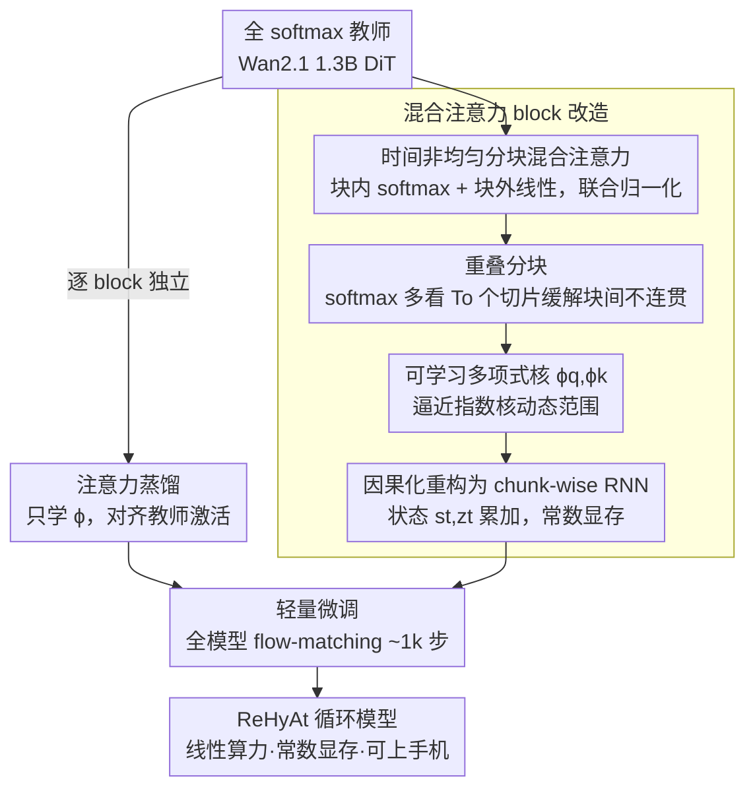

# ReHyAt: Recurrent Hybrid Attention for Video Diffusion Transformers

**会议**: CVPR 2026  
**论文**: [CVF Open Access](https://openaccess.thecvf.com/content/CVPR2026/html/Ghafoorian_ReHyAt_Recurrent_Hybrid_Attention_for_Video_Diffusion_Transformers_CVPR_2026_paper.html)  
**代码**: 无  
**领域**: 视频生成 / 扩散模型 / 高效注意力  
**关键词**: 视频扩散, 线性注意力, 混合注意力, 循环重构, 注意力蒸馏

## 一句话总结
ReHyAt 把视频扩散 Transformer 里 $O(N^2)$ 的全 softmax 注意力，改造成「块内 softmax + 块外线性」的时间分块混合注意力，再因果化重构成 chunk-wise RNN（常数显存、线性算力），并用「注意力蒸馏 + 轻量微调」两阶段流程在约 160 GPU 小时内把 Wan2.1 1.3B 转成等质量、可上手机、能生成长视频的循环模型。

## 研究背景与动机
**领域现状**：当下最强的视频生成模型（Wan2.1、CogVideoX、HunyuanVideo、Open-Sora Plan 等）几乎都从 U-Net 转向了 Diffusion Transformer（DiT），把视频当成时空 patch 序列、从第一层就拿到全局上下文，质量和可扩展性都更好。

**现有痛点**：DiT 的自注意力对序列长度是二次复杂度——时间 $O(N^2 d)$、显存 $O(N^2)$。视频的 token 数 $N$ 是「时间长度 × 空间 patch 数」的乘积，哪怕中等分辨率、中等时长都会轻松到几万 token，注意力吃掉了 DiT block 里绝大部分算力。FlashAttention 这类 IO 优化只压常数、不改 $N^2$ 的本质依赖，结果就是超过约 10 秒的视频在常规 GPU 显存/延迟预算下都很吃力，手机端连几秒都难。

**核心矛盾**：线性注意力能把复杂度降到线性、并能在因果化后重构成 RNN（显存常数），天然适配「一段一段往下生成长视频」的场景；但它的核函数表达力远不如 softmax 的指数核，激活多样性下降、细粒度依赖建模弱，往往要大规模重训才能勉强可用。已有的混合注意力（如 Attention Surgery）虽然质量提上来了，却仍是二次复杂度、无法重构成 RNN——质量和「线性+常数显存」这两件事一直没能同时拿到。

**本文目标**：① 设计一种既保留 softmax 高保真、又能享受线性算力和常数显存的注意力；② 不从零训练，而是把现成的 SOTA 全 softmax 双向模型「蒸馏」成这种高效循环形式，把训练成本压到几百 GPU 小时级别。

**切入角度**：作者的关键观察是——视频里真正需要高保真 softmax 来建模的，是**局部、相邻帧之间高度互相依赖**的那一小撮 token；其余长程依赖用线性注意力近似就够了。于是不必对所有 token 一视同仁，可以在时间维上做**非均匀**的注意力分配。

**核心 idea**：把序列按时间切成块，**块内用 softmax、块外用线性**，两者联合归一化；再让块之间在时间上解耦，就能因果化成一个 chunk-wise RNN，做到线性算力 + 常数显存；最后用蒸馏把 Wan2.1 的 softmax 依赖迁移进线性核里，几乎不掉质量。

## 方法详解

### 整体框架
ReHyAt 不是从头训一个新模型，而是给一个现成的双向全 softmax 教师（Wan2.1 1.3B）做「注意力外科手术」。输入是教师模型的若干 DiT block，输出是把其中一部分 block（15/20/25 个，共 30 个）换成循环混合注意力后的学生模型。整条管线分两步走：先做**注意力蒸馏**——逐 block 独立训练，只学每个 block 的线性核特征映射 $\phi_q,\phi_k$，让混合注意力的输出去对齐教师 softmax 注意力的激活；再做**轻量微调**——把整个 DiT 在少量 prompt/视频对上用 flow-matching 目标跑约 1k 步，把蒸馏阶段「逐块独立」导致的块间过渡瑕疵补回来。采样时把训练好的因果模型重排成 chunk-wise RNN，一次生成一个时间块（$T_c$ 个时间切片），显存恒定。

混合注意力本身的核心是怎么切块、怎么分配 softmax/线性、怎么因果化：

### 关键设计

**1. 时间非均匀分块的混合注意力：用最小代价保住局部高保真**

纯线性注意力建模细粒度依赖弱，纯 softmax 又太贵——ReHyAt 的办法是在时间维上把 token 切成块，对不同 token「区别对待」。把 $N=THW$ 个 token 按时间重排成 $T'$ 个块、每块 $N'=T_c HW$ 个 token。对第 $t$ 块的 query，把要 attend 的全体 token 划成两类：同块内的 token 集 $\mathcal{T}^S_t=\{j\mid tN'\le j<(t{+}1)N'\}$ 走 **softmax**，块外其余 token $\mathcal{T}^L_t=\mathcal{T}-\mathcal{T}^S_t$ 走**线性**。两路输出各自带分子/分母，**联合归一化**：

$$\hat{y}_t=\frac{a^S_t+a^L_t}{n^S_t+n^L_t}$$

其中 softmax 分支 $a^S_t=\sum_{j\in\mathcal{T}^S_t}\exp(Q_t k_j^\top/\sqrt{D}-c_t)v_j$ 是带稳定常数 $c_t$ 的标准指数核；线性分支 $a^L_t=\phi_q(Q_t)\big(\sum_{j\in\mathcal{T}^L_t}\phi_k(k_j)v_j^\top\big)$ 把求和项提到 query 外面、得以缓存复用。这种「时间上非均匀」的分配是相对 Attention Surgery「时间均匀混合」的关键区别：它给了视频生成更合适的归纳偏置——把昂贵的 softmax 集中花在同一时间块（局部高度互依赖）的 token 上，其余全交给线性，整体复杂度降到线性。

**2. 重叠分块：让相邻块的运动和外观不"断片"**

非重叠切块有个副作用：块与块衔接处，由于块外只有线性注意力这种低保真建模，运动或外观会出现「episodic incoherence」——一段一段之间像是接不上。ReHyAt 的修法很直接：让 softmax 分支的 key/value 多覆盖前一块的 $T_o$ 个时间切片，即 query 仍按 $T_c$ 切，但被 attend 的 token 按 $T_c+T_o$ 切，softmax 集合改写为 $\mathcal{T}^S_t=\{j\mid \max(tN'-T_oHW,0)\le j<(t{+}1)N'\}$。这样块边界处也由高保真 softmax 来「传话」，跨块的 message passing 更准。消融里 $T_o$ 从 0 提到 1，subject consistency 从 90.90 跳到 92.05，正是块间时间连贯性变好的直接证据。

**3. 可学习多项式核特征映射 ϕ：补上线性注意力的表达力短板**

线性注意力的根本短板是核函数 $\phi(q)\phi(k)^\top$ 表达力不如指数核 $e^{qk^\top}$，原始 $\phi(x)=1+\mathrm{elu}(x)$ 这种固定映射动态范围太小。ReHyAt 给 $\phi_q,\phi_k:\mathbb{R}^D\to\mathbb{R}^{D'}$ 设计成**可学习且带多项式展开**：先用一个轻量 per-head 嵌入网络（分组 $1\times1$ 卷积 + 非线性）算出中间表示，再切成 $P$ 等份，第 $i$ 份升到 $i$ 次多项式后拼接：

$$\phi(x)=\big[(\psi_1(x))^1,(\psi_2(x))^2,\dots,(\psi_P(x))^P\big]^\top$$

不同次幂的多项式特征叠加，能更好地逼近指数核那种很大的动态范围，从而让线性分支也能较准地还原 softmax 依赖。实验发现一个 2 层 MLP + degree-2 多项式就够，每个被转换的 block 只多约 2.4M 参数。

**4. 因果化重构为 chunk-wise RNN：常数显存才是上长视频/上手机的关键**

光有混合注意力还不够，要做到「常数显存 + 任意长视频」必须能重构成 RNN，而这要求注意力是因果的。ReHyAt 把线性分支进一步限制为只看更早的块 $\mathcal{T}^L_t=\{j\mid j<\max(tN'-T_oHW,0)\}$（去掉前瞻的非因果线性注意力），softmax 仍只在当前块内（块内无需因果，因为采样是整块一次性生成）。于是块外线性贡献可以写成沿块递推的状态变量 $s_t\in\mathbb{R}^{D'\times D}$、$z_t\in\mathbb{R}^{D'\times1}$：

$$y_t=\frac{a^S_t+\phi_q(Q_t)s_t}{n^S_t+\phi_q(Q_t)z_t},\quad s_{t+1}=s_t+\sum_{j\in\mathcal{T}^S_t}\phi_k(k_j)v_j^\top,\quad z_{t+1}=z_t+\sum_{j\in\mathcal{T}^S_t}\phi_k(k_j)$$

状态只是「不断累加历史块的 $\phi_k v^\top$」，所以算力随视频时长 $O(N)$ 线性、而 peak 显存恒定。值得注意的是，训练可以用非递归的因果形式做，采样时再重排成 RNN，两者等价。消融（Table 8）显示去掉非因果依赖后 VBench 几乎不变（82.27→82.35），省的算力也不多——因果化真正的价值不在省算力，而在解锁了 RNN 这种「常数 peak 显存」的采样形式，这才是能在手机上生成 >10 秒视频的根本。

**5. 两阶段训练：蒸馏 + 微调，把百万 GPU 时的教师"压缩"进几百 GPU 时**

从头训 SOTA 视频扩散模型成本高到离谱，ReHyAt 的策略是蒸馏现成教师。**第一阶段·注意力蒸馏**：逐 block 独立训练，每个 block 只放开 $\phi_q,\phi_k$ 两组参数，让学生混合注意力的输出去匹配教师 softmax 的激活，目标是

$$\phi_l\leftarrow\phi_l-\eta\nabla_{\phi_l}\Big(\mathbb{E}_{\epsilon,p,i}\,\lVert y_{(l,\epsilon,p,i)}-\hat{y}_{(l,\epsilon,p,i)}\rVert\Big)$$

对不同 prompt $p$、噪声 $\epsilon$、去噪步 $i$ 对齐——这一步**不需要任何 prompt/视频配对数据**，只要能跑教师拿到激活即可。**第二阶段·轻量微调**：逐块独立蒸馏会让块间过渡（尤其衔接平滑度）不够好，于是在少量 prompt/视频对上、用标准 flow-matching 目标把整个 DiT 微调约 1k 步，把丢掉的生成质量补回来。整套流程把转换成本压到约 160 H100 GPU 小时——不到 SANA-Video 的 1%、不到 MovieGen 的 0.01%。

### 损失函数 / 训练策略
- **蒸馏损失**：逐 block 的激活匹配 L1/范数误差（式 19），只优化 $\phi_q,\phi_k$，无需配对数据。
- **微调损失**：整模型标准 flow-matching 目标，约 1k 步。
- **数据**：低分辨率微调用 Open-Sora Plan 的 350K 子集；高分辨率用 Wan2.1 14B 合成的 22K 视频。
- **关键超参**：转换 block 数 ∈{15,20,25}，块大小 $T_c\in\{1,2,3,5,7\}$，重叠 $T_o\in\{0,1,2,3\}$；$\phi$ 用 2 层 MLP + degree-2 多项式，每块 +约 2.4M 参数。

## 实验关键数据

### 主实验
基于 Wan2.1 1.3B 蒸馏，在 VBench / VBench-2.0 上对比 SOTA 高效视频扩散模型（原始 $81\times480\times832$ 分辨率/时长）。

| 模型 | 参数级 | VBench Total↑ | Quality↑ | Semantic↑ |
|------|--------|---------------|----------|-----------|
| Wan2.1 1.3B（教师） | ≤2B | 83.31 | 85.23 | 75.65 |
| SANA-Video | 线性/混合 | 83.71 | 84.35 | **81.35** |
| Attention Surgery (15×R2) | 混合(二次) | 83.21 | 85.19 | 75.25 |
| M4V（蒸 Mamba） | 线性 | 81.91 | 83.36 | 76.10 |
| **ReHyAt 15×($T_c{=}3,T_o{=}1$)** | 循环混合 | **83.79** | 84.57 | 80.70 |

ReHyAt 的 VBench Total 反超教师（83.79 vs 83.10 复现值）与 SANA-Video，且是其中唯一能重构成 RNN 上手机的。训练只花约 160 GPU 时（<SANA-Video 的 1%）。

VBench-2.0 上 ReHyAt 15×$T_c{=}5$ 取得 56.3 Total，优于 Wan2.1 1.3B（56.0）和 CogVideoX-1.5 5B（53.4）。人类偏好研究（500 对盲评）显示与原始 Wan2.1 无显著差异（27.6% 选 ReHyAt / 43.5% 无偏好 / 29.0% 选 Wan2.1）。

效率方面：5s 视频上 ReHyAt 相对 FlashAttention 省最多约 $4\times$ FLOPs；手机端（Snapdragon8-Gen4）121 帧时延迟比 FlashAttention 快约 $16\times$、总读写显存省约 $11\times$，且是唯一能稳定扩到 >10s 不 OOM 的方案。

### 消融实验

| 配置 | VBench Total | 说明 |
|------|-------------|------|
| $T_c{=}1$ | 80.97 | 块内 softmax 退化为纯空间 |
| $T_c{=}2$ | 82.08 | softmax 从空间扩到时空，提升最大 |
| $T_c{=}3$ | 82.17 | 继续增大收益递减 |
| $T_c{=}5$ | 82.48 | 质量更高但算力更大 |
| $T_o{=}0$ | 81.56 / Subj.Cons. 90.90 | 无重叠，块间易断片 |
| $T_o{=}1$ | 82.17 / Subj.Cons. 92.05 | 开重叠后一致性显著跳升 |
| 非因果 | 82.27 | VBench 与因果几乎持平 |
| 因果 | 82.35 | 质量不掉，且解锁 RNN/常数显存 |

### 关键发现
- **块大小 $T_c$**：从 1 到 2 提升最大（softmax 由纯空间扩展到时空），之后收益递减——说明「相邻帧的高保真互依赖」是 softmax 最该花力气的地方。
- **重叠 $T_o$**：0→1 时 Total 和 subject consistency 都明显跳升，之后饱和；重叠是压制块间时间不连贯的关键机制。
- **因果化**：几乎不损质量、省算力也有限，但它是 RNN 重构（常数 peak 显存、上手机生成长视频）的前提——这才是它真正的价值所在。

## 亮点与洞察
- **「时间非均匀」是核心洞察**：不对所有 token 一视同仁，把昂贵的 softmax 精准花在同一时间块的强互依赖 token 上，其余全用线性——这比 Attention Surgery 的「时间均匀混合」给视频更对路的归纳偏置，且同时拿到线性复杂度。
- **「蒸馏而非重训」把成本降两个数量级**：注意力蒸馏阶段只学 $\phi$、且**无需配对数据**，保留教师的 block 结构，使得把百万 GPU 时的 SOTA 模型转成高效 RNN 只要约 160 GPU 时——这套「低成本改造现成 SOTA」的配方可复用到未来的双向 softmax 模型。
- **因果化的真实动机讲得很清醒**：作者直说因果化省算力不多、也不掉质量，真正图的是 RNN 形式带来的常数 peak 显存——这是上手机、生成长视频的硬门槛，避免了「为因果而因果」的误导。

## 局限与展望
- 作者承认：即便整体很强，最高效的变体仍有少量视频出现时间不连贯，是未来改进点。
- 自己观察：主要在 Wan2.1 1.3B 这一个教师上验证，配方对更大模型/其他架构的迁移性还需更多实证；30 个 block 只转 15-25 个，剩余 block 仍是全 softmax，端到端复杂度受未转换部分牵制。
- VBench-2.0 上相对最强大模型仍有小幅落差；蒸馏依赖能跑教师拿激活，对完全闭源教师不适用。
- 改进思路：把转换比例推到接近全部 block、或在蒸馏阶段就联合考虑块间过渡，可能进一步压掉残留的时间不连贯。

## 相关工作与启发
- **vs SANA-Video**：同为视频高效注意力，但 SANA-Video 是纯线性、从零训练（12 天 64×H100）；ReHyAt 是混合（线性管长程 + softmax 管相邻强依赖）且从 SOTA 教师蒸馏，训练成本低两个数量级，质量更高。
- **vs Attention Surgery**：同为混合注意力，但 Attention Surgery 时间均匀混合、仍是二次复杂度、无法重构 RNN；ReHyAt 时间非均匀 + 可因果化为 RNN，做到线性 + 常数显存，VBench-2.0 也更高（56.x vs 55.1）。
- **vs M4V（蒸 Mamba）**：M4V 把 DiT 蒸成 Mamba block、架构差异大；ReHyAt 保留原 block 结构、蒸馏更省更稳，质量和效率都更好。

## 评分
- 新颖性: ⭐⭐⭐⭐ 「时间非均匀混合 + 可因果化为 RNN」的组合是对已有混合/线性注意力的实质改进，归纳偏置切得很准。
- 实验充分度: ⭐⭐⭐⭐ VBench/VBench-2.0/人类偏好 + FLOPs/手机延迟/显存全覆盖，$T_c/T_o$/因果消融到位；但只在单一教师上验证。
- 写作质量: ⭐⭐⭐⭐ 动机链条清晰，公式与因果化推导完整，对因果化的真实价值讲得很诚实。
- 价值: ⭐⭐⭐⭐⭐ 给「把现成 SOTA softmax 视频模型低成本转成可上手机、生成长视频的高效模型」提供了可复用配方，工程落地价值高。

<!-- RELATED:START -->

## 相关论文

- [\[CVPR 2026\] Attention Surgery: An Efficient Recipe to Linearize Your Video Diffusion Transformer](attention_surgery_an_efficient_recipe_to_linearize_your_video_diffusion_transfor.md)
- [\[CVPR 2026\] VMonarch: Efficient Video Diffusion Transformers with Structured Attention](vmonarch_efficient_video_diffusion_transformers_with_structured_attention.md)
- [\[CVPR 2026\] RAPID: Reusing Attention Sparsity with Inter-step Adaptation for Efficient Video Diffusion](rapid_reusing_attention_sparsity_with_inter-step_adaptation_for_efficient_video_.md)
- [\[CVPR 2026\] Towards Holistic Modeling for Video Frame Interpolation with Auto-regressive Diffusion Transformers](towards_holistic_modeling_for_video_frame_interpolation_with_auto-regressive_dif.md)
- [\[CVPR 2026\] DisCa: Accelerating Video Diffusion Transformers with Distillation-Compatible Learnable Feature Caching](disca_accelerating_video_diffusion_transformers_wi.md)

<!-- RELATED:END -->
