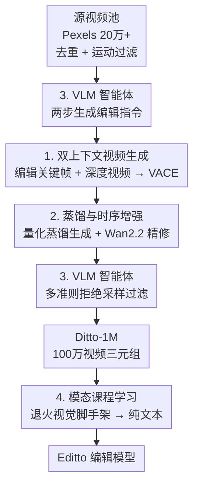

# Scaling Instruction-Based Video Editing with a High-Quality Synthetic Dataset

**会议**: CVPR 2026  
**论文**: [CVF Open Access](https://openaccess.thecvf.com/content/CVPR2026/html/Bai_Scaling_Instruction-Based_Video_Editing_with_a_High-Quality_Synthetic_Dataset_CVPR_2026_paper.html)  
**代码**: 待确认（论文称数据/模型/代码均在 project page 开源）  
**领域**: 视频生成 / 指令视频编辑 / 合成数据集  
**关键词**: 指令视频编辑、合成数据、in-context 视频生成、模态课程学习、VLM 过滤

## 一句话总结
本文提出数据合成框架 **Ditto**，用「图像编辑先验 + 深度视频」驱动一个 in-context 视频生成器、配合蒸馏加速与 VLM 智能体自动控质，耗费 1.2 万 GPU-天造出百万级指令视频编辑数据集 **Ditto-1M**，并用「模态课程学习」训出能纯靠文本指令编辑视频的模型 **Editto**，在自动指标和人评上都刷新了指令视频编辑的 SOTA。

## 研究背景与动机
**领域现状**：指令式图像编辑（InstructPix2Pix、FLUX.1 Kontext、Qwen-Image、Nano-Banana 等）已经做到非常精准、好用；但它的视频对应物却严重落后——给视频做编辑不仅要改内容，还要让改动在时间维度上一致地传播到每一帧。

**现有痛点**：视频编辑落后的根本原因是**缺大规模、高质量、多样化的配对训练数据**。已有的合成数据方案各有死穴：① 逐视频优化（per-video optimization）质量尚可但贵得离谱（高保真方法每条样本要约 50 GPU-分钟）；② 训练无关的「图像编辑后用 image-to-video 传播」（VEGGIE、InsViE 这类 lift-and-propagate）便宜可扩展，但时序一致性被传播模型卡死；③ Señorita 用「专家系统」把编辑任务拆成 18 个子类、每类配专用专家模型，质量好但难扩展、维护成本极高。

**核心矛盾**：现有 pipeline 始终陷在两组 trade-off 里——**保真度/多样性 ↔ 可扩展性**、**生成效率 ↔ 时序一致性**。想要质量就得牺牲规模，想要规模就得牺牲质量。

**本文目标**：造一条**既可扩展、又低成本、还能产出高保真结果**的数据合成流水线，并在其上训出一个真正「纯文本指令驱动」的视频编辑模型。

**切入角度**：作者注意到指令式**图像**编辑已经非常成熟，可以拿编辑好的关键帧作为强视觉先验；再叠加深度视频作为时空结构约束，喂给一个 in-context 视频生成器（VACE），就能既保编辑保真又保时序一致，绕开昂贵的逐视频优化。

**核心 idea**：用「成熟图像编辑器产出的编辑关键帧 + 深度视频」当双上下文，驱动 in-context 视频生成器批量合成数据；再用蒸馏降本、VLM 智能体自动控质把流水线推到百万规模；最后用模态课程学习把「需要视觉条件」的生成器改造成「只看文字指令」的编辑器。

## 方法详解

### 整体框架
整篇工作分两层：**Ditto 数据流水线**（造数据）+ **Editto 模型训练**（用数据）。

Ditto 流水线分三段，整条流水线刻意全部采用**开源模型**以保证可复现：
1. **预处理（约 60 GPU-天）**：从 Pexels 收集 20 万+ 专业级源视频，用视觉编码器特征做近重复去重、用 CoTracker3 跟踪点轨迹算运动分数过滤掉「几乎不动」的视频，再统一分辨率、统一到 20 FPS。
2. **核心生成（约 6000 GPU-天）**：用 Qwen2.5-VL 两步生成「视频密集描述 → 编辑指令」；用 Qwen-Image 把一个关键帧按指令编辑成 $f_k'$；用视频深度预测器抽出深度视频 $V_d$；把指令 $p$、编辑关键帧 $f_k'$、深度视频 $V_d$ 三模态喂给 in-context 视频生成器 VACE 合成编辑后视频 $V_e$。这一段用量化+蒸馏大幅降本。
3. **后处理（约 6000 GPU-天）**：用 VLM 做多准则拒绝采样过滤，再用 Wan2.2 的精细去噪器做 4 步轻量增强提升画质。

最终造出 **Ditto-1M**（约 100 万三元组），再用**模态课程学习**训出 Editto。

### 关键设计

**1. 双上下文 in-context 视频生成：用图像编辑先验定外观、用深度视频定结构**

这是攻破「保真/多样 ↔ 可扩展」trade-off 的核心。以往要么逐视频优化太贵，要么「编一帧再传播」时序一致性被传播模型封顶。本文换了个思路：先用成熟的指令图像编辑器 Qwen-Image $\mathcal{E}_{\text{img}}$ 把源视频里挑出的关键帧 $f_k$ 编辑成 $f_k' = \mathcal{E}_{\text{img}}(f_k, p)$，这个编辑好的帧定义了最终的风格、纹理等**外观**，是强视觉先验；同时用视频深度预测器从源视频抽出深度视频 $V_d$ 当**时空结构脚手架**，逐帧约束几何与运动。然后把两者连同指令 $p$ 一起喂进 in-context 视频生成器 VACE：

$$V_e = \mathcal{G}(V_d, f_k', p)$$

VACE 通过 attention 把 $f_k'$ 里定义的编辑忠实传播到整段序列，同时遵循 $V_d$ 给出的运动与结构，并保证语义与 $p$ 对齐。这样既继承了图像编辑器「编得准、编得多样」的成熟能力，又靠深度约束保住时序一致，且**不需要任何逐视频优化**——把质量和可扩展性同时拿到手。

**2. 蒸馏 + 量化 + 时序增强器：把生成成本压到 20%，还顺手提画质**

直接用全精度高保真视频模型每条样本约 50 GPU-分钟，造百万级数据根本扛不住；而粗暴换快的蒸馏模型又容易引入时序闪烁等伪影。本文做了两件事来破「效率 ↔ 质量」的局：生成阶段用**后训练量化 + 知识蒸馏**得到少步推理的生成模型，把计算量降到原始的约 **20%**，且对输出质量影响很小；后处理阶段不做简单超分，而是借 **Wan2.2 的 MoE 架构**——它有一个专管高噪声阶段结构/语义成形的粗去噪器和一个专管低噪声阶段细节精修的细去噪器。作者只用**细去噪器**：给 $V_e$ 加一点高斯噪声，再用细去噪器跑一个**仅 4 步**的反向过程，因为它天生擅长「对接近完成的视频做最小、保语义的微调」，于是能在不改变编辑语义的前提下去掉细微伪影、增强纹理细节。降本与提质被拆到流水线不同阶段，互不打架。

**3. VLM 智能体：既当编辑指令的"作者"，又当低质样本的"质检员"**

百万规模下人工写指令、人工验收完全不可行，所以作者部署一个自治的 VLM 智能体身兼两职。**生成端**：用 Qwen2.5-VL 两步提示——先生成视频密集描述 $c = \text{VLM}(V_s, p_{caption})$ 当语义锚点，再把视频和描述一起喂回去生成可信的编辑指令 $p = \text{VLM}(V_s, c, p_{instruct})$；这种「先理解内容再出指令」的条件化做法保证指令既贴合视频内容、又能覆盖从全局风格改造到局部物体修改的多样范围。**质检端**：用 VLM 当自动裁判做拒绝采样，按多条准则打分——指令保真（编辑是否真的符合 $p$）、内容保真（是否保留源视频语义与运动）、视觉质量（有无明显失真伪影）、安全合规（有无色情/暴力/恐怖等不当内容），任何一项不达阈值的三元组直接丢弃。一个智能体把「生成多样性」和「质量闸门」两个最难自动化的环节都包了。

**4. 模态课程学习（MCL）：把"靠视觉条件"的生成器退火成"靠纯文本"的编辑器**

数据合成时模型同时看到了编辑关键帧和深度视频，但推理部署时希望用户只给一句文字指令。直接微调让模型从视觉条件硬跨到纯文本条件，语义鸿沟太大、训练不稳。MCL 的做法是把模型本就擅长的「参考图像条件」当临时拐杖：训练初期同时给编辑参考帧（强视觉「脚手架」）和文字指令；随训练推进，**逐步退火**提供视觉脚手架的概率，最终完全丢掉它，逼模型把依赖从「它已经看懂的具体视觉目标」迁移到「更抽象的文字指令」。架构上保留 VACE 的 Context Branch（抽源视频/参考帧的时空特征）和 DiT Main Branch（在视觉上下文+文字嵌入联合引导下生成），训练用 flow matching 目标：

$$\mathcal{L} = \mathbb{E}_{t, \mathbf{z}_0, \mathbf{c}} \| \mathbf{v}_t(\mathbf{z}_t, t, \mathbf{c}) - (\mathbf{z}_0 - \mathbf{z}_t) \|^2$$

其中 $\mathbf{z}_0$ 是目标编辑视频的干净 latent，$\mathbf{z}_t$ 是其在时刻 $t$ 的加噪版本，$\mathbf{c}$ 是文本与视觉上下文的联合条件，$\mathbf{v}_t$ 是模型预测的从 $\mathbf{z}_t$ 指向 $\mathbf{z}_0$ 的向量场。课程退火让模型平稳跨过模态鸿沟，最终成为纯指令驱动的视频编辑器。

### 损失函数 / 训练策略
- **骨干**：以 in-context 视频生成器 VACE 为 backbone；冻结大部分预训练参数，仅微调 context blocks 的线性投影层，既保住生成先验又省算力。
- **优化**：AdamW，恒定学习率 $1\text{e-}4$，64 张 GPU，共约 16,000 步；前 5,000 步为课程 warm-up 阶段（逐步退火视觉脚手架）。
- **目标**：flow matching（式 5）。
- **数据集统计**：源视频 20 万+（约一半含人类活动）→ 过滤+编辑+再过滤 → 约 100 万编辑视频，其中约 70 万全局编辑（风格、环境等）、约 30 万局部编辑（物体替换/添加/移除）；最终分辨率 1280×720，每条 101 帧、20 FPS。总投入 >12,000 GPU-天（预处理约 60 + 生成约 6000 + 后处理约 6000）。

## 实验关键数据

### 主实验
测试集为 50 条来自各类网络来源的视频（**刻意排除 Pexels 以与训练集分布外**），每条配 5 条不同编辑指令。自动指标：CLIP-T（文-视频相似度，衡量是否跟随指令）、CLIP-F（帧间 CLIP 相似度，衡量时序一致）、VLM（整体效果打分）；人评（1000 票）：Edit-Acc（指令跟随）、Temp-Con（时序一致）、Overall（整体质量）。

| 方法 | CLIP-T ↑ | CLIP-F ↑ | VLM ↑ | Edit-Acc ↑ | Temp-Con ↑ | Overall ↑ |
|------|---------|---------|-------|-----------|-----------|-----------|
| TokenFlow | 23.63 | 98.43 | 7.10 | 1.70 | 1.97 | 1.70 |
| InsV2V | 22.49 | 97.99 | 6.55 | 2.17 | 1.96 | 2.07 |
| InsViE | 23.56 | 98.78 | 7.35 | 2.28 | 2.30 | 2.36 |
| **Ours (Editto)** | **25.54** | **99.03** | **8.10** | **3.85** | **3.76** | **3.86** |

Editto 在全部 6 个指标上都明显领先：自动指标里 VLM 从次优的 7.35 提到 8.10；人评里 Edit-Acc/Temp-Con/Overall 几乎是最强 baseline（InsViE）的 1.6 倍以上，指令跟随与时序平滑的优势尤为突出。

### 消融实验
论文的消融以定性图（Fig. 7）呈现，主要扫两个因素：训练数据规模与 MCL 开关。

| 配置 | 现象 | 说明 |
|------|------|------|
| 数据 ~60K → 120K → 250K → 500K | 风格编辑质量与对原视频内容/运动的保真随规模单调变好 | 验证大规模数据集的价值，性能随数据量有效 scaling |
| Full（w/ MCL） | 能正确理解指令完整语义意图 | 完整模态课程学习 |
| w/o MCL | 常常无法解读指令的完整语义意图 | 去掉课程学习后跨模态鸿沟难弥合 |

### 关键发现
- **数据规模是第一生产力**：性能随训练样本数有效 scaling，编辑风格质量与内容/运动保真都随之提升，直接印证「百万级高质量数据」这一核心卖点。
- **MCL 不可或缺**：没有模态课程学习，模型常读不懂指令的完整语义，说明从「视觉条件」到「纯文本条件」的过渡必须靠课程退火来稳住。
- **超越自家数据生成器**：最终训练好的 Editto 明显强于流水线里那个原始数据生成器（Fig. 6），尤其在处理关键帧之外「新出现的内容」时更稳——得益于规模化训练 + 课程学习 + 高质量过滤数据。
- **意外能力 sim2real**：用该数据反向训练（把风格化视频映射回真实源视频）能做合成到真实的迁移（Fig. 5），说明数据里含丰富写实信息，价值超出标准编辑任务本身。

## 亮点与洞察
- **「借力图像编辑器」是最聪明的一步**：与其从零造视频编辑能力，不如把已经非常成熟的指令图像编辑当成「外观先验工厂」，再用深度视频补上时序——把一个难问题拆成「成熟模块 + 结构约束」，省掉了昂贵的逐视频优化。
- **把降本和提质拆到不同阶段，互不冲突**：生成阶段蒸馏量化追速度（降到 20% 成本），后处理只借 Wan2.2 细去噪器跑 4 步追细节，避免了「为了快牺牲质量」的老套路，这种「分工式」思路可迁移到任何大规模生成数据流水线。
- **VLM 智能体一鱼两吃**：同一个 VLM 既造多样指令又当质检闸门，把数据合成里最难自动化的两端都自动化了，是「规模化合成数据」的可复用范式。
- **MCL 的退火视觉脚手架很优雅**：用模型已经会的视觉条件当拐杖、再逐步撤掉，平稳迁移到抽象文本条件——这套「先给强条件再退火」的课程思路对任何「训练时多模态、部署时单模态」的场景都适用。

## 局限与展望
- **算力门槛极高**：>12,000 GPU-天的合成成本对社区复现不友好，虽然组件全开源，但重建整套数据并非人人可负担。
- **质量上限受组件封顶**：编辑保真度依赖 Qwen-Image 的图像编辑能力、时序依赖 VACE 与深度预测器，任一上游模型的偏差（如关键帧编辑失败、深度估计错误）都会传导到最终视频。
- **消融偏定性**：数据规模与 MCL 的消融主要靠定性图展示，缺少在主表那套自动+人评指标上的定量曲线，规模收益的边际与 MCL 的量化增益不够清晰（⚠️ 以原文为准）。
- **测试规模偏小**：测试集仅 50 条视频×5 指令，且 VLM 既参与数据生成又参与评测，存在潜在评测偏好；更大规模、更中立的 benchmark 会更有说服力。
- **可改进**：把多个上游开源组件替换/集成为统一可训练模块，或引入更强的运动/几何约束以处理复杂遮挡与大运动，可能进一步提升保真度并降低对深度先验的依赖。

## 相关工作与启发
- **vs Inversion-based（TokenFlow / FateZero / Tune-A-Video）**：它们靠 DDIM 反演+特征传播或单视频微调避开配对数据，但计算重、质量受反演保真度限制、对复杂运动/遮挡脆弱；本文是 feed-forward 端到端，推理快且质量更稳。
- **vs Lift-and-propagate（VEGGIE / InsViE）**：它们编一帧再用 image-to-video 传播，时序一致性被传播模型封顶；本文用「编辑关键帧 + 深度视频」双上下文喂 in-context 生成器，时序由深度结构显式约束，质量更高。
- **vs Señorita（专家系统）**：它把任务拆 18 个子类、各配专家模型，质量好但难扩展、维护重；本文用「All-in-One」单一 in-context 生成器统一处理全局/局部编辑，更可扩展。
- **vs InstructPix2Pix（图像端范式源头）**：IP2P 用「LLM 造指令 + T2I 造图像对」合成图像三元组；本文把这一「合成配对数据再端到端训练」的范式成功搬到视频，并补上了视频特有的时序一致与模态迁移（MCL）两块拼图。

## 评分
- 新颖性: ⭐⭐⭐⭐⭐ 「图像编辑先验+深度约束驱动 in-context 生成」+「模态课程学习」组合新颖，把图像端范式系统性搬到视频。
- 实验充分度: ⭐⭐⭐⭐ 主表自动+人评齐全且领先明显，但消融偏定性、测试集偏小。
- 写作质量: ⭐⭐⭐⭐⭐ 问题分解清晰（四大挑战逐一拆解），流水线图文并茂，逻辑顺畅。
- 价值: ⭐⭐⭐⭐⭐ 开源百万级数据集+SOTA模型+可复用合成范式，对指令视频编辑社区推动很大。

<!-- RELATED:START -->

## 相关论文

- [\[CVPR 2026\] EasyV2V: A High-quality Instruction-based Video Editing Framework](easyv2v_a_high-quality_instruction-based_video_editing_framework.md)
- [\[CVPR 2026\] CoT-Edit: Let CoT Guide Instruction Video Editing](cot-edit_let_cot_guide_instruction_video_editing.md)
- [\[CVPR 2026\] VIVA: VLM-Guided Instruction-Based Video Editing with Reward Optimization](viva_vlm-guided_instruction-based_video_editing_with_reward_optimization.md)
- [\[CVPR 2026\] FFP-300K: Scaling First-Frame Propagation for Generalizable Video Editing](ffp-300k_scaling_first-frame_propagation_for_generalizable_video_editing.md)
- [\[CVPR 2026\] EgoEdit: Dataset, Real-Time Streaming Model, and Benchmark for Egocentric Video Editing](egoedit_dataset_real-time_streaming_model_and_benchmark_for_egocentric_video_edi.md)

<!-- RELATED:END -->
