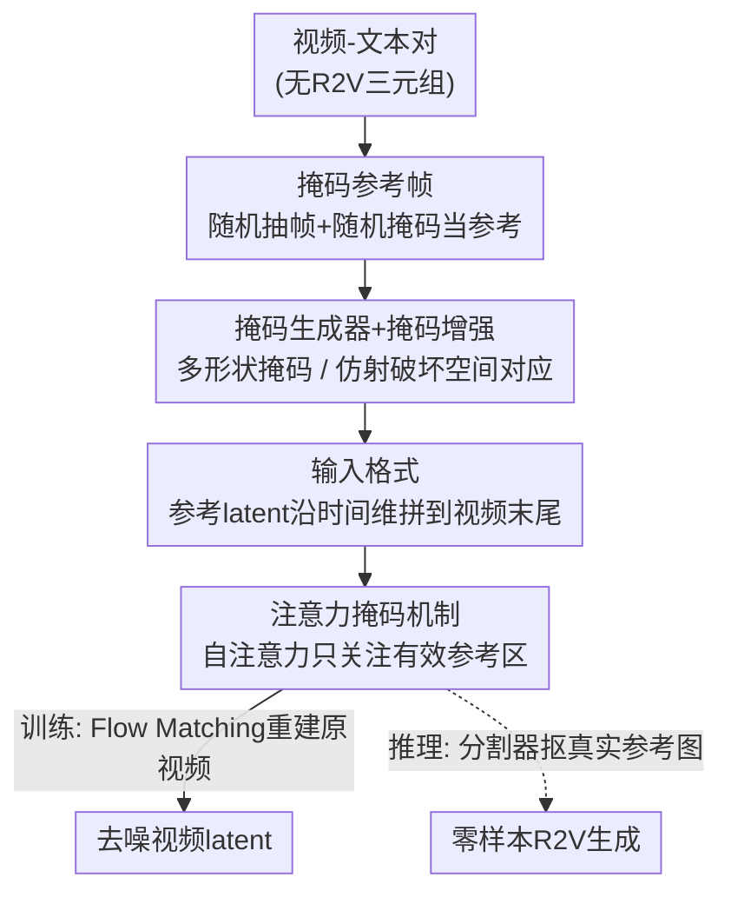

# Scaling Zero-Shot Reference-to-Video Generation

**会议**: CVPR 2026  
**论文**: [CVF Open Access](https://openaccess.thecvf.com/content/CVPR2026/html/Zhou_Scaling_Zero-Shot_Reference-to-Video_Generation_CVPR_2026_paper.html)  
**代码**: 无  
**领域**: 视频生成  
**关键词**: 参考图到视频(R2V)、零样本、掩码训练、身份保持、注意力掩码

## 一句话总结
本文提出 Saber——首个**不依赖 R2V 三元组数据**的参考图到视频框架，仅用海量视频-文本对训练，靠"把随机掩码后的视频帧当作参考图"的掩码训练策略 + 定制注意力掩码 + 掩码增强，在 OpenS2V-Eval 上零样本超过了所有用显式 R2V 数据训练的方法（含商业闭源 Kling1.6）。

## 研究背景与动机
**领域现状**：参考图到视频生成（Reference-to-Video, R2V）要在"跟随文本指令"和"保持参考图里主体的身份/外观"之间同时做对，是个人化视频生成（定制故事、虚拟分身）的关键一步。当前主流做法（Phantom、VACE、SkyReels-A2、HunyuanCustom、MAGREF、PolyVivid、BindWeave 等）几乎都走同一条路：先构造**显式的 R2V 三元组数据集**——即「参考图 + 视频 + 文本」配对（如 OpenS2V-5M、Phantom-Data），再在上面训模型。

**现有痛点**：构造这种三元组数据集的管线极其昂贵且难以扩展——要做候选提取、低质过滤、样本聚类、跨配对匹配，甚至调用昂贵 API 生成参考图。这导致两个后果：① 数据质量不可控、规模上不去（远不及 T2V/I2V 能用的海量视频-文本对）；② 数据集里的参考图多是人和常见物体，**主体多样性受限**，遇到没见过的类别就泛化差。

**核心矛盾**：R2V 的能力被"必须有专门的三元组数据"这个瓶颈死死卡住。T2V/I2V 能享受互联网级视频-文本对带来的规模红利，唯独 R2V 因为多了"参考图"这一维而被迫退回小而贵的人工数据。

**本文目标**：能不能**完全绕开三元组数据**，只用 T2V/I2V 同款的视频-文本对，就训出 R2V 能力？

**切入角度**：作者的关键观察是——视频帧本身就是天然的、和视频内容身份一致的"参考图"。如果从一段视频里随机抽几帧、再随机掩掉一部分，把这些"残缺帧"当作参考条件喂给模型，让它去重建原视频，模型就被迫学会"从参考上下文里抽取身份/外观特征并注入生成"，这恰恰就是 R2V 任务本身——而且**不需要任何额外标注**。

**核心 idea**：用"随机掩码后的视频帧"代替"人工采集的参考图"，把 R2V 任务在视频-文本对上**自监督地模拟出来**，从而把 R2V 训练扩展到 T2V/I2V 的数据规模。

## 方法详解

### 整体框架
Saber 基于开源的 Wan2.1-14B（VAE + DiT + umt5-xxl 文本编码器，用 Flow Matching 训练）微调。训练时**没有任何参考图**，只有视频-文本对：对每段视频，随机抽若干帧、用掩码生成器造出形状各异的二值掩码、再对图和掩码做同一套仿射增强，得到"掩码参考帧"；这些参考帧经 VAE 编码后，沿**时间维拼到视频 token 末尾**，并配一张"参考区域 mask"，在每个 transformer block 里通过**带注意力掩码的自注意力**与视频 token 交互（只关注有效参考区域），再经交叉注意力接入文本，最终预测去噪后的视频 latent。推理时换成真实参考图：用现成分割器抠出前景主体、背景填灰，按同样的输入格式喂进去，跑标准 Wan 采样即可——**训练和推理唯一的差别只是参考帧来自"随机掩码"还是"分割抠图"**。

### 关键设计

**1. 掩码帧作为参考：把 R2V 自监督地"假装"出来**

这是全文的根。痛点是显式 R2V 数据集贵且主体单一，作者干脆不要参考图——训练时对每段视频随机抽一帧 $I_k$，用掩码生成器产出二值掩码 $M_k \in \{0,1\}^{H\times W}$，经增强后得到 $\bar I_k$、$\bar M_k$，再逐像素相乘得到掩码参考帧 $\hat I_k = \bar I_k \odot \bar M_k$；重复 $K$ 次得到一组参考条件 $\{\hat I_k\}_{k=1}^K$。因为参考帧就是视频自己的帧、且每次掩的位置/形状都随机，模型被迫从这些"残缺线索"里学出身份-外观一致的表示来重建整段视频。相比固定的人工参考图，随机掩码天然提供了**海量、多样**的参考样本（任何视频任何帧任何掩码都行），主体类别不再受限于人和常见物体，泛化因此更强。消融证实：把同一架构改成在 OpenS2V-5M 真实 R2V 数据上微调（w/o masked training），总分反而掉 1.67%——掩码训练不仅省数据，效果还更好。

**2. 掩码生成器 + 掩码增强：制造多样性、并掐断"复制粘贴"**

光"随机掩码"还不够，怎么掩很讲究。掩码生成器从一组预定义形状（椭圆、Fourier blob、凸/凹多边形等）里随机选一种，并要让前景面积比 $r$ 落在目标区间 $[r_{min}, r_{max}]$：每种形状定义一个连续的 scale 参数（面积随 scale 单调增），用**二分搜索**找到满足面积比的 scale，遇到像素离散化对不齐时再做保持拓扑的微调（膨胀/腐蚀边界像素）。训练时按概率采样 $r$：10% 概率取 $r\in[0,0.1]$ 模拟"几乎没有参考信息"（让模型能应对参考图数量变化），80% 概率取 $[0.1,0.5]$ 对应典型主体，10% 概率取 $[0.5,1.0]$ 学习大参考图/背景场景——正是这套可调比例，让 Saber 推理时既能接前景主体也能接背景场景。

掩码增强解决的是 R2V 老大难的"copy-paste 伪影"（模型直接把参考图原样贴进视频）。作者对图 $I_k$ 和掩码 $M_k$ 施加**同一套随机仿射变换**（旋转 $[-10°,10°]$、缩放 $[0.8,2.0]$、错切 $[-10°,10°]$、50% 水平翻转），并保证变换后掩码区域不越界。这等于人为**打断了参考帧与目标视频帧之间的空间对应**——既然参考帧被旋转缩放过、不再和原帧像素对齐，模型就没法靠"照抄位置"取巧，只能真正去理解主体的形状与外观。消融里椭圆/Fourier/多边形单形状分别掉 3.35%/1.58%/1.42%、固定 $r=0.3$ 直接掉 6.18%，都说明**掩码多样性是掩码训练的命脉**；图 5 也直观显示无增强时 T 恤会"立"在石头上（复制粘贴），有增强后才自然地"躺"在石面上。

**3. 输入格式 + 注意力掩码：让参考与视频在 latent 里干净地交互**

有了掩码参考帧，怎么喂进 DiT 才不引入噪声？作者用了一个简单有效的输入格式：把参考图各自经 VAE 编码成 $z_{ref}=\{z_k\}_{k=1}^K$（**保持无噪**以提供准确条件），沿时间维拼到带噪视频 latent $z_t$ 的末尾；通道维再拼上掩码通道 $m_{ref}$ 与零值视频 latent，整体构成 transformer 输入：

$$z_{in} = \mathrm{cat}\Big[\;\mathrm{cat}[z_t,\,z_{ref}]_{\text{temporal}},\;\;\mathrm{cat}[m_{zero},\,m_{ref}]_{\text{temporal}},\;\;\mathrm{cat}[z_{zero},\,z_{ref}]_{\text{temporal}}\;\Big]_{\text{channel}}$$

其中 $m_{ref}$ 把每个 $M_k$ resize 到 latent 分辨率（1 表参考区、0 表非参考区），$z_{zero}$/$m_{zero}$ 是补在视频侧的零值占位。关键在**注意力掩码**：自注意力里视频 token 双向互相关注，而参考侧**只允许关注有效参考区域**（即掩码为 1 的地方），从而避免模型去关注被填灰的背景。自注意力输出再过交叉注意力与文本特征 $z_P$ 交互——视频 token 受文本引导、参考 token 学到语义对齐，使参考图信息在文本约束下被整合进生成。图 6 显示：去掉注意力掩码后主体周围会出现灰色伪影（模型没能从灰背景里正确抠出主体），加上后才有干净的主体分离与平滑融合。

### 损失函数 / 训练策略
沿用 Wan2.1 的 Flow Matching 目标：前向过程 $z_t=(1-t)z_0+t\epsilon$ 在数据与噪声间线性插值，模型预测目标速度

$$\mathcal{L}_{FM}=\mathbb{E}_{z_0,\epsilon,t,c}\big[\,\|(z_0-\epsilon)-\Psi_\theta(z_t,t,c)\|_2^2\,\big]$$

其中 $c$ 为文本 + 参考图导出的条件特征。Saber 从 Wan2.1-14B 微调，训练数据为 ShutterStock 视频 + Qwen2.5-VL 生成的字幕；AdamW、学习率 $1\text{e}{-5}$、全局 batch 64。推理用 BiRefNet 抠前景，50 步去噪、CFG 引导尺度 5.0。

## 实验关键数据

### 主实验
在 OpenS2V-Eval（180 个 prompt、7 个类别，含单/多参考的 face/human/entity 场景）上评测。Saber 以**零样本**身份拿到最高总分，且 NexusScore（主体一致性，最能代表 R2V 性能的指标）全场第一：

| 方法 | 类型 | Total↑ | NexusScore↑ | FaceSim↑ | NaturalScore↑ |
|------|------|--------|-------------|----------|---------------|
| Kling1.6 | 闭源商业 | 56.23% | 45.89% | 40.10% | 74.59% |
| Phantom-14B | 显式 R2V 数据 | 56.77% | 37.43% | 51.46% | 69.35% |
| VACE-14B | 显式 R2V 数据 | 57.55% | 44.08% | 55.09% | 67.04% |
| BindWeave | 显式 R2V 数据 | 57.61% | 46.84% | 53.71% | 66.85% |
| **Saber (Ours)** | **零样本** | **57.91%** | **47.22%** | 49.89% | 72.55% |

总分上 Saber 比 Kling1.6 高 1.68%、比 Phantom 高 1.14%、VACE 高 0.36%、BindWeave 高 0.30%；NexusScore 上更是超 Phantom 9.79%、VACE 3.14%、BindWeave 0.36%——说明掩码训练在零样本设定下学到的主体特征比所有 R2V 数据训练的模型都更一致。

### 消融实验

| 配置 | Total↑ | NexusScore↑ | 说明 |
|------|--------|-------------|------|
| Saber (完整) | 57.91% | 47.22% | 全套掩码训练 |
| w/o masked training | 56.24% | 45.33% | 改用 OpenS2V-5M 真实 R2V 数据，掉 1.67% |
| ellipse only | 54.56% | 40.28% | 只用椭圆掩码，掉 3.35% |
| fourier only | 56.33% | 44.82% | 只用 Fourier，掉 1.58% |
| polygon only | 56.49% | 45.24% | 只用多边形，掉 1.42% |
| fixed r = 0.3 | 51.73% | 39.20% | 固定前景面积比，掉 6.18% |

### 关键发现
- **掩码多样性比"真实参考图"更重要**：用真实 R2V 数据反而不如随机掩码（-1.67%），固定面积比损失最大（-6.18%），证明"形状多样 + 面积比多样"才是掩码训练奏效的核心。
- **掩码增强专治 copy-paste**：去掉增强会出现把参考内容原样贴进视频的伪影（图 5）；注意力掩码则消除主体周围的灰色残留（图 6）。
- **涌现能力**：① 同一主体多视角输入（机器人正/侧/背面）能被识别为同一物体并融合成连贯视频（图 7）；② 跨模态对齐——交换 prompt 里的主体描述（衣服颜色、左右位置），生成结果会准确随之变化（图 8），说明自注意力（视频↔参考）+ 交叉注意力（接文本）确实建立了稳健的参考图-文本对齐。

## 亮点与洞察
- **"数据瓶颈"被一招化解**：R2V 长期被"必须有三元组数据"卡死，本文用"视频帧即天然参考图"的洞察把任务自监督化，直接继承了 T2V/I2V 的数据规模红利——这是范式级而非增量级的改变。
- **随机掩码同时身兼三职**：既造出无限多样的参考样本（提泛化）、又通过仿射增强打断空间对应（治 copy-paste）、还通过面积比采样让一个模型同时支持"前景主体 / 背景场景 / 可变参考数"——一个简单机制解决多个问题，很优雅。
- **可迁移思路**：把"随机遮挡 + 重建"当作"无标注地模拟带条件任务"的通用配方，可启发其他缺配对数据的条件生成任务（如参考图到 3D、参考音到视频）用自监督方式绕开数据构造。

## 局限与展望
- **参考图过多会崩**：作者承认当参考图数量显著增加（如 12 张）时，生成会退化为"把参考拼一起但没有连贯理解"的碎片化构图。
- **侧重身份保持、运动控制偏弱**：Saber 主要保证身份一致与视觉连贯，复杂 prompt 下的细粒度运动控制与时间一致性仍是挑战。
- **依赖外部分割器**：推理时靠 BiRefNet 抠前景，分割质量会直接影响参考条件——分割失败的主体可能注入失败（笔记补充观察，⚠️ 以原文为准）。
- **改进思路**：探索把大量参考图更有效地整合进统一生成，以及自适应引导以提升可控性与真实感。

## 相关工作与启发
- **vs Phantom / VACE / BindWeave（显式 R2V 数据训练）**：它们都靠构造昂贵的图-视频-文本三元组数据集（候选提取、聚类、过滤、API 生成参考图），Saber 完全不用这类数据、只用视频-文本对；区别在于把"采集参考图"换成"随机掩码视频帧"，结果在 OpenS2V-Eval 上零样本反超它们，且省去全部数据构造成本。
- **vs SkyReels-A2 / HunyuanCustom / MAGREF / PolyVivid**：这些方法在"如何注入参考特征"上做文章（联合嵌入、LLaVA 融合、区域掩码拼接、3D-RoPE 等），但都建立在显式 R2V 数据之上；Saber 的贡献正交且更上游——它解决的是"参考数据从哪来"，注入机制本身只用了简单的时间维拼接 + 注意力掩码。
- **vs Kling1.6（闭源商业）**：在不知其训练数据的前提下，Saber 以开源 + 零样本设定总分反超 1.68%，说明"会怎么训"可能比"有多少专有数据"更关键。

## 评分
- 新颖性: ⭐⭐⭐⭐⭐ 用"掩码视频帧即参考图"把 R2V 自监督化，从根上绕开三元组数据瓶颈，范式级创新
- 实验充分度: ⭐⭐⭐⭐ OpenS2V-Eval 主表 + 详尽掩码消融 + 多视角/跨模态涌现能力验证，较扎实；缺与更多零样本基线对比
- 写作质量: ⭐⭐⭐⭐⭐ 动机—方法—实验逻辑链清晰，图示到位，掩码设计讲得透
- 价值: ⭐⭐⭐⭐⭐ 把 R2V 训练成本降到 T2V/I2V 同级，对可扩展个性化视频生成意义重大

<!-- RELATED:START -->

## 相关论文

- [\[CVPR 2026\] StoryTailor: A Zero-Shot Pipeline for Action-Rich Multi-Subject Visual Narratives](storytailora_zero-shot_pipeline_for_action-rich_multi-subject_visual_narratives.md)
- [\[CVPR 2026\] Are Image-to-Video Models Good Zero-Shot Image Editors?](are_image-to-video_models_good_zero-shot_image_editors.md)
- [\[CVPR 2026\] Rethinking Position Embedding as a Context Controller for Multi-Reference and Multi-Shot Video Generation](rethinking_position_embedding_as_a_context_controller_for_multi-reference_and_mu.md)
- [\[CVPR 2026\] LoL: Longer than Longer, Scaling Video Generation to Hour](lol_longer_than_longer_scaling_video_generation_to_hour.md)
- [\[ICML 2026\] WIND: Weather Inverse Diffusion for Zero-Shot Atmospheric Modeling](../../ICML2026/video_generation/wind_weather_inverse_diffusion_for_zero-shot_atmospheric_modeling.md)

<!-- RELATED:END -->
