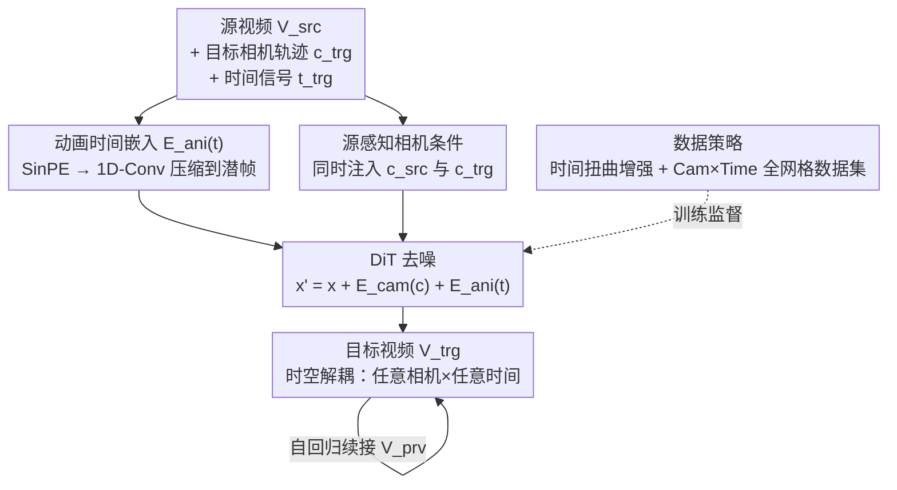

# SpaceTimePilot: Generative Rendering of Dynamic Scenes Across Space and Time

**会议**: CVPR 2026  
**论文**: [CVF Open Access](https://openaccess.thecvf.com/content/CVPR2026/html/Huang_SpaceTimePilot_Generative_Rendering_of_Dynamic_Scenes_Across_Space_and_Time_CVPR_2026_paper.html)  
**代码**: [项目页](https://zheninghuang.github.io/Space-Time-Pilot/)  
**领域**: 视频生成 / 扩散模型 / 动态场景渲染  
**关键词**: 视频扩散模型, 时空解耦, 新视角合成, 相机控制, 动画时间嵌入

## 一句话总结
SpaceTimePilot 是首个把"相机视角（空间）"和"运动进度（时间）"解耦开来分别控制的视频扩散模型——给一段单目视频，它能在生成过程中独立改写相机轨迹和播放节奏（子弹时间、慢动作、倒放、任意混合），从而沿任意时空轨迹重渲染这个动态场景。

## 研究背景与动机

**领域现状**：视频是 3D 世界演化在 2D 上的投影，背后有两个独立的生成因子——空间变化（相机视角）和时间演化（场景运动）。要从一段视频里自由探索这个场景，理想状态是能任意"换个角度看"（reframe）+ "换个时刻看"（retime）。主流做法分两条路：一是先做 4D 重建（NeRF / 动态 Gaussian Splatting）再重渲染；二是近年的视频扩散方法，直接以相机参数为条件生成新视角。

**现有痛点**：4D 重建路线在新视角下常出现几何畸变和伪影，且依赖大量预处理；视频扩散路线虽然在相机控制（空间）上越来越强（ReCamMaster、TrajectoryCrafter、甚至 Genie-3 这类可交互探索），但**时间维度几乎被锁死**——它们默认时间是单调正向流动的，无法做倒放、子弹时间、慢动作这类"对时间下手"的操作。少数尝试解耦时空的工作（4DiM、CAT4D）要么仍绑死在 4D 重建管线上、可扩展性差，要么只能产出稀疏离散帧而非连续视频。

**核心矛盾**：要训练一个能同时控制相机和时间的模型，需要"同一个动态场景、同时有相机运动 + 多样时间播放"的配对视频——而这种数据只存在于受控摄影棚，开源数据集里**根本不存在**。没有监督信号，模型就分不清"画面变了"到底是相机动了还是场景往前演化了，于是时空纠缠在一起。

**本文目标**：拆成两件事——(1) 设计一个能注入扩散模型、且不和相机信号打架的时间控制表示；(2) 在没有现成配对数据的前提下，造出能教会模型"时间可以非单调变化"的监督信号。

**切入角度**：作者引入一个新概念——"**动画时间**（animation time）"$t$，专门刻画源视频里场景运动的时间状态。把"看哪个角度"和"看哪个时刻"显式拆成两路独立信号，时空解耦就从架构层面成立了。

**核心 idea**：用一个独立的"动画时间"嵌入信号 $t$ 把时间控制从相机控制里剥离出来，再用"时间扭曲增强 + 全网格合成数据集"两套数据策略，把"时间可以任意重映射"这件事教给视频扩散模型。

## 方法详解

### 整体框架

SpaceTimePilot 接收一段源视频 $V_{src}\in\mathbb{R}^{F\times C\times H\times W}$，外加一条目标相机轨迹 $c_{trg}\in\mathbb{R}^{F\times 3\times 4}$ 和一条时间控制信号 $t_{trg}\in\mathbb{R}^{F}$，输出一段目标视频 $V_{trg}$：它保留源视频的场景动态、几何和外观，但严格遵循指定的相机运动和时间进度。骨干是一个潜空间视频扩散模型（3D-VAE 压缩 + DiT 去噪，基于 Wan-2.1 T2V-1.3B），在 patch token 上同时加入相机嵌入和动画时间嵌入两路条件。

整个方法围绕三个支柱搭起来：**(1) 动画时间表示** 让时间能被独立操控；**(2) 两套数据策略**（时间扭曲增强 + Cam×Time 合成数据集）凭空造出时空解耦所需的监督信号；**(3) 源感知相机条件** 让相机能从任意起始角度精确控制。三者缺一不可：时间表示给了"控制旋钮"，数据策略给了"训练信号"，相机条件保证空间这一路也精确。

### 关键设计

**1. 动画时间嵌入：用独立的时间信号把时间从相机里剥出来**

最直接的想法是复用扩散模型里现成的潜帧位置编码 $\text{RoPE}(f')$ 来控制时间，但作者发现它根本不行——RoPE 会同时约束时间和相机运动，两路信号纠缠在一起，你想倒放结果相机也跟着乱。问题根源是：帧索引位置编码天然假设"时间单调向前"，它没有"时间可以任意重排"的语义空间。

于是作者引入一个专门的时间控制参数 $t\in\mathbb{R}^{F}$。操控 $t_{trg}$ 就能改写输出视频的播放进度：把 $t_{trg}$ 设成常数就把画面锁死在某一时刻（子弹时间），把帧索引反过来就得到倒放。具体注入方式是：先对源/目标时间序列各算正弦嵌入 $e_{src}=\text{SinPE}(t_{src})$、$e_{trg}=\text{SinPE}(t_{trg})$，再用两层一维卷积逐步把 $F$ 维嵌入压到潜帧空间 $F'$ 维：$e=\text{Conv1D}_2(\text{Conv1D}_1(e))$，最后把时间特征加到相机特征和视频 token 上：

$$x' = x + E_{cam}(c) + E_{ani}(t)$$

为什么用 1D 卷积而不是均匀采样或 MLP？因为每个潜帧其实对应原始视频里一段连续的时间块，直接在粗粒度的 $f'$ 层做正弦嵌入会丢掉细粒度；1D 卷积能把细粒度的 $F$ 维信息学成一个紧凑表示压进 $F'$ 维，既保留精度又稳定。消融里它把 PSNR 从 14.10（均匀采样）拉到了配合 Cam×Time 后的 21.29。

**2. 时间扭曲增强：把现成多视角数据集"扭"出时间变化的监督信号**

训练时空解耦最大的拦路虎是没有配对数据。作者的破局点很巧：现有多视角视频数据集（ReCamMaster、SynCamMaster）虽然源/目标视频的时间序列总是一样的（学不到时间控制），但可以**在目标视频上施加时间扭曲函数** $\tau:[1,F]\to[1,F]$ 人为造出时间差异。给源视频 $V_{src}=\{I^f_{src}\}$ 和目标 $V_{trg}=\{I^f_{trg}\}$，把目标按 $\tau$ 重排成 $V'_{trg}=\{I^{\tau(f)}_{trg}\}$，源时间戳取 $t_{src}=1:F$，扭曲后时间戳 $t_{trg}=\tau(t_{src})$。

作者设计了五种扭曲操作覆盖各类非线性时间效果：(i) 倒放（reversal）、(ii) 加速、(iii) 冻结（freeze）、(iv) 分段慢动作、(v) zigzag 运动（时间反复来回折返）。经过这些增强，配对的 $(V_{src}, V'_{trg})$ 在相机轨迹和时间动态上**同时不同**——这正是模型学习解耦表示所缺的那个清晰信号。相比之前那些靠"静态场景 + 单调时间"凑监督的方法（信号弱、时空容易混淆），时间扭曲提供的时间变化既多样又显式，几乎零成本就把"时间可以任意重映射"教给了模型。

**3. Cam×Time 全网格合成数据集：给精细连续的时空控制补上密集监督**

时间扭曲解决了"有没有解耦信号"的问题，但要做到**精细、连续**的时间控制（平滑调节、任意时刻子弹时间），还需要一个系统覆盖时空两维的数据集。作者用 Blender 渲了 Cam×Time：给定一条相机轨迹和一个带动画的主体，**穷举采样相机-时间的完整网格** $(c,t)$——对每个动画，沿轨迹的 120 个相机位置 × 全部时间状态都渲一遍。规模是 100 个室内外场景 × 750 个动画 × 4 条相机路径，共 **36 万段视频**。

关键在这个"全网格"结构（Tab. 1）：网格里任意两条 $F$ 帧序列都能组成一对源-目标，源视频通常取网格对角线（相机和时间同步推进），目标则在网格里更自由地采连续序列——于是目标时间能在 0–120 帧全范围里任意取，源时间 $t_{src}=1{:}120$、目标时间 $t_{trg}\in\{1,2,\dots,120\}^{120}$。这种"源固定、目标任取"的全覆盖正是已有数据集（无论 RE10k 静态还是 Kubric-4D/ReCamMaster 动态，源目标时间都被绑成一样）给不了的强监督，让模型学会子弹时间、运动稳定、任意控制组合。作者把其中一部分划作测试集，当作可控视频生成的 benchmark 发布。

**4. 源感知相机条件：让相机能从任意起始角度精确控制**

之前的新视角方法（如 ReCamMaster）有个硬假设：源/目标视频的第一帧必须相同，目标相机轨迹是相对第一帧定义的。这带来两个毛病——一是它忽略源视频自身的轨迹，用目标轨迹去算源特征会次优；二是训练数据里第一帧永远一样，模型实际上学成了"无脑复制第一帧"，给什么相机姿态都不太理它。

作者的修法是**同时注入源和目标两条相机轨迹**：用预训练位姿估计器估出源视频和目标视频各自的相机位姿 $c_{src}$、$c_{trg}$，分别加到对应的 token 上，再沿帧维把目标和源 token 拼起来送进 DiT：

$$x'_{src} = x_{src} + E_{cam}(c_{src}) + E_{ani}(t_{src})$$
$$x'_{trg} = x_{trg} + E_{cam}(c_{trg}) + E_{ani}(t_{trg}),\quad x' = [x'_{trg}, x'_{src}]_{\text{frame-dim}}$$

这样模型同时拿到源和目标的相机上下文，能精确遵循完整目标轨迹、且第一帧可以是任意角度。实验里一个反直觉的发现印证了它的必要性：单纯给 ReCamMaster 喂更多"首帧不同"的增强数据（ReCamM+Aug）反而让误差更大——没有 $c_{src}$ 这个显式参照，更多样的首帧只会让模型更困惑；只有把 $c_{src}$ 显式加进去，相机精度才大幅提升。另外，不强制源/目标共享第一帧这一点，也正是自回归续接长视频（每段以前一段 $V_{prv}$ + 源视频为条件）能灵活控相机的前提。

## 实验关键数据

实现细节：骨干 Wan-2.1 T2V-1.3B，输出 21 个潜帧、经 3D-VAE 解码成 81 帧 RGB；默认在 ReCamMaster + SynCamMaster（带时间扭曲增强）+ Cam×Time 上联合训练。

### 主实验

时间控制评测（在 Cam×Time 留出测试集，固定相机姿态只变时间信号，含倒放 / 速度 / 子弹时间）：

| 方法 | PSNR↑ (Avg) | SSIM↑ (Avg) | LPIPS↓ (Avg) |
|------|------|------|------|
| TrajectoryCrafter † | 14.56 | 0.6421 | 0.5276 |
| ReCamM+preshuffled † | 14.49 | 0.5674 | 0.5392 |
| ReCamM+jointdata | 17.86 | 0.7250 | 0.3073 |
| **SpaceTimePilot (Ours)** | **21.29** | **0.7459** | **0.2308** |

（† 表示用简单帧重排算子在推理前模拟时间操作。）SpaceTimePilot 在 Direction / Speed / Bullet 三种时间控制下全面领先，PSNR 比最强 baseline 高约 3.4。

相机控制评测（real-world OpenVideoHD 90 视频 × 20 条相机轨迹，含 10 条与源同起始姿态、10 条不同起始姿态）：

| 方法 | RelRot↓ | AbsRot↓ | RTA@30↑ |
|------|------|------|------|
| TrajectoryCrafter | 5.94 | 6.93 | 25.93% |
| ReCamM | 4.26 | 10.08 | 10.20% |
| ReCamM+Aug | 3.66 | 11.74 | 5.93% |
| **SpaceTimePilot (ours)** | **2.71** | **5.63** | **54.44%** |

源感知相机条件让首帧可从任意角度起，同时把相机精度做到最好（RTA@30 从 ~26% 拉到 54%）。VBench 视觉质量六维评测上，本方法与 baseline 总体相当（ImgQ 0.6486 最高），说明解耦控制没有牺牲生成保真度。

### 消融实验

时间嵌入压缩器消融（Tab. 5）：

| 配置 | PSNR↑ | SSIM↑ | LPIPS↓ | 说明 |
|------|------|------|------|------|
| Uniform Sampling | 14.10 | 0.5981 | 0.5039 | 在粗潜帧 $f'$ 层直接做正弦嵌入 |
| 1D-Conv | 14.75 | 0.6134 | 0.4878 | 仅 ReCamMaster+SynCamMaster 训练 |
| 1D-Conv + Joint Data | 15.41 | 0.6252 | 0.4830 | 额外加静态场景数据集 |
| **1D-Conv + Cam×Time** | **21.29** | **0.7459** | **0.2308** | 完整模型 |

### 关键发现
- **数据集是最大功臣**：1D-Conv 单独只到 14.75，加静态场景数据集只微涨到 15.41，换成 Cam×Time 直接跳到 21.29——说明时空解耦的瓶颈不在架构而在监督信号，静态场景的"单一时间模式"几乎学不到时间控制。
- **压缩器选择影响动作平滑度**：均匀采样产生明显伪影，MLP 压缩器会让相机运动突兀跳变，只有 1D 卷积能既锁死动画时间、又让相机平滑移动（Fig. 7）。
- **更多增强不等于更好**：ReCamM+Aug（更多首帧不同的增强）相机误差反而比原版 ReCamM 更大，必须配上显式的源相机条件 $c_{src}$ 才能转化成精度提升——增强本身会引入歧义，得有参照锚住。

## 亮点与洞察
- **"动画时间"这个抽象很关键**：把"时间"显式抽成一个可被任意函数 $\tau$ 重映射的独立信号，而不是绑死在帧索引上，是整篇能做倒放/子弹时间的根。这种"把纠缠因子显式拆成独立条件再注入"的思路可迁移到任何需要解耦控制的生成任务。
- **零成本造监督的巧思**：时间扭曲增强不收集任何新数据，仅靠对现成多视角视频的目标序列做五种重排，就凭空造出"相机和时间同时变"的配对监督——这是数据匮乏场景下极聪明的 bootstrap。
- **全网格渲染的数据观**：Cam×Time 不是简单多渲点视频，而是"穷举相机×时间网格、任意两序列可配对"的结构化设计，把数据集本身变成了一个连续可采样的时空场，这种构造法对未来可控生成 benchmark 有参考价值。

## 局限与展望
- **强依赖合成数据**：Cam×Time 是 Blender 渲的合成数据，时空解耦的精细控制能力很大程度建立在合成全网格监督上，真实复杂场景（强反光、复杂遮挡、非刚体形变）下的泛化没有充分验证。
- **位姿估计是隐含瓶颈**：源感知相机条件依赖预训练位姿估计器（评测里用 SpatialTracker-v2 / DUSt3R 估位姿），真实视频位姿估不准时控制精度会受连累，论文未量化这一误差传导。
- **骨干较小、分辨率/时长有限**：基于 1.3B 的 Wan-2.1、单段 81 帧，长视频靠简单自回归续接，长程一致性和累积漂移问题（论文放到补充材料）仍是开放问题。
- **改进思路**：可探索把动画时间嵌入扩展到更高帧率/更长序列、用真实捕获数据补充合成数据的 domain gap，以及对位姿估计误差做鲁棒性建模。

## 相关工作与启发
- **vs ReCamMaster [1]**：ReCamMaster 只做相机（空间）控制、时间单调正向，且假设源/目标首帧相同导致"复制首帧"。本文继承其相机条件思想，但加了动画时间一路实现时间控制，并用源感知条件 $c_{src}$ 解除首帧约束——相机精度和时间能力都全面超过它。
- **vs TrajectoryCrafter [46]**：它用 warp-and-inpaint 管线，靠推理前帧重排模拟时间操作，但倒放后相机姿态会错乱（源最后一帧的相机错误出现在生成首帧）。本文在生成过程内部解耦时空，倒放时相机仍精确。
- **vs 4DiM [39] / CAT4D [41]**：这两者也想解耦时空，但前者靠 Masked FiLM + 静态/动态多模态联合训练、信号弱，后者绑死在显式 4D 重建管线上、可扩展性差，且只产稀疏离散帧。本文不做 4D 重建、直接在 text-to-video 扩散上加时间嵌入 + 精化相机条件，产出连续视频且控制更细粒度。

## 评分
- 新颖性: ⭐⭐⭐⭐⭐ 首个把相机（空间）与动画时间（时间）真正解耦、产出连续可控视频的扩散模型，"动画时间"抽象 + 时间扭曲 bootstrap 都很原创
- 实验充分度: ⭐⭐⭐⭐ 时间/相机/视觉质量三类评测 + 压缩器消融齐全，但真实场景泛化与位姿误差传导验证偏少
- 写作质量: ⭐⭐⭐⭐ 动机和方法讲得清楚，图示丰富；CVF 版本部分段落有明显拼写错误（不影响理解）
- 价值: ⭐⭐⭐⭐⭐ 同时贡献新能力（4D 时空自由探索）、新方法（时间扭曲 + 源感知相机）和新数据集（36 万段 Cam×Time benchmark），对可控视频生成社区价值高

<!-- RELATED:START -->

## 相关论文

- [\[CVPR 2026\] LaVR: Scene Latent Conditioned Generative Video Trajectory Re-Rendering using Large 4D Reconstruction Models](lavr_scene_latent_conditioned_generative_video_trajectory_re-rendering_using_lar.md)
- [\[ICCV 2025\] ReCamMaster: Camera-Controlled Generative Rendering from A Single Video](../../ICCV2025/video_generation/recammaster_camera-controlled_generative_rendering_from_a_single_video.md)
- [\[CVPR 2026\] Inference-time Physics Alignment of Video Generative Models with Latent World Models](inference-time_physics_alignment_of_video_generative_models_with_latent_world_mo.md)
- [\[CVPR 2026\] EditCtrl: Disentangled Local and Global Control for Real-Time Generative Video Editing](editctrl_disentangled_local_and_global_control_for_real-time_generative_video_ed.md)
- [\[CVPR 2026\] Diff4Splat: Repurposing Video Diffusion Models for Dynamic Scene Generation](diff4splat_controllable_4d_scene_generation_with_latent_dynamic_reconstruction_m.md)

<!-- RELATED:END -->
